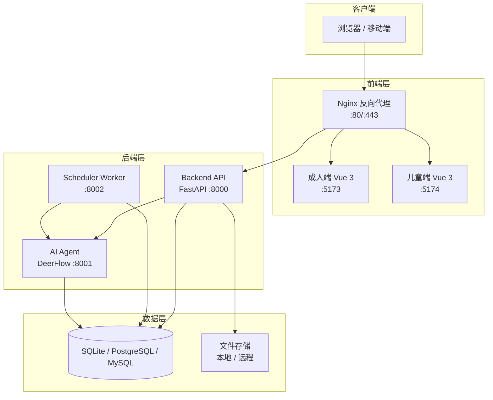
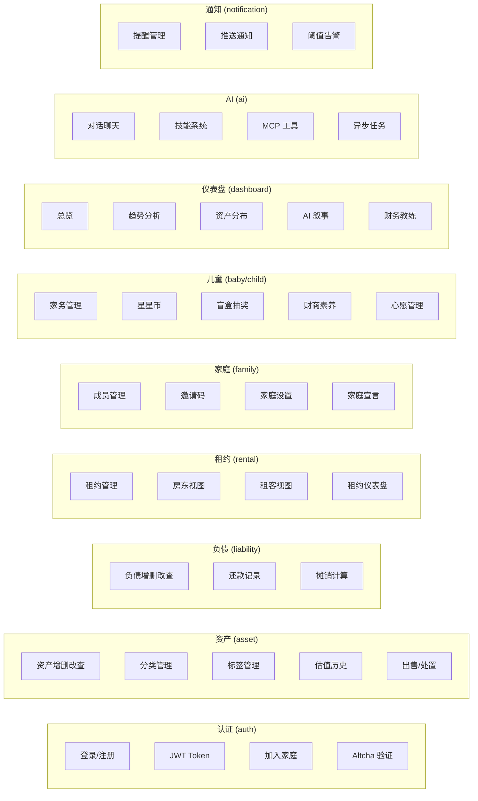
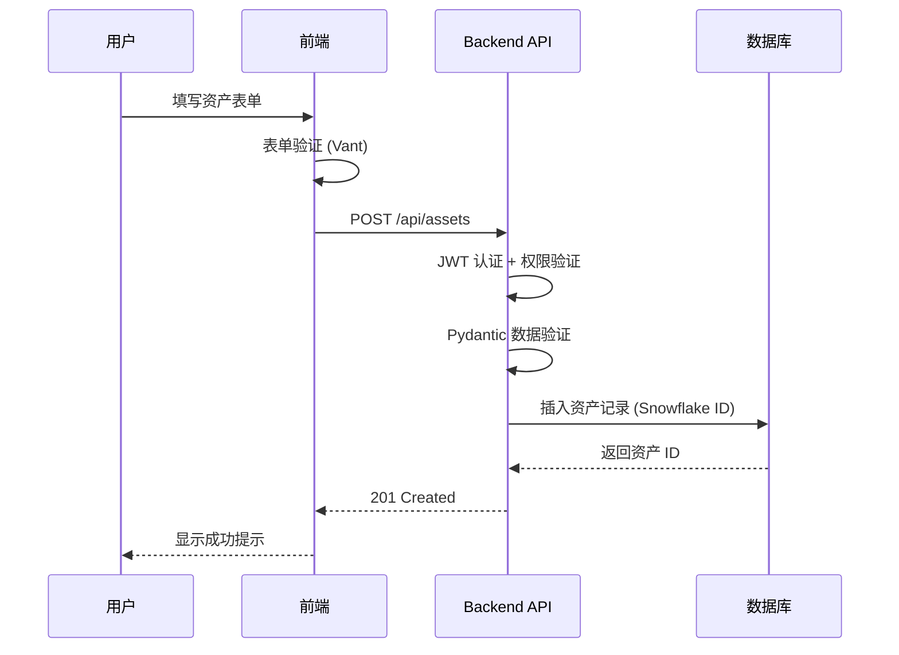
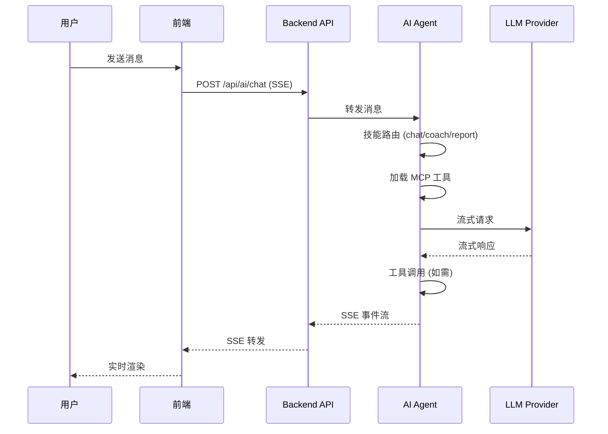
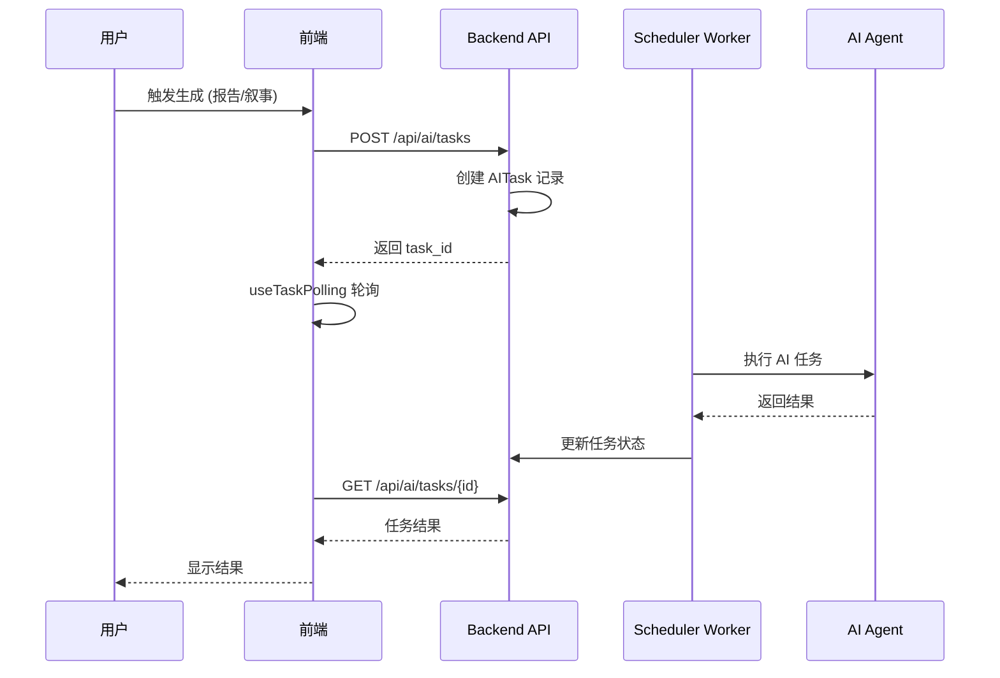
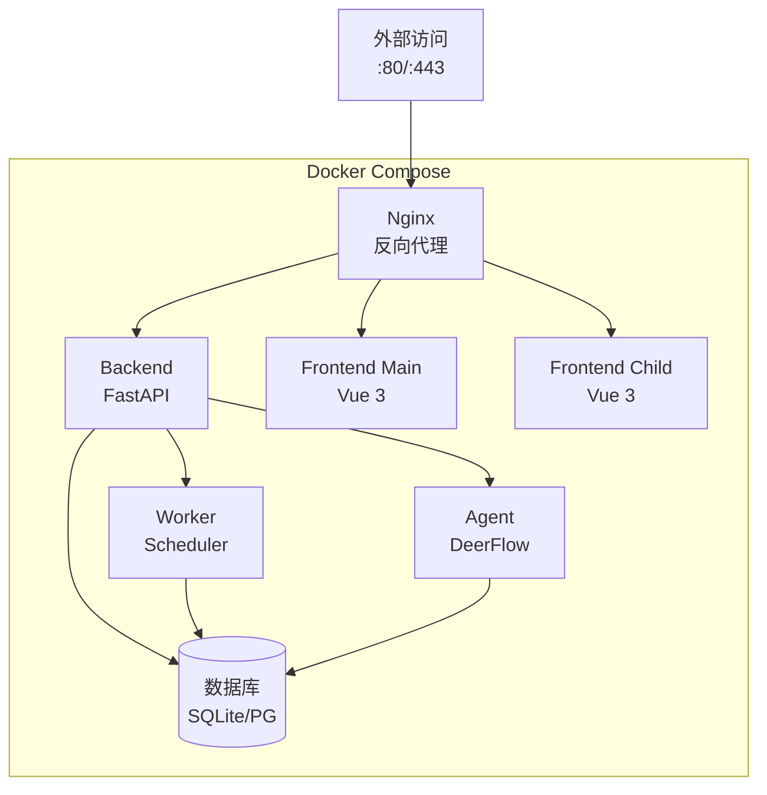

# Numina 架构文档

## 系统架构

## 模块划分

### 后端服务

| 服务 | 端口 | 职责 |
|------|------|------|
| **Backend** | 8000 | REST API、认证、资产管理、家庭管理、仪表盘、通知 |
| **Agent** | 8001 | AI 对话、技能执行、MCP 工具、DeerFlow 集成 |
| **Scheduler Worker** | 8002 | 定时任务、提醒通知、数据聚合、报表生成 |

### 后端模块

### 前端应用

| 应用 | 端口 | 职责 |
|------|------|------|
| **Main (成人端)** | 5173 | 资产管理、负债管理、租约、仪表盘、AI 聊天、家庭管理、儿童管理 |
| **Child (儿童端)** | 5174 | 心愿、任务、星星币、盲盒、徽章、财商学习 |

### 共享包

| 包 | 说明 |
|------|------|
| **@numina/auth** | 认证 stores、组件、Axios 拦截器 |
| **@numina/math** | 纯业务计算函数（日均成本、收益率等） |
| **server/packages/core** | 基础设施：配置、Snowflake ID、熔断器 |
| **server/packages/db** | SQLAlchemy 模型、数据库会话管理 |
| **server/packages/domain** | 领域逻辑、计算函数 |
| **server/packages/security** | JWT 认证、bcrypt 加密、文件加密 |
| **server/packages/storage** | 文件存储后端、加密存储 |

## 数据流向

### 资产录入流程

### AI 对话流程

### AI 任务异步流程

## AI 技能系统

Agent 采用基于 DeerFlow 的技能系统架构：

| 技能 | 触发方式 | 说明 |
|------|----------|------|
| **chat** | 默认对话 | 通用对话，可搜索家庭数据 |
| **chat-search** | Web 搜索开启 | 带联网搜索的对话 |
| **finance-coach** | /ai/chat skill=finance-coach | 个性化财务建议 |
| **asset-report** | /ai/chat skill=asset-report | 资产分析报告 |
| **wish-advice** | /ai/chat skill=wish-advice | 心愿评估建议 |
| **dashboard-narrative** | 异步任务 | 仪表盘 AI 摘要 |
| **literacy-weekly-report** | 异步任务 | 儿童财商周报 |
| **import-parse** | 文件导入 | 解析导入文件 |
| **skill-creator** | 管理页面 | 创建自定义技能 |
| **skill-installer** | 管理页面 | 安装社区技能 |

### MCP 工具集成

Agent 支持 MCP (Model Context Protocol) 工具：

| 类别 | 工具 |
|------|------|
| **数据查询** | 资产列表、负债列表、家庭概览、成员信息 |
| **数据写入** | 批量创建资产、批量更新、批量删除 |
| **文件处理** | 文件上传、PDF 识别 (Vision) |
| **Web 搜索** | 联网搜索 (可选) |

## 技术选型理由

| 决策 | 理由 |
|------|------|
| Vue 3 + Composition API | 复杂逻辑复用，TypeScript 原生支持 |
| Vant 4 | 移动端 H5 组件库，组件丰富，暗黑模式支持 |
| Pinia | 比 Vuex 更简洁，TypeScript 支持更好 |
| ECharts | 图表功能强大，配置灵活，移动端适配好 |
| FastAPI | 异步支持好，自动生成 API 文档，类型提示友好 |
| SQLAlchemy 2.0 | 成熟稳定，支持多种数据库，迁移工具完善 |
| DeerFlow | 成熟的 AI Agent 框架，支持多 Provider、中间件、工具调用 |
| SQLite (默认) | 零配置部署，适合家庭场景；可选 PostgreSQL/MySQL 扩展 |
| Snowflake ID | 分布式 ID 生成，序列化安全（JS 精度范围内） |
| Docker Compose | 一键部署，环境隔离，易于迁移 |

## 部署架构

### 部署模式

| 模式 | 说明 |
|------|------|
| **本地构建** | `make deploy` — docker compose build + up |
| **预构建镜像** | `make deploy-images` — 拉取 GHCR 镜像 |
| **本地编译远程部署** | `make deploy-local` — 本地 build + 打包 + rsync 到远程服务器 |
| **开发模式** | `make deploy-dev` — 放宽安全检查 + 种子数据 |

## 安全架构

| 层面 | 措施 |
|------|------|
| **认证** | JWT (access_token 30min + refresh_token 7d)，Altcha 防机器人验证 |
| **密码** | bcrypt 哈希，不可逆 |
| **授权** | 家庭级数据隔离，角色区分 (家长/孩子/管理员) |
| **传输** | HTTPS (Nginx 配置)，CORS 白名单 |
| **存储** | 文件加密 (Fernet)，AI 数据加密 |
| **审计** | 安全审计日志，设备会话管理 |
| **API 安全** | 速率限制，输入验证 (Pydantic)，Snowflake ID 防枚举 |
