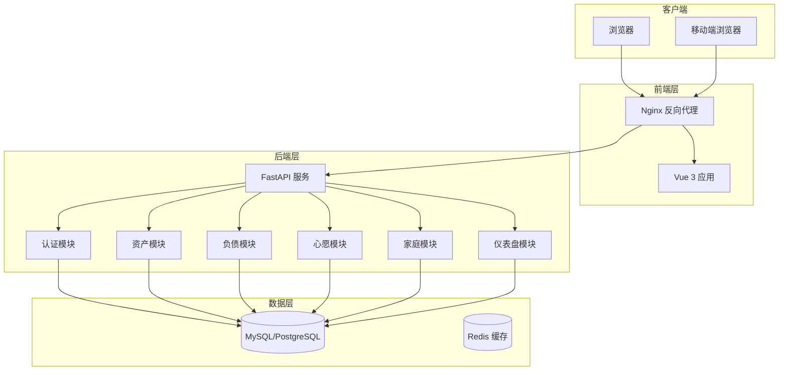
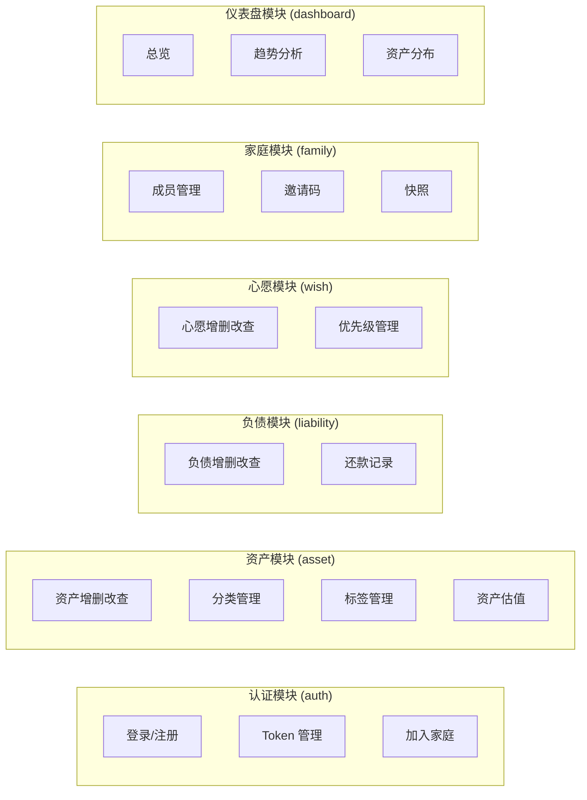
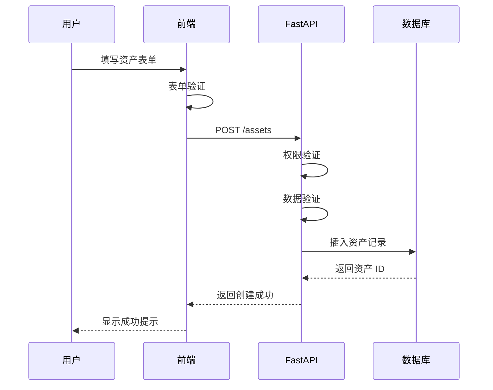
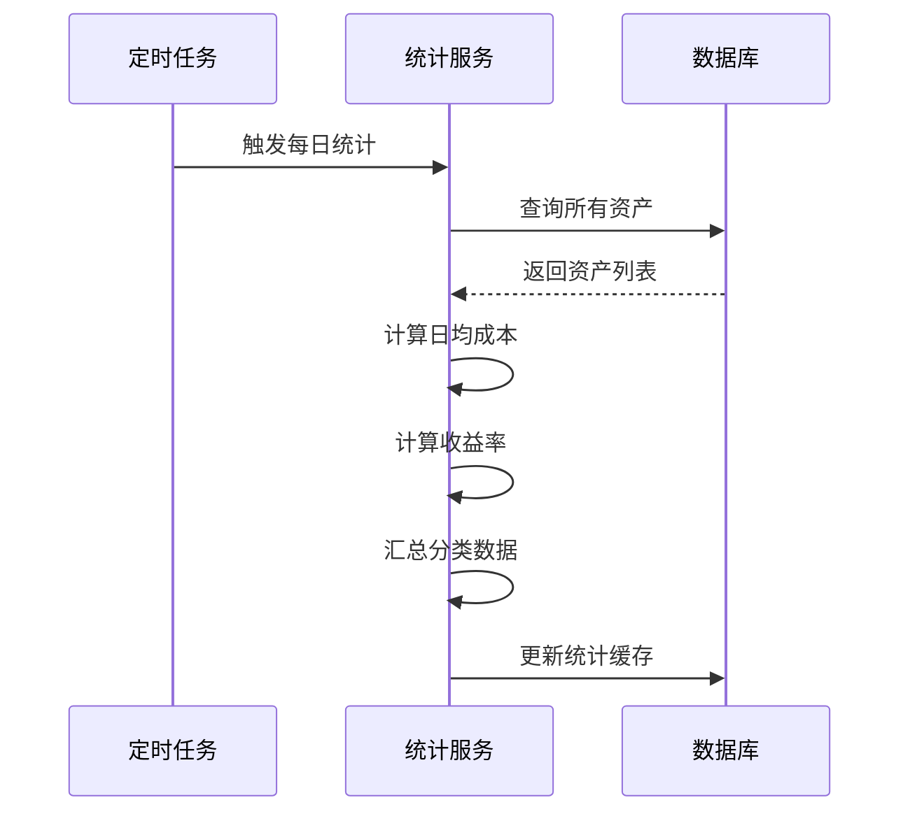

# Numina 项目架构

## 技术栈

### 前端

| 技术 | 版本 | 用途 |
|------|------|------|
| Vue | 3.5+ | 前端框架 |
| Vite | 8.0+ | 构建工具 |
| Vant | 4.9+ | 移动端 UI 组件库 |
| Pinia | 3.0+ | 状态管理 |
| Vue Router | 4.6+ | 路由管理 |
| ECharts | 6.0+ | 图表可视化 |
| Axios | 1.13+ | HTTP 客户端 |
| TypeScript | 5.9+ | 类型支持 |

### 后端

| 技术 | 版本 | 用途 |
|------|------|------|
| FastAPI | 0.115+ | Web 框架 |
| SQLAlchemy | 2.0+ | ORM |
| Alembic | 1.14+ | 数据库迁移 |
| Pydantic | 2.10+ | 数据验证 |
| python-jose | 3.3+ | JWT 认证 |
| APScheduler | 3.11+ | 定时任务 |

### 数据库

- **开发环境**: SQLite（内存模式用于测试）
- **生产环境**: MySQL 8.0+ / PostgreSQL 14+

### 部署

- **容器化**: Docker + Docker Compose
- **反向代理**: Nginx

## 系统架构图



## 模块划分



## 数据流向

### 资产录入流程



### 统计计算流程



## 技术选型理由

### 前端选型

| 决策 | 理由 |
|------|------|
| Vue 3 | Composition API 更适合复杂逻辑复用，性能优于 Vue 2 |
| Vant | 专为移动端设计，组件丰富，文档完善 |
| Pinia | 比 Vuex 更简洁，TypeScript 支持更好 |
| ECharts | 图表功能强大，配置灵活，社区活跃 |

### 后端选型

| 决策 | 理由 |
|------|------|
| FastAPI | 异步支持好，自动生成 API 文档，类型提示友好 |
| SQLAlchemy | 成熟稳定，支持多种数据库，迁移工具完善 |
| Pydantic | 与 FastAPI 深度集成，数据验证强大 |

### 数据库选型

| 决策 | 理由 |
|------|------|
| MySQL/PostgreSQL | 开源免费，社区活跃，性能可靠 |
| SQLite（测试） | 无需安装，适合单元测试 |

## 目录结构

```
numina/
├── frontend/                # 前端项目
│   ├── src/
│   │   ├── api/            # API 调用
│   │   ├── components/     # 组件
│   │   ├── composables/    # 组合式函数
│   │   ├── pages/          # 页面
│   │   ├── stores/         # Pinia Store
│   │   ├── router/         # 路由配置
│   │   ├── types/          # 类型定义
│   │   └── utils/          # 工具函数
│   └── package.json
│
├── backend/                 # 后端项目
│   ├── app/
│   │   ├── auth/           # 认证模块
│   │   ├── models/         # 数据模型
│   │   ├── routers/        # API 路由
│   │   ├── schemas/        # Pydantic Schema
│   │   ├── services/       # 业务逻辑
│   │   └── db/             # 数据库配置
│   ├── tests/              # 单元测试
│   └── pyproject.toml
│
├── tests/                   # 集成测试
│   ├── data/               # 测试数据
│   ├── e2e/                # E2E 测试
│   ├── screenshot/         # 截图测试
│   └── docs/               # 测试文档
│
├── docs/                    # 项目文档
├── openspec/                # OpenSpec 变更管理
└── docker-compose.yml       # Docker 配置
```