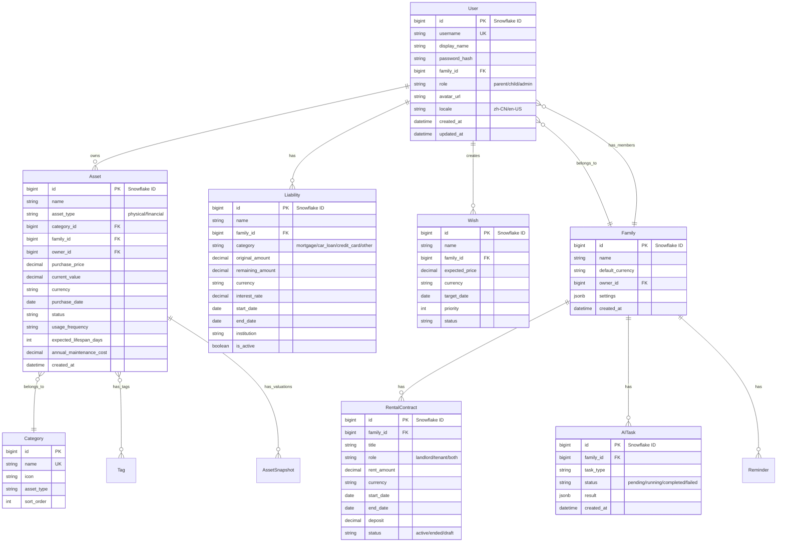

# Numina 数据模型

## 实体关系图



## 核心实体字段说明

### Asset（资产）

| 字段 | 类型 | 约束 | 说明 |
|------|------|------|------|
| id | BigInt | PK | Snowflake ID（API 序列化为 string） |
| name | String(100) | NOT NULL | 资产名称 |
| asset_type | Enum | NOT NULL | `physical` / `financial` |
| category_id | BigInt | FK, NOT NULL | 分类 ID |
| family_id | BigInt | FK, NOT NULL | 所属家庭 |
| owner_id | BigInt | FK, NOT NULL | 所有者 |
| purchase_price | Numeric | NOT NULL | 购入价格 |
| current_value | Numeric | NOT NULL | 当前价值 |
| currency | String(3) | DEFAULT 'CNY' | 货币代码 (ISO 4217) |
| purchase_date | Date | NULL | 购入日期 |
| status | Enum | DEFAULT 'in_use' | `in_use` / `idle` / `sold` / `retired` |
| usage_frequency | Enum | NULL | `daily` / `weekly` / `monthly` / `rarely` / `idle` |
| expected_lifespan_days | Integer | NULL | 预期寿命（天） |
| annual_maintenance_cost | Numeric | DEFAULT 0 | 年维护费 |
| location | String(100) | NULL | 存放位置 |
| institution | String(100) | NULL | 机构（金融资产） |
| interest_rate | Numeric | NULL | 利率（金融资产） |
| maturity_date | Date | NULL | 到期日（金融资产） |
| notes | Text | NULL | 备注 |

> **Snowflake ID 序列化：** 所有 BigInt ID 字段通过 `SnowflakeBase` 自动转换为 string 输出，避免 JS 精度丢失。

### Liability（负债）

| 字段 | 类型 | 约束 | 说明 |
|------|------|------|------|
| id | BigInt | PK | Snowflake ID |
| name | String(100) | NOT NULL | 负债名称 |
| family_id | BigInt | FK | 所属家庭 |
| category | Enum | NOT NULL | `mortgage` / `car_loan` / `credit_card` / `other` |
| original_amount | Numeric | NOT NULL | 原始金额 |
| remaining_amount | Numeric | NOT NULL | 剩余金额 |
| currency | String(3) | DEFAULT 'CNY' | 货币代码 |
| interest_rate | Numeric | NULL | 年利率 (%) |
| start_date | Date | NOT NULL | 开始日期 |
| end_date | Date | NULL | 结束日期 |
| institution | String(100) | NULL | 机构名称 |
| is_active | Boolean | DEFAULT true | 是否活跃 |

### RentalContract（租约）

| 字段 | 类型 | 约束 | 说明 |
|------|------|------|------|
| id | BigInt | PK | Snowflake ID |
| family_id | BigInt | FK | 所属家庭 |
| title | String(200) | NOT NULL | 租约标题 |
| role | Enum | NOT NULL | `landlord` / `tenant` / `both` |
| rent_amount | Numeric | NOT NULL | 租金金额 |
| currency | String(3) | DEFAULT 'CNY' | 货币代码 |
| start_date | Date | NOT NULL | 开始日期 |
| end_date | Date | NULL | 结束日期 |
| deposit | Numeric | DEFAULT 0 | 押金 |
| status | Enum | DEFAULT 'active' | `active` / `ended` / `draft` |
| linked_asset_id | BigInt | FK, NULL | 关联资产（可选） |

## 状态枚举

### 资产状态 (status)

| 值 | 中文 | 说明 |
|------|------|------|
| in_use | 服役中 | 正在使用 |
| idle | 闲置 | 暂时未使用 |
| sold | 已出售 | 已转让 |
| retired | 已退役 | 已报废/淘汰 |

### 使用频率 (usage_frequency)

| 值 | 中文 | 说明 |
|------|------|------|
| daily | 每天 | 每日使用 |
| weekly | 每周 | 每周使用 |
| monthly | 每月 | 每月使用 |
| rarely | 偶尔 | 偶尔使用 |
| idle | 闲置 | 基本不用 |

### 资产类型 (asset_type)

| 值 | 中文 | 说明 |
|------|------|------|
| physical | 实物资产 | 有形资产（手机、汽车等） |
| financial | 金融资产 | 无形资产（存款、股票等） |

## 资产分类体系

### 实物资产（13 个分类）

| 分类名 | 图标 | 说明 |
|--------|------|------|
| 房产 | 🏠 | 住宅、商业地产 |
| 车辆 | 🚗 | 汽车、摩托车 |
| 数码 | 📱 | 手机、电脑、相机 |
| 家电 | 📺 | 电视、空调、冰箱 |
| 家具 | 🛋️ | 沙发、床、桌椅 |
| 珠宝 | 💎 | 首饰、黄金、钻石 |
| 服饰 | 👔 | 衣服、鞋帽 |
| 美妆 | 💄 | 护肤品、化妆品 |
| 运动 | ⚽ | 健身器材、运动装备 |
| 玩具 | 🎮 | 游戏机、玩具 |
| 宠物 | 🐕 | 宠物及相关用品 |
| 乐器 | 🎹 | 乐器及配件 |
| 箱包 | 👜 | 包包、行李箱 |

### 金融资产（8 个分类）

| 分类名 | 图标 | 说明 |
|--------|------|------|
| 存款 | 💰 | 银行存款 |
| 基金 | 📈 | 投资基金 |
| 股票 | 📊 | 股票投资 |
| 债券 | 📜 | 债券投资 |
| 保险 | 🛡️ | 保险产品 |
| 理财产品 | 📦 | 银行理财产品 |
| 数字货币 | ₿ | 加密货币 |
| 其他金融 | 💼 | 其他金融产品 |

## 计算字段

### 日均成本 (daily_cost)

```python
def compute_daily_cost(asset: Asset) -> float:
    """
    日均成本 = (购入价格 + 累计维护费) / 已持有天数
    """
    if not asset.purchase_date:
        return 0.0
    days_held = (date.today() - asset.purchase_date).days
    if days_held <= 0:
        return 0.0
    total_cost = asset.purchase_price + (asset.annual_maintenance_cost * days_held / 365)
    return round(total_cost / days_held, 2)
```

### 收益率 (return_rate)

```python
def compute_return_rate(asset: Asset) -> float:
    """
    收益率 = (当前价值 - 购入价格) / 购入价格 × 100%
    正值=增值，负值=贬值
    """
    if asset.purchase_price == 0:
        return 0.0
    return round((asset.current_value - asset.purchase_price) / asset.purchase_price * 100, 2)
```

### 年化收益率 (annualized_return_rate)

```python
def compute_annualized_return_rate(asset: Asset) -> float:
    """
    年化收益率 = ((当前价值 / 购入价格) ^ (365 / 持有天数) - 1) × 100%
    用于跨时间段比较投资回报
    """
    if not asset.purchase_date or asset.purchase_price == 0:
        return 0.0
    days_held = (date.today() - asset.purchase_date).days
    if days_held <= 0:
        return 0.0
    ratio = asset.current_value / asset.purchase_price
    return round((ratio ** (365 / days_held) - 1) * 100, 2)
```

## 数据约束

### 价格约束

- `purchase_price >= 0`
- `current_value >= 0`
- `annual_maintenance_cost >= 0`

### 数值精度

所有金额字段使用 `Numeric` 类型（非 Float），避免浮点精度问题。前端 API 返回的金额为 string 类型。

### 日期约束

- `purchase_date <= current_date`
- `maturity_date >= purchase_date`（金融资产）

## 索引设计

```sql
-- 资产表索引
CREATE INDEX idx_asset_family ON assets(family_id);
CREATE INDEX idx_asset_category ON assets(category_id);
CREATE INDEX idx_asset_status ON assets(status);
CREATE INDEX idx_asset_type ON assets(asset_type);
CREATE INDEX idx_asset_owner ON assets(owner_id);

-- 负债表索引
CREATE INDEX idx_liability_family ON liabilities(family_id);
CREATE INDEX idx_liability_active ON liabilities(is_active);

-- 租约表索引
CREATE INDEX idx_rental_family ON rental_contracts(family_id);
CREATE INDEX idx_rental_status ON rental_contracts(status);

-- AI 任务索引
CREATE INDEX idx_ai_task_family ON ai_tasks(family_id);
CREATE INDEX idx_ai_task_status ON ai_tasks(status);
```

## 数据库迁移

使用 Alembic 管理数据库迁移：

```bash
make migrate                # 执行所有待应用的迁移
make migrate-revision m="msg"  # 生成新迁移
make migrate-down           # 回退一步
make migrate-current        # 查看当前版本
```
