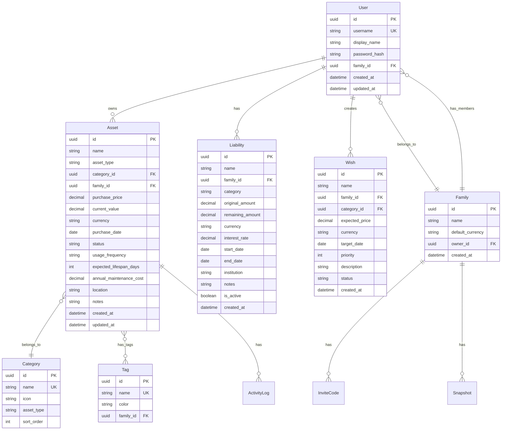

# Numina 数据模型

## 实体关系图



## 核心实体字段说明

### Asset（资产）

| 字段 | 类型 | 约束 | 说明 |
|------|------|------|------|
| id | UUID | PK | 主键 |
| name | String(100) | NOT NULL | 资产名称 |
| asset_type | Enum | NOT NULL | 资产类型：physical / financial |
| category_id | UUID | FK, NOT NULL | 分类 ID |
| family_id | UUID | FK, NOT NULL | 所属家庭 |
| purchase_price | Decimal | NOT NULL | 购入价格 |
| current_value | Decimal | NOT NULL | 当前价值 |
| currency | String(3) | DEFAULT 'CNY' | 货币代码 |
| purchase_date | Date | NULL | 购入日期 |
| status | Enum | DEFAULT 'in_use' | 状态 |
| usage_frequency | Enum | NULL | 使用频率 |
| expected_lifespan_days | Integer | NULL | 预期寿命（天） |
| annual_maintenance_cost | Decimal | DEFAULT 0 | 年维护费 |
| location | String(100) | NULL | 存放位置 |
| institution | String(100) | NULL | 机构（金融资产） |
| interest_rate | Decimal | NULL | 利率（金融资产） |
| maturity_date | Date | NULL | 到期日（金融资产） |
| notes | Text | NULL | 备注 |

### 状态枚举 (status)

| 值 | 中文 | 说明 |
|------|------|------|
| in_use | 服役中 | 正在使用 |
| idle | 闲置 | 暂时未使用 |
| sold | 已出售 | 已转让 |
| retired | 已退役 | 已报废/淘汰 |

### 使用频率枚举 (usage_frequency)

| 值 | 中文 | 说明 |
|------|------|------|
| daily | 每天 | 每日使用 |
| weekly | 每周 | 每周使用 |
| monthly | 每月 | 每月使用 |
| rarely | 偶尔 | 偶尔使用 |
| idle | 闲置 | 基本不用 |

### 资产类型枚举 (asset_type)

| 值 | 中文 | 说明 |
|------|------|------|
| physical | 实物资产 | 有形资产（手机、汽车等） |
| financial | 金融资产 | 无形资产（存款、股票等） |

## 资产分类体系

### 实物资产（13 个分类）

| 分类名 | 图标 | 说明 |
|--------|------|------|
| 房产 | 🏠 | 住宅、商业地产 |
| 车辆 | 🚗 | 汽车、摩托车 |
| 数码 | 📱 | 手机、电脑、相机 |
| 家电 | 📺 | 电视、空调、冰箱 |
| 家具 | 🛋️ | 沙发、床、桌椅 |
| 珠宝 | 💎 | 首饰、黄金、钻石 |
| 服饰 | 👔 | 衣服、鞋帽 |
| 美妆 | 💄 | 护肤品、化妆品 |
| 运动 | ⚽ | 健身器材、运动装备 |
| 玩具 | 🎮 | 游戏机、玩具 |
| 宠物 | 🐕 | 宠物及相关用品 |
| 乐器 | 🎹 | 乐器及配件 |
| 箱包 | 👜 | 包包、行李箱 |

### 金融资产（8 个分类）

| 分类名 | 图标 | 说明 |
|--------|------|------|
| 存款 | 💰 | 银行存款 |
| 基金 | 📈 | 投资基金 |
| 股票 | 📊 | 股票投资 |
| 债券 | 📜 | 债券投资 |
| 保险 | 🛡️ | 保险产品 |
| 理财产品 | 📦 | 银行理财产品 |
| 数字货币 | ₿ | 加密货币 |
| 其他金融 | 💼 | 其他金融产品 |

## 计算字段

### 日均成本 (daily_cost)

```python
def compute_daily_cost(asset: Asset) -> float:
    """
    日均成本 = (购入价格 + 累计维护费) / 已持有天数
    
    - 用于衡量资产的每日使用成本
    - 对于预期寿命较短的资产更有参考价值
    """
    if not asset.purchase_date:
        return 0.0
    
    days_held = (date.today() - asset.purchase_date).days
    if days_held <= 0:
        return 0.0
    
    total_cost = asset.purchase_price + (asset.annual_maintenance_cost * days_held / 365)
    return round(total_cost / days_held, 2)
```

### 收益率 (return_rate)

```python
def compute_return_rate(asset: Asset) -> float:
    """
    收益率 = (当前价值 - 购入价格) / 购入价格 × 100%
    
    - 正值表示增值
    - 负值表示贬值
    - 用于衡量资产投资回报
    """
    if asset.purchase_price == 0:
        return 0.0
    
    return round((asset.current_value - asset.purchase_price) / asset.purchase_price * 100, 2)
```

### 剩余寿命 (remaining_lifespan)

```python
def compute_remaining_lifespan(asset: Asset) -> int | None:
    """
    剩余寿命 = 预期寿命天数 - 已使用天数
    
    - 返回剩余天数
    - 负值表示已超过预期寿命
    - None 表示无预期寿命数据
    """
    if not asset.purchase_date or not asset.expected_lifespan_days:
        return None
    
    days_used = (date.today() - asset.purchase_date).days
    return asset.expected_lifespan_days - days_used
```

## 数据约束

### 价格约束

- `purchase_price >= 0`
- `current_value >= 0`
- `annual_maintenance_cost >= 0`

### 寿命约束

- `expected_lifespan_days > 0`（如果设置）

### 日期约束

- `purchase_date <= current_date`
- `maturity_date >= purchase_date`（金融资产）

## 索引设计

```sql
-- 资产表索引
CREATE INDEX idx_asset_family ON assets(family_id);
CREATE INDEX idx_asset_category ON assets(category_id);
CREATE INDEX idx_asset_status ON assets(status);
CREATE INDEX idx_asset_type ON assets(asset_type);

-- 活动日志索引
CREATE INDEX idx_activity_asset ON activity_logs(asset_id);
CREATE INDEX idx_activity_created ON activity_logs(created_at);
```