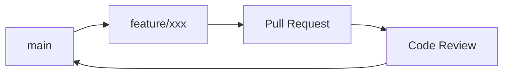

# Numina Git 工作流

## 分支策略

### 主分支

| 分支 | 说明 | 保护 |
|------|------|------|
| `main` | 生产分支，始终保持可部署状态 | ✅ 需要 PR + Review |

### 开发分支

| 分支类型 | 命名格式 | 示例 |
|----------|----------|------|
| 功能分支 | `feature/<name>` | `feature/asset-export` |
| 修复分支 | `fix/<name>` | `fix/login-error` |
| 文档分支 | `docs/<name>` | `docs/api-spec` |
| 重构分支 | `refactor/<name>` | `refactor/asset-service` |

### 分支生命周期



---

## Commit 格式

### 格式规范

```
<type>(<scope>): <subject>

<body>

<footer>
```

### 类型 (type)

| 类型 | 说明 | 示例 |
|------|------|------|
| `feat` | 新功能 | feat(asset): 添加资产导出功能 |
| `fix` | 修复 Bug | fix(auth): 修复登录 Token 过期问题 |
| `docs` | 文档更新 | docs(api): 更新 API 文档 |
| `style` | 代码格式（不影响功能） | style: 格式化代码 |
| `refactor` | 重构（不新增功能、不修复 Bug） | refactor(asset): 重构资产服务 |
| `test` | 测试相关 | test(asset): 添加资产服务单元测试 |
| `chore` | 构建/工具相关 | chore: 更新依赖版本 |
| `perf` | 性能优化 | perf(dashboard): 优化统计查询 |

### 作用域 (scope)

可选，表示影响范围：

- `auth` - 认证模块
- `asset` - 资产模块
- `liability` - 负债模块
- `wish` - 心愿模块
- `family` - 家庭模块
- `dashboard` - 仪表盘模块
- `frontend` - 前端通用
- `backend` - 后端通用

### 示例

**简单提交**：
```
feat(asset): 添加批量导入功能
```

**详细提交**：
```
feat(asset): 添加资产批量导入功能

- 支持 CSV 格式导入
- 支持模板下载
- 添加导入进度显示

Closes #123
```

**破坏性变更**：
```
refactor(api)!: 重构资产 API 响应格式

BREAKING CHANGE: 
- 移除 `assets` 字段，改用 `items`
- 新增 `total` 分页字段

迁移指南：更新前端 API 调用代码
```

---

## Pull Request 流程

### 创建 PR

1. 从 `main` 创建功能分支
2. 开发完成后推送到远程
3. 在 GitHub 创建 Pull Request

### PR 标题格式

```
<type>(<scope>): <short description>
```

示例：
```
feat(asset): 添加资产批量导入功能
fix(auth): 修复 Token 刷新失败问题
```

### PR 描述模板

```markdown
## 变更说明
<!-- 描述此 PR 做了什么 -->

## 变更类型
- [ ] 新功能 (feat)
- [ ] Bug 修复 (fix)
- [ ] 文档更新 (docs)
- [ ] 代码重构 (refactor)
- [ ] 其他: 

## 测试
- [ ] 已添加单元测试
- [ ] 已手动测试
- [ ] 已更新文档

## 截图
<!-- 如有 UI 变更，附上截图 -->

## 相关 Issue
Closes #
```

### PR 审查

1. 至少需要 1 位 Reviewer 批准
2. 所有 CI 检查通过
3. 解决所有 Review 意见

### 合并要求

- ✅ 通过 CI 检查（测试、lint）
- ✅ 至少 1 位 Reviewer 批准
- ✅ 解决所有 Review 意见
- ✅ Commit 符合格式规范

---

## 代码审查要求

### 审查清单

**功能正确性**：
- [ ] 代码实现了需求描述的功能
- [ ] 边界情况处理正确
- [ ] 错误处理完善

**代码质量**：
- [ ] 代码可读性良好
- [ ] 命名清晰准确
- [ ] 无重复代码
- [ ] 函数/方法长度合理

**测试覆盖**：
- [ ] 新增代码有对应测试
- [ ] 测试用例覆盖关键场景

**文档更新**：
- [ ] API 变更有文档更新
- [ ] 重要逻辑有注释说明

**安全性**：
- [ ] 无敏感信息硬编码
- [ ] 输入验证完善
- [ ] 权限检查正确

### Review 意见类型

| 标签 | 说明 |
|------|------|
| `MUST` | 必须修改，阻止合并 |
| `SHOULD` | 建议修改，不阻止合并 |
| `NIT` | 小问题，可改可不改 |
| `QUESTION` | 疑问，需要澄清 |

---

## CI/CD 流程

### GitHub Actions 工作流

```yaml
name: CI

on:
  push:
    branches: [main]
  pull_request:
    branches: [main]

jobs:
  test-backend:
    runs-on: ubuntu-latest
    steps:
      - uses: actions/checkout@v4
      - name: Run backend tests
        run: |
          cd backend
          pip install -e .
          pytest tests/

  test-frontend:
    runs-on: ubuntu-latest
    steps:
      - uses: actions/checkout@v4
      - name: Run frontend tests
        run: |
          cd frontend
          npm ci
          npm run test

  lint:
    runs-on: ubuntu-latest
    steps:
      - uses: actions/checkout@v4
      - name: Lint check
        run: |
          # Backend lint
          cd backend && ruff check .
          # Frontend lint
          cd ../frontend && npm run lint
```

---

## 发布流程

### 版本号规范

使用语义化版本：`MAJOR.MINOR.PATCH`

| 变更类型 | 版本更新 |
|----------|----------|
| 破坏性变更 | MAJOR |
| 新功能 | MINOR |
| Bug 修复 | PATCH |

### 发布步骤

1. 创建发布分支 `release/vX.Y.Z`
2. 更新版本号和 CHANGELOG
3. 合并到 `main`
4. 创建 Git Tag `vX.Y.Z`
5. 触发自动部署

---

## 常见问题

### 如何撤销最近一次 Commit？

```bash
# 撤销 Commit，保留更改
git reset --soft HEAD~1

# 撤销 Commit，丢弃更改
git reset --hard HEAD~1
```

### 如何修改最近一次 Commit 信息？

```bash
git commit --amend
```

### 如何同步远程分支？

```bash
git fetch origin
git rebase origin/main
```