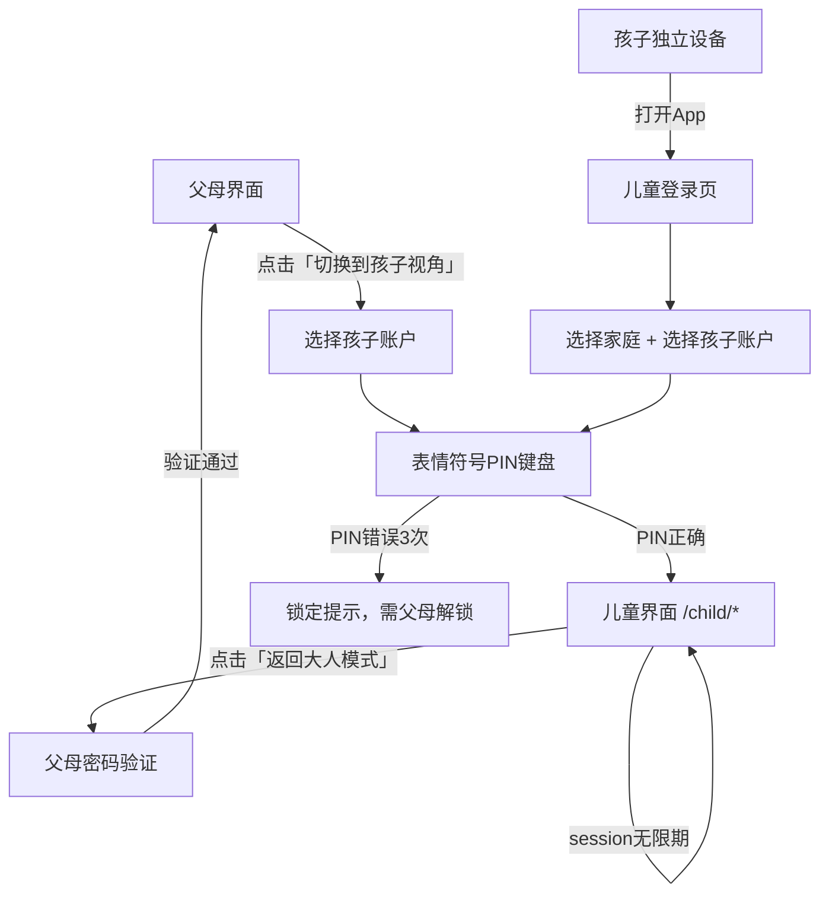

# 儿童身份系统

## Problem Frame

Numina 当前只有成人用户（`role: owner | member`），所有35个路由对所有认证用户开放，包含资产折旧、负债管理、AI 报告等对5-8岁儿童完全不适合的内容。

要支持星星币功能，必须先建立儿童身份基础设施：让孩子能以独立身份登录、看到专属的儿童界面、与成人界面完全隔离。

**受影响用户：**
- 孩子（5-8岁）：需要能独立登录、使用儿童界面
- 父母（owner）：需要创建和管理孩子账户、在共用设备上切换视角

## User Flow

## Requirements

**账户模型**

- R1. `User.role` 扩展支持 `child` 值（当前为 `owner | member`）。
- R2. 孩子账户存储4个表情符号序列的 bcrypt 哈希作为 PIN，新增 `pin_hash` 字段（TEXT, nullable）存储。`username` 和 `password_hash` 字段修改为允许 NULL，孩子账户这两个字段为 NULL。PIN 验证使用与密码登录相同的时序保护（对不存在的账户执行 dummy bcrypt 比较，防止枚举攻击）。
- R3. 孩子账户必须属于某个家庭（`family_id` 非空），由该家庭的 `owner` 创建，不支持自行注册。
- R4. 孩子账户有昵称（`display_name`）和头像颜色（复用现有 `avatar_color` 字段），无需邮箱或用户名（`username` 为 NULL）。

**账户创建**

- R5. 首次添加孩子：父母通过专属向导完成，步骤为：填写昵称 → 选择头像颜色 → 设置表情符号PIN（选4个）→ 确认完成。向导入口在家庭成员页。
- R6. 后续管理（修改昵称、重置PIN、停用账户）在家庭成员页的孩子账户详情中操作。
- R7. 一个家庭可创建多个孩子账户，无数量上限。

**认证**

- R8. 儿童登录页展示一个12个表情符号的固定网格（系统预设，不可自定义），固定集合为：🐱🐶🐸🦊🐼🐨🦁🐯🌟🌈🍎🎈。孩子依次点击4个表情符号完成 PIN 输入，支持删除和清空。
- R9. 共用设备场景：父母界面提供「切换到孩子视角」入口（建议放在家庭页或设置页），点击后显示家庭内所有孩子账户列表，选择后进入表情符号 PIN 输入。
- R10. 独立设备场景：App 启动时若无已登录用户，显示儿童登录页。家庭绑定通过父母生成的邀请链接/二维码完成（有效期24小时），孩子设备首次使用时扫码绑定家庭 ID，后续直接显示该家庭的孩子账户列表 → 输入PIN。
- R11. PIN 连续错误3次后，该孩子账户在当前设备上锁定15分钟，锁定期间显示友好提示（"请让爸爸妈妈帮你解锁"），父母可通过输入自己的密码提前解锁。
- R12. 孩子的 JWT access token 有效期与成人相同（15分钟），refresh token 有效期设为10年（极长有效期实现「无限期 session」效果）——孩子不需要重复登录，直到父母主动切换回成人模式。接受无法即时撤销 token 的风险，R15 的「强制退出」语义为「下次 token 过期后生效」。

**视角切换**

- R13. 儿童界面提供「返回大人模式」按钮（固定位置，不易误触），点击后要求输入父母密码（任意 `owner` 账户的密码均可），验证通过后切换回父母的已登录 session。
- R14. 切换回成人模式后，儿童 session 保持有效（refresh token 不失效），下次切换到孩子视角时无需重新输入 PIN（直接选择孩子账户即可进入）。
- R15. 父母可在家庭成员页强制退出某个孩子的所有 session（使该孩子的所有 refresh token 失效）。

**路由隔离**

- R16. 儿童界面使用完全独立的路由树 `/child/*`，配套独立的 `ChildLayout.vue`（大图标、亮色、底部3-4个 Tab）。
- R17. 路由守卫确保：`role=child` 的用户只能访问 `/child/*` 路由，访问任何成人路由时自动重定向到 `/child/`；`role=owner|member` 的用户访问 `/child/*` 时重定向到 `/`。
- R18. 儿童界面的初始 Tab 结构（具体页面内容由后续各功能 brainstorm 定义）：首页（储蓄罐/积分）、任务、心愿、我的宝贝。

## Success Criteria

- 5岁孩子能在无父母辅助的情况下，通过表情符号 PIN 独立进入儿童界面。
- 孩子在儿童界面内无法通过任何操作（包括手动修改 URL）访问成人财务数据。
- 父母能在30秒内完成「切换到孩子视角」和「返回大人模式」的完整流程。
- 父母能在5分钟内通过向导完成首个孩子账户的创建。

## Scope Boundaries

- 不支持孩子自行注册账户，必须由家庭 owner 创建。
- 不支持孩子修改自己的 PIN（需父母操作）。
- 儿童界面的具体页面内容（储蓄罐、任务列表等）不在本需求范围内，由后续各功能 brainstorm 定义。
- 不支持孩子账户之间的权限差异（所有孩子账户权限相同）。
- 不支持生物识别（Face ID / 指纹）替代 PIN，留待后续。

## Key Decisions

- **表情符号 PIN 而非数字 PIN**：5-6岁儿童可能尚不能可靠识别数字，表情符号视觉记忆更直观。12个固定表情符号网格（🐱🐶🐸🦊🐼🐨🦁🐯🌟🌈🍎🎈）保持一致性，避免孩子因表情符号位置变化而困惑。
- **新增 pin_hash 字段，username/password_hash 允许 NULL**：孩子账户语义上没有用户名和密码，复用 password_hash 字段会造成语义混乱。新增 `pin_hash` 字段并将 `username`/`password_hash` 改为 nullable 是最干净的方案，需要 Alembic 迁移。
- **10年有效期 refresh token 替代真正无限期**：`python-jose` 对无 `exp` claim 的处理行为不确定；10年有效期在实践中等同于无限期，同时保持 JWT 标准兼容性。接受无法即时撤销 token 的风险——R15「强制退出」语义调整为「下次 token 过期后生效」。
- **独立设备家庭绑定通过父母生成的邀请链接/二维码**：复用现有 invite_code 机制，父母生成24小时有效的绑定码，孩子设备首次使用时扫码绑定家庭 ID，后续本地存储家庭 ID 直接显示孩子列表。
- **完全独立路由树**：条件渲染成人界面对儿童是认知负担，独立路由树从根本上消除数据泄露风险，维护成本虽略高但安全边界清晰。
- **切换回成人模式需父母密码**：防止孩子误触或故意退出儿童模式访问家庭财务数据。

## Dependencies / Assumptions

- 依赖 `User` 模型扩展（R1-R4），这是所有星星币功能的前置条件。
- 假设现有 JWT 基础设施（`create_access_token` / `create_refresh_token`）可以支持 `role` 字段写入 token claims，路由守卫读取该字段。
- 假设 Vant 4 的触摸交互对5岁孩子操作表情符号网格足够友好（网格按钮尺寸需 ≥ 56px）。

## Outstanding Questions

### Resolve Before Planning

（已全部解决，可进入规划阶段）

### Deferred to Planning

- [影响 R14][技术] 切换回成人模式后如何恢复父母 session：前端本地存储父母 token vs. 要求父母重新登录。需在规划阶段确认存储策略。
- [影响 R11][需要调研] PIN 锁定状态存储在哪里（数据库 vs. Redis vs. 内存）？当前后端无缓存层，需评估方案（建议：数据库新增 `pin_locked_until` 字段，避免引入缓存层）。
- [影响 R10][技术] 独立设备家庭绑定码的生成和验证端点设计，以及本地存储家庭 ID 的前端实现方式。
- [影响 R17][技术] 路由守卫读取 `role` 字段的方式：JWT claims 中写入 role（需修改 token 生成逻辑）vs. 从本地存储的 user 对象读取。

## Next Steps
→ `/ce:plan` 进行结构化实施规划
