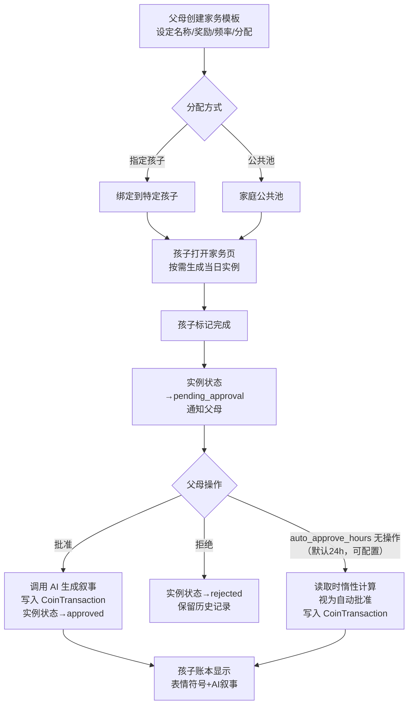

# 核心赚取循环 (Core Earn Loop)

## Problem Frame

儿童身份系统（创意点1）已完成，孩子可以登录，但登录后没有任何可做的事。核心赚取循环是整个星星币系统的引擎：父母创建家务模板 → 系统生成当日实例 → 孩子标记完成 → 父母审批 → 星星币入账。没有这个循环，后续的心愿兑现、连续打卡、宝贝画廊都无从谈起。

目标用户：5-8岁儿童（执行家务、查看账本）+ 父母（创建模板、审批完成）。

## User Flow

## Requirements

**家务模板（父母端）**

- R1. 父母可创建家务模板，字段：名称（必填）、表情符号图标（从预设集选择）、星星币奖励（正整数）、频率（每日/每周）、分配方式（指定孩子 / 家庭公共池）、指定孩子列表（分配方式为指定时必填，可多选）。
- R2. 父母可编辑和删除模板。删除模板不影响已生成的历史实例记录。
- R3. 模板列表按频率分组展示（每日 / 每周），支持启用/禁用单个模板而不删除。

**家务实例（按需生成）**

- R4. 孩子或父母打开家务页面时，系统检查当日（按客户端传入的本地日期字符串 YYYY-MM-DD）是否已为该孩子生成该模板的实例；若无则即时创建，若有则直接返回已有实例。每日模板每天最多一个实例，每周模板每周最多一个实例（按自然周，以客户端本地日期计算）。公共池模板与指定孩子模板均按孩子维度生成实例——公共池模板对家庭内每个孩子各自生成独立实例，孩子打开家务页时触发自己的实例生成。
- R5. 公共池模板：家庭内每个孩子均可看到该模板并生成自己的实例，各自独立完成和提交，父母分别审批。（不再是先到先得的单实例竞争模型。）
- R6. 实例状态流转：`available` → `pending_approval`（孩子标记完成）→ `approved` / `rejected`。`rejected` 实例保留在历史中，孩子端显示"今日已被拒绝"。父母拒绝时可选择"退回重做"，将实例重置为 `available`，孩子可重新标记完成并再次提交。

**父母审批队列**

- R7. 父母端有专属审批队列，展示所有 `pending_approval` 状态的实例，按提交时间排序，显示孩子姓名、家务名称、提交时间、奖励星星币数。
- R8. 父母一键批准或拒绝。批准时：同步调用 AI 生成叙事文本（≤2秒超时，超时则使用固定模板兜底），写入 `CoinTransaction`，实例状态变为 `approved`。
- R9. 自动批准：父母读取审批队列或家务列表时，若实例 `submitted_at + auto_approve_hours <= now` 且状态仍为 `pending_approval`，则触发 `CoinTransaction` 写入并将状态改为 `approved`（幂等：同一实例只写一次，需数据库唯一约束保证）。孩子读取自己的实例时不触发自动批准写入，仅展示"审批中"状态。`auto_approve_hours` 为家庭级配置，默认 24 小时，仅 `owner` 角色可在家庭设置中修改（范围：1-168 小时）。

**CoinTransaction 账本**

- R10. 独立 `CoinTransaction` 表，字段：`id`、`family_id`、`child_user_id`、`amount`（正数=收入，负数=支出，整数铜币单位）、`transaction_type`（`chore_earn` / `wish_spend` / `parent_grant`）、`ref_id`（关联的实例/心愿 ID，无 FK 约束，需应用层校验）、`narrative`（叙事文本：`chore_earn` 类型由 AI 生成，`parent_grant` 类型由父母填写）、`narrative_emoji`（1-3个表情符号前缀）、`created_at`。`sibling_gift` 类型属于创意点7，v1 不实现。
- R11. 账本只增不改：已写入的 `CoinTransaction` 记录不可修改或删除。余额始终由 `SUM(amount) WHERE child_user_id = ?` 实时计算，不存储余额字段。
- R12. 孩子账本视图：按时间倒序展示，每条记录显示 `narrative_emoji` + `narrative` + `amount`（+N颗星 / -N颗星）+ 相对时间（"今天"/"昨天"/"3天前"）。不显示绝对金额、不显示 `ref_id`。

**AI 叙事生成**

- R13. 批准时同步调用项目现有 AI 服务，输入：孩子姓名、家务名称、奖励数量、连续完成天数（从 `ChoreInstance.streak_count` 读取，0 表示首次）。输出：≤30字的中文叙事文本 + 1-3个表情符号。若家庭未启用 AI（`family.ai_enabled=False`），直接使用固定模板兜底，不调用 AI 服务。
- R14. AI 调用超时（>2秒）或失败时，使用固定模板兜底：`"{emoji} 你完成了{家务名}！获得 {n} 颗星 ⭐"` ，不阻塞批准流程。
- R15. 叙事文本存储在 `CoinTransaction.narrative`，一旦写入不再更新。

**父母手动奖励**

- R16. 父母可在孩子详情页手动发放星星币（`transaction_type='parent_grant'`），需填写原因（作为 `narrative`），金额范围 1-100 铜币。此操作不经过审批队列，直接写入账本。

## Success Criteria

- 父母能在 3 分钟内创建第一个家务模板并分配给孩子。
- 孩子打开家务页面后，当日家务实例在 1 秒内出现，无需手动刷新。
- 孩子标记完成后，父母审批队列在下次打开时立即可见该条目。
- 批准家务后，孩子账本在 3 秒内出现带叙事文本的新条目（家务审批条目含 AI 叙事，手动奖励条目含父母填写的原因）。
- 连续 7 天使用后，账本历史清晰可读，孩子能指出"这是我扫地赚的"。

## Scope Boundaries

- 不实现照片上传证明（可作为后续扩展，复用现有图片上传管道）。
- 不实现家务模板的"公共模板库"（父母从预设库选择）——v1 全部手动创建。
- 不实现孩子端的家务"认领"交互动画——v1 只需功能正确。
- 不实现连续打卡加成（属于创意点4）。本模块计算并存储 `streak_count` 字段（每次批准时更新），供 AI 叙事和创意点4使用，但不实现加成奖励逻辑。
- 不实现兄弟姐妹积分赠送（属于创意点7，依赖本模块的 CoinTransaction 表）。
- `parent_grant` 不支持负数（扣除积分）——v1 只有奖励，无惩罚机制。

## Key Decisions

- **按需生成实例（非定时任务）**：读取时检查并创建，避免引入 APScheduler 依赖，与现有架构一致。
- **自动批准用惰性计算**：读取时判断 `submitted_at + timeout < now`，无后台任务，幂等写入保证不重复计费。
- **独立 CoinTransaction 表**：与 Activity 表职责分离，Activity 继续服务成人资产操作，CoinTransaction 专属儿童积分经济。
- **AI 叙事同步生成 + 兜底模板**：批准时同步调用，2秒超时后降级为固定模板，不阻塞审批流程。
- **两种分配方式均按孩子维度生成实例**：公共池模板不再是单实例竞争，而是每个孩子各自生成独立实例，简化并发模型，消除先到先得的竞态。
- **拒绝可退回重做**：父母拒绝时可选"退回重做"将实例重置为 `available`，孩子可重新提交；默认拒绝则当日不可重试，孩子端显示"今日已被拒绝"。
- **streak_count 本模块计算存储**：每次批准时更新 `ChoreInstance.streak_count`，供 AI 叙事使用；加成逻辑属于创意点4，本模块不实现。
- **自动批准仅父母读取时触发**：孩子读取自己的超时实例时不触发 CoinTransaction 写入，防止孩子通过轮询自己触发入账。`auto_approve_hours` 仅 `owner` 角色可修改。

## Dependencies / Assumptions

- 依赖创意点1（儿童身份系统）：`User.role='child'`、`/child/*` 路由树、子账户 CRUD 已完成。
- 依赖项目现有 AI 服务（`/api/v1/ai/*` 路由）：叙事生成需要调用现有 AI 模块，规格待规划阶段确认。
- 假设家庭内至少有一个 `role='owner'` 用户作为父母端操作者。
- 创意点8（金银铜视觉体系）的兑换比例配置与本模块的铜币单位兼容：`CoinTransaction.amount` 存储铜币整数，显示层换算。

## Outstanding Questions

### Deferred to Planning

- [Affects R8/R16][Technical] 审批、拒绝、手动奖励端点需要 `require_parent` 依赖（接受 `owner`/`member`，拒绝 `child`），需在规划阶段与现有 `require_owner` 依赖对齐。
- [Affects R12][Technical] 孩子账本读取端点需强制 `child_user_id == current_user.id`（孩子只能查自己的账本），父母可查家庭内任意孩子账本。
- [Affects R4/R9][Technical] 按需生成实例的幂等性：需在 `ChoreInstance(template_id, child_user_id, date_bucket)` 上建唯一约束，并发时 INSERT OR IGNORE + SELECT 兜底。
- [Affects R9][Technical] 自动批准幂等写入：需在 `CoinTransaction(ref_id, transaction_type)` 上建唯一约束，防止并发双写。R8 批准操作需原子化（UPDATE WHERE status='pending_approval' 检查影响行数后再写 CoinTransaction）。
- [Affects R13][Needs research] 项目现有 AI 服务调用接口（endpoint、请求格式、超时配置）需在规划阶段确认；需确认 `family.ai_enabled=False` 时的跳过逻辑与现有 AI 路由守卫的集成方式。
- [Affects R13][Technical] AI 叙事调用需使用 `async def` 路由 + `httpx.AsyncClient(timeout=2.0)`，捕获 `httpx.TimeoutException` 降级为固定模板（不可复用现有 `ai_chat.py` 的 504 抛出模式）。
- [Affects R2/R7][Technical] 删除模板后历史实例的家务名称展示：实例表需冗余存储 `chore_name` 快照，不依赖 JOIN 模板表。
- [Affects R3/R4][Technical] 禁用模板后已生成的 `available` 实例处理方式：推荐随模板禁用一并隐藏（孩子端不展示），规划阶段确认。
- [Affects R4][Technical] 客户端传入本地日期字符串（YYYY-MM-DD）作为实例生成的日期基准，服务器不自行推算时区；`Family` 表可选增加 `timezone` 字段（默认 `Asia/Shanghai`）供自然周边界计算使用。

## Next Steps

→ `/ce:plan` for structured implementation planning
