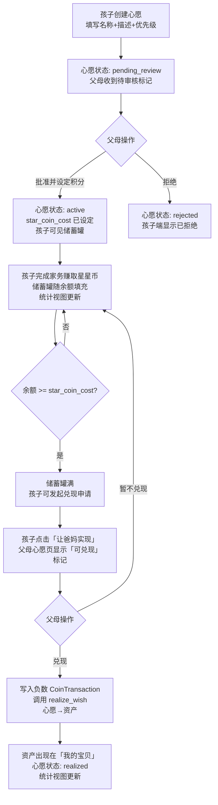

# 心愿兑现流水线 (Wish Fulfillment Pipeline)

## Problem Frame

核心赚取循环（创意点2）让孩子积累星星币，但积累本身没有目标感。心愿兑现流水线为积分赋予意义：孩子提出心愿 → 父母审核并设定积分门槛 → 孩子通过完成家务攒够积分 → 孩子发起兑现申请 → 父母一键兑现 → 心愿变成孩子名下的资产。储蓄罐可视化让5-8岁孩子无需理解数字，只需看罐子满了多少。孩子还拥有个人统计视图，看到自己的积分、心愿进度和已实现的宝贝。

目标用户：5-8岁儿童（提出心愿、查看进度、发起兑现申请）+ 父母（审核心愿、设定积分、执行兑现）。

## User Flow

## Requirements

**心愿创建（孩子端）**

- R1. 孩子可在儿童界面创建心愿，字段：名称（必填，≤50字）、描述（可选，≤200字）、表情符号图标（从预设集选择，可选）、优先级（高/中/低，默认中）。孩子不填写价格或积分——这些是父母专属字段。创建心愿不需要拥有任何积分。
- R2. 新建心愿初始状态为 `pending_review`，孩子端显示"等待爸爸妈妈审核"，储蓄罐不显示（尚无积分目标）。
- R3. 孩子可查看自己所有心愿的列表，按状态分组：审核中 / 进行中 / 已实现 / 已拒绝。进行中的心愿按优先级排序（高→中→低）。

**父母审核队列**

- R4. 父母端有心愿审核队列，展示所有 `pending_review` 状态的心愿，显示孩子姓名、心愿名称、描述、优先级、提交时间。
- R5. 父母批准心愿时必须设定 `star_coin_cost`（正整数铜币，≥1）。批准后心愿状态变为 `active`，孩子端储蓄罐出现。
- R6. 父母可拒绝心愿，心愿状态变为 `rejected`，孩子端显示"这个心愿暂时不行"。父母可选填拒绝原因（作为备注，孩子可见）。
- R7. 父母可在任意时间修改已 `active` 心愿的 `star_coin_cost`（只允许降低，不允许提高——防止孩子已积累进度后目标被拉远）。修改时记录变更日志（旧值/新值/时间），孩子端储蓄罐进度实时更新。

**储蓄罐可视化（孩子端）**

- R8. 每个 `active` 心愿对应一个储蓄罐组件，填充进度 = `min(child_balance / star_coin_cost, 1.0)`，由前端实时计算（无需后端推送）。孩子不看到具体数字，只看填充比例和心愿名称。
- R9. 储蓄罐填充使用 CSS 动画（fill 效果），从底部向上填充，颜色随进度变化（0-50% 蓝色，50-99% 黄色，100% 金色闪烁）。
- R10. 余额达到 `star_coin_cost` 时，储蓄罐显示满罐状态（金色闪烁 + "攒够啦！"文字），孩子端有庆祝动效（彩纸或星星飘落，CSS 实现，无物理引擎），并出现"让爸妈实现"按钮。

**优先级试算进度条（孩子端）**

- R11. 心愿列表中，每个 `active` 心愿显示独立储蓄罐进度（R8）。
- R12. 统计视图中，额外展示按优先级顺序的累计试算：将孩子当前余额按高→中→低优先级依次分配给各心愿，显示"当前积分可实现前N个心愿"。例如：余额300铜，高优先级心愿需200铜（已满），中优先级需150铜（还差50铜），低优先级需100铜（未开始）——试算进度条直观展示积分的分配状态。

**孩子发起兑现申请**

- R13. 当孩子余额 ≥ `star_coin_cost` 时，储蓄罐满罐状态下出现"让爸妈实现"按钮。孩子点击后，心愿进入 `redemption_requested` 状态，父母心愿管理页显示"可兑现"高亮标记。
- R14. 孩子发起申请时不扣除积分（不预扣/不冻结）。积分在父母执行兑现时才扣除。

**父母兑现操作**

- R15. 父母心愿管理页中，`redemption_requested` 状态的心愿顶部显示"可兑现"高亮标记（无需独立通知系统，父母主动查看时可见）。
- R16. 父母点击"兑现"时，后端原子执行：(a) 校验孩子当前余额 ≥ `star_coin_cost`（防止申请后余额被消耗）；(b) 写入负数 `CoinTransaction`（`transaction_type='wish_spend'`，`amount=-star_coin_cost`，`ref_id=wish_id`）；(c) 调用现有 `realize_wish()` 流程将心愿转化为孩子名下资产；(d) 心愿状态变为 `realized`。四步在同一数据库事务内，任一失败则全部回滚。
- R17. 若父母兑现时余额不足（孩子申请后积分被消耗），显示"积分不足，无法兑现"，不执行扣除。父母不可绕过积分门槛。

**心愿变资产**

- R18. `realize_wish()` 生成的资产归属 `child_user_id`（孩子名下），`asset_type` 由父母在兑现时选择（或默认为 `physical`）。

**孩子个人统计视图**

- R19. 孩子端有独立统计视图（有别于父母视角），展示：
  - 当前星星币余额（铜币数，或换算后的金银铜组合，取决于创意点8）
  - 进行中心愿数量 + 按优先级的累计试算（R12）
  - 已实现心愿数量 + 已实现心愿列表入口（链接到"我的宝贝"）
  - "还差多少星星币可以实现所有高优先级心愿"的汇总提示
- R20. 统计视图不展示任何货币金额（`expected_price`、资产价值等父母专属字段）。所有数字以星星币为单位。

## Success Criteria

- 孩子能在 2 分钟内创建第一个心愿并提交审核（无需拥有任何积分）。
- 父母审核并设定积分后，孩子打开心愿页立即看到储蓄罐（无需刷新）。
- 储蓄罐填充进度与孩子实际余额一致，误差为零。
- 余额达标时，孩子端看到满罐庆祝动效和"让爸妈实现"按钮。
- 孩子统计视图能正确显示"还差多少星星币可以实现所有高优先级心愿"。
- 父母兑现后，心愿消失于进行中列表，资产出现在孩子名下。

## Scope Boundaries

- 不实现"我的宝贝"画廊展示层（属于创意点5）。兑现后资产的 `user_id=child_user_id` 数据钩子已由 R18 保证，UI 渲染留给创意点5。
- 不实现积分冻结/预扣机制——孩子发起申请时不扣积分，父母兑现时才扣除。
- 不实现应用内通知推送——父母通过心愿管理页的"可兑现"标记感知。
- 不实现心愿分享或家庭成员投票（已在 ideation 中拒绝）。
- 不实现心愿模板库——v1 孩子全部手动创建。
- `expected_price` 字段保持父母专属，孩子端不展示任何货币金额。
- 统计视图不实现资产价值追踪（属于创意点5"我的宝贝"范畴）——v1 只显示已实现心愿数量和入口。

## Key Decisions

- **孩子自建心愿，父母审核并设定积分**：孩子提出需求，父母掌控积分门槛，保持不透明性（孩子看积分不看价格）。
- **创建心愿不需要积分**：心愿是目标，不是消费行为；只有兑现时才要求余额充足。
- **孩子发起兑现申请**：余额达标后由孩子主动触发"让爸妈实现"，父母收到标记后执行兑现，保留孩子的主动权和仪式感。
- **前端实时计算储蓄罐进度**：余额和 star_coin_cost 均由 API 返回，前端计算比例，无需后端推送或轮询。
- **优先级试算两种都有**：每个心愿独立储蓄罐进度 + 统计视图中按优先级累计试算，两者互补。
- **父母兑现时原子扣除积分**：wish_spend 交易与 realize_wish() 在同一事务，保证账本与资产状态一致。
- **不允许提前兑现**：余额不足时硬拦截，父母无法绕过积分门槛，保护孩子对系统的信任感。
- **star_coin_cost 只允许降低不允许提高**：防止孩子已积累进度后目标被拉远，修改时记录变更日志。
- **Wish.status 全部重命名**：废弃旧 pending/cancelled，新枚举为 pending_review/active/redemption_requested/realized/rejected，需数据迁移。

## Dependencies / Assumptions

- 依赖创意点2（核心赚取循环）：`CoinTransaction` 账本和余额计算（`SUM(amount) WHERE child_user_id=?`）必须已实现。
- 依赖创意点1（儿童身份系统）：`User.role='child'`、孩子端路由已完成。
- 现有 `Wish` 模型需新增字段：`star_coin_cost`（整数，nullable）、`assigned_child_id`（FK to users）、`rejection_reason`（Text，nullable，孩子可见）、`priority`（String，high/medium/low，默认 medium）；status 枚举全部重命名（pending→pending_review，cancelled 废弃，新增 active/redemption_requested/rejected）；需数据迁移将现有 pending 行改为 pending_review。
- 现有 `realize_wish()` 服务函数需接受 `child_user_id` 参数，确保生成的资产归属孩子而非父母。
- 心愿创建端点（POST /wishes/）需增加 `role=='child'` 守卫，拒绝非孩子角色的创建请求（403）。
- 创意点8（金银铜视觉体系）的铜币单位与 `star_coin_cost` 兼容：`star_coin_cost` 存储铜币整数，显示层换算（v1 暂不换算）。

## Outstanding Questions

### Deferred to Planning

- [Affects R1/R3][Technical] 孩子端心愿列表与父母端心愿列表需要不同的 API 视图：孩子只看 `star_coin_cost`（不看 `expected_price`），父母看全部字段。需确认是同一端点加字段过滤，还是独立端点。
- [Affects R16][Technical] `realize_wish()` 当前接受哪些参数、返回什么，以及是否已支持 `child_user_id` 归属——需在规划阶段读取 `backend/app/services/wishes.py` 确认。
- [Affects R16][Technical] 事务原子性：`CoinTransaction` 写入与 `realize_wish()` 调用需在同一 SQLAlchemy 事务内，需确认现有 `realize_wish()` 是否已在事务内或需要包装。
- [Affects R18][Technical] `realize_wish()` 生成资产时的 `asset_type` 选择：父母在兑现时选择，还是心愿创建时预填——规划阶段确认 UI 交互细节。
- [Affects R8/R12/R19][Technical] 孩子端余额查询：心愿页和统计视图均需要孩子当前总余额，需确认是否复用创意点2的账本余额端点，或心愿列表 API 直接内嵌余额字段。
- [Affects Dependencies][Technical] Wish.status 数据迁移：现有 `pending` 行需改为 `pending_review`，`cancelled` 行处理方式（保留原值或映射为 `rejected`）需在规划阶段确认，并检查所有 `status == 'pending'` 的代码路径。

## Next Steps

→ `/ce:plan` for structured implementation planning
