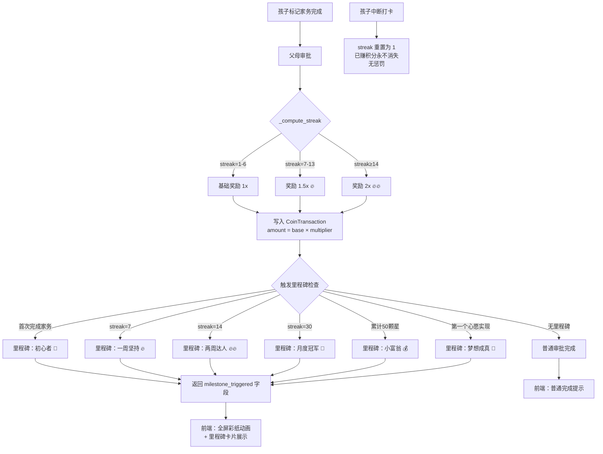

# 连续打卡与里程碑庆典 (Streaks & Milestone Celebrations)

## Problem Frame

**用户痛点：** 孩子完成家务的动力在最初几天最强，随后迅速衰减。没有持续性激励机制，家务 app 的平均活跃周期只有2-3周（"新鲜感效应"）。

**核心机会：** 连续打卡是消费类教育 app 中验证最充分的日留存机制。Duolingo 数据显示连续打卡用户留存率是非连续用户的2.4倍。对5-8岁儿童，"坚持有回报"的直接体验比任何说教都更有效——这也是财务素养中"复利"概念的最早期具象化。

**设计约束：**
- 目标年龄5-8岁：不能有惩罚性设计（失去连续记录已经足够令人失望）
- 不能引入后台调度器（自托管部署，无 cron 服务）
- 必须与现有 `streak_count` 字段和 `_compute_streak()` 函数兼容

**现有基础设施（已实现）：**
- `ChoreInstance.streak_count`：每次审批时由 `_compute_streak()` 计算并写入
- `_compute_streak()`：按 `template_id + child_user_id` 查找上一个 `approved` 实例，判断是否连续（daily: 相差1天，weekly: 相差7天）
- `CoinTransaction`：只增不改账本，`amount` 字段存储实际到账积分
- `approve_instance_async()`：审批时写入 `CoinTransaction`，当前 `amount = instance.coin_reward`（模板基础奖励）

---

## User Flow



---

## Requirements

### 数据模型

**R1. `ChoreInstance.streak_count` 已存在，无需新增字段。**
当前字段在每次审批时由 `_compute_streak()` 写入，值为从1开始的连续计数（中断后重置为1）。

**R2. 新增 `ChoreInstance.streak_bonus` 字段（Integer, nullable, default=0）。**
记录本次审批实际发放的奖励加成积分（`actual_amount - base_amount`）。用于账本展示和审计，不影响 `coin_reward` 快照字段。

**R3. 里程碑记录表 `child_milestones`（v1 仅记录，不含徽章图片）：**
```
child_milestones
  id: UUID PK
  family_id: FK families.id
  child_user_id: FK users.id
  milestone_type: str(50)  # 见里程碑定义
  triggered_at: DateTime
  ref_id: str(36) nullable  # 触发来源（instance_id 或 wish_id）
  ref_type: str(20) nullable  # 'chore_instance' | 'child_wish'
```
`UniqueConstraint(child_user_id, milestone_type)` — 每种里程碑每个孩子只触发一次（首次触发型）。
例外：`streak_7` / `streak_14` / `streak_30` 是"每次达到时触发"型，不加唯一约束（见 R10）。

**R4. `CoinTransaction` 无需修改。**
倍率加成体现在 `amount` 字段（实际到账积分 = base × multiplier，向下取整）。`narrative` 字段由 AI 叙事生成时传入 streak 信息，已有 `streak` 参数。

### 奖励倍率

**R5. 倍率阈值（硬编码，v1 不可配置）：**

| streak_count | 倍率 | 说明 |
|---|---|---|
| 1–6 | 1.0x | 基础奖励 |
| 7–13 | 1.5x | 一周连续 |
| ≥14 | 2.0x | 两周及以上 |

**R6. 倍率乘在模板基础奖励（`template.coin_reward`）上，向下取整：**
```python
actual_amount = int(instance.coin_reward * multiplier)
```
`instance.coin_reward` 是审批时的快照值（已在实例创建时从模板复制），不受模板后续修改影响。

**R7. 倍率计算时机：父母审批时（`approve_instance_async`）。**
在 `_compute_streak()` 返回 streak 值后，立即计算 multiplier，写入 `CoinTransaction.amount = actual_amount`，同时写入 `ChoreInstance.streak_bonus = actual_amount - instance.coin_reward`。

**R8. 自动批准（`_auto_approve`）同样应用倍率。**
自动批准路径复用相同的 `_get_streak_multiplier(streak)` 辅助函数。

### 里程碑定义

**R9. 首次触发型里程碑（每个孩子终身只触发一次，加唯一约束）：**

| milestone_type | 触发条件 | 展示名称 |
|---|---|---|
| `first_chore` | 第一次家务审批通过 | 初心者 🌟 |
| `first_wish_realized` | 第一个心愿 status=realized | 梦想成真 🎊 |
| `coins_50` | 累计获得星星币 ≥ 50 | 小富翁 💰 |
| `coins_200` | 累计获得星星币 ≥ 200 | 积分达人 💎 |

**R10. 每次达到型里程碑（每次 streak 达到阈值时触发，不加唯一约束）：**

| milestone_type | 触发条件 |
|---|---|
| `streak_7` | streak_count 首次达到7（该模板该孩子） |
| `streak_14` | streak_count 首次达到14 |
| `streak_30` | streak_count 首次达到30 |

注：`streak_7` / `streak_14` / `streak_30` 在同一 streak 周期内只触发一次（通过检查当前 streak 周期内是否已有记录）。中断后重新达到阈值时再次触发。

**R11. 里程碑检查时机：**
- `first_chore` / `streak_*`：在 `approve_instance_async` 中，CoinTransaction 写入后检查
- `first_wish_realized`：在 `realize_child_wish` 中，status 更新后检查
- `coins_*`：在 `approve_instance_async` 和 `realize_child_wish` 中，通过 `get_balance()` 检查

**R12. 里程碑检查失败不阻断主流程。**
里程碑写入包裹在 `try/except`，失败只记录日志，不回滚审批或兑现事务。

### API 设计

**R13. 审批响应新增 `milestone_triggered` 字段：**
```python
class ChoreInstanceResponse(BaseModel):
    ...
    streak_count: int
    streak_bonus: int  # 新增：本次加成积分（0表示无加成）
    milestone_triggered: str | None  # 新增：触发的里程碑类型，None表示无
```

**R14. 新增里程碑查询端点：**
```
GET /child/milestones          → list[MilestoneResponse]  # 孩子查看自己的里程碑
GET /family/children/{id}/milestones  → list[MilestoneResponse]  # 父母查看某孩子里程碑
```

`MilestoneResponse`:
```python
class MilestoneResponse(BaseModel):
    id: str
    milestone_type: str
    triggered_at: datetime
    ref_id: str | None
    ref_type: str | None
```

**R15. 心愿兑现响应新增 `milestone_triggered` 字段（同 R13 模式）。**

### 前端交互

**R16. 家务列表（`ChildTasksPage`）展示 streak 火焰：**
- `streak_count >= 3`：显示 🔥 + 数字（如 "🔥 5"）
- `streak_count >= 7`：显示 🔥🔥 + 数字
- `streak_count >= 14`：显示 🔥🔥🔥 + 数字（金色）
- 倍率标签：`streak >= 7` 时显示 "×1.5" 或 "×2" 徽章

**R17. 审批完成后，父母端（`ChoreApprovalsPage`）展示加成提示：**
- `streak_bonus > 0` 时：显示 "+N 加成！🔥" 提示条（2秒后消失）

**R18. 里程碑庆典动画（全屏，孩子端触发）：**
- 触发时机：孩子下次进入 `ChildTasksPage` 或 `ChildHomePage` 时，检查是否有未展示的里程碑（`GET /child/milestones` 返回最新一条，前端本地记录已展示的 `milestone_id`）
- 动画：CSS 彩纸（`@keyframes confetti-fall`，20-30个彩色方块从顶部落下，纯 CSS 无 JS 物理引擎）
- 持续时间：3秒，可点击跳过
- 里程碑卡片：动画结束后展示卡片（emoji + 名称 + 描述），点击关闭

**R19. 前端不轮询里程碑。**
孩子进入儿童界面时（`onMounted`）调用一次 `GET /child/milestones`，与本地 `localStorage` 中已展示的 `milestone_ids` 对比，找出未展示的最新一条触发动画。

---

## Key Decisions

### KD-1: streak 粒度 — 按模板（已决定）

**选择：按单个家务模板追踪 streak（`template_id + child_user_id`）**

**理由：**
- 现有 `_compute_streak()` 已按此粒度实现，无需重构
- 语义更清晰："连续7天刷牙"比"每天至少完成1个家务"更具体，孩子更容易理解
- 避免"用简单家务刷 streak"的投机行为（如每天只做最简单的任务）
- 父母可以为不同家务设置不同奖励，streak 加成自然与家务价值挂钩

**放弃的方案：** 每日总完成数（"每天至少1个家务"）— 实现更复杂，需要跨模板聚合，且语义模糊。

### KD-2: 倍率乘在基础奖励上（已决定）

**选择：`actual_amount = int(instance.coin_reward * multiplier)`**

**理由：**
- `instance.coin_reward` 是审批时的快照，不受模板修改影响，计算结果稳定
- 向下取整避免浮点数进入账本（账本只存整数）
- 父母修改模板奖励不会影响已进行中的 streak 计算

**放弃的方案：** 乘在"当日实际奖励"上 — 与快照方案等价，无实质区别。

### KD-3: 中断后 streak 重置为1（已决定）

**选择：中断后 `_compute_streak()` 返回1（现有行为），历史最高 streak 不单独存储（v1）**

**理由：**
- 现有实现已是此行为，无需修改
- 历史最高 streak 可通过查询 `MAX(streak_count)` 获得，无需冗余字段
- v1 不展示历史最高 streak，留 v2

**放弃的方案：** 保留历史记录（`max_streak_count` 字段）— v2 功能，不在 v1 范围。

### KD-4: 倍率硬编码（已决定）

**选择：v1 硬编码阈值（7天1.5x，14天2x），不可配置**

**理由：**
- 家庭级可配置倍率增加了父母的认知负担（"我应该设多少？"）
- 固定阈值与 Duolingo 等成熟产品一致，有充分的用户研究支撑
- 可在 v2 中作为家庭设置项开放

**放弃的方案：** 家庭级可配置 — v2 功能。

### KD-5: 里程碑展示时机 — 延迟到孩子下次进入界面（已决定）

**选择：父母审批后，孩子下次进入 ChildTasksPage 时展示庆典动画**

**理由：**
- 审批发生在父母端，孩子可能不在线；实时推送需要 WebSocket，超出 v1 范围
- 延迟展示符合"惊喜发现"的心理模式，孩子打开 app 看到庆典更有仪式感
- 实现简单：前端 `onMounted` 检查未展示里程碑，无需后端推送

---

## Scope Boundaries

### v1 包含
- streak 计数（现有）+ 奖励倍率（7天1.5x，14天2x）
- `streak_bonus` 字段记录加成积分
- 里程碑记录表 + 6种里程碑定义
- 审批/兑现响应返回 `milestone_triggered`
- 前端：火焰图标 + 倍率标签 + CSS 彩纸动画 + 里程碑卡片

### v1 不包含（明确排除）
- 徽章图片资源和徽章收藏系统（v2）
- 家庭级可配置倍率阈值（v2）
- 历史最高 streak 展示（v2）
- 实时推送里程碑通知（v2，需 WebSocket）
- 宽限期（grace period）：中断后1天内恢复不重置 streak（v2）
- 跨模板汇总 streak（"每天至少1个家务"）（已放弃）
- 里程碑分享功能（v2）

---

## Dependencies

| 依赖 | 状态 | 说明 |
|------|------|------|
| `ChoreInstance.streak_count` | ✅ 已实现 | `_compute_streak()` 在审批时写入 |
| `approve_instance_async()` | ✅ 已实现 | 倍率计算插入此函数 |
| `CoinTransaction` 账本 | ✅ 已实现 | `amount` 字段存储实际到账积分 |
| `realize_child_wish()` | ✅ 已实现 | `first_wish_realized` 里程碑在此触发 |
| `get_balance()` | ✅ 已实现 | `coins_50` / `coins_200` 里程碑检查 |
| `_auto_approve()` | ✅ 已实现 | 需同步应用倍率逻辑 |
| Alembic 迁移 | 🔲 待实现 | `streak_bonus` 字段 + `child_milestones` 表 |

---

## Success Criteria

- 孩子连续7天完成同一家务后，第8天审批时 `CoinTransaction.amount = base × 1.5`（向下取整）
- 连续中断后，下一次审批 `streak_count = 1`，`amount = base × 1.0`，已赚积分不变
- 首次完成家务后，`child_milestones` 表写入 `milestone_type='first_chore'`
- 孩子下次进入 `ChildTasksPage` 时，前端展示彩纸动画（≥3秒或点击跳过）
- 里程碑写入失败不影响审批流程（主流程不回滚）
- `approve_instance_async` 响应包含 `streak_bonus` 和 `milestone_triggered` 字段
- 自动批准路径（`_auto_approve`）同样应用倍率

---

## Outstanding Questions

### Q1: streak_7 / streak_14 / streak_30 的重复触发策略

**背景：** 孩子中断后重新达到7天连续，是否再次触发 `streak_7` 里程碑庆典？

**选项：**
- **A（推荐）：每次达到阈值时触发** — 中断后重新达到7天再次庆祝，强化"重新开始也值得庆祝"的正向反馈。实现：不加唯一约束，每次检查当前 streak 周期内是否已触发（通过 `ref_id=instance_id` 的 streak 起点判断）。
- **B：终身只触发一次** — 简单，但孩子第二次达到7天时没有庆典，体验落差大。
- **C：每个自然月最多触发一次** — 折中，但实现复杂，对5岁孩子"自然月"概念无意义。

**决策：选择 A — 每次达到阈值时触发。** 中断后重新达到7天再次庆祝，强化正向反馈。不加唯一约束，按 streak 周期去重。

### Q2: `coins_50` / `coins_200` 里程碑的计算基准

**背景：** 累计积分是指"历史总获得"还是"当前余额"？

**选项：**
- **A（推荐）：历史总获得（SUM of positive transactions）** — 花掉积分不影响里程碑，孩子不会因为兑现心愿而"失去"里程碑资格。符合"已赚积分永不消失"的设计原则。
- **B：当前余额** — 简单，但孩子兑现心愿后余额下降，可能永远无法触发高阈值里程碑，体验不公平。

**决策：选择 A — 历史总获得。** 用 SUM(positive transactions) 计算，花掉积分不影响里程碑资格。

### Q3: 倍率加成的 AI 叙事是否需要特殊处理

**背景：** 当前 `generate_narrative()` 已接收 `streak` 参数，但不知道是否有倍率加成。

**选项：**
- **A（推荐）：传入 `multiplier` 参数，叙事中体现加成** — 如"你连续7天刷牙！今天获得双倍奖励 🔥🔥"。需修改 `generate_narrative()` 签名。
- **B：不修改叙事，加成只体现在金额** — 实现简单，但孩子看不到"为什么今天多了"的解释。

**决策：选择 A — 叙事体现加成。** 传入 `multiplier` 参数，叙事如"连续7天刷牙！今天双倍奖励 🔥🔥"。需修改 `generate_narrative()` 签名。

### Q4: 前端彩纸动画的触发入口

**背景：** 里程碑可能在父母审批时触发，孩子不一定立即在线。

**选项：**
- **A（推荐）：孩子进入 ChildTasksPage 时检查未展示里程碑** — 实现简单，无需推送，"惊喜发现"体验好。
- **B：孩子进入任意 /child/* 页面时检查** — 覆盖更广，但可能在不合适的页面（如心愿页）触发动画，体验割裂。
- **C：专门的里程碑通知页面** — 过度设计，v1 不需要。

**决策：选择 A — 进入 ChildTasksPage 时检查。** onMounted 检查未展示里程碑，localStorage 记录已展示 ID，惊喜发现体验好，无需推送。

---

## Implementation Units (草稿，供规划参考)

### Unit 1: 倍率计算 + streak_bonus 字段
- 新增 `_get_streak_multiplier(streak: int) -> float` 辅助函数
- 修改 `approve_instance_async` 和 `_auto_approve`：`amount = int(coin_reward * multiplier)`，写入 `streak_bonus`
- Alembic 迁移：`ChoreInstance.streak_bonus` 字段
- 修改 `ChoreInstanceResponse` schema：新增 `streak_bonus`
- 测试：streak=1/6/7/13/14/30 时倍率正确；自动批准路径同样应用倍率

### Unit 2: 里程碑记录 + 检查逻辑
- Alembic 迁移：`child_milestones` 表
- `ChildMilestone` ORM 模型
- `check_and_record_milestones(db, child_user_id, family_id, context)` 服务函数
- 在 `approve_instance_async` 和 `realize_child_wish` 中调用
- 修改响应 schema：新增 `milestone_triggered`
- 测试：6种里程碑各自触发条件；失败不阻断主流程；重复触发行为

### Unit 3: 里程碑查询 API
- `GET /child/milestones` 端点
- `MilestoneResponse` schema
- 测试：孩子只能查自己的里程碑；跨家庭隔离

### Unit 4: 前端火焰图标 + 倍率标签
- 修改 `ChildTasksPage`：streak 火焰展示逻辑
- 修改 `ChoreApprovalsPage`：加成提示条

### Unit 5: 前端彩纸动画 + 里程碑卡片
- `MilestoneCelebration.vue` 组件（CSS 彩纸 + 里程碑卡片）
- `ChildTasksPage` onMounted 检查未展示里程碑
- localStorage 记录已展示 milestone_ids

## Next Steps
→ `/ce:plan` 进行结构化实施规划
