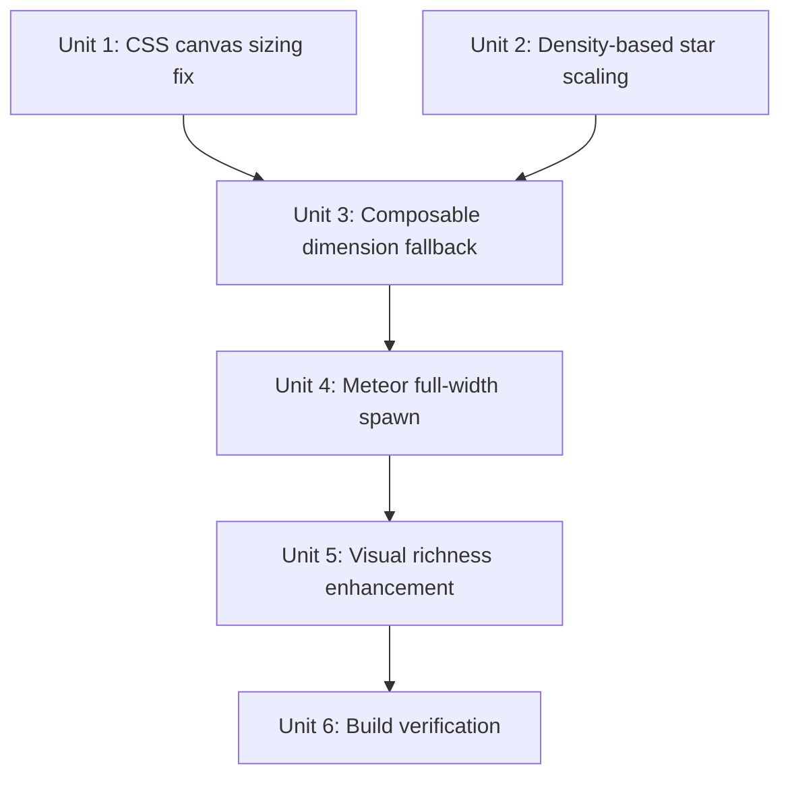

# fix: Login cosmic background fullscreen and PC widescreen adaptation

## Overview

The cosmic star background animation on the login page only renders in the top-left corner instead of covering the full viewport. On PC widescreen, the canvas never fills the screen. Two root causes: (1) the canvas element has no CSS `width`/`height`, so `getBoundingClientRect()` returns zero at mount time; (2) star counts are fixed and too low for wide viewports. This fix corrects canvas sizing, ensures stars fill the full viewport density, and enhances the visual effect to match the "宇宙星系环绕流动" (galaxy swirling) intent.

## Problem Frame

After the initial implementation (plan `2026-04-07-001`), the animation is broken in two ways:

1. **Canvas only covers top-left corner** — `.cosmic-canvas` uses `position: absolute; inset: 0` but has no explicit `width: 100%; height: 100%` CSS. When `setupDimensions()` calls `canvas.getBoundingClientRect()` on mount, the canvas has no layout size yet, returning `{width: 0, height: 0}`. Stars are initialized for a 0×0 area and only appear in the browser's default 300×150 canvas region.

2. **PC widescreen not adapting** — Star counts in `starField.config.ts` are fixed numbers (e.g., 100 far stars on high tier) designed for a ~375px mobile viewport. On a 1440px PC screen, the same 100 stars are spread across ~15× the area, making the background look nearly empty. The resize handler recreates stars but uses the same fixed counts.

## Requirements Trace

- R1. Canvas must cover the full login page viewport on both mobile and PC
- R2. Star density must feel consistent regardless of viewport size (stars per unit area, not fixed count)
- R3. PC widescreen (≥1024px) must display a rich, immersive galaxy background
- R4. Mobile portrait must continue to work as before (no regression)
- R5. Animation visual quality: stars fill the whole background, meteors traverse the full width
- R6. All existing requirements from the original plan (R1–R10) remain satisfied

## Scope Boundaries

- Fix canvas sizing and star density scaling only
- Enhance visual richness (more stars, galaxy nebula feel) as part of the fix
- No changes to login form logic, auth flow, or other pages
- No new dependencies — Canvas 2D only

## Context & Research

### Relevant Code and Patterns

- `frontend/src/composables/useStarField.ts` — `setupDimensions()` at line 153: uses `getBoundingClientRect()` which returns 0 before CSS layout completes; needs to fall back to `window.innerWidth/innerHeight`
- `frontend/src/composables/useStarField.ts` — `createAllStars()` at line 177: passes fixed `canvasWidth/canvasHeight` to `createStars()`, but those are 0 at init time
- `frontend/src/composables/starField.config.ts` — star counts are absolute numbers, not density-based; `HIGH_TIER_CONFIG` has 150 total stars designed for mobile
- `frontend/src/pages/LoginPage.vue` — `.cosmic-canvas` CSS at line 118: `position: absolute; inset: 0` but missing `width: 100%; height: 100%`
- `frontend/src/utils/deviceTier.ts` — tier detection is correct; PC desktop correctly gets `high` tier (6+ cores, no touch)

### Root Cause Summary

| Bug | Location | Fix |
|-----|----------|-----|
| Canvas 0×0 at mount | `useStarField.ts` `setupDimensions()` | Fall back to `window.innerWidth/innerHeight` when `getBoundingClientRect()` returns 0 |
| Canvas has no CSS size | `LoginPage.vue` `.cosmic-canvas` | Add `width: 100%; height: 100%` to CSS |
| Stars too sparse on wide screens | `starField.config.ts` + `createAllStars()` | Scale star count by viewport area relative to a base area (375×812) |
| Meteors only spawn in left 80% | `useStarField.ts` `spawnMeteor()` | Spawn across full width; increase meteor count on high tier |

### Institutional Learnings

- No prior canvas sizing solutions in `docs/solutions/`
- Pattern: Vue `onMounted` fires after DOM insertion but before browser paint; `getBoundingClientRect()` may return 0 for elements that haven't been painted yet — use `window.innerWidth/innerHeight` as reliable fallback

### External References

- MDN: `HTMLCanvasElement` — canvas `width`/`height` attributes are the internal buffer size; CSS `width`/`height` controls display size; both must be set correctly
- MDN: `getBoundingClientRect()` — returns 0 for elements with no layout box (display:none or zero CSS size)

## Key Technical Decisions

- **D1: CSS fix is required AND sufficient for the sizing bug** — Adding `width: 100%; height: 100%` to `.cosmic-canvas` ensures `getBoundingClientRect()` returns correct dimensions at mount. The `window.innerWidth/innerHeight` fallback is a belt-and-suspenders safety net for edge cases (e.g., canvas inside a flex container that hasn't resolved yet).

- **D2: Density-based star count scaling** — Instead of fixed counts, compute star count as `baseCount × (viewportArea / baseArea)` where `baseArea = 375 × 812` (standard mobile). This keeps visual density consistent across screen sizes. Cap the multiplier at ~4× to avoid excessive star counts on very large monitors.

- **D3: Enhance visual richness for the "galaxy swirling" intent** — The original counts (100/40/10 for high tier) are too sparse even on mobile. Increase base counts and add a subtle nebula-like color variation (mix of white, light blue, and faint purple stars) to better match the "宇宙星系环绕流动" description. This is a visual quality fix, not scope creep.

- **D4: Meteor spawn range covers full canvas width** — Current spawn logic uses `random(0, canvasWidth * 0.8)` which concentrates meteors in the left portion. Fix to spawn from `random(-canvasWidth * 0.2, canvasWidth * 0.8)` so meteors can enter from off-screen left and traverse the full width.

- **D5: No structural refactor** — The composable architecture, cleanup pattern, FPS throttling, and device tier system are all correct. Only targeted fixes to sizing, density, and spawn range.

## Open Questions

### Resolved During Planning

- Q: Should `setupDimensions()` use `window.innerWidth/innerHeight` or fix the CSS?
  - **Resolution:** Both. CSS fix (`width: 100%; height: 100%`) is the primary fix. `window.innerWidth/innerHeight` fallback in `setupDimensions()` guards against edge cases. Belt-and-suspenders is appropriate here since the canvas is decorative and a sizing failure is silent.

- Q: Should star counts be density-based or just increased?
  - **Resolution:** Density-based scaling with a cap. Pure increase would over-render on large monitors; pure fixed increase doesn't help if the canvas is still 0×0 at init. Density scaling solves both problems.

- Q: Is the "galaxy swirling" visual enhancement in scope for this fix?
  - **Resolution:** Yes — the user explicitly described the desired effect as "宇宙星系环绕流动，星辰闪烁、流星划过". The current sparse star count doesn't achieve this even when the canvas is correctly sized. Increasing base counts and adding color variety is part of fixing the visual to match intent.

### Deferred to Implementation

- Q: Exact density multiplier cap value (currently proposed: 4×)
  - **Deferred:** Will be tuned visually during implementation on actual wide-screen devices.

- Q: Whether to add a subtle nebula/glow layer (radial gradient overlay on canvas)
  - **Deferred:** Optional enhancement; implement only if the star-only approach still looks flat on PC.

## High-Level Technical Design

> *This illustrates the intended approach and is directional guidance for review, not implementation specification. The implementing agent should treat it as context, not code to reproduce.*

### Fix Flow

```
CSS fix: .cosmic-canvas { width: 100%; height: 100% }
  ↓
setupDimensions():
  rect = canvas.getBoundingClientRect()
  canvasWidth  = rect.width  > 0 ? rect.width  : window.innerWidth
  canvasHeight = rect.height > 0 ? rect.height : window.innerHeight
  ↓
createAllStars():
  areaMultiplier = clamp(canvasWidth * canvasHeight / (375 * 812), 1, 4)
  count = round(baseCount * areaMultiplier)
  ↓
spawnMeteor():
  x = random(-canvasWidth * 0.2, canvasWidth * 0.8)  // full-width traversal
```

### Star Density Scaling

| Viewport | Area ratio | Multiplier (capped 4×) | High-tier far stars |
|----------|-----------|------------------------|---------------------|
| 375×812 (mobile) | 1.0× | 1.0× | 100 |
| 768×1024 (tablet) | 2.6× | 2.6× | 260 |
| 1440×900 (PC) | 4.2× | 4.0× (capped) | 400 |
| 1920×1080 (PC) | 6.7× | 4.0× (capped) | 400 |

## Implementation Units



---

- [ ] **Unit 1: Fix canvas CSS sizing**

**Goal:** Ensure `.cosmic-canvas` has explicit CSS dimensions so `getBoundingClientRect()` returns correct values at mount time.

**Requirements:** R1, R4

**Dependencies:** None

**Files:**
- Modify: `frontend/src/pages/LoginPage.vue` (`.cosmic-canvas` style block)

**Approach:**
- Add `width: 100%` and `height: 100%` to `.cosmic-canvas` CSS rule
- The existing `position: absolute; inset: 0` already positions it correctly; the missing piece is explicit dimensions
- No template or script changes needed in this unit

**Patterns to follow:**
- Existing scoped style block in `LoginPage.vue`

**Test scenarios:**
- Happy path: On mobile (375px), canvas element's `getBoundingClientRect()` returns `{width: 375, height: ~812}` after mount
- Happy path: On PC (1440px), canvas element's `getBoundingClientRect()` returns `{width: 1440, height: ~900}` after mount
- Edge case: Canvas does not overflow or create scrollbars (parent `.login-page` has `overflow: hidden`)

**Verification:**
- In browser DevTools, canvas element shows correct computed width/height matching viewport
- No horizontal or vertical scrollbar introduced

---

- [ ] **Unit 2: Density-based star count scaling in config**

**Goal:** Replace fixed star counts with a density-scaling mechanism so star visual density is consistent across viewport sizes.

**Requirements:** R2, R3

**Dependencies:** None (config change only)

**Files:**
- Modify: `frontend/src/composables/starField.config.ts`

**Approach:**
- Add a `baseDensityArea` constant (375 × 812 = 304,500 px²) representing the reference mobile viewport
- Add a `getScaledCount(baseCount, viewportArea, maxMultiplier)` helper function that returns `Math.round(baseCount * clamp(viewportArea / baseDensityArea, 1, maxMultiplier))`
- Export this helper so `useStarField.ts` can call it when creating stars
- Keep existing tier configs as-is (they define base counts for mobile); scaling is applied at runtime
- `maxMultiplier` defaults to 4 for all tiers; low tier may use 2 to stay lightweight

**Patterns to follow:**
- Pure function exports pattern already used in `starField.config.ts` (`getTierConfig`, `getTotalStarCount`)

**Test scenarios:**
- Happy path: `getScaledCount(100, 375*812, 4)` returns 100 (mobile baseline, no scaling)
- Happy path: `getScaledCount(100, 1440*900, 4)` returns 400 (capped at 4×)
- Edge case: `getScaledCount(100, 200*400, 4)` returns 100 (minimum 1× — never scales down below base)
- Edge case: `getScaledCount(25, 1920*1080, 2)` returns 50 (low tier capped at 2×)

**Verification:**
- TypeScript compiles without errors
- Function returns integer values (Math.round applied)
- Multiplier never exceeds `maxMultiplier` and never goes below 1

---

- [ ] **Unit 3: Fix composable dimension fallback and apply density scaling**

**Goal:** Fix `setupDimensions()` to use `window.innerWidth/innerHeight` as fallback, and apply density-based star count scaling in `createAllStars()`.

**Requirements:** R1, R2, R3, R6

**Dependencies:** Unit 1 (CSS fix), Unit 2 (scaling helper)

**Files:**
- Modify: `frontend/src/composables/useStarField.ts`

**Approach:**
- In `setupDimensions()`: after `getBoundingClientRect()`, check if `rect.width === 0 || rect.height === 0`; if so, use `window.innerWidth` / `window.innerHeight` as fallback values for `canvasWidth`/`canvasHeight`
- In `createAllStars()`: compute `viewportArea = canvasWidth * canvasHeight`, then call `getScaledCount(config.farStars.count, viewportArea, 4)` (and similarly for mid/near) to get the actual count to pass to `createStars()`
- Pass the scaled count into `createStars()` rather than `config.farStars.count` directly — `createStars()` already accepts `count` via `StarLayerConfig`, so either pass a modified config object or add a `count` override parameter
- The resize handler already calls `setupDimensions()` then `createAllStars()`, so density scaling will automatically apply on resize

**Patterns to follow:**
- Existing `setupDimensions()` pattern in `useStarField.ts`
- Existing `createAllStars()` pattern

**Test scenarios:**
- Happy path: After CSS fix, `canvasWidth` equals viewport width at mount
- Edge case: If `getBoundingClientRect()` returns 0 (e.g., canvas hidden), fallback to `window.innerWidth/innerHeight` — stars still initialize correctly
- Edge case: After window resize to 1440px wide, `createAllStars()` produces ~4× more stars than at 375px
- Edge case: Calling `start()` twice does not create duplicate star arrays (existing guard `if (isRunning.value) return` handles this)
- Integration: Stars are distributed across the full canvas area, not clustered in top-left

**Verification:**
- On PC (1440px), DevTools shows canvas width = 1440, and stars visually cover the full background
- On mobile (375px), star count matches original behavior (no regression)
- Resize from mobile to desktop emulation in DevTools updates star count and distribution

---

- [ ] **Unit 4: Fix meteor spawn range for full-width traversal**

**Goal:** Meteors spawn across the full canvas width and can enter from off-screen left, creating full-width traversal.

**Requirements:** R5

**Dependencies:** Unit 3

**Files:**
- Modify: `frontend/src/composables/useStarField.ts` (`spawnMeteor()` function)

**Approach:**
- Change spawn x from `random(0, canvasWidth * 0.8)` to `random(-canvasWidth * 0.1, canvasWidth * 0.7)`
- This allows meteors to enter from slightly off-screen left and traverse toward the right edge
- Spawn y range stays `random(-50, canvasHeight * 0.3)` — upper portion of screen
- On high tier, consider increasing `maxActive` from 2 to 3 in `HIGH_TIER_CONFIG` for richer effect on wide screens (config change in `starField.config.ts`)

**Patterns to follow:**
- Existing `spawnMeteor()` logic in `useStarField.ts`

**Test scenarios:**
- Happy path: Meteors appear across the full width of the canvas, not just the left 80%
- Edge case: Meteors spawning off-screen left (-x) still move correctly toward the right and eventually deactivate when `x > canvasWidth + 100`
- Edge case: On low tier (meteors disabled), no change in behavior

**Verification:**
- Visual inspection: meteors traverse from left edge to right edge on wide screens
- No meteors stuck or looping (deactivation condition `x > canvasWidth + 100` still applies)

---

- [ ] **Unit 5: Enhance visual richness — star colors and base counts**

**Goal:** Increase base star counts and add color variety to achieve the "宇宙星系环绕流动" galaxy atmosphere.

**Requirements:** R3, R5

**Dependencies:** Unit 3 (density scaling must be in place first)

**Files:**
- Modify: `frontend/src/composables/starField.config.ts` (base counts and star colors)
- Modify: `frontend/src/composables/useStarField.ts` (color selection per star)

**Approach:**
- Increase base counts in `HIGH_TIER_CONFIG`: far stars 100→150, mid stars 40→60, near stars 10→15 (these are mobile baselines; density scaling will multiply them for PC)
- Add a third star color to `STAR_COLORS`: `accent: 'rgba(180, 160, 255, 1)'` (faint purple, complements the `#764ba2` gradient end)
- In `useStarField.ts` `draw()`, assign color based on layer: far=primary (white), mid=secondary (light blue) or accent (purple) randomly at ~20% chance, near=bright (warm white)
- Keep alpha values subtle — the accent color should be barely perceptible, adding depth without distraction

**Patterns to follow:**
- Existing `STAR_COLORS` object in `starField.config.ts`
- Existing color selection in `draw()` in `useStarField.ts`

**Test scenarios:**
- Happy path: On high tier PC, background shows a rich field of stars with subtle color variation
- Happy path: On low tier mobile, star count remains minimal (low tier base counts unchanged)
- Edge case: Color variation does not make stars too prominent or distract from the login form
- Edge case: Accent color (purple) is only applied to mid-layer stars, not near (bright) stars

**Verification:**
- Visual inspection: background feels like a galaxy, not a sparse dot field
- Form text remains readable (white text on gradient + stars)
- No new TypeScript errors from color changes

---

- [ ] **Unit 6: TypeScript type check and build verification**

**Goal:** Confirm all changes compile and build cleanly.

**Requirements:** R6

**Dependencies:** Units 1–5

**Files:**
- Run: `frontend/` type check and build

**Approach:**
- Run `npx vue-tsc -b --noEmit` from `frontend/`
- Run `npm run build` from `frontend/`

**Test scenarios:**
- Happy path: TypeScript check passes with zero errors
- Happy path: Production build completes successfully

**Verification:**
- `vue-tsc` exits with code 0
- `npm run build` produces dist files without errors

---

## System-Wide Impact

- **Interaction graph:** Changes are isolated to `LoginPage.vue`, `useStarField.ts`, `starField.config.ts`, and `deviceTier.ts` (no changes to deviceTier). No callbacks, middleware, or other components affected.
- **Error propagation:** Canvas sizing fallback is silent — if both `getBoundingClientRect()` and `window.innerWidth` fail (impossible in browser), animation simply doesn't start (existing behavior).
- **State lifecycle risks:** Density scaling in `createAllStars()` is called on resize; no new state introduced. Star arrays are replaced (not appended) on resize — no memory accumulation.
- **API surface parity:** No API changes.
- **Integration coverage:** Login form submit, validation, and navigation are unchanged. Canvas is `pointer-events: none` and `aria-hidden="true"` — no accessibility regression.
- **Unchanged invariants:** Auth flow, form validation, router navigation, ALTCHA captcha widget — all untouched.

## Risks & Dependencies

| Risk | Likelihood | Impact | Mitigation |
|------|-----------|--------|------------|
| Density scaling creates too many stars on large monitors | Medium | Low | Cap multiplier at 4×; low tier capped at 2× |
| CSS `width: 100%; height: 100%` causes layout shift | Low | Low | Parent `.login-page` already has `overflow: hidden`; canvas is absolute positioned |
| `window.innerWidth` fallback fires on normal mounts (CSS fix not applied) | Low | None | Belt-and-suspenders; fallback is correct behavior regardless |
| Increased star counts degrade performance on mid-tier devices | Low | Medium | Density scaling only applies to high tier by default; medium tier base counts unchanged |
| Color accent (purple) clashes with gradient | Low | Low | Accent is faint (`rgba(180,160,255,1)` at low alpha); tunable in config |

## Documentation / Operational Notes

- After this fix, `starField.config.ts` base counts represent mobile (375×812) density; PC density is computed at runtime
- To tune PC density: adjust `maxMultiplier` in `getScaledCount()` calls in `createAllStars()`
- To tune mobile density: adjust base counts in tier configs as before
- Future extension to `RegisterPage.vue` / `JoinFamilyPage.vue` will automatically benefit from the density scaling

## Sources & References

- Related plan: `docs/plans/2026-04-07-001-feat-login-cosmic-background-plan.md`
- Related code: `frontend/src/composables/useStarField.ts`, `frontend/src/composables/starField.config.ts`, `frontend/src/pages/LoginPage.vue`, `frontend/src/utils/deviceTier.ts`
- MDN Canvas API: https://developer.mozilla.org/en-US/docs/Web/API/Canvas_API
- MDN getBoundingClientRect: https://developer.mozilla.org/en-US/docs/Web/API/Element/getBoundingClientRect
