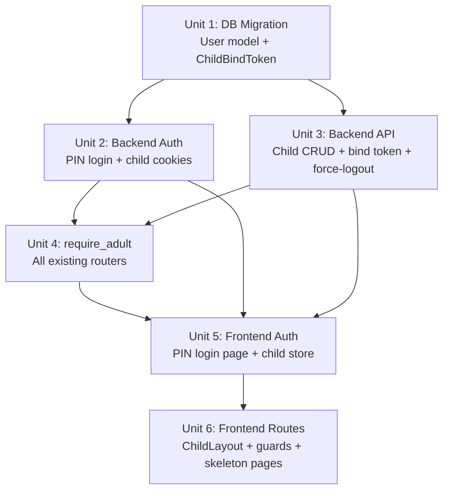

# feat: Child Identity System — Emoji PIN Auth + /child/* Route Isolation

## Overview

Extend Numina with a child identity layer: a new `role='child'` user type authenticated via a 4-emoji PIN (from a fixed 12-emoji grid), isolated to a dedicated `/child/*` route tree, and completely separated from the adult financial interface. This is the foundational infrastructure for the Star Coins gamification system.

## Problem Frame

Numina currently exposes all 35+ routes to every authenticated user. Children (ages 5–8) need an independent login path (emoji PIN, no username/password), a child-only UI, and hard isolation from adult financial data. Parents need to create child accounts, switch between adult and child views on shared devices, and manage child sessions.

See origin: `docs/brainstorms/2026-04-14-child-identity-system-requirements.md`

## Requirements Trace

- R1. `User.role` extended to support `'child'`
- R2. `pin_hash` field (TEXT, nullable) added; `username`/`password_hash` become nullable; bcrypt + timing-attack protection
- R3. Child accounts family-scoped, owner-created only
- R4. Child accounts use `display_name` + `avatar_color`; no username/email
- R5–R7. Child account creation wizard (parent-initiated); management in family members page
- R8. 12-emoji fixed grid PIN: 🐱🐶🐸🦊🐼🐨🦁🐯🌟🌈🍎🎈; 4-emoji sequence
- R9. Shared device: parent switches via "切换到孩子视角" → child picker → PIN
- R10. Independent device: family binding via parent-generated 24h single-use invite link; device stores `family_id` locally
- R11. PIN lockout: 3 failures → 15-min DB-stored lockout; parent can unlock early
- R12. Child refresh tokens: 10-year expiry + `token_version` revocation
- R13. Return to adult mode: requires any `owner`-role password from same family
- R14. Child session preserved after switching back to adult (independent cookie names)
- R15. Force-logout: increments `token_version` on User; effective within 15 min (next access token expiry)
- R16–R18. `/child/*` route tree with `ChildLayout.vue`; skeleton routes for 4 tabs; role-based route guards

## Scope Boundaries

- Child UI page content (star coins, tasks, wishes, treasures) is **not** in scope — skeleton routes only
- No biometric PIN replacement
- No child self-registration
- No child-to-child permission differences
- No real-time token revocation (force-logout effective within 15 min)
- Independent device binding QR code rendering is out of scope — share as URL link only


## Context & Research

### Relevant Code and Patterns

- `backend/app/models/user.py` — User ORM model; `role: Mapped[str]` is `String(10)`; `username` has `unique=True, nullable=False` (must change); `password_hash` is `nullable=False` (must change); nullable pattern: follow `ai_chat_last_read_at: Mapped[datetime | None]`
- `backend/app/auth/deps.py` — `create_access_token({"sub": user.id})` and `create_refresh_token({"sub": user.id})`; role is NOT in JWT — always fetched from DB via `get_current_user`
- `backend/app/auth/cookies.py` — `set_auth_cookies()` sets `access_token` + `refresh_token` httpOnly cookies; child sessions use `child_access_token` + `child_refresh_token` cookie names
- `backend/app/services/auth.py` — `login()` queries by `username`; PIN login is a new separate service function; existing rate limiter keys on `username` (in-memory/cache)
- `backend/app/services/family.py` — `update_member_role` hardcodes `('owner', 'member')` allowlist — must add `'child'`; `remove_member` does not cascade-delete assets
- `backend/app/routers/auth.py` — `verify_captcha` dependency on register/login; PIN endpoint skips captcha
- `backend/app/schemas/auth.py` — `UserResponse.username` is `str` (must become `str | None`); new schemas: `CreateChildRequest`, `ChildPinLoginRequest`
- `backend/alembic/versions/` — latest migration: `2a9cb7dc0b62`; all migrations use `batch_alter_table` for SQLite compatibility
- `frontend/src/router/index.ts` — guard only checks `!!getUser()`; no role check; `/child/*` subtree is entirely new
- `frontend/src/utils/storage.ts` — `StoredUser` has `role: string`; `setUser()` whitelists fields; `family_id` not stored (must add `child_family_id` as separate key for independent device binding)
- `frontend/src/layouts/MainLayout.vue` — minimal shell: `<router-view /> + <AppTabBar />`; `ChildLayout.vue` mirrors this with `<ChildTabBar />`
- `frontend/src/stores/auth.ts` — single `user` ref; no stacked session concept; child session uses separate store or parallel ref

### Institutional Learnings

- `docs/solutions/best-practices/security-protection.md` — timing attack protection is mandatory; PIN endpoint needs its own rate limiter entry in `RateLimitMiddleware` skip list; config-driven thresholds
- `docs/solutions/best-practices/security-audit.md` — new auth events must log to `logs/security.log` via `security_log` service: `child_pin_success`, `child_pin_failed`, `child_pin_rate_limited`

### External References

- bcrypt cost factor 8 (vs default 12) for PIN hashing — fast enough for UX, slow enough to resist offline brute force on the 20,736-permutation space
- Partial unique index (`WHERE username IS NOT NULL`) for SQLite/MySQL/PostgreSQL cross-compatibility
- Dummy bcrypt verify on missing `child_id` for constant-time timing protection (same pattern as adult `login()`)


## Key Technical Decisions

- **Independent cookie names for child sessions**: child login sets `child_access_token` + `child_refresh_token` httpOnly cookies; adult `access_token` + `refresh_token` cookies are untouched. On "return to adult mode", frontend clears child cookies; adult cookies are still valid. This avoids session stacking complexity in the auth store. A `get_current_child_user` dependency (reading `child_access_token` cookie) is required alongside `get_current_user` — the existing `get_current_user` reads only `access_token` by name and cannot be reused for child endpoints.

- **`token_version` integer on User for revocation**: `create_refresh_token` embeds `token_version` in JWT claims; `refresh_token()` service rejects tokens where claim version ≠ DB version. Force-logout (R15) increments `token_version`. Effective within 15 min (next access token expiry). Applies to both adult and child tokens. Both `create_refresh_token()` and `refresh_token()` must be updated atomically; backward-compat relies on `payload.get('token_version', 0)` defaulting to 0 (matching DB default of 0 for all pre-existing users) — not a hard failure on missing claim.

- **DB-stored PIN lockout (`pin_locked_until`, `pin_fail_count`)**: consistent with the self-hosted, no-Redis deployment model. The lockout check happens before bcrypt verify; the locked-out path uses a dummy bcrypt verify (cost=8) rather than `asyncio.sleep` to match the timing distribution of the wrong-PIN path and avoid leaking lockout state via response time.

- **Partial unique index on `username`**: migration drops the existing `UNIQUE` constraint on `username` inside `batch_alter_table`, then creates a partial index via a standalone `op.create_index('ix_users_username_unique', 'users', ['username'], unique=True, sqlite_where=text('username IS NOT NULL'), postgresql_where=text('username IS NOT NULL'))` call outside the batch block. MySQL 8+ requires a functional index — document as unsupported for MySQL or enforce at application level. Adult accounts retain uniqueness; child accounts can have multiple NULLs.

- **PIN canonical form**: 4-emoji sequence joined as a single UTF-8 string (no separator), NFC-normalized, before bcrypt hashing. Frontend sends `pin: [emoji, emoji, emoji, emoji]` array; backend joins and normalizes before verify. Documented in `CreateChildRequest` schema validation.

- **`require_adult` dependency on all existing routers**: new `deps.py` function raises HTTP 403 if `user.role == 'child'`. Applied per-function (replacing `get_current_user` in each function signature) rather than at `APIRouter` level — `family.py` has mixed child/adult endpoints on the same router, and router-level dependencies cannot be selectively excluded per endpoint. Child-specific endpoints use `get_current_child_user` or `get_current_user` directly.

- **Skeleton `/child/*` routes only**: 4 tab routes (`/child/`, `/child/wishes`, `/child/tasks`, `/child/treasures`) with placeholder pages. Content filled by subsequent feature brainstorms.

- **"Return to adult mode" accepts any `owner`-role password from same family**: backend verifies password against all `role='owner'` users in the family; returns the matching owner's tokens. Requires child JWT cookie as prerequisite (prevents unauthenticated brute-force).

- **24h single-use child binding link**: new `child_bind_token` + `child_bind_token_expires_at` fields on `Family` model (or a separate `ChildBindToken` table — use separate table to support multiple concurrent pending binds). Token invalidated on first successful use.

- **`family_id` for independent device stored as `child_family_id` in localStorage**: separate key from `StoredUser` to avoid polluting the user object. Used only for UI display (showing family name on child login screen); never trusted by backend for authorization.


## Open Questions

### Resolved During Planning

- **PIN allows repeated emojis?** Yes — 12^4 = 20,736 permutations. Accepted risk documented; PIN is a convenience UX mechanism, not a financial security boundary.
- **Which owner password accepted for "return to adult mode"?** Any `role='owner'` user in the same family. Backend looks up owners server-side after password verification; client does not supply owner ID.
- **`username` uniqueness with NULLs across DB backends?** Partial unique index (`WHERE username IS NOT NULL`) — supported by SQLite, MySQL 8+, PostgreSQL.
- **Child binding link: single-use or multi-use?** Single-use. Invalidated on first successful device bind.
- **Child session cookie isolation?** Independent cookie names: `child_access_token` + `child_refresh_token`. Adult cookies untouched during child session.
- **Force-logout mechanism?** `token_version` integer on User; embedded in refresh token JWT; incremented on force-logout.

### Deferred to Implementation

- **`set_child_auth_cookies()` exact `max_age` value**: 10 years = 315,360,000 seconds. Confirm this doesn't exceed browser cookie limits (most browsers support up to ~400 days for `max-age` per RFC 6265bis — use `timedelta(days=365*10)` in token but set cookie `max_age` to 400 days; child will re-authenticate cookie but token remains valid).
- **`ChildBindToken` table vs fields on `Family`**: use a separate `ChildBindToken` table (supports multiple concurrent pending binds per family). Implementer confirms no existing migration conflicts.
- **`pin_fail_count` reset behavior**: reset to 0 on successful PIN login; does NOT reset when lockout expires (parent must explicitly unlock or wait). Implementer verifies this matches UX intent.
- **`child_family_id` localStorage key format**: plain string UUID. Implementer decides whether to namespace it (e.g., `numina_child_family_id`) to avoid collisions.
- **Rate limiter for PIN endpoint**: do NOT add `/api/v1/auth/child/login` to `RateLimitMiddleware.SKIP_PATHS` — the global IP-based rate limit should still apply. Instead, `child_pin_login()` must not call `_check_rate_limit()` (which requires a username); the DB-stored `pin_locked_until` is the child-specific lockout mechanism.
- **`pin_fail_count` reset behavior**: reset to 0 on successful PIN login AND when `pin_locked_until` has expired (check at start of `child_pin_login()` — if `pin_locked_until < now`, reset `pin_fail_count = 0` before evaluating the new attempt). Without this, the first attempt after lockout expiry immediately triggers another lockout.
- **`verify_parent_password` scope**: only valid on shared devices where adult cookies are already present. On independent devices (no adult session), "return to adult mode" should redirect to the standard adult `/login` page instead of calling this endpoint. Document this constraint in the endpoint's docstring.
- **`PIN_BCRYPT_ROUNDS` config**: add `PIN_BCRYPT_ROUNDS: int = 8` to `config.py` alongside `CHILD_REFRESH_TOKEN_EXPIRE_DAYS`. PIN hashing uses this value regardless of `BCRYPT_ROUNDS` (which governs adult password hashing).
- **Independent device child list re-fetch**: after bind token is consumed, cache the children list in localStorage at bind time. Refresh the cached list after each successful child PIN login. Add `GET /api/v1/auth/child/family/{family_id}/children` (no auth required) to Unit 3 for subsequent visits where the bind token is already consumed.


## High-Level Technical Design

> *This illustrates the intended approach and is directional guidance for review, not implementation specification. The implementing agent should treat it as context, not code to reproduce.*

### Authentication Flow

```
Shared Device — Switch to Child View:
  Parent (adult session) → "切换到孩子视角"
    → GET /api/v1/family/children  (requires adult JWT)
    → Child picker UI
    → Emoji PIN grid (12 emojis, 4 taps)
    → POST /api/v1/auth/child/login { child_id, pin: [e1,e2,e3,e4] }
        ├─ check pin_locked_until (DB)
        ├─ bcrypt.verify(join(pin), user.pin_hash)  [constant-time]
        ├─ on fail: increment pin_fail_count; if ≥3 → set pin_locked_until
        └─ on success: issue child_access_token + child_refresh_token cookies
    → Navigate to /child/

Independent Device — Family Binding:
  Parent → POST /api/v1/family/child-bind-token  (requires adult JWT)
    → ChildBindToken { token, family_id, expires_at, used=False }
    → Share link: https://app/child/bind?token=<token>
  Child device opens link:
    → GET /api/v1/auth/child/bind?token=<token>
        ├─ validate token (not expired, not used)
        ├─ mark token used=True
        └─ return { family_id, family_name, children: [...] }
    → Store child_family_id in localStorage
    → Show child picker → PIN → /child/

Return to Adult Mode:
  Child taps "返回大人模式"
    → POST /api/v1/auth/child/verify-parent { password }
        ├─ requires child_access_token cookie (get_current_child_user)
        ├─ look up all role='owner' users in user.family_id
        ├─ bcrypt.verify(password, owner.password_hash) for each
        └─ on match: return { message: "verified" }
    → Frontend clears child cookies, adult cookies already present
    → Navigate to /
```

### Route Guard Logic

```
router.beforeEach:
  user = getUser()  // from localStorage

  if !user:
    if to.meta.guest → allow
    if to.path starts with /child/bind → allow  (binding flow)
    else → redirect /login

  if user.role === 'child':
    if to.path starts with /child → allow
    else → redirect /child/

  if user.role !== 'child':
    if to.path starts with /child → redirect /
    if to.meta.guest → redirect /
    else → allow
```

### Backend Authorization Layer

```
All existing routers:
  get_current_user → require_adult (raises 403 if role='child')

New child-specific routers (/api/v1/auth/child/*):
  get_current_user (no role restriction, but child-specific logic)

New family child management (/api/v1/family/children/*):
  require_owner (existing pattern, role='owner' only)
```

### Data Model Changes

```
User table additions:
  pin_hash          TEXT        NULL   -- bcrypt hash of 4-emoji sequence
  pin_fail_count    INTEGER     NOT NULL DEFAULT 0
  pin_locked_until  DATETIME    NULL
  token_version     INTEGER     NOT NULL DEFAULT 0

User table modifications:
  username          VARCHAR(50) NULL   -- was NOT NULL; partial unique index
  password_hash     VARCHAR(255) NULL  -- was NOT NULL

New table: child_bind_tokens
  id          VARCHAR(36) PK
  family_id   VARCHAR(36) FK → families.id
  token       VARCHAR(64) UNIQUE NOT NULL
  expires_at  DATETIME    NOT NULL
  used        BOOLEAN     NOT NULL DEFAULT FALSE
  created_at  DATETIME    NOT NULL
```


## Implementation Units



---

- [ ] **Unit 1: Database Migration — User Model Extensions + ChildBindToken Table**

**Goal:** Alembic migration that adds child-identity fields to `users` and creates the `child_bind_tokens` table.

**Requirements:** R1, R2, R3, R12, R15

**Dependencies:** None

**Files:**
- Modify: `backend/app/models/user.py`
- Create: `backend/app/models/child_bind_token.py`
- Create: `backend/alembic/versions/<hash>_add_child_identity_fields.py`
- Modify: `backend/alembic/env.py` (import new model)
- Test: `backend/tests/test_child_identity.py` (new file, migration smoke tests)

**Approach:**
- Add to `User`: `pin_hash` (String(255), nullable), `pin_fail_count` (Integer, default=0, not null), `pin_locked_until` (DateTime, nullable), `token_version` (Integer, default=0, not null)
- Change `User.username` to `nullable=True`; change `User.password_hash` to `nullable=True`
- Drop existing `UNIQUE` constraint on `username` inside `batch_alter_table`; after the `with` block closes, create partial index via standalone `op.create_index('ix_users_username_unique', 'users', ['username'], unique=True, sqlite_where=text('username IS NOT NULL'), postgresql_where=text('username IS NOT NULL'))`. MySQL 8+ requires a functional index — document as unsupported for MySQL or enforce at application level.
- Extend `User.role` comment/validation to include `'child'` (String(10) is wide enough)
- Create `ChildBindToken` model: `id` (UUID PK), `family_id` (FK → families.id), `token` (String(64), unique), `expires_at` (DateTime), `used` (Boolean, default=False), `created_at` (DateTime). Separate table supports multiple concurrent pending binds and atomic single-use invalidation.
- Add `from app.models.child_bind_token import ChildBindToken  # noqa: F401` to `backend/app/main.py` model import block so `Base.metadata.create_all()` creates the table on startup
- Migration `down_revision` = `'2a9cb7dc0b62'` (latest existing migration)
- Use `batch_alter_table` for all `users` table column changes (SQLite requirement)

**Patterns to follow:**
- `backend/alembic/versions/f4af635328aa_*.py` — nullable column addition pattern
- `backend/app/models/user.py` — `ai_chat_last_read_at: Mapped[datetime | None]` for nullable DateTime pattern
- `backend/app/models/family.py` — FK relationship pattern for `ChildBindToken.family_id`

**Test scenarios:**
- Happy path: migration applies cleanly on fresh SQLite DB; `users` table has all new columns with correct defaults
- Happy path: existing adult users retain `username` and `password_hash` values after migration
- Happy path: two child users can both have `username=NULL` without unique constraint violation
- Happy path: adult user `username` uniqueness still enforced after partial index
- Edge case: migration rollback (`downgrade`) removes new columns and table cleanly
- Edge case: `token_version` defaults to 0 for all pre-existing users after migration

**Verification:**
- `uv run alembic upgrade head` completes without error on existing DB
- `uv run alembic downgrade -1` completes without error
- `uv run pytest tests/test_child_identity.py -v` passes


---

- [ ] **Unit 2: Backend Auth — Child PIN Login + Token Infrastructure**

**Goal:** New auth service functions and endpoints for child PIN login, child cookie management, and token_version-aware refresh.

**Requirements:** R2, R8, R11, R12, R13, R15

**Dependencies:** Unit 1

**Files:**
- Modify: `backend/app/auth/deps.py` — add `get_current_child_user()` (reads `child_access_token` cookie), add `create_child_refresh_token()`, update `create_refresh_token()` to embed `token_version`
- Modify: `backend/app/auth/cookies.py` — add `set_child_auth_cookies()`, `clear_child_auth_cookies()`
- Modify: `backend/app/services/auth.py` — add `child_pin_login()`, `verify_parent_password()`, add `child_refresh_token()`, update `refresh_token()` to check `token_version`
- Modify: `backend/app/routers/auth.py` — add `POST /auth/child/login`, `POST /auth/child/refresh`, `POST /auth/child/verify-parent`, `POST /auth/child/logout`
- Modify: `backend/app/schemas/auth.py` — add `ChildPinLoginRequest`, update `UserResponse.username` to `str | None`
- Modify: `backend/app/config.py` — add `CHILD_REFRESH_TOKEN_EXPIRE_DAYS: int = 3650`, `PIN_BCRYPT_ROUNDS: int = 8`
- Modify: `backend/app/services/security_log.py` — add `CHILD_PIN_SUCCESS`, `CHILD_PIN_FAILED`, `CHILD_PIN_RATE_LIMITED` constants to `SecurityEventType`; call via `_log_security_event(SecurityEventType.CHILD_PIN_FAILED, ...)`
- Modify: `backend/app/main.py` — add `from app.models.child_bind_token import ChildBindToken  # noqa: F401` to model import block
- Test: `backend/tests/test_child_identity.py`

**Approach:**
- `get_current_child_user`: reads `child_access_token` cookie (parallel to `get_current_user` which reads `access_token`); used by `POST /auth/child/verify-parent` and `POST /auth/child/logout`
- `create_child_refresh_token(data)`: uses `settings.CHILD_REFRESH_TOKEN_EXPIRE_DAYS` (3650); embeds `token_version` from `data`
- `create_refresh_token(data)`: update to also embed `token_version`; verifier uses `payload.get('token_version', 0)` for backward-compat
- `child_refresh_token()` service: reads `child_refresh_token` cookie; checks `token_version`; issues new `child_access_token` cookie
- `POST /auth/child/refresh`: reads `child_refresh_token` cookie; calls `child_refresh_token()` service; sets new `child_access_token` cookie
- `refresh_token()` service: after decoding JWT, fetch user from DB, compare `payload.get('token_version', 0) == user.token_version`; reject with 401 if mismatch
- `set_child_auth_cookies(response, access_token, refresh_token)`: sets `child_access_token` + `child_refresh_token` httpOnly cookies; cookie `max_age` = 400 days; token itself has 10-year expiry
- `child_pin_login(db, child_id, pin_sequence)`:
  1. Fetch user by `id` where `role='child'` and `is_active=True`; if not found → dummy bcrypt verify (timing protection)
  2. If `pin_locked_until` is set and has expired → reset `pin_fail_count = 0`, clear `pin_locked_until`
  3. Check `pin_locked_until`: if still active → run dummy bcrypt verify (cost=`settings.PIN_BCRYPT_ROUNDS`) to normalize timing, then raise 423
  4. Normalize PIN: `"".join(pin_sequence)` NFC-normalized UTF-8
  5. `bcrypt.verify(normalized_pin, user.pin_hash)` with `settings.PIN_BCRYPT_ROUNDS` (8)
  6. On fail: increment `pin_fail_count`; if ≥ 3 → set `pin_locked_until = now + 15min`; log `SecurityEventType.CHILD_PIN_FAILED`
  7. On success: reset `pin_fail_count = 0`; log `SecurityEventType.CHILD_PIN_SUCCESS`; issue tokens with `token_version`
- `verify_parent_password(db, child_user, password)`: find all `role='owner'` users in `child_user.family_id`; bcrypt.verify against each; return matching owner or raise 401. **Only valid on shared devices** — on independent devices, frontend redirects to `/login` instead
- `POST /auth/child/login`: no captcha dependency; global IP-based rate limit still applies (do NOT add to `SKIP_PATHS`)
- `POST /auth/child/verify-parent`: requires `get_current_child_user` (child_access_token cookie); validates `user.role == 'child'`
- Validate PIN sequence: each element must be in `ALLOWED_EMOJIS = ["🐱","🐶","🐸","🦊","🐼","🐨","🦁","🐯","🌟","🌈","🍎","🎈"]`
- Frontend `api/index.ts`: add role-aware 403 handler — if `getUser()?.role === 'child'` and status 403, redirect to `/child/`

**Patterns to follow:**
- `backend/app/services/auth.py` `login()` — timing attack protection pattern (dummy bcrypt on missing user)
- `backend/app/auth/cookies.py` `set_auth_cookies()` — cookie naming and httpOnly pattern
- `backend/app/services/security_log.py` — existing log method signatures

**Test scenarios:**
- Happy path: valid child_id + correct 4-emoji PIN → 200, `child_access_token` + `child_refresh_token` cookies set
- Happy path: `pin_fail_count` resets to 0 on successful login
- Happy path: `POST /auth/child/refresh` with valid child_refresh_token → new child_access_token cookie set
- Happy path: `token_version` embedded in refresh token; refresh succeeds when versions match
- Error path: wrong PIN → 401, `pin_fail_count` incremented
- Error path: 3 wrong PINs → `pin_locked_until` set; 4th attempt → 423 locked response
- Error path: locked account → response time indistinguishable from wrong-PIN response (timing normalization)
- Error path: non-existent `child_id` → same response time as wrong PIN (timing protection)
- Error path: PIN contains emoji not in allowed set → 422 validation error
- Error path: `token_version` mismatch on refresh → 401
- Integration: `verify_parent_password` with valid owner password → 200; with member password → 401; with wrong password → 401
- Integration: child token cannot access `GET /api/v1/assets` (blocked by `require_adult` — Unit 4)

**Verification:**
- `uv run pytest tests/test_child_identity.py -v -k "auth"` passes
- `uv run pytest tests/ -v` (full suite) still passes — no regressions on adult auth


---

- [ ] **Unit 3: Backend API — Child Account CRUD + Device Binding + Force-Logout**

**Goal:** Family-scoped endpoints for creating/managing child accounts, generating device binding tokens, and force-logout.

**Requirements:** R3, R4, R5, R6, R7, R10, R11, R15

**Dependencies:** Unit 1

**Files:**
- Create: `backend/app/routers/children.py` — new router with prefix `/family/children`
- Create: `backend/app/services/children.py` — child account business logic
- Create: `backend/app/schemas/children.py` — `CreateChildRequest`, `UpdateChildRequest`, `ChildResponse`, `ChildBindTokenResponse`, `UnlockChildRequest`
- Modify: `backend/app/main.py` — register new `children` router
- Modify: `backend/app/services/family.py` — update `update_member_role` allowlist to include `'child'`
- Modify: `backend/app/routers/family.py` — exclude `invite_code` from response when `user.role == 'child'` (or block endpoint entirely for child role via `require_adult`)
- Test: `backend/tests/test_child_identity.py`

**Approach:**
- `GET /auth/child/family/{family_id}/children` (no auth required): returns children list for a given family_id; used by independent devices on subsequent visits after bind token is consumed. Add to `auth.py` router. Returns only `id`, `display_name`, `avatar_color` — no sensitive fields.
- `POST /family/children` (owner only): create child account; `display_name` required, `avatar_color` optional (default `#4F46E5`); `pin` array of 4 emojis; hash PIN with bcrypt `settings.PIN_BCRYPT_ROUNDS`; `username=None`, `password_hash=None`, `role='child'`; generate UUID for `id`
- `GET /family/children` (adult only): list all `role='child'` users in family; used by shared-device child picker
- `PATCH /family/children/{id}` (owner only): update `display_name`, `avatar_color`, reset PIN
- `DELETE /family/children/{id}` (owner only): set `is_active=False` (soft delete; assets/wishes remain)
- `POST /family/children/{id}/unlock` (owner only): clear `pin_locked_until`, reset `pin_fail_count=0`
- `POST /family/children/{id}/force-logout` (owner only): increment `user.token_version`
- `POST /family/child-bind-token` (owner only): create `ChildBindToken` record; `token` = `secrets.token_urlsafe(32)`; `expires_at = now + 24h`; return token + shareable URL
- `GET /auth/child/bind` (no auth): validate bind token (not expired, not used); mark `used=True`; return `{ family_id, family_name, children: [ChildResponse] }`; add to `auth.py` router

**Patterns to follow:**
- `backend/app/routers/family.py` — owner-only guard pattern (`if current_user.role != 'owner': raise 403`)
- `backend/app/routers/assets.py` — CRUD pattern with family scoping
- `backend/app/services/auth.py` `register()` — user creation pattern (UUID, bcrypt)

**Test scenarios:**
- Happy path: owner creates child account → 201, child appears in `GET /family/children`
- Happy path: owner resets child PIN → child can login with new PIN
- Happy path: owner unlocks child → `pin_locked_until` cleared, `pin_fail_count` reset to 0
- Happy path: owner force-logouts child → `token_version` incremented; child's next refresh → 401
- Happy path: bind token generated → `GET /auth/child/bind?token=<token>` returns family + children list
- Error path: member (non-owner) tries to create child → 403
- Error path: child token tries to create child → 403 (blocked by `require_adult`)
- Error path: bind token used twice → 400 on second use
- Error path: expired bind token → 400
- Error path: create child with PIN containing invalid emoji → 422
- Edge case: family with 5 child accounts — all returned in list
- Edge case: deactivated child account cannot login (PIN login returns 401)

**Verification:**
- `uv run pytest tests/test_child_identity.py -v -k "crud or bind or force"` passes
- `uv run pytest tests/ -v` full suite passes


---

- [ ] **Unit 4: Backend Authorization — `require_adult` Dependency on All Existing Routers**

**Goal:** Prevent child tokens from accessing any adult endpoint by adding a `require_adult` dependency to all existing routers.

**Requirements:** R17 (backend enforcement of route isolation)

**Dependencies:** Unit 1 (role='child' must exist in DB)

**Files:**
- Modify: `backend/app/auth/deps.py` — add `require_adult(user: User = Depends(get_current_user)) -> User`
- Modify: `backend/app/routers/assets.py`
- Modify: `backend/app/routers/liabilities.py`
- Modify: `backend/app/routers/dashboard.py`
- Modify: `backend/app/routers/family.py`
- Modify: `backend/app/routers/categories.py`
- Modify: `backend/app/routers/tags.py`
- Modify: `backend/app/routers/wishes.py`
- Modify: `backend/app/routers/import_.py`
- Modify: `backend/app/routers/export.py`
- Modify: `backend/app/routers/activities.py`
- Modify: `backend/app/routers/files.py`
- Modify: `backend/app/routers/currencies.py`
- Modify: `backend/app/routers/ai_chat.py`, `ai_report.py`, `ai_alerts.py`, `ai_disposal.py`, `ai_allocation.py`, `ai_config.py`, `ai_suggest.py`, `ai_liability.py`
- Explicitly excluded (no `require_adult`): `captcha.py` (pre-auth flow), `upload.py` (pre-auth flow), `ai_internal.py` (uses separate `verify_agent_token` auth)
- Test: `backend/tests/test_child_identity.py`

**Approach:**
- `require_adult`: single function in `deps.py`; raises `HTTPException(403, "子账户无权访问此功能")` if `user.role == 'child'`
- Apply **per-function**: replace `current_user: User = Depends(get_current_user)` with `current_user: User = Depends(require_adult)` in each function signature. Do NOT use router-level `dependencies=[Depends(require_adult)]` — `family.py` has mixed child/adult endpoints on the same router and router-level dependencies cannot be selectively excluded per endpoint
- Exception endpoints in `family.py` that remain child-accessible: `GET /family/children` — keep `get_current_user` with explicit role filtering in response
- `import_.py` additionally needs `require_owner` check (destructive operation — confirm existing owner check or add one)

**Patterns to follow:**
- `backend/app/routers/family.py` — existing `if current_user.role != 'owner'` pattern for escalated checks
- `backend/app/auth/deps.py` — `get_current_user` as the model for a new dependency function

**Test scenarios:**
- Happy path: adult token accesses `GET /api/v1/assets` → 200
- Error path: child token accesses `GET /api/v1/assets` → 403
- Error path: child token accesses `GET /api/v1/dashboard/overview` → 403
- Error path: child token accesses `POST /api/v1/ai_chat/message` → 403
- Error path: child token accesses `POST /api/v1/import` → 403
- Happy path: child token accesses `GET /api/v1/family/children` → 200 (child-accessible endpoint)
- Integration: all 36 existing backend tests still pass (no regressions — adult tokens unaffected)

**Verification:**
- `uv run pytest tests/ -v` — all 36 existing tests pass; new child-authorization tests pass
- Manual spot-check: child JWT returns 403 on at least 3 different adult routers


---

- [ ] **Unit 5: Frontend Auth — PIN Login Page + Child Session Store**

**Goal:** Frontend pages and store for child PIN login, shared-device switching, independent device binding, and return-to-adult-mode flow.

**Requirements:** R8, R9, R10, R11, R13, R14

**Dependencies:** Unit 2, Unit 3

**Files:**
- Create: `frontend/src/api/children.ts` — API calls: `childPinLogin`, `verifyParentPassword`, `getChildBindInfo`, `getChildren`
- Create: `frontend/src/stores/childAuth.ts` — child session state (separate from `auth.ts`)
- Create: `frontend/src/pages/ChildPinLoginPage.vue` — emoji grid PIN input page
- Create: `frontend/src/pages/ChildSelectPage.vue` — child account picker (shared device)
- Create: `frontend/src/pages/ChildBindPage.vue` — independent device family binding flow
- Modify: `frontend/src/utils/storage.ts` — add `getChildFamilyId()`, `setChildFamilyId()`, `clearChildFamilyId()` helpers
- Modify: `frontend/src/api/index.ts` — add role-aware 403 handler: if `getUser()?.role === 'child'` and status 403, redirect to `/child/` (not `/login`); add child token refresh path for 401s on child-session requests (reads `child_refresh_token` cookie via `POST /auth/child/refresh`)
- Test: `frontend/src/stores/childAuth.test.ts`

**Approach:**
- `childAuth.ts` store: `childUser` ref (separate from `auth.ts` `user`); `isChildSession` computed; `childLogin(childId, pinSequence)` → calls API, sets `childUser` from response; `returnToAdult(password)` → calls verify-parent API, clears child cookies (via API logout), restores adult session (adult cookies still present)
- `ChildPinLoginPage.vue`: 12-emoji grid (≥56px buttons per R8); 4-slot PIN display; delete + clear buttons; lockout state display with countdown; calls `childAuth.childLogin()`
- `ChildSelectPage.vue`: fetches `GET /family/children`; avatar + display_name cards; taps → `ChildPinLoginPage` with `child_id` param
- `ChildBindPage.vue`: reads `?token=` from URL; calls `GET /auth/child/bind?token=`; stores `child_family_id` in localStorage; shows child picker → PIN flow
- `storage.ts`: `child_family_id` stored under key `numina_child_family_id`; separate from `StoredUser`
- Cookie handling: child cookies set by backend; frontend does not manually set cookies; `returnToAdult` calls `POST /auth/child/logout` to clear child cookies server-side, then navigates to `/`
- Lockout display: show remaining minutes from `pin_locked_until` in 423 response body; poll-free (show static message, parent unlocks via family page)

**Patterns to follow:**
- `frontend/src/stores/auth.ts` — store structure, `ref`, `computed`, action pattern
- `frontend/src/api/auth.ts` — API call pattern with axios instance
- `frontend/src/utils/storage.ts` — `getUser`/`setUser` pattern for `child_family_id` helpers
- `frontend/src/pages/LoginPage.vue` — form page structure with Vant components

**Test scenarios:**
- Happy path: `childLogin()` with valid child_id + PIN → `childUser` set, `isChildSession` true
- Happy path: `returnToAdult()` with valid owner password → child store cleared, navigate to `/`
- Error path: wrong PIN → error message shown, attempt count displayed
- Error path: 3 wrong PINs → lockout message shown with parent-unlock instruction
- Error path: `ChildBindPage` with expired token → error state shown
- Edge case: `ChildBindPage` with already-used token → error state shown
- Edge case: `child_family_id` persists in localStorage after page reload; child picker shown on next visit

**Verification:**
- `npm run test:run` passes
- `npm run typecheck` passes (no TypeScript errors)
- `npm run build` succeeds


---

- [ ] **Unit 6: Frontend Routes — ChildLayout + Route Guards + Skeleton Pages**

**Goal:** Complete `/child/*` route tree with role-based guards, `ChildLayout.vue`, `ChildTabBar.vue`, and 4 skeleton tab pages.

**Requirements:** R16, R17, R18

**Dependencies:** Unit 5

**Files:**
- Create: `frontend/src/layouts/ChildLayout.vue`
- Create: `frontend/src/components/child/ChildTabBar.vue`
- Create: `frontend/src/pages/child/ChildHomePage.vue` (skeleton)
- Create: `frontend/src/pages/child/ChildWishesPage.vue` (skeleton)
- Create: `frontend/src/pages/child/ChildTasksPage.vue` (skeleton)
- Create: `frontend/src/pages/child/ChildTreasuresPage.vue` (skeleton)
- Modify: `frontend/src/router/index.ts` — add `/child/*` route tree + updated `beforeEach` guard
- Modify: `frontend/src/layouts/MainLayout.vue` — add "切换到孩子视角" entry point (button/menu item linking to `ChildSelectPage`)

**Approach:**
- `ChildLayout.vue`: mirrors `MainLayout.vue` shell; `<router-view />` + `<ChildTabBar />`; `padding-bottom` accounts for tab bar + safe area; bright color scheme (CSS variables or inline); no `fetchFamily()` on mount
- `ChildTabBar.vue`: 4 tabs — 首页 (`/child/`), 心愿 (`/child/wishes`), 任务 (`/child/tasks`), 我的宝贝 (`/child/treasures`); large icons (≥28px); bright colors; uses Vant `van-tabbar` + `van-tabbar-item`
- Skeleton pages: each has a centered placeholder with tab name + "即将推出" text; no data fetching
- "返回大人模式" button: fixed position in `ChildLayout.vue` (top-right or bottom of layout, not in tab bar); taps → modal asking for parent password → calls `childAuth.returnToAdult()`
- Route guard update in `router/index.ts`: **full replacement** of the `beforeEach` body (not an additive patch — the existing guard has no role check at all and must be rewritten):
  - Add `/child/bind` as `meta: { guest: true, childBind: true }` — accessible without any session
  - Child role → only `/child/*` allowed; others redirect to `/child/`
  - Adult role → `/child/*` redirects to `/`
  - No session + path starts with `/child/bind` → allow (binding flow)
  - No session + other paths → `/login` (existing behavior)
- `/child/*` route entry: sibling to existing `'/'` layout route; `component: ChildLayout`; children array with 4 tab routes + `ChildSelectPage` + `ChildPinLoginPage` + `ChildBindPage`

**Patterns to follow:**
- `frontend/src/layouts/MainLayout.vue` — layout shell pattern
- `frontend/src/components/common/AppTabBar.vue` — Vant tabbar pattern
- `frontend/src/router/index.ts` — existing `beforeEach` guard extension

**Test scenarios:**
- Happy path: child session → navigate to `/assets` → redirected to `/child/`
- Happy path: adult session → navigate to `/child/` → redirected to `/`
- Happy path: no session → navigate to `/child/bind?token=x` → allowed (binding page shown)
- Happy path: no session → navigate to `/child/` → redirected to `/login`
- Happy path: child session → all 4 tab routes render without errors
- Edge case: child manually types `/assets` in URL bar → redirected to `/child/`
- Edge case: adult manually types `/child/` in URL bar → redirected to `/`

**Verification:**
- `npm run typecheck` passes
- `npm run build` succeeds
- Manual: child session cannot reach any adult route; adult session cannot reach any child route


## System-Wide Impact

- **Interaction graph:** `get_current_user` is used by every authenticated endpoint — adding `require_adult` as a wrapper affects all 35+ existing routes. The `refresh_token()` service now checks `token_version`; any token issued before this change has no `token_version` claim and will be treated as version 0 (matches DB default of 0 — backward compatible).
- **Error propagation:** Child tokens hitting adult endpoints return 403 (not 401); frontend must handle 403 by redirecting to `/child/` rather than `/login`.
- **State lifecycle risks:** `pin_fail_count` and `pin_locked_until` are written on every failed PIN attempt — high-frequency writes under brute-force. Acceptable for self-hosted deployment; document as known behavior.
- **API surface parity:** `UserResponse.username` changes from `str` to `str | None` — all frontend code that renders `username` must handle null (member cards, profile pages, family member list).
- **Integration coverage:** The shared-device switch flow crosses: frontend child store → `POST /auth/child/login` → DB lockout check → bcrypt verify → child cookie set → router guard redirect. Unit tests alone won't prove this chain; an integration test covering the full login-to-redirect flow is needed.
- **Unchanged invariants:** Adult login/register/refresh flows are unchanged. Existing 36 backend tests must continue to pass. The `invite_code` family join flow for adult members is unchanged.

## Risks & Dependencies

| Risk | Mitigation |
|------|------------|
| `batch_alter_table` partial index syntax differs across SQLite/MySQL/PostgreSQL | Test migration against all three DB profiles; use `op.create_index(..., postgresql_where=..., mysql_where=...)` syntax |
| `token_version` claim missing from tokens issued before this deploy | Default to 0 in `refresh_token()` if claim absent; DB default is 0 — backward compatible |
| Child cookie `max_age` browser limit (some browsers cap at ~400 days) | Set cookie `max_age=400*24*3600`; token itself has 10-year expiry; child re-authenticates cookie silently via refresh |
| `require_adult` applied at router level may miss endpoints added in future | Document convention in `CLAUDE.md`: all new adult routers must use `require_adult` as default dependency |
| PIN timing normalization — dummy sleep duration | Use `asyncio.sleep(0.1)` on locked-out path to match approximate bcrypt verify time; not perfect but sufficient for self-hosted threat model |
| `update_member_role` allowlist update may affect existing role-change flows | Add `'child'` to allowlist but keep child accounts non-promotable (add check: cannot promote `role='child'` to owner/member via this endpoint) |
| Frontend 403 handling — existing interceptor may redirect to `/login` on 403 | Check `frontend/src/api/index.ts` interceptor; add role-aware 403 handler that redirects child sessions to `/child/` |

## Documentation / Operational Notes

- Add `CHILD_REFRESH_TOKEN_EXPIRE_DAYS` to `.env.example` and Docker Compose environment docs
- Update `CLAUDE.md` backend section: new convention — all adult routers use `require_adult` dependency
- Security log events to monitor: `child_pin_rate_limited` (indicates brute-force attempt)
- No data migration needed for existing users — all new fields have safe defaults (NULL or 0)
- `ChildBindToken` records accumulate over time; add a note to implement periodic cleanup of expired tokens in a future maintenance task

## Sources & References

- **Origin document:** [docs/brainstorms/2026-04-14-child-identity-system-requirements.md](docs/brainstorms/2026-04-14-child-identity-system-requirements.md)
- Security patterns: `docs/solutions/best-practices/security-protection.md`
- Audit logging: `docs/solutions/best-practices/security-audit.md`
- Related code: `backend/app/auth/deps.py`, `backend/app/services/auth.py`, `backend/app/auth/cookies.py`
- Related code: `frontend/src/router/index.ts`, `frontend/src/utils/storage.ts`, `frontend/src/stores/auth.ts`
- Latest migration: `backend/alembic/versions/2a9cb7dc0b62_*.py`
