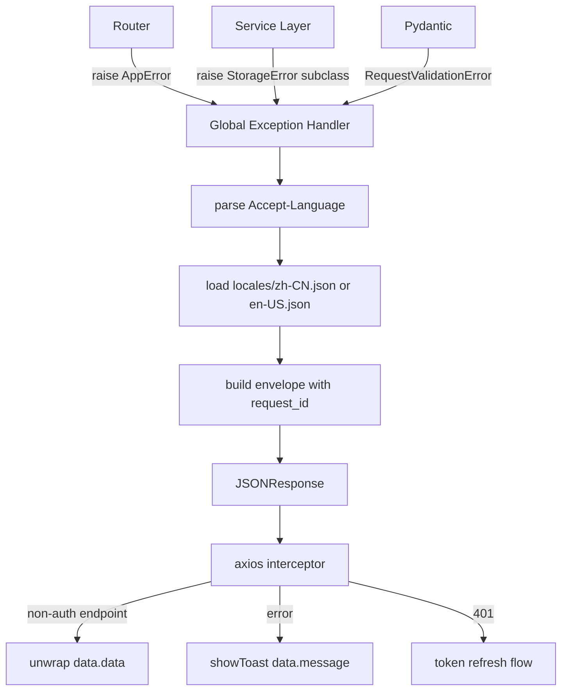

# feat: Unified Error Code + i18n Architecture

## Problem Frame

14 个 router 中散落 `raise HTTPException(detail="中文字符串")`，前端 axios interceptor 硬编码中文错误提示，vue-i18n 已安装但完全绕过。StorageError 层级存在但从未到达 HTTP 层。批量操作失败项无法关联到具体资产 ID。没有请求追踪机制。

本计划覆盖 7 个需求文档，统一实现。

## Scope

**In scope:**
- `backend/app/errors/` — 新建错误码体系（ErrorCode enum、AppError、语言文件）
- `backend/app/middleware/request_id.py` — 新建 RequestID 中间件
- `backend/app/main.py` — 注册全局异常处理器和新中间件
- `backend/app/routers/` — 全量迁移所有 router 的 HTTPException → AppError
- `backend/app/services/asset.py` — 批量操作响应结构升级
- `backend/app/schemas/asset.py` — BatchOperationResponse 升级
- `backend/tests/` — 更新所有测试断言以匹配新 envelope
- `backend/tests/test_error_codes.py` — 新建 CI 完整性验证测试
- `frontend/src/api/index.ts` — 更新 axios interceptor
- `frontend/src/i18n/locales/` — 无需修改（错误消息由后端维护）

**Out of scope:**
- Agent 模块（`backend/agent/`）
- WebSocket 错误处理（AI chat WS）
- 前端表单字段级错误展示（#4 的 R5/R6 推迟到后续 PR）
- 前端空 catch 块清理（#7，独立 PR）

## High-Level Technical Design

### 响应 Envelope

所有 API 响应统一格式：

```
# 成功
{ "code": "OK", "message": "", "data": <原有响应体> }

# 错误
{ "code": "ASSET_NOT_FOUND", "message": "资产不存在", "data": null, "request_id": "abc-123" }

# 422 校验错误
{
  "code": "VALIDATION_ERROR",
  "message": "输入校验失败",
  "data": null,
  "request_id": "abc-123",
  "details": [{ "field": "password", "code": "TOO_SHORT", "msg": "密码长度至少8位" }]
}

# 批量操作（部分失败）
{
  "code": "OK",
  "message": "",
  "data": {
    "success_count": 8,
    "failed_count": 2,
    "partial": true,
    "errors": [{ "id": 42, "error_code": "ASSET_NOT_FOUND", "message": "资产不存在" }]
  }
}
```

### 错误处理流程



### 文件结构（新建）

```
backend/app/errors/
├── __init__.py
├── codes.py          # ErrorCode enum + ERROR_META
├── exceptions.py     # AppError class
└── locales/
    ├── zh-CN.json    # { "ASSET_NOT_FOUND": "资产不存在", ... }
    └── en-US.json    # { "ASSET_NOT_FOUND": "Asset not found", ... }

backend/app/middleware/
├── rate_limit.py     # 已存在
└── request_id.py     # 新建 RequestIDMiddleware
```

## Implementation Units

### Unit 1 — 错误码基础设施（`backend/app/errors/`）
- [ ] 新建 `backend/app/errors/__init__.py`
- [ ] 新建 `backend/app/errors/codes.py`：`ErrorCode(str, Enum)` 枚举，覆盖所有现有 router 错误场景；`ERROR_META: dict[ErrorCode, int]` 映射 code → HTTP status
- [ ] 新建 `backend/app/errors/exceptions.py`：`AppError(Exception)` 接受 `code: ErrorCode`、可选 `details: Any`
- [ ] 新建 `backend/app/errors/locales/zh-CN.json` 和 `en-US.json`，key 为 ErrorCode 枚举值

**ErrorCode 覆盖范围（从现有 router 扫描）：**
- Auth: `AUTH_INVALID_CREDENTIALS`, `AUTH_TOKEN_EXPIRED`, `AUTH_REFRESH_FAILED`, `AUTH_RATE_LIMITED`, `AUTH_FAMILY_NOT_FOUND`, `AUTH_INVITE_CODE_INVALID`, `AUTH_USERNAME_EXISTS`
- Asset: `ASSET_NOT_FOUND`, `ASSET_ALREADY_SOLD`, `ASSET_FORBIDDEN`
- Liability: `LIABILITY_NOT_FOUND`, `LIABILITY_FORBIDDEN`, `LIABILITY_ALREADY_PAID`
- Category: `CATEGORY_NOT_FOUND`, `CATEGORY_SYSTEM_READONLY`, `CATEGORY_FORBIDDEN`
- Tag: `TAG_NOT_FOUND`, `TAG_FORBIDDEN`
- Family: `FAMILY_NOT_FOUND`, `FAMILY_FORBIDDEN`, `FAMILY_MEMBER_NOT_FOUND`
- File: `FILE_NOT_FOUND`, `FILE_PATH_INVALID`, `FILE_SIZE_EXCEEDED`, `FILE_FORMAT_INVALID`
- Storage: `STORAGE_RATE_LIMITED`, `STORAGE_CONFLICT`, `STORAGE_CONNECTION_ERROR`, `STORAGE_AUTH_ERROR`, `STORAGE_ERROR`
- AI: `AI_SERVICE_UNAVAILABLE`, `AI_SERVICE_TIMEOUT`, `AI_CONFIG_NOT_FOUND`, `AI_RATE_LIMITED`
- General: `VALIDATION_ERROR`, `NOT_FOUND`, `FORBIDDEN`, `INTERNAL_ERROR`

**Test file:** `backend/tests/test_error_codes.py` (Unit 6 中新建)

---

### Unit 2 — RequestID 中间件（`backend/app/middleware/request_id.py`）
- [ ] 新建 `RequestIDMiddleware(BaseHTTPMiddleware)`：从 `X-Request-ID` 请求头读取或生成 UUID4，写入 `request.state.request_id`，在所有响应头中返回 `X-Request-ID`
- [ ] 在 `main.py` 中注册，**在 RateLimitMiddleware 之前**（确保 request_id 在所有后续处理中可用）

**中间件注册顺序（main.py）：**
```
app.add_middleware(RateLimitMiddleware)       # 已存在，最后执行
app.add_middleware(SecurityHeadersMiddleware) # 已存在
app.add_middleware(CORSMiddleware, ...)       # 已存在
app.add_middleware(RequestIDMiddleware)       # 新增，最先执行
```
注：`add_middleware` 是栈式注册，最后注册的最先执行。

**Test scenarios:**
- 无 `X-Request-ID` 请求头时，响应头包含自动生成的 UUID4
- 携带 `X-Request-ID: custom-id` 时，响应头返回相同值
- `request.state.request_id` 在 router 中可读取

---

### Unit 3 — 全局异常处理器（`backend/app/main.py`）
- [ ] 注册 `@app.exception_handler(AppError)`：读取 `request.state.request_id`，解析 `Accept-Language`（取第一个语言标签，去权重，fallback zh-CN），加载对应语言文件，返回 envelope；AppError 记录为 `WARNING` 日志，包含 `request_id=`, `error_code=`, `path=`, `method=`, `user_id=anonymous`（暂不从 state 读取 user_id，见 Deferred）
- [ ] 注册 `@app.exception_handler(RequestValidationError)`：将 Pydantic v2 `exc.errors()` 转换为 `details` 数组，`field` 取 `loc[-1]`，`code` 映射 Pydantic `type` → `ValidationCode`，`msg` 从语言文件查找（带 `ctx` 插值）
- [ ] 注册 `@app.exception_handler(StarletteHTTPException)`：将原生 HTTPException 转换为 envelope（兼容 FastAPI 内部抛出的 401/403/404）
- [ ] 注册 `@app.exception_handler(StorageError)` 及各子类：按子类映射到 ErrorCode，`StorageRateLimitError` 的 `reset_at` 放入 `details`

**ValidationCode 映射（Pydantic v2 type → code）：**
```
"missing"                → "REQUIRED"
"string_too_short"       → "TOO_SHORT"      (ctx: min_length)
"string_too_long"        → "TOO_LONG"       (ctx: max_length)
"value_error"            → "INVALID_VALUE"  (ctx: error message)
"string_pattern_mismatch"→ "INVALID_FORMAT"
"int_type" / "float_type"→ "INVALID_TYPE"
其他                      → "INVALID_VALUE"  (fallback)
```

**Accept-Language 解析：**
```python
def parse_lang(request: Request) -> str:
    header = request.headers.get("accept-language", "")
    for part in header.split(","):
        tag = part.strip().split(";")[0].strip()
        lang = tag.split("-")[0].lower()
        if lang in ("zh", "en"):
            return "zh-CN" if lang == "zh" else "en-US"
    return "zh-CN"
```

**Test scenarios:**
- AppError(ASSET_NOT_FOUND) → 404, `{ code: "ASSET_NOT_FOUND", message: "资产不存在", data: null, request_id: "..." }`
- AppError(ASSET_NOT_FOUND) + `Accept-Language: en-US` → message: "Asset not found"
- RequestValidationError (missing field) → 422, details 包含 `{ field: "name", code: "REQUIRED", msg: "..." }`
- RequestValidationError (string_too_short, min_length=8) → details 包含 `{ code: "TOO_SHORT", msg: "长度至少8位" }`
- StorageRateLimitError(reset_at=1234567890) → 429, details 包含 `{ reset_at: 1234567890 }`
- StorageConnectionError → 503, code: "STORAGE_CONNECTION_ERROR"
- 原生 HTTPException(404) → envelope 格式，code: "NOT_FOUND"

---

### Unit 4 — 成功响应 Envelope 包装

**关键决策：** 成功响应通过 FastAPI 的 `default_response_class` 或自定义 `Response` 包装，而非在每个 router 中手动包装。

推荐方案：在 `main.py` 中注册一个 `@app.middleware("http")` 拦截成功响应，将 JSON body 包装为 envelope。但此方案有流式响应风险。

**更安全的方案：** 自定义 `JSONResponse` 子类 `EnvelopeResponse`，在 `main.py` 设为 `default_response_class`：

```python
# backend/app/responses.py
class EnvelopeResponse(JSONResponse):
    def __init__(self, content=None, **kwargs):
        super().__init__(
            content={"code": "OK", "message": "", "data": content},
            **kwargs
        )
```

- [ ] 新建 `backend/app/responses.py`，定义 `EnvelopeResponse`
- [ ] 在 `main.py` 设置 `app = FastAPI(..., default_response_class=EnvelopeResponse)`
- [ ] 验证 `/api/health` 端点豁免（返回原始 `{"status": "ok"}`，不包装）

**注意：** `StaticFiles` mount 和 WebSocket 端点不受 `default_response_class` 影响，无需特殊处理。

**Test scenarios:**
- `GET /api/v1/assets` → `{ code: "OK", message: "", data: [...] }`
- `POST /api/v1/assets` (201) → `{ code: "OK", message: "", data: { id: 1, ... } }`
- `GET /api/health` → `{ status: "ok" }` (不包装)

---

### Unit 5 — Router 全量迁移（`backend/app/routers/`）
- [ ] 扫描 `backend/app/routers/` 下所有文件，将每个 `raise HTTPException(status_code=X, detail="...")` 替换为 `raise AppError(ErrorCode.XXX)`
- [ ] 同步更新 `backend/app/middleware/rate_limit.py` 中的 `HTTPException(429)` → `AppError(ErrorCode.AUTH_RATE_LIMITED)`
- [ ] 迁移完成后，`backend/app/routers/` 和 `backend/app/middleware/` 中不再有 `raise HTTPException`（`# noqa: allow-http-exception` 豁免除外）

**迁移参考（现有 router 错误 → ErrorCode）：**
- `"资产不存在"` → `ASSET_NOT_FOUND`
- `"只有家庭创建者可以..."` → `FAMILY_FORBIDDEN`
- `"AI 服务暂时不可用"` → `AI_SERVICE_UNAVAILABLE`
- `"AI 服务响应超时"` → `AI_SERVICE_TIMEOUT`
- `"汇率数据不存在"` → `NOT_FOUND`（或新增 `EXCHANGE_RATE_NOT_FOUND`）

**Test scenarios:** 每个 router 的现有测试在迁移后仍通过（断言已在 Unit 7 更新）

---

### Unit 6 — BatchOperationResponse 升级（`backend/app/schemas/asset.py` + `backend/app/services/asset.py`）
- [ ] 在 `backend/app/schemas/asset.py` 新增 `BatchItemError(BaseModel)`：`id: int`, `error_code: str`, `message: str`
- [ ] 更新 `BatchOperationResponse`：`errors: list[BatchItemError]`（原 `list[str]`），新增 `partial: bool`
- [ ] 更新 `backend/app/services/asset.py` 中 4 个 batch 方法：catch `AppError` 而非 `HTTPException`，构造 `BatchItemError` 对象，`partial = failed_count > 0 and success_count > 0`
- [ ] 事务边界：保持现有单次 `db.commit()` 不变（per-item 独立事务风险大于收益）；在 `db.commit()` 外层加 try/except，commit 失败时返回全部失败的 `BatchOperationResponse`

**Test scenarios:**
- 全部成功：`partial: false`, `errors: []`
- 部分失败：`partial: true`, `errors` 包含失败项的 `id` 和 `error_code`
- 全部失败：`partial: false`, `success_count: 0`
- `db.commit()` 失败：返回全部失败响应，不抛出 500

---

### Unit 7 — 更新后端测试断言（`backend/tests/`）
- [ ] 更新 `backend/tests/conftest.py`：若有辅助函数提取响应字段，更新为从 `response.json()["data"]` 提取
- [ ] 更新 `backend/tests/test_auth.py`：成功响应断言从 `response.json()["field"]` → `response.json()["data"]["field"]`；错误响应断言从 `response.json()["detail"]` → `response.json()["code"]`
- [ ] 同步更新 `test_assets.py`、`test_liabilities.py`、`test_dashboard.py`
- [ ] **此 unit 必须在 Unit 4（envelope 包装）之后、Unit 5（router 迁移）之前完成**，确保测试套件在迁移过程中始终可运行

**Test scenarios（验证测试本身正确）：**
- 成功响应：`response.json()["code"] == "OK"` 且 `response.json()["data"]` 包含业务字段
- 错误响应：`response.json()["code"] == "ASSET_NOT_FOUND"` 且 `response.status_code == 404`

---

### Unit 8 — CI 完整性验证（`backend/tests/test_error_codes.py`）
- [ ] 新建 `backend/tests/test_error_codes.py`
- [ ] `test_all_error_codes_have_zh_translation`：加载 `zh-CN.json`，断言每个 `ErrorCode` 枚举值都有对应 key
- [ ] `test_all_error_codes_have_en_translation`：同上，针对 `en-US.json`
- [ ] `test_no_bare_http_exception_in_routers`：用 `ast` 模块扫描 `backend/app/routers/` 和 `backend/app/middleware/` 下所有 `.py` 文件，断言不存在 `HTTPException(` 调用（豁免含 `# noqa: allow-http-exception` 的行）

---

### Unit 9 — 前端 axios interceptor 更新（`frontend/src/api/index.ts`）

**关键：此 unit 必须在后端 Unit 4 之前部署，或与后端同步部署。** 前端先兼容两种格式，后端再切换。

- [ ] 更新成功响应拦截器：对非 `/auth/` 端点自动解包 `response.data.data`；`/auth/` 端点（`/auth/login`、`/auth/register`、`/auth/refresh`、`/auth/family/join`、`/auth/me`）不解包，保持现有逻辑
- [ ] 更新错误响应拦截器：
  - 401（非 refresh 端点）：保留现有 token 刷新逻辑，toast 改为读取 `data.message`（fallback `data.detail`，兼容过渡期）
  - 401（refresh 端点）：toast 改为读取 `data.message`（原 `data.detail || '登录已过期'`）
  - 403：toast 改为读取 `data.message`（原硬编码 `'没有权限执行此操作'`）
  - 422：读取 `data.details` 数组，拼接 `msg` 字段（原读取 `data.detail` 数组）；fallback 到 `data.message`
  - 其他：toast 读取 `data.message`（原 `data.detail || '请求失败'`）
  - 网络错误：保持 `'网络连接失败'`（此处无 `data`，不变）
- [ ] 在 axios 请求拦截器中添加 `Accept-Language` 请求头，值为当前 vue-i18n locale（`i18n.global.locale.value`）
- [ ] 更新 TypeScript 类型：定义 `ApiEnvelope<T>` 接口，更新 `http` 实例的响应类型

**兼容性策略（过渡期）：**
```typescript
// 错误处理中，同时兼容新旧格式
const message = data?.message || data?.detail || '请求失败，请稍后重试'
```

**Test scenarios（手动验证）：**
- 成功请求：`assets.ts` 的 `getAssets()` 直接返回 `Asset[]`，无需调用方解包
- 错误请求：toast 显示后端返回的 `message` 字段内容
- 语言切换后发起请求：后端返回对应语言的错误消息
- 401 token 刷新：刷新成功后原请求重试，响应正确解包

---

## Sequencing and Dependencies

```
Unit 1 (错误码基础设施)
  ↓
Unit 2 (RequestID 中间件)  ←→  Unit 9 (前端 interceptor，可并行)
  ↓
Unit 3 (全局异常处理器)
  ↓
Unit 4 (成功响应 Envelope)
  ↓
Unit 7 (更新测试断言)       ← 必须在 Unit 5 之前
  ↓
Unit 5 (Router 全量迁移)   ←→  Unit 6 (Batch 升级，可并行)
  ↓
Unit 8 (CI 完整性验证)
```

**关键约束：**
1. Unit 7（测试更新）必须在 Unit 5（router 迁移）之前完成，否则迁移过程中测试套件持续红灯
2. Unit 9（前端）建议先于或同步于 Unit 4（envelope）部署，避免前端读取 `data.detail` 失败
3. Unit 8（CI 验证）在 Unit 5 完成后才能启用，否则会因旧 HTTPException 调用而失败

## Risks and Mitigations

| 风险 | 缓解措施 |
|------|---------|
| 前后端 envelope 格式不同步导致所有 toast 显示 `[object Object]` | Unit 9 先行，兼容新旧两种格式（`data.message \|\| data.detail`） |
| 36 个测试断言全部失败 | Unit 7 在 Unit 5 之前完成，分两步：先更新断言，再迁移 router |
| `db.commit()` 失败导致批量操作返回虚假成功 | Unit 6 在 commit 外层加 try/except，失败时返回全部失败响应 |
| `default_response_class` 影响 StaticFiles / WebSocket | FastAPI 的 `default_response_class` 只影响路由响应，不影响 mount 和 WS |
| 中间件注册顺序导致 request_id 在异常处理器中不可用 | Unit 2 明确注册顺序：RequestIDMiddleware 最后注册（最先执行） |
| 新增 ErrorCode 忘记添加翻译 | Unit 8 的 CI 测试在 PR 合并前捕获 |

## Test Coverage Summary

| Unit | 测试文件 | 类型 |
|------|---------|------|
| 1 | `test_error_codes.py` | 单元（Unit 8 中新建） |
| 2 | `test_error_codes.py` | 单元 |
| 3 | `test_error_codes.py` | 单元 |
| 4 | 现有测试（更新后） | 集成 |
| 5 | 现有测试（更新后） | 集成 |
| 6 | `test_assets.py`（更新后） | 集成 |
| 7 | — | 迁移工作 |
| 8 | `test_error_codes.py` | 静态分析 |
| 9 | 手动验证 + `npm run build` | 类型检查 |

## Deferred to Implementation

- **user_id 在异常处理器中的获取**：`get_current_user` dependency 是否将 user_id 写入 `request.state`？若否，Unit 3 的日志中 user_id 暂记为 `anonymous`，后续单独 PR 补充。
- **`api/*.ts` 返回类型调整**：axios 解包后，`Promise<AxiosResponse<Asset>>` 是否需要改为 `Promise<Asset>`？在 Unit 9 实现时确认 TypeScript 推断是否自动处理。
- **`/api/health` 豁免机制**：`EnvelopeResponse` 作为 `default_response_class` 时，`/api/health` 端点需显式返回 `JSONResponse({"status": "ok"})` 而非 `EnvelopeResponse`。
