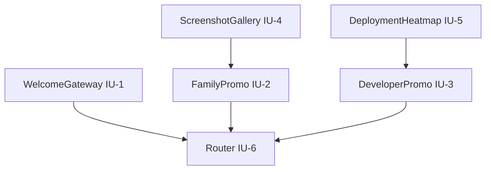

# Implementation Plan: Frontend Promotional Pages

**Status:** Active
**Created:** 2026-04-18
**Depth:** Standard
**Scope:** Vue frontend module (not GitHub Pages)

## Problem Frame

Numina needs two static promotional pages within the Vue frontend module:
- **Family audience**: Chinese-speaking, mobile-first, emotionally-driven, privacy-concerned users who want to track family assets
- **Developer audience**: Technical users evaluating self-hosting feasibility, deployment complexity, and architecture

Prior brainstorm produced scope-incorrect plan (GitHub Pages). This plan corrects scope: pages must be Vue components in `frontend/src/pages/` with routes in `frontend/src/router/`.

**Origin:** `docs/ideation/2026-04-18-frontend-promotional-pages-ideation.md` (user-corrected scope)

---

## Scope Boundary

**In scope:**
- Welcome gateway page (`/welcome`) with dual-path entry
- Family promotional page (`/promo/family`)
- Developer promotional page (`/promo/developer`)
- Reusable promotional Vue components
- Guest route pattern (outside MainLayout, no auth required)
- Static content (no API calls, no backend session)

**Out of scope:**
- GitHub Pages deployment (prior scope drift)
- Backend services or API endpoints
- Interactive demos requiring database
- User authentication on promotional pages
- Modifying existing `landing/` folder (separate artifact)

---

## Implementation Units

### IU-1: Welcome Gateway Page

**File:** `frontend/src/pages/WelcomeGatewayPage.vue`

**Description:** Entry route `/welcome` with two portal buttons. Mobile viewport defaults to family; desktop shows both equally.

**Behavior:**
- Route: `/welcome` with `meta: { guest: true }`
- Two CTAs: "守护家庭财富" → `/promo/family`, "技术部署指南" → `/promo/developer`
- Mobile (< 768px): Family CTA primary (larger, first), developer link in footer
- Desktop (≥ 768px): Both CTAs equal size, side-by-side layout
- Accessibility: Skip-link to main content, keyboard navigation

**Dependencies:** None (entry point)

**Test scenarios:**
1. Route `/welcome` accessible without auth
2. Family CTA navigates to `/promo/family`
3. Developer CTA navigates to `/promo/developer`
4. Mobile viewport shows family-primary layout
5. Desktop viewport shows equal dual layout
6. Logged-in user redirected to `/dashboard` (guest guard)

---

### IU-2: Family Promotional Page

**File:** `frontend/src/pages/FamilyPromoPage.vue`

**Description:** Chinese-first privacy showcase for family users. Outcome-focused (dashboard screenshots, value story).

**Content structure:**
1. Hero: "数据在你手中" privacy declaration with visual diagram
2. Trust section: "无账号注册追踪", "本地数据库", "开源审计"
3. Feature screenshots: Dashboard, asset cards, wish system (from `tests/*.png`)
4. Value story: Chinese narrative "想象张阿姨..." (optional placeholder)
5. CTA: "开始守护" → `/register`

**Vant components:**
- `van-notice-bar`: Privacy banner
- `van-swipe`: Feature screenshot carousel
- `van-collapse`: Expandable trust badges
- `van-button`: Primary CTA

**Dependencies:** IU-4 (ScreenshotGallery component)

**Test scenarios:**
1. Route `/promo/family` accessible without auth
2. Privacy hero section renders
3. Trust badges expandable via `van-collapse`
4. Screenshot carousel auto-plays (lazy loading)
5. CTA navigates to `/register`
6. Mobile-optimized layout (no horizontal scroll)
7. Chinese text throughout (no English leakage)

---

### IU-3: Developer Promotional Page

**File:** `frontend/src/pages/DeveloperPromoPage.vue`

**Description:** Deployment complexity heatmap for technical users. Process-focused (architecture, Docker steps).

**Content structure:**
1. Hero: Deployment difficulty matrix (Docker: 10min green, Manual: 30min yellow, Cloud: 2hr red)
2. One-command deploy: Terminal animation `docker-compose up -d`
3. Architecture diagram: Backend + Frontend + SQLite + Nginx
4. Trust badges: GitHub Actions, MIT License, Open Source badge
5. Quick start steps: `van-steps` wizard
6. CTA: "查看源码" → GitHub repo link

**Vant components:**
- `van-grid`: Deployment heatmap (2x2 responsive)
- `van-steps`: Quick start wizard
- `van-collapse`: Expandable architecture details
- `van-button`: External GitHub link

**Dependencies:** IU-5 (DeploymentHeatmap component)

**Test scenarios:**
1. Route `/promo/developer` accessible without auth
2. Deployment heatmap renders with color coding
3. Terminal animation plays (CSS keyframes)
4. Steps wizard shows deployment sequence
5. GitHub link opens external repo
6. Desktop-optimized layout (desktop-first for developers)

---

### IU-4: ScreenshotGallery Component

**File:** `frontend/src/components/promotional/ScreenshotGallery.vue`

**Description:** Reusable carousel for feature screenshots. Auto-syncs from `tests/*.png` via build script or manual array.

**Props:**
- `screenshots: string[]` — array of image paths
- `autoplay: boolean` — default `true`
- `interval: number` — default `3000` (ms)

**Vant usage:**
```vue
<van-swipe :autoplay="autoplay" :interval="interval">
  <van-swipe-item v-for="src in screenshots" :key="src">
    
  </van-swipe-item>
</van-swipe>
```

**Dependencies:** None (standalone component)

**Test scenarios:**
1. Carousel renders with provided screenshots
2. Auto-play respects interval prop
3. Lazy loading applies to images
4. Touch swipe works on mobile
5. Keyboard navigation (tab between slides)

---

### IU-5: DeploymentHeatmap Component

**File:** `frontend/src/components/promotional/DeploymentHeatmap.vue`

**Description:** Visual matrix showing deployment difficulty. Color-coded cells with time estimates.

**Props:**
- `options: DeploymentOption[]` — array of `{ method: string, time: string, difficulty: 'easy'|'medium'|'hard' }`

**Color mapping:**
- `easy` → green (`#4CAF50`)
- `medium` → yellow (`#FFC107`)
- `hard` → red (`#F44336`)

**Vant usage:**
```vue
<van-grid :column-num="2">
  <van-grid-item v-for="opt in options" :key="opt.method">
    <div :class="`difficulty-${opt.difficulty}`">
      <span>{{ opt.method }}</span>
      <span>{{ opt.time }}</span>
    </div>
  </van-grid-item>
</van-grid>
```

**Dependencies:** None (standalone component)

**Test scenarios:**
1. Grid renders with correct columns
2. Color coding matches difficulty prop
3. Time estimates display per cell
4. Responsive layout (2 cols mobile, 3 cols desktop)
5. Touch targets meet 44×44px minimum

---

### IU-6: Router Configuration

**File:** `frontend/src/router/index.ts`

**Description:** Add promotional routes with guest meta. Update guard logic.

**Changes:**
```typescript
// Add routes
{
  path: '/welcome',
  name: 'Welcome',
  component: () => import('@/pages/WelcomeGatewayPage.vue'),
  meta: { guest: true }
},
{
  path: '/promo/family',
  name: 'FamilyPromo',
  component: () => import('@/pages/FamilyPromoPage.vue'),
  meta: { guest: true }
},
{
  path: '/promo/developer',
  name: 'DeveloperPromo',
  component: () => import('@/pages/DeveloperPromoPage.vue'),
  meta: { guest: true }
}

// Guard: guest routes redirect logged-in users to dashboard
if (to.meta.guest && store.isLoggedIn) {
  return { name: 'Dashboard' }
}
```

**Dependencies:** IU-1, IU-2, IU-3 (pages must exist)

**Test scenarios:**
1. Routes registered with correct paths
2. Guest meta prevents auth guard blocking
3. Logged-in user redirected from `/welcome` to `/dashboard`
4. Lazy loading works (dynamic imports)
5. Back navigation from promo pages works

---

## Test File Paths

| Implementation Unit | Test File |
|---------------------|-----------|
| IU-1 WelcomeGateway | `frontend/tests/pages/WelcomeGatewayPage.spec.ts` (manual E2E) |
| IU-2 FamilyPromo | `frontend/tests/pages/FamilyPromoPage.spec.ts` (manual E2E) |
| IU-3 DeveloperPromo | `frontend/tests/pages/DeveloperPromoPage.spec.ts` (manual E2E) |
| IU-4 ScreenshotGallery | `frontend/tests/components/ScreenshotGallery.spec.ts` |
| IU-5 DeploymentHeatmap | `frontend/tests/components/DeploymentHeatmap.spec.ts` |
| IU-6 Router | `frontend/tests/router/promotional-routes.spec.ts` |

Note: Vue frontend lacks unit test infrastructure currently. Primary verification via E2E browser testing and build verification (`npm run build`).

---

## Dependencies and Sequencing



**Recommended sequence:**
1. IU-4, IU-5 (components) — standalone, no dependencies
2. IU-2, IU-3 (pages) — depend on components
3. IU-1 (gateway) — depends on page routes existing
4. IU-6 (router) — final integration, registers all routes

---

## Patterns and Conventions

**Follow existing patterns:**
- Guest route pattern from `LoginPage.vue`, `RegisterPage.vue`
- Component folder structure: `frontend/src/components/{domain}/`
- Vant 4 binding: `:model-value` for reactive props
- Auto-import: No manual Vant component imports needed

**File naming:**
- Pages: `*Page.vue` suffix
- Components: PascalCase, domain folder
- Routes: `name: 'PascalCase'`

**Accessibility:**
- Skip-link to main content (follow `landing/index.html` pattern)
- Alt text for screenshots
- Keyboard navigation for carousels
- Min 44×44px touch targets

---

## Risks and Edge Cases

| Risk | Mitigation |
|------|------------|
| Screenshots may not exist in `tests/*.png` | Use placeholder images or generate via `take-screenshots.js` |
| Vant 4 carousel auto-play may be distracting | Add `autoplay: false` option, respect reduced-motion |
| Deployment heatmap colors may not render correctly | Use CSS classes instead of inline styles |
| Logged-in users see promo pages | Guard redirects to dashboard |
| Mobile viewport shows both CTAs equally | Implement responsive family-primary layout |

**Edge cases:**
- User navigates to `/welcome` while logged in → redirect to `/dashboard`
- User clicks back from `/promo/family` → return to `/welcome`
- Screenshots fail to load → show placeholder/fallback
- Reduced-motion preference → disable animations

---

## Deployment Notes

No backend changes required. Frontend-only feature:
- Build: `npm run build` from `frontend/`
- Docker: Rebuild frontend container via `docker-compose up -d --build`
- Access: `/welcome`, `/promo/family`, `/promo/developer` routes

---

## Related Documents

- **Origin:** `docs/ideation/2026-04-18-frontend-promotional-pages-ideation.md`
- **Prior (scope-incorrect):** `docs/plans/2026-04-18-003-feat-github-pages-landing-page-plan.md` — DO NOT USE
- **Existing artifact:** `landing/` folder — separate GitHub Pages deployment, not part of this plan