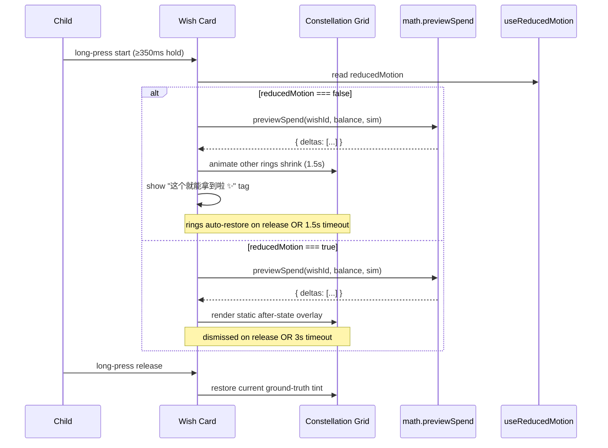

# feat: Child cross-wish reachability + opportunity-cost peek bundle

## Summary

Ship a v1 bundle of three cross-wish UX surfaces on the child frontend, all backed by the existing `priority_simulation[]` server payload (no backend changes for child-facing features) plus a parent-side cost-edit dialog with a trust-contract warning sheet. The bundle introduces a traffic-light wish constellation grid (overview), a non-committing long-press what-if peek that shows how spending one wish would shift others, a "≈ N 天" secondary read on each wish, and — closing the trust-contract loop — the parent main app gains a cost-edit affordance that surfaces the child's days-estimate delta before commit. Pure math (`reachabilityTint`, `previewSpend`, `daysEstimate`) lives in a new shared `frontend/packages/math` workspace package consumed by both apps.

---

## Problem Frame

(See origin: `docs/brainstorms/2026-05-24-child-cross-wish-bundle-requirements.md` Problem Frame)

Carried forward from the requirements doc: 5–8 year olds cannot mentally compare three independent progress bars and answer "which wish can I get today / which is closest"; spending one wish silently delays the others without UI showing the cause-effect link, breaking the visible-cause-effect mechanism Mischel/Kidd 2013 marshmallow research identifies as the operative variable in delayed-gratification training; and percentages-with-shortfalls are not a vocabulary kindergarteners reason in. Today the child's wishes page renders one progress bar per wish, no cross-wish view, no opportunity-cost surface, and the only days-estimate ("再做约 X 天家务") is shown once per wish via a client-side computation.

This plan implements the brainstorm's resolved v1 bundle. Two scope expansions discovered during repo research are now in scope and not silent assumptions:

1. **No `/wishes/:id` detail route exists today.** The brainstorm's R7 zoom-into-detail pattern needs a new page + route, not navigation to an existing one.
2. **No parent-side cost-edit UI exists today.** `updateChildWishCost()` API is defined in `frontend/apps/main/src/api/childWishes.ts` but no UI calls it. R14's "warning sheet on edit" needs both the entry point and the dialog itself.

---

## Scope

### In scope (v1)

- All 18 requirements (R1–R18) from the origin document
- All 4 flows (F1–F4) from the origin document
- All 8 acceptance examples (AE1–AE8) from the origin document
- New shared workspace package `frontend/packages/math` for `reachabilityTint`, `previewSpend`, `daysEstimate` consumed by both child and main apps
- New `ChildWishDetailPage.vue` + `/wishes/:id` route (closes R7 gap)
- New parent cost-edit dialog at `frontend/apps/main/src/components/wishes/WishCostEditDialog.vue` with trust-contract warning (closes R14 gap)
- i18n keys in both `zh-CN.ts` and `en-US.ts` for both child and main apps

### Deferred to Follow-Up Work

- Trade Telescope on the redeem confirm sheet, abandon-task hint, parent approval queue, and onboarding tutorial (origin §Scope Boundaries → Deferred for later)
- Configurable time units (`晴天` / `睡觉` / `周末`); v1 uses `天` only
- Family-configurable tint thresholds (e.g., yellow window 7–21 days); v1 hard-codes the 14-day boundary
- Server-side earn-velocity field on `ChildWishStats`; v1 reuses existing client-side derivation
- Per-wish CSS-fill jar animation (seed Idea #3 from `docs/ideation/2026-04-14-children-starcoin-ideation.md`); orthogonal workstream
- Parent-dashboard mirror of the constellation grid; v2
- Color-blind palette toggle; v1 ships color + icon + ARIA label as the floor
- Pre-existing `wish_id` type mismatch (server returns `int`, frontend types as `string` in `frontend/apps/child/src/api/childWishes.ts`); separate cleanup
- Child app `en-US.ts` general completeness audit (today's en-US is 37 lines vs zh-CN 257; only this plan's new keys added in scope, not a full audit)

### Explicit non-goals (v1)

- The grid does not replace or remove the existing status-grouped sections on the wishes page
- The redeem flow and all its existing copy/dialogs are not changed
- No new server endpoints, no new server fields, no new SQLAlchemy migrations
- No native haptic feedback on the long-press peek
- No "lock" or "favorite" UI on grid cards — wish priority continues to be parent-set via the existing `priority` field
- No new celebration component; existing assets in `frontend/apps/child/src/components/celebration/` are not modified

---

## Key Technical Decisions

- **Shared math package over duplication.** A new `frontend/packages/math` workspace package owns `reachabilityTint`, `previewSpend`, and `daysEstimate`. Both apps import the same module. Rationale: R14's warning sheet needs the *exact same* math the child sees; any drift between two implementations would silently break the trust contract (parent thinks "edit moves estimate from 6 to 12 days" while child sees "from 7 to 14 days" because the parent app has stale rounding logic). Pre-existing `frontend/packages/auth` proves the workspace pattern works in this repo. Three pure functions, ~80 LOC total — the carrying cost of a new package is minimal.

- **Reuse `@longpress` directive via `@vant/touch-emulator`.** Already in main app `package.json` and `@vant/touch-emulator` is in deps. Child app currently has no long-press handlers — first introduction. Rationale over a custom composable: the directive shape is already proven in the codebase (`AssetListPage.vue`, `LiabilityListPage.vue`); a custom composable would be net-new touch-handling code with the same surface but worse drift protection.

- **Wish-detail full-screen view inherits current per-wish card layout.** New `ChildWishDetailPage.vue` and `/wishes/:id` route, but the *content* is what's already rendered inline on `ChildWishesPage.vue` for an active wish (progress bar, name, priority badge, redeem button, days estimate). Rationale: the brainstorm explicitly scoped this — "future jar-fill animation work (Idea #3) lives inside the detail view, not the grid." V1 is the routing scaffolding; richer detail content is v2 work.

- **Tint thresholds as front-end constants.** `green` ↔ `yellow` ↔ `red` boundaries hard-coded in the math package: `green = covered`, `yellow = !covered && days ≤ 14`, `red = !covered && days > 14`, `gray = days unstable (<3 distinct earning days in last 7)`. No backend coupling, no family setting, no env var. Rationale: changing thresholds is a deliberate v2 decision, not a deployment knob; constants keep the math pure (same inputs → same output).

- **Reduced-motion fallback is a static instant-on overlay, not a disabled feature.** When `useReducedMotion()` is `true`, the long-press peek shows the after-state immediately as a static overlay (no 1.5s ghost animation), dismissed on long-press release or after a 3-second timeout. Rationale: disabling the feature entirely would deny accessibility users the trade-off learning. Static overlay preserves the educational moment without animation cost.

- **No backend changes for child features.** Repo-research-analyst verified `priority_simulation[]` shape and `expected_price` exclusion. The existing `wishDaysMap` computed in `ChildWishesPage.vue` lines 183–217 is the canonical days-estimate logic; the new package extracts it verbatim into a pure function. Rationale: smallest blast radius — server contract stable, no migration, no parent-app coordination beyond the new dialog.

- **Parent edit warning fires on delta ≥1 day OR tint band change.** Not on every edit. If parent changes cost from 100 to 101, days estimate moves from ~6 to ~6 (rounded), tint band unchanged → no warning, edit commits directly. If parent changes 100 to 150, days move 6 → 14, tint band may flip → warning required. Rationale: warning fatigue would teach parents to dismiss without reading; threshold ensures only meaningful goalpost-moves are flagged.

---

## High-Level Technical Design

This illustrates the intended approach and is directional guidance for review, not implementation specification.

```
┌────────────────────────────────────────────────────────────────┐
│  frontend/packages/math (NEW shared workspace package)         │
│                                                                 │
│  daysEstimate(balance, ledger, wishCost) → number | null       │
│  reachabilityTint(balance, simEntry, daysEst) → 'g'|'y'|'r'|'d'│
│  previewSpend(wishId, balance, simulation) → SpendDelta        │
└────────────────────────────────────────────────────────────────┘
        ▲                                          ▲
        │ workspace:*                              │ workspace:*
        │                                          │
┌───────┴──────────────┐                ┌──────────┴──────────────┐
│ frontend/apps/child  │                │ frontend/apps/main      │
│                      │                │                         │
│  Wishes page:        │                │  Wish review page:      │
│   • Constellation    │                │   • Cost-edit entry     │
│     grid (R1-R3,7,10)│                │     point (R14)         │
│   • What-if peek     │                │   • WishCostEditDialog  │
│     (R4-R6, R12)     │                │     with delta warning  │
│   • Time-priced cards│                │     sheet (R14, AE5-6)  │
│     (R13)            │                │                         │
│  Wish detail page:   │                │  Both consume math pkg  │
│   • New /wishes/:id  │                │  for identical estimate │
│     (R7)             │                │  computation            │
└──────────────────────┘                └─────────────────────────┘
```

Sequence for the long-press peek (R4–R6, R12, R15):



---

## Output Structure

New paths created by this plan:

```
frontend/
├── packages/
│   └── math/                                 # NEW workspace package
│       ├── package.json
│       ├── tsconfig.json
│       ├── src/
│       │   ├── index.ts                      # public API barrel
│       │   ├── daysEstimate.ts
│       │   ├── reachabilityTint.ts
│       │   ├── previewSpend.ts
│       │   └── types.ts
│       └── test/
│           ├── daysEstimate.test.ts
│           ├── reachabilityTint.test.ts
│           └── previewSpend.test.ts
└── apps/
    ├── child/
    │   └── src/
    │       ├── components/
    │       │   └── wishes/                   # NEW directory
    │       │       ├── WishConstellationGrid.vue
    │       │       └── WishConstellationCard.vue
    │       ├── pages/
    │       │   └── ChildWishDetailPage.vue   # NEW page
    │       └── router/
    │           └── index.ts                  # add /wishes/:id route
    └── main/
        └── src/
            └── components/
                └── wishes/                    # NEW directory
                    └── WishCostEditDialog.vue
```

---

## Implementation Units

### U1. Bootstrap shared math package and define pure functions test-first

**Goal:** Create `frontend/packages/math` workspace package with `daysEstimate`, `reachabilityTint`, `previewSpend` as test-first pure functions. No app code consumes it yet.

**Requirements:** R8, R9, R12, R13 (math primitives only)

**Dependencies:** None

**Files:**
- `frontend/packages/math/package.json`
- `frontend/packages/math/tsconfig.json`
- `frontend/packages/math/src/index.ts`
- `frontend/packages/math/src/types.ts`
- `frontend/packages/math/src/daysEstimate.ts`
- `frontend/packages/math/src/reachabilityTint.ts`
- `frontend/packages/math/src/previewSpend.ts`
- `frontend/packages/math/test/daysEstimate.test.ts`
- `frontend/packages/math/test/reachabilityTint.test.ts`
- `frontend/packages/math/test/previewSpend.test.ts`

**Approach:**
- `package.json` mirrors `frontend/packages/auth/package.json` shape: `name: "@numina/math"`, `main: "src/index.ts"`, `types: "src/index.ts"`, no build step (consumed via Vite's workspace resolution)
- `daysEstimate(balance, simEntry, ledgerEntries)` extracts the verbatim logic from `frontend/apps/child/src/pages/ChildWishesPage.vue` `wishDaysMap` (lines 183–217): 7-day window, ≥3 distinct earning days, daily-avg = sum/distinct, returns `null` when unstable
- `reachabilityTint` returns `'green' | 'yellow' | 'red' | 'gray'` per R9 boundaries (covered → green; days ≤ 14 → yellow; days > 14 → red; days null → gray)
- `previewSpend(wishId, balance, simulation)` returns `{ deltas: Array<{ wish_id, before_progress, after_progress, days_added }> }` per R12. Wishes already covered get `days_added: 0`. Pure function, no I/O.
- `index.ts` re-exports the three functions and shared types

**Execution note:** Test-first. These are pure functions with finite input domains; characterization-style tests for the existing `wishDaysMap` extracted into the new module before app code switches over.

**Patterns to follow:** `frontend/packages/auth/package.json` workspace package structure; existing TypeScript module conventions in the repo.

**Test scenarios:**
- **Covers AE1.** Given balance 25 and three sims with star_coin_cost 20/80/200 and ledger producing daily-avg 5, when `reachabilityTint` is called for each, then results are green / yellow / red.
- **Covers AE2.** Given balance 5 and two sims with star_coin_cost 30 and 95 and daily-avg 5, when `reachabilityTint` is computed, then results are yellow / red and `daysEstimate` returns 5 / 18.
- **Covers AE4.** Given a ledger with only 2 distinct earning days in the last 7, when `daysEstimate` is called, then result is `null` for every wish; when `reachabilityTint` is called, then result is `gray`.
- Boundary: balance exactly equals star_coin_cost (covered=true, tint=green, days_estimate=null).
- Boundary: days estimate exactly 14 → yellow; exactly 15 → red.
- `previewSpend` with the spend wish itself in `deltas`: it is excluded from the array (only *other* wishes are reported).
- `previewSpend` for a wish whose post-spend balance is still > another wish's cost: that other wish stays covered (no `days_added`).
- `previewSpend` when the spend would zero out the balance: every other not-covered wish gets a positive `days_added`.
- Empty `priority_simulation[]` → all functions return safe empty/null shapes without throwing.
- Ledger with only outgoing transactions (no positive `amount`) → `daysEstimate` returns `null`.

**Verification:**
- `npm run test:run` in `frontend/packages/math/` passes all scenarios above
- `npm run typecheck` (or workspace equivalent) succeeds
- Manual: import the package from a scratch script in `frontend/apps/child/` to confirm workspace resolution works

---

### U2. Migrate ChildWishesPage to consume `@numina/math` (no UX change)

**Goal:** Replace the inline `wishDaysMap` computed in `ChildWishesPage.vue` with `daysEstimate` from the new shared package. No visible behavior change; this is the seam that lets U3+ assume the math is shared.

**Requirements:** R8 (consumer-side wiring; tint not yet applied)

**Dependencies:** U1

**Files:**
- `frontend/apps/child/package.json` (add `@numina/math: workspace:*` dependency)
- `frontend/apps/child/src/pages/ChildWishesPage.vue` (replace inline computed with imported function)

**Approach:**
- Import `daysEstimate` from `@numina/math` at top of `ChildWishesPage.vue`
- Replace `wishDaysMap` computed body (lines 183–217) with a thin wrapper: `for sim in priority_simulation: map.set(sim.wish_id, daysEstimate(balance, sim, ledger))`
- All other rendering remains identical

**Patterns to follow:** Existing `useFamilyStore` and `useChildAuthStore` import patterns from `@numina/auth`; treat `@numina/math` the same way.

**Test scenarios:**
- **Covers AE2 indirectly.** Existing wish-cards continue to render the "再做约 N 天家务" hint with the same value as before the migration. Manual smoke test: load wishes page on a seeded ledger, confirm hint values are unchanged.
- Lint + typecheck pass.
- Test expectation: no new tests in this unit — coverage lives in U1's package tests; this unit is purely a wiring change.

**Verification:**
- `npm run typecheck` in `frontend/apps/child/`
- `npm run lint` in `frontend/apps/child/`
- Manual: open the wishes page in dev mode, confirm the days hint on every active wish is unchanged from `main`

---

### U3. Build `WishConstellationCard` (single-card component)

**Goal:** Implement one constellation card: photo/emoji, name, traffic-light ring, status icon, ARIA label, days-secondary read. Used as the leaf for U4's grid.

**Requirements:** R2, R8, R9, R11, R13, R16, R18

**Dependencies:** U1 (math), U2 (so the page already imports from `@numina/math`)

**Files:**
- `frontend/apps/child/src/components/wishes/WishConstellationCard.vue` (new)
- `frontend/apps/child/src/i18n/locales/zh-CN.ts` (add new wishes.tint.* keys, wishes.constellation.* keys, wishes.peek.* keys, wishes.timeUnitDays key)
- `frontend/apps/child/src/i18n/locales/en-US.ts` (mirror new keys per i18n discipline)
- `frontend/apps/child/src/components/wishes/WishConstellationCard.test.ts` (new)

**Approach:**
- Props: `wish: ChildWish`, `simEntry: PrioritySimulation`, `balance: number`, `daysEstimate: number | null`, `tint: 'green' | 'yellow' | 'red' | 'gray'`
- Template: photo/emoji at top, name (one-line truncate), `≈ N 天` secondary read or `继续做家务，几天后能更准估计` placeholder when tint is gray, status icon overlay (✅ / ⏳ / dim ring / dashed ring)
- Color via Clay tokens: `--color-success` / `--color-warning` / `--color-error` / `--color-muted-soft`. No raw hex.
- ARIA: `aria-label={t('wishes.tint.{tint}.aria') + wish.name}`; status icon has `aria-hidden`
- Emits `tap` (for navigate) and `peek-start` / `peek-end` (for U6's long-press wiring)
- New i18n keys (zh-CN + en-US in sync):
  - `wishes.tint.green.aria` → `可以兑换啦 / Ready to claim`
  - `wishes.tint.yellow.aria` → `快可以兑换了 / Almost ready`
  - `wishes.tint.red.aria` → `还要再等一阵子 / Still saving`
  - `wishes.tint.gray.aria` → `继续做家务，几天后能更准估计 / Keep saving — estimate stabilizes after a few days`
  - `wishes.constellation.headline` → `你今天可以拿到 {k} 个 / 共 {n} 个 心愿 / You can get {k} of {n} wishes today`
  - `wishes.constellation.headlineZero` → `继续加油，离最近的心愿还差 {d} 天 / Keep going — closest wish is {d} days away`
  - `wishes.timeUnitDays` → `≈ {days} 天 / ≈ {days} days`
  - `wishes.timeUnitPlaceholder` → `继续做家务，几天后能更准估计 / Keep going — estimate stabilizes`
  - `wishes.peek.confirmTag` → `这个就能拿到啦 ✨ / You can have this one ✨`
  - `wishes.peek.daysAdded` → `+{n} 天 / +{n} days`

**Patterns to follow:** Clay design tokens used throughout `clay.css`; existing card components like `frontend/apps/child/src/components/ChallengeCard.vue` for shape and emit conventions.

**Test scenarios:**
- **Covers AE1.** Given a covered wish (`covered: true`), when the card renders, then ring class is `tint-green`, status icon is `✅`, ARIA label includes `可以兑换啦`.
- **Covers AE1.** Given a yellow wish (days=10), when the card renders, then ring class is `tint-yellow`, icon is `⏳`, secondary read shows `≈ 10 天`.
- **Covers AE1.** Given a red wish (days=30), when the card renders, then ring class is `tint-red`, ring is dimmed (no positive icon), secondary read shows `≈ 30 天`.
- **Covers AE4.** Given gray tint (days=null), when the card renders, then ring is dashed-gray, secondary read is replaced with placeholder copy, icon is absent.
- Tap emits `tap` with the wish.id payload.
- Long-press emits `peek-start` on hold-start (≥350ms) and `peek-end` on release. (Long-press wiring may be a stub here; full peek behavior assembled in U6.)
- All four tints: ARIA label is non-empty and reads from i18n.

**Verification:**
- `npm run test:run` for the new test file passes
- Visual smoke in dev: 4 cards in different tints render correctly in light AND dark mode (R18 token compliance)

---

### U4. Build `WishConstellationGrid` and integrate into `ChildWishesPage.vue`

**Goal:** Compose `WishConstellationCard` into a 3-col grid (4-col on tablet/wide), compute headline ("你今天可以拿到 K 个 / 共 N 个" or zero-state copy), slot above the existing status-grouped sections.

**Requirements:** R1, R3, R10, R18

**Dependencies:** U3 (card component)

**Files:**
- `frontend/apps/child/src/components/wishes/WishConstellationGrid.vue` (new)
- `frontend/apps/child/src/components/wishes/WishConstellationGrid.test.ts` (new)
- `frontend/apps/child/src/pages/ChildWishesPage.vue` (insert grid above status sections; no removal)

**Approach:**
- Props: `wishes: ChildWish[]` (active only — caller filters), `stats: ChildWishStats`, `daysEstimateMap: Map<string, number | null>`, `tintMap: Map<string, Tint>`
- Template: headline strip on top (computed from `K = countWhere(tint === 'green')`, `N = wishes.length`), 3-col CSS grid below, one `WishConstellationCard` per wish
- When `K = 0`, headline switches to `wishes.constellation.headlineZero` with the min-days across all active wishes (via `Math.min(...daysArray.filter(d => d !== null))`)
- Forward `tap` and `peek-start`/`peek-end` events from cards to parent
- Responsive: media queries for ≥768px → 4-col, mobile (<768px) → 3-col, very narrow (<360px) → 2-col
- ChildWishesPage.vue change: import grid component; render `<WishConstellationGrid>` between hero banner (line 27) and the first status section (`<div v-if="!loading && activeWishes.length > 0" class="section">` at line 33). Pass `activeWishes`, `stats.value`, `wishDaysMap`, and a new `wishTintMap` computed that runs `reachabilityTint` per wish.
- Existing status-grouped sections render unchanged below.

**Patterns to follow:** Existing CSS-grid layouts in the child app (e.g., `ChildHomePage.vue` feature-card grid); media query breakpoints in `clay.css`.

**Test scenarios:**
- **Covers AE1.** Given 3 active wishes with tints green/yellow/red, when the grid renders, then headline reads `你今天可以拿到 1 个 / 共 3 个 心愿`.
- **Covers AE2.** Given 2 active wishes both not-covered with days 5 and 18, when the grid renders, then K=0 and headline reads `继续加油，离最近的心愿还差 5 天`.
- **Covers AE8.** Given the user navigates to wish detail and returns, when the wishes page re-mounts, then the grid renders fresh tints from the latest `priority_simulation[]` and the status-grouped sections below are unchanged in layout.
- Empty active wishes list → grid hidden entirely (zero-card render is suppressed; status sections still render)
- All wishes covered → headline is `K=N` with no zero-state copy
- All wishes gray → K=0; headline-zero falls back to a generic copy without a days number (handled by adding `wishes.constellation.headlineZeroNoEstimate` if min-days is null/Infinity)

**Verification:**
- `npm run test:run` passes
- `npm run typecheck`, `npm run lint`
- Manual: open wishes page with 0/1/many active wishes; verify status sections below remain visually identical; toggle dark mode (R18)

---

### U5. Add `/wishes/:id` route and `ChildWishDetailPage`

**Goal:** Create the per-wish detail full-screen view that grid cards navigate into. V1 inherits the current per-wish card layout — no new content, just routing scaffolding.

**Requirements:** R7

**Dependencies:** U2 (math wiring), U4 (grid emits navigation)

**Files:**
- `frontend/apps/child/src/pages/ChildWishDetailPage.vue` (new)
- `frontend/apps/child/src/router/index.ts` (add new route)
- `frontend/apps/child/src/pages/ChildWishDetailPage.test.ts` (new)

**Approach:**
- Route path: `/wishes/:id` — name `child-wish-detail`. Add to whichever child-app route guard list applies (mirrored from existing `/wishes` route).
- Page reads `route.params.id`, fetches `getChildWishStats()` (existing API; cached per `useFamilyStore` if available), finds the matching wish, and renders the same per-wish detail content currently rendered inline on `ChildWishesPage.vue`'s active section: emoji, name, priority badge, progress bar with 25/50/75% star markers, `≈ N 天` line via `@numina/math.daysEstimate`, `wishes.priorityLabel{High|Medium|Low}` badge, redeem button when status allows
- `<PageHeader>` (existing common component) for back navigation
- 404-equivalent: if wish not found, show a friendly empty state and a back button — no toast spam
- Grid in U4: emit `tap` with `wish.id`; `ChildWishesPage.vue` listens and pushes `router.push({ name: 'child-wish-detail', params: { id } })`

**Patterns to follow:** `frontend/apps/child/src/pages/ChildWishCreatePage.vue` for full-page layout + `<PageHeader>` usage; existing `useFamilyStore` patterns.

**Test scenarios:**
- **Covers AE8 (return-from-detail).** Given the user navigates to detail and presses back, when control returns to the wishes page, then it remounts cleanly and the grid + status sections render without staleness.
- Detail page renders for an `active` wish: shows emoji, name, progress bar, `≈ N 天` line, redeem button.
- Detail page for a `realized` wish: redeem button hidden, "已实现" badge shown.
- Detail page for an unknown id: friendly empty state renders; no toast.
- Days estimate matches the value rendered on the grid card (consistency check across surfaces).
- Test expectation for routing: covered by an integration test that mounts the page with a fake `route.params.id` and asserts the rendered name matches the fixture.

**Verification:**
- `npm run test:run`
- Manual: navigate from grid to detail; confirm back-navigation; confirm dark-mode parity

---

### U6. Wire long-press what-if peek (animated path)

**Goal:** Implement the 1.5s ghost-preview interaction on the constellation grid: on long-press of a card, animate the *other* wishes' progress rings to their post-spend state with `+N 天` floating labels; on release or after timeout, restore.

**Requirements:** R4, R5, R6, R12 (animated path; R15 reduced-motion handled in U7)

**Dependencies:** U1 (`previewSpend`), U3 (card with peek-start/end emits), U4 (grid forwards events)

**Files:**
- `frontend/apps/child/src/components/wishes/WishConstellationGrid.vue` (extend with peek state + animation)
- `frontend/apps/child/src/components/wishes/WishConstellationCard.vue` (add `@longpress` directive binding; render `+N 天` floating label when in peek-affected state)
- `frontend/apps/child/src/components/wishes/WishConstellationGrid.test.ts` (extend)

**Approach:**
- Use `@longpress` directive (Vant's, available via `@vant/touch-emulator` already in deps); if the directive isn't auto-imported, add an explicit import on the card. Threshold: 350ms (Vant default).
- On `peek-start(wishId)`:
  - Call `previewSpend(wishId, balance, priority_simulation)` from `@numina/math`
  - Set grid-level reactive state `peekActive = wishId`, `peekDeltas = result.deltas`
  - Cards read `peekDeltas` and animate their progress rings via CSS transition (target: post-spend progress %; duration: matches `motionTokens` default like 1500ms; easing: `ease-out` from existing tokens)
  - The pressed card shows `这个就能拿到啦 ✨` tag
  - Other cards display `+N 天` floating label positioned over the ring
- On `peek-end` OR after 1500ms timeout:
  - Reset `peekActive = null`, `peekDeltas = []`
  - Cards' rings transition back to ground-truth `progress` with the same easing
- Re-fetching `priority_simulation[]` during a peek is fine — the ground-truth tint is recomputed on restore (R6)
- Reduced-motion path: do not implement here; gated behind `useReducedMotion()` in U7

**Technical design (directional, not implementation spec):**

```
// pseudocode
function handlePeekStart(wishId) {
  if (reducedMotion.value) return triggerStaticOverlay(wishId)
  const { deltas } = previewSpend(wishId, balance, priority_simulation)
  peekActive.value = wishId
  peekDeltas.value = deltas
  peekTimer = setTimeout(handlePeekEnd, 1500)
}
function handlePeekEnd() {
  clearTimeout(peekTimer)
  peekActive.value = null
  peekDeltas.value = []
}
```

**Patterns to follow:** Existing celebration animations in `frontend/apps/child/src/components/celebration/` for CSS-only transition shapes; `motionTokens.ts` for duration/easing constants.

**Test scenarios:**
- **Covers AE3.** Given a child holds wish A on the grid, when 350ms elapses, then the grid receives `peek-start`, calls `previewSpend`, and applies `peek` class to non-A cards within one tick.
- **Covers AE3 (release path).** Given an active peek, when the user releases, then `peek-end` fires, the timer is cleared, and the cards' classes revert to ground-truth.
- **Covers AE3 (timeout path).** Given an active peek and the user does not release, when 1.5s elapses, then the same restore happens automatically.
- Pressing a wish that is already covered: `+N 天` labels still appear on uncovered wishes; the pressed wish shows the `这个就能拿到啦 ✨` tag.
- Pressing two cards in succession: the second peek replaces the first cleanly with no flicker, no double-overlay.
- During peek, the headline strip ("你今天可以拿到 K 个 / 共 N 个") does not change — peek is non-committing, ground-truth math is unchanged.

**Verification:**
- `npm run test:run`
- Manual: long-press a wish on a real device or DevTools touch emulator; verify ring shrink + `+N 天` labels; verify clean restore on release; verify second long-press replaces first without artifacts

---

### U7. Reduced-motion fallback for the peek

**Goal:** Add the static-instant-on overlay path to the long-press peek for users with `prefers-reduced-motion: reduce`. No animation; immediate before/after rendering; 3-second timeout instead of 1.5s.

**Requirements:** R15, R16

**Dependencies:** U6

**Files:**
- `frontend/apps/child/src/components/wishes/WishConstellationGrid.vue` (add reduced-motion branch in peek logic)
- `frontend/apps/child/src/components/wishes/WishConstellationGrid.test.ts` (extend)

**Approach:**
- Import `useReducedMotion()` from `frontend/apps/child/src/composables/useReducedMotion.ts`
- In peek handler: if `reducedMotion.value === true`, branch to `triggerStaticOverlay(wishId)` instead of animated CSS transitions:
  - `peekDeltas` is computed identically
  - Cards render the after-state immediately (no animation, no transition)
  - `+N 天` labels render statically
  - Timeout extended to 3000ms (R15 spec)
  - Restore on release OR timeout — also a static state change, no animation
- All ARIA labels (R16) continue to function in this path; the after-state ARIA label includes the delta ("快可以兑换了，再做 3 天 / Almost ready, 3 more days")

**Patterns to follow:** Existing reduced-motion handling in `frontend/apps/child/src/components/celebration/` components (e.g., MilestoneCelebration's reduced-motion path).

**Test scenarios:**
- **Covers AE7.** Given `useReducedMotion()` returns `true`, when the user long-presses a wish, then the grid does NOT apply a CSS transition (assert via DOM class absence) but DOES set the after-state immediately.
- **Covers AE7 (timeout).** Given a reduced-motion peek with no release, when 3 seconds elapse, then the overlay dismisses.
- ARIA: during a reduced-motion peek, screen reader text reflects the delta on each affected card.
- Tint rendering with reduced-motion off vs on: ground-truth tint matches in both modes (sanity).

**Verification:**
- `npm run test:run`
- Manual: in DevTools, toggle `prefers-reduced-motion: reduce`; verify peek is instant and ARIA reads the deltas

---

### U8. Parent main app — `WishCostEditDialog` with delta warning

**Goal:** Build the parent-side cost-edit affordance and the trust-contract warning sheet that surfaces the child's days-estimate delta before commit.

**Requirements:** R14

**Dependencies:** U1 (math), U7 (so child path is verified before main app changes — minimizes the chance of trust-contract divergence during cross-app integration)

**Files:**
- `frontend/apps/main/package.json` (add `@numina/math: workspace:*` dependency)
- `frontend/apps/main/src/components/wishes/WishCostEditDialog.vue` (new)
- `frontend/apps/main/src/pages/WishReviewPage.vue` OR `frontend/apps/main/src/pages/BabyPage.vue` (add an "edit cost" entry point on each child-wish row when the wish has progress > 0; the implementer decides which page based on which is already the primary parent surface for child-wish management — `WishReviewPage` if the user explicitly tracks unapproved/in-progress wishes there, else `BabyPage`)
- `frontend/apps/main/src/i18n/locales/zh-CN.ts` (add wishes-cost-edit keys)
- `frontend/apps/main/src/i18n/locales/en-US.ts` (mirror)
- `frontend/apps/main/src/components/wishes/WishCostEditDialog.test.ts` (new)

**Approach:**
- Dialog uses `<van-dialog>` with `:model-value` binding (per past learning: never `:value`)
- Two-stage flow:
  1. **Edit stage:** parent enters new `star_coin_cost` via `<van-field type="number">`. Cancel returns; "下一步 / Next" advances.
  2. **Confirmation stage (warning sheet):** if `wish.progress > 0%` AND `(|days_before − days_after| ≥ 1 OR tint_band_changes)`, surface the warning copy: `这个心愿的预估时间会从 ≈ X 天变成 ≈ Y 天，是否确认？`. Two buttons: "再想想 / Reconsider" (returns to edit), "确认 / Confirm" (commits). When `progress === 0%` OR delta < 1 day AND tint unchanged: skip warning, commit directly.
- Math:
  - Compute `days_before = daysEstimate(child_balance, currentSimEntry, child_ledger)`
  - Compute `days_after = daysEstimate(child_balance, { ...currentSimEntry, star_coin_cost: newCost }, child_ledger)`
  - Compute `tint_before = reachabilityTint(child_balance, currentSimEntry, days_before)`
  - Compute `tint_after = reachabilityTint(child_balance, { ...currentSimEntry, star_coin_cost: newCost }, days_after)`
  - Warning fires when `Math.abs(days_after - days_before) >= 1 || tint_before !== tint_after`
- Data fetch: parent app needs the child's current balance and ledger to do the math. Use existing parent endpoints if they expose this data — `getChildWishStats(childUserId)` and `getCoinLedger(childUserId)` if those exist on the main app's API surface; otherwise fetch fresh on dialog open. The implementer audits `frontend/apps/main/src/api/childWishes.ts` and adjacent files at this point and surfaces a follow-up if a thin server endpoint would be cheaper than a parent-side fetch — that decision is intentionally left to execution.
- API call on confirm: existing `updateChildWishCost(wishId, starCoinCost)` from `frontend/apps/main/src/api/childWishes.ts`
- New i18n keys (zh-CN + en-US):
  - `wishes.editCost.title` → `调整心愿星币 / Adjust wish stars`
  - `wishes.editCost.label` → `星币 / Stars`
  - `wishes.editCost.warningTitle` → `孩子的等待时间会变化 / Your child's wait time will change`
  - `wishes.editCost.warningBody` → `这个心愿的预估时间会从 ≈ {before} 天变成 ≈ {after} 天，是否确认？/ Estimated wait will shift from ≈ {before} days to ≈ {after} days. Confirm?`
  - `wishes.editCost.next` → `下一步 / Next`
  - `wishes.editCost.reconsider` → `再想想 / Reconsider`
  - `wishes.editCost.confirm` → `确认 / Confirm`
  - `wishes.editCost.cancel` → `取消 / Cancel`
  - Toasts: `wishes.editCost.success` → `✅ 已调整 / ✅ Updated`; `wishes.editCost.error` → `❌ 调整失败，请稍后再试 / ❌ Update failed, try again`

**Patterns to follow:** Existing parent dialogs that use `<van-dialog>`; emoji-prefixed toast convention from `frontend/apps/main/CLAUDE.md`; `:model-value` (not `:value`) per `docs/solutions/ui-bugs/vant4-field-modelvalue-binding-2026-04-08.md`.

**Test scenarios:**
- **Covers AE5.** Given a wish with progress=60% and current cost 100 producing days_before=6, when parent enters new cost 150 producing days_after=14, then warning sheet renders with `≈ 6 天 → ≈ 14 天` and a confirm step is required.
- **Covers AE6.** Given a wish with progress=60% and current cost 100, when parent enters new cost 101 (delta < 1 day, tint unchanged), then no warning sheet appears and the API commits directly.
- Given a wish with progress=0%, when parent edits cost from 100 to 200, then no warning sheet (R14 only fires for `progress > 0%`).
- Given a wish where the edit flips tint band (e.g., yellow → red), when parent confirms past the warning, then API call fires once and toast emits success.
- Given an API failure on commit, when the dialog renders, then error toast emits and the dialog stays open.
- Given a parent cancels at the warning stage, when "再想想" is tapped, then the dialog returns to the edit stage with the entered value preserved.

**Verification:**
- `npm run test:run` (main app)
- `npm run typecheck`, `npm run lint` (main app)
- Manual: open the parent app on a family with a child wish at progress > 0%; edit cost; verify warning shows correct days; verify "再想想" returns to edit; verify confirm calls API and toast emits; verify the *child's* wishes page on a separate browser/device shows the updated cost reflected in the days-estimate

---

### U9. End-to-end smoke + ship-cut closure

**Goal:** Validate the full bundle on real seeded data, run lint/typecheck/tests across both apps and the new package, and write the ideation-doc cross-link back. Marks the v1 ship cut.

**Requirements:** All R1–R18 (smoke verification)

**Dependencies:** U1, U2, U3, U4, U5, U6, U7, U8

**Files:**
- `docs/ideation/2026-04-14-children-starcoin-ideation.md` (append a session-log entry noting the v1 plan landed at `docs/plans/2026-05-24-002-feat-child-cross-wish-bundle-plan.md`)
- `docs/brainstorms/2026-05-24-child-cross-wish-bundle-requirements.md` (append a "Status" footer pointing to the plan)
- (optional) `docs/solutions/best-practices/cross-wish-affordability-pattern-2026-05-XX.md` if a non-obvious pattern emerged worth documenting (skip if not)

**Approach:**
- Run `npm run test:run` in `frontend/packages/math/`, `frontend/apps/child/`, `frontend/apps/main/`
- Run `npm run typecheck` and `npm run lint` in both apps
- Manual smoke walkthrough of all 8 acceptance examples (AE1–AE8) on a seeded family (parent + ≥2 children, ≥3 wishes per child with mixed progress states, recent ledger with ≥3 distinct earning days)
- Toggle dark mode mid-flow; verify all new UI adapts
- Toggle reduced-motion mid-flow; verify peek path switches to static overlay
- Toggle locale to en-US; verify every new key renders English (catches missed mirror entries)
- Cross-app trust-contract verification: edit cost in parent app while child app is open in another browser, confirm child's days-estimate updates on next refresh

**Test scenarios:**
- **Covers AE1–AE8 end-to-end.** Each acceptance example from the origin doc has been manually exercised on real data with both light and dark modes and both locales.
- No console errors or warnings on the wishes page, the detail page, or the parent edit dialog during normal flow.
- Reduced-motion path matches AE7.

**Verification:**
- All test commands pass
- All 8 AEs manually verified
- `git diff` shows no unrelated file changes
- v1 ship cut: this unit's completion is the trigger to consider PR-cutting.

---

## System-Wide Impact

- **`frontend/packages/math` is a new shared workspace package.** First child consumer is `frontend/apps/child/`; first parent consumer is `frontend/apps/main/`. Future apps consuming child or parent surfaces (none today) inherit the dependency.
- **`/wishes/:id` is a new route** in the child app. Existing `/wishes` and `/wishes/new` are unchanged.
- **`updateChildWishCost()` API in main app** now has a UI consumer (previously orphaned). No new endpoint, no new payload field.
- **Bundle size impact:** ~3 new components (~250 lines Vue total), 1 new page (~80 lines Vue), 1 new package (~80 lines TS), 12 new i18n keys × 2 locales × 2 apps. Acceptable for a feature of this scope.
- **No state management change.** Pinia stores untouched; no new store, no new global state.
- **No backend change.** Server contract preserved; the verified `priority_simulation[]` shape continues to satisfy every consumer.

---

## Risks & Mitigations

- **R: Workspace package resolution issue in Vite or vue-tsc.** Adding the first non-auth shared package may surface a resolution glitch (e.g., `paths` mapping in `tsconfig`, `vite.config.ts` aliases). M: U1 explicitly verifies workspace import via a scratch script in the child app before downstream units depend on it. Pattern is proven via `frontend/packages/auth`.
- **R: `@vant/touch-emulator` long-press timing differs across mobile browsers (iOS Safari vs Chrome Android).** M: U6 explicitly uses Vant's default 350ms threshold and validates on real iOS Safari + Android Chrome during U9 manual smoke. If the directive's default proves unreliable, fall back to a custom touch-handler composable; this is a deferred-to-execution decision flagged in the brainstorm's Outstanding Questions.
- **R: Parent edits cost in the main app while the child has a stale `priority_simulation[]` cached.** M: child app already polls balance via `useBalancePolling`. Wishes page refetches `getChildWishStats()` on mount. If staleness is observable in U9 smoke, add a brief refresh-on-focus to the wishes page; track as a follow-up rather than gating v1.
- **R: SVG ring animation jank on low-end Android.** M: animations use CSS transitions on transforms and opacity (compositor-friendly), not on layout properties. If U9 smoke reveals jank on a target device, switch to `transform: scaleX(...)` for the progress arc rather than `stroke-dasharray` interpolation. Decision deferred to execution.
- **R: `useReducedMotion` reactive ref does not update mid-session on iOS Safari PWA.** M: brainstorm flagged this in Outstanding Questions. U7 manual smoke tests the OS-toggle-during-session case. If the ref doesn't update, add a one-time check at peek-start instead of relying on Vue reactivity; documented as a `docs/solutions/` follow-up.
- **R: en-US.ts general incompleteness causes new locale keys to render English in zh-CN sessions.** M: U3 and U8 both add keys to *both* locale files; CI lint or a manual diff between the two files confirms parity for the new keys (full audit is out of scope per origin §Deferred for later).

---

## Outstanding Questions

### Resolved during planning

- **Where should `reachabilityTint`/`previewSpend` live?** → New `frontend/packages/math` workspace package consumed by both apps (Phase 5.1.5 call-out, confirmed by user).
- **Does `/wishes/:id` exist?** → No. New route + page added in U5.
- **Does the parent main app have an existing wish-edit dialog?** → No. U8 builds it.

### Deferred to implementation

- [Affects U6][Technical] Should the long-press use Vant's `@longpress` directive or a custom composable for finer release-timing control? Default: directive. Switch only if cross-platform timing proves unreliable in U9.
- [Affects U8][Technical] Does the parent main app already have a child-balance + child-ledger fetch, or does the new dialog need to call `getChildWishStats(childUserId)` + `getCoinLedger(childUserId)` on open? U8 implementer audits `frontend/apps/main/src/api/childWishes.ts` and adjacent files at the dialog-open seam. If the math is non-trivial parent-side, consider a thin server endpoint that returns `{ days_before, days_after, tint_before, tint_after }` for a `(child_id, wish_id, new_cost)` triple; that's a follow-up if discovered, not a v1 blocker.
- [Affects U7][Needs research] iOS Safari PWA reactivity of `useReducedMotion` mid-session — if the ref doesn't update reactively when the OS setting flips during an open session, U7 falls back to reading the value at peek-start instead. Decision in U7 manual smoke.
- [Affects U6, U7][Technical] Performance budget for SVG ring animations on a 4-wish + 6-wish layout on a low-end Android target. U9 smoke tests this; decisions on whether to switch from `stroke-dasharray` to `transform: scaleX(...)` happen there.

---

## Plan Confidence Notes

Origin requirements doc carried forward in full: 18 R-IDs, 4 F-IDs, 8 AE-IDs, 3 actor IDs, scope boundaries (in-scope + deferred + non-goals). The two scope expansions (R7 detail route, R14 cost-edit UI) were surfaced explicitly to the user before plan-write and confirmed.

Backend audit is verified — no server changes for child features and the `expected_price` exclusion is enforced server-side. Math primitives ship test-first; all consumer units depend on U1 to keep the trust-contract math single-sourced. Reduced-motion path is its own unit (U7) so the animated path can ship first if the bundle needs to slice further at PR-cutting time.

This plan is ready for `ce-work` execution.
