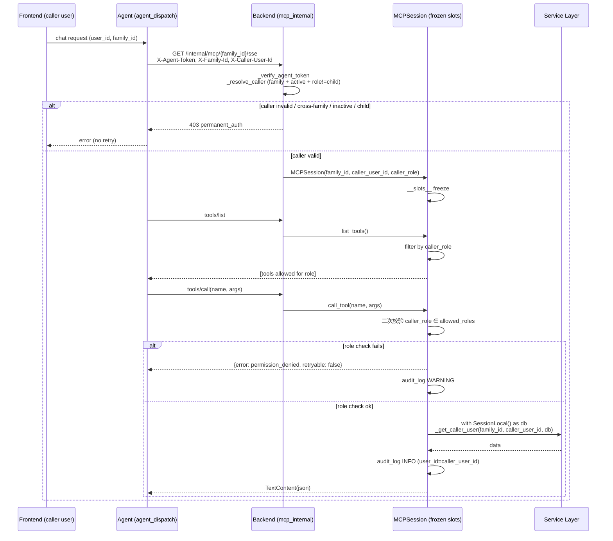

# feat: MCP Caller-Bound Principal + Per-Member Tool Set

> 来源：`docs/brainstorms/2026-05-31-mcp-caller-bound-principal-requirements.md`。本计划在 brainstorm 已固化的产品决策（A1–A5）之上，给出 HOW：实现单元、文件清单、测试矩阵、回归 guard，特别关注 agent ↔ backend 调用通道单向性。

---

## Summary

把 backend MCP 工具调用的 principal 从「静默选 owner」改为「以真实 caller 身份执行」，关闭 confused-deputy 漏洞；同时在协议层 (`tools/list`) 按 `caller_role` 静态裁剪，给未来写工具上线提供 SSOT 接收骨架。改造覆盖：caller_user_id 从 agent SSE handshake 端到端贯通到 backend `MCPSession`；`_get_owner_user` 全量删除替换为 `_get_caller_user`；新建 `mcp_tool_registry` 集中元数据；`call_tool` 入口二次校验 + permission_denied 结构化错误；audit log 字段补齐 caller 身份。

横切关注：用户特别要求关注「agent ↔ backend 是否有死循环调用」。研究证实当前调用方向严格单向 (agent → backend 走 `/internal/`，backend → agent 走 `/chat`、`/agent/stream`；`mcp_session.py` 在 SSE/tools 全链路无 HTTP 出站)。本 plan 把维持单向作为非回归 guard 落到 lint + 测试。

---

## Problem Frame

`server/apps/backend/app/services/mcp_session.py:16-31` 的 `_get_owner_user(family_id, db)` 在 MCP 工具调用时静默选 family 的 owner 作为 service 层 principal。child / parent / member 任意成员发起的 chat 经 agent 调度到 MCP 工具调用时，service 端拿到的永远是 owner — 这是 confused-deputy 漏洞，OWASP Agentic Top 10 (2025-12) 列入。当前 5 个只读工具让爆面有限，但 ideation 路线图把 backend CRUD 全面 MCP 化，写工具一旦上线就会从「信息泄漏」升级为「未授权写入」。

详见 origin §1.1–1.4 (see origin: docs/brainstorms/2026-05-31-mcp-caller-bound-principal-requirements.md)。

---

## Goals

- **G1**: backend MCP 工具调用以真实 caller 的身份执行 service 层授权，不再静默替换为 owner。
- **G2**: caller 视角的工具集合在协议层 (`tools/list`) 就被正确裁剪，而不是依赖 service 层在每次调用时检查角色。
- **G3**: child role 在首期通过 fail-fast (raise) 拦截，不进入 MCP；A3 假设落地为可观察的具体行为。
- **G4**: 维持 agent ↔ backend 调用方向单向；改造不引入任何 backend → agent 的调用路径。

## Non-Goals

- 不引入写工具（A4）。`requires_write` 字段保留为元数据占位，首期所有注册工具 `requires_write=False`。
- 不并入 ideation #1 的 HMAC pouch (A5) — 依赖现有 `X-Agent-Token` + 私网部署的信任基础。
- 不改 `family_adapter_cache` cache key 维度 — 研究证实 `DeerFlowClient` 不携带 caller 身份，caller 只在 backend 侧 `MCPSession` 构造时绑定 (Q1 已自答)。
- 不引入 owner-override-per-member tool grants UI (A2)。
- 不抽 `mcp_tool_registry` 到 `packages/domain/` (Q2 默认) — 仅 backend 内部使用，无 cross-app 复用需求。

---

## Key Technical Decisions

### D1. Caller binding 发生在 SSE handshake，frozen in `__slots__`

**决策**：agent 在 SSE handshake 阶段通过 `X-Caller-User-Id` header 把 caller 传给 backend；`MCPSession.__init__` 在构造时同时冻结 `_family_id` / `_caller_user_id` / `_caller_role`。一个 SSE 连接 = 一个 caller。

**理由**：与 `__slots__` 冻结 family_id 同构 (mcp-chat-adapter-architecture-2026-05-21 hard invariant)；agent 侧 `agent_dispatch.py:200` 已持有 `user_id` 零结构性改动；caller 不进 MCP 协议层，LLM tool args 中不存在 `caller_user_id` 字段（协议层不可表达 = 不可篡改）。

**拒绝的方案**：per-call 在 messages 通道带 caller — 暴露在 LLM 可见线协议上，需要额外 HMAC 防伪造，不值得。

### D2. `_get_caller_user` fail-fast，无静默 fallback

**决策**：caller 身份失败（不属于该 family / inactive / 已删除 / role==child）→ 整个 SSE 握手返回 403，绝不静默 fallback 到 owner。

**理由**：redis-fail-fast-strategy + deerflow-harness-silent-fallback 教训均指向「静默降级 = 安全语义被悄悄破坏」。本场景 caller 解析失败若回退到 owner，等价于 confused-deputy 漏洞重生。

### D3. Tool registry = 模块级 frozen dataclass，不走 frontmatter

**决策**：新建 `server/apps/backend/app/services/mcp_tool_registry.py`：
- `@dataclass(frozen=True) class MCPToolMeta` 含 `name`、`description`、`input_schema`、`allowed_roles: frozenset[str]`、`requires_write: bool`。
- 模块级 `_REGISTRY: dict[str, MCPToolMeta]` 内联 5 个工具。
- 暴露 `get_tool(name)` / `list_tools_for_role(role)` / `validate_registry()`。

**理由**：5 个工具的体量不值得引入 YAML 文件加载开销；`frozen=True` 防运行时篡改；`frozenset` O(1) 查找；与 backend `services/` 层架构对齐（无 ORM 依赖、无 SessionLocal、纯内存）。Agent 侧 `capability_registry.py` 走 frontmatter 是因为 skill 数量大且支持 per-family override，与本场景需求不同步。

**拒绝的方案**：frontmatter-driven registry — over-engineer，5 个工具在单文件内联更易审。

### D4. permission_denied = permanent_auth，不可重试

**决策**：`call_tool` 入口二次校验失败时返回 `{"error": "permission_denied", "retryable": false, "reason_zh": "..."}` 结构化错误；audit log 同步写 WARNING 级别，含 `attempted_tool` + `caller_role`。

**理由**：three-state-circuit-breaker-with-cascade-retry-2026-05-20 — 403 类错误属 permanent_auth，LLM 不应 cascade 重试。`retryable:false` 让 LLM 知道「我不该再试」，避免 stream 内循环重试。

### D5. 死循环防护 = 静态 + 动态双层 guard

**决策**：
- **静态**：ruff custom rule（或简单 grep test）禁止 `apps/backend/app/services/mcp_session.py` 与 `apps/backend/app/services/mcp_tool_registry.py` import `httpx` / `aiohttp` / `apps.agent.*` / `core.backend_client`。
- **动态**：集成测试断言 `MCPSession.call_tool()` 全路径无任何 outbound HTTP（patch `httpx.AsyncClient.send` raise）。

**理由**：研究证实当前 backend `mcp_session` 路径无 HTTP 出站、无 fire-and-forget 任务回到 agent，方向严格单向。但用户特别强调要 guard，且未来写工具触发 audit / notification 时可能不慎引入 outbound。静态层零运行时开销，动态层覆盖测试矩阵每条路径，无需 startup AST 遍历这种重武器。

### D6. `family_adapter_cache` cache key 不变 (Q1 答案)

**决策**：保持 5-tuple `(family_id, config_id, subagent_enabled, plan_mode, mcp_hash)`。caller_user_id **不**加入 key。

**理由**：`get_enabled_mcp_servers()` 返回 family 级配置，不随 caller 变化；`DeerFlowClient` 实例本身不携带 caller；caller 身份只在 backend 侧 `MCPSession` 构造时绑定。改动 cache key 等于把 100-cap 折算为 25 family，无对应收益。固化为决策记录而非保留为 plan-time 开放问题。

### D7. caller_role 缓存生命期 = SSE 连接寿命 (Q3 答案)

**决策**：`caller_role` 在 `MCPSession.__init__` 一次查询 `User.role` 后冻结到 `_caller_role` slot；SSE 连接寿命内不重查 DB。前端在 owner transfer 后强制 refresh chat 入口。

**理由**：transfer 是低频操作，影响窗口分钟级；显式 caller 校验比 per-call DB 查询更经济；接受窗口的 trade-off 在 origin §6 Q3 + Risks 已论证。

### D8. POST /messages 通道依赖 SseServerTransport session_id 隔离

**决策**：POST `/internal/mcp/messages` 不额外校验 `X-Caller-User-Id`。caller binding 的安全性依赖 `SseServerTransport` 在 SSE handshake 时生成的 session_id 为 cryptographically random UUID（MCP SDK 默认行为），使得第三方无法猜测或伪造 session_id 来注入 tool call 到别人的 session。

**理由**：(1) MCP SDK 的 `SseServerTransport` 使用 `uuid4()` 生成 session_id，不可猜测；(2) POST /messages 已验证 `X-Agent-Token`，只有持有共享密钥的 agent 进程能调用；(3) agent 进程内每个 SSE 连接独立持有自己的 session_id，不会跨 family 复用。三层叠加后，POST 通道的 caller 隔离由 session routing 保证，无需重复校验。

**实施时验证**：U4 实施时 grep MCP SDK 源码确认 `SseServerTransport` 使用 `uuid.uuid4()` 生成 session_id；如果不是，需要在 POST handler 加 family_id-scoped 校验。将此验证结果记录到 solution doc (U9)。

---

## High-Level Technical Design

> *This illustrates the intended approach and is directional guidance for review, not implementation specification.*

### 调用链路（改造后）



### Tool Registry 形状

```python
# 不是实现代码 — 仅展示结构
@dataclass(frozen=True)
class MCPToolMeta:
    name: str
    description: str
    input_schema: dict
    allowed_roles: frozenset[str]   # {"owner","member"} for read tools
    requires_write: bool             # False for all phase-1 tools

_REGISTRY: dict[str, MCPToolMeta] = {
    "get_family_overview": MCPToolMeta(..., allowed_roles=frozenset({"owner","member"}), requires_write=False),
    "get_assets": MCPToolMeta(...),
    "get_liabilities": MCPToolMeta(...),
    "get_members": MCPToolMeta(...),
    "get_recent_alerts": MCPToolMeta(...),
}

def list_tools_for_role(role: str) -> list[MCPToolMeta]: ...
def get_tool(name: str) -> MCPToolMeta | None: ...
def validate_registry() -> None: ...   # called at startup, raise if any tool missing allowed_roles
```

---

## Output Structure

```text
server/apps/backend/app/services/
├── mcp_session.py                # 改：__slots__ 扩展 + _get_caller_user + 二次校验
└── mcp_tool_registry.py          # 新：MCPToolMeta + _REGISTRY + validators

server/apps/backend/app/routers/
└── mcp_internal.py               # 改：SSE handshake 提取 X-Caller-User-Id

server/apps/backend/app/main.py   # 改：lifespan 中调用 validate_registry()

server/apps/agent/services/
└── chat_adapter.py               # 改：MCP server URL 构造已含 family_id；新增传递 caller_user_id 到 SSE header

server/apps/agent/services/deerflow_adapter/
└── adapter.py                    # 改：mcp_servers 入参支持 per-server headers (caller-bound)

server/apps/agent/services/audit_logger.py  # 改：MCP 路径填充 user_id 字段（已有字段）

server/tests/backend/unit/
├── test_mcp_session_caller_binding.py    # 新：__slots__ + cross-family + inactive + args-emit
├── test_mcp_tool_registry.py             # 新：registry 完整性 + role filter + startup validate
└── test_mcp_session.py                   # 改：迁移现有 mock 到 caller_user_id 模型

server/tests/backend/
├── test_mcp_tenant_isolation.py          # 改：清掉 _get_owner_user mock；新增 caller_role × tool 矩阵
└── test_mcp_no_outbound_http.py          # 新：死循环 guard 集成测试

server/tests/agent/unit/
└── test_chat_adapter.py                   # 改：断言 SSE URL 携带 X-Caller-User-Id header
```

---

## System-Wide Impact

| 系统 | 影响 | 关键约束 |
|---|---|---|
| backend `mcp_session.py` | `__slots__` 扩展 + `_get_owner_user` 删除 + 二次校验 | invariant: SSE 寿命 > 请求作用域，per-call `with SessionLocal() as db` |
| backend `mcp_internal.py` | SSE handshake 多读一个 header；构造 `MCPSession` 多传两参 | `_transport` 模块单例不动，POST /messages 路径不动 |
| backend startup `main.py` | lifespan 中加 `validate_registry()` fail-fast | 与现有 SQLite 版本检查、`run_schema_migration` 同位置 |
| agent `agent_dispatch.py` | 已持有 `user_id` 透传到 `mcp_servers` 配置 | 不改调度入口签名 |
| agent `chat_adapter.py` | MCP server config 中加 `headers: {"X-Caller-User-Id": user_id}` | DeerFlow harness 透传 headers 到 SSE 客户端（验证支持） |
| agent `family_adapter_cache.py` | 不改 cache key（D6） | 保持 5-tuple |
| `audit_logger` | MCP 路径填 caller 真实 `user_id`（不是 owner，不是 family stand-in） | 用 `flush()` 不用 `commit()`（audit-service-session-closure 教训） |
| 前端 | 不影响 — caller_user_id 由 backend 从 JWT 抽，agent 自动透传 | owner-transfer 后强制 refresh chat 入口（A1 注意事项） |

---

## Implementation Units

> Execution note (横切): 涉及 caller binding 的 backend unit 全部 test-first — 先写 cross-family / inactive / args-emit 三个注入失败用例，再写实现。这是 confused-deputy 改造的标准节奏。

### U1. 新建 `mcp_tool_registry.py` 元数据 SSOT

**Goal**：把 5 个只读工具的元数据从 `mcp_session.py` 抽到独立 registry，建立 future write tool 的接收骨架。

**Requirements**：origin S4 (前半段：tool metadata 表)；G2。

**Dependencies**：none — 这是后续 unit 的依赖底座。

**Files**：
- 新增 `server/apps/backend/app/services/mcp_tool_registry.py`
- 新增 `server/tests/backend/unit/test_mcp_tool_registry.py`

**Approach**：
- 模块顶部定义 `@dataclass(frozen=True) class MCPToolMeta`（D3）。
- 模块级 `_REGISTRY: dict[str, MCPToolMeta]` 字面量内联 5 个 entry，逐个抄录 `mcp_session.py:69-113` 现有 `name` / `description` / `inputSchema`，新增 `allowed_roles=frozenset({"owner","member"})` 与 `requires_write=False`。
- 暴露 `get_tool(name) -> MCPToolMeta | None`、`list_tools_for_role(role) -> list[MCPToolMeta]`、`validate_registry() -> None`。
- `validate_registry()`：遍历 `_REGISTRY`，断言每个 entry 的 `allowed_roles` 非空、所有 role 字符串属于 `{"owner","member","child"}`；任一失败 raise `RuntimeError`。

**Patterns to follow**：
- frozen dataclass 风格参考 `server/packages/core/` 现有 immutable VO。
- 启动期 fail-fast 风格参考 `server/apps/backend/app/main.py:170-178` 的 SQLite 版本检查。

**Test scenarios**：
- `test_registry_contains_all_five_legacy_tools` — 断言 `_REGISTRY` 包含 5 个工具名；每个工具的 `name` / `description` / `input_schema` 与原 `mcp_session.list_tools()` 字面量等价。
- `test_registry_meta_immutable` — 试图修改 `MCPToolMeta` 字段 raise `FrozenInstanceError`。
- `test_list_tools_for_role_owner` — `list_tools_for_role("owner")` 返回全部 5 个。
- `test_list_tools_for_role_member` — `list_tools_for_role("member")` 返回全部 5 个（首期 owner/member 等同）。
- `test_list_tools_for_role_child` — `list_tools_for_role("child")` 返回空 list（与 §U3 二次校验配合，但 registry 层应先体现 child 不在 allowed_roles）。
- `test_list_tools_for_role_unknown` — 未知 role 返回空 list 而非 raise（接口契约）。
- `test_validate_registry_passes_for_current` — `validate_registry()` 在标准 `_REGISTRY` 上不 raise。
- `test_validate_registry_raises_when_allowed_roles_empty` — 临时 patch 一个 entry 的 `allowed_roles=frozenset()`，断言 raise `RuntimeError`。
- `test_validate_registry_raises_on_unknown_role` — patch 一个 entry 含 `"admin"` 这种未定义 role，断言 raise。

**Verification**：`uv run pytest server/tests/backend/unit/test_mcp_tool_registry.py -v` 全绿；`uv run mypy server/apps/backend/app/services/mcp_tool_registry.py` 通过；`uv run ruff check server/apps/backend/app/services/mcp_tool_registry.py` 通过。

---

### U2. backend startup 期 `validate_registry()` fail-fast

**Goal**：让 registry 漂移在启动时立刻暴露，而非等到第一次 tool 调用。

**Requirements**：origin §4.1 启动期 fail-fast；G2。

**Dependencies**：U1。

**Files**：
- 改 `server/apps/backend/app/main.py`（lifespan 函数）。
- 改 `server/tests/backend/test_main_startup.py`（如已存在）或新增 `server/tests/backend/unit/test_startup_mcp_validation.py`。

**Approach**：
- 在 `lifespan` 中，`run_schema_migration` 之后、`yield` 之前，调用 `mcp_tool_registry.validate_registry()`。
- 失败时 raise `RuntimeError` — 与现有 SQLite 版本检查 fail-fast 风格一致；启动失败比运行时神秘 503 更可调试。

**Patterns to follow**：`server/apps/backend/app/main.py:170-198` 的 lifespan fail-fast 风格。

**Test scenarios**：
- `test_lifespan_calls_validate_registry` — 用 `TestClient` + `patch("apps.backend.app.services.mcp_tool_registry.validate_registry")` 验证启动时被调用。
- `test_lifespan_aborts_on_invalid_registry` — patch `validate_registry` raise `RuntimeError("xxx")`，断言 app 启动失败。

**Verification**：`uv run pytest server/tests/backend/ -k startup -v`；手动 `uv run uvicorn apps.backend.app.main:app` 启动应立刻完成 registry 校验日志。

---

### U3. backend `MCPSession.__slots__` 扩展 + `_get_caller_user` 替代

**Goal**：构造期同时冻结 `family_id` / `caller_user_id` / `caller_role`；删除 `_get_owner_user`，service 层 principal = 真实 caller。

**Requirements**：origin S2、S3；G1、G3。

**Dependencies**：U1（`list_tools_for_role` 在 U5 消费，但 U3 的 `__init__` 可用 registry 的 known roles 做 caller_role 合法性校验）。

**Files**：
- 改 `server/apps/backend/app/services/mcp_session.py`
- 新增 `server/tests/backend/unit/test_mcp_session_caller_binding.py`
- 改 `server/tests/backend/unit/test_mcp_session.py`（迁移现有 mock）
- 改 `server/tests/backend/test_mcp_tenant_isolation.py`（清掉 `_get_owner_user` mock）

**Approach**：
- `__slots__ = ("_family_id", "_caller_user_id", "_caller_role", "_server")`。
- `__init__(self, family_id: str, caller_user_id: str, caller_role: str)` — 三参全 frozen，缺任一 raise（不接受 `None` / 空串）。
- 删除模块级 `_get_owner_user`。
- 新增 `_get_caller_user(family_id: str, caller_user_id: str, db: Session) -> User`：查询 `User.id == caller_user_id` 且 `family_id == family_id` 且 `is_active == True`；任一不满足 raise `RuntimeError("caller invalid")`。
- `call_tool` 内 `with SessionLocal() as db:` 调用 `_get_caller_user(self._family_id, self._caller_user_id, db)`；service 层调用全部传入这个真实 caller User 对象。
- 工具 args 中若出现 `caller_user_id` / `role` / `as_owner` 等字段一律忽略（与 `family_id` 同模式，slot 是唯一真值源）。
- audit log 调用补 `user_id=self._caller_user_id`（替代之前 `family_id` 当 stand-in）。

**Execution note**：test-first — 先写下面 10 个 scenario，再改 `__slots__` 和 `__init__`。

**Patterns to follow**：
- `__slots__` 冻结模式延续 `mcp_session.py:42` 现有 family_id 风格。
- 查询 invariant（`family_id == X and is_active is True`）参考现有 service 层 filter 模式。

**Test scenarios**：
- `test_slots_contains_exactly_four_fields` — 断言 `MCPSession.__slots__ == ("_family_id", "_caller_user_id", "_caller_role", "_server")`。
- `test_init_freezes_caller_user_id` — `MCPSession("100", "u1", "member")` 后试图 `session._caller_user_id = "u2"` raise `AttributeError`（`__slots__` 默认行为，但加测试防回归）。
- `test_init_rejects_empty_caller_user_id` — `MCPSession("100", "", "member")` raise。
- `test_init_rejects_empty_caller_role` — 同上。
- `test_get_caller_user_rejects_cross_family` — caller `u1` 属 family A，session 构造为 family B，调 `_get_caller_user("B", "u1", db)` raise。
- `test_get_caller_user_rejects_inactive` — caller `is_active=False`，raise。
- `test_get_caller_user_rejects_unknown_user_id` — `caller_user_id` 在 DB 不存在，raise。
- `test_call_tool_ignores_caller_user_id_in_args` — args `{"caller_user_id": "u_other"}` 不影响行为（slot 唯一真值源）。
- `test_call_tool_ignores_role_in_args` — args `{"role": "owner"}` 同上。
- `test_audit_log_records_caller_user_id_not_owner` — 成功调用一个工具，断言 audit entry 的 `user_id` == caller 真实 id 而非 family owner id。

**Verification**：`uv run pytest server/tests/backend/unit/test_mcp_session_caller_binding.py -v`；`uv run pytest server/tests/backend/unit/test_mcp_session.py -v`；grep 确认 `_get_owner_user` 在 `server/` 全树 0 命中（包括测试文件）。

---

### U4. backend `mcp_internal.py` SSE handshake 提取 caller 并 fail-fast

**Goal**：SSE handshake 阶段从 header 提取 `X-Caller-User-Id`，无效 → 403；构造 `MCPSession` 时把 caller 传入 frozen slots。

**Requirements**：origin S1、S3；G1、G3。

**Dependencies**：U3。

**Files**：
- 改 `server/apps/backend/app/routers/mcp_internal.py`
- 新增 `server/tests/backend/unit/test_mcp_sse_caller_handshake.py`

**Approach**：
- `mcp_sse(...)` 增加 header 参数 `x_caller_user_id: str | None = Header(None, alias="X-Caller-User-Id")`。
- 校验顺序：(1) `_verify_agent_token` 不变 → (2) `x_family_id` 与 path 一致 → (3) `x_caller_user_id` 非空 → (4) 调用 `_get_caller_user(family_id, x_caller_user_id, db)` （定义在 `mcp_session.py`，U3 实现）验证 caller 合法性；若 `user.role == "child"` 也 raise 403（A3：child 不进 MCP，fail-fast on handshake）。
- DB 查询使用 `with SessionLocal() as db:` — 与 `call_tool` 内的 per-call session 模式一致（SSE 寿命 > 请求作用域，不能用 `Depends(get_db)`）。注意：`mcp_sse` 是 async def，但 `SessionLocal()` 是同步 SQLAlchemy；这与现有 `call_tool` 路径一致（call_tool 也是 async def 内用同步 SessionLocal）。如果未来迁移到 async SQLAlchemy，此处需同步更新。
- 上述任一失败 → `raise AppError(ErrorCode.FORBIDDEN, "caller invalid")`，HTTP 403；不静默 fallback (D2)。
- 通过校验后 `session = MCPSession(family_id=family_id, caller_user_id=x_caller_user_id, caller_role=user.role)`。
- 失败路径打 `WARNING` 级别日志，含 `family_id`、`caller_user_id`（脱敏后或截断）、`reason`。

**Execution note**：test-first — handshake 失败的 5 个向量先写。

**Patterns to follow**：现有 `_verify_agent_token` 失败 raise `AppError` 模式（`mcp_internal.py:30-34`）。

**Test scenarios**：
- `test_sse_handshake_missing_caller_header_returns_403` — 缺 `X-Caller-User-Id` header → 403。
- `test_sse_handshake_empty_caller_header_returns_403` — header 存在但值为空串 → 403。
- `test_sse_handshake_unknown_caller_returns_403` — caller_user_id 在 DB 不存在 → 403。
- `test_sse_handshake_cross_family_caller_returns_403` — caller 属 family A，path 为 family B → 403。
- `test_sse_handshake_inactive_caller_returns_403` — caller `is_active=False` → 403。
- `test_sse_handshake_child_caller_returns_403` — caller `role=="child"` → 403（A3 落地点）。
- `test_sse_handshake_member_caller_passes` — 正常 member caller，handshake 200，`MCPSession` 构造时 `_caller_role=="member"`。
- `test_sse_handshake_owner_caller_passes` — 同上 owner。
- `test_sse_handshake_no_silent_fallback_to_owner` — 显式断言：caller 校验失败时不 fallback；通过 patch `_get_caller_user` raise 后断言 response 是 403 而非 200。

**Verification**：`uv run pytest server/tests/backend/unit/test_mcp_sse_caller_handshake.py -v`；现有 `test_mcp_sse.py` 测试 case 不应回归（可能需要更新 fixture 加 `X-Caller-User-Id` header）。

---

### U5. backend `list_tools()` + `call_tool()` 按 role 裁剪 + 二次校验

**Goal**：协议层只暴露 caller 可用工具；入口二次校验是 enforcement 不仅 hint；permission_denied 走结构化 retryable=false 错误。

**Requirements**：origin S4；G2、D4。

**Dependencies**：U1（registry）+ U3（slots 已含 caller_role）。

**Files**：
- 改 `server/apps/backend/app/services/mcp_session.py`
- 改 `server/tests/backend/test_mcp_tenant_isolation.py`（新增 role × tool 矩阵）

**Approach**：
- `list_tools()` 改为：从 `mcp_tool_registry.list_tools_for_role(self._caller_role)` 拉 `MCPToolMeta` 列表，转换为 `mcp.types.Tool` 返回。
- `call_tool(name, arguments)` 入口先调 `mcp_tool_registry.get_tool(name)`：
  - 工具不存在 → 返回 `permission_denied`（不暴露内部 ValueError 细节）。
  - 工具存在但 `self._caller_role not in meta.allowed_roles` → 返回 `permission_denied`，audit log WARNING `attempted_tool=name` `caller_role=self._caller_role`。
- permission_denied 错误格式：`TextContent(type="text", text=json.dumps({"error":"permission_denied","retryable":false,"reason":"该工具对当前角色不可用"}, ensure_ascii=False))`。
- 通过校验后才进入 `with SessionLocal() as db:` 与 service 调用。
- 工具异常 sanitize 仍保留（`mcp_session.py:152-156` 现有 `查询失败，请稍后重试` fallback 不动）。

**Execution note**：test-first — role × tool 矩阵 case 先写。

**Patterns to follow**：
- 角色检查二次校验风格参考 backend 现有 `require_owner` / `require_adult` (`server/apps/backend/app/auth/deps.py:565-581`) — 同样是「不信任上游过滤」的纵深防御。
- 错误结构化 `retryable:false` 风格参考 three-state-circuit-breaker permanent_auth 分类。

**Test scenarios**：
- `test_list_tools_owner_sees_all_five` — caller_role="owner"，`list_tools()` 返回 5 个。
- `test_list_tools_member_sees_all_five` — 同上 member（首期等同）。
- `test_list_tools_child_session_construction_blocked` — 注意：child 在 U4 handshake 已 raise 403，正常路径不会构造出 caller_role=="child" 的 session。defensive 测试：手动构造 `MCPSession("100","u1","child")` 调 `list_tools()` 应 raise `RuntimeError`（与 origin A3 一致：「直接 raise 而非返回空表」，避免 LLM 用纯先验回答）。
- `test_call_tool_member_calling_owner_only_returns_permission_denied` — 当前首期 5 个工具 owner/member 等同，无法直接构造此场景；用 `monkeypatch` 临时把 `get_assets` 的 `allowed_roles` 改为 `frozenset({"owner"})`，断言 member caller 调用返回 `permission_denied` 结构。
- `test_call_tool_unknown_tool_returns_permission_denied` — 调用 `name="nonexistent_tool"` 返回 `permission_denied`（不泄漏内部错误）。
- `test_call_tool_permission_denied_response_shape` — 结构化字段 `error`、`retryable=false`、`reason` 都存在。
- `test_call_tool_permission_denied_audit_warning` — 失败时 audit log 写入 WARNING，含 `attempted_tool`、`caller_role`、`caller_user_id`。
- `test_call_tool_success_audit_info` — 成功时 audit log 写入 INFO，含 `caller_user_id`。
- `test_call_tool_role_check_runs_before_session_local` — patch `SessionLocal`，断言 role check 失败时 `SessionLocal` 不被调用（性能 + 不留 DB 痕迹）。

**Verification**：`uv run pytest server/tests/backend/test_mcp_tenant_isolation.py -v` 全绿；现有 4 个注入向量测试不回归。

---

### U6. agent 侧 caller_user_id 透传到 SSE handshake

**Goal**：agent 在构造 `mcp_servers` 配置时把 caller user_id 注入 SSE 连接的请求头，确保 DeerFlow harness 实际将 header 传递到 backend SSE endpoint。

**Requirements**：origin S1（前半段：agent 侧透传）；G1。

**Dependencies**：none on backend units（agent 改动可独立 PR），但端到端验证依赖 U4。

**Files**：
- 改 `server/apps/agent/services/chat_adapter.py`
- 改 `server/apps/agent/services/agent_dispatch.py`（确认 user_id 透传到 chat_adapter / mcp_servers）
- 改 `server/apps/agent/services/deerflow_adapter/family_adapter_cache.py`（`_generate_temp_config` 生成 `extensions_config.json`）
- 改 `server/tests/agent/unit/test_chat_adapter.py`
- 新增 `server/tests/agent/unit/test_extensions_config_generation.py`

**Approach**：

DeerFlow 的 `AppConfig.from_file()` 会用 `ExtensionsConfig.from_file()` 无条件覆盖 extensions 字段（含 mcp_servers），忽略 YAML 中写入的 mcp_servers。且 DeerFlow 期望 mcp_servers 为 `dict[str, McpServerConfig]`（alias `mcpServers`），而非当前代码传入的 list 形状。

**方案 C（doc-review 确认）**：在 `_generate_temp_config` 生成 temp YAML 的同时，在同一 temp dir 下生成一个 `extensions_config.json`，内容为 DeerFlow `ExtensionsConfig` 期望的 dict-of-dicts 形状：

```json
{
  "mcpServers": {
    "numina-family-data": {
      "type": "sse",
      "url": "http://backend:8000/api/v1/internal/mcp/{family_id}/sse",
      "headers": {
        "X-Agent-Token": "...",
        "X-Family-Id": "...",
        "X-Caller-User-Id": "..."
      }
    }
  }
}
```

`ExtensionsConfig.from_file()` 的 file search 逻辑会优先读取 CWD 或 config dir 下的 `extensions_config.json`。`_generate_temp_config` 已经创建 temp dir 并把 `config.yaml` 写入其中；DeerFlow 的 `AppConfig.from_file(config_path)` 在加载时会以 config_path 所在目录为 base 搜索 extensions_config.json。因此只需在同一 temp dir 下写入 `extensions_config.json` 即可被 DeerFlow 自动发现。

**cache key 保护（D6 兼容）**：`X-Caller-User-Id` header 不能出现在传给 `_mcp_cache_key()` 的 mcp_servers 参数中（否则 hash 随 caller 变化）。解决方案：
- `chat_adapter.py` 构造的 `mcp_servers` list 仍只含 `X-Agent-Token`（用于 cache key 计算）。
- `caller_user_id` 作为独立参数传给 `_generate_temp_config`，在生成 `extensions_config.json` 时注入 header，不参与 cache key hash。
- `_mcp_cache_key(mcp_servers)` 的输入不含 caller_user_id → hash 不变 → cache key 不变。

**注意**：这意味着同一 family 的不同 caller 共享同一个 `DeerFlowClient` 实例（cache hit），但每次 dispatch 时 `_generate_temp_config` 会为当前 caller 重新生成 `extensions_config.json`。DeerFlow 在每次 `run()` 调用时重新读取 config（已验证 `AppConfig.from_file` 在 `DeerFlowClient.run()` 入口调用），因此 caller 切换不需要 evict cache entry。

- `agent_dispatch.py` 调度入口 `user_id` 已在 `agent_dispatch.py:200` 入参中持有；透传到 `_generate_temp_config` 的 `caller_user_id` 参数。
- 不引入新的 ContextVar 或 module-level state（DeerFlow harness #1233 ContextVar 跨请求泄漏教训）。

**Execution note**：第一步验证 `ExtensionsConfig.from_file()` 的 file search 逻辑确实以 config_path 所在目录为 base（读 DeerFlow 源码 `extensions_config.py` 的 `from_file` classmethod）。如果 search 逻辑不匹配，需要 vendor patch 让它接受显式 path 参数。

**Patterns to follow**：现有 `_generate_temp_config` 写 temp YAML 的模式；DeerFlow `McpServerConfig` 的 Pydantic schema（`type`/`url`/`headers` 字段）。

**Test scenarios**：
- `test_generate_temp_config_creates_extensions_config_json` — 调用 `_generate_temp_config` 后 temp dir 下存在 `extensions_config.json`。
- `test_extensions_config_json_shape_matches_deerflow_schema` — JSON 内容可被 `ExtensionsConfig.model_validate_json()` 成功解析。
- `test_extensions_config_json_contains_caller_user_id_header` — `mcpServers["numina-family-data"]["headers"]["X-Caller-User-Id"] == caller_user_id`。
- `test_extensions_config_json_contains_agent_token_header` — 现有 token header 不回归。
- `test_mcp_cache_key_excludes_caller_user_id` — 两个不同 caller_user_id 调用 `_mcp_cache_key(mcp_servers)` 返回相同 hash（caller 不在 mcp_servers 参数中）。
- `test_chat_adapter_mcp_server_url_format_unchanged` — URL 仍为 `/api/v1/internal/mcp/{family_id}/sse`。
- `test_agent_dispatch_passes_user_id_to_generate_temp_config` — `stream_agent_dispatch(user_id="u1", ...)` 调用链最终 `_generate_temp_config` 收到 `caller_user_id="u1"`。

**Verification**：`uv run pytest server/tests/agent/unit/test_chat_adapter.py server/tests/agent/unit/test_extensions_config_generation.py -v`；端到端联调验证 backend 收到 `X-Caller-User-Id` header。

---

### U7. 死循环 guard：静态 lint + 动态集成测试

**Goal**：维持 agent ↔ backend 单向调用方向；改造不引入 backend → agent 的回路。

**Requirements**：用户特别强调；G4；D5。

**Dependencies**：U3、U5（backend mcp 路径已稳定）。

**Files**：
- 新增 `server/tests/backend/test_mcp_no_outbound_http.py`
- 新增（或扩展）`server/scripts/check_mcp_no_outbound.py` — 简单 grep 脚本，由 ruff custom rule 或 CI hook 调用

**Approach**：
- **静态层**：脚本 grep `apps/backend/app/services/mcp_session.py` 与 `apps/backend/app/services/mcp_tool_registry.py`，检查不含 `import httpx`、`import aiohttp`、`from apps.agent`、`from .backend_client`、`from core.backend_client`；命中任一 → 退出码非零。
- **动态层**：集成测试用 `unittest.mock.patch("httpx.AsyncClient.send")` + `unittest.mock.patch("httpx.Client.send")` 让任何 outbound HTTP（同步或异步）raise，然后调用 `MCPSession.call_tool()` 5 个工具各一次；断言两个 patch 都没被触发（`mock.assert_not_called()`），即 zero outbound HTTP。注意：当前 mcp_session.py 用同步 SQLAlchemy，未来写工具可能引入 async httpx，因此两层都 patch。

**Patterns to follow**：mock outbound HTTP 风格参考 `server/tests/backend/` 现有 httpx mock 用法。

**Test scenarios**：
- `test_mcp_session_imports_no_http_libraries` — 脚本运行通过（CI gate）。
- `test_mcp_tool_registry_imports_no_http_libraries` — 同上。
- `test_call_tool_get_family_overview_zero_outbound_http` — patch httpx.send raise，调用 ok，httpx.send 未被调用。
- `test_call_tool_get_assets_zero_outbound_http` — 同上。
- `test_call_tool_get_liabilities_zero_outbound_http` — 同上。
- `test_call_tool_get_members_zero_outbound_http` — 同上。
- `test_call_tool_get_recent_alerts_zero_outbound_http` — 同上。
- `test_permission_denied_path_zero_outbound_http` — 二次校验失败路径也无 outbound（audit log 写本地文件，不走 HTTP）。
- `test_handshake_403_path_zero_outbound_http` — caller 无效返回 403 路径无 outbound。

**Verification**：`uv run pytest server/tests/backend/test_mcp_no_outbound_http.py -v`；CI 增加 grep 脚本作为 pre-test hook。

---

### U8. audit log 字段补齐

**Goal**：MCP 路径 audit entry 必填 caller `user_id`；成功 INFO，permission_denied WARNING；不与 transient 错误 retry 混淆。

**Requirements**：origin S5；D4。

**Dependencies**：U3、U5（slots 与 二次校验都已就位）。

**Files**：
- 改 `server/apps/backend/app/services/mcp_session.py`（call_tool 内的 logger 调用）
- 新增 `server/tests/backend/unit/test_mcp_audit_log.py`

**Approach**：
- `mcp_session.py` 现有 `logger.info("[mcp_session] family=%s tool=%s args=%s ok", ...)` 改为含 `caller_user_id=` 与 `caller_role=` 字段。
- 异常路径（service 层 raise）保持 `logger.error` 但补 `caller_user_id`、`caller_role`。
- 新增 `permission_denied` 路径用 `logger.warning`，与 transient 错误（service 层异常）级别区分。
- audit 信息通过 backend 侧 `logger.info/warning/error` 结构化字段记录（`caller_user_id`、`caller_role`、`attempted_tool`），而非通过 agent 侧 `AuditEntry` dataclass。原因：MCP tool 执行完全在 backend 进程内，不经过 agent 的 `audit_logger.py`；agent 侧 `AuditEntry.user_id` 已在 `agent_dispatch` 层填充（dispatch 级别的 audit），backend 侧 MCP 工具级别的 audit 是独立的日志流。
- `write_audit_log` 调用模式参考 audit-service-session-closure-2026-05-14：传 `db` 参数时用 `flush()` 不用 `commit()`，函数不调 `db.close()`。
- 注意：不在 U8 修改 `server/apps/backend/CLAUDE.md` — 所有文档更新统一在 U9 完成。

**Patterns to follow**：现有 `[mcp_session]` 日志 prefix 风格；backend 侧 structured logging 用 `extra={}` dict 传递结构化字段。

**Test scenarios**：
- `test_audit_log_success_level_info` — 成功调用，logger.info 被调用且含 `caller_user_id`。
- `test_audit_log_permission_denied_level_warning` — role check 失败，logger.warning 被调用且含 `attempted_tool` 和 `caller_role`。
- `test_audit_log_service_error_level_error` — service 层 raise，logger.error 被调用（与 permission_denied 分开，避免 retry 混淆）。
- `test_audit_log_includes_caller_user_id` — 所有路径 log 含 `caller_user_id == self._caller_user_id`。
- `test_audit_log_includes_caller_role` — 同上含 `caller_role`。
- `test_audit_log_does_not_use_family_id_as_user_id_stand_in` — 显式断言：log 的 caller_user_id 字段不等于 `family_id`（防回归）。
- `test_audit_log_uses_flush_not_commit_when_db_passed` — patch SessionLocal，断言传入 `db` 的调用走 `flush()`。

**Verification**：`uv run pytest server/tests/backend/unit/test_mcp_audit_log.py -v`；人工 grep `audit-service-session-closure-2026-05-14` doc 比对 invariants。

---

### U9. 文档更新 — backend CLAUDE.md + 新增 solution doc

**Goal**：把本次改造的不变量沉淀到 CLAUDE.md（防回归）+ docs/solutions/（防遗忘）。

**Requirements**：cross-cutting 风格，参考 docs/solutions/architecture-patterns 既有学习沉淀。

**Dependencies**：U1–U8 全部完成（文档反映最终形态）。

**Files**：
- 改 `server/apps/backend/CLAUDE.md`（§Patterns / §Failure Patterns 段）
- 改 `server/apps/backend/app/services/mcp_session.py` 顶部 docstring
- 新增 `docs/solutions/architecture-patterns/mcp-caller-bound-principal-2026-05-31.md`

**Approach**：
- `backend/CLAUDE.md` §Patterns 新增条目「MCP caller binding」：列出 D1–D7 的 invariants 速查表。
- `mcp_session.py` docstring 改为反映「caller-bound principal」而非「family_id-bound」。
- solution doc 按既有模板（参考 `mcp-chat-adapter-architecture-2026-05-21.md`）：Problem / Hard invariants / Recommended patterns / Anti-patterns / Test guard。

**Test scenarios**: none — 纯文档单元，`Test expectation: none -- documentation only, no behavioral change`.

**Verification**：人工 review 文档；确认 `backend/CLAUDE.md` 中 `_get_owner_user` 任何遗留引用被移除或更新。

---

## Scope Boundaries

### In scope (本计划交付)
- backend MCPSession + mcp_internal SSE handshake 的 caller binding。
- 新建 mcp_tool_registry SSOT。
- agent 侧 caller_user_id 透传。
- audit 字段补齐。
- 死循环 guard（lint + 集成测试）。
- 文档更新。

### Deferred for later (origin §3.2 决定，需要单独 brainstorm)
- **per-member 自定义 tool override UI** — owner 在 settings 里手动开关 X 成员可见工具 (origin A2)。
- **child role 接入 MCP** — 需要先做 child-side privacy 决策（脱敏概览 vs 完全不可见 vs 限定字段）(origin A3)。
- **写工具上线** — 依赖 ideation #4 (verb tools) + #6 (two-phase confirm) + #7 (idempotency/audit) (origin A4)。
- **HMAC pouch** — cloud-multitenant 阶段的 hardening (origin A5)。
- **`@tenancy_proof` 中间件** — ideation #3，跨租户 entity_id 引用防御。
- **移植 mcp_tool_registry 到 packages/domain/** — 仅当 scheduler_worker 也跑 MCP 时考虑 (Q2)。

### Outside this product's identity
- 不做 generic CRUD MCP tool — origin 指向 ideation #4 (intent-level verb tools)。
- 不做"silent best-effort"，严守 fail-fast。

### Deferred to follow-up work (本 plan 不做但属同一改造线)
- 前端在 owner-transfer 后强制 refresh chat 入口 — Q3 mitigation 的前端配套（独立 frontend PR）。
- DeerFlow harness 若不支持 per-server custom headers — U6 实施时若发现，需要单独 vendor patch PR。

---

## Dependencies / Prerequisites

- backend `User.role` 字段稳定（已 verified `server/packages/db/models/user.py:31` 取值 owner/member/child）。
- agent `audit_logger.AuditEntry.user_id` 字段（已 verified `server/apps/agent/services/audit_logger.py:57`）。
- agent `agent_dispatch.stream_agent_dispatch` 入参已含 `user_id`（已 verified `server/apps/agent/services/agent_dispatch.py:200`）。
- DeerFlow harness 的 `ExtensionsConfig.from_file()` file search 逻辑以 config_path 所在目录为 base（**U6 实施第一步验证**；如不匹配则需 vendor patch 让它接受显式 path 参数）。
- 不依赖前端改动（除 owner-transfer refresh，那是 follow-up）。

---

## Risks & Mitigations

| 风险 | 严重度 | 缓解 |
|---|---|---|
| DeerFlow `ExtensionsConfig.from_file()` 的 file search 逻辑不以 config_path 所在目录为 base | High | U6 实施第一步验证 search 逻辑；若不匹配，vendor patch `ExtensionsConfig.from_file()` 让它接受显式 path 参数（最小修改）。方案 C 已确认为修复方向 |
| `family_adapter_cache` 在加 caller-aware logic 后命中率下降 | Low | D6 决策不改 cache key，命中率无影响；`get_cache_stats()` 仍可观测 |
| caller_role 在 SSE 寿命窗口内过期（owner transfer） | Low | 接受窗口；前端 transfer 后强制 refresh chat 入口（follow-up）；如必要 owner-only tool 在 call_tool 时多查一次 DB |
| LLM 看到 permission_denied 后陷入循环重试 | Medium | `retryable:false` 显式告知；audit log 记录 retry 计数，超过阈值 break stream（与 stream_events 现有 max-retry 机制对齐） |
| 静态 tool registry 与实际 list_tools 漂移 | Low | U2 启动期 `validate_registry()` fail-fast；U7 静态 lint 防止 `mcp_session.py` 重新内联工具元数据 |
| child caller 接入 MCP 时本设计需要回退 | Medium | A3 文档化为 explicit assumption；child 接入需新开 brainstorm，本 plan 不预先建模 |
| 集成测试漏掉 outbound HTTP 路径（U7 false negative） | Medium | 静态 lint 是兜底（不依赖测试覆盖率）；U7 测试覆盖 5 个工具 + 2 个失败路径 + 2 个静态 import 检查共 9 条路径 |
| 现有 `test_mcp_sse.py`、`test_mcp_session.py`、`test_mcp_tenant_isolation.py` 大面积失败 | Medium | 视为 expected — 这些测试验证的是当前 `_get_owner_user` 行为；改造后必须更新 fixture（U3、U4、U5 explicitly）。CI 提交前一并修复，不允许 skip |
| 启动期 `validate_registry()` 误报阻塞 dev workflow | Low | registry 是开发期稳定的字面量；验证逻辑只检查 schema 不检查业务语义；失败信息含具体 tool name 便于定位 |

---

## Test Strategy

- **Unit**: U1–U6、U8 各自的 test_*.py，覆盖 slots 长度、cross-family、inactive、args-emit ignore、role × tool 矩阵。
- **Integration**: U4 的 SSE handshake 端到端（FastAPI TestClient + 真实 SessionLocal in-memory SQLite + mock User fixture）；U7 的 zero-outbound-HTTP guard。
- **Regression**: 现有 `test_mcp_tenant_isolation.py` 4 个向量必须保持绿色（family_id 篡改、跨家庭隔离、tool args 篡改、schema 不暴露 family_id）。
- **Static**: U7 grep 脚本作为 pre-test CI hook；ruff custom rule（如可行）禁止 mcp_session/mcp_tool_registry import 出站 HTTP 库。
- **Audit replay**: 取 stage 环境历史 audit log（理论 child caller × 任意工具），验证经过本次改造后会被拒绝（403），且 stage audit 日志里没有等效 success 条目。

---

## Verification (Plan-level Definition of Done)

- [ ] `_get_owner_user` 在 `server/` 全树 0 命中（grep 验证）。
- [ ] `MCPSession.__slots__` 含且仅含 `("_family_id", "_caller_user_id", "_caller_role", "_server")`。
- [ ] backend startup `validate_registry()` 在 `lifespan` 中执行（日志可见）。
- [ ] 所有现有 `test_mcp_*` 测试更新且全绿；新增 `test_mcp_session_caller_binding.py` / `test_mcp_sse_caller_handshake.py` / `test_mcp_tool_registry.py` / `test_mcp_audit_log.py` / `test_mcp_no_outbound_http.py` 全绿。
- [ ] `test_mcp_no_outbound_http.py` 9 条路径全部通过（含 5 工具 + 2 失败路径 + 2 静态 import 检查）。
- [ ] grep 脚本（或 ruff custom rule）在 mcp_session.py / mcp_tool_registry.py 检测出 `httpx` / `aiohttp` / `from apps.agent` / `backend_client` 时退出码非零。
- [ ] `uv run mypy server/apps/backend/` 通过；`uv run ruff check server/apps/backend/` 通过。
- [ ] `server/apps/backend/CLAUDE.md` 反映 D1–D7 invariants；`docs/solutions/architecture-patterns/mcp-caller-bound-principal-2026-05-31.md` 创建。
- [ ] member caller 可调用 5 个工具（手动联调）；child caller SSE handshake 返回 403（手动联调）。

---

## Handoff Notes for `/ce-work`

- 单元顺序：**U1 → U2 → U3 → U4 → U5 → U6 → U7 → U8 → U9**。U1 是底座，U6（agent 侧）可与 U3–U5（backend 侧）并行 PR 但端到端联调依赖二者都 merge。
- Test-first 节奏强制：U3、U4、U5、U6 的 Execution note 已显式标注，先写 scenario 再写实现。
- DeerFlow harness header 支持验证是 U6 第一步硬阻塞点 — 若发现不支持，必须先 vendor patch 再继续 U6 主体。
- backend 侧 U3–U5 必须一次合入（同一 PR），避免 `_get_owner_user` 删除与 `_get_caller_user` 引入分两次合入造成中间不一致状态。U1+U2 可作为前置 PR 单独合入（registry 引入但 mcp_session 仍走旧路径，registry 暂未被 list_tools/call_tool 消费）。
