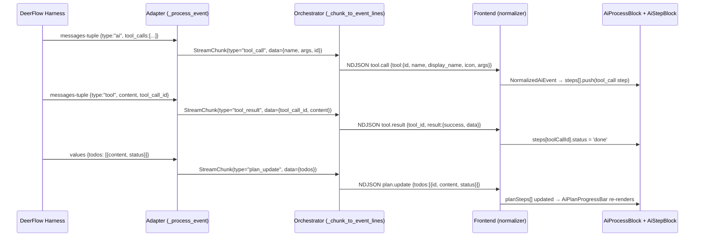

# Phase B: Plan Skeleton + Subtask Card Upgrade + Streaming Path Unification

## Problem Frame

Agent chat currently provides no progress visibility beyond "thinking" and "answering" phases. Tool calls appear but cannot be re-expanded after compression, and DeerFlow plan/tool events are silently dropped at the adapter layer despite the harness emitting them. Meanwhile, the codebase has two parallel streaming paths (`orchestrator + adapter` and `agent_dispatch`) with duplicated message classification logic — only the latter handles tool events.

Phase B delivers DeerFlow-inspired progressive disclosure: a compact plan skeleton with progress dots, interactive subtask cards with live status text, and a unified backend event pipeline that properly surfaces tool and plan events to the frontend.

---

## Scope Boundaries

### In Scope

- Backend streaming path unification (shared extraction utilities)
- Adapter extension to extract tool_calls, tool_results, plan todos from DeerFlow events
- Orchestrator extension to emit tool.call, tool.result, plan.update NDJSON events
- EventStreamBuilder new methods: `plan_update()`, `tool_progress()`
- Frontend type extensions (AgentEventType, ProcessStep, NormalizationState)
- Normalizer cases for `plan.update` and `tool.progress`
- Tap-to-expand for compressed tool_call steps
- Live FlipDisplay-style status text during tool execution
- Plan progress bar component with dot indicators
- Dual-source plan data (explicit DeerFlow events + 3s fallback inference)
- `write_todos` special display handling

### Deferred to Follow-Up Work

- `tool.progress` actual emission from DeerFlow tool execution middleware (schema ready, emission deferred)
- Citation chips (Phase C #5)
- Artifact registry (Phase C #6)
- Session history process reconstruction (Phase C #7)
- Plan execution replay/scrubber
- Backend retry/error recovery for failed tools

---

## Key Technical Decisions

1. **Streaming path unification via shared utilities, not path merger.** Extract `_classify_message()`, `_extract_tool_calls()`, `_extract_tool_result()`, `_extract_reasoning()`, `_extract_content()` from `agent_dispatch.py` into a new shared module (`services/message_classifier.py`). Both `agent_dispatch` and the adapter import from it. This eliminates logic duplication without requiring a risky rewrite of either streaming path's control flow.

2. **StreamChunk extended with discriminated union pattern.** Add `tool_call`, `tool_result`, `plan_update` types with an optional `data: dict | None` field. The existing `content: str` field remains for thinking/text chunks; new types carry structured data in `data`.

3. **Frontend plan data uses existing `progress` ProcessStep type.** The `progress` type already exists in the ProcessStep union but is orphaned (no backend data source). Phase B activates it for plan steps rather than creating a new type, keeping the existing AiStepBlock dispatch logic intact.

4. **Incremental frontend delivery order.** Tap-to-expand first (smallest change, highest immediate value), then status text inference, then plan progress bar, then plan event wiring. Each unit is independently shippable.

5. **Plan diffing uses content+status string hash.** `JSON.stringify(todos.map(t => t.content + '|' + t.status))` is sufficient — the todo list is ≤10 items and DeerFlow emits the full list on every graph node transition.

---

## High-Level Technical Design

*This illustrates the intended approach and is directional guidance for review, not implementation specification. The implementing agent should treat it as context, not code to reproduce.*

---

## Implementation Units

### U1. Shared Message Classification Module

**Goal:** Extract duplicated message classification logic from `agent_dispatch.py` into a reusable module that both streaming paths can import.

**Requirements:** Enables backend pipeline extension (origin §3) without code duplication.

**Dependencies:** None

**Files:**
- Create: `server/apps/agent/services/message_classifier.py`
- Modify: `server/apps/agent/services/agent_dispatch.py` (import from new module)
- Create: `server/apps/agent/tests/unit/test_message_classifier.py`

**Approach:** Move `_classify_message()`, `_extract_tool_calls()`, `_extract_tool_result()`, `_extract_reasoning()`, `_extract_content()` to a new module. Keep them as module-level functions (no class needed). Update `agent_dispatch.py` imports. Add `_resolve_tool_metadata()` as well since the adapter will need it.

**Patterns to follow:** Existing `agent_dispatch.py` implementation is the reference. The functions already handle both LangChain message objects and plain dicts — preserve that flexibility.

**Test scenarios:**
- Classify AIMessage with tool_calls → returns "tool_call"
- Classify ToolMessage with tool_call_id → returns "tool_result"
- Classify AIMessage with reasoning_content → returns "thinking"
- Classify AIMessage with text content → returns "text"
- Classify empty/unknown message → returns "unknown"
- Extract tool_calls from dict with nested args → returns normalized list
- Extract tool_result from ToolMessage → returns (provider_id, content)
- Extract reasoning from additional_kwargs fallback path

**Verification:** `uv run pytest apps/agent/tests/unit/test_message_classifier.py -v` passes. `agent_dispatch.py` existing tests still pass (no behavioral change).

---

### U2. Extend StreamChunk and Adapter `_process_event()`

**Goal:** Enable the adapter to extract tool_calls, tool_results, and plan todos from DeerFlow stream events and emit them as typed StreamChunks.

**Requirements:** Origin §3.1 (StreamChunk extension), §3.2 (adapter _process_event extension)

**Dependencies:** U1

**Files:**
- Modify: `server/apps/agent/services/deerflow_adapter/adapter.py`
- Create: `server/apps/agent/tests/unit/test_adapter_event_extraction.py`

**Approach:**
- Extend `StreamChunk` dataclass: add `data: dict[str, Any] | None = None` field, extend type literal to `Literal["thinking", "text", "tool_call", "tool_result", "tool_progress", "plan_update"]`
- In `_process_event()`, add three new extraction branches after the existing AI message handling:
  1. AI message with `tool_calls` list → emit `StreamChunk("tool_call", content="", data={...})` for each
  2. Tool message (`data.get("type") == "tool"`) → emit `StreamChunk("tool_result", content="", data={...})`
  3. Values event with `todos` key → emit `StreamChunk("plan_update", content="", data={...})`
- Use `_classify_message()` and `_extract_tool_calls()` from U1's shared module for the messages-tuple processing
- Mark `write_todos` tool calls with `"internal": True` in the data dict

**Patterns to follow:** Existing `_process_event()` pattern of `queue.put_nowait(StreamChunk(...))`. The `agent_dispatch.py` extraction logic is the reference for how to handle LangChain message shapes.

**Test scenarios:**
- AI message with tool_calls → emits StreamChunk(type="tool_call") for each call
- AI message with tool_calls including write_todos → emits with internal=True flag
- Tool message → emits StreamChunk(type="tool_result") with tool_call_id and content
- Values event with todos list → emits StreamChunk(type="plan_update") with todos
- Values event without todos key → no plan_update emitted (silent skip)
- Repeated values events with same todos → still emits (diffing is frontend's job)
- Existing thinking/text extraction unchanged (regression)
- Messages-tuple with type != "ai" and type != "tool" → still skipped

**Verification:** `uv run pytest apps/agent/tests/unit/test_adapter_event_extraction.py -v` passes. Existing adapter tests pass.

---

### U3. Extend Orchestrator and EventStreamBuilder

**Goal:** Wire the new StreamChunk types through to NDJSON output, and add `plan_update()` + `tool_progress()` methods to EventStreamBuilder.

**Requirements:** Origin §3.3 (_chunk_to_event_lines), §3.4 (EventStreamBuilder methods), §3.5 (new event types)

**Dependencies:** U2

**Files:**
- Modify: `server/apps/agent/services/orchestrator.py`
- Modify: `server/apps/agent/services/stream_events.py`
- Create: `server/apps/agent/tests/unit/test_orchestrator_tool_events.py`

**Approach:**
- **EventStreamBuilder** — add two methods:
  - `plan_update(todos: list[dict])` → emits `"plan.update"` with normalized todo list
  - `tool_progress(tool_id: str, message: str)` → emits `"tool.progress"` with status text
- **Orchestrator `_chunk_to_event_lines()`** — add branches for new chunk types:
  - `chunk.type == "tool_call"`: call `builder.tool_call()` using chunk.data fields; track tool_call_id → backend_id mapping (same pattern as agent_dispatch)
  - `chunk.type == "tool_result"`: call `builder.tool_result()` using mapped backend_id
  - `chunk.type == "plan_update"`: call `builder.plan_update()` with chunk.data["todos"]
- Maintain a `tool_call_id_map: dict[str, str]` local to the stream generator (same pattern as agent_dispatch line 676-677)

**Patterns to follow:** `agent_dispatch.py` lines 662-693 for tool event emission with ID mapping. `EventStreamBuilder` existing `tool_call()` and `tool_result()` method signatures for consistency.

**Test scenarios:**
- StreamChunk(type="tool_call") → yields NDJSON with type="tool.call" and tool metadata
- StreamChunk(type="tool_call", internal=True) → yields tool.call with tool_type="internal", display_name="规划步骤", icon="🗂️"
- StreamChunk(type="tool_result") → yields NDJSON with type="tool.result", success=True
- Tool result references correct backend_id from prior tool_call mapping
- StreamChunk(type="plan_update") → yields NDJSON with type="plan.update" and normalized todos
- plan_update todos mapped to {id: "plan-0", content, status} format
- tool_progress method produces valid NDJSON with tool_id and message
- Existing thinking/text chunks still produce phase + token events (regression)
- Empty/null data in new chunk types → graceful skip, no crash

**Verification:** `uv run pytest apps/agent/tests/unit/test_orchestrator_tool_events.py -v` and `uv run ruff check apps/agent/` pass. Existing orchestrator tests pass.

---

### U4. Frontend Type Extensions

**Goal:** Add `plan.update` and `tool.progress` event types, extend ProcessStep with `progressMessage`, extend NormalizationState with plan tracking fields.

**Requirements:** Origin §4.1–4.4 (frontend event pipeline extension)

**Dependencies:** None (can proceed in parallel with backend)

**Files:**
- Modify: `frontend/apps/main/src/types/agent-stream.ts`

**Approach:**
- Add `'plan.update' | 'tool.progress'` to `AgentEventType`
- Add to `AgentEvent`: `todos?: Array<{id: string; content: string; status: string}>`, `progress_message?: string`
- Add to `NormalizedAiEvent`: `plan_update` and `tool_progress` variants
- Extend `tool_call` ProcessStep with `progressMessage?: string`
- Add to `NormalizationState`: `planSteps: PlanStep[]`, `lastPlanHash: string`, `planSource: 'explicit' | 'inferred' | null`, `inferredSteps: PlanStep[]`, `planWaitTimer: ReturnType<typeof setTimeout> | null`
- Export new `PlanStep` interface: `{ id: string; label: string; status: 'pending' | 'active' | 'done' | 'error' }`

**Patterns to follow:** Existing type union extension pattern in `agent-stream.ts`. ProcessStep uses discriminated union on `type` field.

**Test scenarios:**
- Test expectation: none — pure type definitions with no runtime behavior

**Verification:** `pnpm typecheck` passes with the new types.

---

### U5. Frontend Normalizer Extension

**Goal:** Handle `plan.update` and `tool.progress` events in the normalizer, implement plan diffing logic, and manage the 3s inference fallback timer.

**Requirements:** Origin §4.5 (normalizer cases), §1.4 (dual-source plan data), §1.4 source switching

**Dependencies:** U4

**Files:**
- Modify: `frontend/apps/main/src/utils/aiEventNormalizer.ts`
- Create: `frontend/apps/main/src/utils/planDiff.ts`
- Create: `frontend/apps/main/src/utils/__tests__/planDiff.test.ts`
- Create: `frontend/apps/main/src/utils/__tests__/aiEventNormalizer.plan.test.ts`

**Approach:**
- **planDiff.ts**: Export `hashTodos(todos)` (JSON.stringify content+status) and `mapTodosToPlanSteps(todos)` (maps DeerFlow todo status to PlanStep status: pending→pending, in_progress→active, completed→done)
- **Normalizer changes**:
  - Initialize new NormalizationState fields (empty planSteps, null timer, null source)
  - On `session.start`: start 3s timer for inference activation
  - On `plan.update`: clear timer, set planSource='explicit', diff against lastPlanHash, update planSteps if changed. Also insert/update `progress`-type ProcessStep entries in `steps[]` for each plan step (so they appear inline in the activity stream)
  - On `tool.progress`: find matching tool_call step, update progressMessage
  - On `tool.call` (existing case): if planSource is null and timer expired, activate inference mode
  - On `capability.end` / `capability.error`: clear planWaitTimer to prevent dangling timer after stream ends
- **Source switching**: If explicit plan arrives after inference activated, replace inferredSteps with explicit planSteps

**Patterns to follow:** Existing normalizer switch-case pattern. State mutation is in-place (mutable steps array). The `tool.call` case already creates and pushes ProcessStep entries.

**Test scenarios:**
- hashTodos with same content+status → same hash
- hashTodos with different status → different hash
- mapTodosToPlanSteps maps in_progress → active, completed → done
- plan.update event with new hash → updates planSteps, returns plan_update NormalizedEvent
- plan.update event with same hash → returns null (skip)
- plan.update clears planWaitTimer and sets planSource='explicit'
- plan.update inserts progress-type ProcessStep entries into steps[] array
- tool.progress event → updates matching step's progressMessage
- tool.progress for unknown tool_id → no crash, returns event anyway
- Source switch: inference active + plan.update arrives → replaces inferred with explicit
- Session start initializes 3s timer
- Timer expiration + tool.call → activates inference mode
- capability.end clears planWaitTimer (no dangling timer)

**Verification:** `pnpm test:run` passes (new test files). `pnpm typecheck` passes.

---

### U6. Tap-to-Expand for Compressed Tool Calls

**Goal:** Make compressed (done) tool_call steps re-expandable on tap, fixing the current irreversible compression.

**Requirements:** Origin §2.2 (tap-to-expand)

**Dependencies:** None (independent of backend work)

**Files:**
- Modify: `frontend/apps/main/src/components/ai/AiStepBlock.vue`
- Modify: `frontend/apps/main/src/i18n/locales/zh-CN.ts`
- Modify: `frontend/apps/main/src/i18n/locales/en-US.ts`

**Approach:**
- Add `isManuallyExpanded` ref (default false) for tool_call steps
- When `compressed && type === 'tool_call'`: show `.step-body` if `isManuallyExpanded` is true (override the current `display: none`)
- Modify `canCollapse` computed to include tool_call type: `props.type === 'reasoning' || (props.type === 'tool_call' && props.compressed)` — currently it only allows reasoning
- Add a chevron icon (van-icon arrow-down, 16px, `var(--text-tertiary)`) at trailing edge of compressed row; rotates 180° with 0.2s transition when expanded
- Make the entire compressed header row clickable (already has click handler infrastructure)
- Add keyboard accessibility: `role="button"`, `aria-expanded`, `tabindex="0"`, `@keydown.enter` + `@keydown.space.prevent`
- CSS transition: use existing `max-height` transition for expand/collapse
- Status text overflow: `text-overflow: ellipsis; white-space: nowrap; overflow: hidden` on status text container

**Patterns to follow:** Existing `useStepCollapse` toggle pattern. The `canCollapse` computed already gates collapsibility — extend it to include compressed tool_calls.

**Test scenarios:**
- Compressed tool_call renders with chevron icon visible
- Tapping compressed row → expands to show full args + result
- Tapping again → re-collapses to single line
- Keyboard Enter/Space on compressed row → toggles expansion
- aria-expanded reflects current state
- Expansion uses smooth max-height transition (no layout jank)
- Non-tool_call compressed steps unaffected (if any exist)
- Touch target ≥ 44px height maintained in compressed state

**Verification:** `pnpm typecheck` passes. Manual testing: compressed tool_call is tappable, expands/collapses smoothly.

---

### U7. Live Status Text (FlipDisplay Pattern)

**Goal:** Display live-updating status text during tool execution, with frontend inference as fallback when no backend `tool.progress` events arrive.

**Requirements:** Origin §2.3 (live status text), §2.4 (visual hierarchy)

**Dependencies:** U4, U5 (normalizer handles tool.progress), U6 (AiStepBlock modifications)

**Files:**
- Modify: `frontend/apps/main/src/components/ai/AiStepBlock.vue`
- Create: `frontend/apps/main/src/composables/useToolStatusText.ts`
- Modify: `frontend/apps/main/src/i18n/locales/zh-CN.ts`
- Modify: `frontend/apps/main/src/i18n/locales/en-US.ts`
- Create: `frontend/apps/main/src/composables/__tests__/useToolStatusText.test.ts`

**Approach:**
- **useToolStatusText composable**: accepts `toolType`, `elapsedMs`, `progressMessage` (from backend). Returns computed `statusText`:
  - If `progressMessage` is truthy → use it verbatim (backend-driven)
  - Otherwise → derive from tool type + elapsed time thresholds (0-2s / 2-5s / 5s+)
- **AiStepBlock**: when `type === 'tool_call' && status === 'running'`, render status text below tool name
  - Fixed-height area (single line, `line-height: 20px`)
  - CSS opacity fade transition (0.15s) on text change via `<Transition>` wrapper
  - `font-size: 12px`, `color: var(--text-secondary)`
  - `aria-live="polite"` for screen reader updates
- **Visual hierarchy**: pending steps at 55% opacity; running→done height transition (300ms ease)
- i18n keys for all status text strings (per tool-type × time-bracket)

**Patterns to follow:** Existing `useStepCollapse` composable structure. Status text strings follow the emoji convention from CLAUDE.md for i18n keys under a new `aiProcess.toolStatus.*` namespace.

**Test scenarios:**
- useToolStatusText with progressMessage → returns progressMessage directly
- useToolStatusText with toolType='web_search', elapsed < 2000 → "搜索中..."
- useToolStatusText with toolType='web_search', elapsed 2000-5000 → "等待搜索结果..."
- useToolStatusText with toolType='web_search', elapsed > 5000 → "搜索耗时较长..."
- useToolStatusText with toolType='code_interpreter' → correct progression
- useToolStatusText with unknown tool type → generic "执行中..." / "处理中..." / "等待中..."
- Status text area visible only during status='running'
- Status text hidden once status transitions to 'done'
- Text transition uses opacity fade (no vertical shift)
- Pending tool_call steps render at 55% opacity

**Verification:** `pnpm test:run` passes. `pnpm typecheck` passes. Manual testing: status text appears during tool execution and fades between states.

---

### U8. Plan Progress Bar Component

**Goal:** Create compact progress dot bar showing plan execution state, with tap-to-scroll interaction.

**Requirements:** Origin §1.2 (AiPlanProgressBar), §1.6 (scroll-to-step)

**Dependencies:** U4 (PlanStep type)

**Files:**
- Create: `frontend/apps/main/src/components/ai/AiPlanProgressBar.vue`
- Modify: `frontend/apps/main/src/i18n/locales/zh-CN.ts`
- Modify: `frontend/apps/main/src/i18n/locales/en-US.ts`
- Create: `frontend/apps/main/src/components/ai/__tests__/AiPlanProgressBar.test.ts`

**Approach:**
- Props: `steps: PlanStep[]`, `activeStepIndex: number`
- Emit: `step-tap(stepId: string)`
- Render: horizontal row of 8px dots connected by 2px line
- Dot states: pending (dim), active (pulse animation), done (solid primary), error (red)
- Connecting line: filled portion (primary color) up to active step, pending portion (separator color) after
- Overflow: >7 steps → show first 6 + "..." indicator with tooltip
- Fixed height: 24px, no vertical growth
- Tap targets: 44×44px invisible hit areas per dot
- Accessibility: `role="progressbar"`, `aria-valuemin/max/now`, each dot `role="button"` with `aria-label`
- Pulse animation: CSS `scale(1→1.3→1)` at 1.5s, disabled under `prefers-reduced-motion`

**Patterns to follow:** Existing AI component structure (single-file component, `<script setup lang="ts">`). Vant components auto-imported. Design tokens from DESIGN.md.

**Test scenarios:**
- Renders correct number of dots for given steps array
- Active step dot has pulse animation class
- Done step dots have solid primary color
- Pending dots are dimmed (40% opacity)
- Error dot is red
- Connecting line fills proportionally to completed steps
- >7 steps shows overflow indicator
- Tapping a dot emits step-tap with correct stepId
- Progress bar stays within 24px height at 375px width
- Dots don't overflow horizontally (verified at 375px)
- aria-valuenow equals number of completed steps
- Pulse disabled under prefers-reduced-motion media query

**Verification:** `pnpm test:run` passes. `pnpm typecheck` passes. Manual testing at 375px width.

---

### U9. Plan Inference Composable

**Goal:** Implement Source B inference logic — derive plan steps from observed tool/reasoning events when no explicit plan data arrives within 3 seconds.

**Requirements:** Origin §1.4 Source B (inferred labels), §1.5 (write_todos display)

**Dependencies:** U4 (PlanStep type), U5 (normalizer timer logic)

**Files:**
- Create: `frontend/apps/main/src/composables/usePlanInference.ts`
- Modify: `frontend/apps/main/src/i18n/locales/zh-CN.ts`
- Modify: `frontend/apps/main/src/i18n/locales/en-US.ts`
- Create: `frontend/apps/main/src/composables/__tests__/usePlanInference.test.ts`

**Approach:**
- Composable accepts reactive `steps: ProcessStep[]` and `planSource` state
- When `planSource === 'inferred'`, derives PlanStep[] from observed steps:
  - Tool-type mapping: web_search→"搜索", code_interpreter→"计算", mcp_*→"工具调用", write_todos→suppressed
  - Keyword extraction from first 10 chars of reasoning content
  - Deduplication: consecutive same-label steps merge into one dot
- Returns computed `inferredPlanSteps: PlanStep[]`
- `write_todos` handling: when tool_call with name="write_todos" appears, emit a transient "AI 正在规划..." step that auto-collapses to "制定了 N 步计划" when plan_update arrives

**Patterns to follow:** Existing composable pattern (`useStepCollapse.ts`). Tool display info from `toolDisplayMapping.ts`.

**Test scenarios:**
- web_search tool_call → infers "搜索" label
- code_interpreter tool_call → infers "计算" label
- write_todos tool_call → suppressed from inferred steps
- Three consecutive web_search calls → one "搜索" dot (deduplication)
- Mixed tool calls → separate dots per type
- Reasoning with "搜索" keyword → infers "搜索" label
- Reasoning with no matching keywords → "思考" fallback
- Plan source switches to explicit → inferred steps cleared
- write_todos appears → renders "AI 正在规划..." then collapses to "制定了 N 步计划" on plan_update
- Inferred steps are append-only (never revert to pending)

**Verification:** `pnpm test:run` passes. `pnpm typecheck` passes.

---

### U10. Integration Wiring (AiProcessBlock + Scroll-to-Step)

**Goal:** Wire AiPlanProgressBar into AiProcessBlock, connect plan state from normalizer, implement scroll-to-step on dot tap.

**Requirements:** Origin §1.3 (plan step in activity stream), §1.6 (scroll-to-step), §5 (state flow)

**Dependencies:** U5, U6, U7, U8, U9

**Files:**
- Modify: `frontend/apps/main/src/components/ai/AiProcessBlock.vue`
- Modify: `frontend/apps/main/src/utils/aiEventNormalizer.ts` (minor: expose planSteps to consumer)
- Modify: `frontend/apps/main/src/pages/AIChatPage.vue` (pass plan state down)

**Approach:**
- **AiProcessBlock**: add `<AiPlanProgressBar>` between header and steps body (conditionally rendered when planSteps.length > 0, wrapped in `<Transition>` with `max-height 0.3s ease` for smooth appearance)
- Pass `planSteps` and `activeStepIndex` (derived from first step with status='active')
- Handle `step-tap` event: check if element is already in viewport (IntersectionObserver or getBoundingClientRect check); if not visible, call `scrollIntoView({ behavior: 'smooth', block: 'center' })`; always add brief 200ms highlight class
- **Plan steps in activity stream**: plan_update events already produce `progress`-type ProcessStep entries via normalizer (U5). AiStepBlock already renders `type='progress'` — just needs status-driven visual treatment (pending at 55% opacity, active with gradient border, done compressed)
- **AIChatPage**: thread planSteps from normalization state through to AiProcessBlock props

**Patterns to follow:** Existing prop-drilling from AIChatPage → AiProcessBlock → AiStepBlock. The `steps[]` array is already reactive and v-for'd.

**Test scenarios:**
- AiPlanProgressBar renders when planSteps.length > 0
- AiPlanProgressBar hidden when no plan data
- Tapping a progress dot scrolls to the corresponding inline step
- Scroll target gets 200ms highlight flash
- Plan steps appear inline as AiStepBlock type='progress'
- Active plan step has gradient-sweep border
- Pending plan steps render at 55% opacity
- Done plan steps compress to single line
- write_todos step shows "AI 正在规划..." during running, collapses after plan_update
- Progress bar reflects real-time status updates as plan events arrive

**Verification:** `pnpm typecheck` passes. Manual testing: plan dots appear, tapping scrolls, inline steps show correct states.

---

## System-Wide Impact

| Surface | Impact |
|---------|--------|
| NDJSON event contract | New event types (`plan.update`, `tool.progress`) added — additive, no breaking changes |
| Agent dispatch path | Refactored to import from shared module — behavioral equivalence maintained |
| Session journal | New event types will be persisted in JSONL logs (no schema change needed — journal stores raw events) |
| Frontend bundle | ~3 new components/composables — minimal size impact |
| Accessibility | Progress bar adds ARIA progressbar role; compressed tool_calls gain keyboard interaction |

---

## Risks and Mitigations

| Risk | Likelihood | Impact | Mitigation |
|------|-----------|--------|-----------|
| DeerFlow values events don't contain `todos` in all configurations | Medium | Plan dots never appear | Source B inference fallback activates after 3s — progressive degradation, never broken |
| Tool_call ID mapping drift between adapter and orchestrator paths | Low | tool.result targets wrong step | Use same ID mapping pattern as agent_dispatch (proven); add integration test |
| Plan progress bar overwhelms small viewport at 375px | Low | Layout issues | Fixed 24px height cap; overflow at >7 steps; tested at 375px |
| Shared classifier module breaks agent_dispatch behavior | Low | Regression in existing streaming | Pure extraction refactor with identical tests; agent_dispatch tests must pass |

---

## Deferred Implementation Notes

- **tool.progress actual emission**: The `EventStreamBuilder.tool_progress()` method will exist but won't be called until DeerFlow middleware hooks are available. Frontend inference covers the gap.
- **Plan step timing**: DeerFlow doesn't provide per-step timing. Frontend tracks elapsed time locally from step status transitions (same pattern as existing reasoning duration).
- **History replay of plan events**: Phase C (session history reconstruction) will need to handle plan.update events in state.snapshot replay. The normalizer is designed to handle this (same code path).
