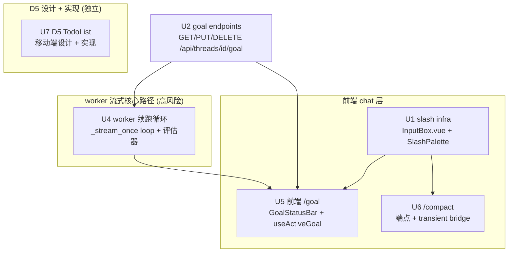

# AI 对话 /goal + /compact + TodoList 对齐 DeerFlow - Plan

**Target repo:** numina (cwd). DeerFlow reference at external path `/Users/vincentruan/geek_space/github/deer-flow-reference` is read-only ground truth; all new code lands in numina.

**Product Contract preservation:** N/A — solo planning (`product_contract_source: ce-plan-bootstrap`). No upstream requirements doc; scope derives from the user's explicit disposition of the D1–D5 DeerFlow divergences (see `area6-ai-chat-parity.md`) and two grounded research passes (DeerFlow feature impl + numina integration points).

## Goal Capsule

**Objective.** 同步实现 DeerFlow chat 的三个实现遗漏,补齐 numina `/ai/chat` 的交互保真度:
- **D1 `/goal`** — `/goal <condition>` 斜杠命令 + GoalStatusBar + 目标自动续跑循环(评估器判断达成→未达成注入隐藏 HumanMessage 续跑→直到达成或触上限)
- **D2 `/compact`** — `/compact` 斜杠命令 + `POST /api/threads/{id}/compact` 端点(摘要历史消息,RemoveMessage(ALL) + summary_text channel)
- **D5 TodoList** — 按手机端设计适配后引入(本计划含移动端适配设计 + 实现:Vant 组件 + todos channel + TodoMiddleware,见 U7;A2)

**Product authority.** DeerFlow 参考实现 (`/Users/vincentruan/geek_space/github/deer-flow-reference`): goal (`backend/packages/harness/deerflow/runtime/goal.py`、`runtime/runs/worker.py:519-542`、`frontend/src/components/workspace/goal-status.tsx`、`input-box-helpers.ts:171-186`)、compact (`backend/app/gateway/routers/threads.py:896-926`、`context_compaction.py:58-142`、`frontend/src/core/threads/hooks.ts` transient bridge)、TodoList (`frontend/src/components/workspace/todo-list.tsx`、`backend/packages/harness/deerflow/agents/middlewares/todo_middleware.py`、`factory.py:227-231` plan_mode gate)。

**Open blockers.** 无(两个范围分叉未获用户答复,按 Assumptions 节的默认推进,方案可审阅后调整)。

## Background — 现状(已验证)

D3(输入润色)已于 2026-07-21 全栈实现并验证(7/7 pytest + typecheck + ruff + mypy + eslint 通过),不在本计划范围。D4(reasoning_effort 按模式自动)为设计如此,不改。

**已验证的两个关键事实(推翻 D3 调研时的误判):**
- **D1 无需 DB 迁移。** DeerFlow 把 goal 存在 LangGraph checkpoint 的 `channel_values["goal"]`(goal.py:462-471 read / 474-531 write)。numina 既有 `POST /api/threads/{id}/state`(threads.py:723-786)即可读写 `values.goal`,无需新增 `ai_chat_sessions.goal` 列、无需 alembic 迁移。D3 调研时"需 DB 列+迁移"的判断被本次深度调研推翻。
- **`'agent'` graph 虽由外部 `deerflow-harness` 编译,但中间件可注入。** `DeerFlowAdapter.__init__` 接受 `middlewares: list[Any] | None`(adapter.py:131),经 `create_family_adapter` → `get_family_adapter` 透传。chat 路径 `worker.py:1639-1646` 的 `_run_numina_agent` 当前**不传** `middlewares` kwarg —— 这是 U7 TodoMiddleware(`plan_mode` gate)的注入点。**(注:D1 GoalMiddleware 已按 KTD-9 移除,不注入中间件;goal 上下文由 U4 续跑循环隐藏消息承担。)**

**已验证的 5 个会导致静默失败的真实风险(numina 侧代理标记):**
1. **sync-only hook 分发**:numina chat 走 sync `stream()` 路径,只跑 sync `before_model`/`after_model`(run_extras.py:11-14)。只实现 async `abefore_model` 的中间件会编译通过、挂载成功,但**静默什么都不做**。**U7 TodoMiddleware 必须实现 sync `before_model`/`after_model`**(D1 GoalMiddleware 已按 KTD-9 移除,此风险不再适用于 goal)。
2. **LRU 缓存以 `id()` 为 key**:`family_adapter_cache.py:726` 的 key 是 `tuple(id(m) for m in middlewares)`。每次 `TodoMiddleware()` 新建实例 → 每次缓存失效 → 每次重建 agent → 性能倒退 + 工具加载竞态(正是 worker.py:1627-1631 对 `plan_mode` 警告的那类)。**U7 必须用模块级单例或 family-keyed 缓存**(D1 GoalMiddleware 已移除,KTD-9)。
3. **`/compact` 的 messages reducer**:LangGraph 默认 `messages` reducer 是按 ID 累加。手写短列表 `aput` 可能"粘不住"(下一轮 run 时 reducer 从旧 checkpoint 重新累加)。须先看 DeerFlow `DeerFlowSummarizationMiddleware` 如何解(`RemoveMessage(ALL)` + `summary_text`)再手写。
4. **slash palette 数据源**:`useCapabilityStore.capabilities` 是 `/ai/capabilities` 的路由/技能,不是 chat 命令。`/goal`、`/compact` 必须来自本地静态列表,不能走 store。
5. **`canPolishInput` 已对 `/` 前缀特殊处理**:live `InputBox.vue:122` 已禁用 `/` 开头输入的 polish。新增 slash 检测与此约定一致,无冲突,但 `/` 前缀在该文件已有语义。

**live InputBox.vue 无 slash 基础设施**(确认):当前 `onSubmit` 直接 trim 文本 emit,无 `/` 检测。slash palette 仅存在于已废弃的 `components/common/AIChatInput.vue`(死代码,含完整 `onInput` 检测 + 键盘导航 + `<SlashPalette>` 模板,可作移植参考)。

## Resolved Decisions (user-confirmed 2026-07-21)

三个范围分叉已由用户确认(原 Assumptions 升级为确定决策):

- **A1 — D1 范围 = 完整复刻 DeerFlow 自动续跑循环(含 U4 worker 改动)。** 用户确认完整循环。含:goal 存 checkpoint channel、独立非思考评估器 LLM、隐藏续跑 HumanMessage、`continuation_count/max`(默认 0/8)、`no_progress_count/max`(默认 0/2)熔断、per-thread 锁、optimistic-UI 对账。U4 worker 流式路径改动保留,降级路径(回退 U3-only)仅作 R1 兜底。
- **A2 — D5 本计划含实现(设计 + 实现)。** 用户确认 U7 从"只设计"升级为"设计 + 实现":含移动端 Vant 4 适配设计 + todos channel 接入 + TodoMiddleware 挂载 + 前端 TodoList 组件实现。
- **KTD-9 — U3 选 (a):删除 GoalMiddleware,对齐 DeerFlow。** 用户确认选 (a)。goal 仅由 U4 续跑循环的隐藏 `HumanMessage` 在续跑轮注入(用户首轮 goal 不进上下文,只在续跑轮进——DeerFlow 实际行为)。U3 整 U 移除;KTD-3/KTD-4 的"同步 DeerFlow"措辞成立。降级路径"U4→U3-only MVP"随之失效(无 U3 可回退)——R1 兜底改为"U4 可整 U 移除,goal 设/清/状态(U2)+ GoalStatusBar(U5)仍成立,仅无自动续跑"。

## Key Technical Decisions

**KTD-1. slash 命令基础设施作为 D1/D2 共用的前置 U,移植自废弃 AIChatInput.vue(session-settled: user-directed — chosen over 从零自建: 已有可参考的 slash palette 实现,移植成本最低,且 live InputBox.vue 已有 `/` 前缀语义(canPolishInput line 122),一致性好).**
在 live `InputBox.vue` 新增 `watch(internalValue)` slash 检测 + `<SlashPalette>` 组件(移植自 `components/common/AIChatInput.vue` 的 `onInput`/`onKeydown`/`selectCapability` + 模板)。`/goal`、`/compact` 来自本地静态列表(`useCapabilityStore.capabilities` 是路由/技能,不是 chat 命令——见风险 4)。键盘导航 ArrowUp/Down/Tab/Enter/Esc 移植。i18n 复用既有 `aiChat.slashPaletteHint`/`slashPaletteEmpty`。

**KTD-2. D1 goal 持久化走 checkpoint channel_values["goal"],不新增 DB 列(session-settled: user-directed — chosen over ai_chat_sessions.goal DB 列 + alembic 迁移: DeerFlow 原生如此,且 numina 既有 POST /api/threads/{id}/state 已能读写,消除不可逆的迁移风险).**
goal 读写直接 import DeerFlow canonical 实现(`read_thread_goal`/`write_thread_goal`/`attach_goal_evaluation`,见 KTD-5),经既有 `POST /api/threads/{id}/state`(`{"values":{"goal": <GoalState>}}`,threads.py:723-786)或新增薄端点委托 checkpointer。GoalState 形状对齐 DeerFlow(`objective/status/created_at/updated_at/continuation_count/max_continuations/no_progress_count/max_no_progress_continuations/last_evaluation`)。新增 `GET/PUT/DELETE /api/threads/{id}/goal` 三个薄端点(对齐 DeerFlow threads.py:832-880 契约),内部委托 `read_thread_goal`/`write_thread_goal`/`clear`——比通用 `/state` 更清晰,且与 DeerFlow 前端 client 契约一致。

**KTD-3. ~~GoalMiddleware 必须实现 sync before_model + 模块级单例(规避风险 1+2)~~ — 作废(见 KTD-9).**
**用户确认选 KTD-9 (a):删除 U3 GoalMiddleware。** 本 KTD 作废——不再注入 `middlewares=[GoalMiddleware]`,不再实现 sync `before_model`。R2(sync hook 静默失败)+ R3(LRU id() key)两风险随 U3 删除一并消除。goal 上下文注入完全由 U4 续跑循环的隐藏 `HumanMessage` 承担(见 KTD-4)。

**KTD-4. 目标续跑循环放在 worker 流式路径,对齐 DeerFlow worker.py:519-542 的 _stream_once 循环(session-settled: user-directed — chosen over 纯中间件 context-injection: 用户要求同步 DeerFlow 实现,DeerFlow 即此形态).**
单轮 `_stream_once` 后,读 goal;若 active 且未触上限,调独立非思考评估器 LLM(`_create_lightweight_llm` + `enable_thinking=False`,对齐 DeerFlow `create_goal_evaluator_model`)判断 `satisfied/blocker`;未满足且 `blocker=="goal_not_met_yet"` 且计数未触顶 → 注入隐藏 `HumanMessage(additional_kwargs={"hide_from_ui": True, "deerflow_goal_continuation": True})` 再跑一轮。`continuation_count/max`(0/8)+ `no_progress_count/max`(0/2)双熔断。per-thread `goal_thread_lock` 序列化读改写,写带 `expected_checkpoint_id` 冲突检测。**风险隔离**:此 U 改动 worker 流式核心路径,若实测不稳,可回退到 KTD-3 的纯 context-injection(降级为 MVP),goal 设/清/状态 + GoalStatusBar 不受影响。

**KTD-5. D2 /compact + D1 goal 读写直接 import DeerFlow 已安装包的 canonical 实现,不手写(规避风险 3 + 消除 R4).**
DeerFlow 的 `compact_thread_context`、`read_thread_goal`/`write_thread_goal`/`attach_goal_evaluation` 均在已安装的 `deerflow` 包中直接可 import(`from deerflow.runtime.context_compaction import compact_thread_context`、`from deerflow.runtime.goal import read_thread_goal, write_thread_goal, attach_goal_evaluation`)。`/compact` 端点成为薄 wrapper:`compact_thread_context(checkpointer, thread_id, force=True, app_config=...)` → 翻译 `ThreadCompactionResult` 为响应。**注意:** DeerFlow 的 `compact_thread_context` 不复用 agent 已挂载的 SummarizationMiddleware,而是经 `_create_compaction_middleware`(context_compaction.py:70)新建一个 `DeerFlowSummarizationMiddleware` 实例调其 `acompact_state`——因此**不要**去"验证已挂载中间件是否暴露 acompact_state 再直接调",那是未测试路径。canonical 代码已正确处理 `RemoveMessage(ALL)` + preserved tail + `channel_versions` bump,手写重实现正是放大 R4 的根因。若未来 deerflow-harness 升级移除这些 import,再回退手写。同理 goal 读写直接 import,继承 `aput` 的第 4 参 `{"goal": next_version}` 版本语义(见 KTD-2/U2)。

**KTD-6. D2 前端 transient bridge 用 Vue reactive ref + watch 对账,移植 DeerFlow hooks.ts 算法.**
DeerFlow 的 `transientHistoryBridgeRef`(hooks.ts:1277-1282)在 Vue 里是 `ref<Message[]>`。summarization `values` 事件触发时把将被丢弃的轮次存入 bridge;canonical history 确认后在 `watch(visibleHistory)` 里 `pruneConfirmedTransientMessages` 清空。算法(`computeSummarizationTransientMessages`/`resolveTransientHistoryBridge`)可移植,生命周期胶水重写为 Vue。`isWelcomeMode` 跳过 guard 对齐 numina 的"无 active thread/空"态。

**KTD-7. D5 移动端适配设计 + 实现(含 Vant 组件 + todos channel + TodoMiddleware,见 U7;A2 已确认含实现).**
对齐 DeerFlow `todo-list.tsx` 的 read-only 语义(agent 拥有 todo 状态,用户不可勾选),映射到 Vant 4:可折叠容器(`van-collapse` 或自定义 sticky bar)、状态指示(`van-checkbox` 只读表示 completed + 颜色/tag 表示 in_progress)、i18n 硬编码 "To-dos" label。`todos` channel + `merge_todos` reducer + langchain `TodoListMiddleware`(plan_mode gate)的接入 + 前端 TodoListBar 组件均在本计划实现范围(见 U7;A2 已确认含实现)。

**KTD-8. goal/compact 端点须双层鉴权:verify_family_token + checkpoint family-ownership check + role 门控(安全).**
numina 既有 `verify_family_token` 只校验 JWT `fid` 与 `X-Family-Id` header 一致——**不校验 thread_id 是否属于该 family**。既有 `threads.py` 所有端点都有第二层强制 ownership check(读 checkpoint metadata.family_id,fallback `AiSessionRepository.get_session().family_id`,不匹配 raise 404——lines 689-701/744-754)。U2/U6 新端点必须镜像此 check,否则跨 family 读/写/删除 goal + 跨 family compact 销毁他 family 消息历史。**Role 门控:** PUT/DELETE `/goal` + POST `/compact` 限 owner/adult(对齐 DeerFlow `@require_permission("threads","write",owner_check=True)`),复用 gateway 的 `require_owner`/`require_adult`(gateway.py:228,375)或 inline `verified.role` check——child 不可设对抗性 objective 驱动续跑循环(烧评估器 LLM 成本至 8 轮上限)或 compact 父线程销毁其历史。

**KTD-9. U3 GoalMiddleware 删除,对齐 DeerFlow(session-settled: user-directed — chosen over 保留 U3 作为 numina 发明: 用户确认选 (a) 忠实同步 DeerFlow,DeerFlow 无 goal 中间件,goal 仅经 worker 续跑循环隐藏消息注入).**
DeerFlow **无** GoalMiddleware 类、**无** `before_model` goal 注入。DeerFlow 的 goal 仅经 worker 续跑循环的隐藏 `HumanMessage`(`make_goal_continuation_message`,goal.py:391-408)在**续跑轮**注入——从不在用户自己的轮、从不经中间件。`apply_prompt_template` 不接受 `goal` 参数、不注入 system prompt(已验证)。**决策(用户确认 (a)):删除 U3 中间件**,goal 仅由 U4 续跑循环的隐藏消息注入(用户首轮 goal 不进上下文,只在续跑轮进——DeerFlow 实际行为)。U3 整 U 移除;原 U3 的"每轮 before_model 注入"不实现。worker 不再注入 `middlewares=[GoalMiddleware]`(KTD-3 作废,KTD-4 的循环隐藏消息注入保留)。降级路径"U4→U3-only MVP"失效——R1 兜底改为"U4 可整 U 移除,goal 设/清/状态(U2)+ GoalStatusBar(U5)仍成立,仅无自动续跑"。

## Implementation Units

### U1. 前端:slash 命令基础设施(移植自废弃 AIChatInput.vue)

**Goal.** 在 live `InputBox.vue` 新增 slash 检测 + `<SlashPalette>` 组件,作为 D1/D2 共用前置。`/goal`、`/compact` 来自本地静态列表。

**Requirements.** 支撑 D1(A1)、D2(A2)的斜杠入口。

**Dependencies.** 无。

**Files.**
- `frontend/apps/main/src/components/ai-chat/InputBox.vue` — 新增 `watch(internalValue)` slash 检测 + `slashPaletteOpen` ref + 键盘导航分支(在 `onKeydownEnter` line 299) + `<SlashPalette>` 模板块(textarea container,`@keydown.enter` 绑定 line 581 附近)
- `frontend/apps/main/src/components/ai-chat/SlashPalette.vue` — 新建,移植自 `components/common/AIChatInput.vue` 的 palette 模板 + `selectCapability` 逻辑
- `frontend/apps/main/src/composables/ai-chat/useSlashCommands.ts` — 新建,本地静态命令注册表(`/goal`、`/compact` 的 description + apply 回调),**不**走 `useCapabilityStore`(风险 4)
- `frontend/apps/main/src/i18n/locales/zh-CN.ts` + `en-US.ts` — 复用 `slashPaletteHint`/`slashPaletteEmpty`,新增 `slashGoalDesc`/`slashCompactDesc`

**Approach.** 移植 `AIChatInput.vue:333-347`(onInput 检测)+ `:349-381`(键盘导航)+ `:383-392`(selectCapability)+ `<SlashPalette>` 模板。命令注册表为本地静态(`/goal`→打开 goal 输入或直接解析,`/compact`→触发 compact)。回车时若 palette 开放则选中而非提交(分支进 `onKeydownEnter`)。`canPolishInput` 既有 `/` 前缀禁用(line 122)保持不变,一致。

**Patterns to follow.** `frontend/apps/main/src/components/common/AIChatInput.vue`(废弃但完整,移植参考);DeerFlow `input-box-helpers.ts:171-186`(parseGoalCommand)、`:203-226`(getInputSubmitAction 分类)。

**Test scenarios.**
- Happy path:输入 `/` → palette 弹出;ArrowDown/Up 导航;Enter 选中(不提交);Esc 关闭
- Edge:`/g` 前缀过滤出 `/goal`;`/xyz` 无匹配 → 显示 empty 提示
- Integration:选中 `/goal` 后 textarea 填充或触发 goal 流;选中 `/compact` 触发 compact 流(具体在 U4/U5 验证)
- Error:`/` 前缀输入不触发 polish(既有 canPolishInput 不回归)

**Verification.** typecheck + eslint 通过;手动在 `/ai/chat` 验证 `/` 弹 palette、键盘导航、选中行为;vitest 单测 useSlashCommands 命令注册表。

### U2. 后端:goal 端点(GET/PUT/DELETE /api/threads/{id}/goal)+ GoalState channel 读写

**Goal.** 新增三个薄端点读写 `channel_values["goal"]`,对齐 DeerFlow threads.py:832-880 契约。

**Requirements.** D1 goal 设/清/状态(A1)。

**Dependencies.** 无(与 U1 并行)。

**Files.**
- `server/apps/agent/routers/threads.py` — 新增 `GET/PUT/DELETE /{thread_id}/goal`(在 `update_thread_state` line 786 之后),`verify_family_token` + `X-Family-Id` 鉴权(threads.py:727-728 模式)
- `server/apps/agent/services/goal_store.py` — 新建,`read_thread_goal`/`write_thread_goal`/`clear_thread_goal`,委托 checkpointer 读写 `channel_values["goal"]`(对齐 DeerFlow goal.py:462-531)
- `server/apps/agent/tests/unit/test_goal_endpoints.py` — 新建

**Approach.** GoalState TypedDict 对齐 DeerFlow(goal_state.py:22-31)。**读写直接 import** `from deerflow.runtime.goal import read_thread_goal, write_thread_goal`(见 KTD-5),继承 canonical 的版本语义:`write_thread_goal` 设 `channel_values["goal"]` + bump `channel_versions["goal"]` + 新 checkpoint id,并 **`checkpointer.aput(write_config, checkpoint, metadata, {"goal": next_version})`——第 4 参 `new_versions` 必须携带 bump 后的 goal 版本**(对齐 DeerFlow goal.py:528);`clear` pop key。**服务端 clamp(关键,见 R1b):** `build_goal_state` 内 `max_continuations = max(0, min(int(body.max_continuations), 8))`、`max_no_progress_continuations = max(0, min(..., 2))`(对齐 DeerFlow `capped_max`),客户端无法抬高熔断上限。**注意:** numina 既有 `update_thread_state`(threads.py:771)在第 4 参传 `{}`,对 channel 写不是正确模板——直接 import `write_thread_goal` 可避免此陷阱。per-thread `goal_thread_lock`(asyncio.Lock dict)序列化读改写,写带 `expected_checkpoint_id` 冲突检测(GoalWriteConflict,继承自 canonical)。URL 无尾斜杠(CLAUDE.md 规范)。

**Patterns to follow.** DeerFlow `backend/packages/harness/deerflow/runtime/goal.py:462-531`(read/write/clear);numina `threads.py:get_thread_state`(line 648-723,checkpointer 访问模式)+ `update_thread_state`(723-786,写回模式)。

**Test scenarios.**
- Happy path:PUT `{objective, max_continuations}` → 200 + `{goal: <GoalState>}`;GET 返回当前;DELETE 清空
- Edge:PUT 空 objective → 422;objective >4000 字符 → 422;`max_continuations` 越界 → clamp 到 8(非 422);PUT `max_continuations=100` → 返回 GoalState 中为 8(服务端 clamp,见 R1b)
- Error:**跨 family thread → 404 via checkpoint family-ownership check**(对齐 threads.py:689-701/744-754:读 checkpoint metadata.family_id,fallback session row,不匹配 raise 404;**verify_family_token 只校验 JWT fid 与 X-Family-Id header 一致,不校验 thread_id 归属**——此第二层 ownership check 是必需的,区别于鉴权);thread 不存在 → 404
- Integration:PUT 后 GET 反映;DELETE 后 GET 返回 `{goal: null}`;并发 PUT 触发 GoalWriteConflict → 409
- **安全:** PUT/DELETE /goal 限 owner/adult role(见 KTD-8;child 不可设对抗性目标驱动续跑循环)

**Verification.** pytest 通过;ruff + mypy clean;curl 手动验证三端点 + 跨 family 404(见 KTD-8)+ max_continuations clamp 到 8(见 R1b)。

### U3. ~~后端:GoalMiddleware~~ — REMOVED(见 KTD-9,用户确认选 (a) 删除)

**本 U 已移除。** goal 上下文注入完全由 U4 续跑循环的隐藏 `HumanMessage` 承担(对齐 DeerFlow)。原 U3 的 `goal_middleware.py`/`test_goal_middleware.py`/worker `middlewares` 注入均不实现。R2(sync hook 静默失败)+ R3(LRU id() key)两风险随 U3 删除一并消除。

### U4. 后端:worker 目标续跑循环(_stream_once loop + 评估器)

**Goal.** 单轮 stream 后评估目标达成,未达成则注入隐藏续跑 HumanMessage 再跑一轮,直到达成或触 `continuation_count/max`(0/8)+ `no_progress_count/max`(0/2)双熔断。对齐 DeerFlow worker.py:519-542。

**Requirements.** D1(A1)——自动续跑循环。

**Dependencies.** U2(goal channel)——U4 续跑循环直接读写 goal channel + 扩展 U2 的 `goal_store.py`(U3 已移除,见 KTD-9)。

**Files.**
- `server/apps/agent/services/runtime/worker.py` — `_run_numina_agent` 的 stream 调用包入 `_stream_once` + while 循环(对齐 worker.py:519-542);新增 `_prepare_goal_continuation_input` + `evaluate_goal_completion`
- `server/apps/agent/services/goal_evaluator.py` — 新建,`create_goal_evaluator_model`(复用 `_create_lightweight_llm` + `enable_thinking=False`,对齐 DeerFlow goal.py:242-263)+ `evaluate_goal_completion`(LLM 输出 JSON `{satisfied, blocker, reason, evidence_summary}`,fail-closed `missing_evidence`)
- `server/apps/agent/services/goal_store.py` — 扩展 `should_continue_goal`(goal.py:330-340 逻辑)+ `compute_no_progress_count`(latest_visible_assistant_signature sha256 比对,goal.py:343-359)+ `attach_goal_evaluation`(持久化 evaluation)
- `server/apps/agent/tests/unit/test_goal_continuation.py` — 新建

**Approach.** `_stream_once(graph_input, config)` 跑用户可见轮 → 读 goal;若 active → 调 `evaluate_goal_completion`(独立非思考 LLM)→ `should_continue_goal`(未满足 + blocker==goal_not_met_yet + count<max + no_progress<max)→ bump `continuation_count`,注入隐藏 `HumanMessage(additional_kwargs={"hide_from_ui": True, "deerflow_goal_continuation": True})` 再 `_stream_once`;satisfied → clear goal;blocked/capped → `_stand_down_reason`。per-thread `goal_thread_lock` 序列化;写带 `expected_checkpoint_id` 冲突检测;race 检测(用户发新消息或 `/goal clear` → yield)。**风险隔离**:此 U 改 worker 流式核心路径,若实测不稳可回退到 U3 纯 context-injection(降级 MVP,goal 设/清/状态 + GoalStatusBar 不受影响)——见 Risks R1。

**Patterns to follow.** DeerFlow `runtime/runs/worker.py:519-542`(循环骨架)、`:858-1047`(`_prepare_goal_continuation_input`)、`goal.py:270-340`(评估器 + should_continue)、`:343-388`(no_progress)。

**Test scenarios.**
- Happy path:设 goal "分析完所有资产" → 首轮未达成 → 评估器返回 not_met → 注入续跑消息 → 第二轮达成 → clear goal → 停
- Edge:续跑到 `continuation_count==8` → `max_continuations_reached` stand down;连续 2 次无进展(no_progress)→ `no_progress_detected` stand down;评估器 `missing_evidence`(fail-closed)→ **stand down(blocked:missing_evidence),不再续跑**(对齐 DeerFlow:`CONTINUABLE_GOAL_BLOCKERS = {"goal_not_met_yet"}` 仅此一项可续跑,goal.py:51;`missing_evidence` 不在其中 → `should_continue_goal` 返回 False → 停止。**DeerFlow 靠停止防循环,不是靠继续**)
- Error:评估器 LLM 异常 → stand down(blocked:evaluator_error),不无限循环;race:续跑中用户 `/goal clear` → yield 不再续跑
- **Lock scope:** DELETE `/goal` 必须获取同一 `goal_thread_lock` 序列化(避免 clear 与已 bump count 的续跑交错);但续跑**不得跨 LLM 调用持锁**(否则 DELETE 等长续跑 → 死锁)——持锁粒度限于 read-modify-write 段(对齐 DeerFlow `goal_thread_lock` 的临界区范围,goal.py:67-82);clear-during-continuation 走 `expected_checkpoint_id` 冲突路径(与 PUT 同)
- Integration:续跑消息 `hide_from_ui=True` 不在 UI 显示;`continuation_count` 反映在 GoalStatusBar;per-thread lock 并发安全

**Verification.** pytest(评估器 + should_continue + no_progress 逻辑);**集成测试验证循环在真实 stream 路径跑通且不无限循环**(R1 关键);ruff + mypy clean;手动 `/goal 分析完所有资产` → 观察 worker 日志续跑 + GoalStatusBar count 递增 + 达成后停止。

### U5. 前端:/goal 命令处理 + GoalStatusBar + optimistic-UI 对账

**Goal.** `/goal <condition>`(PUT + 提交为下一任务→run 启动)/ `/goal`(GET 状态 toast)/ `/goal clear`(DELETE)三态分支 + GoalStatusBar 渲染 + optimistic-UI 对账(对齐 DeerFlow use-active-goal.ts)。

**Requirements.** D1(A1)——前端入口 + 状态栏。

**Dependencies.** U1(slash infra)+ U2(goal 端点)+ U4(续跑 count 反馈)。

**Files.**
- `frontend/apps/main/src/api/ai-chat.ts` — 新增 `setThreadGoal`/`getThreadGoal`/`clearThreadGoal`(PUT/GET/DELETE `/api/threads/{id}/goal`,getAgentApiBase + getAgentHeaders + credentials:include)
- `frontend/apps/main/src/composables/ai-chat/useActiveGoal.ts` — 新建,optimistic-UI 对账:`setLocalGoal` 立即覆盖 + 服务端 goal(streamed from checkpoint)对账,signature key `objective/status/created_at/updated_at/continuation_count`;stream chunk 省略 goal **不**视为 clear(对齐 use-active-goal.ts:40-44)
- `frontend/apps/main/src/components/ai-chat/GoalStatusBar.vue` — 新建,TargetIcon + objective(截断)+ continuation chip `续跑中 {count}/{max}`(**仅 count>0 显示**,对齐 goal-status-helpers.ts:16-25)
- `frontend/apps/main/src/components/ai/AIChatBox.vue` — GoalStatusBar 渲染于消息列表与 InputBox 之间(条件 `hasGoal`)
- `frontend/apps/main/src/composables/ai-chat/useThreadChat.ts` — `parseGoalCommand` 分支(input-box-helpers.ts:171-186 移植);`/goal set` → PUT + submitThreadMessage(objective 为消息文本→run 启动);`/goal status` → GET + toast;`/goal clear` → DELETE(均不启动 run,除 set)
- `frontend/apps/main/src/i18n/locales/zh-CN.ts` + `en-US.ts` — `goalLabel/goalContinuing/goalContinuationTooltip/goalSet/goalCleared/goalNone/goalActive/goalFailed`

**Approach.** `parseGoalCommand` 移植自 DeerFlow(input-box-helpers.ts:171-186)。`handleGoalCommand` 做 PUT/GET/DELETE,返回 `true` 仅成功时;set 才 `submitThreadMessage`(对齐 input-box.tsx:947-963)。`useActiveGoal` 的 reconciliation key 逻辑移植。GoalStatusBar 仅 `continuation_count>0` 显示 chip(避免 "0/8" 误导)。

**Patterns to follow.** DeerFlow `input-box-helpers.ts:171-186`(parseGoalCommand)、`input-box.tsx:947-963`(set 才启动 run)、`use-active-goal.ts`(optimistic 对账)、`goal-status.tsx` + `goal-status-helpers.ts:16-25`(count>0 才显示)。

**Test scenarios.**
- Happy path:`/goal 分析资产` → PUT 成功 → 提交 objective → run 启动 → GoalStatusBar 显示 objective;续跑 count>0 后显示 `续跑中 N/8`
- Edge:`/goal`(无参数)→ GET + toast `goalActive: {goal}`(无 active → `goalNone`);`/goal clear`/`reset`/`off` → DELETE + `goalCleared` toast;均不启动 run
- Integration:optimistic 覆盖立即显示 GoalStatusBar,服务端 stream 到达后对账;stream 省略 goal 不误判 clear;thread 切换 → 清 optimistic
- Error:PUT 失败 → `goalFailed` toast,不启动 run

**Verification.** typecheck + eslint + vitest(useActiveGoal 对账逻辑 + parseGoalCommand);手动 `/ai/chat` 三态 + 续跑 count 显示。

### U6. D2 /compact — 后端端点 + 前端 transient bridge

**Goal.** `POST /api/threads/{id}/compact` 端点(摘要历史 + RemoveMessage(ALL) + summary_text channel + preserved tail)+ 前端 `/compact` 命令 + transient bridge(对齐 DeerFlow hooks.ts)。

**Requirements.** D2(A2)。

**Dependencies.** U1(slash infra)。

**Files.**
- `server/apps/agent/routers/threads.py` — 新增 `POST /{thread_id}/compact`(在 `update_thread_state` line 786 之后);`verify_family_token` + `X-Family-Id`;409 if run in-flight;404 if thread missing
- `server/apps/agent/services/compact_service.py` — 新建,薄 wrapper:`from deerflow.runtime.context_compaction import compact_thread_context`(见 KTD-5);`compact_thread_context(checkpointer, thread_id, force=True, app_config=...)` 返回 `ThreadCompactionResult`(已正确处理 `RemoveMessage(ALL)` + preserved tail + `channel_versions` bump + `summary_text`);wrapper 翻译为响应。**不复用 agent 已挂载的 SummarizationMiddleware**(DeerFlow 自身经 `_create_compaction_middleware` 新建实例,见 KTD-5)
- `server/apps/agent/tests/unit/test_compact_endpoint.py` — 新建
- `frontend/apps/main/src/api/ai-chat.ts` — 新增 `compactThread(threadId)`(POST,credentials:include)
- `frontend/apps/main/src/composables/ai-chat/useThreadChat.ts` — `/compact` 命令处理 + transient bridge:`ref<Message[]>` 缓冲;summarization `values` 事件触发存入将被丢弃的轮次;`watch(visibleHistory)` prune 已确认轮次;`computeSummarizationTransientMessages`/`resolveTransientHistoryBridge` 算法移植自 hooks.ts:441-545;`isWelcomeMode` 跳过 + `compactSkipped` toast
- `frontend/apps/main/src/components/ai-chat/InputBox.vue` — `/compact` 经 U1 slash palette 触发
- `frontend/apps/main/src/i18n/locales/zh-CN.ts` + `en-US.ts` — `compactSuccess/compactSkipped/compactFailed/slashCompactDesc`

**Approach.** **直接 import** `from deerflow.runtime.context_compaction import compact_thread_context`(见 KTD-5),薄 wrapper 调用 `compact_thread_context(checkpointer, thread_id, force=True, app_config=...)`,canonical 已正确处理 `RemoveMessage(ALL)` + preserved tail + `channel_versions` bump + `summary_text`——**不手写消息分区**(手写正是放大 R4 的根因)。transient bridge 算法可移植,生命周期胶水重写为 Vue(reactive ref + watch)。

**Patterns to follow.** DeerFlow `threads.py:896-926`(端点)、`context_compaction.py:58-142`(compact_thread_context)、`summarization_middleware.py:322-366`(acompact_state + RemoveMessage(ALL));前端 `hooks.ts:441-545,1277-1322`(transient bridge)。

**Test scenarios.**
- Happy path:有历史消息的 thread → POST compact → 200 + `{compacted, removed_count, preserved_count, summary_updated}`;后续 run 上下文含 summary_text + preserved tail
- Edge:空/新 thread → `not_enough_messages` reason 或 `compactSkipped` toast;run in-flight → 409
- Error:LLM 摘要失败 → 503 + `compactFailed`;跨 family → **404 via checkpoint family-ownership check**(见 KTD-8,非 verify_family_token 单层)
- Integration:compact 后前端 transient bridge 保留被丢弃轮次显示,canonical history 确认后 prune;`messages` reducer 不重新累加(R4 验证;直接 import `compact_thread_context` 已正确处理)
- **安全:** POST /compact 限 owner/adult role(见 KTD-8;child 不可 compact 父线程销毁历史)

**Verification.** pytest(端点 + compact_thread_context);**集成测试验证 aput 短列表粘得住**(R3);typecheck + eslint + vitest(transient bridge 算法);手动 `/compact` 观察 UI 不闪烁 + 后续 run 上下文含摘要。

### U7. D5 TodoList 移动端适配设计 + 实现(含 Vant 组件 + todos channel + TodoMiddleware)

**Goal.** 按手机端设计适配后引入:产出移动端(Vant 4,375×812)TodoList 适配设计**并实现**——前端 TodoList 组件 + 后端 `todos` channel 接入 + `TodoMiddleware` 挂载(plan_mode gate)。对齐 DeerFlow `todo-list.tsx` read-only 语义。

**Requirements.** D5(A2,已确认含实现)——移动端适配设计 + 实现。

**Dependencies.** 无(后端 todos channel + 前端组件均独立于 D1/D2;可与 U1-U6 并行)。

**Files.**
- `docs/design/ai-chat-todolist-mobile-adaptation.md` — 新建设计规格文档(组件选型/布局/触控/交互契约/i18n,作为实现参考)
- `frontend/apps/main/src/components/ai-chat/TodoListBar.vue` — 新建,移动端 TodoList 组件(`van-collapse` 或 sticky bar + `van-checkbox` 只读 + `van-tag` 状态)
- `frontend/apps/main/src/composables/ai-chat/useThreadTodos.ts` — 新建,从 `thread.values.todos` 派生 todos(`hasTodos`/`todos` reactive)
- `frontend/apps/main/src/components/ai/AIChatBox.vue` — TodoListBar 渲染于 InputBox 上方(条件 `hasTodos`,与 GoalStatusBar 共置)
- `server/apps/agent/services/deerflow_adapter/todo_middleware.py` — 新建/接入,langchain `TodoListMiddleware`(`plan_mode` gate)+ `TodoMiddleware` 子类(context-loss reminder + premature-exit prevention,**需 sync hook**,对齐风险 1)
- `server/apps/agent/services/runtime/worker.py` — `_run_numina_agent`(line 1639-1646)`create_family_adapter` 在 `plan_mode=True` 时追加 `middlewares=[TodoMiddleware(...)]`(单例,规避 R3 id() key)
- `frontend/apps/main/src/i18n/locales/zh-CN.ts` + `en-US.ts` — `inputBox.todosLabel` + todo 状态文案

**Approach.** 对齐 DeerFlow `todo-list.tsx` 的 read-only 语义(agent 拥有 todo 状态 via `write_todos`,用户不可勾选)。先出设计规格(组件选型/布局密度/触控目标/交互契约/i18n),再实现:
- **组件选型**:可折叠容器 → `van-collapse` + `van-collapse-item` 或自定义 sticky bar;状态指示 → `van-checkbox` 只读(disabled)表示 completed + `van-tag`/颜色表示 in_progress + 空表示 pending(无 3-state checkbox,需组合);header icon → `van-icon list-o`
- **布局密度**:默认折叠(对齐 DeerFlow `internalCollapsed=true`);展开高度适配 375px 宽(DeerFlow `h-28` 桌面值需压缩);每项单行 + 截断
- **触控目标**:header 点击区 ≥44px(DeerFlow `min-h-8` 偏小);chevron 旋转动画保留
- **交互契约**:read-only,不接后端调用(DeerFlow 无用户勾选持久化);状态完全由 agent `write_todos` 驱动
- **i18n**:硬编码 "To-dos" 改 `t('inputBox.todosLabel')`
- **渲染门控**:`thread.values.todos?.length > 0` + 与 GoalStatusBar 共置 InputBox 上方
- **后端接入**:`todos` channel + `merge_todos` reducer(thread_state.py:244/85-94)+ langchain `TodoListMiddleware`(`plan_mode` gate,factory.py:227-231)+ `TodoMiddleware` 子类(context-loss reminder + premature-exit prevention,需 sync `before_model`/`after_model`——对齐风险 1,否则静默不生效);`write_todos` 工具由 langchain `TodoListMiddleware` 基类提供(确认 numina langchain 版本暴露此基类);Todo item shape `{content, status: pending|in_progress|completed}`(无 id,前端按 index+content 键)

**Patterns to follow.** DeerFlow `todo-list.tsx:14-99`(组件结构)、`todo_middleware.py`(中间件)、`factory.py:227-231`(plan_mode gate)、`thread_state.py:244/85-94`(todos channel + merge_todos reducer);numina Vant 4 现有可折叠/checkbox 组件用法;numina `TitleMiddleware`(sync 中间件模板,因 TodoMiddleware 同样需 sync hook)。

**Test scenarios.**
- Happy path:`plan_mode`(pro/ultra)+ 多步任务 → agent 调 `write_todos` → `thread.values.todos` 非空 → TodoListBar 渲染于 InputBox 上方;每项显示 content + 状态指示(completed/in_progress/pending)
- Edge:`todos` 空数组或 null → TodoListBar 不渲染;默认折叠,点击 header 展开/收起;375px 宽下布局不溢出
- Integration:agent 标记某 todo `in_progress` → UI 实时反映(stream `values` 事件);agent 完成 todo → 状态变 completed;read-only——用户点击 checkbox 无后端调用(无持久化)
- Error:`TodoMiddleware` sync hook 验证(对齐 R2:sync stream 路径实际触发 `before_model`/`after_model`,否则静默不生效);单例 `id()` 稳定(对齐 R3,不重建 agent);langchain 版本不暴露 `TodoListMiddleware` → 降级手写 `write_todos` 工具 + 简化 reminder
- 触控:header 点击区 ≥44px(移动端达标)

**Verification.** 设计文档完成;typecheck + eslint + vitest(useThreadTodos + TodoListBar 渲染门控);**集成测试验证 TodoMiddleware sync hook 在 sync stream 路径触发**(R2 防护);ruff + mypy clean;手动 `/ai/chat` plan 模式 + 多步任务观察 TodoListBar 出现 + 状态实时反映 + read-only。

## High-Level Technical Design

**关键依赖关系:** U1(slash infra)是 U5/U6 的前端前置;U2(goal channel)是 U4/U5 的后端前置(U4 扩展 U2 创建的 goal_store.py);U3 已移除(KTD-9),goal 上下文由 U4 续跑循环隐藏消息注入。U7(D5 设计+实现)完全独立,可并行。

**风险隔离边界:** U4 改动 worker 流式核心路径(R1)。降级路径(U3 已移除,KTD-9):若 U4 实测不稳,可整 U 移除 U4——goal 设/清/状态(U2)+ GoalStatusBar(U5)仍成立,仅无自动续跑。

## Scope Boundaries

### In scope
- D1 `/goal` 完整复刻(端点 + worker 续跑循环 + 前端 GoalStatusBar + slash 入口;**U3 GoalMiddleware 已移除**,KTD-9)
- D2 `/compact` 完整复刻(端点 + transient bridge + slash 入口)
- D5 TodoList 移动端适配**设计 + 实现**(Vant 组件 + todos channel + TodoMiddleware,见 U7;A2)
- slash 命令基础设施(U1,D1/D2 共用前置)

### Out of scope (non-goals)
- D3(输入润色)——已实现
- D4(reasoning_effort 按模式自动)——设计如此
- 其他 DeerFlow parity 项(C6.1–C6.27 matrix 中已标 ✓ 的)
- 分支树可视化(已在 2026-07-17-001 plan 中 settle 为 out-of-scope)

### Deferred to Follow-Up Work
- D1 续跑循环的 `last_evaluation` 富信息 UI 展示(本计划持久化 evaluation,但前端只显示 count/max,详细 evaluation 展示后续)
- `/compact` 的 `keep` 参数(保留指定条数)——本计划只做全量摘要(无 keep 参数,无 force 参数),keep/force 参数后续

## Risks & Dependencies

**R1 — worker 流式核心路径改动(U4)+ 无限循环风险。** U4 改 `_run_numina_agent` 的 stream 调用为循环,是最高风险点。**Mitigation:** U4 作为独立 U,若集成测试不稳可整 U 移除(降级:goal 设/清/状态 U2 + GoalStatusBar U5 仍成立,仅无自动续跑;U3 已移除,KTD-9)。续跑循环防无限循环的三重保障(对齐 DeerFlow):(1)`continuation_count/max`(8,**服务端 clamp**,见 R1b)+ `no_progress_count/max`(2)双熔断;(2)`CONTINUABLE_GOAL_BLOCKERS = {"goal_not_met_yet"}` 仅此一项可续跑——`missing_evidence`/其他 blocker 一律 stand down(DeerFlow 靠停止防循环);(3)`max_continuations` 服务端 clamp 到 8(不接受客户端超过)。

**R1b — `max_continuations` 服务端 clamp(防客户端绕过熔断)。** U2 PUT 接受 `max_continuations` 请求体,若不 clamp,客户端可设 100000 → 续跑循环事实无界 → 资源耗尽(重复 executor 提交 + 评估器 LLM 调用 + agent 轮)。**Mitigation:** `build_goal_state` 内 `max_continuations = max(0, min(int(body.max_continuations), 8))`、`max_no_progress_continuations = max(0, min(..., 2))`(对齐 DeerFlow `build_goal_state` 的 `capped_max`)。U2 测试场景加 "PUT max_continuations=100 → 返回 GoalState 中 clamped 到 8"。

**R2 — sync-only hook 静默失败(风险 1;适用于 U7 TodoMiddleware,U3 已移除)。** numina chat 走 sync `stream()` 路径,只跑 sync `before_model`/`after_model`(run_extras.py:11-14)。只实现 async `abefore_model` 的中间件会编译通过、挂载成功,但**静默什么都不做**。U3 GoalMiddleware 已移除(KTD-9),此风险不再适用于 goal;但 **U7 TodoMiddleware 同样需 sync hook**——必须实现 sync `before_model`/`after_model`,集成测试验证 sync stream 路径实际触发。**注:** U6 `/compact` 不经 middleware hook 分发(端点显式调 `compact_thread_context`),故 R2 不适用于 compaction 路径。

**~~R3 — LRU 缓存 id() key 失效(风险 2)~~ — 随 U3 移除。** U3 GoalMiddleware 已删,不再注入 `middlewares=[GoalMiddleware]`,R3 不适用。U7 TodoMiddleware 若注入 `create_family_adapter` 须同样用单例(规避 `family_adapter_cache.py:726` 的 `id()` key 失效)——U7 已在 Approach 标注单例。

**R4 — /compact messages reducer 粘不住(风险 3)。** LangGraph 默认 messages reducer 按 ID 累加,手写短列表可能被重新累加。**Mitigation:** U6 直接 import `compact_thread_context`(KTD-5),canonical 已正确处理 `RemoveMessage(ALL)` + preserved tail + `channel_versions` bump——**不手写**,R4 根因消除。仅需集成测试验证 import 路径在 numina checkpointer(SqliteSaver/Postgres)下行为与 DeerFlow 一致。

**R5 — 不可逆变更审查。** U4 改 worker + U3 改中间件 + KTD-5 可能改 prompt 路径。**Mitigation:** 无 DB 迁移(KTD-2 已消除迁移风险);SOUL prompt 不直接改(中间件注入隐藏 HumanMessage,不改 SKILL.md);改动均 revertable。

**Dependencies:**
- 外部 `deerflow-harness` 包(`DeerFlowClient`、`TitleMiddleware`、`SummarizationMiddleware`)——已安装,确认 `acompact_state`/`TodoListMiddleware` 可用性是 U6/U7 实现前置
- langchain `TodoListMiddleware`(D5 实现依赖,本计划只设计)

## Open Questions

- **OQ1 — D1 范围确认:** ✅ 已确认(A1)= 完整复刻含 U4 worker 续跑循环。
- **OQ2 — D5 推进确认:** ✅ 已确认(A2)= 本计划含 D5 实现(U7 升级为设计 + 实现)。
- **OQ3 — numina checkpointer 与 DeerFlow 行为一致性:** U6 直接 import `compact_thread_context`(KTD-5),但需集成测试验证 numina 的 checkpointer(SqliteSaver/Postgres)在 `expected_checkpoint_id` 冲突检测 + `aput` 版本语义上与 DeerFlow 假设一致。若行为有偏差,需薄适配层。(实现时验证,不阻塞计划。)
- **OQ4 — goal evaluator 模型选型:** U4 的评估器 LLM 复用 family active provider(`_create_lightweight_llm`)+ `enable_thinking=False`。是否需独立配置评估器模型(DeerFlow 用 `evaluator_model_factory`)?默认复用 family provider,实现时若质量不足再独立配置。
- **OQ5 — U4 续跑循环包裹的 worker stream 调用点:** worker 有 5 个独立 stream 调用点(lines 464/818/1071/1369/1692),U4 的 `_stream_once` 循环应包裹 chat 路径(`_run_numina_agent` 的 stream 调用,约 line 1692 typed_stream_dispatch)。实现时需精确定位,避免包裹错误路径。R1 隔离 + U3 回退覆盖此风险。

## Verification Contract

- **U1:** typecheck + eslint + vitest(useSlashCommands);手动 `/ai/chat` slash palette 行为
- **U2:** pytest(test_goal_endpoints)+ ruff + mypy;curl 三端点 + 跨 family 404(KTD-8)+ max_continuations clamp 到 8(R1b)
- **U3:** ~~pytest(test_goal_middleware)+ 集成测试 sync stream 触发中间件(R2 关键)+ mypy + ruff~~ — REMOVED(KTD-9,U3 已移除)
- **U4:** pytest(test_goal_continuation)+ **集成测试循环跑通且不无限循环**(R1 关键);手动 `/goal` 续跑观察
- **U5:** typecheck + eslint + vitest(useActiveGoal + parseGoalCommand);手动三态 + count 显示
- **U6:** pytest(test_compact_endpoint)+ **集成测试 aput 短列表粘得住**(R4);vitest(transient bridge);手动 `/compact` 不闪烁
- **U7:** 设计文档完成 + 用户审阅批准

**全量回归:** agent 单测套(注意 5 个 pre-existing failure:test_branch_endpoint + test_threads_router,与本次无关);frontend typecheck + eslint;`area6-ai-chat-parity.md` C6.5/C6.6(builtins)/GoalStatusBar/compact 相关断言更新。

## Definition of Done

- D1 `/goal`:`/goal <condition>` 设 + 续跑循环 + 达成/熔断停止 + GoalStatusBar 显示 count/max + `/goal clear`/`/goal` 状态 —— 全链路手动验证 + 单测/集成测试通过
- D2 `/compact`:`/compact` 触发摘要 + 后续 run 上下文含 summary + UI 不闪烁(transient bridge)—— 手动 + 集成测试通过
- D5:移动端 TodoList 适配设计文档完成 + **实现**:TodoListBar 组件 + useThreadTodos + TodoMiddleware 挂载(plan_mode gate)+ todos channel 接入;集成测试 sync hook 触发;typecheck + eslint + ruff + mypy clean
- 无新增 console error;agent 单测无新增 fail(5 个 pre-existing 除外);typecheck + eslint + ruff + mypy clean
- `area6-ai-chat-parity.md` parity matrix:D1/D2 从「待实现」改为「✅ 已实现」,D5 从「待适配」改为「设计完成,待实现」

## Sources & Research

- **DeerFlow 参考** (`/Users/vincentruan/geek_space/github/deer-flow-reference`):
  - goal: `backend/packages/harness/deerflow/runtime/goal.py`(462-531 read/write/clear, 242-340 评估器+should_continue, 343-388 no_progress, 391-408 隐藏续跑消息)、`runtime/runs/worker.py:519-542`(循环骨架)、`:858-1047`(_prepare_goal_continuation_input)、`agents/thread_state.py:245`(goal channel)、`agents/goal_state.py:22-31`(GoalState TypedDict)、`app/gateway/routers/threads.py:832-880`(GET/PUT/DELETE goal 端点)、`frontend/src/components/workspace/goal-status.tsx` + `goal-status-helpers.ts`、`input-box-helpers.ts:171-186`(parseGoalCommand)、`input-box.tsx:947-963`(set 才启动 run)、`use-active-goal.ts`(optimistic 对账)
  - compact: `backend/app/gateway/routers/threads.py:896-926`(端点)、`packages/harness/deerflow/runtime/context_compaction.py:58-142`(compact_thread_context)、`agents/middlewares/summarization_middleware.py:322-366`(acompact_state + RemoveMessage(ALL))、`frontend/src/core/threads/hooks.ts:441-545,1277-1322`(transient bridge)、`input-box.tsx:784-789`(skip guard)
  - TodoList: `frontend/src/components/workspace/todo-list.tsx`、`backend/packages/harness/deerflow/agents/middlewares/todo_middleware.py`、`agents/factory.py:227-231`(plan_mode gate)、`thread_state.py:244`(todos channel)、`frontend/src/core/todos/types.ts`(Todo shape)
- **numina 现状** (branch `feat/two-ai-apps-unified-dispatch`):
  - `server/apps/agent/services/runtime/worker.py:1639-1646`(_run_numina_agent create_family_adapter 注入点)、`:1627-1631`(plan_mode race 警告)
  - `server/apps/agent/services/deerflow_adapter/adapter.py:131-167`(middlewares 参数)、`family_adapter_cache.py:726`(id() LRU key)
  - `server/apps/agent/services/runtime/run_extras.py:11-14`(sync hook 警告)、`:125-172`(_create_lightweight_llm)
  - `server/apps/agent/routers/threads.py:648-786`(get/update_thread_state checkpointer 模式)、`:727-728`(verify_family_token auth 模式)
  - `frontend/apps/main/src/components/ai-chat/InputBox.vue`(live composer,无 slash infra,canPolishInput line 122 `/` 前缀)、`components/common/AIChatInput.vue`(废弃 slash palette 移植参考)、`stores/capability.ts`(capabilities 是路由/技能非命令)、`api/ai-chat.ts`(getAgentApiBase/getAgentHeaders/credentials:include 模式)、`composables/ai-chat/useThreadChat.ts`(stream composable)、`components/ai/AIChatBox.vue`(GoalStatusBar 渲染位)
  - D3 已实现参考:`server/apps/agent/routers/input_polish.py`、`services/input_polish.py`(verify_family_token 前端直连端点 + _create_lightweight_llm 复用模板)
- **既有 plan 参考:** `docs/plans/2026-07-17-001-feature-ai-chat-branch-deerflow-parity-plan.md`(KTD-3 的 parent_thread_id DB 贯通模式 — 本计划 KTD-2 不走此路,用 checkpoint channel 替代,消除迁移)
- **概念:** `CONCEPTS.md` `stream_run` / `RESERVED_NAMES` / `ChatAdapter` / `sandbox_family_id`
