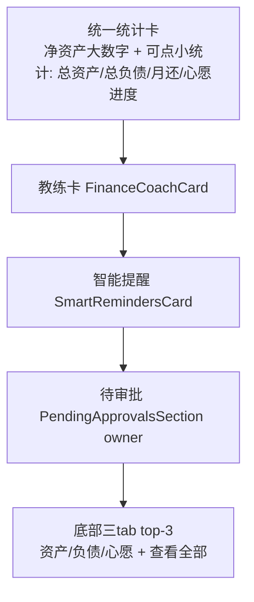
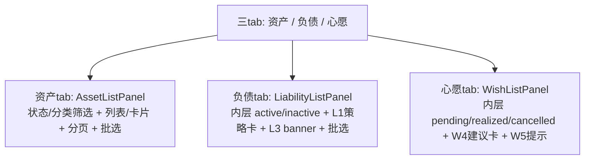
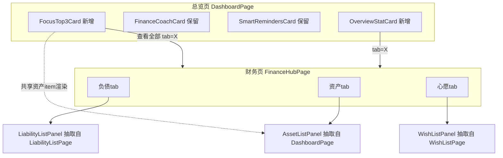
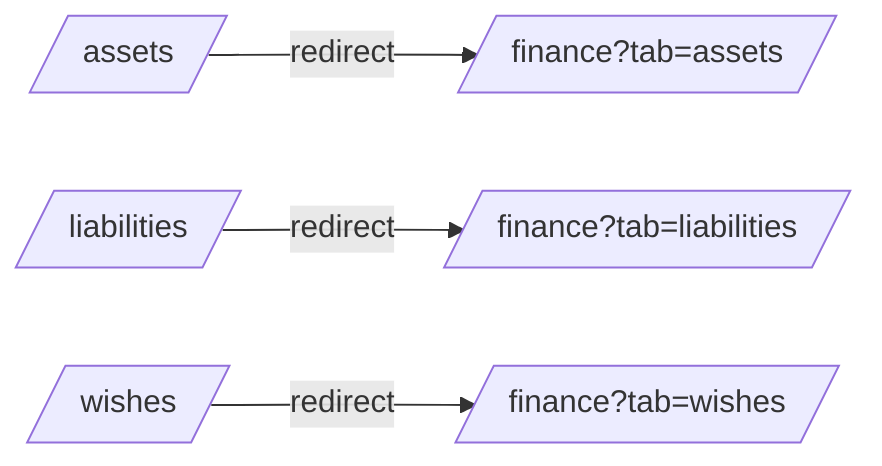

# 财务 Hub 与总览页交互重构 - Plan

## Goal Capsule

- **Objective:** 把总览页重塑为「一眼看清家庭状况」的纯仪表盘，并把财务页变为资产/负债/心愿完整列表的唯一入口，解决合并导航（6→5）后暴露的四个交互问题。
- **Product authority:** 总览页的目标是让用户一眼看清家庭状况；财务页的目标是承载完整的列表管理交互。两者职责不重叠。
- **Execution profile:** 前端 Vue 3 单 app（`frontend/apps/main`）重构；U1 功能对齐移植含一处后端改动（分页资产端点支持 search/sort/asset_type）。6 个实现单元，按依赖顺序执行。
- **Stop conditions:** 任何单元破坏了现有列表交互（状态筛选/批选/分页/内层 tab）或让旧深链 404，停下来重审范围。
- **Open blockers:** 无。

---

## Product Contract

> Product Contract preservation: changed R10/R17 — 计划期发现 R10（删 /wishes）与 R17（非 owner 保留心愿 tab）冲突，用户定夺非 owner 也走 `/finance?tab=wishes`，故非 owner tabbar 移除心愿 tab；R9「统计信息」明确不含 B1 教育奖励卡（留财务页）；新增内层 tab 保留决策。其余 R-ID 不变。

### Summary

把总览页改为纯仪表盘：顶部一张统一统计卡（净资产为大数字，下挂一排可点击的小统计，点击下钻到财务页对应 tab），随后是教练卡与智能提醒，底部新增三 tab 的「重点关注 top-3」组件。财务页去掉「查看全部」，在三个 tab 内直接嵌入完整列表（含全部交互），并删除独立的 `/assets` `/liabilities` `/wishes` 列表页。

### Problem Frame

0719–0722 的家庭财务优化把心愿/负债/资产从顶级 tab 合并进 `/finance`（导航 6→5，N1 落地）。合并后的交互暴露出四个问题。

财务页顶部有一组统计信息（净资产/总负债/月还/心愿进度），但它属于「看清家庭状况」的职责，放在财务页是错位的；且若直接搬到总览页，会与总览页已有的 NetWorthCard 堆叠成两个统计块，字号层级不一、信息散乱。财务页的子 tab 目前只有一行摘要加「查看全部」按钮，真正的列表在独立的 `/assets` `/liabilities` `/wishes` 页，用户要多跳一层才能看到列表。总览页的教练分析看似 AI 功能，容易让人以为该挪到 AI 页，但 AI 页已有 AI 资产报告，两者是不同能力。总览页底部目前是完整资产列表，与「仪表盘」定位不符，需要改为各域 top-3 的预览。

### Key Decisions

- **教练卡留在总览页，不挪到 AI 页。** (session-settled: user-directed — chosen over 移到AI页报告下 / 合并进报告: 教练卡是「主动诊断」入口，finance_coach 与 AI 资产报告是两个独立能力（不同端点、不同缓存、不同数据形状），不并置就不存在不一致风险，且不动后端。)
- **总览页纯仪表盘化，完整列表迁走。** (session-settled: user-directed — chosen over 保留完整列表 / 只加统计卡: 总览页目标是「一眼看清」，完整资产列表（状态/分类筛选+批选）迁到财务页，列表管理因此深一层。)
- **总览页顶部合并为单卡+可点小统计。** (session-settled: user-directed — chosen over NetWorth卡+独立概览条: 统一字号层级（1 大 + 4 小），避免两个统计块堆叠散乱；合并现有 NetWorthCard 与财务概览卡为一张卡。)
- **财务 tab 嵌入完整列表+全部交互。** (session-settled: user-directed — chosen over 列表+核心交互: 资产 tab 继承总览页迁来的完整列表交互（状态/分类筛选、列表/卡片切换、分页、批选），负债/心愿 tab 嵌入各自完整现有列表内容。)
- **删除独立列表页。** (session-settled: user-directed — chosen over 保留作深链入口: `/assets` `/liabilities` `/wishes` 列表页删除，财务页 tab 成为列表唯一入口，单一数据源；详情/新建/编辑页保留。)
- **top-3 各按关键指标选取。** (session-settled: user-directed — chosen over 统一按最近: 资产按价值最高、负债按利率最高（对齐 L1 雪崩排序）、心愿按最近目标日期/进度最落后，规则明确可计算，与现有排序逻辑一致。)
- **非 owner 也走财务 tab。** (session-settled: user-directed — chosen over 非owner保留/wishes: R10 删 /wishes 与 R17 保留非 owner 心愿 tab 冲突；非 owner 心愿 tab 路由改为 `/finance?tab=wishes`，故 tabbar 移除非 owner 心愿 tab，非 owner 降为 4 tab。)
- **财务页保留内层子 tab。** (session-settled: user-directed — chosen over 拍平筛选控件: 负债 tab 内保留 active/inactive 子 tab，心愿 tab 内保留 pending/realized/cancelled 子 tab，接受两级 tab 嵌套以保留全部现有功能。)

### Actors

- A1. 家庭 owner — 默认落在总览页，通过 tabbar 访问财务页；tabbar 5 tab（总览/财务/AI/宝宝/设置）。
- A2. 非 owner 成员 — tabbar 4 tab（总览/财务/AI/设置）；心愿经财务页心愿 tab 访问，不再有独立心愿 tab。

### Requirements

**总览页顶部统计卡**

- R1. 总览页顶部合并为一张统计卡：净资产为主大数字，下挂一排紧凑小统计（总资产、总负债、月还、心愿进度）。
- R2. 统一字号层级为「1 大 + 4 小」，不与现有 NetWorthCard 堆叠成两个独立统计块。
- R3. 每个小统计可点击，下钻到财务页对应 tab（总资产→`/finance?tab=assets`，总负债/月还→`/finance?tab=liabilities`，心愿进度→`/finance?tab=wishes`）。
- R4. 月还仍按现有规则标注「估算」tag（任一活跃负债缺 monthly_payment 时）。

**财务页列表**

- R5. 财务页三个 tab（资产/负债/心愿）去掉「查看全部」按钮，在 tab 内直接展示完整列表。
- R6. 资产 tab 复用总览页迁来的完整列表交互：状态筛选（全部/各状态）、分类筛选、列表/卡片切换、分页、批选。
- R7. 负债 tab 嵌入现有 LiabilityList 内容（含 L1 策略卡、L3 月度还款 banner、active/inactive 内层 tab、筛选/排序、批选）。
- R8. 心愿 tab 嵌入现有 WishList 内容（含 W4 建议卡、W5 提示、pending/realized/cancelled 内层 tab、排序）。
- R9. 财务页顶部不再展示家庭状况统计卡（净资产/总负债/月还/心愿进度归总览页）；B1 教育奖励专项统计卡保留在财务页。

**独立列表页与跳转**

- R10. 删除 `/assets`、`/liabilities`、`/wishes` 三个独立列表页；详情/新建/编辑路由保留。
- R11. 所有原先跳转到这三个列表页的入口改为指向 `/finance?tab=X`；旧路径 `/assets` `/liabilities` `/wishes` 重定向到对应 `/finance?tab=X`，不产生 404。

**总览页底部 top-3**

- R12. 总览页底部新增三 tab 组件（资产/负债/心愿），各展示「最重点关注」前 3 项。
- R13. top-3 选取规则：资产按价值最高，负债按利率最高，心愿按最近目标日期/进度最落后。
- R14. 每个 tab 底部有「查看全部」，点击跳到财务页对应 tab。
- R15. 总览页不再展示完整资产列表（含状态/分类筛选与批选）。

**教练卡与成员差异**

- R16. 教练卡（FinanceCoachCard）保留在总览页，AI 页不新增教练建议区块，后端 finance_coach 能力不变。
- R17. 非 owner tabbar 移除独立心愿 tab（心愿经财务页心愿 tab 访问），其余流程与 owner 一致。

### Key Flows

- F1. 总览页一眼看清 + 下钻
  - **Trigger:** A1 打开 app，落在总览页。
  - **Actors:** A1
  - **Steps:** 顶部统一统计卡展示净资产与小统计 → 用户点击「月还」→ 跳到 `/finance?tab=liabilities`。
  - **Covered by:** R1, R2, R3
- F2. 财务页直接管理列表
  - **Trigger:** A1 进入财务页。
  - **Actors:** A1
  - **Steps:** 财务页三 tab 直接展示完整列表 → 用户在资产 tab 用状态筛选 + 批选管理资产，无需跳「查看全部」。
  - **Covered by:** R5, R6, R7, R8
- F3. 总览页 top-3 预览 → 查看全部
  - **Trigger:** A1 在总览页滚到底部。
  - **Actors:** A1
  - **Steps:** 三 tab 各展示 top-3 → 点击某 tab 的「查看全部」→ 跳到财务页对应 tab 的完整列表。
  - **Covered by:** R12, R13, R14

### Visualizations

总览页目标布局（区域构成）：

财务页目标布局（区域构成）：

### Acceptance Examples

- AE1. 点击小统计下钻
  - **Covers R3.**
  - **Given** 总览页已加载统计卡，**When** 用户点击「心愿进度」小统计，**Then** 路由到 `/finance?tab=wishes` 且心愿 tab 为激活态。
- AE2. 财务页无查看全部
  - **Covers R5, R6.**
  - **Given** 用户在财务页资产 tab，**When** 列表渲染，**Then** 不出现「查看全部」按钮，且可直接进行状态筛选与批选。
- AE3. 旧列表入口重定向
  - **Covers R10, R11.**
  - **Given** 某入口原先跳转 `/assets`，**When** 用户触发该入口或直接访问 `/assets`，**Then** 到达 `/finance?tab=assets` 而非独立列表页或 404。
- AE4. 月还估算标注
  - **Covers R4.**
  - **Given** 任一活跃负债缺 monthly_payment，**When** 统计卡渲染月还，**Then** 月还旁显示「估算」tag。
- AE5. top-3 排序
  - **Covers R13.**
  - **Given** 总览页底部 top-3，**When** 负债 tab 渲染，**Then** 展示利率最高的前 3 项负债。
- AE6. 内层 tab 保留
  - **Covers R7, R8.**
  - **Given** 财务页负债 tab，**When** 渲染，**Then** 可见 active/inactive 内层 tab 且可切换；心愿 tab 同理可见 pending/realized/cancelled。

### Scope Boundaries

- 不合并 finance_coach 进 AI 资产报告后端 — 教练卡保持独立能力，留在总览页。
- 不改动详情/新建/编辑路由（`/assets/:id`、`/wishes/new` 等）— 仅删除三个列表页。
- 不改动 AI 页结构 — AI 页维持报告卡 + 智能体现状，不新增教练建议区块。
- 不拍平负债/心愿的内层子 tab — 接受两级嵌套。
- B1 教育奖励专项统计卡不迁移 — 保留在财务页（非家庭状况一眼看清范畴）。

### Dependencies / Assumptions

- 假设：资产列表交互（状态/分类筛选、批选、列表/卡片切换、分页）可从 `DashboardPage` 抽取为可复用 `AssetListPanel` 组件，迁入财务页资产 tab。
- 假设：`LiabilityListPage`/`WishListPage` 的列表内容可剥离页级包裹（nav-bar、页面级 pull-refresh）后作为可嵌入 panel 复用。
- 假设：所有跳转到 `/assets` `/liabilities` `/wishes` 的入口已全量梳理（见 Sources）。

### Outstanding Questions

**Deferred to Planning**

- 资产列表交互从总览页抽取为可复用组件的具体拆分方式（哪些进 `AssetListPanel`、哪些留在页面）— 实现时以不破坏现有交互为准。

**Resolved (2026-07-22 doc review)**

- **AssetListPage 功能集 reconcile → 移植搜索/排序/类型 tab（保持功能对齐）。** 被删的 `AssetListPage.vue` 具备文本搜索、排序下拉（current_value/purchase_date/name）、physical/financial 类型 tab、>100 项 RecycleScroller 虚拟滚动，基于 `useAssetStore`（完整 `AssetFilter`）。决策：**将这些能力移植进 `AssetListPanel`**，使财务页资产 tab 与被删页面功能对齐，不静默丢失。含义：panel 数据层需支持 search/sort/asset_type——扩展 dashboard 分页端点（`fetchAssetsPage` 增加 search/sort_by/sort_order/asset_type 参数，后端同步支持）或 panel 改用 `useAssetStore`；虚拟滚动在分页 van-list 模式下非必需（分页即懒加载），不移植。这引入后端改动（分页资产端点），见 Verification Contract。(session-settled: user-directed — chosen over 放弃功能/仅移植搜索： 保持与被删页面的功能对齐，避免静默回退用户已用的搜索/排序/类型筛选）

---

## Planning Contract

### Key Technical Decisions

- **KTD-1. 抽取 `AssetListPanel` 复用组件，并移植被删 AssetListPage 的搜索/排序/类型 tab 以保持功能对齐。** 资产列表交互集中在 `DashboardPage`（StatusSummaryGrid + 分类 nav + viewMode 切换 + van-list 分页 + 批选 + FAB），迁入财务页资产 tab 的最干净路径是抽成 `frontend/apps/main/src/components/asset/AssetListPanel.vue`（R15 后单消费者为财务页资产 tab）。**功能对齐**：被删的 `AssetListPage` 另有文本搜索、排序下拉、physical/financial 类型 tab（基于 `useAssetStore` 完整 `AssetFilter`），需移植进 panel——数据层扩展 dashboard 分页端点支持 search/sort_by/sort_order/asset_type（后端同步），或 panel 改用 `useAssetStore`；虚拟滚动不移植（分页 van-list 即懒加载）。详见 Outstanding Questions 已决项。
- **KTD-2. 负债/心愿列表抽成可嵌入 panel，剥离页级包裹。** `LiabilityListPage`/`WishListPage` 各含页级 nav-bar 与页面级 pull-refresh；抽出 `LiabilityListPanel.vue`/`WishListPanel.vue`（保留内层 tab、策略卡、banner、建议卡、批选），原页面变为薄壳（仅保留供重定向前过渡，最终随 U6 删除）。内层 tab 保留（见 Key Decisions）。
- **KTD-3. 统一统计卡新组件 `OverviewStatCard`，合并 NetWorthCard 与财务概览卡。** 净资产大数字 + 一排可点小统计（总资产/总负债/月还/心愿进度），每小统计为 router-link 到 `/finance?tab=X`。NetWorthCard 现有的 `/finance?tab=assets|liabilities` 下钻模式直接沿用（D3 已实现）。月还「估算」tag 逻辑从 FinanceHubPage 迁移。
- **KTD-4. top-3 组件 `FocusTop3Card`，只读预览。** 三 tab（资产/负债/心愿），各按 R13 规则取前 3，资产 item 渲染直接复用现有 `AssetListItem`/`AssetCard`（不经 KTD-1 的 panel），底部「查看全部」router-link 到 `/finance?tab=X`。无筛选/批选。
- **KTD-5. 旧列表路径用路由重定向，不硬 404。** 在 router 用 `redirect` 把 `/assets`→`/finance?tab=assets`、`/liabilities`→`/finance?tab=liabilities`、`/wishes`→`/finance?tab=wishes`，保留深链。详情/新建/编辑路由不动。
- **KTD-6. KeepAlive 与 tabbar 同步清理。** `MainLayout.cachedTabs` 移除 `AssetList/WishList/LiabilityList`（`FinanceHub` 已缓存）；`AppTabBar` 移除非 owner 心愿 tab，路径映射中 `/wishes` 一律归 `finance`。

### High-Level Technical Design

组件抽取与复用关系：

旧路由重定向：

### Assumptions

- 资产/负债/心愿列表的数据获取已在各自 store（dashboard/liability/wish）中，抽取 panel 不改 store 契约。
- 财务页资产 tab 的分页与批选依赖 dashboard store 的 `displayedAssets`/`assetListFinished`，抽取后仍在同一 store 上工作，不引入新数据源。

### Sequencing

U1（抽 AssetListPanel）→ U4（FinanceHubPage 嵌入资产 panel + 移除统计卡）→ U5（抽并嵌入负债/心愿 panel）→ U6（删三列表页 + 重定向 + KeepAlive/tabbar 清理）。U2（OverviewStatCard）与 U3（FocusTop3Card）与 U1 并行（二者均不依赖 U1：U3 直接复用现有 `AssetListItem`/`AssetCard`）。U6 依赖 U4/U5 完成（panel 就位后才能删旧页）。

---

## Implementation Units

### U1. 抽取 AssetListPanel 复用组件

- **Goal:** 把 DashboardPage 的资产列表交互块抽成独立可复用组件，供财务页资产 tab 使用。
- **Requirements:** R6, R15
- **Dependencies:** 无
- **Files:**
  - 创建 `frontend/apps/main/src/components/asset/AssetListPanel.vue`
  - 修改 `frontend/apps/main/src/pages/DashboardPage.vue`（移除资产列表块，改由 U3 的 top-3 取代；本单元先抽出组件，DashboardPage 暂保留引用直至 U3）
  - 创建 `frontend/apps/main/src/components/asset/__tests__/AssetListPanel.spec.ts`
- **Approach:** 将 StatusSummaryGrid + 分类 nav + viewMode 切换 + van-list 分页 + 批选模式 + FAB 相关逻辑从 DashboardPage 移入 AssetListPanel。状态（activeStatus/activeCategoryId/selectionMode/selectedIds 等）随组件走；数据仍读 dashboard store。FAB（import/add）保留在 panel 内。**功能对齐移植**：从被删 AssetListPage 移植文本搜索（van-search）、排序下拉（current_value/purchase_date/name）、physical/financial 类型 tab 进 panel；数据层扩展 dashboard 分页端点 `fetchAssetsPage` 支持 search/sort_by/sort_order/asset_type（后端分页资产端点同步支持这些 filter），或改用 `useAssetStore`——实现时二选一，以不破坏分页为准。虚拟滚动不移植（分页即懒加载）。
- **Patterns to follow:** 现有 `DashboardPage` 资产列表块（第 44–273 行区域）为迁移源；`LiabilityListPage` 的批选 bar 为批选交互参考；`AssetListPage` 的 van-search/排序下拉/类型 tab 为搜索/排序/类型 UI 参考。
- **Test scenarios:**
  - 状态筛选：选某状态 → 列表仅显示该状态资产（backend 已过滤，断言 store 调用参数）。
  - 分类筛选：选某分类 → `activeCategoryId` 更新且列表刷新。
  - 文本搜索：输入关键词 → store 以 search 参数重新拉取，列表过滤。
  - 排序：切换 sort_by（value/date/name）→ store 以对应 sort 参数拉取。
  - 类型 tab：切换 physical/financial/all → store 以对应 asset_type 拉取。
  - viewMode 切换：list↔card 切换渲染对应 item 组件。
  - 分页：`onLoadMore` 触发时 store 拉下一页，`assetListFinished` 为 true 时显示 finished 文案。
  - 批选：进入批选 → 全选/单选/批量删除流程；`selectedIds` 正确维护。
  - 边界：无资产时显示空态且不闪烁（gate 在 assetListLoading）。
- **Verification:** AssetListPanel.spec 通过；DashboardPage 引用该 panel 后现有 dashboard 相关测试不回归。

### U2. 总览页统一统计卡 OverviewStatCard

- **Goal:** 总览页顶部用一张可点击统计卡取代 NetWorthCard + 财务概览卡。
- **Requirements:** R1, R2, R3, R4
- **Dependencies:** 无（与 U1 并行）
- **Files:**
  - 创建 `frontend/apps/main/src/components/dashboard/OverviewStatCard.vue`
  - 修改 `frontend/apps/main/src/pages/DashboardPage.vue`（用 OverviewStatCard 替换 NetWorthCard；`PendingApprovalsSection`（owner）与其余总览区块保留不变）
  - 创建 `frontend/apps/main/src/components/dashboard/__tests__/OverviewStatCard.spec.ts`
- **Approach:** 净资产大数字 + 一排小统计（总资产/总负债/月还/心愿进度），每小统计为 router-link 到 `/finance?tab=X`。月还「估算」tag 逻辑（任一活跃负债缺 monthly_payment）从 FinanceHubPage 迁入。心愿进度 = sum(saved)/sum(expected) + count。数据读 dashboard/liability/wish store。**加载/错误态**：本卡首次把 liability/wish 数据引入总览页（DashboardPage 当前不消费 liabilityStore/wishStore）——(a) 任一 store 加载中且无基线值时渲染骨架/占位（沿用 `DashboardSkeleton` 模式），不渲染 0 值；(b) liability 或 wish fetch 失败时，受影响的小统计显示不可用/重试 affordance（镜像 `FinanceHubPage` 的 `overviewError` 重试），不静默渲染 0；明确单域失败只降级该小统计而非整卡。
- **Patterns to follow:** `NetWorthCard` 现有 `/finance?tab=X` router-link 下钻；`FinanceHubPage` 的 monthlyPaymentTotal/monthlyPaymentIsEstimate/wishProgressPercent 计算与 `overviewError` 重试；`DashboardSkeleton` 骨架。
- **Test scenarios:**
  - Covers AE1. 点击「心愿进度」→ router push `/finance?tab=wishes`；点击「月还」→ `/finance?tab=liabilities`。
  - Covers AE4. 任一活跃负债缺 monthly_payment → 月还旁显示「估算」tag；全部有则不显示。
  - 心愿进度百分比 = saved/expected 取整且 cap 100；expected 为 0 时显示 0。
  - 净资产/总资产/总负债渲染 MoneyDisplay 且净资产为 large 尺寸。
  - 加载态：liability/wish store 加载中 → 对应小统计显示骨架/占位而非 0。
  - 错误态：liability 或 wish fetch 失败 → 该小统计显示重试 affordance，不静默渲染 0；单域失败不影响其他小统计。
- **Verification:** OverviewStatCard.spec 通过；DashboardPage 不再渲染 NetWorthCard。

### U3. 总览页底部 FocusTop3Card

- **Goal:** 总览页底部新增三 tab top-3 预览组件，替换原完整资产列表。
- **Requirements:** R12, R13, R14, R15
- **Dependencies:** 无（与 U1 并行；资产 item 渲染直接复用现有 `AssetListItem`/`AssetCard`，不经 U1 抽取的 panel）
- **Files:**
  - 创建 `frontend/apps/main/src/components/dashboard/FocusTop3Card.vue`
  - 修改 `frontend/apps/main/src/pages/DashboardPage.vue`（移除完整资产列表块与筛选/批选，挂 FocusTop3Card；保留 `PendingApprovalsSection`（owner）不变）
  - 创建 `frontend/apps/main/src/components/dashboard/__tests__/FocusTop3Card.spec.ts`
- **Approach:** 三 tab（资产/负债/心愿），各按 R13 取前 3：资产按价值降序、负债按利率降序、心愿按 target_date 升序/进度落后（**无 target_date 的心愿排除出 top-3**——它们不可能「最落后」，剩余按进度落后排序）。每 tab 底部「查看全部」router-link 到 `/finance?tab=X`。只读，无筛选/批选。资产 item 渲染直接复用现有 `AssetListItem`/`AssetCard` 组件。**数据源**：三域读 dashboard/liability/wish store，DashboardPage 需在 mount 时触发 liability/wish fetch（当前仅 asset/dashboard）。**加载/错误态**：三域独立加载——(a) 每 tab 在对应 store 加载中显示骨架/占位（沿用 `LiabilityListSkeleton`/`WishListSkeleton` 模式、减少行数）；(b) 某域 fetch 失败时该 tab 内联重试，不显示空列表（使「fetch 失败」与「家庭无此域数据」可区分）。
- **Patterns to follow:** `FinanceHubPage` 的 sub-tab 结构；`AssetListItem`/`LiabilityCard`/心愿卡为 item 渲染参考；`LiabilityListSkeleton`/`WishListSkeleton` 骨架。
- **Test scenarios:**
  - Covers AE5. 负债 tab 展示利率最高前 3；资产 tab 展示价值最高前 3。
  - 心愿 tab 按最近 target_date 排序取前 3；无 target_date 的心愿排除出 top-3。
  - Covers R14. 点击「查看全部」→ router push 对应 `/finance?tab=X`。
  - 边界：某域不足 3 项时全显示；为 0 项时显示空态。
  - 加载态：某域 store 加载中 → 该 tab 显示骨架/占位。
  - 错误态：某域 fetch 失败 → 该 tab 显示内联重试而非空列表。
- **Verification:** FocusTop3Card.spec 通过；DashboardPage 不再含完整资产列表/筛选/批选。

### U4. 财务页嵌入资产 panel + 移除统计卡

- **Goal:** 财务页移除顶部统计卡与「查看全部」，资产 tab 嵌入 AssetListPanel。
- **Requirements:** R5, R6, R9
- **Dependencies:** U1
- **Files:**
  - 修改 `frontend/apps/main/src/pages/FinanceHubPage.vue`
  - 修改 `frontend/apps/main/src/pages/__tests__/FinanceHubPage.spec.ts`
- **Approach:** 删除顶部 overview 卡（净资产/总负债/月还/心愿进度，已迁 U2）与三个 sub-tab 的「摘要+查看全部」。保留 B1 教育奖励卡（R9）。资产 tab 内容改为 `<AssetListPanel />`。`?tab=` 预选契约保留。（W5 debt hint 及其跨模块链接由 U5 负责，不在本单元。）
- **Patterns to follow:** 现有 FinanceHubPage 的 `applyQueryTab`/activeTab 逻辑保留。
- **Test scenarios:**
  - Covers AE2. 资产 tab 渲染 AssetListPanel，无「查看全部」按钮，可状态筛选+批选。
  - `?tab=assets|liabilities|wishes` 预选对应 tab（保留现有契约）。
  - 顶部不再渲染净资产/总负债/月还/心愿进度统计卡；教育奖励卡仍渲染。
- **Verification:** FinanceHubPage.spec 更新后通过；移除针对 view-all 按钮的旧断言。

### U5. 抽取并嵌入负债/心愿 panel

- **Goal:** 负债/心愿列表抽成 panel 并嵌入财务页对应 tab，保留内层 tab 与全部功能。
- **Requirements:** R5, R7, R8
- **Dependencies:** U1（模式参考）；U4（FinanceHubPage 资产 panel 就位后再改负债/心愿 tab，与 Sequencing 的 U4→U5 一致）
- **Files:**
  - 创建 `frontend/apps/main/src/components/liability/LiabilityListPanel.vue`
  - 创建 `frontend/apps/main/src/components/wishes/WishListPanel.vue`
  - 修改 `frontend/apps/main/src/pages/FinanceHubPage.vue`（负债/心愿 tab 嵌入 panel）
  - 修改 `frontend/apps/main/src/pages/LiabilityListPage.vue`、`frontend/apps/main/src/pages/WishListPage.vue`（抽走内容变薄壳，U6 删除）
  - 创建 `frontend/apps/main/src/components/liability/__tests__/LiabilityListPanel.spec.ts`、`frontend/apps/main/src/components/wishes/__tests__/WishListPanel.spec.ts`
- **Approach:** LiabilityListPanel 保留 active/inactive 内层 tab、LiabilityStrategyCard（L1）、L3 月度 banner、筛选/排序、批选 bar；WishListPanel 保留 pending/realized/cancelled 内层 tab、W4 WishAdviceCard、W5 提示、排序。剥离页级 nav-bar 与页面级 pull-refresh（财务页已有 pull-refresh）。**W5 debt hint 及其跨模块链接归本单元全权负责**（U4 不再涉及）：W5 链接改为 `/finance?tab=liabilities&focus=liability_strategy`（保留 `focus` 参数），并把 `?focus=liability_strategy` 的 scroll-into-view 逻辑从被删的 `LiabilityListPage` 迁入 `LiabilityListPanel`（或 FinanceHubPage），使带 focus 时滚动到 L1 策略卡。
- **Patterns to follow:** 现有 LiabilityListPage/WishListPage 全部列表逻辑为迁移源；`LiabilityListPage` 的 `?focus=liability_strategy` scroll-into-view 处理。
- **Test scenarios:**
  - Covers AE6. 负债 tab 可见 active/inactive 内层 tab 且可切换；心愿 tab 可见 pending/realized/cancelled 且可切换。
  - 负债 L1 策略卡在 ≥2 活跃负债时渲染；L3 月度 banner 在 active tab 且总额>0 时渲染。
  - 心愿 W4 建议卡与 W5 提示按现有规则渲染/隐藏。
  - 负债/心愿批选与排序交互不回归。
  - W5 深链：访问 `/finance?tab=liabilities&focus=liability_strategy` → 滚动到 L1 策略卡。
- **Verification:** 两个 panel spec 通过；财务页三 tab 均嵌入完整列表。

### U6. 删除三列表页 + 重定向 + KeepAlive/tabbar 清理

- **Goal:** 删除独立列表页，旧路径重定向到财务 tab，清理 KeepAlive 与 tabbar。
- **Requirements:** R10, R11, R17
- **Dependencies:** U4, U5
- **Files:**
  - 删除 `frontend/apps/main/src/pages/AssetListPage.vue`、`frontend/apps/main/src/pages/LiabilityListPage.vue`、`frontend/apps/main/src/pages/WishListPage.vue`
  - 修改 `frontend/apps/main/src/router/index.ts`（三列表路由改 redirect 到 `/finance?tab=X`）
  - 修改 `frontend/apps/main/src/layouts/MainLayout.vue`（cachedTabs 移除 AssetList/WishList/LiabilityList）
  - 修改 `frontend/apps/main/src/components/common/AppTabBar.vue`（移除非 owner 心愿 tab；/wishes 路径归 finance）
  - 修改 `frontend/apps/main/src/pages/AssetSellPage.vue`（卖出后 `/assets`→`/finance?tab=assets`）
  - 修改相关测试（router/tabbar/sell page）
- **Approach:** router 用 `redirect` 把 `/assets`→`/finance?tab=assets`、`/liabilities`→`/finance?tab=liabilities`、`/wishes`→`/finance?tab=wishes`。详情/新建/编辑路由保留。tabbar 非 owner 心愿 tab 移除，非 owner 降为 4 tab。全仓 grep `/assets` `/liabilities` `/wishes` 字面路由跳转，逐一改 `/finance?tab=X`（api/*.ts 的 HTTP 端点不动）。
- **Patterns to follow:** 现有 router redirect 写法；AppTabBar 的 activeTab 路径映射。
- **Test scenarios:**
  - Covers AE3. 访问 `/assets` → 重定向 `/finance?tab=assets`；`/wishes`→`/finance?tab=wishes`；`/liabilities`→`/finance?tab=liabilities`。
  - 详情/新建/编辑路由（`/assets/:id`、`/wishes/new` 等）仍可访问，不受 redirect 影响。
  - 非 owner tabbar 渲染 4 tab 且无心愿 tab；owner 5 tab 不变。
  - tabbar 在 `/finance`、`/assets/:id`、`/wishes/:id` 路径下高亮 finance。
  - AssetSellPage 卖出后跳转 `/finance?tab=assets`。
- **Verification:** router/tabbar 测试通过；`pnpm typecheck` 与 `pnpm test:run` 全绿；手动确认无残留指向三列表页的跳转。

---

## Verification Contract

在 `frontend/apps/main` 下执行：

- `pnpm typecheck` — vue-tsc 无错误。
- `pnpm test:run` — vitest 全绿（含新增 AssetListPanel/OverviewStatCard/FocusTop3Card/LiabilityListPanel/WishListPanel spec 与更新的 FinanceHubPage/router/tabbar spec）。
- `pnpm lint` — 无新增 lint 错误。
- i18n 检查：所有新 UI 文案（统计卡标签、top-3 tab、查看全部）在 `src/i18n/locales/zh-CN.ts` 与 `en-US.ts` 均有 key，无硬编码中文。

无后端改动（除 U1 功能对齐移植需扩展分页资产端点支持 search/sort_by/sort_order/asset_type——若采此方案，后端需 `uv run pytest apps/backend/tests/ -k asset` 与 `ruff check` 验证；前端 `assetApi.getAssets`/dashboard store 相应调整）。其余不需 mypy/alembic。

---

## Definition of Done

- 总览页为纯仪表盘：顶部 OverviewStatCard（可点击下钻）+ 教练卡 + 智能提醒 + 待审批（owner）+ FocusTop3Card；无完整资产列表。
- 财务页三 tab 各嵌入完整列表（资产含筛选/批选/分页；负债含内层 tab/L1/L3/批选；心愿含内层 tab/W4/W5/排序），无「查看全部」按钮，顶部无家庭状况统计卡（教育奖励卡保留）。
- `/assets` `/liabilities` `/wishes` 重定向到对应 `/finance?tab=X`，无 404；详情/新建/编辑路由正常。
- 非 owner tabbar 4 tab（无心愿 tab），owner 5 tab；tabbar 高亮规则正确。
- MainLayout cachedTabs 移除三个列表页组件名。
- 所有 Verification Contract 命令通过。
- R16（无改动项）已确认：教练卡 FinanceCoachCard 仍在总览页，AI 页未新增教练建议区块，后端 finance_coach 能力未变 — 本重构不触碰，仅验证其 CTA 目标（详情页）仍可达。
- 清理：被抽取后留下的死代码（DashboardPage 旧资产列表逻辑、三列表页薄壳、FinanceHubPage 旧统计卡与 view-all 逻辑）已删除，无遗留未用 import/变量。
