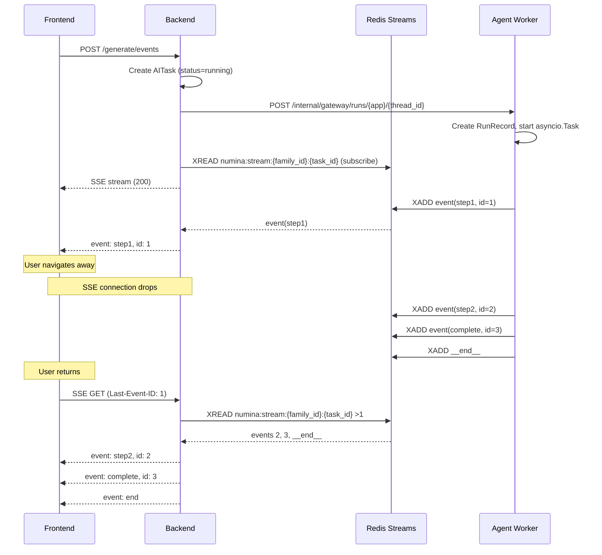
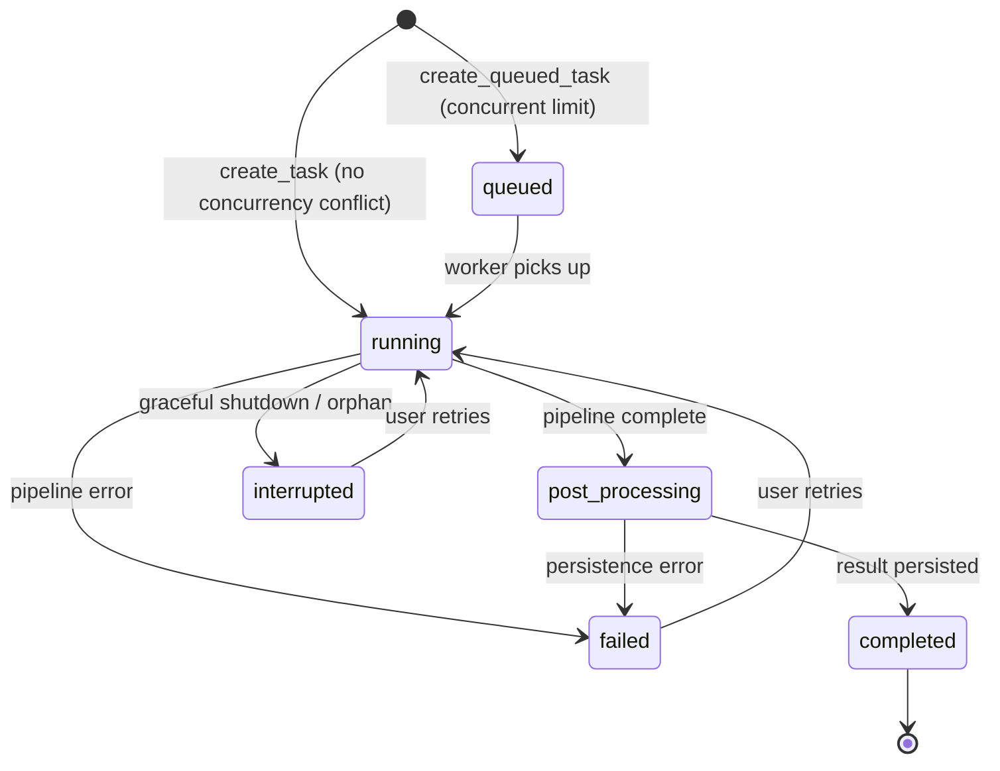

# AI Task Resilience via StreamBridge - Plan

## Goal Capsule

**Objective:** Decouple all AI feature execution from frontend SSE connectivity. Long-running AI tasks (reports, imports, chat, finance coach, literacy reports, future agents) continue processing server-side regardless of frontend state. Frontend reconnects to see latest progress via buffered event replay.

**Product authority:** All AI features follow a single "task execution + event subscription" model. The frontend is a bypass subscriber — task state lives in DB, events buffer in Redis Streams, SSE is a real-time notification channel on top.

**Open blockers:**
- Redis availability in production deployment (currently Docker-only)
- Agent crash recovery: if agent process dies mid-task, how to detect and mark task as failed
- Existing `_watch_report_task_completion` polling pattern becomes obsolete — needs migration path

### Current State (what already exists)

The agent layer already has partial DeerFlow alignment:
- `sse_gateway.py` — ported from DeerFlow: `sse_consumer`, `start_run`, `format_sse`, `RunManager`, `MemoryStreamBridge`
- `gc.py` — `drain_inflight_runs` (5s bounded drain) + `reconcile_orphaned_runs` (no-op until RunStore wired)
- `useThreadChat.ts` — captures `run_id` from metadata event, but only uses it for cancel

**Gaps to fill:**
- `sse_consumer` lacks `StreamGap` handling and `_terminal_record_stream_missing` probe
- AITask has no `run_id` / `thread_id` — frontend cannot re-attach to in-flight tasks
- All non-report callers default to `on_disconnect="cancel"` — agent cancels on frontend disconnect
- Frontend SSE consumers (`useReportStream`, `useLiteracyStream`, `getFinanceCoach`) use raw `fetch`+`TextDecoder` with no `Last-Event-ID`, no run_id capture for reconnection
- Backend proxies agent SSE directly — no bridge layer between backend and frontend
- `reconcile_orphaned_runs` is wired but no-op (no persistent RunStore)

---

## Product Contract

### Requirements

#### R1: StreamBridge Abstraction

A `StreamBridge` interface decouples agent workers (event producers) from SSE endpoints (event consumers). **The agent layer already has `MemoryStreamBridge` + `sse_consumer` + `start_run` ported from DeerFlow** (`sse_gateway.py`). The work is to:

1. **Add `RedisStreamBridge`** — Redis Streams backend for cross-process, multi-worker Docker deployment
2. **Add `StreamGap` handling** to `sse_consumer` — when cursor is beyond retained buffer, emit gap event with recovery instructions
3. **Add backend-level bridge** — the backend proxy currently forwards agent SSE bytes directly; it should subscribe to a bridge so events survive backend↔agent connection drops
4. **Make bridge type configurable** — `stream_bridge.type: memory | redis` via config

Two implementations:

- **MemoryStreamBridge**: In-process asyncio queue. Single-worker deployment. No external dependency.
- **RedisStreamBridge**: Redis Streams per task. Multi-worker Docker deployment. Cross-process reconnection.

The bridge is selected via config (`stream_bridge.type: memory | redis`). Memory bridge is the development default; Redis bridge is the production default.

**DeerFlow reference:** `deerflow/runtime/stream_bridge/base.py` — abstract `StreamBridge` with `publish()`, `publish_end()`, `subscribe(last_event_id)`, `cleanup()`.

#### R2: Unified Task Lifecycle

Every AI feature creates a task record before starting execution. The task record tracks:

| Field | Purpose |
|-------|---------|
| `task_id` | Unique identifier |
| `family_id` | Tenant isolation |
| `skill_id` | Feature type (report, import, chat, coach, literacy, agent-*) |
| `status` | queued → running → post_processing → completed / failed / cancelled / interrupted / timeout |

Full target status enum: `queued | running | post_processing | completed | failed | cancelled | interrupted | timeout`. The existing `timeout` status (auto-timeout after 30 min in `get_running_task`) is retained for backward compatibility. New `interrupted` status is added for graceful shutdown and orphan recovery cases.
| `session_id` | Linked AIChatSession (thread_id) |
| `worker_id` | hostname:uuid of the processing worker |
| `lease_expires_at` | Heartbeat deadline for dead-worker detection |
| `progress` | Optional JSON blob (step, percentage, message) |
| `result_ref` | Optional pointer to result (report_id, import_batch_id, etc.) |

The existing `AITask` model (`server/packages/db/models/ai_task.py`) extends to support all skill_ids. Currently only `report` and `import` use AITask; chat, coach, literacy, and agents add to the same table. **New fields to add:** `run_id` (agent RunRecord ID for bridge reconnection), `worker_id` (hostname:uuid), `lease_expires_at` (heartbeat deadline). Existing fields `status`, `family_id`, `skill_id`, `session_id` are retained.

**DeerFlow reference:** `deerflow/runtime/runs/manager.py` — `RunManager` with `create()`, `set_status()`, `cancel()`, `shutdown()`.

#### R3: SSE Event Replay (Last-Event-ID)

SSE endpoints subscribe to the StreamBridge with `last_event_id` from the client's `Last-Event-ID` request header. The bridge replays buffered events from that cursor. If the cursor is beyond the retained buffer (events lost), the endpoint emits a `gap` event with recovery instructions.

Frontend SSE consumers send `Last-Event-ID` on reconnection. The EventSource API provides this automatically via `event.lastEventId`.

**Gap recovery:** When a gap is detected, the frontend reloads durable state from the task's checkpoint/result in DB and resumes SSE from the current tail.

**DeerFlow reference:** `deerflow/runtime/stream_bridge/redis.py` — `XREAD` with `Last-Event-ID` cursor; `StreamGap` dataclass for overflow.

#### R4: Per-Feature Task Resume on Page Load

Each AI feature page checks for an existing task on mount:

| Feature | Route | Resume Behavior |
|---------|-------|-----------------|
| Asset Report | `/ai/report` | Check `GET /api/ai/tasks?skill=report&status=running`. If found, reconnect SSE. If completed, load result. |
| Bill Import | `/finance/import` | Check recent import tasks. Show progress indicator in "近期任务". Click enters task detail view. |
| Finance Coach | `/dashboard` (card) | Check `GET /api/ai/tasks?skill=coach&status=running`. If found, reconnect SSE or poll for result. |
| Literacy Report | `/baby/...` (card) | Same pattern as coach. |
| AI Chat | `/ai/chat` | Session already persists via checkpoints. On page load, load thread history. If a run is in-progress, reconnect SSE to receive remaining events. |
| Custom Agents | `/ai/agent/{id}` | Same as chat — task-scoped reconnection. |

**Frontend composable:** `useTaskResume(skill_id)` — generic hook that queries running tasks and reconnects SSE. Each feature page calls this on mount.

#### R5: Graceful Shutdown

On SIGTERM (deployment, scaling):

1. **Phase 1 — Stop accepting (immediate):** Set a process-wide flag `shutting_down = True`. New task creation requests return `503 Service Unavailable` with `Retry-After` header.
2. **Phase 2 — Drain in-flight (bounded wait):** Wait up to `shutdown_timeout` seconds (configurable, default 60s) for in-flight tasks to complete. During drain:
   - Running agent pipelines continue execution
   - SSE connections to current clients remain open
   - No new tasks are accepted
3. **Phase 3 — Force cancel (timeout):** Cancel remaining in-flight tasks. Mark them as `interrupted` with a recovery hint. On next gateway start, orphan recovery detects these and marks them appropriately.

**DeerFlow reference:** `deerflow/runtime/runs/manager.py` `shutdown(timeout=...)` — cancels and bounded-awaits every in-flight run BEFORE the checkpointer pool closes.

#### R6: Tenant Isolation

All task data is scoped by `family_id`:
- Redis Streams keys: `numina:stream:{family_id}:{task_id}` (family_id for defense-in-depth)
- DB queries: `WHERE family_id = :family_id` always present
- SSE endpoints: authenticated via existing family-scoped JWT/cookie

No cross-tenant data leakage through the stream bridge.

#### R7: Orphan Recovery on Startup

On gateway startup, detect tasks that were `running` but whose `worker_id` is no longer active (worker died, deployment rolled). Mark these as `interrupted` with error message "服务重启，任务中断，请重试". Frontend surfaces this as a recoverable failure with a "retry" button.

**Note:** `gc.py` already has `reconcile_orphaned_runs(run_manager, error)` stub — currently a no-op because no persistent RunStore is wired. This work wires it up by adding AITask-backed RunStore persistence.

**DeerFlow reference:** `RunManager.reconcile_orphaned_inflight_runs()` — startup recovery for stale persisted runs.

### Flows

#### Flow 1: Normal Task Execution (happy path)

```
Frontend                    Backend                      Agent Worker
   |                           |                              |
   |-- POST /tasks ------------>|                              |
   |                           |-- create task (DB) ---------->|
   |                           |-- start agent asyncio.task -->|
   |<-- SSE stream (200) ------|                              |
   |                           |   agent publishes events -->  |
   |                           |   to StreamBridge             |
   |<-- event: step1 --------- |<-- bridge.subscribe() ------ |
   |<-- event: step2 --------- |                              |
   |<-- event: complete ------ |<-- bridge.publish_end() ---- |
   |   (SSE end frame)         |   task → completed (DB)      |
```

#### Flow 2: Frontend Disconnect + Reconnect

```
Frontend                    Backend                      Agent Worker
   |                           |                              |
   |<-- event: step1 --------- |<-- bridge.publish() -------- |
   |   (user navigates away)   |                              |
   |   SSE connection drops    |   agent CONTINUES running    |
   |                           |   events buffered in Redis   |
   |   (user returns)          |                              |
   |-- SSE Last-Event-ID: 42 ->|                              |
   |                           |-- bridge.subscribe(          |
   |<-- event: step2 (replay) -|     last_event_id="42")      |
   |<-- event: complete ------ |                              |
```

#### Flow 3: Graceful Shutdown

```
SIGTERM → Backend
   |
   |-- shutting_down = True
   |-- reject new POST /tasks → 503
   |-- wait up to 60s for in-flight tasks
   |      (agent pipelines continue, SSE stays open)
   |-- timeout → cancel remaining tasks → mark "interrupted"
   |-- drain StreamBridge (publish_end for all active runs)
   |-- exit process
```

#### Flow 4: Orphan Recovery

```
Gateway startup
   |
   |-- query tasks WHERE status = 'running'
   |-- check worker_id heartbeat / lease
   |-- stale → mark "interrupted" ("服务重启，请重试")
   |-- frontend on next page load:
   |      sees "interrupted" task → shows retry button
```

### Acceptance Examples

#### AE1: Asset Report — leave and return

1. User clicks "生成报告" on AIReportPage
2. Task created, SSE stream starts, progress shown (step 1/2/3)
3. User navigates to Settings page (SSE disconnects)
4. Agent continues generating (evidence: Redis stream has events)
5. User returns to AIReportPage after 30s
6. Page detects running task → reconnects SSE with Last-Event-ID → shows current step
7. Report completes → page shows result

#### AE2: Bill Import — task list

1. User uploads CSV on import page
2. Import task created, status "running"
3. User navigates away
4. User returns to import page later
5. "近期任务" section shows the import task with status indicator (spinning if running, checkmark if done)
6. Click task → enters task detail view (same as if they had waited)

#### AE3: Finance Coach — page revisit

1. User opens Dashboard, FinanceCoachCard triggers advice generation
2. Task created, SSE stream starts
3. User navigates to another tab, returns after 1 minute
4. Dashboard re-mounts → `useTaskResume('coach')` detects running/completed task
5. If completed: shows cached advice (existing behavior)
6. If still running: reconnects SSE, shows loading indicator with current step

#### AE4: Graceful shutdown during report generation

1. Report generation in progress (step 2 of 3)
2. Deploy triggers SIGTERM
3. Backend stops accepting new tasks
4. Agent pipeline continues for up to 60s
5. If report completes within 60s → task marked "completed", user sees result on next visit
6. If not → task marked "interrupted", user sees "服务重启，请重试" with retry button

#### AE5: AI Chat — agent crash recovery

1. User in AI chat conversation
2. Agent sends a message (tool call in progress)
3. Agent process crashes
4. On next user message, gateway detects orphaned run → marks interrupted
5. Chat shows error "智能体暂时不可用，请重试" with retry option
6. Conversation history preserved (checkpoints in DB)

### Key Decisions

| # | Decision | Rationale |
|---|----------|-----------|
| KTD-1 | Redis Streams for event buffering (not DB table) | Matches DeerFlow pattern, real-time via XREAD BLOCK, no DB write pressure, built-in TTL cleanup. Redis already in Docker stack. |
| KTD-2 | MemoryStreamBridge as dev default | Local dev without Redis still works. Single-process only — acceptable for development. |
| KTD-3 | Extend existing AITask model (not new table) | Avoids schema duplication. AITask already has family_id, skill_id, status, session_id. Add worker_id, lease_expires_at, progress fields. |
| KTD-4 | All AI features use unified task layer | User requirement: "前端作为旁路". Every AI interaction creates a task record. SSE is a subscription, not the execution channel. |
| KTD-5 | Graceful shutdown timeout = 60s (configurable) | User specified 1 minute. Most AI tasks should complete or reach a safe checkpoint within 60s. |
| KTD-6 | AI Chat uses task layer too | Currently chat is direct SSE. Unified model means chat runs are also tracked, can be recovered after agent crash, and support reconnection. |
| KTD-7 | Frontend `useTaskResume` composable | Generic hook per feature. Checks running task → reconnects SSE or loads result. Avoids duplicating resume logic per page. |

### Outstanding Questions

| # | Question | Impact | Deferred To |
|---|----------|--------|-------------|
| OQ-1 | Should finance coach and literacy report results be cached with TTL (like reports)? | Affects whether revisit always triggers new generation or uses cached result. | Planning |
| OQ-2 | Should the StreamBridge be in `packages/core` (shared) or `apps/agent` (agent-owned)? | Affects whether backend directly publishes or goes through agent. | Planning |
| OQ-3 | How to handle the migration of existing `_watch_report_task_completion` polling? | Current report watcher becomes unnecessary with StreamBridge. Remove or keep as fallback? | Planning |
| OQ-4 | Should custom user-built agents use the same AITask table or a separate `user_tasks` table? | Schema design for future multi-tenant agent support. | Planning |
| OQ-5 | Redis key namespace: `numina:stream_bridge:{family_id}:{task_id}` or flat `{task_id}`? | Cross-tenant safety vs key simplicity. family_id prefix adds safety but longer keys. | Planning |
| OQ-6 | What happens to in-flight SSE events when the agent worker restarts but the backend gateway stays up? | Worker crash vs full deployment. May need worker-level graceful shutdown separate from gateway. | Planning |

### How This Work Fits Together

This plan addresses the **infrastructure layer** for AI task resilience. It is a prerequisite for per-feature UX improvements but does not itself redesign any feature's UI.

**Depends on:**
- Existing AITask service (`ai_task_service.py`) — extended, not replaced
- Existing agent worker (`worker.py`) — modified to publish via StreamBridge
- Redis in Docker deployment — already available

**Enables:**
- Per-feature resume UX (task list on import page, coach card reconnection, chat recovery)
- Graceful deployment without user-visible interruption
- Future: user-built agents with same task lifecycle
- Future: multi-worker agent deployment (RedisStreamBridge supports cross-process)

**Not in scope (separate brainstorms):**
- AI chat UX redesign (separate from task resilience)
- Agent skill system changes
- New AI feature development
- Redis infrastructure setup (assumed to exist in Docker)

---

## Planning Contract

### Key Technical Decisions

KTD-1. **Redis Streams for event buffering** (Governs R1, R3). Matches DeerFlow pattern, real-time via `XREAD BLOCK`, no DB write pressure, built-in TTL cleanup. Redis already in Docker stack.

KTD-2. **MemoryStreamBridge as dev default** (Governs R1). Local dev without Redis still works. Single-process only — acceptable for development.

KTD-3. **Extend existing AITask model** (Governs R2). Avoids schema duplication. AITask already has family_id, skill_id, status, session_id. Add run_id, worker_id, lease_expires_at fields.

KTD-4. **All AI features use unified task layer** (Governs R2, R4, R6). User requirement: "前端作为旁路". Every AI interaction creates a task record. SSE is a subscription, not the execution channel.

KTD-5. **Graceful shutdown timeout = 60s** (Governs R5). User specified 1 minute. Most AI tasks should complete or reach a safe checkpoint within 60s.

KTD-6. **AI Chat uses task layer too** (Governs R2, R4). Currently chat is direct SSE. Unified model means chat runs are also tracked, can be recovered after agent crash, and support reconnection.

KTD-7. **Frontend `useTaskResume` composable** (Governs R4). Generic hook per feature. Checks running task → reconnects SSE or loads result. Avoids duplicating resume logic per page.

KTD-8. **StreamBridge stays agent-owned** (Governs R1, resolves OQ-2). The bridge lives in `server/apps/agent/services/runtime/stream_bridge/`. Backend subscribes via shared Redis — both containers connect to the same Redis instance, backend reads from streams the agent writes to. No shared Python module needed; Redis is the contract.

KTD-9. **Redis key namespace includes family_id** (Governs R6, resolves OQ-5). Keys: `numina:stream:{family_id}:{task_id}`. While Snowflake task IDs are globally unique, including family_id provides defense-in-depth tenant isolation at the Redis level — consistent with the MCP caller-bound principal pattern and `sandbox_family_id` ContextVar convention. This prevents any possibility of cross-tenant data leakage via Redis key collision or misrouting.

KTD-13. **Redis added to docker-compose.yml** (prerequisite). Redis is NOT currently in the Docker stack despite `redis>=5.0.0` being in pyproject.toml. A `redis:7-alpine` service must be added to docker-compose.yml with `REDIS_URL` wired to both agent and backend containers. Fail-fast principle: if `CACHE_BACKEND=redis` is configured but Redis is unavailable, the application must refuse to start (per `docs/solutions/best-practices/redis-fail-fast-strategy.md`).

KTD-14. **`disconnect_watcher` bypass for long-running tasks** (Governs R1, R5). The agent's `runs_stream.py` has a `disconnect_watcher` task per run that monitors `request.is_disconnected()` and calls `run_mgr.cancel()`. For long-running tasks (report, import, coach, literacy), the watcher must be bypassed when `on_disconnect=continue` — the watcher should only cancel for `on_disconnect=cancel` runs.

KTD-10. **Keep `_watch_report_task_completion` for `on_disconnect=continue`** (corrected from original "Remove"). The original plan assumed StreamBridge makes the watcher obsolete, but this was incorrect: when `on_disconnect=continue` and the SSE client disconnects, the `_task_tracking_stream` finally block can no longer see the pipeline's end frame. The watcher fills this gap by polling `ai_reports` for completion. StreamBridge handles event replay, but not post-disconnect lifecycle tracking for continue-mode tasks. Keep the watcher as the companion mechanism.

KTD-11. **Custom agents use same AITask table** (resolves OQ-4). skill_id = "agent-{agent_id}". No separate table. Keeps the unified task query path simple.

KTD-12. **Finance coach + literacy report use TTL cache** (resolves OQ-1). Same pattern as asset report: within TTL, return cached result (200 JSON); beyond TTL, regenerate. Existing cache logic in `finance_coach_cache.py` is reused.

### Resolved Outstanding Questions

| OQ | Resolution | KTD |
|----|-----------|-----|
| OQ-1 | Coach/literacy use TTL cache (same as report) | KTD-12 |
| OQ-2 | StreamBridge stays agent-owned; backend reads via shared Redis | KTD-8 |
| OQ-3 | Remove `_watch_report_task_completion` — StreamBridge makes it obsolete | KTD-10 |
| OQ-4 | Custom agents use same AITask table, skill_id = "agent-{id}" | KTD-11 |
| OQ-5 | Redis keys: `numina:stream:{family_id}:{task_id}` — defense-in-depth tenant isolation | KTD-9 |
| OQ-6 | Agent restart: RunManager lease timeout detects dead workers → orphan recovery marks interrupted. Backend restart: agent is unaffected (Redis bridge persists events). | Covered by U7 + U8 |

### High-Level Technical Design

#### Component Architecture

```mermaid
graph LR
    subgraph Frontend
        FE_VUE[Vue Pages]
        FE_HOOK[useTaskResume]
        FE_SSE[SSE Consumer]
    end

    subgraph Backend Container
        BE_API[FastAPI Routers]
        BE_TASK[AITaskService]
        BE_SSE[SSE Proxy]
        BE_DB[(PostgreSQL)]
    end

    subgraph Agent Container
        AG_WORKER[Agent Worker]
        AG_BRIDGE[StreamBridge]
        AG_RUN[RunManager]
        AG_GC[Graceful Shutdown]
    end

    subgraph Redis
        RS[Redis Streams<br/>numina:stream:{family_id}:{task_id}]
    end

    FE_VUE --> BE_API
    BE_API --> BE_TASK
    BE_TASK --> BE_DB
    BE_SSE -->|XREAD| RS
    BE_API -->|POST /internal/gateway| AG_WORKER
    AG_WORKER -->|publish| AG_BRIDGE
    AG_BRIDGE -->|XADD| RS
    AG_WORKER --> AG_RUN
    AG_GC --> AG_RUN
    FE_SSE -->|Last-Event-ID| BE_SSE
    FE_HOOK -->|GET /tasks| BE_TASK
```

#### Event Flow: Normal Execution + Disconnect + Reconnect



#### Task State Machine



---

## Implementation Units

### Prerequisites

- **Redis in Docker**: Add `redis:7-alpine` service to `docker-compose.yml` (and any variant compose files). Wire `REDIS_URL=redis://redis:6379/0` to both agent and backend containers. Verify with `docker-compose exec redis redis-cli ping`.
- **`redis>=5.0.0`** already in `server/pyproject.toml` — no package install needed.
- **DeerFlow vendored**: `deerflow.runtime.stream_bridge` is available in `.venv` — reuse `make_stream_bridge()` factory and `RedisStreamBridge` class where possible.
- Files: `docker-compose.yml`, `docker-compose.production.yml`, `docker-compose.dev.yml`, `docker-compose.postgres.yml`

### U1. RedisStreamBridge Implementation

**Goal:** Build a Redis Streams-backed StreamBridge that buffers agent events per task, enabling cross-process SSE reconnection.

**Requirements:** R1 (Governs KTD-1, KTD-8, KTD-9)

**Dependencies:** None (foundational)

**Files:**
- `server/apps/agent/services/runtime/stream_bridge/__init__.py` — module init
- `server/apps/agent/services/runtime/stream_bridge/base.py` — abstract StreamBridge (if not already extracted from sse_gateway.py)
- `server/apps/agent/services/runtime/stream_bridge/redis.py` — RedisStreamBridge implementation
- `server/apps/agent/services/runtime/stream_bridge/memory.py` — extract existing MemoryStreamBridge
- `server/apps/agent/services/runtime/stream_bridge/factory.py` — `make_stream_bridge(config)` factory
- `server/apps/agent/config/stream_bridge_config.py` — StreamBridgeConfig pydantic model
- `server/tests/agent/unit/test_stream_bridge_redis.py` — unit tests

**Approach:**
1. Extract `base.py` from existing `sse_gateway.py` — `StreamBridge` ABC, `StreamEvent`, `StreamGap`, `HEARTBEAT_SENTINEL`, `END_SENTINEL`
2. Extract `memory.py` — existing in-process queue bridge from `sse_gateway.py`
3. Implement `redis.py` — DeerFlow's `RedisStreamBridge` is vendored in `.venv`. Evaluate reusing it directly vs. wrapping it. Key differences for Numina:
   - Key prefix: `numina:stream:{family_id}:{task_id}` (includes family_id for tenant isolation; task_id is the AITask primary key, mapped from agent's run_id via `get_task_by_run_id`)
   - Same XADD/XREAD pattern, heartbeat, StreamGap detection
   - Stream TTL: 86400s (24h) rolling refresh on each publish
4. `factory.py`: reads `stream_bridge.type` from config, returns memory or redis bridge
5. `stream_bridge_config.py`: `StreamBridgeConfig(type="memory"|"redis", redis_url, queue_maxsize, stream_ttl_seconds)`

**Patterns to follow:** DeerFlow `deerflow/runtime/stream_bridge/` — exact same interface and semantics

**Test scenarios:**
- `publish` adds event to Redis Stream with auto-incrementing ID
- `subscribe` with no `last_event_id` replays all buffered events then blocks for new ones
- `subscribe` with `last_event_id` replays only events after that cursor
- `subscribe` returns `StreamGap` when cursor is beyond retained buffer
- `publish_end` causes subscriber to receive `END_SENTINEL`
- Heartbeat sentinels are yielded when no events arrive within heartbeat_interval
- `cleanup` deletes the Redis stream key
- Stream TTL is refreshed on each publish
- Concurrent publish/subscribe from multiple coroutines works correctly

**Verification:** All unit tests pass. Bridge can be instantiated via factory with both `memory` and `redis` types.

---

### U2. SSE Consumer StreamGap + Terminal Probe

**Goal:** Upgrade the agent's `sse_consumer` to handle StreamGap events and terminal-record-missing probes, matching DeerFlow's reconnection semantics.

**Requirements:** R1, R3 (Governs KTD-10)

**Dependencies:** U1

**Files:**
- `server/apps/agent/services/runtime/sse_gateway.py` — upgrade `sse_consumer` function
- `server/apps/agent/routers/runs_stream.py` — fix `disconnect_watcher` to skip cancel when `on_disconnect=continue`
- `server/tests/agent/unit/test_sse_consumer_gap.py` — tests for gap handling

**Approach:**
1. Add `StreamGap` import from `stream_bridge.base`
2. In `sse_consumer`, handle `isinstance(entry, StreamGap)`:
   - Yield `format_sse("gap", {"code": "stream_replay_gap", "run_id": ..., "requested_event_id": ..., "earliest_available_event_id": ..., "latest_available_event_id": ..., "recovery": "reload_durable_state"})`
   - Return (stop the generator)
3. Add `_terminal_record_stream_missing(bridge, record)` probe:
   - If record status is terminal (completed/failed/cancelled/interrupted) AND bridge has no events → yield end frame immediately
   - Prevents hanging on stale records where the stream was already cleaned up
4. Pass `last_event_id = request.headers.get("Last-Event-ID")` to `bridge.subscribe()` (already partially done)
5. Include event IDs in SSE output: `format_sse(event, data, event_id=entry.id)`
6. Fix `disconnect_watcher` in `runs_stream.py`: check `record.on_disconnect` before calling `run_mgr.cancel()`. When `on_disconnect=continue`, the watcher should NOT cancel on client disconnect (KTD-14).
7. **DeerFlow parity — `_orphan_recovery_observed_after_heartbeat`:** In the heartbeat handler within `sse_consumer`, after yielding a heartbeat sentinel, check if the run record has been terminalized by orphan recovery (status=interrupted AND stop_reason='orphan_recovered'). If so, yield `format_sse("end", None)` and return — this prevents SSE consumers from hanging on heartbeat forever when the producer died and a peer reconciler has already marked the run terminal.

**Patterns to follow:** DeerFlow `app/gateway/services.py:sse_consumer` lines 1325-1384

**Test scenarios:**
- Subscriber receives `gap` SSE event when cursor is beyond retained buffer
- Subscriber receives immediate `end` frame for terminal record with no stream
- `Last-Event-ID` header is read and passed to bridge.subscribe()
- SSE frames include `id:` field matching event IDs from bridge
- `on_disconnect=cancel` still cancels the run on client disconnect
- `on_disconnect=continue` lets the run continue after disconnect

**Verification:** Existing agent SSE tests still pass. New gap/probe tests pass.

---

### U3. AITask Schema Extension + Migration

**Goal:** Add fields to AITask model for run tracking, worker identification, and lease-based dead-worker detection.

**Requirements:** R2 (Governs KTD-3)

**Dependencies:** None

**Files:**
- `server/packages/db/models/ai_task.py` — add columns
- `server/alembic/versions/XXXX_add_task_tracking_fields.py` — alembic migration
- `server/tests/backend/test_models/test_ai_task.py` — model tests

**Approach:**
1. Add columns to `AITask` model:
   - `run_id: Mapped[str | None]` — agent RunRecord ID for bridge reconnection (String(64))
   - `worker_id: Mapped[str | None]` — hostname:uuid of processing worker (String(128))
   - `lease_expires_at: Mapped[datetime | None]` — heartbeat deadline (DateTime(timezone=True))
   - `progress: Mapped[dict | None]` — JSON blob for step/percentage/message (JSON, nullable)
2. Add index on `(family_id, skill_id, status)` for efficient task queries
3. Add index on `run_id` for bridge reconnection lookup
4. Alembic migration: `ALTER TABLE ai_tasks ADD COLUMN run_id, worker_id, lease_expires_at, progress`; create indexes
5. Migration must be idempotent (fresh-DB safe — use `has_column` guard per existing pattern)

**Patterns to follow:** Existing AITask model column definitions; alembic migration patterns from recent migrations (check `server/alembic/versions/` for naming convention)

**Test scenarios:**
- Model can be instantiated with new fields
- `run_id` is nullable (backward compatible with existing rows)
- Index on `(family_id, skill_id, status)` is created
- Migration is idempotent (running on fresh DB and on existing DB both work)
- Existing AITask queries still work without the new fields

**Verification:** `alembic upgrade head` passes on fresh DB. Model tests pass.

---

### U4. AITaskService Query Extensions

**Goal:** Add service methods for task lookup by run_id, running task queries across skill_ids, and lease management.

**Requirements:** R2, R7 (Governs KTD-3, KTD-4)

**Dependencies:** U3

**Files:**
- `server/apps/backend/app/services/ai_task_service.py` — extend service
- `server/tests/backend/test_services/test_ai_task_service.py` — service tests

**Approach:**
1. Add `get_task_by_run_id(run_id, db) -> AITask | None` — for bridge reconnection lookup
2. Add `get_running_tasks_by_family(family_id, db) -> list[AITask]` — all running tasks for a family (used by frontend task resume)
3. Add `get_running_task(family_id, skill_id, db) -> AITask | None` — already exists, verify it works for all skill_ids
4. Add `update_lease(task_id, db, expires_at)` — refresh worker lease heartbeat
5. Add `mark_interrupted(task_id, error_message, db)` — for graceful shutdown and orphan recovery
6. Add `get_stale_running_tasks(db, now) -> list[AITask]` — tasks WHERE status='running' AND lease_expires_at < now (for orphan detection)
7. Extend `create_task` to accept optional `run_id`, `worker_id` parameters

**Patterns to follow:** Existing AITaskService static methods pattern

**Test scenarios:**
- `get_task_by_run_id` returns task when run_id matches, None otherwise
- `get_running_tasks_by_family` returns only running tasks for the given family
- `update_lease` updates lease_expires_at timestamp
- `mark_interrupted` transitions status from running to interrupted with error message
- `get_stale_running_tasks` returns tasks with expired leases
- `create_task` with run_id sets the field; without run_id leaves it None

**Verification:** All service tests pass. Existing backend tests unaffected.

---

### U5. Backend SSE Bridge Subscription

**Goal:** Replace the direct HTTP proxy pattern in backend SSE endpoints with Redis Stream subscription. Backend subscribes to the same Redis streams the agent writes to, enabling event replay on reconnect.

**Requirements:** R1, R3 (Governs KTD-8, KTD-10)

**Dependencies:** U1, U2, U3, U4

**Files:**
- `server/apps/backend/app/routers/ai_report.py` — replace `_stream_asset_report_sse` with bridge subscription
- `server/apps/backend/app/services/agent_client.py` — modify to return `run_id` from agent response
- `server/apps/backend/app/services/bridge_consumer.py` — NEW: backend-side Redis stream subscriber
- `server/apps/backend/app/routers/ai_finance_coach.py` — same bridge subscription pattern
- `server/apps/backend/app/routers/ai_import.py` — same pattern (if exists)
- `server/apps/backend/app/routers/ai_literacy.py` — same pattern (if exists)
- `server/tests/backend/test_routers/test_ai_report_bridge.py` — integration tests
- `server/tests/backend/test_services/test_bridge_consumer.py` — unit tests

**Approach:**
1. Create `bridge_consumer.py` — a backend-side Redis stream subscriber:
   - `subscribe_task_stream(task_id, last_event_id=None) -> AsyncGenerator[bytes, None]`
   - Connects to Redis, reads from `numina:stream:{family_id}:{task_id}` starting at `last_event_id`
   - Yields SSE-formatted bytes (same format as current proxy)
   - Handles gap events by yielding `format_sse("gap", {...})` frame
   - Handles end marker by yielding `format_sse("end", None)` and stopping
   - Heartbeat: yields `: heartbeat\n\n` comment when no events for 15s
2. Modify `_stream_asset_report_sse` in `ai_report.py`:
   - After calling agent's gateway endpoint, capture `run_id` from response
   - **ID mapping:** look up `AITaskService.get_task_by_run_id(run_id, db)` to get `task_id` (the AITask primary key used as the Redis stream key)
   - Instead of proxying HTTP response, call `subscribe_task_stream(task_id, last_event_id)`
   - Remove `_watch_report_task_completion` (KTD-10)
3. Add `Last-Event-ID` header forwarding: read from request, pass to `subscribe_task_stream`
4. Task tracking: wrap bridge consumer in `_task_tracking_stream` (existing pattern) to update AITask status on completion
5. Apply same pattern to finance coach, literacy, import SSE endpoints

**Patterns to follow:** DeerFlow `app/gateway/services.py:sse_consumer` for the SSE format; existing `_task_tracking_stream` in `ai_report.py` for task status updates

**Test scenarios:**
- Bridge consumer yields events in SSE format matching current proxy output
- `Last-Event-ID` header causes replay from that cursor
- Gap event is yielded when cursor is beyond retained buffer
- End marker causes clean SSE close
- Task status transitions to "completed" when end marker is received
- Task status transitions to "failed" on error event
- Heartbeat comments are sent during idle periods
- Backward compatible: endpoints still work when Redis is unavailable (fall back to direct proxy?)

**Verification:** Report generation works end-to-end. SSE reconnection replays missed events. Typecheck passes.

---

### U6. Frontend SSE Reconnection + useTaskResume

**Goal:** All frontend SSE consumers send `Last-Event-ID` on reconnect, capture `run_id`, handle `gap` events, and use a generic `useTaskResume` hook to resume tasks on page load.

**Requirements:** R3, R4 (Governs KTD-7)

**Dependencies:** U5

**Files:**
- `frontend/apps/main/src/composables/useReportStream.ts` — add Last-Event-ID, run_id capture, gap handling
- `frontend/apps/main/src/composables/useLiteracyStream.ts` — same
- `frontend/apps/main/src/api/ai.ts` — getFinanceCoach: add Last-Event-ID, run_id capture
- `frontend/apps/main/src/composables/ai-chat/useThreadChat.ts` — extend run_id usage from cancel-only to reconnection
- `frontend/apps/main/src/composables/useTaskResume.ts` — NEW: generic task resume hook
- `frontend/apps/main/src/api/ai-tasks.ts` — NEW: task query API (`GET /api/v1/ai/tasks`)
- `frontend/apps/main/src/pages/AIReportPage.vue` — integrate useTaskResume
- `frontend/apps/main/src/pages/FinanceHubPage.vue` — integrate useTaskResume for coach card
- `frontend/apps/main/src/pages/BabyPage.vue` (or wherever literacy lives) — integrate useTaskResume
- `frontend/apps/main/src/components/ai/AIChatBox.vue` — integrate reconnection for chat
- `frontend/apps/main/src/types/ai-task.ts` — NEW: AITask type definitions
- `frontend/apps/main/src/composables/__tests__/useTaskResume.spec.ts` — hook tests

**Approach:**
1. Create `useTaskResume.ts`:
   - `useTaskResume(skillId: string)` — on mount, queries `GET /api/v1/ai/tasks?skill={skillId}&status=running,completed`
   - If running task found: returns `{ taskId, runId, status: 'running' }` — caller reconnects SSE
   - If completed task found: returns `{ taskId, status: 'completed', result }` — caller loads cached result
   - If no task: returns `{ status: 'idle' }` — caller triggers new generation
2. Create `ai-tasks.ts` API module:
   - `getRunningTasks(skillId: string): Promise<AITask[]>`
   - `getTaskStatus(taskId: string): Promise<AITask>`
3. Update each SSE consumer:
   - Track `lastEventId` from SSE `id:` field
   - Track `runId` from metadata event
   - On reconnect: set `Last-Event-ID` header in fetch request
   - On `gap` event: call `useTaskResume` to reload state from DB, then resume SSE from tail
4. Update `useThreadChat.ts`:
   - Currently captures `run_id` for cancel only
   - Extend: use `run_id` + `lastEventId` for reconnection after page revisit
   - On page load: if `runId` exists and run is still active, reconnect SSE

**Patterns to follow:** DeerFlow frontend `useStream` hook pattern (if visible in DeerFlow frontend); existing `useReportStream.ts` SSE parsing pattern

**Test scenarios:**
- `useTaskResume` returns 'idle' when no tasks exist
- `useTaskResume` returns 'running' with taskId/runId when a running task exists
- `useTaskResume` returns 'completed' when task is done
- SSE consumer includes `Last-Event-ID` header on reconnect
- `gap` event triggers state reload from DB
- `run_id` is captured from metadata event and stored
- Existing chat cancel functionality still works

**Verification:** Frontend typecheck 0 errors. Vitest tests pass. Manual test: trigger report, navigate away, return — sees progress.

---

### U7. Graceful Shutdown Handler

**Goal:** Implement proper graceful shutdown: reject new tasks, drain in-flight tasks with configurable timeout, force cancel on timeout.

**Requirements:** R5 (Governs KTD-5)

**Dependencies:** U3

**Files:**
- `server/apps/agent/services/runtime/gc.py` — extend `drain_inflight_runs` timeout, add task rejection
- `server/apps/agent/services/runtime/lifespan.py` — update `shutdown_runtime` ordering
- `server/apps/agent/services/runtime/shutdown_state.py` — NEW: process-wide shutdown flag
- `server/apps/agent/app/main.py` — register SIGTERM handler
- `server/apps/backend/app/middleware/shutdown_guard.py` — NEW: backend middleware to reject new tasks during shutdown
- `server/tests/agent/unit/test_graceful_shutdown.py` — tests

**Approach:**
1. Create `shutdown_state.py`:
   - `ShutdownState` class with `shutting_down: bool` flag
   - `is_shutting_down() -> bool` — global accessor
   - `mark_shutting_down()` — sets flag
2. Update `gc.py`:
   - `drain_inflight_runs(run_manager, timeout)` — change hardcoded `timeout=5.0` to read `RUN_DRAIN_TIMEOUT_SECONDS` env var (current default is 5.0s in `app/config.py`); change the default to 60s per KTD-5
   - Add `reject_new_runs()` — sets a flag on RunManager to reject new run creation
3. Update `lifespan.py` `shutdown_runtime`:
   - Order: mark_shutting_down() → reject_new_runs() → drain_inflight_runs(timeout=60) → **check each run's final status** → mark_interrupted for runs still in running/pending → bridge.close()
   - **DeerFlow parity:** after `asyncio.wait(tasks, timeout=...)`, inspect each task's RunRecord status. Only mark `interrupted` for runs that did NOT reach a terminal state (completed/failed) during the drain. This preserves the true outcome of tasks that finished during the drain window.
   - Log each phase for observability
4. Create backend `shutdown_guard.py` middleware:
   - On SIGTERM, backend also sets its own shutting_down flag
   - New POST to task-creation endpoints returns 503 + Retry-After: 30
   - Existing SSE connections remain open during drain
5. Register SIGTERM handler in `app/main.py` that triggers the shutdown sequence

**Patterns to follow:** Existing `drain_inflight_runs` + `asyncio.shield` pattern; DeerFlow `RunManager.shutdown(timeout)` bounded drain

**Test scenarios:**
- Shutdown flag prevents new task creation (503 response)
- In-flight tasks continue during drain period
- Tasks completing within drain timeout are marked "completed"
- Tasks not completing within timeout are cancelled and marked "interrupted"
- Bridge is closed after drain completes
- Double SIGTERM during drain doesn't crash (shield pattern)
- SSE connections stay open during drain

**Verification:** Manual test: start long task, send SIGTERM, observe drain logs, verify task completes or is interrupted.

---

### U8. Orphan Recovery + Lease Heartbeat

**Goal:** Wire `reconcile_orphaned_runs` with AITask RunStore. Add lease heartbeat for dead-worker detection. Frontend surfaces interrupted tasks with retry button.

**Requirements:** R7 (Governs KTD-3)

**Dependencies:** U3, U4, U7

**Files:**
- `server/apps/agent/services/runtime/gc.py` — implement `reconcile_orphaned_runs` with AITask queries
- `server/apps/agent/services/runtime/worker.py` — add lease heartbeat in run loop
- `server/apps/agent/services/runtime/lifespan.py` — call reconcile on startup
- `server/apps/backend/app/routers/ai_tasks.py` — NEW: task query endpoint for frontend
- `frontend/apps/main/src/pages/AIReportPage.vue` — show interrupted state + retry button
- `frontend/apps/main/src/components/ai/TaskStatusBadge.vue` — NEW: reusable status indicator
- `server/tests/agent/unit/test_orphan_recovery.py` — tests
- `server/tests/backend/test_routers/test_ai_tasks.py` — endpoint tests

**Approach:**
1. Implement `reconcile_orphaned_runs` in `gc.py` — **DeerFlow-parity conditional claim pattern:**
   - Query AITask WHERE status IN ('running','post_processing') AND (worker_id IS NULL OR lease_expires_at < now)
   - For each stale task: perform a **conditional UPDATE** `SET status='interrupted', error_message='服务重启，任务中断，请重试', stop_reason='orphan_recovered' WHERE id=:id AND lease_expires_at < :now` — this lets a concurrent heartbeat renewal win over the orphan claim, preventing the split-brain race DeerFlow guards against
   - **Newer-run protection:** before marking interrupted, check if a newer task exists for the same `(family_id, skill_id)` with status `completed` — if so, skip the orphan mark (DeerFlow: `does_not_mark_thread_error_when_newer_run_is_success`)
   - **Publish END to Redis Stream:** after marking interrupted, publish an `__end__` marker to `numina:stream:{family_id}:{task_id}` so any late SSE subscribers get a clean close instead of hanging on heartbeat
   - Also cover `status='queued'` with stale worker (tasks that were queued but the worker died before picking them up)
2. Add lease heartbeat in `worker.py`:
   - In the run loop (per-step), call `AITaskService.update_lease(task_id, db, expires_at=now+120s)`
   - If lease update fails (DB connection lost), log warning but continue
3. Call `reconcile_orphaned_runs` in `lifespan.py` `init_runtime`:
   - After RunManager is initialized, before accepting requests
4. Create `GET /api/v1/ai/tasks` endpoint:
   - Query params: `skill_id`, `status`, `family_id` (auto from auth)
   - Returns list of AITask records (family-scoped)
   - Used by frontend `useTaskResume` hook
5. Frontend: `TaskStatusBadge` component:
   - running → spinning indicator
   - completed → green checkmark
   - failed → red X + error message
   - interrupted → orange warning + "重试" button
   - queued → gray clock icon

**Patterns to follow:** Existing AITaskService query patterns; existing Vant component patterns for badges

**Test scenarios:**
- Orphan recovery marks stale running tasks as interrupted on startup
- Lease heartbeat updates lease_expires_at during task execution
- `GET /api/v1/ai/tasks` returns only family-scoped tasks
- `TaskStatusBadge` renders correct icon/text for each status
- Retry button on interrupted task triggers new task creation
- Tasks with valid (non-expired) leases are NOT marked as orphans

**Verification:** Manual test: start task, kill agent process, restart, verify task shows "interrupted" with retry option.

---

## Verification Contract

| Gate | Command | Scope |
|------|---------|-------|
| Backend lint | `cd server && uv run ruff check apps/agent apps/backend packages/db` | All modified Python files |
| Backend typecheck | `cd server && uv run pyright` | Full server workspace |
| Backend tests | `cd server && uv run pytest tests/backend/ tests/agent/ -x` | All backend + agent tests |
| Frontend typecheck | `cd frontend && pnpm typecheck` | Full frontend workspace |
| Frontend tests | `cd frontend/apps/main && npx vitest run` | All frontend tests |
| Alembic fresh-DB | `cd server && rm -f /tmp/test_fresh.db && DATABASE_URL=sqlite+aiosqlite:////tmp/test_fresh.db uv run alembic upgrade head` | Migration idempotency |
| Integration smoke | `docker-compose up -d && sleep 30 && docker-compose exec redis redis-cli ping && curl http://localhost:8080/api/v1/health` | Docker deployment with Redis |
| Redis connectivity | `docker-compose exec agent python -c "import redis; r=redis.from_url('redis://redis:6379/0'); print(r.ping())"` | Agent can reach Redis |

---

## Definition of Done

**Global:**
- All 8 implementation units pass their individual verification criteria
- All verification contract gates pass (lint, typecheck, tests, alembic, smoke)
- No regression in existing AI features (report, import, chat, coach, literacy)
- Product Contract preserved: no R-IDs weakened, no scope changes

**Per-unit:**
- U1: RedisStreamBridge unit tests pass; bridge works in both memory and redis modes
- U2: SSE consumer handles gaps and terminal records; existing SSE tests pass
- U3: AITask migration is idempotent; fresh-DB and upgrade-DB both work
- U4: AITaskService extensions tested; existing service tests unaffected
- U5: Report generation works end-to-end via bridge subscription; SSE reconnection replays events
- U6: Frontend typecheck 0 errors; useTaskResume hook tested; manual reconnect works
- U7: Graceful shutdown tested; drain completes within timeout; new tasks rejected during shutdown
- U8: Orphan recovery tested; interrupted tasks surface in frontend with retry option

**Acceptance Examples verified:**
- AE1: Asset report leave-and-return works (reconnect sees progress)
- AE2: Bill import task list shows progress after revisit
- AE3: Finance coach page revisit shows latest state
- AE4: Graceful shutdown during report generation — completes or surfaces interrupted state
- AE5: AI Chat agent crash recovery — orphan detected, retry offered
