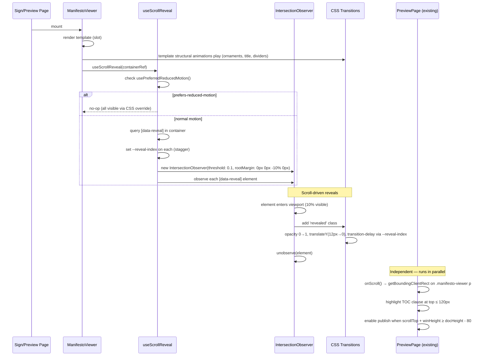

# Progressive Scroll Reveal - Plan

## Goal Capsule

- **Objective:** Add progressive scroll reveal to the manifesto document — paragraphs and structural elements fade in as the user scrolls, transforming reading from passive scanning to active "receiving" of the family covenant.
- **Product authority:** This plan owns the scroll reveal visual layer. It does not alter scroll-to-publish logic, the 3-second reading gate, TOC tracking, or the document data model. CeremonyRoom (already implemented but not wired to pages) is out of scope — scroll reveal must work independently with or without it.
- **Open blockers:** None.

---

## Product Contract

### Summary

Add a scroll reveal effect to both ClassicTemplate and ModernTemplate where paragraphs and structural elements (title, ornaments, dividers) start invisible and animate into view as the user scrolls. The effect uses IntersectionObserver + CSS transitions — no animation libraries. It is a purely visual enhancement: no behavioral changes to publishing, signing, or reading gates.

### Problem Frame

The manifesto ceremony has been progressively enhanced with three layers:
1. **Spatial** — CeremonyRoom component (parchment background, scale-up entrance)
2. **Signature** — Calligraphy brush pen rendering on SignaturePad
3. **Climactic** — Digital wax seal animation on covenant effective

But the core act of *reading* the covenant remains visually flat. Both templates render paragraphs as static `<p>` elements that all appear at once — no pacing, no sense of progressive disclosure. In ceremonial traditions across cultures (Torah scroll unfurling, sutra verse-by-verse chanting), the pacing IS the meaning. A family covenant deserves the same treatment: the user doesn't "see" the document, they "receive" it section by section.

This is the last gap in the ceremony chain: enter chamber → read covenant → sign → seal. Scroll reveal completes the reading step.

### Current State (Verified 2026-09-09)

- **CeremonyRoom.vue** exists (147 lines) with scale-up entrance animation, but is **not imported** by either ManifestoSignPage or ManifestoPreviewPage
- **Ceremony CSS variables** (`--ceremony-*`) defined in `style.css:148-161` but **not consumed** by template components
- **ClassicTemplate.vue** (319 lines): ornaments `☙`, emblem `⚜`, gold dividers `◆`, serif font, paragraph-num inline spans — all static
- **ModernTemplate.vue** (267 lines): accent-dot bar, title-rule, para-marker spans, card-style body — all static
- **Zero animation** in either template. Zero IntersectionObserver usage in manifesto module
- **PreviewPage** TOC tracking: `window.addEventListener('scroll')` → `getBoundingClientRect()` on `.manifesto-viewer p` elements → highlight active clause at threshold `top <= 120px`
- **Scroll-to-publish**: `scrollTop + winHeight >= docHeight - 80` enables publish button
- **`@vueuse/core`** is a project dependency; exposes `usePreferredReducedMotion` but it is unused in app code
- **IntersectionObserver** used once inline in `ChatHistoryPage.vue` (infinite scroll) — no composable wrapper exists

### Key Decisions

- **Paragraphs reveal on scroll intersection.** Each `<p>` starts at `opacity: 0; transform: translateY(12px)` and transitions to visible when IntersectionObserver fires. (session-settled: from ideation artifact, refined by code scan)
- **Preview page TOC compatibility.** Scroll reveal is independent of TOC scroll tracking. Elements at `opacity: 0` still occupy layout space, so `getBoundingClientRect()` values are unaffected — TOC highlighting works on both visible and not-yet-revealed paragraphs. The reveal animation (350ms) completes before the element reaches the TOC highlight threshold (120px from top). (session-settled: user chose "互不干扰")
- **Both templates participate with template-appropriate elements.** ClassicTemplate animates ornaments → title → divider → paragraphs. ModernTemplate animates accent-bar → title → title-rule → paragraphs. Signature grids remain static in both. (session-settled: from ideation artifact)
- **IntersectionObserver, not GSAP.** Consistent with project's existing animation pattern (CeremonyRoom entrance, WaxSeal stamp — all pure CSS transitions). No new dependencies. (session-settled: from code scan, confirmed by "no GSAP" constraint)
- **Staggered timing.** Each successive paragraph has +80ms delay. Creates a cascade effect. (session-settled: from ideation artifact)
- **Dark mode via existing CSS variables.** No new dark mode logic needed — the `opacity` + `transform` approach is color-agnostic. (session-settled: from ideation artifact)
- **prefers-reduced-motion: instant display.** Skip all transforms and transitions; all content visible immediately on page load. (session-settled: from ideation artifact)
- **CeremonyRoom-independent.** The scroll reveal must work whether or not CeremonyRoom wraps the document. If CeremonyRoom is later wired in, its scale-up entrance (0.92 → 1.0) plays first, then scroll reveal takes over as the user scrolls. (session-settled: user chose "本次只做 scroll reveal")
- **No behavioral changes.** Scroll-to-publish detection, 3-second reading gate, and TOC active-clause tracking remain unchanged. (session-settled: user chose "互不干扰")

### Requirements

**Reveal Mechanism**

- R1. Each `<p>` element inside `.manifesto-viewer` starts at `opacity: 0` and `transform: translateY(12px)` on page load.
- R2. When a paragraph enters the viewport (observed via IntersectionObserver), it transitions to `opacity: 1` and `transform: translateY(0)` using a CSS transition (ease-out, ~350ms).
- R3. The observer targets `.manifesto-viewer p` — the same selector PreviewPage already uses for TOC tracking.
- R4. Each paragraph's transition-delay is set via `--reveal-index` custom property, incrementing by 80ms per element, capped at 5 × 80ms = 400ms max delay (prevents long covenants from stacking excessive delays).

**ClassicTemplate Elements**

- R5. Corner ornaments (`.ornament`) fade in first (opacity 0→1, ~200ms) before any paragraph animation.
- R6. Title (`h1.certificate-title`) scales from 0.95 to 1.0 with fade-in (~400ms).
- R7. Divider lines (`span.divider-line`) expand from `width: 0` to full width, growing outward from center (~300ms).
- R8. Emblem (`div.certificate-emblem`) fades in with a slight scale (~300ms).

**ModernTemplate Elements**

- R9. Accent dots (`.accent-dot`) appear sequentially with a pop-in effect (~150ms each, 100ms stagger).
- R10. Title (`h1.modern-title`) fades up (~350ms).
- R11. Title rule (`div.modern-title-rule`) expands from `width: 0` to 40px (~300ms).

**Stability**

- R12. Signature grids (`.signature-grid`, `.modern-signatures`) remain fully visible at all times — no animation.
- R13. WaxSeal component position and animation are unaffected.
- R14. `opacity: 0` elements still occupy layout space. Document height is unchanged. Scroll-to-publish bottom detection (`scrollTop + winHeight >= docHeight - 80`) works identically.
- R15. TOC active-clause tracking (`getBoundingClientRect().top <= 120`) works correctly — paragraphs at `opacity: 0` have valid bounding rects.

**Accessibility**

- R16. When `prefers-reduced-motion: reduce` is set, all elements appear in their final state immediately — no opacity transition, no transform, no transition-delay.

### Key Flows

**F1. User previews a covenant with scroll reveal**
- **Trigger:** User navigates to `/manifesto/preview/:id`
- **Steps:**
  1. Page loads → template renders → ornaments/title/divider animate in (sequence per template)
  2. First visible paragraphs (above the fold) trigger IntersectionObserver → fade in with stagger
  3. User scrolls → each new paragraph entering viewport fades in
  4. TOC sidebar highlights clauses as paragraphs cross the 120px threshold (unchanged behavior)
  5. User scrolls to bottom → publish button enables (unchanged behavior)
- **Outcome:** Document feels like it's being progressively revealed as the user reads. The act of scrolling becomes an act of "unfurling" the covenant.

**F2. User signs the covenant with scroll reveal**
- **Trigger:** User navigates to `/manifesto/sign/:id`
- **Steps:**
  1. Page loads → document with scroll reveal presents
  2. User scrolls through document → paragraphs fade in
  3. Signature area (always visible) shows signature pads
  4. User signs → calligraphy rendering → confirm
- **Outcome:** Reading the covenant feels deliberate and paced. The signature area is always accessible regardless of reveal state.

**F3. User with prefers-reduced-motion**
- **Trigger:** User has `prefers-reduced-motion: reduce` enabled
- **Steps:** Page loads → all elements appear instantly in final state → no animation plays
- **Outcome:** Same information, same layout, no motion.

### Acceptance Examples

**A1. Classic template, 4 paragraphs, mobile viewport**
- On load: ornaments fade in → title scales up → divider lines expand → first 1-2 paragraphs (above fold) fade in with 80ms stagger
- User scrolls: paragraphs 3-4 fade in as they enter viewport
- Signature grid: visible throughout, unaffected
- Total animation time for initial view: ~1.2s (ornaments 200ms + title 400ms + divider 300ms + 2 paragraphs × 350ms with stagger)

**A2. Preview page, scroll-to-publish**
- User scrolls through document → all paragraphs reveal progressively
- Scroll past last paragraph → `scrollTop + winHeight >= docHeight - 80` → publish button enables
- Scroll reveal does NOT alter document height or publish trigger threshold

**A3. Reduced motion preference**
- All elements visible immediately on page load
- No opacity, transform, or transition-delay applied
- Document is fully readable without any animation

### How This Work Fits Together

This plan is the fourth ceremony layer in the manifesto experience:

| Layer | Idea | Status |
|-------|------|--------|
| Spatial | Ceremonial Chamber (CeremonyRoom) | Component done, not wired to pages |
| Signature | Calligraphy brush pen | ✅ Shipped (`47af6c1e`) |
| Reading | **Progressive Scroll Reveal** | **This plan** |
| Climactic | Digital wax seal | ✅ Shipped (`23f8bc73`) |

CeremonyRoom integration (wiring the existing component to Sign/Preview pages) is a separate investment that layers on top. The ceremony CSS variables (`--ceremony-*`) defined in `style.css` are a visual foundation that scroll reveal doesn't depend on. Living Family Crest (ideation Idea #3) and Signing Milestone Timeline (Idea #6) are additional future ceremony investments that can layer on top without conflict.

### Outstanding Questions

- **Q1.** Should the first N paragraphs (above the fold) reveal immediately on load, or should the user need to scroll at least slightly to trigger the first reveal? → *Resolved in planning: IntersectionObserver fires for above-fold elements on initial intersection check — they auto-reveal without requiring scroll (R2).*
- **Q2.** Should the reveal reset if the user navigates away and back (e.g., via browser back button)? → *Resolved in planning: no reset — once revealed, stays revealed. Observer disconnects per-element after reveal; no re-observe logic (U1).*
- **Q3.** When CeremonyRoom is eventually wired in, should the chamber entrance animation (scale-up 600ms) play first, then scroll reveal takes over? Or should both start simultaneously? → *Deferred to CeremonyRoom wiring plan.*

---

## Planning Contract

Product Contract unchanged from brainstorm — all R-IDs, F-IDs, A-IDs preserved verbatim. Q1 and Q2 resolved from Recommendations to Decisions during planning.

### Key Technical Decisions

**KTD1. useScrollReveal composable in ManifestoViewer** — A single composable `useScrollReveal(containerRef)` is created and invoked in `ManifestoViewer.vue`, the shared wrapper for both templates. This avoids duplicating observer setup in each template and ensures future templates automatically inherit scroll reveal. The composable queries `[data-reveal]` elements within the container, not hardcoded selectors. (Governs R1, R2, R3, R4)

**KTD2. Two-layer animation model** — Structural elements (ornaments, titles, dividers) use CSS `@keyframes` with `animation:` for load-time entrance (they animate on page mount regardless of scroll). Paragraphs use `data-reveal` attributes + IntersectionObserver for scroll-triggered reveal. This cleanly separates "ceremony entrance" from "progressive disclosure." (Governs R5-R11)

**KTD3. `usePreferredReducedMotion` from `@vueuse/core`** — Already a project dependency; provides reactive reduced-motion detection. The composable checks it to skip IntersectionObserver setup entirely. CSS `@media (prefers-reduced-motion: reduce)` in `style.css` provides a safety net that overrides all transitions regardless of JS state. (Governs R16)

**KTD4. `data-reveal` attribute for paragraph targeting** — ManifestoViewer adds `data-reveal` + `--reveal-index` custom property to each `<p>` in the `v-for`. Templates don't need to know about the reveal mechanism — they only style their own structural elements. (Governs R1, R3, R4)

---

## High-Level Technical Design



---

## Implementation Units

### U1. Create `useScrollReveal` composable

**Goal:** IntersectionObserver-based composable that observes `[data-reveal]` elements within a container and adds a `revealed` class when they enter the viewport.

**Requirements:** R1, R2, R3, R4, R16

**Dependencies:** none

**Files:**
- Create: `frontend/apps/main/src/composables/useScrollReveal.ts`
- Create: `frontend/apps/main/src/composables/__tests__/useScrollReveal.spec.ts`

**Approach:**
1. Accept `container: Ref<HTMLElement | null>` parameter
2. Check `usePreferredReducedMotion()` from `@vueuse/core` — if `'reduce'`, return early (no-op). Per KTD3.
3. In `onMounted`, query `[data-reveal]` within container. Assumption: templates are synchronously imported (per `templateRegistry.ts`), so child DOM is present at parent `onMounted` per Vue 3 lifecycle. If templates later become async (lazy loading), add a `watch` on container child mutations to re-query.
4. Create `IntersectionObserver` with `threshold: 0.1`, `rootMargin: '0px 0px -10% 0px'` (triggers slightly before element fully enters)
5. Observer callback: for each intersecting entry, add class `revealed` to `entry.target`, then call `observer.unobserve(entry.target)` (one-shot reveal — per Q2 resolution, no reset)
6. On `onUnmounted`: call `observer.disconnect()`

**Patterns to follow:**
- `useCeremonyRoom.ts` — setup/cleanup lifecycle pattern (`onMounted` + `onUnmounted`)
- `ChatHistoryPage.vue` — IntersectionObserver inline usage pattern
- `useReducedMotion.test.ts` (child app) — `usePreferredReducedMotion` testing pattern

**Test scenarios:**
- Observer created and attached to each `[data-reveal]` element when composable mounts (mock `IntersectionObserver`, verify `observe()` calls)
- `revealed` class added to element when observer reports intersection (`isIntersecting: true`)
- Element unobserved after reveal (verify `unobserve()` called — one-shot)
- When `usePreferredReducedMotion` returns `'reduce'`, observer is not created (no `observe()` calls)
- On unmount, `observer.disconnect()` is called (cleanup verification)
- Container with zero `[data-reveal]` elements does not throw

**Verification:** Unit tests pass. Composable is framework-agnostic (works with any container ref).

---

### U2. Wire scroll reveal in ManifestoViewer

**Goal:** Import and invoke `useScrollReveal` in the document viewer, and add `data-reveal` + `--reveal-index` attributes to each paragraph element in the fallback template.

**Requirements:** R1, R3, R4, R14, R15

**Dependencies:** U1

**Files:**
- Modify: `frontend/apps/main/src/components/manifesto/ManifestoViewer.vue`

**Approach:**
1. Modify the existing `<script setup lang="ts">` block (ManifestoViewer already has imports, interfaces, props, and a `resolvedComponent` computed). Add `useScrollReveal` import and `ref` alongside existing imports.
2. Create a `containerRef = ref<HTMLElement | null>(null)`
3. Attach `ref="containerRef"` to the root `.manifesto-viewer` div
4. Call `useScrollReveal(containerRef)` in setup
5. In the fallback `<div class="manifesto-viewer-fallback">`, add `data-reveal` and `:style="{ '--reveal-index': index }"` to each `<p>` in a `v-for`
6. The template components (Classic/Modern) handle their own paragraph rendering — ManifestoViewer's fallback is only for unknown template IDs. The composable targets `[data-reveal]` which both templates will add independently (U3, U4).

**Patterns to follow:**
- `ManifestoViewer.vue` — existing `<component :is>` dynamic template pattern

**Test expectation:** none — ManifestoViewer is a thin wrapper; integration is verified via template tests (U3, U4) and E2E visual check.

**Verification:** ManifestoViewer compiles without errors. The composable is invoked on mount.

---

### U3. ClassicTemplate scroll reveal CSS

**Goal:** Add scroll reveal attributes to ClassicTemplate paragraphs and CSS entrance animations for structural elements.

**Requirements:** R1, R4, R5, R6, R7, R8

**Dependencies:** U1

**Files:**
- Modify: `frontend/apps/main/src/components/manifesto/templates/ClassicTemplate.vue`

**Approach:**
1. Add `data-reveal` and `:style="{ '--reveal-index': index }"` to each `<p>` in the `certificate-body` `v-for` (covers R1, R4)
2. Add scoped CSS for structural element animations (covers R5-R8):
   - `.ornament` — initial `opacity: 0`, `@keyframes` fade-in over 200ms with 100ms delay
   - `.certificate-emblem` — initial `opacity: 0; transform: scale(0.9)`, `@keyframes` fade-in + scale to 1.0 over 300ms with 200ms delay
   - `h1.certificate-title` — initial `opacity: 0; transform: scale(0.95)`, `@keyframes` fade-in + scale over 400ms with 300ms delay
   - `.divider-line` — initial `width: 0` (via `transform: scaleX(0)`), `@keyframes` expand to full width over 300ms with 500ms delay
3. Add paragraph reveal CSS:
   - `[data-reveal]` — initial `opacity: 0; transform: translateY(12px)`
   - `[data-reveal].revealed` — `opacity: 1; transform: translateY(0)`
   - `transition: opacity 0.35s ease-out, transform 0.35s ease-out`
   - `transition-delay: calc(min(var(--reveal-index, 0), 5) * 80ms)` (capped at 400ms max)
4. Add `@media (prefers-reduced-motion: reduce)` block: all animations set to `none`, all elements to `opacity: 1; transform: none`

**Patterns to follow:**
- `CeremonyRoom.vue` — `prefers-reduced-motion` pattern (JS check + CSS fallback)
- Existing ClassicTemplate scoped CSS — follow same selector naming conventions

**Test scenarios:**
- Paragraphs in ClassicTemplate have `data-reveal` attribute and `--reveal-index` style
- Structural elements have initial `opacity: 0` state (`.vue?raw` regex assertion per `RoleShimmer.test.ts` pattern)
- `@media (prefers-reduced-motion: reduce)` block exists in scoped styles (`.vue?raw` regex)

**Verification:** ClassicTemplate renders with scroll reveal in browser. Structural elements animate on load. Paragraphs reveal on scroll.

---

### U4. ModernTemplate scroll reveal CSS

**Goal:** Add scroll reveal attributes to ModernTemplate paragraphs and CSS entrance animations for structural elements.

**Requirements:** R1, R4, R9, R10, R11

**Dependencies:** U1

**Files:**
- Modify: `frontend/apps/main/src/components/manifesto/templates/ModernTemplate.vue`

**Approach:**
1. Add `data-reveal` and `:style="{ '--reveal-index': index }"` to each `<p>` in the `modern-body` `v-for`
2. Add scoped CSS for structural element animations:
   - `.accent-dot` — initial `opacity: 0; transform: scale(0)`, `@keyframes` pop-in over 150ms, 100ms stagger between dots 1/2/3
   - `h1.modern-title` — initial `opacity: 0; transform: translateY(8px)`, `@keyframes` fade-up over 350ms with 400ms delay
   - `.modern-title-rule` — initial `width: 0` (via `transform: scaleX(0)` with `transform-origin: left`), `@keyframes` expand to 40px over 300ms with 600ms delay
3. Add paragraph reveal CSS (same pattern as U3 — `[data-reveal]` + `.revealed` class)
4. Add `@media (prefers-reduced-motion: reduce)` block (same pattern as U3)

**Patterns to follow:**
- Same `RoleShimmer.test.ts` pattern for test assertions
- ModernTemplate's existing scoped CSS conventions

**Test scenarios:**
- Paragraphs in ModernTemplate have `data-reveal` attribute and `--reveal-index` style
- Structural elements have initial `opacity: 0` state (`.vue?raw` regex)
- `@media (prefers-reduced-motion: reduce)` block exists

**Verification:** ModernTemplate renders with scroll reveal in browser. Structural elements animate on load. Paragraphs reveal on scroll.

---

### U5. Global reduced-motion CSS + tests

**Goal:** Add global `prefers-reduced-motion` safety net for scroll reveal, and write comprehensive tests.

**Requirements:** R16

**Dependencies:** U1, U3, U4

**Files:**
- Modify: `frontend/apps/main/src/style.css` (add reduced-motion override block in ceremony section)
- Create: `frontend/apps/main/src/components/manifesto/__tests__/scrollReveal.spec.ts`

**Approach:**
1. In `style.css`, add a `@media (prefers-reduced-motion: reduce)` block after the existing ceremony CSS variables (~line 161):
   ```
   @media (prefers-reduced-motion: reduce) {
     [data-reveal],
     .classic-template .ornament,
     .classic-template .certificate-emblem,
     .classic-template .certificate-title,
     .classic-template .divider-line,
     .modern-template .accent-dot,
     .modern-template .modern-title,
     .modern-template .modern-title-rule {
       opacity: 1 !important;
       transform: none !important;
       animation: none !important;
       transition: none !important;
     }
   }
   ```
2. Write `scrollReveal.spec.ts` integration test:
   - Mock `IntersectionObserver` with stub class (`observe`/`unobserve`/`disconnect` + manual `trigger(entries)` helper)
   - Mount ClassicTemplate with sample body text → verify `[data-reveal]` on paragraphs
   - Simulate intersection → verify `.revealed` class added
   - Follow `RoleShimmer.test.ts` pattern: `vi.resetModules()` + `setupMatchMedia()` + dynamic `await import()` for reduced-motion branch
   - `.vue?raw` regex assertions for CSS transition durations in scoped styles

**Patterns to follow:**
- `RoleShimmer.test.ts` — `matchMedia` mocking + `.vue?raw` CSS duration assertions
- `useReducedMotion.test.ts` — `window.matchMedia` mock + change listener testing
- `useManifestoFlow.spec.ts` — existing manifesto test conventions

**Test scenarios:**
- Global CSS: `[data-reveal]` elements have `opacity: 1; transform: none` when `prefers-reduced-motion: reduce` is active
- Integration: ClassicTemplate mounts → `[data-reveal]` present on `<p>` elements with correct `--reveal-index` values
- Integration: simulate IntersectionObserver callback with `isIntersecting: true` → paragraph gets `.revealed` class
- Integration: after reveal, `unobserve()` called on that element (one-shot)
- Reduced-motion branch: when `matchMedia` returns `reduce`, composable skips observer creation

**Verification:** All tests pass. Global CSS verified by manual browser test with DevTools "Emulate CSS media feature: prefers-reduced-motion: reduce".

---

## Verification Contract

- [ ] `pnpm vitest run` in `frontend/apps/main/` — all tests pass (new + existing)
- [ ] `pnpm typecheck` — no type errors
- [ ] Visual smoke: ClassicTemplate sign page → ornaments fade in, title scales, paragraphs reveal on scroll
- [ ] Visual smoke: ModernTemplate sign page → accent dots pop, title fades up, paragraphs reveal on scroll
- [ ] Visual smoke: Preview page → scroll reveal + TOC + scroll-to-publish all work independently
- [ ] Dark mode: both templates render correctly with scroll reveal in dark mode
- [ ] Reduced motion: both templates show all content immediately with no animation
- [ ] No regression: existing manifesto tests (`useManifestoFlow.spec.ts`) still pass

## Definition of Done

- All 5 implementation units complete with test scenarios passing
- Both ClassicTemplate and ModernTemplate render scroll reveal correctly in light + dark mode
- `prefers-reduced-motion` fully respected (CSS safety net + JS gating)
- No behavioral regression on scroll-to-publish, TOC tracking, or 3-second reading gate
- No new dependencies (uses existing `@vueuse/core`)
- Code formatted per project conventions (incremental formatting — only touched files)
