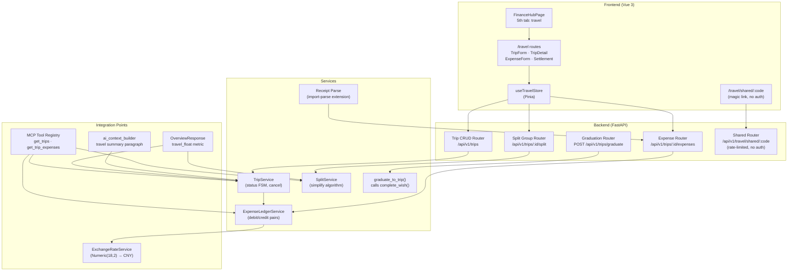
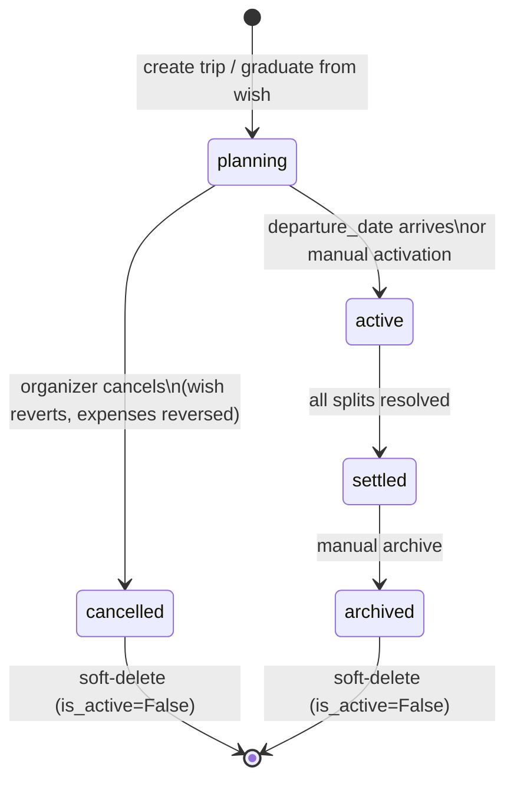

# Family Travel Module - Plan

## Goal Capsule

- **Objective:** Add a family travel management module to Numina's financial page, enabling trip planning with expense tracking, cross-family bill-splitting, wish-to-trip graduation, and receipt-first expense entry — built on a reusable expense ledger. Travel data is exposed via MCP tools for AI queries. A travel float metric integrates into the dashboard's net worth overview.
- **Authority:** Brainstorm Product Contract (8 session-settled Key Decisions) + Planning Contract (11 KTDs resolving deferred questions)
- **Stop conditions:** All Implementation Units complete; Verification Contract gates pass; no P0/P1 open questions remain
- **Execution profile:** Full-stack — ORM models → Alembic migration → Pydantic schemas → API routers → Frontend pages/components → MCP tools → AI context → Tests
- **Tail ownership:** Implementer owns end-to-end delivery

**Product authority:** This plan owns the travel module (expense ledger, trip lifecycle, split groups, wish graduation, receipt parsing, travel float, MCP exposure). Annual travel statistics (monthly rollup, year-over-year comparison, AI narrative) are not active scope — deferred to a future brainstorm.

**Product Contract preservation:** Unchanged from brainstorm. All R-IDs, A-IDs, F-IDs, AE-IDs preserved verbatim.

---

## Product Contract

### Summary

A family travel module that lets users create trips (optionally graduating from wishes), track multi-currency expenses via a generic expense ledger with receipt-first entry (AI-powered vision parsing), split costs with other families/friends through invite-code groups, and settle debts with a greedy simplification algorithm. A travel float metric mirrors the rental cash flow pattern in the dashboard's net worth overview. Travel data is exposed via MCP tools for AI queries (same pattern as assets/liabilities). The travel tab on FinanceHubPage provides the entry point; dedicated `/travel` routes handle trip management. Travel is managed as an independent temporary affair — not a contextual overlay on existing tabs.

### Problem Frame

Numina tracks family assets, liabilities, wishes, and rental contracts — but has no way to manage travel expenses or share costs with other families. When a family goes on vacation, they track spending in separate apps (Splitwise, spreadsheets, or mental math), completely disconnected from their financial picture. The wish system already acknowledges travel as a goal type (`complete_wish` docstring: "experience / travel etc.") but dead-ends at "realized" — there's no downstream trip entity, no budget tracking, no expense capture. Meanwhile, the child economy's `CoinTransaction` already proves the ledger pattern works in this codebase, and `Family.invite_code` proves the token-based onboarding UX.

### Key Decisions

**Generic expense ledger over travel-specific tables.** The ledger pattern from `CoinTransaction` generalizes into a family-scoped expense ledger where trip expenses are one `ref_type`. Governs R1, R2, R3. (session-settled: user-approved — chosen over travel-specific TripExpense table: compounding value across modules)

**Invite-code SplitGroup over full user accounts.** External participants are free-text names joining via 6-char invite code, mirroring `Family.invite_code`. Family isolation preserved. Governs R6, R7, R8. (session-settled: user-directed — chosen over external user accounts: privacy-first architecture)

**Separate graduation service over extending complete_wish inline.** A new `graduate_to_trip` service calls `complete_wish` internally rather than coupling trip creation into the existing completion flow. Governs R12. (session-settled: user-approved — chosen over inline extension: separation of concerns)

**5th tab on FinanceHubPage.** Travel joins assets/liabilities/wishes/rentals as a peer tab. Follows the established 7-location update pattern (skeleton, imports, template, type union, query validation, i18n). Travel is an independent temporary affair managed via dedicated `/travel` routes — not a contextual overlay on existing tabs. (session-settled: user-directed — rejected ephemeral context overlay: travel is a temporary matter needing independent management)

**Travel float mirrors rental cash flow in dashboard.** A `travel_float` metric in `OverviewResponse` shows net unpaid travel balance (prepaid = positive, unsettled debt = negative). Follows the exact pattern of `rental_net_cash_flow` in the dashboard. Governs R15. (session-settled: user-approved — chosen over deferring liability integration: travel spending should be visible in net worth)

**Receipt-first expense entry via import-parse.** Travel expense entry inverts the workflow: users photograph receipts → AI extracts vendor, amount, currency, date → user confirms. Reuses the existing `import-parse` vision pipeline. Governs R17. (session-settled: user-approved — chosen over manual-only entry: reduces friction for high-receipt travel scenarios)

**Travel data exposed via MCP for AI queries.** Travel trips, expenses, and split data are queryable by the AI agent through MCP tools — same pattern as existing asset/liability MCP tools. Governs R16. (session-settled: user-directed — chosen to extend existing `mcp_tool_registry.py` with travel query tools via `mcp_session.py` dispatch chain, over building a separate travel MCP server: same access patterns, no architectural benefit)

### Actors

A1. **Family member (organizer)** — creates trips, records expenses, manages split groups, initiates graduation from wishes. Has full CRUD on trip data within their family scope.

A2. **External participant (guest)** — joins a split group via invite code, sees only the group's shared expenses. No access to any family's assets, liabilities, or private data. Identified by free-text name, not a system user account.

A3. **AI agent (via MCP)** — queries travel data (trips, expenses, splits, settlements) through MCP tools to provide insights, factor travel into financial advice, and answer family questions about travel spending. Same access pattern as asset/liability MCP tools.

### Key Flows

**F1. Wish → Trip Graduation**
- **Trigger:** Family member marks a travel wish (converts_to_asset=False) as ready to execute
- **Steps:** User taps "graduate to trip" on a pending wish → system creates Trip entity with wish's `expected_price` as `planned_budget`, `saved_amount` as `initial_funding`, `target_date` as `departure_date` → wish status flips to "realized" via `complete_wish` → wish's `WishSavingsLog` entries remain as funding history linked to the trip
- **Covers R10, R11, R12.**

**F2. Trip Expense Recording**
- **Trigger:** Family member records a travel expense during or before a trip
- **Steps:** User selects trip → enters amount, currency, category, date, description → system creates debit entry (reducing funding source balance or increasing credit-card liability) + credit entry (against expense category) → trip's `actual_spend` derived cache updates in-transaction
- **Covers R1, R2, R3.**

**F3. Split Group Creation & Joining**
- **Trigger:** Family member creates a trip and wants to share costs with others
- **Steps:** User enables "split costs" on a trip → system generates 6-char invite code → user shares code with travel companions → external participants enter code + their name → they see only the trip's shared expenses → when expense is recorded, user selects which participants share it and the split type (equal/custom)
- **Covers R6, R7.**

**F4. Debt Simplification & Settlement**
- **Trigger:** Trip ends or user taps "settle debts"
- **Steps:** System computes each participant's net balance (paid minus owed) → applies greedy max-creditor/max-debtor algorithm → reduces N participants to ≤ N-1 settlement transactions → displays simplified settlement plan → each settlement can be marked as completed
- **Covers R8, R9.**

**F5. Receipt-First Expense Entry**
- **Trigger:** Family member photographs a receipt or booking confirmation during/after a trip
- **Steps:** User selects trip → taps "scan receipt" → uploads photo → `import-parse` AI skill extracts vendor, amount, currency, date, category via vision pipeline → system presents extracted data for review → user confirms or corrects → expense entry created in the ledger with debit/credit pair
- **Covers R17.**

### Requirements

**Expense Ledger**

R1. Each expense entry creates a debit/credit pair with amount, currency, expense_date, category, description, and a polymorphic reference (`ref_id` + `ref_type`) linking to the parent entity (trip, rental contract, etc.). All amounts use `Numeric(18,2)` and serialize as `str` on the wire.

R2. The ledger uses `SELECT ... FOR UPDATE` row-level locking when updating derived caches (trip's `actual_spend`, family's expense totals) to prevent concurrent write conflicts, mirroring the `WishSavingsLog` invariant pattern. **On the frontend, the trip detail page uses optimistic UI with background sync: newly recorded expenses appear immediately for the recording user, and other users see updates via pull-to-refresh with a "last synced" timestamp. Conflicting edits (e.g., two users modifying the same expense) are resolved by last-write-wins at the database level, with the losing user shown a "data was updated — please refresh" notice. When the conflict notice appears, the user is shown the current version and asked whether to overwrite or discard their changes.** Expenses can be edited by the user who recorded them or the trip organizer via the expense detail page. Deletion requires a confirmation dialog; for shared expenses, deletion cascades to split balance recalculation (R7a) within the same transaction — only the recording user or organizer can delete. **When connectivity is unavailable and an edit is made locally, the "待同步" indicator shows pending status. Pending items sync automatically on reconnect (app foreground + network recovery) with a 30-second timeout per item; failed items remain pending with a "同步失败" indicator and retry action.**

R3. Multi-currency: each expense stores its original currency. The system converts to the family's default currency (CNY) at recording time using `ExchangeRateService`, capturing the rate used for historical accuracy. **Expense dates are stored as UTC but displayed in the trip's destination timezone. The date picker on the expense form defaults to the trip's timezone, not the device's local timezone. Exchange rates are locked to the expense_date (the day the expense was incurred), not the recording timestamp. When `ExchangeRateService` returns no rate for the given currency and date (unsupported currency or historical gap), the expense form accepts a user-provided rate and displays a "手动汇率" badge, flagging the entry for later review.**

**Trip Lifecycle**

R4. A Trip entity has: name, destination, departure_date, return_date (nullable for open-ended), status (planning/active/settled/archived), planned_budget, initial_funding (nullable Numeric(18,2), set during wish graduation), actual_spend (derived cache), currency, family_id, user_id, optional wish_id.

R5. Trip status transitions: planning → active (on departure or manual), active → settled (all splits resolved), settled → archived. Soft-delete via `is_active=False`. **The planning → active transition uses a hybrid model: on `departure_date` (in the trip's timezone), the system suggests activation via a notification ("Your trip to Tokyo starts today — activate?"). The user confirms with a single tap. If the user does not activate within 24 hours of departure_date, the system auto-transitions to active.** When `return_date` passes and the trip has unsettled shared expenses, the system displays a "待结算" badge on the travel tab and sends an in-app notification to the organizer with a deep link to the settlement page. **A trip in `planning` status can be cancelled by the organizer. Cancellation shows a confirmation dialog ("取消行程？已记录的费用将冲销。"). On confirm: any linked wish reverts to "pending" (savings preserved), all expenses are reversed via offsetting ledger entries, and the trip is soft-deleted (`is_active=False`). Any linked split group is immediately invalidated — the shared page displays a "行程已取消" notice to external participants, and the invite code is revoked.**

**Split Group**

R6. A SplitGroup is scoped to a single trip. It has a 6-char alphanumeric invite code (uppercase + digits, matching `Family.invite_code` generation). External participants are stored as free-text names (max 200 chars, matching `RentalContract.counterparty`). **The `/travel/shared/{invite_code}` endpoint enforces rate limiting (10 attempts per minute per IP) to prevent brute-force enumeration. Invite codes expire 7 days after the trip's `return_date` or when the trip is archived, whichever comes first. The organizer can regenerate the code from the split management page if compromised. The organizer can add additional participants after group creation using the same invite code (valid until expiry). The split management page shows current participants with a "移除" action for each.**

R7. Each shared expense records the split configuration: participant list and split type (equal/per-person/custom-amounts). The trip organizer and any **co-organizer** (family member delegated by the organizer via the trip detail page) can add/modify expenses. External participants have read-only access to shared expenses. The split type is selected via a segmented control with three options: "均摊" (equal), "按人头" (per-person), "自定义金额" (custom amounts). Selecting "自定义金额" expands individual amount input fields per participant.

**R7a. Split-Ledger interaction:** The split group's per-participant balances are **derived from** ledger entries, not independently written. When a shared expense is recorded, the ledger creates the debit/credit pair (R1) and the split configuration is stored on the expense (R7). The trip's `actual_spend` reflects the **family's proportional share** of shared expenses plus 100% of non-shared expenses. Expense correction or deletion cascades to split balance recalculation within the same database transaction.

R8. Debt simplification computes minimum-transfer settlement: greedy max-creditor/max-debtor matching reduces N participants to ≤ N-1 transactions. The algorithm runs on-demand (user taps "simplify debts"), not automatically.

R9. Settlement transactions are recorded in the ledger with `ref_type: "split_settlement"`. Each settlement can be independently marked as completed **by the trip organizer or the co-organizer who recorded the related expenses**. Completion is tracked per-settlement, not per-group. **Completion sets a `settled_at` timestamp and is reversible within 24 hours (soft undo: creates a reverse ledger entry). After 24 hours, completion is permanent. Marking a settlement as completed shows a confirmation dialog ("确认已结清？24小时内可撤销。"). During the 24-hour window, a "撤销" button is visible next to the completed settlement on the settlement page.**

**Graduation Pipeline**

R10. A wish with `converts_to_asset=False` can be graduated to a trip. The graduation copies: name, expected_price → planned_budget, saved_amount → initial_funding, target_date → departure_date, currency. The wish's `wish_id` is stored on the trip for traceability.

R11. After graduation, the wish status becomes "realized" with `fulfilled_at` set. The wish's `WishSavingsLog` entries are not moved — they remain on the wish as historical record. The trip's `initial_funding` field captures the total saved amount at graduation time.

R12. Graduation is a separate service function (`graduate_to_trip`) that validates eligibility, creates the trip, and calls `complete_wish` internally. It is not an inline modification of `complete_wish`. The frontend shows a confirmation dialog ("将心愿转化为行程？心愿状态将变为'已实现'。") before calling the service. On success, a toast confirms "行程已创建" with a deep link to the new trip.

**R23.** Trip can be created from two entry points: (1) the "转化为行程" button on a travel wish in the wishes tab (via graduation pipeline, R10-R12), (2) the "+ 新建旅行" button on the travel tab directly (R18), with no wish prerequisite. Both paths produce identical Trip entities — the only difference is the `wish_id` field: null for direct creation, non-null for graduation.

**Frontend**

R13. FinanceHubPage gains a 5th tab "旅游" (travel) with icon `compass-o` and i18n key `nav.travel`. The tab shows a `TravelTripPanel` component with upcoming/active trips summary. When no trips exist, the tab shows an empty state with an illustration and a "创建第一个旅行" call-to-action button.

R14. Dedicated `/travel` route provides: trip list page, trip detail page (budget vs actual, expense list, split summary), trip form page (create/edit), expense form page, and split settlement page. Follows existing patterns: `PageHeader` → content → `van-form` for forms, `van-cell-group` for lists, `van-progress-bar` for budget-vs-actual visualization (KTD6). **The trip detail page adapts its information hierarchy to the trip's status: (a) planning phase: budget breakdown and funding status above the fold, (b) active phase: today's expenses and cumulative spend-vs-budget gauge above the fold with quick-add prominent, (c) post-trip (active→settled): split summary and settlement status above the fold.**

**UX Review Additions (Travel Experience Officer)**

R18. The travel tab panel (`TravelTripPanel`) includes: upcoming/active trip cards with quick-jump to trip detail, current month travel spend overview, and a "+ 新建旅行" quick-action button. This ensures the tab is actionable, not just a placeholder.

R19. Wish-to-trip graduation is triggered from the frontend: when a wish has `converts_to_asset=False` and its category matches travel, the wish list shows a "转化为行程" button. Tapping it calls the `graduate_to_trip` service. This makes the graduation path discoverable, not hidden behind backend logic.

R20. Expense recording entry point: trip detail page embeds an expense list with a floating "+ 记录费用" action button (Vant standard pattern). Tapping it opens a bottom sheet with two equally prominent options: "拍照记账" (receipt-first via import-parse, R17) and "手动录入" (direct form entry). Both paths produce identical expense entries. Manual entry is **not** a hidden fallback — it is a first-class option for cash transactions, tips, street food, and other receipt-less expenses. The button opens the expense form pre-linked to the current trip. **When connectivity is unavailable, photos taken via "拍照记账" are saved locally as pending drafts and synced automatically when the device reconnects. The expense list shows a "待同步" indicator for pending items.**

R21. External participants access split group expenses via a magic link (`/travel/shared/{invite_code}`) that requires no login. The link provides read-only access to shared expenses. Browser localStorage persists the group association for revisit. **The shared expense page displays the invite code prominently so the participant can re-enter it manually if localStorage is lost. The organizer's split management page lists external participants with a "re-send link" button.** This is an account-free access model — no persistent identity on the participant side.

R22. Settlement page shows simplified debts with a "复制转账信息" (copy transfer info) button for each settlement, generating text like "请转账 ¥500 给张三 (支付宝/微信)" — facilitating the actual off-system money transfer. After external transfer, the organizer marks the settlement as completed. **All external participant names are rendered using Vue text interpolation (`{{ name }}`) to prevent XSS — never `v-html`.**

**Travel Float (Dashboard Integration)**

R15. A `travel_float` metric is computed and included in `OverviewResponse`, mirroring the rental cash flow pattern (`rental_net_cash_flow`). The metric represents: **(1) prepaid component** = SUM of expense `amount_cny` for all expenses linked to trips with `status='planning'` (expenses recorded before departure), **minus (2) unsettled shared component** = SUM of the family's outstanding split balances where `settlement.is_complete=False`. All monetary components use CNY-converted amounts (split balances are converted to CNY before summing, matching the prepaid component). This makes travel spending visible in the family's net worth picture without creating a formal liability. Prepaid is positive (asset-like: money committed but not yet consumed); unsettled shared debt is negative (liability-like: money owed to others).

**MCP Exposure**

R16. Travel data (trips, expenses, split groups, settlements) is exposed via MCP tools following the same pattern as existing asset/liability MCP tools. The AI agent can query: trip list with status, trip expenses with category breakdown, split group balances, and settlement status. This enables AI-powered travel insights and allows the finance-coach skill to factor travel spending into its advice. No separate reporting system is built — the MCP tools provide the data layer; annual statistics are deferred. Travel MCP tools follow the same family-isolation pattern as asset/liability tools: each tool's `allowed_roles` metadata in `mcp_tool_registry.py` restricts access to the requesting user's family scope. Shared expense data exposed to AI queries includes only the family's proportional share — external participant names and individual amounts are not included in MCP responses.

**Receipt-First Expense Entry**

R17. Travel expense entry supports a receipt-first workflow: user photographs a receipt or booking confirmation → the `import-parse` AI skill extracts vendor, amount, currency, date, and suggested category via its vision pipeline → user reviews and confirms the extracted data → expense entry is created. **During extraction, a loading indicator ("识别中…") with the receipt image preview is displayed. The initial multi-language support covers CJK (Chinese, Japanese, Korean) and English receipts; other languages (Thai, European) require pipeline validation before support is committed.** The travel-receipt extraction requires a new output schema (vendor, amount, currency, date, expense_category) distinct from the existing asset-focused schema (current_value, purchase_price, quantity). A new prompt template with multi-language receipt examples (Chinese, Japanese, Korean, English) is added to the import-parse skill for initial support; Thai and European examples are deferred pending pipeline validation. The existing asset/holdings extraction pipeline is not modified. **Manual entry remains available as a fallback. **When the vision pipeline returns low-confidence extraction (partial fields or unrecognizable format), the system presents a partially pre-filled form for the user to complete manually.** The receipt parsing reuses the existing `read_file → view_image → structured JSON → batch write` architecture. **Receipt images are stored family-scoped with the same access controls as asset documents. Uploaded images are validated for file type (JPEG, PNG, HEIC) and size (max 10MB). Images are retained for the lifetime of the linked trip plus 3 years (tax/audit purposes), then soft-deleted.**

### Acceptance Examples

**AE1. Graduating a saved wish to a trip.**
Family has a wish "Japan 2027" with expected_price=¥150,000, saved_amount=¥50,000 (from 10 deposits in WishSavingsLog). User taps "graduate to trip" → Trip created with name="Japan 2027", planned_budget=150000.00, initial_funding=50000.00, departure_date=wish's target_date, wish_id=original wish's ID. Wish status → "realized". WishSavingsLog entries untouched on the wish.

**AE2. Multi-currency expense recording.**
Trip currency is CNY. Family records a ¥8,000 JPY expense (dinner in Tokyo). System fetches JPY→CNY rate (e.g., 0.048), stores: amount=8000.00, currency="JPY", amount_cny=384.00, exchange_rate=0.048. Trip's actual_spend increases by 384.00 CNY.

**AE3. Split group with debt simplification.**
4 families on a trip. Family A paid ¥3,000 (shared), B paid ¥1,000 (shared), C paid ¥2,000 (shared), D paid ¥0. Equal split = ¥1,500/person. Net: A +1500, B -500, C +500, D -1500. Simplified: D→A ¥1,500, B→C ¥500. Result: 2 transfers instead of 4.

**AE4. External participant joins via invite code.**
Trip organizer creates split group, gets code "A7K9M2". Shares with friend Zhang San. Zhang San enters code + name on the join page. Sees only the trip's shared expenses with amounts and who paid. Cannot see any family's asset/liability data. Can view but not edit.

**AE5. Receipt-first expense entry.**
Family is on a trip in Tokyo. User photographs a restaurant receipt (¥4,800 JPY). `import-parse` extracts: vendor="Ichiran Ramen Shibuya", amount=4800, currency="JPY", date=today, category="dining". System presents the extracted data. User confirms. Expense created: debit=4800 JPY dining expense, credit=reduces trip dining budget. amount_cny=230.40 at rate 0.048.

**AE6. Travel float in dashboard.**
Family prepaid ¥12,000 CNY for flights (departure in 2 weeks) and has ¥3,000 CNY in unsettled shared expenses from last month's trip. Dashboard shows: travel_float = +12,000 (prepaid, not yet traveled) - 3,000 (traveled, not yet settled) = +9,000. This appears in the net worth overview alongside rental_net_cash_flow.

**AE7. External participant magic link access.**
Trip organizer generates invite code "A7K9M2" and shares the link `/travel/shared/A7K9M2` via WeChat. Zhang San clicks the link on his phone — no login required. He sees the trip's shared expenses: who paid what, his share amount. He bookmarks the page. Next week he opens the bookmark — localStorage restores his group association, he still sees the updated expenses. He cannot edit anything.

**AE8. Settlement with copy-transfer-info.**
After a 4-family trip, debt simplification shows: "D → A: ¥1,500, B → C: ¥500". Next to each settlement is a "复制转账信息" button. Tapping it copies "请转账 ¥1,500 给 Family A (微信/支付宝)" to clipboard. The organizer pastes this into WeChat to request payment. After receiving the money, the organizer taps "已结清" to mark the settlement complete.

### Dependencies / Assumptions

- `CoinTransaction` double-entry pattern at `server/apps/backend/app/services/coin_transactions.py` is the reference implementation for the generic ledger
- `Family.invite_code` generation at `server/packages/db/models/family.py:12-13` provides the pattern for SplitGroup codes
- `ExchangeRateService` at `server/packages/domain/exchange_rate/service.py` handles currency conversion
- **Category model strategy:** Create a separate `ExpenseCategory` model (not extending the existing `Category` table). The existing `Category` is coupled to `Asset` via `asset_type` and the `assets` relationship. Travel expense categories (dining, transport, accommodation, activities, shopping, misc) belong to a different domain. `ExpenseCategory` is family-scoped, with fields: `id`, `name`, `icon`, `family_id`, `sort_order`. The expense ledger references `ExpenseCategory` instead of `Category`.
- Frontend follows existing patterns: `van-tabs` for FinanceHubPage, `van-form` for data entry, ECharts for charts, Pinia stores for state
- `complete_wish` service at `server/apps/backend/app/services/wish.py` handles the wish → realized transition and cache invalidation
- `mcp_tool_registry.py` at `server/apps/backend/app/services/mcp_tool_registry.py` is the SSOT for MCP tool metadata
- `import-parse` skill at `server/apps/agent/skills/builtin/public/import-parse/SKILL.md` provides the vision pipeline for receipt parsing

---

## Planning Contract

### Key Technical Decisions

KTD1. **New `ExpenseEntry` table over reusing `CoinTransaction`.** Research confirms CoinTransaction is child-economy-specific: single-entry (signed integer amounts), scoped to `child_user_id`, with `chore_earn`/`wish_spend` transaction types. Reusing it would break its invariants. The new `expense_entries` table uses `Numeric(18,2)` for multi-currency support, family-scoped with `ref_id`/`ref_type` polymorphic reference, and a `transfer_id` for debit/credit pairing. (session-settled: user-approved — "generic expense ledger" Key Decision)

KTD2. **Single `expense_entries` table with `leg_type` for debit/credit pairs.** Each expense creates two rows: one `debit` (the expense category consumption) and one `credit` (the funding source). Linked by shared `transfer_id` (Snowflake). Trip's `actual_spend` = family's proportional share of shared expenses + 100% of non-shared expenses (per R7a), derived from debit legs where `ref_type='trip'`. For shared expenses, only the family's proportional share counts toward `actual_spend`. A composite index on `(ref_type, ref_id)` is added for efficient polymorphic parent-entity queries.

KTD3. **Settlement uses a separate `split_settlements` table.** Settlements are peer-to-peer transfer records (who pays whom), not expense entries. The expense entries already recorded the spending; settlements track the debt resolution between participants. Fields: `id`, `trip_id`, `from_participant_name`, `to_participant_name`, `amount`, `currency`, `is_complete`, `settled_at`, `settled_by_user_id`. Reversible within 24 hours per R9 — reversal creates a new settlement record with negative amount.

KTD4. **Magic link data boundary: trip name + shared expenses only.** The `/travel/shared/{invite_code}` endpoint returns: trip name and dates, shared expense list with payer (family display name), each external participant's name and join date, simplified settlement status. No family IDs, no amounts owed by specific families, no private notes. Read-only enforced by: no auth required + invite code validation + response serialization excludes internal fields.

KTD5. **Travel float formula applied as specified.** `travel_float = prepaid_component - unsettled_shared_component`. Prepaid = SUM `expense_entries.amount_cny` WHERE `ref_type='trip'` AND trip `status='planning'`. Unsettled shared = SUM outstanding split balances WHERE `is_complete=False`. Both converted to CNY before summing. Follows the exact pattern of `rental_net_cash_flow` in `dashboard.py`.

KTD6. **Mobile-first responsive strategy.** All pages designed for mobile viewport first. Trip detail: stacked cards with `van-progress-bar` for budget visualization (no ECharts for simple progress). Split table: horizontally scrollable with participant chips. Settlement: vertical card stack. `van-progress-bar` chosen over ECharts for budget-vs-actual to avoid chart library overhead on simple percentage displays.

KTD7. **Foreground-only sync for offline scenarios.** "待同步" items sync on app foreground (`visibilitychange` event) and network recovery (`online` event). No Service Worker background sync in this iteration. 30-second timeout per item. Failed items show "同步失败" with manual retry button. This matches the project's current offline maturity level.

KTD8. **Split group participant limit: 20 per group.** Enough for typical group travel scenarios. Enforced at API level (400 when exceeded). Validated in the `SplitGroupCreate` Pydantic schema.

KTD9. **Expense categories: separate `ExpenseCategory` with system seed defaults.** Follows the `Category` model pattern (`is_system`, `family_id` nullable) but without `asset_type` coupling. System-seeded categories: dining, transport, accommodation, activities, shopping, misc. Family members can add custom categories. Family-scoped: each family sees their own custom categories plus system defaults.

KTD10. **Exchange rate fallback: user-provided rate only.** When `ExchangeRateService.convert()` returns the original amount (missing rate), the expense form displays a "手动汇率" badge and accepts a user-provided rate. No last-known-rate fallback. The rate used is stored on the expense entry for historical accuracy.

KTD11. **Co-organizer: max 3 per trip, delegable by organizer.** Co-organizers are family members delegated via the trip detail page. They can add/modify expenses and mark settlements as completed. Delegation is revocable. Stored as `trip_co_organizers` join table (trip_id, user_id). Max 3 enforced at API level.

### High-Level Technical Design

### Assumptions

- Trip `actual_spend` is a derived cache maintained in-transaction (like Wish.saved_amount), not recomputed on every read
- The `expense_entries` table is generic — future modules (rental expenses, utility bills) can use the same table with different `ref_type` values, but only `ref_type='trip'` is in scope for this plan
- System-seeded `ExpenseCategory` records are created in the same startup seed flow as existing `Category` records (`app/seed/categories.py`)
- The `import-parse` skill extension for travel receipts adds a new output schema and prompt template without modifying the existing asset/holdings extraction path
- MCP travel tools are read-only — no write tools for AI to create expenses directly (write goes through the frontend → backend API path)
- Shared expense page (magic link) uses the family's `invite_code` validation pattern but does not create a user session — access is per-request with code in URL
- The debt simplification algorithm runs server-side; the frontend just displays the result

---

## Implementation Units

### U1. Data Models + Alembic Migration

- **Goal:** Create all new ORM models and the database migration
- **Requirements:** R1, R4, R6, R7
- **Dependencies:** none
- **Files:**
  - `server/packages/db/models/trip.py` (new)
  - `server/packages/db/models/expense_entry.py` (new)
  - `server/packages/db/models/expense_category.py` (new)
  - `server/packages/db/models/split_group.py` (new)
  - `server/packages/db/models/__init__.py` (modify — register all new models)
  - `server/apps/backend/app/models/trip.py` (new — re-export shim)
  - `server/apps/backend/app/models/expense_entry.py` (new — re-export shim)
  - `server/apps/backend/app/models/expense_category.py` (new — re-export shim)
  - `server/apps/backend/app/models/split_group.py` (new — re-export shim)
  - `server/apps/backend/alembic/versions/<timestamp>_add_travel_module_tables.py` (new)
- **Approach:**
  1. Create `Trip` model: `id` (Snowflake), `family_id`, `user_id`, `name`, `destination`, `departure_date` (Date), `return_date` (Date, nullable), `status` (String(20), default 'planning'), `planned_budget` (Numeric(18,2), nullable), `initial_funding` (Numeric(18,2), nullable), `actual_spend` (Numeric(18,2), default 0), `currency` (String(10), default 'CNY'), `wish_id` (BigInteger, nullable), `timezone` (String(50), nullable, for display), `is_active` (Boolean, default True), timestamps
  2. Create `ExpenseEntry` model: `id`, `family_id`, `transfer_id` (BigInteger, links debit+credit pair), `leg_type` (String(10): 'debit'/'credit'), `ref_id` (BigInteger), `ref_type` (String(30)), `category_id` (BigInteger, nullable FK → expense_categories), `amount` (Numeric(18,2)), `currency` (String(10)), `amount_cny` (Numeric(18,2)), `exchange_rate` (Float, nullable), `expense_date` (Date), `description` (Text, nullable), `receipt_image_url` (Text, nullable), `user_id`, timestamps
  3. Create `ExpenseCategory` model: `id`, `family_id` (nullable), `name`, `icon`, `sort_order`, `is_system` (Boolean, default False), timestamps — follows `Category` pattern without `asset_type` coupling
  4. Create `SplitGroup` model: `id`, `trip_id` (FK), `invite_code` (String(6), unique), `created_by_user_id`, `is_active` (Boolean), `created_at`
  5. Create `SplitParticipant` model: `id`, `group_id` (FK), `name` (String(200)), `joined_at`, `family_id` (nullable, for co-organizers)
  6. Create `SplitSettlement` model: `id`, `trip_id` (FK), `from_participant_name`, `to_participant_name`, `amount` (Numeric(18,2)), `currency`, `is_complete` (Boolean, default False), `settled_at` (UTCDateTime, nullable), `settled_by_user_id` (nullable)
  7. Create `TripCoOrganizer` model: `id`, `trip_id` (FK), `user_id` (FK)
  8. Register all models in `packages/db/models/__init__.py` and create app-level re-export shims
  9. Generate Alembic migration with idempotent guard (check table existence before create), indexes on `family_id`, `user_id`, `trip_id`, `ref_id`, `ref_type`, `invite_code`
- **Patterns to follow:** `server/packages/db/models/rental_contract.py` (model structure, Numeric precision, soft-delete), `server/packages/db/models/child_economy/coin_transaction.py` (ledger pattern), `server/packages/db/models/family.py` (invite_code generation), `server/apps/backend/alembic/versions/e5eec29f082a_add_rental_contracts_table.py` (migration idempotent guard)
- **Test scenarios:**
  - All models importable from `packages.db.models`
  - `Trip.status` defaults to 'planning'
  - `ExpenseEntry.transfer_id` links debit+credit pair
  - `ExpenseCategory.is_system` defaults to False for custom categories
  - `SplitGroup.invite_code` generates 6-char uppercase+digits
  - `alembic upgrade head` on fresh SQLite DB succeeds
  - `alembic downgrade -1` + `upgrade head` round-trip succeeds
- **Verification:** `from packages.db.models import Trip, ExpenseEntry, ExpenseCategory, SplitGroup` succeeds; migration runs without errors; all tables created with correct indexes

---

### U2. Pydantic Schemas

- **Goal:** Create request/response schemas for all travel endpoints
- **Requirements:** R1, R3, R4, R6, R7, R8, R9, R15
- **Dependencies:** U1
- **Files:**
  - `server/apps/backend/app/schemas/trip.py` (new)
  - `server/apps/backend/app/schemas/expense_entry.py` (new)
  - `server/apps/backend/app/schemas/expense_category.py` (new)
  - `server/apps/backend/app/schemas/split_group.py` (new)
- **Approach:**
  1. `TripCreate`: name, destination, departure_date, return_date?, planned_budget?, currency?, timezone?, wish_id?
  2. `TripUpdate`: all fields optional + status (with validation for valid transitions)
  3. `TripResponse(SnowflakeBase)`: all fields, money as str via quantize
  4. `ExpenseEntryCreate`: amount, currency, expense_date, category_id?, description?, ref_id, ref_type, receipt_image_url?
  5. `ExpenseEntryResponse(SnowflakeBase)`: all fields + amount_cny, exchange_rate
  6. `ExpenseCategoryCreate`: name, icon?, sort_order?
  7. `ExpenseCategoryResponse(SnowflakeBase)`: id, name, icon, sort_order, is_system
  8. `SplitGroupCreate`: (auto-generated on trip, no user input needed beyond enabling)
  9. `SplitParticipantCreate`: name (max 200 chars)
  10. `SplitGroupResponse(SnowflakeBase)`: invite_code, participants list, expense list
  11. `SettlementResponse(SnowflakeBase)`: from/to names, amount, currency, is_complete, settled_at
  12. `GraduationRequest`: wish_id
  11. `SharedExpenseResponse`: trip name, shared expenses (amount, currency, category_name, payer_family_name only — explicitly excludes receipt_image_url, description, family_id, user_id, transfer_id, leg_type, exchange_rate), participants (name, join date)
- **Patterns to follow:** `server/apps/backend/app/schemas/rental_contract.py` (SnowflakeBase, money-as-str, Create/Update/Response pattern)
- **Test scenarios:**
  - `TripResponse` serializes `id`, `family_id`, `wish_id` as `str`
  - Money fields quantized to 2 decimals in response
  - `TripUpdate.status` validates transition rules (planning→active, active→settled, etc.)
  - `SplitParticipantCreate.name` max 200 chars
  - `SharedExpenseResponse` excludes `family_id` and internal fields
- **Verification:** Schema import succeeds; Pydantic validation correct for all edge cases

---

### U3. Expense Ledger + Trip CRUD Services & Routers

- **Goal:** Implement the expense ledger service, trip CRUD API, expense CRUD API, expense category CRUD, multi-currency conversion, and status transitions
- **Requirements:** R1, R2, R3, R4, R5, R23
- **Dependencies:** U1, U2
- **Files:**
  - `server/apps/backend/app/services/expense_ledger.py` (new)
  - `server/apps/backend/app/services/trip.py` (new)
  - `server/apps/backend/app/services/expense_category.py` (new)
  - `server/apps/backend/app/routers/trips.py` (new)
  - `server/apps/backend/app/routers/expenses.py` (new)
  - `server/apps/backend/app/routers/expense_categories.py` (new)
  - `server/apps/backend/app/main.py` (modify — register routers)
  - `server/apps/backend/app/seed/expense_categories.py` (new — system seed data)
- **Approach:**
  1. **ExpenseLedgerService:** `create_expense(db, family_id, user_id, ...)` — validates inputs, calls `ExchangeRateService.convert()` for `amount_cny`, creates debit+credit `ExpenseEntry` pair with shared `transfer_id` (new Snowflake), updates trip's `actual_spend` in-transaction with `with_for_update()` lock, returns both entries
  2. **ExpenseLedgerService:** `delete_expense(db, entry_id, user_id)` — validates ownership (recording user or trip organizer), creates offsetting entries for reversal, cascades to split balance recalculation if shared, updates trip's `actual_spend`
  3. **TripService:** CRUD functions (list, get, create, update, delete) + `activate_trip()`, `settle_trip()`, `archive_trip()`, `cancel_trip()` (with wish revert + expense reversal + split group invalidation). Note: auto-transitions (R5: auto-activate 24h after departure, return-date badge check) require a scheduler_worker job — add `auto_activate_trips()` and `check_return_dates()` functions, registered as hourly jobs with `max_instances=1, coalesce=True`.
  4. **Trip routers:** `GET ""`, `POST ""` (201), `GET "/{id}"`, `PATCH "/{id}"`, `DELETE "/{id}"`, `POST "/{id}/cancel"`. All auth-guarded with `require_adult`. Literal routes before path-param routes.
  5. **Expense routers:** `GET "/trips/{trip_id}/expenses"`, `POST "/trips/{trip_id}/expenses"` (201), `GET "/trips/{trip_id}/expenses/{id}"`, `PATCH "/trips/{trip_id}/expenses/{id}"`, `DELETE "/trips/{trip_id}/expenses/{id}"`
  6. **ExpenseCategory routers:** `GET ""`, `POST ""` (201), family-scoped with system defaults
  7. **Seed:** System expense categories (dining, transport, accommodation, activities, shopping, misc) in `app/seed/expense_categories.py`, loaded on startup
  8. Register all routers in `main.py` with `prefix="/api/v1"`
- **Patterns to follow:** `server/apps/backend/app/services/rental_contract.py` (CRUD service pattern, ExchangeRateService usage, AppError), `server/apps/backend/app/routers/rental_contracts.py` (router pattern, literal-before-param ordering), `server/apps/backend/app/services/wish.py` (WishSavingsLog derived cache with in-transaction update)
- **Test scenarios:**
  - Create expense with CNY → amount_cny = amount, exchange_rate = null
  - Create expense with JPY → amount_cny computed via ExchangeRateService, exchange_rate captured
  - Create expense with unsupported currency → ExchangeRateService returns original, user-provided rate stored
  - Delete expense → offsetting entries created, trip.actual_spend updated
  - Trip status transition planning → active → settled → archived
  - Trip cancellation: wish reverts to pending, expenses reversed, split group invalidated
  - Trip cancellation with linked wish: wish saved_amount preserved
  - Literal routes (/summary) before path-param routes (/{id}) — no 405
  - Cross-family access → 404
  - POST returns 201
- **Verification:** pytest passes for all CRUD + ledger operations; curl manual verification of endpoints; `ExchangeRateService.convert()` correctly called for non-CNY expenses

---

### U4. Split Group + Settlement Service & Router

- **Goal:** Implement split group creation, invite-code joining, shared expense tracking, debt simplification algorithm, settlement management, and magic link access
- **Requirements:** R6, R7, R7a, R8, R9, R21, R22
- **Dependencies:** U3
- **Files:**
  - `server/apps/backend/app/services/split_group.py` (new)
  - `server/apps/backend/app/services/settlement.py` (new)
  - `server/apps/backend/app/routers/split_groups.py` (new)
  - `server/apps/backend/app/routers/shared.py` (new)
  - `server/apps/backend/app/main.py` (modify — register routers)
- **Approach:**
  1. **SplitGroupService:** `create_group(db, trip_id, user_id)` — generates invite_code via `generate_invite_code()`, validates no existing active group for trip. `join_group(db, invite_code, name)` — validates code, checks rate limit (10/min/IP), adds participant, returns group info. `add_participant()`, `remove_participant()`, `regenerate_code()`
  2. **SettlementService:** `simplify_debts(db, trip_id)` — computes each participant's net balance (paid - owed share), applies greedy max-creditor/max-debtor algorithm: sort by net balance, iteratively match most-positive with most-negative, create settlement records. Returns list of `SettlementResponse`. `mark_complete(db, settlement_id, user_id)` — sets `settled_at`, validates permission. `reverse_settlement(db, settlement_id)` — within 24h window, creates reverse record.
  3. **Split group routers:** `POST "/trips/{trip_id}/split"`, `GET "/trips/{trip_id}/split"`, `POST "/travel/shared/{invite_code}/join"` (resolves trip_id server-side from invite code; external participants have only the code), `POST "/trips/{trip_id}/split/settle"`, `PATCH "/trips/{trip_id}/split/settlements/{id}/complete"`, `DELETE "/trips/{trip_id}/split/settlements/{id}/complete"` (reverse)
  4. **Shared router (no auth):** `GET "/travel/shared/{invite_code}"` — returns `SharedExpenseResponse` (trip name, shared expenses, participants). Rate-limited (10/min/IP). No family data exposed.
  5. Co-organizer management: `POST "/trips/{trip_id}/co-organizers"`, `DELETE "/trips/{trip_id}/co-organizers/{user_id}"` (max 3)
- **Patterns to follow:** `server/packages/db/models/family.py` (invite_code generation), `server/apps/backend/app/routers/rental_contracts.py` (router structure), `server/apps/backend/app/middleware/rate_limit.py` (rate limiting pattern)
- **Test scenarios:**
  - Covers AE3. Create split group, add 4 participants with expenses, run simplify → 2 settlements (not 4)
  - Covers AE4. External participant joins via invite code, sees only shared expenses
  - Join with invalid code → 404
  - Join rate limit exceeded → 429
  - Settlement complete → settled_at set, reversible within 24h
  - Settlement reverse after 24h → rejected
  - Covers AE7. Magic link returns trip name + shared expenses, no family IDs
  - Magic link with expired code → 404
  - Trip cancellation invalidates split group → shared page shows "行程已取消"
  - Co-organizer can add expenses; non-organizer cannot
  - Max 3 co-organizers enforced
- **Verification:** pytest passes for all split operations; debt simplification algorithm produces correct minimal transfers for AE3 scenario; magic link returns sanitized data

---

### U5. Wish-Trip Graduation Pipeline

- **Goal:** Implement the wish-to-trip graduation service and API endpoint
- **Requirements:** R10, R11, R12, R19, R23
- **Dependencies:** U3
- **Files:**
  - `server/apps/backend/app/services/graduation.py` (new)
  - `server/apps/backend/app/routers/graduation.py` (new)
  - `server/apps/backend/app/main.py` (modify — register router)
- **Approach:**
  1. `graduate_to_trip(db, wish_id, family_id, user_id)`:
     - Validates: wish exists, `converts_to_asset=False`, status='pending', belongs to family
     - Creates Trip: name=wish.name, planned_budget=wish.expected_price, initial_funding=wish.saved_amount, departure_date=wish.target_date, currency=wish.currency, wish_id=wish.id
     - Calls `complete_wish(db, wish_id)` internally (flips status to 'realized', sets fulfilled_at, invalidates caches)
     - Returns the new Trip
  2. Router: `POST "/trips/graduate"` with `GraduationRequest(wish_id)` → returns `TripResponse` (201)
  3. Frontend trigger: "转化为行程" button on wishes tab for travel wishes (R19) — handled in U11
- **Patterns to follow:** `server/apps/backend/app/services/wish.py` (complete_wish pattern: validate + mutate + cache invalidation), rental contract graduation bridge pattern
- **Test scenarios:**
  - Covers AE1. Graduate wish with expected_price=150000, saved_amount=50000 → Trip has planned_budget=150000, initial_funding=50000
  - Wish status becomes 'realized' with fulfilled_at set
  - WishSavingsLog entries untouched on the wish
  - Trip has wish_id set to original wish's ID
  - Non-travel wish (converts_to_asset=True) → rejected
  - Already realized wish → rejected
  - Wish from another family → rejected
- **Verification:** pytest passes; AE1 scenario verified end-to-end

---

### U6. Travel MCP Tools

- **Goal:** Register travel query tools in the MCP tool registry and implement their handlers
- **Requirements:** R16
- **Dependencies:** U3, U4
- **Files:**
  - `server/apps/backend/app/services/mcp_tool_registry.py` (modify — add travel tools)
  - `server/apps/backend/app/services/mcp_session.py` (modify — add travel tool dispatch)
- **Approach:**
  1. Register in `_REGISTRY`:
     - `get_travel_trips`: query trip list with status, family-scoped. `allowed_roles=frozenset({"owner", "member"})`, `requires_write=False`
     - `get_travel_expenses`: query expenses for a trip with category breakdown. Same roles.
     - `get_travel_split_balances`: query split group balances for a trip. Same roles. Excludes external participant names (family's proportional share only per R16).
  2. Add elif branches in `MCPSession.call_tool()`:
     - Each branch opens `SessionLocal()`, validates `self._family_id`, calls service function, returns `TextContent` with JSON
     - No HTTP imports (zero outbound HTTP invariant)
     - Error messages sanitized (no raw tracebacks)
  3. `validate_registry()` at startup catches any metadata issues
- **Patterns to follow:** `server/apps/backend/app/services/mcp_tool_registry.py` (existing tool definitions: `get_assets`, `get_liabilities`), `server/apps/backend/app/services/mcp_session.py` (existing call_tool dispatch pattern, per-call SessionLocal, caller-bound principal)
- **Test scenarios:**
  - `get_travel_trips` returns family-scoped trips with status
  - `get_travel_expenses` returns expenses with category breakdown, amounts in CNY
  - `get_travel_split_balances` excludes external participant names and individual amounts
  - Child role → tools not listed, call returns permission_denied
  - Cross-family query → returns empty (family isolation)
  - No trip data → returns empty list (not error)
- **Verification:** `validate_registry()` passes; MCP tool list includes travel tools for owner/member roles; tool calls return correct data

---

### U7. Receipt-First Expense Entry (import-parse Extension)

- **Goal:** Extend the import-parse skill to support travel receipt extraction with a new output schema and prompt template
- **Requirements:** R17, R20
- **Dependencies:** U3
- **Files:**
  - `server/apps/agent/skills/builtin/public/import-parse/SKILL.md` (modify — add travel receipt section)
  - `server/apps/agent/skills/builtin/public/import-parse/travel_receipt_prompt.md` (new — multi-language receipt prompt template)
  - `server/apps/agent/routers/import_parse.py` (modify — add travel receipt parse endpoint)
  - `server/apps/agent/services/import_parse_service.py` (modify — add travel receipt handling)
- **Approach:**
  1. New output schema for travel receipts: `{vendor, amount, currency, date, expense_category, confidence}`
  2. New prompt template (`travel_receipt_prompt.md`): multi-language examples (CJK + English), category mapping (dining/transport/accommodation/activities/shopping/misc)
  3. Backend endpoint: `POST /api/v1/import/parse-travel-receipt` — accepts multipart form (image file + trip_id), validates file type (JPEG/PNG/HEIC) and size (max 10MB), dispatches to import-parse with travel receipt context
  4. Vision pipeline: `view_image` reads the receipt → LLM extracts fields → structured JSON returned
  5. Low-confidence handling: if extraction returns partial fields, return `confidence: "low"` with partial data; frontend shows pre-filled form for manual completion
  6. Existing asset/holdings extraction pipeline NOT modified
  7. Image storage: family-scoped via `sandbox_family_id` ContextVar, same access controls as asset documents
- **Patterns to follow:** `server/apps/agent/skills/builtin/public/import-parse/SKILL.md` (existing skill structure), `server/apps/agent/routers/import_parse.py` (existing parse endpoint), `server/apps/agent/services/import_parse_service.py` (vision pipeline dispatch)
- **Test scenarios:**
  - Covers AE5. Upload CNY receipt → extracts vendor, amount, currency, date, category
  - Upload JPY receipt → correct currency detection
  - Upload English receipt → correct extraction
  - Upload low-quality image → confidence="low", partial data returned
  - Upload invalid file type → 400
  - Upload oversized file (>10MB) → 400
  - Existing asset/holdings parse pipeline unaffected
- **Verification:** Travel receipt parse endpoint returns structured JSON; existing import-parse tests still pass; multi-language extraction works for CJK + English

---

### U8. Dashboard Travel Float + AI Context

- **Goal:** Add travel_float metric to dashboard OverviewResponse and travel summary to AI context builder
- **Requirements:** R15
- **Dependencies:** U3, U4
- **Files:**
  - `server/apps/backend/app/schemas/dashboard.py` (modify — add travel_float field)
  - `server/apps/backend/app/services/dashboard.py` (modify — compute travel_float)
  - `server/apps/backend/app/services/ai_context_builder.py` (modify — add travel summary)
- **Approach:**
  1. `OverviewResponse`: add `travel_float: float | None = None` (None when no travel data, frontend hides)
  2. `get_overview()`: compute travel_float following rental_net_cash_flow pattern:
     - Prepaid component: SUM `expense_entries.amount_cny` WHERE `leg_type='debit'` AND `ref_type='trip'` AND linked trip `status='planning'`
     - Unsettled shared component: SUM outstanding split balances WHERE `is_complete=False`, converted to CNY
     - `travel_float = prepaid - unsettled`
     - All None when no active trips
  3. `ai_context_builder.py`: add `_build_travel_summary()` method:
     - Active trips count, total planned budget, total actual spend
     - Monthly travel spend (current month)
     - Output paragraph: "## Travel\n- Active trips: 2\n- Total spend: ¥8,500 / ¥25,000 budget\n- This month: ¥3,200"
     - Skip paragraph when no trips
- **Patterns to follow:** `server/apps/backend/app/services/dashboard.py` (rental_net_cash_flow computation, ExchangeRateService.convert usage), `server/apps/backend/app/services/ai_context_builder.py` (existing paragraph builders: _build_asset_summary, _build_liability_summary)
- **Test scenarios:**
  - Covers AE6. Prepaid ¥12,000 + unsettled ¥3,000 → travel_float = +9,000
  - No trips → travel_float = None (frontend hides)
  - All trips settled → travel_float = 0
  - AI context with active trips → paragraph generated
  - AI context with no trips → paragraph skipped
  - Multi-currency expenses converted to CNY before summing
- **Verification:** pytest passes; dashboard API returns correct travel_float; AI context includes travel paragraph when trips exist

---

### U9. Frontend: Types + API Client + Store

- **Goal:** Define TypeScript types, API request wrappers, and Pinia store for travel module
- **Requirements:** R4, R6, R7, R8, R13, R18
- **Dependencies:** U3, U4, U5
- **Files:**
  - `frontend/apps/main/src/types/travel.ts` (new)
  - `frontend/apps/main/src/api/travel.ts` (new)
  - `frontend/apps/main/src/stores/travel.ts` (new)
- **Approach:**
  1. **Types:** Trip, TripCreate, TripUpdate, ExpenseEntry, ExpenseEntryCreate, ExpenseCategory, SplitGroup, SplitParticipant, Settlement, SharedExpense (all IDs as `string` per Snowflake convention)
  2. **API client:** getTrips, createTrip, getTrip, updateTrip, cancelTrip, getExpenses, createExpense, deleteExpense, getSplitGroup, createSplitGroup, joinSplitGroup, simplifyDebts, markSettlementComplete, reverseSettlement, graduateWishToTrip, getSharedExpenses, parseTravelReceipt, getExpenseCategories
  3. **Store:** useTravelStore — trips list, currentTrip, expenses, splitGroup, settlements, categories, loading states. Actions: fetchTrips, fetchTrip, createTrip, fetchExpenses, createExpense, fetchSplitGroup, simplifyDebts, etc. Getters: upcomingTrips, activeTrip, monthlySpend
- **Patterns to follow:** `frontend/apps/main/src/api/rental.ts` + `frontend/apps/main/src/stores/rental.ts` (API wrapper + Pinia pattern), `frontend/apps/main/src/types/index.ts` (type definitions with string IDs)
- **Test scenarios:**
  - Test expectation: none — types and API wrappers verified via `pnpm typecheck`
- **Verification:** `pnpm -r typecheck` passes with 0 errors

---

### U10. Frontend: Travel Tab + Trip Management Pages

- **Goal:** Add 5th travel tab to FinanceHubPage and implement trip list/form/detail pages
- **Requirements:** R4, R5, R13, R14, R18, R19, R23
- **Dependencies:** U9
- **Files:**
  - `frontend/apps/main/src/pages/FinanceHubPage.vue` (modify — add 5th tab)
  - `frontend/apps/main/src/components/travel/TravelTripPanel.vue` (new)
  - `frontend/apps/main/src/components/travel/TravelTripCard.vue` (new)
  - `frontend/apps/main/src/components/travel/TravelListSkeleton.vue` (new)
  - `frontend/apps/main/src/pages/TravelFormPage.vue` (new)
  - `frontend/apps/main/src/pages/TravelDetailPage.vue` (new)
  - `frontend/apps/main/src/router/index.ts` (modify — add travel routes)
- **Approach:**
  1. **FinanceHubPage 7-location update:** (1) Add `<van-tab name="travel">` with compass icon + i18n label, (2) Add 'travel' to activeTab type union, (3) Add 'travel' to applyQueryTab() condition, (4) Add 'travel' to watch condition, (5) Add TravelListSkeleton in skeleton switch, (6) Add travel.tab i18n key, (7) Import TravelTripPanel
  2. **TravelTripPanel:** Upcoming/active trip cards + current month spend overview + "+ 新建旅行" button. Empty state with illustration when no trips. `van-pull-refresh` wrapping.
  3. **TravelTripCard:** Trip name, destination, dates, status badge, budget progress bar (`van-progress-bar`), actual_spend/planned_budget
  4. **TravelFormPage:** Create/edit trip form. Fields: name, destination, departure_date, return_date (optional), planned_budget, currency (CurrencyButton), timezone (optional picker). Edit mode loads existing data.
  5. **TravelDetailPage:** Status-adaptive layout per R14. Budget breakdown, expense list with "+ 记录费用" FAB, split summary section, edit/cancel actions. Cancellation confirmation dialog. Status-adaptive: planning shows budget/funding above fold; active shows today's expenses + spend-vs-budget gauge; post-trip shows split summary above fold.
  6. **Router:** `/travel/new`, `/travel/:id`, `/travel/:id/edit`. `/travel` redirects to `/finance?tab=travel`.
  7. **Graduation trigger (R19):** On wishes tab, travel wishes (converts_to_asset=False) show "转化为行程" button → confirmation dialog → calls graduateWishToTrip API → toast + deep link to new trip.
- **Patterns to follow:** `frontend/apps/main/src/components/rental/RentalListPanel.vue` (list panel structure), `frontend/apps/main/src/pages/RentalFormPage.vue` (form page pattern), `frontend/apps/main/src/pages/FinanceHubPage.vue` (tab integration, 7-location update)
- **Test scenarios:**
  - 5th tab appears with correct icon and label
  - URL `?tab=travel` opens travel tab directly
  - Empty state shows when no trips
  - Trip card shows budget progress bar
  - Create trip form submits successfully
  - Trip detail shows status-adaptive layout
  - Cancel trip shows confirmation dialog → reverts wish, reverses expenses
  - "转化为行程" button visible on travel wishes
  - Graduation toast + deep link to new trip
- **Verification:** typecheck 0 errors; tab renders correctly; all pages navigable; graduation flow works end-to-end

---

### U11. Frontend: Expense Form + Receipt Scan

- **Goal:** Implement expense recording with manual entry and receipt-first scan path
- **Requirements:** R1, R2, R3, R17, R20
- **Dependencies:** U7, U10
- **Files:**
  - `frontend/apps/main/src/pages/ExpenseFormPage.vue` (new)
  - `frontend/apps/main/src/components/travel/ReceiptScanButton.vue` (new)
  - `frontend/apps/main/src/components/travel/ExpenseListPanel.vue` (new)
- **Approach:**
  1. **ExpenseFormPage:** Amount, currency (CurrencyButton), category (picker from ExpenseCategory list), expense_date (date picker defaulting to trip's timezone), description. Pre-linked to current trip. Shows "手动汇率" badge when user-provided rate needed.
  2. **Receipt scan flow:** Bottom sheet with two options: "拍照记账" (opens camera/file picker) and "手动录入" (opens ExpenseFormPage directly). Both equally prominent.
  3. **ReceiptScanButton:** Opens camera/file picker → uploads image → shows "识别中…" loading with image preview → calls parseTravelReceipt API → on success, pre-fills ExpenseFormPage with extracted data → user confirms/edits → submit
  4. **Low-confidence handling:** Partial extraction → pre-filled form with empty fields highlighted for manual completion
  5. **ExpenseListPanel:** Embedded in TravelDetailPage. Shows expenses grouped by date. Pull-to-refresh with "last synced" timestamp. "待同步" indicator for pending items. Swipe-to-delete with confirmation.
  6. **Offline handling:** Photos saved as pending drafts in localStorage. "待同步" indicator. Auto-sync on `visibilitychange` (app foreground) and `online` events. 30-second timeout per item. "同步失败" with retry button.
- **Patterns to follow:** `frontend/apps/main/src/pages/RentalFormPage.vue` (form pattern), Vant 4 `van-field` with `:model-value`, `showLoadingToast` for extraction loading, `van-pull-refresh` for expense list
- **Test scenarios:**
  - Covers AE2. Manual entry with JPY → exchange rate fetched, amount_cny displayed
  - Covers AE5. Receipt scan with CJK receipt → pre-filled form → confirm → expense created
  - Unsupported currency → "手动汇率" badge shown, user enters rate
  - Low-confidence extraction → partial form shown
  - Invalid file type → error toast
  - Offline: photo saved as pending, "待同步" indicator shown
  - Reconnect: pending items sync automatically
  - Sync failure: "同步失败" with retry button
  - Delete expense → confirmation dialog → cascade to split balance
- **Verification:** Manual and receipt expense creation both work; offline sync indicators display correctly; typecheck 0 errors

---

### U12. Frontend: Split Settlement + Magic Link Page

- **Goal:** Implement split group management, settlement page with copy-transfer-info, and magic link shared expense page
- **Requirements:** R6, R7, R8, R9, R21, R22
- **Dependencies:** U4, U10
- **Files:**
  - `frontend/apps/main/src/pages/SplitSettlementPage.vue` (new)
  - `frontend/apps/main/src/pages/SharedExpensePage.vue` (new)
  - `frontend/apps/main/src/components/travel/SplitGroupManager.vue` (new)
  - `frontend/apps/main/src/router/index.ts` (modify — add shared route)
- **Approach:**
  1. **SplitGroupManager:** Embedded in TravelDetailPage. Shows invite code with copy button, participant list with "移除" action, "生成邀请链接" button. Co-organizer delegation section (max 3).
  2. **SplitSettlementPage:** Shows simplified debts as cards. Each card: from → to, amount, currency. "复制转账信息" button → copies "请转账 ¥X 给 Y (微信/支付宝)" to clipboard. "已结清" toggle → confirmation dialog ("确认已结清？24小时内可撤销。"). "撤销" button visible within 24h window.
  3. **SharedExpensePage (`/travel/shared/{invite_code}`):** No auth required. Enter invite code + name to join. Shows trip name, shared expenses, participant names. localStorage persists group association. Invite code displayed prominently for manual re-entry. "行程已取消" notice when trip cancelled. All names via Vue text interpolation (`{{ name }}`), never `v-html` (XSS prevention per R22).
  4. **Router:** `/travel/shared/:code?` — optional code parameter for magic link
- **Patterns to follow:** Vant `van-cell-group` for settlement cards, `showConfirmDialog` for completion/reversal confirmation, `navigator.clipboard.writeText` for copy-transfer-info
- **Test scenarios:**
  - Covers AE3. Settlement page shows 2 simplified transfers from 4-participant split
  - Covers AE8. "复制转账信息" copies correct format to clipboard
  - Mark settlement complete → confirmation dialog → "撤销" visible for 24h
  - Reverse settlement within 24h → creates reverse record
  - Covers AE4. Magic link join: enter code + name → see shared expenses
  - Covers AE7. Bookmark revisit: localStorage restores group association
  - Magic link with cancelled trip → "行程已取消" notice
  - XSS prevention: participant name with `<script>` tag rendered as text, not HTML
  - SplitGroupManager: invite code copy, participant add/remove
- **Verification:** Settlement flow works end-to-end; magic link accessible without login; XSS prevention verified; typecheck 0 errors

---

### U13. i18n Keys

- **Goal:** Add all travel module i18n texts for zh-CN and en-US
- **Requirements:** All (every user-visible string)
- **Dependencies:** U10, U11, U12
- **Files:**
  - `frontend/apps/main/src/i18n/locales/zh-CN.ts` (modify)
  - `frontend/apps/main/src/i18n/locales/en-US.ts` (modify)
- **Approach:**
  1. New `travel` namespace: tab, trip (name, destination, dates, status, budget, actual), expense (amount, category, date, receipt scan), split (invite code, participants, settlement, copy transfer), graduation, shared page, error messages, empty states
  2. Status labels: planning (规划中), active (进行中), settled (已结算), archived (已归档), cancelled (已取消)
  3. Split type labels: 均摊, 按人头, 自定义金额
  4. Offline indicators: 待同步, 同步失败
  5. Receipt scan: 识别中…, 拍照记账, 手动录入, 手动汇率
  6. All strings referenced via `t('travel.xxx')` — no hard-coded Chinese in .vue or .ts files
- **Patterns to follow:** Existing `rental` namespace key structure in zh-CN.ts / en-US.ts
- **Test scenarios:**
  - Test expectation: none — i18n keys verified via typecheck + runtime
- **Verification:** `pnpm -r typecheck` 0 errors; all user-visible strings use `t()` references

---

### U14. Backend Tests

- **Goal:** Comprehensive backend test coverage for all travel module services and APIs
- **Requirements:** All backend requirements (R1-R12, R15-R17, R21-R23)
- **Dependencies:** U3-U8
- **Files:**
  - `server/tests/backend/test_travel_trips.py` (new)
  - `server/tests/backend/test_travel_expenses.py` (new)
  - `server/tests/backend/test_travel_split.py` (new)
  - `server/tests/backend/test_travel_graduation.py` (new)
  - `server/tests/backend/test_travel_mcp.py` (new)
  - `server/tests/backend/test_travel_dashboard.py` (new)
  - `server/tests/data/factories/travel.py` (new — test factories)
- **Approach:**
  1. Model layer: creation, relationships, constraints, derived caches
  2. API layer: CRUD + status transitions + permissions + multi-currency
  3. Split layer: debt simplification algorithm (AE3 scenario), settlement lifecycle
  4. Graduation: wish-to-trip pipeline (AE1 scenario)
  5. MCP: tool registration, family isolation, role-based access
  6. Dashboard: travel_float computation (AE6 scenario)
  7. Use project test fixtures (client, db session). Test factories in `tests/data/factories/travel.py`
- **Patterns to follow:** `server/tests/backend/test_rental_contracts.py` (test structure, factory pattern), `server/tests/data/factories/rentals.py` (factory pattern)
- **Test scenarios:**
  - Full CRUD flow for trips and expenses
  - Cross-family permission isolation
  - Multi-currency expense with ExchangeRateService
  - Debt simplification produces minimal transfers (AE3)
  - Settlement complete + reverse within 24h
  - Trip cancellation reverts wish, reverses expenses
  - MCP tools family-scoped, role-restricted
  - Dashboard travel_float matches AE6 scenario
  - Graduation matches AE1 scenario
- **Verification:** `cd server && uv run pytest tests/backend/test_travel_*.py -v` all pass; `cd server && uv run pytest tests/backend/ -v` full suite passes (no regressions)

---

### U15. Frontend Tests

- **Goal:** Frontend component and store tests
- **Requirements:** All frontend requirements (R13-R14, R18-R22)
- **Dependencies:** U10-U13
- **Files:**
  - `frontend/apps/main/src/components/travel/__tests__/TravelTripCard.spec.ts` (new)
  - `frontend/apps/main/src/components/travel/__tests__/TravelTripPanel.spec.ts` (new)
  - `frontend/apps/main/src/stores/__tests__/travel.spec.ts` (new)
- **Approach:**
  1. TravelTripCard: renders trip name, destination, budget progress bar, status badge
  2. TravelTripPanel: renders trip list, empty state, month spend overview, quick-action button
  3. Store: fetchTrips, createTrip, fetchExpenses, simplifyDebts actions; upcomingTrips, activeTrip getters
- **Patterns to follow:** `frontend/apps/main/src/components/rental/__tests__/` (existing rental test pattern)
- **Test scenarios:**
  - TravelTripCard renders landlord-style info (name, destination, budget)
  - TravelTripPanel shows empty state when no trips
  - TravelTripPanel filters upcoming vs active trips
  - Store fetchTrips mocks API call correctly
  - Store simplifyDebts action calls API
- **Verification:** `pnpm -r test:run` new tests pass; `pnpm -r typecheck` 0 errors

---

## Verification Contract

| Gate | Command | Scope |
|------|---------|-------|
| Backend travel tests | `cd server && uv run pytest tests/backend/test_travel_*.py -v` | U14 |
| Backend full suite | `cd server && uv run pytest tests/backend/ -v` | Regression |
| Backend lint (touched files) | `cd server && uv run ruff check apps/backend/app/routers/trips.py apps/backend/app/routers/expenses.py apps/backend/app/services/expense_ledger.py apps/backend/app/services/trip.py` | U3 |
| Backend typecheck | `cd server && uv run mypy apps/backend/app/services/expense_ledger.py apps/backend/app/services/trip.py --explicit-package-bases` | U3 |
| Frontend typecheck | `cd frontend && pnpm -r typecheck` | U9-U13 |
| Frontend tests | `cd frontend && pnpm -r test:run` | U15 |
| Frontend lint | `cd frontend && pnpm -r lint` | U9-U13 |
| Alembic fresh DB | `cd server/apps/backend && uv run alembic upgrade head` (on fresh SQLite) | U1 |
| Agent tests (receipt parse) | `cd server && uv run pytest apps/agent/tests/ -v -k "travel_receipt or import_parse"` | U7 |

---

## Definition of Done

- **Global:**
  - All 15 Implementation Units complete
  - Verification Contract gates all pass
  - i18n covers all user-visible strings (zh-CN + en-US)
  - No `any` / `@ts-ignore` in frontend TypeScript
  - All IDs serialized as `str` on the wire (SnowflakeBase)
  - All money fields as `Numeric(18,2)` in models, `str` in API responses
  - No hardcoded Chinese strings in .vue or .ts files
  - All routes use `""` not `"/"` for root-path decorators

- **Per-unit:**
  - U1: Models importable; migration runs on fresh DB
  - U2: Schemas validate all edge cases
  - U3: CRUD + ledger + multi-currency pytest pass
  - U4: Debt simplification matches AE3; magic link returns sanitized data
  - U5: Graduation matches AE1; wish reverts correctly
  - U6: MCP tools registered; family isolation verified
  - U7: Receipt parse works for CJK + English; existing pipeline unaffected
  - U8: travel_float matches AE6; AI context paragraph generated
  - U9: typecheck 0 errors
  - U10: 5th tab renders; graduation trigger works
  - U11: Manual + receipt expense creation both work
  - U12: Settlement flow complete; magic link works without login
  - U13: All strings via `t()` references
  - U14: All test files pass; full suite no regressions
  - U15: vitest new tests pass

- **Cleanup:**
  - No dead-end or experimental code left in the diff
  - No unused imports from development iteration
  - Test factories cleaned up

---

## Review Status (2026-09-21)

Code review of `feat/family-travel-module` vs `main` identified the following gaps. Fix plan: `docs/plans/2026-09-21-001-fix-travel-module-review-gaps-plan.md`.

### P0 — Logic Bugs (fix immediately)

| R-ID | Issue | Root Cause |
|------|-------|------------|
| **R7a** | `actual_spend` adds 100% of shared expenses instead of family's proportional share | `expense_ledger.py:67` — no participant count / ratio logic |
| **R15** | `travel_float` unsettled component not converted to CNY | `dashboard.py:208` — `func.sum(SplitSettlement.amount)` without currency conversion |

### P0 — Standards Fixes (fix immediately)

| Issue | Location |
|-------|----------|
| `formatAmount` duplicated in 5 Vue files with inconsistent currency handling | TravelDetailPage, TravelTripCard, SplitSettlementPage, SharedExpensePage |
| `_coerce_money_str`/`_coerce_to_decimal` duplicated in 3 schema files | trip.py, expense_entry.py, split_group.py |
| `routers/shared.py` has 5 raw `db.query()` calls instead of delegating to service | shared.py |

### P1 — Missing Core Features (fix in batch 1)

| R-ID | Missing | Notes |
|------|---------|-------|
| **R7** | Split type segmented control (均摊/按人头/自定义金额) | Backend stores split_type but frontend UI missing |
| **R17** | Receipt endpoint only uploads, returns `confidence="pending"` | Needs actual AI extraction via import-parse pipeline |
| **R19** | "转化为行程" button missing from wishes tab | API exists, frontend trigger not wired |
| **R20** | "拍照记账" shows hardcoded toast "开发中" | ReceiptScanButton component exists but not connected |

### Deferred to Batch 2 (larger scope, separate plan)

| R-ID | Feature | Reason |
|------|---------|--------|
| **R2** | Offline sync ("待同步", visibilitychange/online, 30s timeout) | Requires new composable + localStorage queue — separate unit of work |
| **R3** | Timezone display + "手动汇率" badge | Requires timezone picker UI + ExchangeRateService fallback flow |
| **R5** | Auto-transitions (scheduler jobs for auto-activate, return-date notification) | Requires new scheduler_worker jobs + notification integration |
| **R6** | Invite code expiry (7d after return_date) + regeneration UI | Minor but needs backend endpoint + frontend UI |
| **R7** | Co-organizer delegation UI | Backend API exists, needs frontend wiring |
| **R9** | Settlement dialog text (mention 24h reversal) | i18n text fix |
| **R21** | "Re-send link" button | Minor UI addition |
