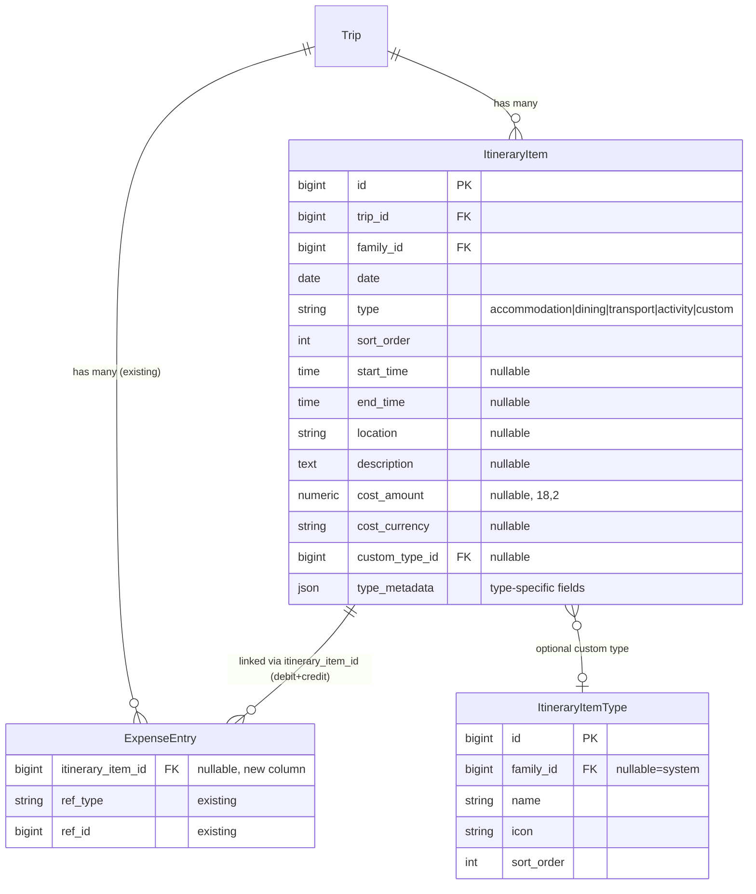
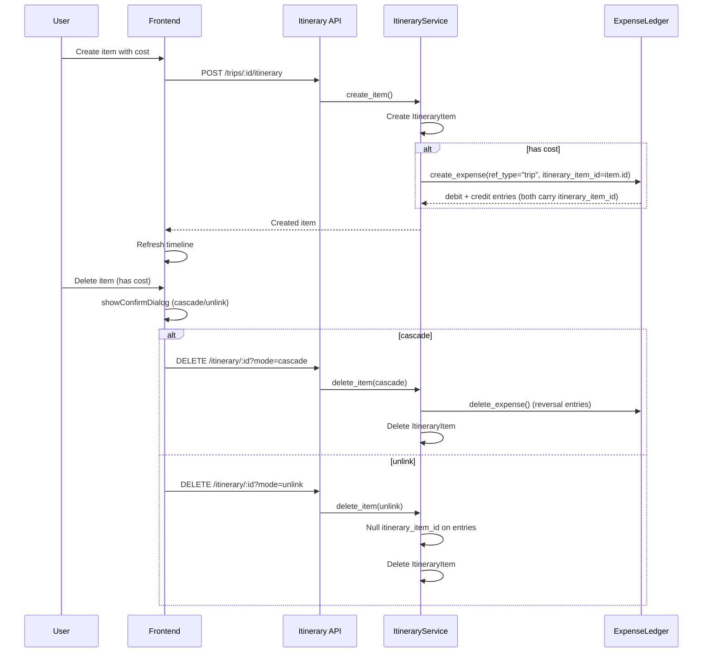

# Travel Itinerary Planning - Plan

## Goal Capsule

- **Objective:** Add day-by-day itinerary planning with a vertical card timeline as the trip detail page's main view. Support four core item types (accommodation, dining, transport, activity) plus extensible custom types, with optional cost linking to the expense ledger.
- **Authority:** Brainstorm Product Contract (8 Key Decisions from dialogue)
- **Stop conditions:** All Requirements satisfied; Acceptance Examples pass; no P0/P1 open questions remain
- **Execution profile:** Full-stack — ORM model → Alembic migration → Pydantic schemas → API routes → Frontend timeline component → Tests

---

## Product Contract

### Summary

A day-by-day itinerary planner layered onto the existing travel module. A vertical card timeline becomes the trip detail page's main view, replacing the flat expense list. Users create itinerary items (accommodation, dining, transport, activity, or custom types) per day, optionally attach costs that auto-sync to the expense ledger, and view both planned items and standalone expenses on one unified timeline.

### Problem Frame

The current travel module tracks expenses but has no schedule or itinerary structure. Users can see *how much* they spent on a trip, but not *what they did each day*. The timeline — what happened when, where, and for how much — lives in separate apps (social media notes, messaging threads, memory). This disconnect means the financial data and the experiential plan are two unrelated views of the same trip.

### Key Decisions

**Schedule-first model over expense-first.** Itinerary items are scheduled events (date, time, type, location) with optional cost, not expense records with scheduling metadata added. The timeline is the primary view; expenses are derived. (session-settled: user-directed — chosen over expense-first: trip planning is inherently schedule-oriented)

**Flat ItineraryItem over Day+Item two-layer model.** Each item carries `date` and `sort_order`; the frontend groups by date to render day sections. No separate Day entity. (session-settled: user-approved — chosen over hierarchical model: sufficient for current needs, avoids over-engineering)

**Expense ledger auto-sync.** When an itinerary item has a cost, a corresponding expense entry is created in the ledger automatically. Both share the same data source for financial reporting. (session-settled: user-approved — chosen over independent cost fields: unified financial view)

**Timeline as main trip detail view.** The vertical card timeline replaces the existing expense list as the trip detail page's primary content. (session-settled: user-directed — chosen over tab-based or separate-page layouts: single-page overview)

**Dual expense paths coexist.** Users can add costs via itinerary items (planned) or standalone expense entries (unplanned). The timeline shows both with distinct visual styles. (session-settled: user-approved — chosen over itinerary-only or fully independent: preserves existing workflow while enabling new path)

**Delete with secondary confirmation.** Deleting an itinerary item with a linked expense prompts the user to choose: cascade delete or unlink (expense becomes standalone). (session-settled: user-directed — chosen over auto-cascade or auto-unlink: prevents accidental data loss while giving user control)

**Product Contract preservation:** Unchanged from brainstorm. All R-IDs, A-IDs, F-IDs, AE-IDs preserved verbatim.

### Requirements

**Itinerary Item Structure**

R1. System supports four core item types: accommodation, dining, transport, activity. Each type has a distinct icon and type-specific fields.
R2. Accommodation items support check-in time and check-out time.
R3. Dining items support number of diners.
R4. Transport items support origin and destination.
R5. Activity items support ticket/admission price.
R6. System supports user-defined custom item types beyond the four core types. Custom types have a user-defined name and icon/color.
R7. Time granularity defaults to date only. Users can optionally add start time and/or end time. Time fields are not required.
R8. Each itinerary item supports an optional description/note field.
R9. Each itinerary item supports an optional location/address field.

**Expense Integration**

R10. An itinerary item can optionally have an associated cost (amount + currency).
R11. When an itinerary item with a cost is created, a corresponding expense entry is automatically created in the expense ledger linked to the same trip.
R12. Editing the cost on an itinerary item syncs the change to the linked expense entry.
R13. Deleting an itinerary item that has a linked expense shows a confirmation dialog with two choices: "cascade delete" (removes both the item and its expense entry) or "unlink" (removes the item; the expense entry remains as a standalone expense).
R14. Itinerary items without costs (free activities, sightseeing) are fully valid and display on the timeline.

**Timeline Display**

R15. The trip detail page displays a vertical card timeline as its main view.
R16. The timeline shows all days from the trip's `departure_date` to `return_date`, inclusive. Days without items show an empty state with an "add" prompt.
R17. Itinerary items display as cards with type-specific icon, time (if set), location, and cost summary.
R18. Standalone expenses (not linked to any itinerary item) display on their date as simpler entries, visually distinct from itinerary item cards.
R19. Users can add new itinerary items directly from the timeline view.

### Actors

A1. **Family member** — creates, edits, and deletes itinerary items within their family's trips. Has full access to the timeline.
A2. **External participant (guest)** — can view the timeline of shared trips (via existing split group access), but cannot edit itinerary items.

### Key Flows

F1. Create itinerary item with cost
- **Trigger:** User taps "add" on a day in the timeline
- **Steps:** User selects item type → fills type-specific fields (time, location, description) → optionally enters cost amount and currency → submits → system creates ItineraryItem + auto-creates linked ExpenseEntry in the ledger
- **Covers R1–R11, R15, R19.**

F2. Delete itinerary item with linked expense
- **Trigger:** User swipes or taps delete on an itinerary item
- **Steps:** System detects linked expense → shows confirmation dialog: "cascade delete" or "unlink" → user chooses → system executes accordingly
- **Covers R13.**

F3. View unified timeline
- **Trigger:** User opens trip detail page
- **Steps:** System loads all itinerary items for the trip + standalone expenses → groups by date → renders vertical card timeline with all days from start to end → itinerary items show as rich cards; standalone expenses show as simple entries
- **Covers R14–R18.**

### Acceptance Examples

AE1. Three-day trip with mixed item types
- **Covers R1–R7, R15–R17.**
- **Given:** A trip from 2026-10-01 to 2026-10-03
- **When:** User creates: Day 1 accommodation (check-in 14:00, ¥500), Day 1 dining (18:30, 4 people, ¥280), Day 2 activity (no cost), Day 3 transport (destination: airport, ¥120)
- **Then:** Timeline shows 3 day sections. Day 1 has 2 cards. Day 2 has 1 card (activity, no price shown). Day 3 has 1 card.

AE2. Timeline with standalone expense mixed in
- **Covers R14, R18.**
- **Given:** The trip from AE1, plus a standalone expense of ¥50 " souvenirs" on 2026-10-02
- **Then:** Day 2 shows the activity card AND a simpler expense entry for the souvenirs, visually distinct from the activity card.

AE3. Delete with unlink
- **Covers R13.**
- **Given:** Day 1 dining item with linked ¥120 expense
- **When:** User deletes the dining item, chooses "unlink"
- **Then:** Dining card disappears from timeline. The ¥120 expense remains as a standalone entry under Day 1. Trip's `actual_spend` is unchanged.

AE4. Empty day display
- **Covers R16.**
- **Given:** A trip from 2026-10-01 to 2026-10-05 with no items on Oct 4
- **Then:** Oct 4 section shows on the timeline with an empty state and "add" prompt.

### Scope Boundaries

**Deferred for later:**
- Drag-and-drop reordering of items within/across days
- Photo attachments on itinerary items
- Per-day budget tracking (budget vs actual per day)
- AI-powered itinerary suggestions
- Itinerary templates / reuse across trips
- Itinerary-level split cost allocation (split works at expense level, unchanged)

### How This Work Fits Together

This plan owns the itinerary planning and timeline display feature within the travel module. The broader travel module (trips, expense ledger, split groups, wish graduation, receipt parsing, dashboard integration) was established in `docs/plans/2026-09-20-001-feat-family-travel-module-plan.md`.

- **Depends on** the existing Trip model, expense ledger, and trip detail page infrastructure
- **Extends** the trip detail page's main view from flat expense list to timeline
- **Does not modify** split group logic, wish graduation, or receipt parsing — these remain unchanged

### Outstanding Questions

**Deferred to Planning:**
- How does the timeline handle trips without an explicit `return_date`?
- Custom type storage: shared per-family or per-trip?
- Should the timeline use virtual scrolling for long trips (20+ days)?
- How to handle timezone display for multi-timezone trips?

---

## Planning Contract

### Key Technical Decisions

KTD1. **ItineraryItem links to expense ledger via `itinerary_item_id` on ExpenseEntry.** Add an optional `itinerary_item_id` column to `expense_entries`. When an itinerary item has a cost, the expense ledger creates debit+credit entries with `ref_type="trip"`, `ref_id=trip_id` (so `trip.actual_spend` updates correctly via the existing `_family_proportional_share` logic), AND `itinerary_item_id=<item.id>` for back-reference. On delete, cascade mode calls `expense_ledger.delete_expense()` (reversal entries); unlink mode nulls `itinerary_item_id` on the existing entries. (Governs R11, R12, R13.)

KTD2. **`cost_amount` and `cost_currency` stored on ItineraryItem as convenience cache.** The ItineraryItem model carries `cost_amount: Numeric(18,2)` and `cost_currency: String(10)` for quick display without joining the expense ledger. These are updated atomically with the ledger sync — not an independent source of truth. The expense entries remain authoritative for financial data.

KTD3. **ItineraryItemType as family-scoped model (mirrors ExpenseCategory pattern).** Custom types are stored in an `itinerary_item_types` table with `family_id` FK (nullable = system default), `name`, `icon`, and `sort_order`. Follows the same pattern as `ExpenseCategory` for consistency. Seeded system defaults: none — users create their own. Core types (accommodation/dining/transport/activity) are hardcoded enum values on ItineraryItem, NOT in this table. (Governs R6.)

KTD4. **Timeline component uses day-grouped vertical layout with CSS-class-based theming.** Day sections use `van-cell-group inset` containers. Itinerary item cards use CSS classes for type-specific styling (never inline styles — dark mode support per existing pitfall). The timeline fetches all items for the trip in one API call, groups by date on the frontend, and renders all days from `departure_date` to `return_date`.

KTD5. **Resolve: trips without `return_date` show `departure_date` through `departure_date + 7 days` as default range.** When `return_date` is null, the timeline defaults to showing 7 days from departure. The user can extend by editing the trip's return date. (Resolves Outstanding Question #1.)

KTD6. **Resolve: custom types are family-scoped, not trip-scoped.** A family creates custom types once and reuses them across trips. Follows the ExpenseCategory pattern where `family_id` scopes ownership. (Resolves Outstanding Question #2.)

### High-Level Technical Design

---

## Implementation Units

### U1. ItineraryItem model, ItineraryItemType model, and Alembic migration

- **Goal:** Create the database models for itinerary items and custom types, plus the migration to add them and the `itinerary_item_id` column on `expense_entries`.
- **Requirements:** R1–R9, R6
- **Dependencies:** none
- **Files:**
  - `server/packages/db/models/itinerary_item.py` (create)
  - `server/packages/db/models/itinerary_item_type.py` (create)
  - `server/apps/backend/app/models/itinerary_item.py` (create — re-export shim)
  - `server/apps/backend/app/models/itinerary_item_type.py` (create — re-export shim)
  - `server/packages/db/models/__init__.py` (modify — register new models)
  - `server/apps/backend/app/models/__init__.py` (modify — register new models)
  - `server/apps/backend/alembic/versions/` (create — new migration)
  - `server/tests/backend/test_models_itinerary.py` (create)
- **Approach:**
  1. Create `ItineraryItemType` model: `id`, `family_id` (nullable), `name` (String 50), `icon` (String 50), `sort_order` (Integer). Follow `ExpenseCategory` pattern.
  2. Create `ItineraryItem` model: `id` (BigInteger, next_id), `trip_id` (FK trips), `family_id` (FK families), `date` (Date, not null), `type` (String 20, not null — enum: accommodation/dining/transport/activity/custom), `sort_order` (Integer, default 0), `start_time` (Time, nullable), `end_time` (Time, nullable), `location` (String 200, nullable), `description` (Text, nullable), `cost_amount` (Numeric(18,2), nullable), `cost_currency` (String 10, nullable), `custom_type_id` (FK itinerary_item_types, nullable), `type_metadata` (JSON, nullable — for type-specific fields like check-in time, diners count, origin/destination), `created_at`, `updated_at` (UTCDateTime).
  3. Add `itinerary_item_id` column to `ExpenseEntry`: `BigInteger, nullable, FK itinerary_items.id`. This is the back-reference for linked expenses.
  4. Create Alembic migration following existing patterns: `sa.DateTime(timezone=True)` for timestamps, `sa.Numeric(precision=18, scale=2)` for money, `server_default=sa.text("0")` for Decimal defaults. Create indexes on `trip_id` and `family_id`.
  5. Follow model placement convention: canonical in `packages/db/models/`, re-export shim in `apps/backend/app/models/`.
- **Patterns to follow:** `server/packages/db/models/trip.py` (field patterns), `server/packages/db/models/expense_category.py` (family-scoped type pattern), `server/apps/backend/alembic/versions/3fee53d71f7e` (migration patterns)
- **Test scenarios:**
  - Create ItineraryItem with all required fields, verify defaults
  - Create ItineraryItem with optional cost fields, verify nullable
  - Create ItineraryItemType with family_id, verify FK constraint
  - Verify `itinerary_item_id` on ExpenseEntry is nullable and can reference an ItineraryItem
  - Verify migration is idempotent (upgrade + downgrade + upgrade)
- **Verification:** `cd server && uv run pytest tests/backend/test_models_itinerary.py -v` passes; `uv run alembic upgrade head` succeeds

---

### U2. Itinerary service and API routes with expense ledger integration

- **Goal:** Implement CRUD operations for itinerary items with automatic expense ledger sync, plus the REST API routes.
- **Requirements:** R10–R13, F1, F2
- **Dependencies:** U1
- **Files:**
  - `server/apps/backend/app/services/itinerary.py` (create)
  - `server/apps/backend/app/services/itinerary_type.py` (create)
  - `server/apps/backend/app/schemas/itinerary_item.py` (create)
  - `server/apps/backend/app/routers/itinerary.py` (create)
  - `server/apps/backend/app/routers/itinerary_types.py` (create)
  - `server/apps/backend/app/routers/__init__.py` (modify — register routers)
  - `server/apps/backend/app/schemas/expense_entry.py` (modify — add `itinerary_item_id` to ExpenseEntryCreate)
  - `server/apps/backend/app/services/expense_ledger.py` (modify — propagate `itinerary_item_id` in `common=dict(...)`)
  - `server/packages/core/app/errors/codes.py` (modify — add error codes)
  - `server/tests/backend/test_itinerary_service.py` (create)
  - `server/tests/backend/test_itinerary_api.py` (create)
- **Approach:**
  1. Create Pydantic schemas: `ItineraryItemCreate` (date, type, sort_order, start_time, end_time, location, description, cost_amount, cost_currency, custom_type_id, type_metadata), `ItineraryItemResponse` (inherits SnowflakeBase, all fields). Money fields: `str` in response with `coerce_money_str` validator; `Decimal` in create with `coerce_to_decimal`.
  2. Extend `ExpenseEntryCreate` schema with `itinerary_item_id: int | None = None`. Update `expense_ledger.create_expense()` to propagate `itinerary_item_id` into the `common=dict(...)` that builds both ORM entries. This is a non-breaking addition — existing callers pass nothing and get None.
  3. Create `ItineraryService`:
     - `create_item(db, trip, data)`: validate trip ownership, validate type (core or custom), create ItineraryItem. If cost present: call `expense_ledger.create_expense()` with `ref_type="trip"`, `ref_id=trip.id`, `itinerary_item_id=item.id`.
     - `update_item(db, item, data)`: if cost changed, reverse old expense and create new one. If cost removed (set to null), reverse old expense only. Update item fields. Note: the existing `delete_expense()` and `create_expense()` each commit internally — wrap the update in an outer transaction by passing a `no_commit=True` flag or refactoring to share a session boundary.
     - `delete_item(db, item, mode)`: query linked entries via `ExpenseEntry WHERE itinerary_item_id=item.id AND leg_type='debit'` to find the debit entry. mode="cascade" → call `expense_ledger.delete_expense(debit_entry.id)` (reverses both legs via transfer_id). mode="unlink" → null `itinerary_item_id` on all linked entries (debit + credit), then delete item.
     - `list_items(db, trip_id)`: return all items for trip, ordered by date + sort_order.
  4. Create API router at `/api/v1/trips/{trip_id}/itinerary`:
     - `GET ""` — list items for trip
     - `POST ""` — create item (201)
     - `PATCH "/{item_id}"` — update item
     - `DELETE "/{item_id}"` — delete item, required query param `mode=cascade|unlink` (return 400 if omitted and item has linked expense)
     - Auth: `Depends(require_adult)`, validate trip ownership via `trip_service.get_trip()`
  5. Create ItineraryItemType CRUD at `/api/v1/itinerary-types` (family-scoped, mirrors ExpenseCategory pattern):
     - `GET ""` — list family's custom types
     - `POST ""` — create custom type (201)
     - `PATCH "/{type_id}"` — update custom type
     - `DELETE "/{type_id}"` — delete custom type (reject if in use by any ItineraryItem)
  6. Add error codes: `ITINERARY_ITEM_NOT_FOUND`, `INVALID_ITEM_TYPE`, `ITINERARY_TYPE_IN_USE`.
- **Patterns to follow:** `server/apps/backend/app/services/expense_ledger.py` (ledger integration), `server/apps/backend/app/routers/expenses.py` (nested router pattern, auth, 201 status), `server/packages/db/models/expense_category.py` (family-scoped type CRUD pattern)
- **Test scenarios:**
  - Covers AE1. Create items of each core type, verify response shape
  - Create item with cost → verify expense entries created (debit + credit) with `itinerary_item_id` set
  - Create item without cost → verify no expense entries created
  - Update item cost → verify old expense reversed, new expense created
  - Update item to remove cost (set cost_amount=null) → verify old expense reversed, item cost fields nulled, `trip.actual_spend` decreases
  - Covers AE3. Delete item with cost (cascade) → verify expense entries reversed, item deleted
  - Delete item with cost (unlink) → verify expense entries remain with `itinerary_item_id` nulled, item deleted
  - Delete item without cost → verify item deleted, no ledger interaction
  - Covers R12. Edit cost on item → verify `trip.actual_spend` updates correctly
  - Custom type: create item with `type="custom"` and `custom_type_id` → verify FK validated
  - ItineraryItemType CRUD: create, list, update, delete custom type
  - ItineraryItemType delete in use → reject with ITINERARY_TYPE_IN_USE
  - DELETE without mode param on item with expense → 400
  - Error: create item for non-existent trip → 404
  - Error: create item with invalid type → 422
- **Verification:** `cd server && uv run pytest tests/backend/test_itinerary_service.py tests/backend/test_itinerary_api.py -v` passes

---

### U3. Frontend types, API client, and Pinia store integration

- **Goal:** Add TypeScript types, API functions, and Pinia store actions for itinerary items.
- **Requirements:** R1–R19 (frontend support)
- **Dependencies:** U2
- **Files:**
  - `frontend/apps/main/src/types/travel.ts` (modify — add ItineraryItem, ItineraryItemType interfaces)
  - `frontend/apps/main/src/api/travel.ts` (modify — add itinerary API functions)
  - `frontend/apps/main/src/stores/travel.ts` (modify — add itinerary state and actions)
  - `frontend/apps/main/src/i18n/locales/zh-CN.ts` (modify — add itinerary i18n keys)
  - `frontend/apps/main/src/i18n/locales/en-US.ts` (modify — add itinerary i18n keys)
- **Approach:**
  1. Add types to `types/travel.ts`: `ItineraryItemType` (id, family_id, name, icon, sort_order), `ItineraryItem` (id, trip_id, family_id, date, type, sort_order, start_time, end_time, location, description, cost_amount, cost_currency, custom_type_id, type_metadata, created_at, updated_at). All IDs as `string`, money as `string`.
  2. Add API functions to `api/travel.ts`: `fetchItineraryItems(tripId)`, `createItineraryItem(tripId, data)`, `updateItineraryItem(tripId, itemId, data)`, `deleteItineraryItem(tripId, itemId, mode)`. Also: `fetchItineraryTypes()`, `createItineraryType(data)`, `deleteItineraryType(typeId)`. Follow existing `http` wrapper pattern.
  3. Add to Pinia store (`stores/travel.ts`): `itineraryItems = ref<ItineraryItem[]>([])`, `itineraryItemTypes = ref<ItineraryItemType[]>([])`, `fetchItinerary(tripId)` action, `fetchItineraryTypes()` action, `createItineraryItem(tripId, data)` action (with offline support following existing `createExpense` pattern), `deleteItineraryItem(tripId, itemId, mode)` action. Add to `$reset()`.
  4. Add i18n keys under `travel.itinerary.*`: item type names, form labels, delete confirmation messages, empty state text.
- **Patterns to follow:** `frontend/apps/main/src/types/travel.ts` (type conventions), `frontend/apps/main/src/api/travel.ts` (API patterns), `frontend/apps/main/src/stores/travel.ts` (store patterns, offline queue)
- **Test scenarios:**
  - Type check: `ItineraryItem` has all required fields with correct types
  - API: `fetchItineraryItems` calls correct endpoint, returns typed data
  - Store: `fetchItinerary` populates `itineraryItems` ref
- **Verification:** `cd frontend && pnpm run typecheck` passes; no TypeScript errors

---

### U4. ItineraryTimeline and ItineraryItemForm components

- **Goal:** Build the vertical card timeline component and the item creation/edit form.
- **Requirements:** R15–R19, F1, F3
- **Dependencies:** U3
- **Files:**
  - `frontend/apps/main/src/components/travel/ItineraryTimeline.vue` (create)
  - `frontend/apps/main/src/components/travel/ItineraryItemCard.vue` (create)
  - `frontend/apps/main/src/components/travel/ItineraryItemForm.vue` (create)
  - `frontend/apps/main/src/components/travel/ExpenseTimelineEntry.vue` (create — standalone expense display on timeline)
- **Approach:**
  1. `ItineraryTimeline.vue`: accepts `tripId`, `departureDate`, `returnDate` props. Fetches itinerary items + standalone expenses via store. Computes day range from departure to return (or departure + 7 days if no return). Groups items by date. Renders vertical timeline:
     - Day section header (date + weekday) with `role="listitem"` and `aria-label` for date
     - Cards sorted by sort_order within each day; items with equal sort_order ordered by start_time then created_at
     - Empty day state with "+" button (Covers R16, R19)
     - Standalone expenses rendered as `ExpenseTimelineEntry` (simpler style)
     - **Initial empty state:** when zero items exist across all days, show a trip-level empty state (illustration + "Plan your trip — add your first activity") above the day sections. Switch to per-day empty states once at least one item exists.
     - Timeline container uses `role="list"` for accessibility.
  2. `ItineraryItemCard.vue`: renders a single itinerary item. Type-specific icon using Iconify icon names (accommodation=`hotel`, dining=`restaurant`, transport=`car`, activity=`map-marker`, custom=`custom_type.icon`). Shows time (if set), location, description, cost (if any). **Linked expense indicator:** when `cost_amount` is set, show a small chain-link icon or "Ledger" badge on the card to signal the item is synced to the expense ledger. **Interaction:** `van-swipe-cell` with left action = edit button (pencil icon), right action = delete button. Tapping the card body also opens the edit form. Emits `edit` and `delete` events.
  3. `ItineraryItemForm.vue`: popup form (`van-popup position="bottom"`) for creating/editing items. Type selector (segmented control or picker) — includes an "+ Add custom type" option at the bottom that opens a small inline form (name + icon picker) to create an `ItineraryItemType` and auto-select it. Date picker (`van-field :model-value` + `van-popup` + `van-date-picker`). Optional time pickers. Type-specific fields (dynamic based on selected type — rendered via `type_metadata`). **Type-switching behavior:** switching type clears type_metadata fields for the previous type. In edit mode, show confirmation dialog before clearing. Optional cost section (amount + currency). Location and description fields. **Submit states:** submit button disabled with loading spinner while API call in flight; on success close popup and show success toast; on API error show error toast and keep form open with data preserved. All form inputs have associated labels for accessibility. Minimum 44×44px touch targets on all interactive elements.
  4. `ExpenseTimelineEntry.vue`: simpler card for standalone expenses. Shows date, category icon, amount, description. No type-specific fields. Visually distinct from `ItineraryItemCard` (smaller, no icon badge, muted style).
  5. Delete confirmation: when `ItineraryItemCard` emits `delete` for an item with cost, parent shows `showConfirmDialog` with two buttons: "Cascade Delete" and "Unlink". Follows existing Vant confirmation pattern.
  6. Dark mode: all styling via CSS variables and classes (never inline styles). Use `var(--card-bg)`, `var(--text-primary)`, etc. Use semantic modifier classes for per-type theming (`.timeline-card--accommodation`, `.timeline-card--dining`, etc.), not `:nth-child(N)`.
  7. Popups inside timeline: use `teleport="body"` for any `van-popup` or `van-action-sheet` to avoid clipping inside transformed containers.
- **Patterns to follow:** `frontend/apps/main/src/components/travel/ExpenseListPanel.vue` (date grouping, swipe-to-delete), `frontend/apps/main/src/components/travel/TravelTripCard.vue` (card styling), `docs/solutions/best-practices/main-app-ui-design-patterns-2026-08-03.md` (Vant component mappings)
- **Test scenarios:**
  - Covers AE1. Timeline with 3 days, mixed item types → correct day sections and cards
  - Covers AE2. Timeline with standalone expense mixed in → expense shows as simpler entry
  - Covers AE4. Empty day → shows empty state with add button
  - Empty trip (zero items) → shows trip-level empty state with guidance
  - Item card shows type-specific icon and fields
  - Item card with cost shows linked expense indicator
  - Form validates required fields (date, type)
  - Form with cost: amount and currency fields appear
  - Form submit: button shows loading state, closes on success, shows error toast on failure
  - Form type switch: clears type_metadata, shows confirmation in edit mode
  - Custom type: "+ Add custom type" creates ItineraryItemType and auto-selects
  - Delete with cost: confirmation dialog shows cascade/unlink options
  - Delete without cost: no confirmation dialog, item deleted directly
  - Card edit: tap card body opens edit form; left swipe shows edit button
  - Dark mode: cards use CSS variables, no inline color styles
  - Accessibility: timeline has role="list", cards have aria-label, touch targets ≥ 44px
- **Verification:** Manual testing in browser — create items, verify timeline renders correctly; test on mobile viewport

---

### U5. TripDetailPage integration — timeline as main view

- **Goal:** Replace the expense list as the primary content on the trip detail page with the itinerary timeline. Keep the existing expense list and split group accessible but secondary.
- **Requirements:** R15, F3
- **Dependencies:** U4
- **Files:**
  - `frontend/apps/main/src/pages/TravelDetailPage.vue` (modify)
- **Approach:**
  1. Replace the `ExpenseListPanel` as the primary content below the info card with `ItineraryTimeline`.
  2. Keep the existing page header, status section, and info card unchanged.
  3. Move `ExpenseListPanel` and `SplitGroupManager` to a collapsible "Details" section below the timeline (using `van-collapse`). The expense list is reference content users may want while viewing the timeline; the FAB remains for additive actions only.
  4. Update FAB button: "Add itinerary item" becomes the primary action. "Add standalone expense" remains as a secondary option.
  5. Update `onMounted` / `onActivated` data loading: add `store.fetchItinerary(tripId)` and `store.fetchItineraryTypes()` to the `Promise.all` call.
  6. Wire up the edit/delete flows: timeline emits events → page handles form popup and delete confirmation.
- **Patterns to follow:** existing `TravelDetailPage.vue` structure, `showConfirmDialog` pattern for destructive actions
- **Test scenarios:**
  - Page loads → timeline displays as primary content
  - Existing trip data → expenses still visible on timeline as standalone entries
  - FAB → "Add itinerary item" opens form popup
  - FAB → "Add expense" still works (existing flow)
  - Navigation: tab → trip detail → back → tab works without blank screen (test Transition/KeepAlive interaction)
- **Verification:** Manual E2E test: create trip, add items, verify timeline; verify existing expense flow still works

---

## Verification Contract

| Gate | Command | Scope |
|------|---------|-------|
| Backend unit tests | `cd server && uv run pytest tests/backend/test_models_itinerary.py tests/backend/test_itinerary_service.py tests/backend/test_itinerary_api.py -v` | U1, U2 |
| Backend travel regression | `cd server && uv run pytest tests/backend/test_travel_expenses.py tests/backend/test_travel_dashboard.py -v` | Ensure no regression in existing travel tests |
| Frontend type check | `cd frontend && pnpm run typecheck` | U3, U4, U5 |
| Migration | `cd server && uv run alembic upgrade head` then `uv run alembic downgrade -1` then `uv run alembic upgrade head` | U1 idempotency |
| Full backend suite | `cd server && uv run pytest tests/backend/ -v --timeout=60` | No regressions |

---

## Definition of Done

1. All 5 implementation units pass their verification gates
2. Acceptance Examples AE1–AE4 pass (manual or automated verification)
3. No regression in existing travel module tests (U2 backend travel regression gate)
4. Frontend typecheck passes with zero errors
5. Alembic migration is idempotent (upgrade → downgrade → upgrade)
6. Timeline displays correctly on mobile viewport (Vant4 mobile-first)
7. Dark mode: all new components use CSS variables, no inline color styles
8. Accessibility: timeline has `role="list"`, day sections have `aria-label`, cards have `aria-label` describing type + time + location, all interactive elements ≥ 44×44px touch targets, form inputs have associated labels
9. i18n: all new user-facing strings have zh-CN and en translations
10. No dead code or experimental artifacts remain in the diff
