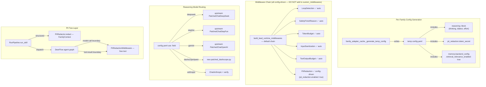

# DeerFlow 集成差距分析 - Plan

## Goal Capsule

**Objective**: 对比 Numina 当前 DeerFlow 集成（pin `6556d09d`, 2026-08-07）与上游 HEAD（`712a11c0`, 2026-09-28）的能力差异，识别值得引入增强的上游新能力，并实施 Phase 2 增强。

**Product authority**: 分析型 + 实施型交付 — Phase 1 已完成（差距分析 + submodule 升级），Phase 2 进入实施（reasoning contract、PII middleware、memory 增强、middleware 挂载）。

**Upstream gap**: 693 commits, ~7 weeks of development (Aug 7 → Sep 28). ✅ Phase 1 已追平。

---

## Product Contract

### Summary

Phase 1（已完成）将 HARNESS_VERSION 从 `6556d09d` 升级到 `712a11c0`，获取了上游 693 个 commit 的修复和增强。Phase 2 将上游能力引入 Numina：声明式 Reasoning Contract（替代手写 thinking 补丁）、两层 PII 脱敏（上游 config-driven 中间件 + 自建结构化脱敏共存）、DeerMem 相关性排序。保护性中间件（LoopDetection、SafetyFinishReason、ToolOutputBudget、PiiRedaction）均已在默认链或由 config 驱动启用。

### Problem Frame

Numina 在 Phase 1 升级后已获取上游修复（MCP 死锁、think-block 剥离、deep-merge 等），但仍有四个领域依赖手写补丁或未启用上游增强：

1. **Reasoning patches** — `patched_reasoning_chat.py` 和 `patched_anthropic.py` 手写了 reasoning_content 捕获和 multi-turn replay，上游已有声明式 `ReasoningCapabilities` 契约和 per-vendor patched classes
2. **PII 脱敏** — 自建 `PIIRedactor` 仅覆盖正则匹配的自由文本和结构化数据，缺少 tool-result 边界脱敏和 memory 注入路径脱敏
3. **Memory 检索** — `retrieval_relevance_enabled` 未启用，记忆注入基于时间排序而非相关性
4. **Middleware 链** — `LoopDetection`、`SafetyFinishReason`、`ToolOutputBudget` 已在默认链（自动获得），`PiiRedaction` 通过 config 启用（`pii_redaction.enabled: true`）

### Requirements

**Reasoning Contract 迁移**

- R1. 在 `family_adapter_cache._generate_temp_config()` 生成的 per-family 临时 YAML 中写入 `reasoning:` 声明式契约块，包含 `thinking`、`dialect`、`effort` 字段
- R2. 将 `config.yaml` 模型配置的 `use:` 字段指向上游 per-vendor patched classes（`deerflow.models.patched_deepseek:PatchedChatDeepSeek`、`deerflow.models.patched_stepfun:PatchedChatStepFun`、`deerflow.models.patched_openai:PatchedChatOpenAI`）
- R3. 为 DashScope/Qwen 编写上游风格的 `patched_dashscope.py`（捕获 `reasoning_content` from streaming delta），替代现有通用的 `patched_reasoning_chat.py`
- R4. 验证 `patched_anthropic.py` 是否可删除 — 上游 `_extract_text(thinking_sink=...)` 是否已满足下游 `reasoning_content` 需求

**PII 两层脱敏**

- R5. 通过配置启用上游 `PiiRedactionMiddleware`（在临时 YAML 中写入 `pii_redaction.enabled: true`），处理 free-text user message 和 tool-result 边界脱敏。注意：上游 `build_lead_runtime_middlewares()` 根据 config 自动实例化该中间件，**不得**通过 `custom_middlewares` 挂载（会触发类名去重 AssertionError）
- R6. 保留 Numina `PIIRedactor.redact()` 对结构化 `FamilyContext` 的脱敏（资产/负债/成员名称、机构、金额）— 上游中间件不处理此类数据
- R7. 为 PII 中间件生成 per-deployment `token_secret`（256-bit HMAC key，SHA-256 full output → hex），写入 per-family 临时配置

**Memory 增强**

- R8. 在 `deerflow_config/base/config.yaml` 的 `memory.backend_config` 下启用 `retrieval_relevance_enabled: true`
- R9. 保持 `memory_config_bridge.py` 不变 — ContextVar 传播修复是 Numina 多租户独有需求

**Middleware 挂载**

- R10. 确认 `ToolOutputBudgetMiddleware` 已在默认链中（上游 `build_lead_runtime_middlewares()` 无条件添加），可选配置 `tool_output` 块调整预算参数
- R11. 不将 `LoopDetectionMiddleware`、`SafetyFinishReasonMiddleware`、`ToolOutputBudgetMiddleware`、`PiiRedactionMiddleware` 加入 `custom_middlewares`（均在默认链或由 config 驱动，重复挂载会触发 AssertionError）

### Scope Boundaries

**Deferred for later (Phase 3)**
- Subagent 委托系统 — 需确保 family_id ContextVar 传播到 subagent runtime
- Guardrails 护栏 — 需要 TypeSafe/Jev API key
- Scheduler 统一 — 需与现有 scheduler_worker 合并

**Outside this plan's identity**
- Plugin 系统（MCP + skill 已够用）
- RAGFlow 知识检索（需要产品决策）
- IM Channels（需要产品方向）
- Blob Storage（当前方案够用）

### Outstanding Questions

- Q1. `patched_anthropic.py` 可删除性需运行时验证 — `reasoning_content` 是否通过 `additional_kwargs` 传递到 `reasoning_delta` SSE 事件？(deferred to implementation)
- Q2. DashScope/Qwen 的 `reasoning:` 块中 `dialect` 应设为 `openai_extra_body` 还是 `auto`？(deferred to implementation — `auto` 推断应能正确处理)

---

## Planning Contract

### Key Technical Decisions

KTD1. **两层 PII 方案（而非替代）** — 上游 `PiiRedactionMiddleware` 在 LangGraph agent 图内处理 `HumanMessage` 和 tool result 的 free-text 脱敏；Numina `PIIRedactor` 在 dispatch 前处理结构化 `FamilyContext`（资产/负债/成员数据）。两层互补：上游覆盖 agent 运行时的 PII 泄漏路径（tool boundary、memory enqueue、compaction），Numina 覆盖上游不知道的业务数据结构。

KTD2. **Reasoning Contract 使用上游 per-vendor patched classes** — 不再维护通用的 `PatchedChatReasoning`，改为 config.yaml `use:` 字段指向上游对应的 patched class。上游已有 `PatchedChatDeepSeek`、`PatchedChatStepFun`、`PatchedChatOpenAI`（Gemini）、`PatchedChatMiMo`、`PatchedChatMiniMax`。DashScope/Qwen 需新写 `patched_dashscope.py`，因为上游没有通用 OpenAI-compatible reasoning capture class。

KTD3. **中间件均在默认链或由 config 驱动** — 上游 `build_lead_runtime_middlewares()` 包含：`LoopDetectionMiddleware`（无条件）、`SafetyFinishReasonMiddleware`（条件）、`ToolOutputBudgetMiddleware`（无条件）、`PiiRedactionMiddleware`（`pii_redaction.enabled: true` 时）、`InputSanitizationMiddleware`（无条件）。Numina 自动获得这些中间件，**不得**添加到 `custom_middlewares`（会触发类名去重 AssertionError）。

KTD4. **`reasoning:` 块写入 per-family 临时 YAML** — Numina 的多租户架构要求每个家庭有独立的 model config。`family_adapter_cache._generate_temp_config()` 必须在生成的临时 YAML 中写入 `reasoning:` 块（基于家庭的 `ai_provider` 配置），而非仅在 `base/config.yaml` 模板中配置。

KTD5. **`token_secret` 使用 deployment-level 固定值** — PII 中间件的 HMAC key 使用 per-deployment 固定值（从 `SECRET_KEY` 派生或独立生成），而非 per-family 动态生成。所有家庭共享同一 `token_secret`，PII 占位符在同一部署内跨家庭稳定。

### High-Level Technical Design



---

## Implementation Units

### U1. Reasoning Contract — per-family config + model routing

**Goal:** 将 Numina 的 reasoning 配置从手写 patch 迁移到上游声明式 `ReasoningCapabilities` 契约。

**Requirements:** R1, R2, R3, R4

**Dependencies:** none

**Files:**
- `server/apps/agent/services/deerflow_adapter/family_adapter_cache.py` — 在 `_generate_temp_config()` 中写入 `reasoning:` 块
- `server/apps/agent/deerflow_config/base/config.yaml` — 更新模型 `use:` 字段指向上游 patched classes
- `server/apps/agent/services/deerflow_adapter/patched_dashscope.py` — 新建，上游风格的 DashScope/Qwen reasoning_content 捕获
- `server/apps/agent/services/deerflow_adapter/patched_reasoning_chat.py` — 标记废弃或删除（被 `patched_dashscope.py` + 上游 classes 替代）
- `server/apps/agent/services/deerflow_adapter/patched_anthropic.py` — 验证后可删除
- `server/apps/agent/services/deerflow_adapter/client_factory.py` — 更新模型路由逻辑
- `server/packages/core/model_entry.py` — 更新 `_THINKING_CLASS_OVERRIDES` 映射

**Approach:**
1. 在 `_generate_temp_config()` 中，根据家庭 `ai_provider` 的 `thinking_supported` 标志和 provider 类型，生成对应的 `reasoning:` 块：
   - `openai_compatible` + thinking → `reasoning: {thinking: optional, dialect: openai_extra_body}`
   - `anthropic` + thinking → `reasoning: {thinking: optional, dialect: anthropic}`
   - non-thinking → `reasoning: {thinking: unsupported}` (或省略)
2. 更新 `base/config.yaml` 模板中各模型的 `use:` 字段：
   - DeepSeek → `deerflow.models.patched_deepseek:PatchedChatDeepSeek`
   - StepFun → `deerflow.models.patched_stepfun:PatchedChatStepFun`
   - Gemini → `deerflow.models.patched_openai:PatchedChatOpenAI`
   - DashScope/Qwen → `services.deerflow_adapter.patched_dashscope:PatchedChatDashScope`（新建）
   - Anthropic → `langchain_anthropic:ChatAnthropic`（验证后可用原生）
3. 编写 `patched_dashscope.py`：参考上游 `patched_deepseek.py` 模式，override `_convert_chunk_to_generation_chunk` 捕获 `reasoning_content`，override `_get_request_payload` 做 multi-turn replay
4. 验证 Anthropic：在测试环境中确认 `ChatAnthropic` + DeerFlow `_extract_text(thinking_sink=...)` 是否能正确传递 `reasoning_content` 到下游 SSE 事件

**Patterns to follow:**
- 上游 `backend/packages/harness/deerflow/models/patched_deepseek.py` — reasoning_content 捕获 + replay 模式
- 上游 `backend/packages/harness/deerflow/models/patched_openai.py` — thought_signature 保留模式
- 上游 `config/model_config.py:ReasoningCapabilities` — 声明式契约 schema

**Test scenarios:**
- DashScope/Qwen thinking 模型 streaming 返回 `reasoning_content`，验证捕获到 `additional_kwargs["reasoning_content"]`
- DeepSeek thinking 模型使用上游 `PatchedChatDeepSeek`，验证 streaming + multi-turn replay
- Anthropic thinking 模型验证 `reasoning_content` 通过 `_extract_text(thinking_sink)` 正确传递
- per-family config 生成的临时 YAML 包含正确的 `reasoning:` 块（不同 provider 类型）
- 非 thinking 模型不受影响（无 `reasoning:` 块或 `thinking: unsupported`）

**Verification:**
- `uv run pytest tests/agent/unit/ -v` — 现有 reasoning/thinking 相关测试通过
- 手动测试：在 `/ai/chat` 中使用 Qwen/DeepSeek/Anthropic thinking 模型，验证 thinking 内容在 UI 中正确显示为 ChainOfThought 卡片

---

### U2. PII 两层脱敏 — 上游中间件 + 结构化保留

**Goal:** 在 agent 图内启用上游 `PiiRedactionMiddleware` 处理 free-text 脱敏，同时保留 Numina `PIIRedactor` 处理结构化 `FamilyContext`。

**Requirements:** R5, R6, R7

**Dependencies:** none

**Files:**
- `server/apps/agent/services/deerflow_adapter/family_adapter_cache.py` — 生成 `pii_redaction.token_secret` 到临时配置
- `server/apps/agent/app/config.py` — 添加 `PII_REDACTION_ENABLED` 配置项（默认 `true`）
- `server/tests/agent/unit/test_pii_redactor.py` — 确认结构化脱敏测试不受影响

**Approach:**
1. 在 `AgentSettings` 中添加 `PII_REDACTION_ENABLED: bool = True` 开关
2. `token_secret` 从 `SECRET_KEY` 派生（SHA-256 hash → full 32 bytes → hex = 64 chars），确保 per-deployment 稳定
3. 在 `_generate_temp_config()` 中写入 `pii_redaction: {enabled: true, token_secret: "<derived>"}` — 上游 `build_lead_runtime_middlewares()` 根据此 config 自动实例化 `PiiRedactionMiddleware`，**无需**在 `client_factory.py` 中手动挂载
4. `PIIRedactor.redact()` 在 `RunPipeline.run_skill()` 中的调用保持不变 — 仍处理结构化 `FamilyContext`
5. 验证两层不冲突：`PIIRedactor` 在 dispatch 前运行（system prompt 注入前），`PiiRedactionMiddleware` 在 agent 图 model-call 边界运行

**Patterns to follow:**
- 上游 `agents/middlewares/pii_redaction_middleware.py:PiiRedactionMiddleware` — 中间件接口
- 上游 `agents/middlewares/pii_redaction_middleware.py:PiiRedactionConfig` — 配置 schema
- 上游 `build_lead_runtime_middlewares()` 的 config-driven 中间件实例化模式

**Test scenarios:**
- 用户消息包含 email/手机号/API key → `PiiRedactionMiddleware` 替换为 HMAC 占位符
- MCP tool result 包含身份证号 → 中间件在 tool boundary 脱敏
- 结构化 `FamilyContext`（资产名称、成员名）→ `PIIRedactor` 在 dispatch 前脱敏（不受影响）
- `PII_REDACTION_ENABLED=false` → 中间件不挂载，仅 `PIIRedactor` 工作
- 同一 PII 在多轮对话中映射到相同占位符（HMAC 确定性）

**Verification:**
- `uv run pytest tests/agent/ -v` — 所有 agent 测试通过
- `numina-sim-test` Area 11 对抗性测试中 PII 相关 case 通过

---

### U3. Memory 增强 — 启用 `retrieval_relevance_enabled`

**Goal:** 启用 DeerMem 的相关性排序，提升记忆注入质量。

**Requirements:** R8, R9

**Dependencies:** none

**Files:**
- `server/apps/agent/deerflow_config/base/config.yaml` — 在 `memory.backend_config` 下添加 `retrieval_relevance_enabled: true`

**Approach:**
1. 在 `memory.backend_config` 下添加：
   ```yaml
   memory:
     backend_config:
       retrieval_relevance_enabled: true
       retrieval_relevance_weight: 0.5  # 0.0 = confidence only, 1.0 = relevance only
   ```
2. `memory_config_bridge.py` 无需修改 — 它桥接的是 ContextVar 传播，不影响 backend config 内容
3. CJK 二元组分词已内置于 DeerMem 的 `retrieval_relevance` 实现中，无需额外配置

**Patterns to follow:**
- 上游 `agents/memory/backends/deermem/deermem/config.py:DeerMemConfig` — 配置字段定义

**Test scenarios:**
- 记忆注入返回的事实按查询相关性排序（而非纯时间排序）
- 中文查询能正确匹配中文记忆（CJK 二元组覆盖）
- `memory_config_bridge.py` ContextVar 传播不受影响（多租户隔离）

**Verification:**
- `uv run pytest tests/agent/unit/test_memory_config_bridge.py -v` — bridge 测试通过
- 手动测试：在有记忆的家庭中发起对话，验证注入的记忆与查询相关

---

### U4. 中间件链验证 + 可选配置

**Goal:** 确认 Phase 1 升级后所有保护性中间件已在默认链中生效，可选调整预算参数。

**Requirements:** R10, R11

**Dependencies:** none

**Files:**
- `server/apps/agent/deerflow_config/base/config.yaml` — 可选：添加 `tool_output` 配置块（预算参数）
- `server/tests/agent/unit/test_middleware_chain.py` — 新建或更新，验证中间件链正确性

**Approach:**
1. **无需挂载任何中间件** — `ToolOutputBudgetMiddleware`、`PiiRedactionMiddleware`、`LoopDetectionMiddleware`、`SafetyFinishReasonMiddleware` 均已在 `build_lead_runtime_middlewares()` 默认链中（config-driven），详见 KTD3
2. **关键约束**: **不得**将上述中间件添加到 `custom_middlewares`（会触发类名去重 `AssertionError`）
3. 可选：在 `base/config.yaml` 中配置 `tool_output` 块设定预算参数（默认值通常足够）
4. 编写测试验证中间件链无重复、config 驱动的中间件正确启用

**Patterns to follow:**
- 上游 `build_lead_runtime_middlewares()` 的 config-driven 中间件实例化模式

**Test scenarios:**
- 验证 `LoopDetection`、`SafetyFinishReason`、`ToolOutputBudget` 在默认链中（无 AssertionError）
- 验证 `pii_redaction.enabled: true` 时 `PiiRedactionMiddleware` 自动启用
- 工具返回超大输出（>budget）→ `ToolOutputBudgetMiddleware` 将输出外部化到文件
- 工具返回正常大小输出 → 不受影响

**Verification:**
- `uv run pytest tests/agent/ -v` — 所有 agent 测试通过
- 验证中间件链无 AssertionError

---

### U5. Adapter 层文档更新 + 兼容性验证

**Goal:** 更新 adapter 层文档反映 Phase 2 变更，运行完整兼容性检查。

**Requirements:** Verification support for R1-R11 (documentation only)

**Dependencies:** U1, U2, U3, U4

**Files:**
- `server/apps/agent/CLAUDE.md` — 更新 adapter 文件职责表、中间件说明
- `.claude/skills/deerflow-agent-dev/references/adapter-layer.md` — 更新 patch 列表和文件职责
- `server/apps/agent/deerflow_config/HARNESS_VERSION` — 确认无需更新（Phase 1 已追平）

**Approach:**
1. 更新 `agent/CLAUDE.md` adapter package layout：
   - 添加 `patched_dashscope.py` 说明
   - 标注 `patched_reasoning_chat.py` 为 deprecated（或已删除）
   - 标注 `patched_anthropic.py` 为 deprecated（或已删除）
2. 更新中间件说明：明确哪些在默认链（自动获得）、哪些需显式挂载
3. 更新 skill reference 的 adapter-layer.md
4. 运行完整兼容性检查清单（sync_tool_patch 4 patches、make_lead_agent 签名等）

**Test scenarios:**
- Test expectation: none — 文档更新，无行为变更

**Verification:**
- 文档与代码一致
- `uv run pytest tests/agent/ -v` — 全量测试通过
- `uv run ruff check apps/agent/` — lint 通过

---

## Verification Contract

| Gate | Command | Applies to |
|------|---------|------------|
| Agent unit tests | `cd server && uv run pytest tests/agent/ -v` | U1-U5 |
| Agent lint | `cd server && uv run ruff check apps/agent/` | U1-U4 |
| Memory bridge tests | `cd server && uv run pytest tests/agent/unit/test_memory_config_bridge.py -v` | U3 |
| PII redactor tests | `cd server && uv run pytest tests/agent/unit/test_pii_redactor.py -v` | U2 |
| Middleware chain test | `cd server && uv run pytest tests/agent/unit/test_middleware_chain.py -v` | U4 |
| Full server tests | `cd server && uv run pytest tests/ -v` | U5 (final) |
| Sim test Area 11 | `numina-sim-test` adversarial security tests | U2, U5 |

---

## Definition of Done

**Global:**
- 所有 Verification Contract gates 通过
- 现有 thinking/reasoning 功能无回归（Qwen/DeepSeek/Anthropic thinking 模型正常工作）
- PII 脱敏两层方案验证：结构化 + free-text 均覆盖
- Memory 检索返回相关性排序的结果
- 中间件链无 AssertionError、无重复
- `agent/CLAUDE.md` 和 skill reference 文档已更新
- 无新增 monkey-patch（使用上游 patched classes 或新建上游风格的 patch）

**Per-unit:**
- U1: reasoning_content 在所有 provider 的 streaming 中正确捕获和传递
- U2: 两层 PII 脱敏独立工作、不冲突
- U3: `retrieval_relevance_enabled: true` 配置生效
- U4: `ToolOutputBudgetMiddleware` 正确挂载，默认链中间件无重复
- U5: 文档与代码一致，全量测试通过

**Cleanup:**
- 废弃文件（`patched_reasoning_chat.py`、`patched_anthropic.py`）已删除或明确标注 deprecated
- 临时调试代码、实验性代码已移除

---

## Phase 1 升级完成记录 (2026-09-28)

### 变更摘要

| 文件 | 变更 |
|------|------|
| `HARNESS_VERSION` | `6556d09d` → `712a11c0` (693 commits, v2.1.0) |
| `pyproject.toml` | deerflow-harness rev 更新到 `712a11c0` |
| `base/config.yaml` | 添加 `config_version: 50`；memory 重构为新 schema |
| `memory_config_bridge.py` | 更新 `_MEMORY_CONFIG_IMPORTERS` 列表 + 添加 `judge` 参数 |
| `sync_tool_patch.py` | 删除过时的 `_apply_mcp_cache_threading_lock_patch` (上游已修复) |
| `test_memory_config_bridge.py` | 更新 mock 签名适配上游新参数 |

### 验证结果

- ✅ 629 tests passed, 6 skipped, 0 failed
- ✅ ruff lint 通过
- ✅ `make_lead_agent()` / `DeerFlowClient` / `StreamBridge` / `RunManager` API 兼容

### 自动获得的 upstream 修复 (2.1.0)

- MCP cache 死锁修复 (threading.RLock + threading.Condition)
- 二次复杂度 think-block 剥离修复
- `when_thinking_enabled` 深度合并修复
- MCP 连接关闭时泄漏修复
- MCP 个人连接与部署配置隔离
- Skill 加载移出事件循环 (性能)
- 多个中间件安全性修复

---

## 当前 Numina 已使用的 DeerFlow 能力

| 能力 | 上游路径 | Numina 用法 |
|------|----------|-------------|
| DeerFlowClient | `client.py` | 同步 generator stream()，ThreadPoolExecutor 桥接 |
| StreamBridge | `runtime/stream_bridge/` | Redis-only 跨进程事件分发 |
| RunManager | `runtime/runs/manager.py` | Run 生命周期管理 |
| make_lead_agent() | `agents/lead_agent/agent.py` | 构建 LangGraph agent 图 |
| create_chat_model() | `models/factory.py` | 多供应商模型路由 |
| Checkpoint (SQLite) | `runtime/checkpointer/` | Supabase PostgreSQL 持久化 |
| ExtensionsConfig | `config/extensions_config.py` | Skill enable/disable |
| Skill Storage | `skills/storage.py` | LocalSkillStorage scanner |
| MultiServerMCPClient | `mcp/` | MCP server 连接管理 |
| Sandbox | `sandbox/` | write_file / read_file / str_replace |

**Numina 自建层**（不在上游、属于项目独有）：

| 自建模块 | 职责 |
|----------|------|
| FamilyAdapterCache + EffectiveConfigBuilder | 按家庭多租户隔离 |
| PolicyGuard | 角色/能力权限门控 |
| sync_tool_patch.py (4 patches) | ContextVar 传播、MCP 代理、工具过滤 |
| 19 个 Builtin Skills | 领域专属 (asset-report, finance-coach, etc.) |
| 8 个 Dispatch Apps | numina, asset-report, import-parse, finance-coach, etc. |
| 三态熔断器 | FSM + 4 adapters cascade retry |
| SSE Gateway | R1 allowlist + 鉴权 |
| Patched Reasoning (Phase 2 迁移) | Qwen/Anthropic extended thinking 统一 |
| PIIRedactor (Phase 2 两层方案) | 结构化 FamilyContext 脱敏 |
| RunContext | ContextVar facade |
| memory_config_bridge.py | DeerMem ContextVar 传播（多租户独有） |

---

## 升级风险评估

| 风险 | 级别 | 缓解策略 |
|------|------|----------|
| `patched_dashscope.py` 新写的 streaming capture 与上游行为不一致 | 中 | 参考上游 `patched_deepseek.py` 模式 + 完整测试覆盖 |
| per-family `reasoning:` 块生成逻辑 edge case | 中 | 覆盖所有 provider 类型的单元测试 |
| `PiiRedactionMiddleware` 与 `PIIRedactor` 脱敏范围重叠 | 低 | 两层处理不同数据（free-text vs structured），不冲突 |
| `ToolOutputBudgetMiddleware` 与 sandbox 文件路径交互 | 低 | 使用上游默认配置，sandbox 路径由 ContextVar 隔离 |
| Anthropic `patched_anthropic.py` 删除后 thinking 内容丢失 | 中 | 先验证 `_extract_text(thinking_sink)` 路径，再决定是否删除 |

---

## 下一步 (Phase 3 — 未来)

1. **Subagent 委托系统** — 复杂 skill 拆分（需确保 family_id ContextVar 传播）
2. **Guardrails** — 高风险工具调用保护（需 TypeSafe/Jev API key）
3. **Scheduler 统一** — 合并自建 scheduler_worker
