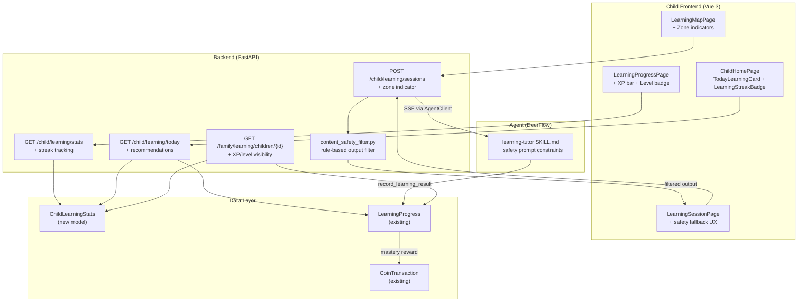

# Children's AI Learning OS — Product Brainstorm

> 产品级 Brainstorming：儿童 AI 学习操作系统的体验、规则、游戏化、AI 角色

| 字段 | 值 |
|---|---|
| Date | 2026-09-28 |
| Scope | 产品战略 + 用户体验 + 游戏化设计 + AI 行为规则 |
| Artifact Contract | ce-unified-plan/v1 |
| Artifact Readiness | implementation-ready |
| Product Contract Source | ce-brainstorm |

---

## Goal Capsule

- **Objective:** Implement Phase 1 MVP of the Children's AI Learning OS — validate the core learning loop (explore → AI tutor → reward → return) for 8-10 year olds within 4-6 weeks.
- **Authority:** Product Contract in this document (Sections 1-10). Brainstorm decisions hold; planning decisions (KTDs) govern implementation mechanism within those constraints.
- **Execution profile:** Full-stack — backend models + services, child frontend pages, AI tutor skill enhancement, content safety layer, Alembic migration. Extends existing Learning OS infrastructure.
- **Stop conditions:** MVP running 4 weeks with voluntary open rate < 20% and no upward trend → pause and evaluate per Section 8.2 failure mode analysis. LLM cost > ¥60/month/family → adjust model or limit frequency.
- **Tail ownership:** Implementer owns test quality, verification gate, and PR. Code review required before merge.

---

## 1. Product Philosophy

### 1.1 核心教育理念

**Learning OS 的本质不是"教孩子知识"，而是"帮助孩子建立认识世界的结构"。**

三个不可妥协的信念：

| # | 信念 | 反模式 |
|---|------|--------|
| 1 | **好奇心是最好的老师** — 当孩子追着一个兴趣深入时，学习自然发生 | ❌ 强制线性课程、打卡式学习 |
| 2 | **结构比知识更重要** — 知识会遗忘，但分类、因果、连接的思维方式留存 | ❌ 追求 topic 覆盖数量、强调"学了多少" |
| 3 | **孩子不是缩小版的成人** — 儿童学习需要故事、游戏、成就感驱动 | ❌ 效率导向的任务管理、KPI 式完成率 |

### 1.2 产品定位的精确表述

Learning OS 是一个**知识探索伙伴**，不是一个学习管理系统。

**类比：**
- ❌ 不是 Duolingo（课程完成制）
- ❌ 不是 Khan Academy（视频 + 练习制）
- ❌ 不是 Quizlet（刷题制）
- ✅ 更像 Minecraft Education — 一个有结构的开放世界，孩子在其中探索、建造、发现
- ✅ 也像 Pokemon — 收集、进化、连接、冒险的循环

**为什么在 Numina 中？** Numina 的愿景是"用心记录，明智决策"——帮助家庭做出更好的决策。儿童学习 OS 是这个愿景的自然延伸：从管理家庭的财务资产，扩展到培育家庭最重要的"资产"——孩子的成长。两者共享家庭隐私优先的核心理念、多成员角色体系、以及已有的儿童激励系统基础设施。如果 MVP 验证失败，Learning OS 可以作为独立产品拆分，与 Numina 的耦合仅限于用户认证和家庭关系数据。

### 1.3 核心指标转变

| 传统教育产品 | Learning OS |
|---|---|
| 课程完成率 | 知识连接密度（孩子建立了多少跨领域连接） |
| 日活时长 | 探索广度（每周涉及的不同领域数） |
| 考试正确率 | 掌握深度曲线（同一领域从浅到深的轨迹） |
| 家长满意度评分 | 孩子主动打开 App 的频率 |

**北极星指标：孩子在没有外部奖励时，是否仍然愿意回来探索？**

> ⚠️ **奖励脚手架说明：** 外部奖励（XP、Coins 等）被设计为**初始参与脚手架**——帮助孩子建立学习习惯，而非长期依赖。当习惯形成后，奖励应逐步淡化。Phase 2 需评估：在不提供奖励的 session 中，孩子是否仍然主动打开 App？如果外部奖励成为参与的必要条件而非催化剂，需要重新设计奖励退出策略。

---

## 2. Child Experience Design

### 2.1 一天的学习旅程

```
小明（8 岁）放学后打开 App
│
├─ 🏠 Home 屏幕
│   "下午好，小明！今天想探索什么？"
│   [🌟 今日推荐] 生态系统的秘密（Growth Zone，系统推荐）
│   [🔥 继续冒险] 恐龙猎人（Comfort Zone，自选延续）
│   [🗺️ 知识地图]  进入探索世界
│
├─ 🗺️ 选择探索
│   小明打开"生命森林"，点进"恐龙"领域
│   AI 导游："你上次了解了白垩纪恐龙，想知道它们为什么灭绝吗？"
│   → 连接：恐龙灭绝 → 地质变化 → 生态系统 → 适者生存
│   小明选了"恐龙灭绝"
│
├─ 📖 学习过程
│   AI 用故事引导：陨石撞击假说
│   中间穿插 2 道思考题（非考试，是"猜一猜"）
│   小明答对 1 题，AI 说"有意思！让我给你看另一个理论"
│   → 补充：火山活动假说
│
├─ 🏆 完成探索
│   "你发现了恐龙灭绝的两大理论！"
│   +8 XP（Growth Zone 探索）
│   +3 Discovery Points（跨域连接：古生物 → 地质学）
│   🔓 新节点点亮：地质历史
│
├─ 🌟 下一步引导
│   AI："恐龙的化石是怎么被发现的？想当一回古生物学家吗？"
│   → 推荐：化石与考古（Challenge Zone，略有难度）
│   → 或者回到地图看看其他区域
│
└─ 🏠 回到 Home
    今天的探索被记录在"冒险日志"中
    连续探索第 5 天 🔥
```

### 2.2 核心体验循环

```
        好奇
       /    \
    探索     发现
      |        |
    理解  ←  连接
       \    /
        满足 → 新好奇
```

每一圈循环应该：
- 让孩子学到至少一个新概念
- 建立至少一个跨领域连接
- 获得正向反馈（不只是奖励，还有"啊哈！"时刻）
- 留下一个未解的问题（驱动下一圈）

### 2.3 年龄分层体验差异

目标年龄：**6-12 岁**（小学全阶段）

> **MVP 范围说明：** Phase 1 MVP 聚焦 **8-10 岁**年龄段（图文混合交互），验证核心循环后再扩展到 6-7 岁（需语音引导）和 11-12 岁（需自由探索地图）的差异化体验。

| 维度 | 6-7 岁 | 8-10 岁 | 11-12 岁 |
|------|---------|---------|----------|
| 交互方式 | 大图 + 语音引导为主 | 图文混合 | 文字为主 + 地图自由探索 |
| 知识地图 | 童话风格，具象地标 | 半具象，区域+路径 | 接近"思维导图"，可缩放 |
| AI 语言 | 简单、鼓励、多比喻 | 引导式提问 | 讨论式、辩论式 |
| 任务类型 | 观察、分类、画画 | 实验、记录、对比 | 项目、研究、创造 |
| 奖励感知 | 即时动画 + 声音 | 收集 + 等级 | 成就 + 解锁特权 |
| 家长参与 | 几乎全程陪同 | 选择性参与 | 主要自主，家长看报告 |

### 2.4 首次使用引导（Onboarding）

孩子第一次打开 App 时，需要引导体验：

1. **欢迎角色**：AI 导游以"大朋友"身份自我介绍，用适合年龄的语言
2. **地图导览**：简短引导（30 秒），展示知识地图的基本概念——"这是一个知识世界，你可以探索任何你好奇的东西"
3. **第一次探索**：引导完成一个完整的探索循环（选 topic → AI 对话 → 获得 XP），约 3 分钟
4. **奖励介绍**：展示 XP 和 Coins 的含义——"每次探索你都会获得经验值，积累到一定程度就能升级！"

引导结束后，Home 屏幕显示"继续冒险"指向刚才未完成的 topic。引导过程中收集孩子的年龄，用于后续适龄适配。

### 2.5 Session 边界设计

不同年龄段注意力时长不同（6-7 岁约 10-15 分钟，8-10 岁约 15-25 分钟，11-12 岁约 25-40 分钟）。

- **自然结束点**：每个探索序列步骤完成后是自然的暂停点
- **AI 疲劳检测**：当回复变短或出现不耐烦信号时，AI 建议休息："今天学了好多！要不要明天继续看看 XX 的后续？"
- **家长时间限制**：家长可设置每日时间上限，到达时 AI 温和收尾："时间到了！今天你发现了 X 个新知识，明天见！"
- **保存进度**：session 中断时自动保存当前序列位置和对话上下文

---

## 3. Parent Experience Design

> **Phase 说明：** Section 3.1 的知识大陆可视化和领域钻取是 **Phase 2 愿景**。MVP（Phase 1）的家长端是简化的 topic 列表 + mastery 状态。以下内容描述完整设计方向，Phase 1 仅需实现列表视图。

### 3.1 家长看到什么

家长端的知识地图不是"成绩单"，而是一幅**孩子知识宇宙的快照**。

#### 3.1.1 知识大陆（总览）

```
┌─────────────────────────────────┐
│  🌍 小明的知识大陆               │
│  已探索 23% · 活跃领域 4 个      │
│                                 │
│  ┌─────┐   ┌──────┐            │
│  │ 数学 │   │ 科学  │           │
│  │ 🟢🟢 │   │ 🟢🟡 │           │
│  │ 🟡⚪ │   │ ⚪⚪ │            │
│  └─────┘   └──────┘            │
│  ┌─────┐   ┌──────┐            │
│  │ 语言 │   │ 人文  │           │
│  │ 🟡🟡 │   │ ⚪⚪ │            │
│  │ ⚪⚪ │   │ ⚪⚪ │            │
│  └─────┘   └──────┘            │
│                                 │
│  📊 本周：探索 5 次 · 32 分钟    │
│  🔥 连续 5 天                    │
│  🧭 兴趣方向：自然科学偏强       │
└─────────────────────────────────┘
```

#### 3.1.2 领域钻取（点击某个学科）

```
┌─────────────────────────────────┐
│  🔬 科学 · 探索进度              │
│                                 │
│  🟢 已掌握 (3)                   │
│  ├── 植物分类                    │
│  ├── 动物栖息地                  │
│  └── 水的三态                    │
│                                 │
│  🟡 探索中 (2)                   │
│  ├── 生态系统 (60%)              │
│  └── 恐龙时代 (80%)              │
│                                 │
│  ⚪ 待探索 (8)                   │
│  ├── 地质历史                    │
│  ├── 天气与气候                  │
│  └── ... 更多                    │
│                                 │
│  🔒 暂未开放 (5)                 │
│  ├── 分子与原子                  │
│  └── ... (年龄适配后开放)        │
│                                 │
│  📈 能力雷达                     │
│  科学探究: ████░░ 65%            │
│  观察记录: █████░ 80%            │
│  因果推理: ███░░░ 50%            │
└─────────────────────────────────┘
```

#### 3.1.3 家长应该看到但传统产品不展示的

| 传统产品展示 | Learning OS 额外展示 |
|---|---|
| 完成率 | **知识结构图** — 知识点之间是如何连接的 |
| 学习时长 | **探索轨迹** — 从恐龙 → 化石 → 地质 → 生态系统的思维旅程 |
| 考试分数 | **能力成长** — 科学探究、因果推理、创造性思维等维度 |
| 排行榜 | **兴趣方向** — 这个孩子在哪些方面展现特别的好奇心 |
| 缺失项 | **下一步建议** — 基于当前状态，系统建议的 3 个探索方向 |

### 3.2 家长权限边界

#### 可以做 ✅

| 操作 | 原因 |
|------|------|
| 查看知识地图和探索历史 | 了解孩子的学习状态 |
| 查看 AI 推荐逻辑 | 理解为什么推荐某个 topic |
| 手动指派学习任务 | 家长有特定的教育诉求 |
| 设置学习目标（软目标） | "这周多探索一下数学" |
| 调整奖励参数 | 某些任务可以额外奖励 |
| 看到孩子的兴趣报告 | 发现孩子的天赋方向 |
| 暂停/恢复 AI 推荐 | 对推荐方向不满意时可以干预 |
| 设置最多 3 个"高优先"学习任务 | 有特定教育诉求时的有限干预权，详见 Section 6.5 |

**家长指派任务的 UX 流程：**
- **家长端**：选择孩子 → 浏览可选 topic（按学科/领域分组） → 点击 topic → 设置优先级（普通/高优先） → 可附加备注 → 提交
- **孩子端**：家长指派的任务带 👨‍👩‍👧 "家长建议" 标签，在 Home 屏幕显示为独立卡片，与自选任务有明确视觉区分
- **高优先任务**：在 UI 上标注为"家长推荐"而非"必须完成"，孩子可以暂时跳过但不会消失

#### 不能做 ❌

| 操作 | 原因 |
|------|------|
| 修改 AI 推荐路径 | 知识依赖关系是教育学决定的，不是家长偏好 |
| 改变知识依赖图 | 前置知识关系是客观的知识结构 |
| 直接标记"已掌握" | 掌握度应由评估决定，否则数据失真 |
| 删除孩子的探索记录 | 学习历史是成长画像的基础 |
| 设置超过 3 个高优先任务 | 上限 3 个，且保留孩子自选空间（详见 Section 6.5） |

#### 为什么这样设计？

**核心矛盾：家长的控制欲 vs 孩子的自主性**

如果家长可以强制安排课程：
1. 孩子会把 Learning OS 视为"另一个作业系统"
2. 失去主动探索的动机
3. AI 推荐变得无意义（反正家长说了算）
4. 数据失真（家长标记的"掌握"不等于真实理解）

但完全不让家长参与也不行：
1. 家长付费，需要有掌控感
2. 家长了解孩子的某些方面（比如学校正在学什么）
3. 家长的教育判断值得尊重

**解决方案：透明 + 建议 > 控制**

- 让家长看到 AI 为什么推荐某个 topic（透明度）
- 让家长可以"建议"而不是"命令"（建议 > 控制）
- 家长的指派任务在 UI 上和孩子自选的任务有视觉区分
- 系统定期给家长发送"发现报告"——"您的孩子本周对 X 展现了强烈兴趣"

### 3.3 家长参与感的替代方案

不让家长控制，但给家长更好的参与方式：

1. **每周发现报告**（推送通知）
   - "小明本周探索了 3 个新领域，对古生物特别感兴趣"
   - "建议：可以带他去自然博物馆，呼应他正在学的化石知识"

2. **亲子探索任务**（特殊任务类型）
   - "和孩子一起做一次厨房化学实验"
   - "带孩子去公园观察 5 种不同的树"
   - 这类任务需要家长配合，增强亲子关系

3. **知识地图分享**
   - 家长可以分享孩子的知识大陆截图（知识地图对兄弟姊妹私密，但家长有权查看自己孩子的）
   - 类似"成长记录"，有社交传播价值
   - **同意机制**：分享前应征求孩子同意（"你想把这个分享给爷爷奶奶看吗？"），培养隐私意识；孩子有权拒绝

---

## 4. Gameful Learning System

> **Phase 说明：** Section 4 描述完整的游戏化愿景。MVP（Phase 1）仅实现：基础 XP + Coins（4.3.1 前两行）、简单 streak 计数（4.4 的第一项）。以下内容均为 Phase 2+：世界地图（4.1）、四种任务类型（4.2）、完整奖励系统（4.3）、Collections（4.5）。保留完整设计供 Phase 2 参考。

### 4.1 世界地图设计

#### 方案选择：大陆-区域-地标三层地图

| 方案 | 优点 | 缺点 | 适合 |
|------|------|------|------|
| **星球探索** | 太空主题吸引男孩 | 女孩可能不感兴趣；星球间缺乏自然连接 | 科学为主 |
| **RPG 技能树** | 游戏感强 | 过于线性，限制自由探索 | 大龄孩子 |
| **城市建造** | 有积累感 | 与知识学习连接弱 | 低龄孩子 |
| **🏆 大陆-区域-地标** | 中性、自然、可扩展 | 需要美术投入 | **全年龄** |

**选定方案：大陆-区域-地标**

```
知识世界（Knowledge World）
├── 🔢 数字群岛（Mathematics）
│   ├── 计数海岸（Counting）
│   ├── 运算山谷（Operations）
│   ├── 分数瀑布（Fractions）
│   ├── 代数高峰（Algebra）
│   └── 几何平原（Geometry）
│
├── 🔬 生命森林（Science - Life）
│   ├── 植物花园（Plants）
│   ├── 动物王国（Animals）
│   ├── 人体迷宫（Human Body）
│   ├── 生态河流（Ecosystems）
│   └── 进化之路（Evolution）
│
├── 🌍 地球探秘（Science - Earth）
│   ├── 岩石博物馆（Rocks & Minerals）
│   ├── 天气观测站（Weather）
│   ├── 海洋深渊（Oceans）
│   └── 星空瞭望台（Astronomy）
│
├── 📚 语言之城（Language）
│   ├── 词汇集市（Vocabulary）
│   ├── 语法城堡（Grammar）
│   ├── 阅读花园（Reading）
│   └── 写作工坊（Writing）
│
├── 🏛️ 时光走廊（History & Geography）
│   ├── 古代文明区（Ancient Civilizations）
│   ├── 地理探索站（Geography）
│   └── 文化万花筒（Cultures）
│
└── 🧠 思维工坊（Meta-Cognition）
    ├── 逻辑实验室（Logic）
    ├── 问题解决屋（Problem Solving）
    └── 创意工作室（Creative Thinking）
```

#### 地图视觉设计

- **已探索区域**：色彩鲜明，有角色/动物活动
- **正在探索**：微微发光，有"!"标记
- **未探索**：灰色/迷雾，但可以看到轮廓（激发好奇）
- **Challenge Zone**：有"⚡"标记，显示"挑战区域"
- **跨域连接**：当孩子建立了跨学科连接时，地图上用虚线/光路连接两个区域

### 4.2 任务设计

#### 4.2.1 四种任务类型

不要只是"完成一道题"。设计四种任务类型：

| 类型 | 描述 | 示例（主题：植物） | 奖励重点 |
|------|------|------|------|
| 🔍 **探索任务** | 获取新知识 | "了解植物如何进行光合作用" | XP + 知识点亮 |
| 🧪 **实践任务** | 动手实验/观察 | "找 3 种不同的叶子，记录它们的形状" | Discovery Points |
| 🎨 **创造任务** | 产出作品 | "画一幅你理想中的花园，标注每种植物的特征" | Collection + Badge |
| 🔗 **连接任务** | 跨域思考 | "想想：植物和太阳能板有什么共同点？" | Connection Bonus |

**实践/创造任务的提交方式：**

| 年龄段 | 🧪 实践任务 | 🎨 创造任务 |
|--------|------------|------------|
| 6-7 岁 | 语音描述 + 家长拍照上传 | 画板涂鸦（简化 drawing canvas） |
| 8-10 岁 | 拍照上传 + 文字备注 | 画板 + 文字描述 |
| 11-12 岁 | 拍照/视频 + 文字报告 | 文字作品 + 可选图片 |

MVP 先支持拍照上传和文字输入；画板和语音作为 Phase 2 功能。

#### 4.2.2 任务生成规则

一个主题下的任务应该形成**探索序列**，而不是平铺罗列：

```
🌱 入门序列（植物世界）

Step 1: 🔍 探索 — "什么是植物？" （AI 用图片引导）
Step 2: 🔍 探索 — "植物怎么吃东西？"（光合作用入门）
Step 3: 🧪 实践 — "去窗外找一棵植物，画出它的根茎叶"
Step 4: 🔍 探索 — "植物也需要呼吸吗？"
Step 5: 🔗 连接 — "植物和动物谁更需要阳光？为什么？"
Step 6: 🎨 创造 — "设计一个太空植物园，每个植物有不同的超能力"
```

每个序列 4-8 步，完成后解锁该领域的"徽章"。

**序列中断与恢复：** 孩子关闭 App 后重新打开时：
- Home 屏幕的"🔥 继续冒险"卡片显示当前进度（如"Step 3/6 — 植物怎么吃东西？"）
- 点击进入恢复界面：简要回顾上次的学习内容 + 一个明确的"继续"按钮
- 超过 3 天未恢复，AI 导游会温和提醒："你上次在探索植物世界，要继续吗？还是想换个新主题？"

#### 4.2.3 AI 动态任务生成

除了预设序列，AI Tutor 可以根据上下文动态生成任务：

- **基于兴趣**：孩子对恐龙感兴趣 → AI 生成"恐龙食物链"任务
- **基于时事**：春天下雨 → AI 提议"今天的天气实验"
- **基于连接**：孩子刚学了分数 → AI 提议"用分数记录你的烘焙配方"
- **基于复习**：3 天前学的植物分类 → AI 提议"植物分类挑战"

### 4.3 奖励系统设计

#### 4.3.1 五种奖励维度

| 维度 | 符号 | 获取方式 | 用途 | 反刷分设计 |
|------|------|---------|------|-----------|
| **XP（经验值）** | ⭐ | 完成任何学习任务 | 等级提升 | 重复学同一 topic 不给 XP |
| **Discovery Points** | 🔮 | 建立跨领域连接 | 解锁隐藏区域 | 必须真实完成两个不同领域 |
| **Coins** | 🪙 | 每日学习 + 成就 | 兑换心愿 | 每日上限 50 |
| **Collections** | 🏺 | 探索新领域/完成序列 | 展示 + 收集欲 | 每个 collection 只获得一次 |
| **Achievements** | 🏅 | 达到里程碑 | 荣誉展示 | 不可重复获取 |

> **与现有系统的关系：** Coins 复用现有的 `coin_transactions` 账本——与家务 Coins 共享同一池子，`learning_earn` 和 `path_earn` 交易类型已存在。心愿兑换也复用现有 Wish 系统。XP 是**新增**的：当前仅有 per-topic 的 `xp_earned`，累计 XP 总额和等级系统需要新增 model 字段（建议 `child_profile` 或 `learning_stats` 表）和等级计算服务。MVP 阶段只启用 XP 和 Coins，Collections 和 Achievements 为 Phase 2。

#### 4.3.2 XP 和等级系统

```
等级名称      所需 XP     解锁
─────────────────────────────────
🌱 种子       0          基础知识地图
🌿 幼苗       100        自选学习功能
🌳 小树       300        挑战区域入口
🌲 大树       600        创造任务类型
🏔️ 探险家     1000       隐藏区域
⭐ 学者       2000       AI 导师高级功能
🌟 大师       5000       知识地图自定义主题
```

等级只升不降。给的是成就感，不是压力。

#### 4.3.3 反刷分核心规则

| 行为 | 系统设计 |
|------|---------|
| 反复学同一简单 topic 赚 XP | 同一 topic mastered 后不再给 XP；revisit 只给少量复习 XP |
| 只挑最简单的任务 | Comfort Zone 任务 XP 减半；系统引导进入 Growth Zone |
| 快速点击跳过学习 | AI 检测学习时长异常短 → 不给 XP + 提醒"要不再看看？" |
| 同时开多个 session | 同一时间只能有一个活跃 session |
| 单日大量刷 XP | 每日 XP 上限 100，防止单日刷分（详见 Section 6.3） |

#### 4.3.4 奖励应该奖励什么

**核心原则：奖励学习行为，而非学习结果。**

| ✅ 奖励 | ❌ 不奖励 |
|---------|----------|
| 探索新领域 | 答对多少题 |
| 坚持学习（streak） | 学习时长（会被刷） |
| 建立跨域连接 | 完成任务数量 |
| 提出好问题 | 快速完成 |
| 帮助弟弟妹妹学习 | 考试满分 |
| 创造性作品 | 重复练习 |

#### 4.3.5 奖励查看与消耗 UX

孩子需要一个地方查看和使用自己的奖励：

- **"我的成就"页面**（从 Home 屏幕进入）：
  - 🪙 Coins 余额 + 心愿列表（复用现有 Wish UI）
  - ⭐ XP 进度条（显示当前等级 → 下一等级，如"🌿 幼苗 65/100 XP"）
  - 🏺 收集品展柜（Phase 2）
  - 🏅 成就墙（Phase 2）
- **探索结束动画**：每次完成探索后，奖励数字飞入对应图标，强化获得感知

### 4.4 Streak 机制增强

> **命名说明：** 此处的 "Streak" 指**连续学习天数**（正向激励），与现有代码中 `progress_service.py` 的 "streak"（连续评估失败次数，用于触发家长通知）是不同概念。实现时应区分命名：本设计建议用 `learning_streak_days`，现有概念重命名为 `consecutive_failure_count`，避免与 `STREAK_THRESHOLD`、`check_consecutive_failures()` 等现有标识符冲突。

当前 streak 只是"连续学习天数"。增强设计：

- **Streak 保护**：允许 1 天休息不中断（孩子需要休息日）
- **Streak 里程碑**：7 天/30 天/100 天 有特殊成就
- **Streak 家族**：如果多个孩子都学习，有"全家学习日"奖励
- **Streak 不是惩罚**：断了不扣分、不降级，只是重新从 1 开始

### 4.5 Collections（收集系统）

收集是人类天性。利用它来驱动探索广度：

```
🏺 自然收藏家
  收集条件：探索至少 5 个不同的自然科学 topic
  进度：3/5
  奖励：🏅 "小小博物学家" 徽章

🏺 文明探险家
  收集条件：探索 3 个不同古代文明
  进度：1/3

🏺 跨界思考者
  收集条件：建立 3 个跨学科连接
  进度：2/3
  奖励：🔮 +50 Discovery Points
```

---

## 5. Learning Recommendation Rules

> **Phase 说明：** 以下 Sections 5.1-5.4 描述的是**完整的 Phase 2 设计参考**。MVP（Phase 1）使用简化版本：Zone 基于 age_group 简单划分（不做领域级动态计算），推荐基于 age_group + centrality 规则（不做加权公式），Mastery 规则复用现有状态机。本节保留完整设计供 Phase 2 参考，但实施时应先验证 MVP 的简化方案是否有效。

### 5.1 三层探索区域（Ability Zones）

#### 核心概念

年龄不是限制，而是弹性范围。三层区域根据孩子的**实际能力**动态调整，而非固定边界。

```
┌──────────────────────────────────────────┐
│  Challenge Zone ⚡                        │
│  高于年龄 1-2 级                           │
│  需要满足条件才能解锁                       │
│  奖励 ×1.5                                │
├──────────────────────────────────────────┤
│  Growth Zone 🌟                           │
│  适龄核心区                                │
│  系统重点推荐                              │
│  正常奖励 ×1.0                             │
├──────────────────────────────────────────┤
│  Comfort Zone 🌱                          │
│  低于年龄 1 级                             │
│  自由探索、复习                             │
│  奖励 ×0.5                                │
└──────────────────────────────────────────┘
```

#### 区域动态变化规则

**区域不是按年龄固定，而是按"领域能力"动态计算。**

```
对于每个学科领域（如数学、科学）：

child_capability[domain] = f(
    mastered_topics_in_domain,      # 已掌握 topic 数量
    mastery_quality_avg,             # 平均掌握质量（0-1）
    learning_velocity,               # 学习速度（topic/周）
    assessment_pass_rate,            # 评估通过率
    consecutive_success_streak,      # 连续成功次数
)

如果 child_capability[domain] > age_expected[domain] + threshold:
    → Growth Zone 上移（孩子在这个领域可以挑战更难的内容）
如果 child_capability[domain] < age_expected[domain] - threshold:
    → Comfort Zone 扩大（孩子需要更多基础巩固）
```

**关键：区域是领域级别的，不是全局的。** 一个 8 岁孩子可能在数学上处于 Growth Zone 高端，但在语言上处于 Comfort Zone。

#### Challenge Zone 解锁条件

孩子需要满足以下**全部条件**才能进入某领域的 Challenge Zone：

1. **领域 Mastery 达标**：该领域 Growth Zone 内至少 mastered 3 个 topic
2. **评估质量**：最近 5 次评估中至少 4 次 score ≥ 0.7
3. **学习连续性**：该领域连续学习 ≥ 3 天（不是突击）
4. **好奇心信号**：孩子主动浏览过 Challenge Zone 的 topic（可选，降低门槛）

**天才儿童保护机制：**
- 条件 4 是"好奇心跳板"——如果孩子直接点击了 Challenge Zone 的 topic，降低其他条件 50%
- 家长可以为孩子申请"加速器"——直接解锁 Challenge Zone（信任家长判断）
- 系统监测：如果一个孩子在某领域连续 5 次评估满分，自动提升该领域的 Zone

#### 防止长期停留在简单任务

如果孩子在 Comfort Zone 停留过久（>7 天没有 Growth Zone 探索）：

1. **AI 导游介入**：你在 XX 领域已经很强了！要不要看看更有趣的东西？
2. **连接引导**：展示 Comfort Zone topic 和 Growth Zone topic 之间的连接
3. **挑战邀请**：推送一个"迷你挑战"——用 2 分钟快速体验 Growth Zone topic
4. **不强制**：如果孩子拒绝，尊重选择，3 天后再建议

### 5.2 兴趣驱动推荐规则

```
兴趣强度计算：

interest_score[domain] = 
    0.4 × recent_exploration_frequency[domain]    # 最近 7 天探索频率
  + 0.3 × active_engagement_score[domain]          # 主动交互密度（对话轮次+提问数+操作数/分钟）
  + 0.2 × voluntary_exploration_ratio[domain]       # 自选（非指派）比例
  + 0.1 × cross_domain_connections[domain]          # 主动建立连接数

推荐权重：

recommendation_weight[topic] = 
    0.35 × interest_score[topic.domain]             # 兴趣匹配
  + 0.25 × zone_fit_score[topic]                    # Zone 适配（Growth > Comfort > Challenge）
  + 0.20 × prerequisite_readiness[topic]            # 前置知识满足度
  + 0.10 × diversity_bonus[topic]                   # 未探索领域加分
  + 0.10 × freshness[topic]                         # 新鲜度（避免重复推荐）
```

### 5.3 多样性平衡机制

**问题：孩子每天只学恐龙怎么办？**

**答案：B 方案 — 允许但逐渐连接其他知识。**

理由：
- A（限制）违背 Exploration First 原则
- C（直接推荐其他）太生硬，孩子会抗拒
- B 尊重兴趣，同时引导拓展

**具体实现：**

```
孩子连续 3 天只探索恐龙：

Day 1-2: 完全支持，正常推荐恐龙相关内容
Day 3:   AI 自然引入连接
         "你知道恐龙生活的时代，地球上的植物是什么样的吗？"
         → 连接：恐龙 → 古植物（科学的不同分支）
Day 4:   更多连接
         "如果恐龙活到今天，它们需要什么样的环境？"
         → 连接：恐龙 → 气候 → 生态系统
Day 5:   自然过渡
         "想不想知道科学家是怎么知道恐龙存在的？"
         → 连接：恐龙 → 考古 → 科学研究方法
```

**关键规则：连接必须在语义上自然，不能生硬。**

AI 的推荐必须通过"知识桥梁"过渡：
```
恐龙 → 古生物 → 化石 → 地质 → 地球科学    ✅ 自然
恐龙 → 数学 → 统计                                              ❌ 生硬
恐龙 → 恐龙灭绝 → 灾难 → 概率                                   ⚠️ 勉强可以
```

### 5.4 Mastery 规则

> **与现有系统的关系：** 以下状态机描述与现有 `progress_service.py` 的 Mastery 状态机基本一致（7 状态：locked → available → learning → assessing → mastered → review，加上 `parent_review` 分支）。现有系统已实现：状态转换、SM-2 间隔重复（`stability` 字段）、评估后的 coin 奖励。以下为**新增或待确认**的规则：
> - Mastery 阈值（0.8/0.5）需要与现有 AI 评估的 `overall_score` 对齐确认
> - "14 天复习提醒" 需要与现有 `next_review_at` 计算逻辑（`3 × stability` 天）对齐
> - "连续 3 次复习通过 → 牢固掌握" 为新增规则，需要新增 `consecutive_review_passes` 字段

```
Mastery Level 状态机：

locked → available → learning → assessing → mastered
                                         → review (需要复习)

评估方式：
- AI Tutor 对话式评估（主要）
- 家长审核（可选）

Mastery 判定标准：
- mastery_score ≥ 0.8 → mastered
- mastery_score 0.5-0.8 → review（需要复习）
- mastery_score < 0.5 → 继续学习

间隔复习规则：
- mastered 的 topic 在 14 天后触发"复习提醒"
- 复习通过 → 保持 mastered + 少量 XP
- 复习失败 → 降级为 review
- 连续 3 次复习通过 → 标记为 "牢固掌握"，不再提醒
```

---

## 6. Edge Cases

### 6.1 孩子只探索喜欢的领域

**场景：** 小明只学恐龙，其他什么都不碰。

**处理策略：渐进连接法（已在 5.3 详述）**

补充机制：
- **兴趣报告给家长**：每周告诉家长"小明对古生物有强烈兴趣"
- **建议现实活动**：建议家长带孩子去博物馆、看纪录片
- **不惩罚**：不会因为只学一个领域而扣分或降级
- **月度提醒**：如果一个月后仍然只有一个领域，系统温和提示"要不要看看其他世界？"

### 6.2 孩子挑战远超年龄内容

**场景：** 7 岁的小红想学量子物理。

**处理策略：保护好奇心 + 适龄翻译**

1. **不阻止**：让孩子进入 Challenge Zone
2. **AI 降级解释**：AI Tutor 用 7 岁能理解的语言解释概念
   - "量子物理就是研究非常非常小的东西——比蚂蚁还小一万倍的东西！"
3. **标记为挑战**：显示 ⚡ 标记，不给 Mastery 判定（避免挫败感）
4. **给探索 XP**：虽然没有 mastered，但给 Discovery Points（奖励勇气）
5. **提供"回来"路径**：当 AI 发现孩子明显不理解时，建议"我们先去了解一下光是什么？"

### 6.3 孩子只做简单任务刷奖励

**场景：** 小刚反复做已掌握的 topic 来赚 XP。

**处理策略：系统级防刷**

1. **重复 topic 不给 XP**：mastered 的 topic 再次完成只给 1 coin（象征性）
2. **Comfort Zone 奖励减半**：系统明确告知"这个任务奖励较少哦"
3. **每日 XP 上限**：每天最多获得 100 XP，防止单日刷分
4. **成就引导**：显示"你已经掌握了这些！来挑战新的？" + 推荐 Growth Zone topic
5. **如果持续 3 天**：AI 导游介入 "我发现你最近在复习旧知识，要不要看看有趣的新东西？"

### 6.4 学习能力明显低于年龄

**场景：** 10 岁的小华，数学水平相当于 7 岁。

**处理策略：能力导向而非年龄导向**

1. **Zone 基于能力而非年龄**：系统根据实际 mastery 计算 Zone，不按年龄强制
2. **家长可见但不标签化**：家长端展示"当前能力水平"，但不说"低于年龄"
3. **渐进提升**：当孩子在 Comfort Zone 建立信心后，自然引导到 Growth Zone
4. **AI 语气调整**：更耐心、更多鼓励、更慢的节奏
5. **不暴露给其他孩子**：每个孩子的知识地图是私密的
6. **成功故事**：展示"你已经掌握了 X 个新知识！"而非"你还落后 Y 个"

### 6.5 家长希望强制安排课程

**场景：** 妈妈希望小明每天必须学 1 小时数学。

**处理策略：透明沟通 + 替代方案**

1. **系统设计不允许强制**：家长无法创建"每日必须完成"的任务
2. **但可以提供"建议"**：家长可以指派任务，但 UI 上标注为"家长建议"而非"必须完成"
3. **数据说服**：如果孩子的自选学习已经在其他领域表现良好，给家长看数据
4. **亲子任务折中**：建议家长使用"亲子探索任务"——一起学，而不是命令孩子学
5. **教育理念传达**：在家长端展示"为什么自由选择更好"的研究摘要
6. **如果家长坚持**：允许创建最多 3 个"高优先"任务，但系统仍然保留孩子的自选空间

**底线：Learning OS 不是家长的课堂管理工具。** 如果家长需要严格的课程管理，我们的产品可能不是最佳选择——这应该被诚实地说出来。

---

## 7. AI Tutor 在探索体系中的角色

> **Phase 说明：** Section 7.1-7.5 描述完整的 AI Tutor 设计。MVP（Phase 1）仅实现"导游"角色（Section 7.1 第一行），使用现有 DeerFlow 集成。教练/伙伴/启发者角色、兴趣发现机制、动态连接推荐为 Phase 2。内容安全过滤（Section 7.6）为 **Phase 1 必需**。

### 7.1 四重角色

| 角色 | 场景 | 行为 |
|------|------|------|
| 🧭 **导游** | 孩子进入新领域 | 介绍概览，提供路线选择，指出有趣的地方 |
| 🏋️ **教练** | 孩子在学习中遇到困难 | 引导式提问，拆解问题，鼓励尝试 |
| 🤝 **伙伴** | 日常探索 | 分享有趣的"你知道吗？"，一起发现 |
| 💡 **启发者** | 孩子完成一个阶段 | 提出延伸问题，展示跨域连接，激发新好奇 |

### 7.2 兴趣发现机制

AI 如何发现孩子的真实兴趣？

```
兴趣信号采集（不依赖孩子自述）：

1. 选择行为 — 在地图上停留、点击、犹豫 → 好奇心指标
2. 时长信号 — 在某领域的 session 时长超过平均 → 深度投入
3. 问题信号 — 孩子主动问"为什么"、"然后呢" → 内在动机
4. 回归信号 — 反复回到同一领域 → 持续兴趣
5. 分享信号 — 孩子说"我学到了！"→ 成就感 + 热情

兴趣模型：
- 短期兴趣（本周热点）→ 影响本周推荐
- 长期兴趣（持续 1 个月+）→ 影响知识地图布局
- 兴趣组合（科学 + 艺术）→ 推荐跨域连接点
```

### 7.3 知识连接推荐

AI 推荐连接的三个层次：

| 层次 | 示例 | 触发条件 |
|------|------|---------|
| **直接连接** | 恐龙 → 化石 | 完成恐龙基础学习后 |
| **跨域连接** | 恐龙 → 地质年代 → 地球科学 | 在同一领域 mastered ≥ 3 个 topic |
| **创意连接** | 恐龙 → "如果恐龙活在今天"→ 生态学思维 | 孩子展现了创造性思维信号 |

**推荐话术设计：**

```
❌ "你现在应该学习地质年代"
✅ "你知道吗？科学家是怎么知道恐龙生活在什么时候的吗？这涉及到一个超酷的知识——地质年代！想不想了解？"

❌ "你的数学需要加强"
✅ "你刚才计算恐龙体重用的乘法，其实还有一个更厉害的工具叫'方程'，想看看吗？"
```

### 7.4 鼓励挑战而不替代思考

**AI Tutor 的核心约束：永远不直接给答案。但在持续挫败时，提供脚手架而非继续提问。**

**挫败升级协议（适用于所有年龄段，不仅限于 Section 6.4 的低于年龄场景）：**

| 信号 | 触发条件 | AI 响应 |
|------|---------|---------|
| 轻度困惑 | 连续 2 次回答错误 | 提供更具体的提示，拆解问题为更小的步骤 |
| 明显挫败 | 连续 3 次错误 / 回复"我不会"/ 消极文字 / 快速乱点 | 提供类似题目的完整示范："让我给你看一个类似的例子" |
| 严重挫败 | 示范后仍无法继续 / 明确表示"不想学了" | 降级为直接讲解核心概念，然后建议休息或切换到更简单的 topic |

年龄适配：6-7 岁更早触发升级（2 次错误即示范），11-12 岁给予更多自主空间（3 次后才示范）。

```
孩子："这道题我不会"

❌ AI："答案是 42"
❌ AI："你应该用乘法"
✅ AI："我们一起来看！你觉得这道题在问什么？"
✅ AI："如果我把数字变小，比如 3 和 2，你会怎么算？"
✅ AI："提示：想想上次我们学的那个方法，和这个有点像"

孩子答错时：
❌ AI："不对，正确答案是..."
✅ AI："有意思！你是怎么想的？能告诉我你的思路吗？"
✅ AI："差一点点！如果 XX 变成 YY，会怎样？"
```

### 7.5 AI 人格设定

AI Tutor 的人格是**稳定的、温暖的、好奇的**。

```
身份：一个对所有知识都充满好奇的"大朋友"
语气：
  - 对 6-7 岁：活泼、多比喻、多感叹号！
  - 对 8-10 岁：友好、有幽默感、引导式
  - 对 11-12 岁：平等讨论、有深度、尊重观点

绝对不会：
  - 说"这很简单"（暗示孩子笨）
  - 说"你应该知道"（知识羞辱）
  - 跳过孩子的错误（错误是学习机会）
  - 过度表扬（"太棒了！"对每个回答 → 廉价化）

会经常：
  - "有意思！"（对孩子的思路表示真正兴趣）
  - "我也想过这个问题..."（展示好奇心是双向的）
  - "你觉得呢？"（把孩子当作思考者）
  - "我犯过一个类似的错..."（正常化错误）
```

### 7.6 儿童内容安全（Phase 1 必需）

AI 生成的内容面向 6-12 岁儿童，内容安全是 **不可协商的 Phase 1 需求**（不是 Outstanding Question）：

**后端过滤层：**
- 多层内容安全过滤：LLM-based 分类器 + 规则引擎（关键词/模式匹配）
- AI Tutor 的 system prompt 包含严格约束：不讨论非儿童教育话题、不产生暴力/恐怖/不当内容
- 所有 AI 输出经过安全过滤后才发送给前端

**前端 fallback UX：**
- 过滤触发时，孩子看到的是友好的替代消息（如"让我们换个话题聊聊！"），**不暴露过滤机制本身**
- 连续多次触发 → 通知家长审查
- 安全事件完整日志：记录触发原因、AI 原始输出、过滤后输出、时间戳

**审计与改进：**
- AI 交互日志可供家长查看（家长端"AI 对话记录"）
- 安全过滤的误报/漏报数据用于持续改进

---

## 8. MVP Recommendation

### 8.1 MVP 的核心假设

**MVP 要验证的不是"技术能不能跑"，而是：**

> "孩子是否愿意在没有外部强制的情况下，主动回来探索知识世界？"

### 8.2 MVP 范围

#### Phase 1 MVP（4-6 周）— 验证核心循环

**只做这些：**

1. **简化的知识地图**
   - 3 个学科（数学、科学、语言）
   - 每个学科 20-30 个核心 topic
   - 平面列表 + 简单进度指示（不做 RPG 地图）

2. **基础 AI Tutor 对话**
   - 利用现有 DeerFlow 集成
   - 限制为"导游"角色（介绍 topic + 引导式提问）
   - 不做动态任务生成

3. **简化的 Zone 系统**
   - 只有 Growth Zone 和 Comfort Zone（不做 Challenge Zone）
   - 基于 age_group（low/mid/high）简单划分
   - 不做领域级别的动态 Zone

4. **基础奖励**
   - XP + Coins（复用现有系统）
   - 简单的每日推荐（不做复杂推荐算法）
   - 不做 Collections/Achievements

5. **家长知识地图 v0**
   - 简单的 topic 列表 + mastery 状态
   - 不做雷达图/轨迹/兴趣报告

6. **自选学习**
   - 孩子可以从知识地图选择任何 unlocked topic
   - 年龄难度警告（当 child 选择高于其 age_group 的 topic 时显示提示）

**MVP 验证指标：**

> **注意：** 以下阈值为** aspirational 目标**，暂无行业基准可直接引用（儿童自驱学习产品与常规教育 App 的可比性有限）。MVP 期间应精确测量这些指标，如果实际值持续低于目标的 50%，需要重新评估产品方向而非仅调整 UI。

| 指标 | 目标 | 测量方式 |
|------|------|---------|
| 孩子主动打开率 | > 50% 的工作日 | 无家长指派情况下的打开率 |
| 平均 session 时长 | > 8 分钟 | AI 对话 + 探索时间 |
| 7 日留存 | > 40% | 注册 7 天后仍然回来 |
| 跨域探索率 | > 20% 的 session 涉及不同领域 | 自然行为，非系统引导 |
| 家长查看率 | > 30% 的家长每周至少看 1 次 | 家长端打开率 |

**MVP 内容来源：** 60-90 个核心 topic 从现有 os-taxonomy（1,590 topics）中选取，选取标准：覆盖 3 个学科的基础概念、跨域连接丰富、年龄适配 8-10 岁（age_group = "mid"）。需要人工筛选确保教育质量和 topic 间依赖关系的完整性。

**LLM 成本估算（MVP）：**

| 项目 | 估算 |
|------|------|
| 每次 session | ~10-15 轮对话，约 15K-20K input tokens + 5K-8K output tokens |
| 每日每孩 | ~1-2 sessions（保守估计） |
| 月成本/孩 | ~¥6-30（取决于模型选择：Qwen < GPT-4o-mini < Claude Haiku） |
| 家庭场景 | 1-2 个孩子，月成本 ¥12-60 |

**成本控制策略：** 优先使用较小模型（如 Qwen 或 Haiku）；常见 topic 对话模板缓存；session 上限 15 分钟；基础探索可离线（预生成内容）。如果月成本超出家庭预算，需要调整模型或限制 session 频率——此估算应作为 MVP go/no-go 的前置检查。

**失败模式分析：**

最可能的失败是孩子不回来用。应对策略：
- **Kill 标准**：如果 MVP 运行 4 周后自愿打开率 < 20% 且无上升趋势，暂停并复盘
- **复盘维度**：AI 对话质量（孩子觉得无聊？太难？）、内容质量（topic 不感兴趣？）、核心假设错误（孩子不认为这是"好玩"的？）
- **最大投入上限**：2 次 pivot 后如果没有显著改善，考虑暂停该功能
- **Pivot 方向**：保留知识地图和 Mastery 系统，但将 AI Tutor 从核心交互降级为辅助工具（如改为视频/图文学习 + AI 仅做评估）

#### Phase 2（MVP 后 4-6 周）— 深化体验

基于 MVP 数据，添加：

1. **RPG 风格知识地图**（大陆-区域-地标）
2. **Challenge Zone** + 解锁条件
3. **Collections** 收集系统
4. **兴趣驱动推荐**（基于 5.2 的公式）
5. **跨域连接**可视化
6. **家长周报**推送

#### Phase 3 — 长期演进

1. **亲子探索任务**
2. **家族学习排行**（多个孩子之间的友好竞争）
3. **AI Tutor 个性化**（根据孩子性格调整 AI 风格）
4. **知识地图自定义**（孩子可以给自己领域命名）
5. **社交功能**（分享知识大陆截图）

### 8.3 MVP 不应该做什么

| 不做 | 原因 |
|------|------|
| 完整 RPG 地图 | 美术成本高，先用简单列表验证核心循环 |
| 复杂的推荐算法 | 先用简单规则（age_group + centrality），验证推荐是否有用 |
| 所有 1,590 个 topic | 先精选 60-90 个核心 topic，确保质量 |
| AI 动态任务生成 | 先用预设序列，验证任务模式是否有效 |
| 家长雷达图/轨迹 | 先用简单列表，验证家长是否真的看 |
| 多语言 AI 对话 | 先中文，验证后再加英文 |

---

## 9. Outstanding Questions

以下问题需要在后续规划中解决：

1. **知识地图的美术风格**：需要设计师出 2-3 个方向的概念图，然后做用户测试。**⚠️ 这是 Phase 2 的关键路径依赖，建议在 Phase 1 期间并行启动概念设计。**
2. ~~**AI Tutor 的 LLM 成本**~~：已在 Section 8 提供粗估（月 ¥12-60/家庭），作为 MVP go/no-go 前置检查
3. ~~**内容审核**~~：已升级为 Phase 1 必需需求，详见 Section 7.6
4. **离线场景**：实践任务（"找 3 种植物"）如何在离线时记录？
5. **多孩家庭**：兄弟姐妹之间的知识地图是否可见？是否支持协作？（Privacy model：默认互相不可见，Phase 3 的家族排行需要额外设计）
6. **知识图谱更新**：os-taxonomy 更新时，已 mastered 的 topic 被 deprecated 怎么办？
7. **商业化路径**：免费 vs 付费功能划分——哪些是基础功能，哪些是增值？

---

## 10. Key Decisions Summary

| # | 决策 | 选择 | 原因 |
|---|------|------|------|
| KD-1 | 目标年龄 | 6-12 岁（小学全阶段） | 已有 age_group 设计覆盖此范围；可分龄适配 |
| KD-2 | 地图隐喻 | 大陆-区域-地标 | 中性、可扩展、全年龄适用 |
| KD-3 | 兴趣 vs 限制 | 允许 + 渐进连接 | 符合 Exploration First；不破坏内在动机 |
| KD-4 | 家长角色 | 透明 + 建议 > 控制 | 保护孩子自主性；同时给家长参与感 |
| KD-5 | 奖励重点 | 奖励行为而非结果 | 避免刷分；鼓励探索广度和深度 |
| KD-6 | AI 角色 | 导游/教练/伙伴/启发者 | 不是老师，不是答题机 |
| KD-7 | Zone 粒度 | 领域级别（非全局） | 允许数学强、语言弱的差异化 |
| KD-8 | MVP 策略 | 先验证核心循环 | 简单地图 + 基础 AI + 自选学习 → 验证留存 |

---

## Planning Contract

Product Contract unchanged — all R-IDs, Key Decisions, Scope Boundaries, and Outstanding Questions from the brainstorm are preserved as-is. The Planning Contract below adds implementation-facing decisions that instantiate the Product Contract for Phase 1 MVP.

### Key Technical Decisions

KTD1. **XP/Level 数据模型** — 新增 `ChildLearningStats` 模型（`child_learning_stats` 表），包含 `cumulative_xp`、`level`、`learning_streak_days`、`last_learning_date`、`current_zone`。独立表而非扩展 `users` 表，保持学习关注点隔离，单条记录可查询聚合数据。当前系统仅有 per-topic 的 `LearningProgress.xp_earned`，无法支持累计 XP 和等级计算。

KTD2. **Content Safety MVP 策略** — 采用 system prompt 强化 + 规则引擎过滤层，不引入 LLM 分类器。Enhanced `learning-tutor/SKILL.md` 添加儿童内容安全约束（仅教育话题、适龄语言、禁止暴力/恐怖/不当内容）。Backend `content_safety_filter.py` 在 AI 输出发送给前端前做关键词/模式匹配过滤。触发时返回友好替代消息，不暴露过滤机制。此方案足够 MVP 验证，Phase 2 可升级为 LLM 分类器。

KTD3. **Zone 系统 Phase 1 简化** — Zone 基于 child 的 age_group 静态划分（Growth Zone = child 自身 age_group 的 topics，Comfort Zone = 低一级），不做领域级动态计算。`current_zone` 记录在 `ChildLearningStats` 上。Phase 2 再引入 per-domain 动态 Zone（per Section 5.1 的 `child_capability[domain]` 公式）。

KTD4. **Topic 筛选策略** — 基于 `centrality` + `age_group` 自动筛选，每个 subject 选取 centrality 最高的 20-30 个 age_group="mid" topics。Seed 脚本添加 `--mvp-only` 标志。后续人工审核确保教育质量和 topic 间依赖关系完整性。

KTD5. **Child Home 学习入口** — 扩展现有 `TodayLearningCard`，添加两个卡片："今日推荐"（基于 zone + centrality 推荐）和"继续冒险"（恢复上次未完成的 session）。添加 streak 显示。复用现有 Clay 设计系统和 Vant 组件。

KTD6. **Streak 命名隔离** — 新增连续学习天数使用 `learning_streak_days` 字段名，与现有 `progress_service.py` 中的 "streak"（连续评估失败次数，`STREAK_THRESHOLD`、`check_consecutive_failures()`）完全区分。Phase 2 考虑将现有概念重命名为 `consecutive_failure_count`。

### Assumptions

- **LLM 成本可控:** 月 ¥12-60/家庭（per Section 8.2 估算），使用 Qwen 或 Haiku 级别模型。超出则调整模型或限制 session 频率。
- **os-taxonomy 数据质量:** 1,590 topics 的依赖关系和年龄标注基本准确，自动筛选后人工审核可修正遗漏。
- **DeerFlow 集成稳定:** learning-tutor 已作为 `_SimpleAppConfig` 注册并运行，Phase 1 不需要修改运行时。
- **前端设计资源:** Phase 1 使用简化的列表视图和现有 Clay 设计系统，不依赖 Phase 2 的 RPG 地图美术资源。

---

## High-Level Technical Design



---

## Implementation Units

### U1. Backend Data Model — ChildLearningStats + XP Service

**Goal:** Add cumulative XP/level/streak tracking model and service layer.

**Requirements:** R (Section 4.3.1-4.3.2 — XP + level system), R (Section 4.4 — streak mechanism)

**Dependencies:** None

**Files:**
- `server/packages/db/models/learning/stats.py` — new `ChildLearningStats` model
- `server/packages/db/models/learning/__init__.py` — export new model
- `server/apps/backend/app/services/learning/stats_service.py` — new XP/level/streak service
- `server/apps/backend/alembic/versions/xxxx_add_child_learning_stats.py` — Alembic migration
- `server/tests/backend/test_learning_stats_service.py` — unit tests

**Approach:**
1. Define `ChildLearningStats` model with fields: `id`, `child_id` (FK users.id, unique), `family_id`, `cumulative_xp` (int, default 0), `level` (int, default 1), `learning_streak_days` (int, default 0), `last_learning_date` (UTCDateTime, nullable), `current_zone` (String(10), default "growth")
2. Level thresholds as a module-level constant: `LEVEL_THRESHOLDS = [(1, 0), (2, 100), (3, 300), (4, 600), (5, 1000), (6, 2000), (7, 5000)]` mapping to the brainstorm's level names (种子→大师)
3. `stats_service.py` functions: `get_or_create_stats(db, child_id)`, `award_xp(db, child_id, xp_amount)` (adds XP, checks level-up, updates streak), `update_streak(db, child_id)` (increments if consecutive day, resets if gap > 1 day with protection), `get_level_info(level)` returns name + next threshold
4. Alembic migration: add `child_learning_stats` table with unique constraint on `child_id`
5. Hook `award_xp` into existing mastery flow: call from `progress_service.transition_to_mastered()` and `approve_parent_review()` after coin reward
6. Create `GET /child/learning/stats` endpoint in `learning_child.py` that returns `ChildLearningStats` data for the current child (uses `get_current_child_user` dependency)

**Patterns to follow:** Existing `LearningProgress` model pattern (Snowflake ID, UTCDateTime, JSON-in-Text), `path_service.py` race guard pattern for atomic XP updates

**Test scenarios:**
- Creating stats for a new child initializes all fields to defaults
- `award_xp` adds cumulative XP and triggers level-up when threshold crossed
- `award_xp` does not exceed daily XP cap of 100 (per Section 6.3)
- `update_streak` increments for consecutive days, preserves streak with 1-day rest (per Section 4.4), resets after 2+ day gap
- Level-up returns correct level name and unlock info
- Concurrent `award_xp` calls do not lose XP (race guard)
- `GET /child/learning/stats` returns stats for authenticated child, rejects unauthenticated access

**Verification:** `uv run pytest server/tests/backend/test_learning_stats_service.py -v` passes. Alembic migration applies cleanly on fresh and existing DB.

---

### U2. Backend Content Safety Filter

**Goal:** Add a content safety filtering layer for AI tutor output before it reaches the child frontend.

**Requirements:** R (Section 7.6 — 儿童内容安全, Phase 1 必需)

**Dependencies:** None

**Files:**
- `server/apps/backend/app/services/learning/content_safety_filter.py` — new filter service
- `server/apps/agent/skills/builtin/public/learning-tutor/SKILL.md` — enhance with safety constraints
- `server/tests/backend/test_content_safety_filter.py` — unit tests

**Approach:**
1. `content_safety_filter.py` — `filter_tutor_output(text: str) -> FilterResult` with:
   - `FilterResult` dataclass: `safe: bool`, `filtered_text: str`, `triggered_rules: list[str]`
   - Rule engine: keyword/pattern list for violence, horror, inappropriate content, non-educational topics
   - On trigger: return friendly fallback message ("让我们换个话题聊聊吧！") instead of original text
   - Log all filter events: timestamp, child_id, trigger reason, original text (hashed), filtered output
2. Enhance `learning-tutor/SKILL.md` — add safety section to system prompt:
   - Only discuss children's educational topics
   - Use age-appropriate language (6-12 years)
   - Never discuss violence, politics, religion, or mature themes
   - If child asks off-topic, gently redirect to educational content
   - Chinese language default, keep technical terms in English
3. Integrate filter into the SSE stream: in `learning_child.py` session endpoints, apply filter to AI output text before forwarding to frontend
4. Consecutive filter triggers (3+) → create notification for parent review

**Patterns to follow:** Existing `pii_redactor.py` pattern for pre-LLM filtering, `policy_guard.py` pattern for rule-based checks

**Test scenarios:**
- Clean educational text passes through unchanged
- Text containing violence keywords is replaced with fallback message
- Text containing non-educational content is replaced
- Filter events are logged with correct metadata
- Multiple consecutive triggers create parent notification
- Filter does not block legitimate educational content (e.g., "predator" in ecology context)

**Verification:** `uv run pytest server/tests/backend/test_content_safety_filter.py -v` passes. Manual test: trigger filter with known-bad input and verify friendly fallback.

---

### U3. Backend Zone-Based Recommendation

**Goal:** Implement simplified zone logic for content recommendations based on child's age_group.

**Requirements:** R (Section 5.1 — 三层探索区域, simplified for Phase 1)

**Dependencies:** U1 (reads `ChildLearningStats.current_zone`)

**Files:**
- `server/apps/backend/app/services/learning/zone_service.py` — new zone service
- `server/apps/backend/app/routers/learning_child.py` — enhance `/today` endpoint with zone-aware recommendations
- `server/tests/backend/test_learning_zone_service.py` — unit tests

**Approach:**
1. `zone_service.py` — `get_child_zone(db, child_id) -> str` based on child's age_group from birthday:
   - Growth Zone topics: `LearningTopic.age_group == child's age_group`
   - Comfort Zone topics: `LearningTopic.age_group` one level lower
   - Challenge Zone: disabled in Phase 1 (per Section 8.2)
2. `get_recommended_topic(db, child_id)` — enhanced from existing `find_recommended_topic`:
   - Prefer Growth Zone topics where progress is "available" or "locked" with prereqs met
   - Sort by `centrality` descending (most connected topics first)
   - Exclude already-mastered topics
   - Fall back to Comfort Zone if no Growth Zone candidates
3. Enhance `GET /child/learning/today` endpoint to include: `recommended_topic` (zone-aware), `current_zone` label, `streak_days` from stats
4. Enhance `POST /child/learning/sessions` response to include `current_zone` indicator for the topic being studied

**Patterns to follow:** Existing `find_recommended_topic` in `progress_service.py`, existing `_age_to_group` mapping, existing `find_age_appropriate_topic`

**Test scenarios:**
- 8-year-old child gets Growth Zone topics with age_group="mid"
- Comfort Zone fallback when all Growth Zone topics are mastered or locked
- Already-mastered topics are excluded from recommendations
- Topics are sorted by centrality (higher centrality recommended first)
- Zone indicator is included in `/today` response

**Verification:** `uv run pytest server/tests/backend/test_learning_zone_service.py -v` passes. Manual: verify `/today` endpoint returns zone-aware recommendation for a test child.

---

### U4. Backend MVP Topic Curation

**Goal:** Add MVP topic selection capability — curate 60-90 core topics from os-taxonomy for Phase 1.

**Requirements:** R (Section 8.2 — MVP scope: 3 subjects, 20-30 core topics each)

**Dependencies:** None

**Files:**
- `server/scripts/seed_learning_topics.py` — add `--mvp-only` flag for curated subset
- `server/data/os-taxonomy/mvp_topics.json` — curated topic list (generated by script)
- `server/tests/backend/test_learning_mvp_curation.py` — validation tests

**Approach:**
1. Add `--mvp-only` flag to seed script that:
   - Filters to 3 subjects: mathematics, science, language (per Section 8.2 "数学、科学、语言")
   - Filters to `age_group="mid"` (8-10 year old target)
   - Selects top 20-30 topics per subject by `centrality` score
   - Ensures dependency completeness: if a selected topic has hard prereqs, include those too
   - Outputs curated list to `mvp_topics.json` for review
2. Add validation function: `validate_mvp_curation()` checks:
   - No orphan topics (all have at least one connection)
   - Dependency graph is acyclic within selected set
   - All 3 subjects have at least 20 topics
   - Total count is 60-90
3. Non-MVP topics remain in DB but are filtered from child-facing queries when MVP mode is active (controlled by `LearningFamilyConfig.mvp_mode` boolean, default False for backward compatibility)

**Patterns to follow:** Existing seed script patterns, existing `LearningCluster` subject mapping, existing `topic_service.py` query patterns

**Test scenarios:**
- `--mvp-only` flag selects 60-90 topics across 3 subjects
- All selected topics have complete hard prerequisite chains within the set
- No orphan topics in curated set
- Non-MVP topics are excluded when `mvp_mode=True`
- `mvp_mode=False` (default) returns all topics as before

**Verification:** Run `uv run python scripts/seed_learning_topics.py --mvp-only --dry-run` and verify output count and subject distribution. Run validation tests.

---

### U5. Child Frontend — Home Screen Learning Experience

**Goal:** Enhance child home page with learning entry points: daily recommendation, continue adventure, streak display.

**Requirements:** R (Section 2.1 — 一天的学习旅程), R (Section 2.4 — onboarding), R (Section 4.4 — streak)

**Dependencies:** U1, U3 (backend stats + zone APIs)

**Files:**
- `frontend/apps/child/src/pages/ChildHomePage.vue` — enhance with learning cards
- `frontend/apps/child/src/components/learning/LearningRecommendationCard.vue` — new "today's recommendation" card
- `frontend/apps/child/src/components/learning/LearningStreakBadge.vue` — new streak display component
- `frontend/apps/child/src/api/learning.ts` — add stats/streak API calls
- `frontend/apps/child/src/types/learning.ts` — add `LearningStats` type
- `frontend/apps/child/src/i18n/locales/zh-CN.ts` + `en-US.ts` — i18n keys

**Approach:**
1. `LearningRecommendationCard` — displays recommended topic from `/today` API:
   - Topic name + subject icon + zone badge (Growth/Comfort)
   - "开始探索" CTA button → navigates to `/learning/topic/:id`
   - Clay design tokens, warm colors per child app convention
2. `LearningStreakBadge` — displays `learning_streak_days`:
   - 🔥 icon + count (e.g., "连续 5 天")
   - Milestone indicators at 7/30/100 days (per Section 4.4)
   - Hidden when streak = 0
3. Enhance `ChildHomePage.vue`:
   - Add learning section between existing content
   - "今日推荐" card (from U3 zone recommendation)
   - "继续冒险" card (from existing `TodayLearningCard` — reuse if in-progress session exists)
   - Streak badge in header area
4. API integration: call `GET /child/learning/today` (enhanced in U3) + `GET /child/learning/stats` (new in U1)
5. KeepAlive: add ChildHome to cached tabs (already cached per CLAUDE.md)

**Patterns to follow:** Existing `TodayLearningCard.vue` component pattern, Clay CSS variables, Vant `van-card` / `van-button`, child app i18n convention. All new API calls must include loading skeleton (`van-skeleton`), error state with retry, and empty state copy.

**Test scenarios:**
- Home page shows recommendation card when recommended topic exists
- Home page hides recommendation card when no topics available
- Streak badge displays correct count from API
- "继续冒险" card appears when there's an in-progress session
- All text is i18n-compliant (no hardcoded Chinese)
- Dark mode renders correctly (Clay warm tokens)

**Verification:** `pnpm -r typecheck && pnpm -r lint` passes. Visual check in `pnpm dev` at localhost:5174 — cards render with Clay design tokens in both light and dark mode.

---

### U6. Child Frontend — Knowledge Map Zone Indicators + Session Safety UX + Session Boundaries

**Goal:** Add zone indicators to the knowledge map, safety fallback UX to the session page, and session boundary controls (time-limit, fatigue detection, auto-save).

**Requirements:** R (Section 5.1 — zone visualization), R (Section 7.6 — frontend fallback UX), R (Section 2.5 — session boundaries)

**Dependencies:** U2, U3 (content safety filter + zone service)

**Files:**
- `frontend/apps/child/src/pages/learning/LearningMapPage.vue` — add zone badges to topics
- `frontend/apps/child/src/pages/learning/LearningSessionPage.vue` — add safety fallback message + session boundary controls
- `frontend/apps/child/src/components/learning/ZoneBadge.vue` — new zone indicator component
- `frontend/apps/child/src/components/learning/SessionTimeBanner.vue` — new time-limit warning banner
- `frontend/apps/child/src/api/learning.ts` — handle safety filter events + session time API

**Approach:**
1. `ZoneBadge` component — small colored badge:
   - 🌟 Growth Zone (green-ish)
   - 🌱 Comfort Zone (blue-ish)
   - Uses Clay design tokens, matches child app warm palette
2. `LearningMapPage.vue` — add zone badge next to each topic in `TopicGrid`:
   - Zone derived from topic's `age_group` vs child's age_group (from `/today` API or stats)
   - Topics show mastery color + zone badge
3. `LearningSessionPage.vue` — handle safety filter SSE event:
   - When backend sends a safety-filtered message, display friendly text: "让我们换个话题聊聊吧！你想了解什么？"
   - Do not expose filter mechanism to child
   - After 3 consecutive filtered messages, show gentle suggestion to take a break
4. Handle edge case: if AI response is fully filtered, show fallback + input prompt for new topic
5. Session boundary controls on `LearningSessionPage.vue`:
   - **Time-limit banner**: When parent-set daily time limit approaches (e.g., 5 min remaining), show `SessionTimeBanner` with gentle countdown. When time expires, show friendly "时间到了！今天你发现了 X 个新知识，明天见！" and auto-end session.
   - **AI fatigue detection**: When AI responses become short or child replies become very brief, show suggestion: "今天学了好多！要不要明天继续看看 XX 的后续？"
   - **Auto-save indicator**: Show subtle "进度已保存" toast when a sequence step completes, so child knows progress is saved if they leave.
   - Time limit config read from family settings API (parent-configurable per Section 2.5).

**Patterns to follow:** Existing `TopicGrid.vue` mastery coloring pattern, existing `useLearningChat.ts` SSE event handling, Vant `van-tag` for badges. Zone badges must include text label + icon + color (triple encoding) for accessibility — not color alone.

**Test scenarios:**
- Zone badges display correct zone per topic's age_group
- Safety filter triggers show friendly fallback, not error message
- Multiple consecutive filter triggers show break suggestion
- Zone badges render in dark mode
- Existing topic grid functionality is not broken
- Time-limit banner appears when remaining time < 5 minutes
- Time-expired screen shows summary and prevents further input
- Fatigue suggestion appears during low-engagement conversation
- Auto-save toast appears after sequence step completion
- Session state persists on navigation away and back (resume position)

**Verification:** `pnpm -r typecheck && pnpm -r lint` passes. Manual: navigate to knowledge map and verify zone badges appear. Simulate safety filter trigger and verify UX.

---

### U7. Child Frontend — XP/Level/Streak Progress Display

**Goal:** Add XP progress bar, level badge, and streak stats to the learning progress page.

**Requirements:** R (Section 4.3.2 — XP 和等级系统), R (Section 4.3.5 — 奖励查看 UX)

**Dependencies:** U1 (backend stats model + API)

**Files:**
- `frontend/apps/child/src/pages/learning/LearningProgressPage.vue` — enhance with XP/level/streak display
- `frontend/apps/child/src/components/learning/XPProgressBar.vue` — new XP progress component
- `frontend/apps/child/src/components/learning/LevelBadge.vue` — new level display component
- `frontend/apps/child/src/i18n/locales/zh-CN.ts` + `en-US.ts` — i18n keys

**Approach:**
1. `XPProgressBar` — visual progress from current XP to next level:
   - Progress bar showing `cumulative_xp / next_level_threshold`
   - Current level name + emoji (🌱 种子, 🌿 幼苗, etc.)
   - "距离下一级还需 X XP" text
2. `LevelBadge` — compact level indicator:
   - Emoji + level name
   - Used in header areas throughout child app
3. `LearningProgressPage.vue` — add stats section at top:
   - Level badge + XP progress bar
   - Streak display (reuse `LearningStreakBadge` from U5)
   - Existing mastery overview below
4. Level names from backend API (localization-friendly)

**Patterns to follow:** Existing `ProgressRing.vue` component, Vant `van-progress` for bar, Clay tokens for colors

**Test scenarios:**
- XP progress bar shows correct percentage (e.g., 65/100 = 65%)
- Level badge displays correct name + emoji for current level
- Level-up animation or visual feedback when threshold crossed
- Stats section renders with all three elements (level, XP bar, streak)
- i18n: level names render in correct language
- Existing progress page content is not disrupted

**Verification:** `pnpm -r typecheck && pnpm -r lint` passes. Visual check: progress page shows XP bar, level badge, streak. Award XP via backend and verify bar updates.

---

### U8. Parent Dashboard — Learning Overview Enhancement

**Goal:** Enhance parent-facing learning dashboard with XP/level visibility and learning insights.

**Requirements:** R (Section 3.1 — 家长看到什么), R (Section 3.2 — 家长权限边界)

**Dependencies:** U1, U3 (ChildLearningStats model + zone recommendation logic)

**Files:**
- `server/apps/backend/app/routers/learning_family.py` — enhance children list with XP/level + AI interaction log endpoint
- `server/apps/backend/app/schemas/learning.py` — add XP/level fields + session log response schema
- `server/apps/backend/app/services/learning/session_log_service.py` — new service for querying child's AI session history
- `frontend/apps/main/src/` — enhance parent learning views (specific files depend on current main app structure; look for family/learning or children dashboard pages)
- `server/tests/backend/test_learning_family_enhanced.py` — tests for enhanced parent endpoints

**Approach:**
1. Enhance `GET /family/learning/children` response to include per-child:
   - `cumulative_xp`, `level`, `level_name`, `learning_streak_days`
   - `current_zone`, `total_study_minutes` (existing)
   - All queries must verify `child_id` belongs to caller's `family_id` (tenant isolation via `get_current_user` + family_id filter)
2. Maintain permission boundaries per Section 3.2: parent can see but not modify AI recommendations, cannot directly mark topics as mastered
3. Keep batch endpoint as single GROUP BY query (no N+1) — follow gamified-child-system-architecture pattern
4. AI interaction log for parents (per Section 7.6):
   - Add `GET /family/learning/children/{child_id}/sessions` endpoint returning child's recent learning sessions (topic name, date, duration, AI evaluation summary, filter trigger count)
   - Data sourced from existing `LearningSession` + `LearningAssessmentAttempt` models — no new data model needed
   - Sessions filtered by `family_id` for tenant isolation
   - Frontend: simple chronological list in parent dashboard with expandable detail per session

**Note:** Interest direction, exploration trajectory, and next-step suggestions are Phase 2 features (per Section 8.2 anti-scope). Parent view v0 is topic list + mastery status + XP/level/streak + AI session logs only.

**Patterns to follow:** Existing `learning_family.py` batch endpoint patterns (per gamified-child-system-architecture solution), SnowflakeBase for response schemas, existing parent dashboard patterns in main app

**Test scenarios:**
- Parent can see child's XP, level, and streak in children list
- Parent can view child's AI session history (topic, date, duration, evaluation summary)
- Parent cannot modify AI recommendation paths (permission check)
- Parent cannot directly mark topics as mastered (permission check)
- Batch endpoint returns data for all children in one query (no N+1)
- XP and level data matches what child sees
- Session log endpoint only returns sessions for children in parent's family (tenant isolation)

**Verification:** `uv run pytest server/tests/backend/test_learning_family_enhanced.py -v` passes. Manual: parent dashboard shows learning stats for each child and AI session history.

---

### U9. Child Frontend — Onboarding Flow

**Goal:** Implement the first-time user onboarding experience — welcome, knowledge map tour, first exploration, and reward introduction.

**Requirements:** R (Section 2.4 — onboarding)

**Dependencies:** U3, U5 (zone recommendation + home screen must exist for onboarding to hand off to)

**Files:**
- `frontend/apps/child/src/pages/learning/LearningOnboardingPage.vue` — new onboarding flow page
- `frontend/apps/child/src/components/learning/OnboardingStep.vue` — reusable step component
- `frontend/apps/child/src/composables/useOnboarding.ts` — onboarding state management
- `frontend/apps/child/src/router/index.ts` — add onboarding route + guard
- `frontend/apps/child/src/api/learning.ts` — add onboarding completion API call
- `server/apps/backend/app/routers/learning_child.py` — add onboarding completion endpoint
- `server/packages/db/models/learning/stats.py` — add `onboarding_completed` boolean field to ChildLearningStats
- `frontend/apps/child/src/i18n/locales/zh-CN.ts` + `en-US.ts` — i18n keys

**Approach:**
1. Add `onboarding_completed` boolean (default False) to `ChildLearningStats` model (extend U1 migration)
2. Add `POST /child/learning/onboarding/complete` endpoint that sets `onboarding_completed = True`
3. Router guard: if child's `onboarding_completed == False`, redirect to `/learning/onboarding` on first navigation
4. `LearningOnboardingPage.vue` — 4-step flow (per Section 2.4):
   - **Step 1 — Welcome**: AI guide introduces itself as "大朋友", uses child's name, age-appropriate language
   - **Step 2 — Map tour**: 30-second guided tour showing knowledge map concept — "这是一个知识世界，你可以探索任何你好奇的东西"
   - **Step 3 — First exploration**: Guided completion of one topic (AI dialog + earn XP). ~3 minutes.
   - **Step 4 — Reward intro**: Explain XP and Coins — "每次探索你都会获得经验值，积累到一定程度就能升级！"
5. After completion: navigate to home screen, "继续冒险" card points to the topic from Step 3
6. Collect child's age during onboarding (if not already set in profile) for zone calculation
7. Skip onboarding if child already has any `LearningProgress` records (returning user)

**Patterns to follow:** Vant `van-steps` for step indicator, Clay design tokens, child app warm palette, `van-swipe` for step transitions

**Test scenarios:**
- First-time child is redirected to onboarding page
- Onboarding completes all 4 steps and navigates to home
- `onboarding_completed` flag is set after completion
- Returning child (with existing progress) skips onboarding
- Onboarding can be exited mid-flow; resuming picks up from current step
- Age collected during onboarding is saved to child profile
- All text is i18n-compliant

**Verification:** `pnpm -r typecheck && pnpm -r lint` passes. Manual: create a new child user, verify onboarding flow completes and redirects to home.

---

## Verification Contract

| Gate | Command | Scope | Applies to |
|------|---------|-------|------------|
| Backend unit tests | `cd server && uv run pytest tests/backend/test_learning_stats_service.py tests/backend/test_content_safety_filter.py tests/backend/test_learning_zone_service.py tests/backend/test_learning_mvp_curation.py tests/backend/test_learning_family_enhanced.py -v` | All new backend services | U1, U2, U3, U4, U8 |
| Backend full suite | `cd server && uv run pytest tests/backend/ -v` | No regressions in existing learning tests | All backend units (U1, U2, U3, U4, U8) |
| Type check | `cd server && uv run mypy apps/backend/app/services/learning/` | New service modules | U1, U2, U3 |
| Lint | `cd server && uv run ruff check apps/backend/app/services/learning/ apps/backend/app/routers/learning_child.py apps/backend/app/routers/learning_family.py scripts/seed_learning_topics.py` | Touched files | All backend units |
| Frontend typecheck | `cd frontend && pnpm -r typecheck` | All frontend packages | U5, U6, U7, U9 |
| Frontend lint | `cd frontend && pnpm -r lint` | All frontend packages | U5, U6, U7, U9 |
| Alembic migration | `cd server/apps/backend && uv run alembic upgrade head` | Migration applies cleanly on existing DB | U1 |
| Seed validation | `cd server && uv run python scripts/seed_learning_topics.py --mvp-only --dry-run` | MVP topic count and distribution | U4 |

---

## Definition of Done

### Global

- [ ] All 9 implementation units pass their verification gates
- [ ] Full backend test suite passes with no regressions (`uv run pytest tests/backend/ -v`)
- [ ] Frontend typecheck and lint pass across all packages (`pnpm -r typecheck && pnpm -r lint`)
- [ ] Alembic migration applies cleanly on both fresh and existing databases
- [ ] Content safety filter blocks known-bad inputs while passing legitimate educational content; AI interaction logs visible to parents
- [ ] Child home page shows recommendation, continue-adventure, and streak in both light and dark mode
- [ ] Onboarding flow completes for new users; returning users skip it
- [ ] Parent dashboard shows child XP/level/streak, AI session history, without N+1 queries
- [ ] MVP topic curation produces 60-90 topics across 3 subjects with complete dependency chains
- [ ] No hardcoded Chinese strings in frontend — all user-facing text uses i18n `t()` function
- [ ] All Snowflake IDs typed as `string` in frontend TypeScript types
- [ ] Abandoned experimental code from implementation is cleaned up (no dead code in diff)

### Per-Unit

| Unit | Done when |
|------|-----------|
| U1 | `ChildLearningStats` model deployed, migration applied, XP award hooks into mastery flow |
| U2 | Content safety filter blocks test bad inputs, SKILL.md enhanced, filter events logged |
| U3 | `/today` endpoint returns zone-aware recommendations, zone service tested |
| U4 | MVP seed produces 60-90 curated topics, validation passes |
| U5 | Child home page shows 3 learning cards with correct data, dark mode OK |
| U6 | Knowledge map shows zone badges, session page handles safety filter UX |
| U7 | Progress page shows XP bar + level badge + streak, level-up works |
| U8 | Parent endpoint returns XP/level/streak + AI session logs in batch query |
| U9 | Onboarding flow completes all 4 steps, flag persisted, returning users skip |

---

## Open Questions (from doc review)

1. **Content safety filter upgrade trigger** — Rule-based filter (KTD2) is acknowledged as bypassable. Should we define an explicit trigger for upgrading to LLM classifier (e.g., "if >5 bypasses reported in first 2 weeks")? **Decision deferred — will evaluate after MVP data.**

---

## Scope Boundaries

### Deferred to Follow-Up Work (Phase 2)

- RPG-style knowledge map (大陆-区域-地标) with visual world design
- Challenge Zone + unlock conditions (per Section 5.1)
- Collections and Achievements systems (per Section 4.3, 4.5)
- Interest-driven recommendation algorithm (per Section 5.2)
- Cross-domain connection visualization
- Parent weekly report push notifications
- AI dynamic task generation (per Section 4.2.3)
- Voice input and drawing canvas for practice/creation tasks
- Multi-age differentiation beyond 8-10 year old target
- LLM-based content safety classifier (upgrade from rule-based)
- Per-domain dynamic Zone calculation

### Deferred to Follow-Up Work (Phase 3)

- Parent-child collaborative exploration tasks
- Family learning leaderboard (multi-child friendly competition)
- AI tutor personality customization
- Knowledge map customization (child can name domains)
- Social features (sharing knowledge continent screenshots)

### Outside this Product's Identity

- Full course management system (per KD-4: transparency + suggestion > control)
- Mandatory daily learning quotas enforceable by parents
- Exam/quiz-focused learning (per product philosophy: structure > knowledge)
