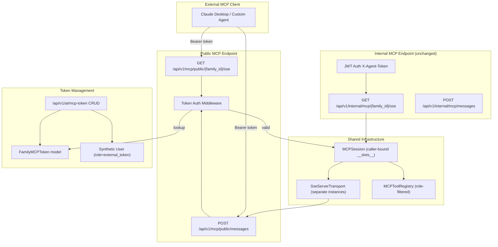

## Goal Capsule

- **Objective:** Expose the backend's internal MCP service as a secure, externally-accessible service with manageable API Token lifecycle, enabling external MCP clients (Claude Desktop, custom agents) to access family data via standard MCP protocol.
- **Product authority:** Family owner controls token lifecycle and access scope.
- **Open blockers:** None.
- **Execution profile:** Code — backend Python + frontend Vue.

---

## Product Contract

*Product Contract unchanged from ce-brainstorm requirements-only version.*

### Summary

Expose the internal MCP SSE endpoint (`/api/v1/internal/mcp/{family_id}/sse`) as a public endpoint authenticated by long-lived API Tokens instead of short-lived JWTs. Each family gets one manageable token with two-level access control (read-only by default, write as separate opt-in). A frontend management card on the existing MCP settings page lets the owner view, toggle, rotate, and set expiration on the token.

### Problem Frame

The backend provides 17 MCP tools for family data access (assets, liabilities, travel, learning, etc.) via an internal SSE endpoint authenticated by 5-minute JWT agent tokens. This works for the internal agent module but cannot serve external MCP clients like Claude Desktop or user-built agents — they have no way to obtain or refresh a JWT.

The capability exists; only the authentication and access-control layer is missing.

### Key Decisions

1. **Synthetic service user** — Create a virtual `User` row with `role='external_token'` per family. MCPSession's caller-binding invariants hold unchanged. (session-settled: user-directed — chosen over token-as-caller and external-role-only: preserves MCPSession contract, clean audit trail via User FK) Governs R4, R5.

2. **Separate `allow_write` toggle** — `allow_external` gates read-only access. `allow_write` is a separate opt-in (default off) for write tools. (session-settled: user-directed — chosen over single-toggle-all-tools and per-tool-from-day-one: read-only safe default, explicit write opt-in) Governs R5, R12.

3. **Both Bearer header and query param auth** — Support `Authorization: Bearer mcp_xxx` and `?token=mcp_xxx`. Query param usage logs a WARNING. (session-settled: user-approved — chosen over Bearer-only and auto-redirect: maximizes MCP client compatibility) Governs R7, R6.

### Actors

- A1. **Family owner** — manages token lifecycle (generate, toggle, rotate, expire) via the frontend settings page. Only role with write access to token configuration.
- A2. **Adult family member** — views token status (masked display, expiration, last used) in read-only mode. Cannot modify token settings.
- A3. **External MCP client** — connects via standard MCP SSE protocol using the API Token. Has no user account in the system.
- A4. **Synthetic service user** — virtual `User` row (`role='external_token'`) that stands in for external callers within MCPSession. Not a human actor.

### Requirements

**Token Data Model & Security**

- R1. A `FamilyMCPToken` model stores per-family API token state: `token_hash` (SHA-256), `token_prefix` (first 8 chars for display), `token_last4` (last 4 chars), `allow_external` (bool, default false), `allow_write` (bool, default false), `expires_at` (nullable datetime), `last_used_at` (nullable datetime), `is_active` (bool, default true), plus standard timestamps.
- R2. Plaintext token is generated as `mcp_` prefix + cryptographically random string. Plaintext is returned to the caller exactly once at generation time. Only the hash and display fragments (prefix/last4) are persisted.
- R3. One active token per family. Token generation on an existing token performs rotation: deactivate the old token, create a new one.
- R4. A synthetic `User` row with `role='external_token'` is created per family alongside the first token. This user must be: (a) excluded from family member list queries, (b) rejected by the login endpoint, (c) added to `_VALID_ROLES` in the MCP tool registry.
- R5. Tool access for external connections uses two-level gating. Read-only tools (13 `get_*` tools, `requires_write=False`) are available when `allow_external=True`. Write tools (4 `import_*`/`record_*` tools, `requires_write=True`) require both `allow_external=True` and `allow_write=True`.
- R6. Token passed as URL query parameter triggers an audit WARNING log: family_id, token prefix, client IP. Bearer header usage does not trigger this log.

**Public MCP Endpoints**

- R7. Two new endpoints: `GET /api/v1/mcp/public/{family_id}/sse` (SSE connection) and `POST /api/v1/mcp/public/messages` (JSON-RPC messages). Both accept token via `Authorization: Bearer mcp_xxx` header or `?token=mcp_xxx` query parameter.
- R8. The public messages endpoint shares the `SseServerTransport` session routing mechanism with the internal path but operates on a separate transport instance to avoid cross-contamination of auth contexts.
- R9. Token validation flow: lookup by `token_prefix` + `family_id` where `is_active=True`, compare hash, verify `expires_at` is null or in the future, verify `allow_external=True`. Update `last_used_at` on successful connection. Invalid/expired → 401. `allow_external=False` → 403.

**Token Management API**

- R10. CRUD endpoints under `/api/v1/ai/mcp-token`. Owner-only access (via `require_owner`). Scoped to caller's family_id.
- R11. `POST` generates a new token (or rotates existing). Returns plaintext token in the response body — this is the only time plaintext is available. Response includes a notice that the token cannot be retrieved again.
- R12. `PATCH` updates `allow_external` and/or `allow_write` booleans, and/or `expires_at`. Each toggle is independent.
- R13. `DELETE` soft-deactivates the token (`is_active=False`). Equivalent to revocation.
- R14. `GET` returns token metadata only: `token_prefix`, `token_last4`, `allow_external`, `allow_write`, `expires_at`, `last_used_at`, `is_active`, `created_at`. Never returns hash or plaintext.

**Frontend Management UI**

- R15. A "Backend MCP" card on the existing `/settings/ai/mcp` page (visually distinct from the regular MCP server list).
- R16. Token display: masked by default (`mcp_••••••••••••abcd`), eye toggle to reveal plaintext (auto-re-masks after 10 seconds), copy-to-clipboard button, regenerate button with confirmation dialog.
- R17. Toggle switches for `allow_external` and `allow_write`, each with confirmation dialog. Enabling `allow_external` shows a security warning listing exposed data scope. Enabling `allow_write` shows a separate warning about write capabilities.
- R18. Expiration selector: 30 days / 90 days / 180 days / 1 year / custom date / never. Default is never.
- R19. Display metadata: `last_used_at`, `created_at`, current expiration status.
- R20. Owner-only: adult members see the card in read-only mode (masked token, toggle states visible but disabled).

**Internal Compatibility**

- R21. The existing internal agent MCP path (`X-Agent-Token` JWT via `/api/v1/internal/mcp/{family_id}/sse`) remains completely unaffected. No changes to `server/apps/backend/app/routers/mcp_internal.py`.
- R22. `bootstrap/family_mcp_servers.py` system-built MCP server records remain unchanged. The `mcp_type="backend"` protection (no user CRUD, no deletion) is unaffected.
- R23. `MCPSession` and `MCPToolRegistry` are shared between internal and external paths. External auth produces a caller identity compatible with the existing session constructor.

### Key Flows

- F1. Token generation (first time)
  - **Trigger:** Owner opens Backend MCP card, no token exists.
  - **Actors:** A1, A4
  - **Steps:** Card shows "Generate Token" button. Owner taps it. Backend creates synthetic User (if not exists) + FamilyMCPToken row. Returns plaintext token. Card displays masked token + "Token generated — copy now, it won't be shown again" notice.
  - **Covers R2, R3, R4, R11, R16.**

- F2. External client connects via SSE
  - **Trigger:** External MCP client opens SSE connection with Bearer token.
  - **Actors:** A3, A4
  - **Steps:** Request hits `/api/v1/mcp/public/{family_id}/sse`. Backend validates token, resolves synthetic user, checks `allow_external`. Creates MCPSession with `caller_role='external_token'` and `allow_write` from token config. MCP protocol handshake proceeds. Tool listing filtered by two-level gating (R5).
  - **Covers R5, R7, R9, R23.**

- F3. Token rotation
  - **Trigger:** Owner taps "Regenerate" on the Backend MCP card.
  - **Actors:** A1
  - **Steps:** Confirmation dialog: "Old token will be invalidated immediately. Continue?" Owner confirms. Backend deactivates old token, generates new one, returns new plaintext. Old external clients lose access; owner must reconfigure them with the new token.
  - **Covers R3, R11, R16.**

- F4. Enable external access
  - **Trigger:** Owner toggles `allow_external` on.
  - **Actors:** A1
  - **Steps:** Security warning dialog lists data scope exposed by read-only tools. Owner confirms. Backend PATCHes `allow_external=True`. External clients can now connect.
  - **Covers R12, R17.**

### Acceptance Examples

- AE1. New token, default state — Covers R1, R2, R5. Given a freshly generated token with `allow_external=False`. When external client connects. Then 403 Forbidden.
- AE2. allow_external enabled, read-only query — Covers R5, R7, R9. Given `allow_external=True`, `allow_write=False`. When client calls `get_assets`. Then 200 with data. Write tools not listed.
- AE3. Query param auth triggers audit log — Covers R6. Given valid token. When client uses `?token=mcp_xxxx`. Then connection succeeds + WARNING logged.
- AE4. Write access requires both flags — Covers R5, R12. Given `allow_external=True`, `allow_write=False`. When owner enables `allow_write`. Then write tools appear in `tools/list`.
- AE5. Expired token rejected — Covers R9. Given expired token. When client connects. Then 401.
- AE6. Synthetic user invisible in member list — Covers R4. Given family with 2 humans + 1 synthetic user. When member list requested. Then only 2 humans returned.
- AE7. Internal agent path unaffected — Covers R21. Given internal agent with JWT. When calling internal endpoint. Then works unchanged.

### Scope Boundaries

**Phase 2 (deferred):**
- Per-tool checkboxes (`allowed_tools` JSON column; UI for individual tool enable/disable)
- Token usage statistics dashboard
- Anomaly detection (frequency/IP-based alerts)
- Audit log viewer for external access events

**Out of scope:**
- Modifying the internal agent MCP path
- Changing `FamilyMCPServer` model or bootstrap logic
- MCP protocol version negotiation

### Dependencies & Assumptions

- The `mcp` Python SDK's `SseServerTransport` can handle a second transport instance for the public path.
- `require_owner` auth dependency correctly gates token management endpoints without modification.
- The `UserRole` StrEnum supports adding `EXTERNAL_TOKEN = 'external_token'` without migration issues (roles stored as strings in DB).

---

## Planning Contract

### Key Technical Decisions

KTD1. **SHA-256 for token hash** — Verification-only storage; plaintext never needs recovery. SHA-256 via `hashlib.sha256(token.encode()).hexdigest()` is sufficient — bcrypt is for passwords where rainbow-table and timing resistance matter, but MCP tokens have high entropy (43+ random chars) and comparison is always against a single row indexed by `(family_id, token_prefix)`. Covers R1, R2.

KTD2. **Composite index `(family_id, token_prefix)` for token lookup** — Avoids full-table hash comparison on every connection. Each family has at most one active token, so `(family_id, token_prefix)` uniquely identifies it. Hash comparison in Python after fetch. Covers R9.

KTD3. **Synthetic user created atomically with first token** — The token generation service creates both the `FamilyMCPToken` row and the synthetic `User` row in a single DB transaction. If a token already exists, the service performs rotation (deactivate old + create new) and reuses the existing synthetic user. Covers R3, R4.

KTD4. **Rate limiting by `token_prefix + client_ip`** — Public endpoints need rate limiting per the security-protection learning. Key by token prefix (not full token — avoids logging the secret) combined with client IP. Stricter limits than authenticated endpoints since external tokens are higher-value targets. Covers R7.

KTD5. **Separate `api/mcp-token.ts` frontend module** — Token management API is a distinct domain from MCP server CRUD (`api/ai.ts` lines 601-605). A dedicated module keeps the token operations (generate, toggle, rotate, expire) isolated and testable. Covers R15.

KTD6. **`caller_role='external_token'` is sufficient — no `caller_kind` discriminator** — The existing `caller_role` slot already distinguishes external from internal callers. Internal uses `'owner'`/`'member'`; external uses `'external_token'`. Adding a separate discriminator duplicates information and complicates MCPSession construction. `allow_write` is a separate per-token attribute (not a per-role one) — it is passed from the token record into MCPSession as a constructor parameter, and `list_tools()` uses it to override the role filter for `external_token` callers. These are orthogonal: `caller_role` distinguishes who the caller is, `allow_write` is a per-token access attribute. Covers R5, R23.

### Resolved Questions (from brainstorm Outstanding Questions)

- **Token generation method:** `secrets.token_urlsafe(32)` → 43-char random part. Final token: `mcp_` + 43 chars = 47 chars total.
- **Auto-generate on registration vs lazy-create:** Lazy-create on first management UI access (POST to generate endpoint). The issue's mention of auto-generation is deferred to Phase 2 — simpler to let the owner opt in via the UI.
- **MCPSession caller_kind:** Not needed. `caller_role='external_token'` is sufficient (see KTD6).
- **Frontend module:** New `api/mcp-token.ts` (see KTD5).
- **Synthetic user bootstrap:** Created atomically with first token in the same DB transaction (see KTD3).

### High-Level Technical Design

---

## Implementation Units

### U1. Data model and migration

**Goal:** Add `EXTERNAL_TOKEN` to UserRole, create the `FamilyMCPToken` model, write the Alembic migration, register both, and exclude synthetic users from family member list queries.

**Requirements:** R1, R4

**Dependencies:** None

**Files:**
- Modify: `server/packages/core/roles.py` — add `EXTERNAL_TOKEN = 'external_token'` to UserRole StrEnum
- Create: `server/apps/backend/app/models/family_mcp_token.py` — `FamilyMCPToken` model
- Modify: `server/apps/backend/app/models/__init__.py` — import `FamilyMCPToken`
- Create: `server/apps/backend/alembic/versions/{revision}_add_family_mcp_tokens.py` — Alembic migration
- Modify: `server/apps/backend/app/services/family.py` — add `User.role != 'external_token'` filter to `get_family_members`

**Approach:**
1. Add `EXTERNAL_TOKEN = 'external_token'` to the UserRole StrEnum in `packages/core/roles.py`.
2. Create `FamilyMCPToken(Base)` with columns: `id` (BigInteger, snowflake), `family_id` (BigInteger, indexed), `token_hash` (String(64), SHA-256 hex digest), `token_prefix` (String(8), indexed), `token_last4` (String(4)), `allow_external` (Boolean, default False), `allow_write` (Boolean, default False), `expires_at` (UTCDateTime, nullable), `last_used_at` (UTCDateTime, nullable), `is_active` (Boolean, default True), `created_at`, `updated_at`. Composite index on `(family_id, token_prefix)`.
3. Register the model in `models/__init__.py`.
4. Generate Alembic migration. Include a fresh-DB guard (check column existence before adding) per the project's migration convention.
5. Add `User.role != UserRole.EXTERNAL_TOKEN` filter to `get_family_members()` in `services/family.py`.

**Patterns to follow:** `server/apps/backend/app/models/family_mcp_server.py` for model structure and snowflake ID pattern. Existing migrations in `server/apps/backend/alembic/versions/` for naming convention.

**Test scenarios:**
- Covers AE6: `get_family_members` with a synthetic user in the family returns only human members.
- `FamilyMCPToken` model can be created and queried with all fields populated.
- Alembic migration applies cleanly on a fresh DB and on an existing DB with data.

**Verification:** `cd server/apps/backend && uv run alembic upgrade head` succeeds. Unit test for member list exclusion passes.

---

### U2. Token service and management API

**Goal:** Token generation, verification, rotation, and CRUD endpoints for owner-managed token lifecycle.

**Requirements:** R2, R3, R10, R11, R12, R13, R14

**Dependencies:** U1

**Files:**
- Create: `server/apps/backend/app/services/mcp_token.py` — token generation, verification, rotation logic
- Create: `server/apps/backend/app/routers/ai_mcp_token.py` — CRUD router
- Create: `server/apps/backend/app/schemas/mcp_token.py` — request/response schemas
- Modify: `server/apps/backend/app/main.py` — register the new router

**Approach:**
1. **`services/mcp_token.py`:**
   - `generate_token(family_id, db) -> (plaintext, token_row)`: Generate `mcp_` + `secrets.token_urlsafe(32)`. Hash with SHA-256. Create synthetic User if not exists (reuse existing one on rotation). Deactivate old active token if present. Create new `FamilyMCPToken` row. Return plaintext + row in a single transaction.
   - `verify_token(family_id, raw_token, db) -> token_row | None`: Compute `token_prefix = raw_token[:8]`. Look up by `(family_id, token_prefix)`. Compare hash. Check `is_active`, check `expires_at`. Update `last_used_at`. Return row or None.
   - `rotate_token(family_id, db) -> (plaintext, token_row)`: Deactivate current, call `generate_token`.
   - `update_access(family_id, db, *, allow_external=None, allow_write=None, expires_at=None)`: PATCH the token's access fields.

2. **`schemas/mcp_token.py`:**
   - `MCPTokenResponse(SnowflakeBase)`: `token_prefix`, `token_last4`, `allow_external`, `allow_write`, `expires_at`, `last_used_at`, `is_active`, `created_at`.
   - `MCPTokenGenerateResponse(SnowflakeBase)`: extends `MCPTokenResponse` with `token` (plaintext, only returned once).
   - `MCPTokenUpdate(BaseModel)`: `allow_external: bool | None`, `allow_write: bool | None`, `expires_at: datetime | None`.

3. **`routers/ai_mcp_token.py`** (prefix=`/ai/mcp-token`):
   - `GET ""` → `MCPTokenResponse` (404 if no token exists for family)
   - `POST ""` → `MCPTokenGenerateResponse` (generates or rotates)
   - `PATCH ""` → `MCPTokenResponse`
   - `DELETE ""` → 204 (soft-deactivate)
   - All endpoints use `Depends(require_owner)`, scoped to `current_user.family_id`.

4. Register router in `main.py` with `prefix="/api/v1"`.

**Patterns to follow:** `server/apps/backend/app/routers/ai_mcp.py` for router structure, `require_owner` guard, and `SnowflakeBase` response pattern. `server/apps/backend/app/services/ai_crypto.py` for crypto patterns.

**Test scenarios:**
- Generate token: returns plaintext starting with `mcp_`, row has correct hash, prefix, last4.
- Covers AE1: Fresh token has `allow_external=False`, `allow_write=False` by default.
- Verify token: valid token returns row; wrong hash returns None; expired token returns None; inactive token returns None.
- Rotate: old token `is_active=False`, new token works, synthetic user reused.
- PATCH `allow_external=True`: persisted correctly.
- DELETE: `is_active=False`, subsequent verify fails.
- Non-owner gets 403 on all endpoints.
- GET returns 404 when no token exists.

**Verification:** `cd server && uv run pytest tests/backend/unit/test_mcp_token.py -v` — all tests pass. `uv run ruff check apps/backend/app/services/mcp_token.py apps/backend/app/routers/ai_mcp_token.py` clean.

---

### U3. Public MCP SSE endpoint with token auth

**Goal:** External-facing MCP endpoints that authenticate via API Token instead of JWT, create MCPSession for the synthetic user, and enforce two-level tool gating.

**Requirements:** R5, R6, R7, R8, R9

**Dependencies:** U1, U2

**Files:**
- Create: `server/apps/backend/app/routers/mcp_public.py` — public SSE + messages endpoints
- Modify: `server/apps/backend/app/services/mcp_session.py` — add `allow_write` parameter to constructor for external callers
- Modify: `server/apps/backend/app/services/mcp_tool_registry.py` — add `EXTERNAL_TOKEN` to `_VALID_ROLES`, add `external_token` to `allowed_roles` for read-only tools; add `requires_external_write` flag on write tools
- Modify: `server/apps/backend/app/main.py` — register `mcp_public` router

**Approach:**
1. **`routers/mcp_public.py`:**
   - Create a separate `SseServerTransport` instance with endpoint `/api/v1/mcp/public/messages` (module-level, distinct from the internal transport).
   - Create a `PublicMCPSSEResponse` class that accepts a transport instance in `__init__` (unlike the internal `MCPSSEResponse` which hardcodes `_get_transport()`). Its `__call__` uses the injected transport for SSE connection and message routing.
   - `_extract_token(request, header, query_param) -> str | None`: Extract from `Authorization: Bearer` header or `?token=` query param. Header takes precedence.
   - `_validate_and_resolve(family_id, raw_token, db) -> User`: Call `mcp_token.verify_token()`. On failure raise `AppError(401)`. If `allow_external=False` raise `AppError(403)`. Return the synthetic User row (looked up via the token's family).
   - `GET /{family_id}/sse`: Extract token, validate, resolve synthetic user, create `MCPSession(family_id, synthetic_user.id, 'external_token', allow_write=token.allow_write)`, return `MCPSSEResponse`. If token came from query param, log WARNING with family_id, prefix, client IP.
   - `POST /messages`: Same auth extraction and validation. Delegate to public transport.
   - Both endpoints are unauthenticated by FastAPI dependencies (no `require_adult`/`require_owner`) — token auth is self-contained.

2. **`mcp_tool_registry.py` changes:**
   - Add `'external_token'` to `_VALID_ROLES`.
   - For each read-only tool (`requires_write=False`): add `'external_token'` to `allowed_roles`.
   - For each write tool (`requires_write=True`): do NOT add `'external_token'` to `allowed_roles`. Write access is gated differently (see below).

3. **`mcp_session.py` changes:**
   - Add `'_allow_write'` to `__slots__` tuple (required — `__slots__` must declare all instance attributes or `AttributeError` is raised at runtime).
   - Add optional `allow_write: bool = False` parameter to `MCPSession.__init__`. Store as `self._allow_write`.
   - In `list_tools()`: when `caller_role == 'external_token'` and `self._allow_write == True`, include write tools in the listing (override the role filter for this specific case).
   - In `call_tool()`: after the existing `allowed_roles` check (line 302), add a bypass: when `self._caller_role == 'external_token'` and `self._allow_write` and `meta.requires_write`, allow the call to proceed. Without this bypass, the defense-in-depth role check blocks write tools even when `list_tools()` includes them.

4. Register router in `main.py`.
5. Apply rate limiting per KTD4: key by `token_prefix + client_ip`, stricter than authenticated endpoints (e.g., 30 requests/minute). Use the existing rate-limiting middleware from the security-protection pattern.

**Patterns to follow:** `server/apps/backend/app/routers/mcp_internal.py` for SSE transport pattern, `MCPSSEResponse`/`MCPMessageResponse` ASGI response classes, and caller validation flow.

**Test scenarios:**
- Covers AE2: Valid Bearer token, `allow_external=True`, `allow_write=False` → SSE connects, `tools/list` returns only read-only tools.
- Covers AE3: Valid query param token → SSE connects, WARNING logged with family_id and prefix.
- Covers AE5: Expired token → 401 with "token expired" detail.
- Invalid token → 401.
- `allow_external=False` → 403.
- Covers AE4: `allow_write=True` → `tools/list` includes write tools.
- Internal agent path (`X-Agent-Token`) still works unchanged — no import of `mcp_public` from `mcp_internal`.
- Covers R22: `bootstrap/family_mcp_servers.py` system-built backend MCP server records are unchanged — `mcp_type="backend"` protection, no CRUD, no deletion.
- POST /messages routes to the correct SSE session.

**Verification:** `uv run pytest tests/backend/unit/test_mcp_public.py -v` — all auth and tool-gating tests pass. Manual SSE test with `curl -H "Authorization: Bearer mcp_..." http://localhost:8000/api/v1/mcp/public/{family_id}/sse` connects and receives MCP handshake.

---

### U4. Auth guard and login rejection

**Goal:** Prevent the synthetic `external_token` user from logging in via the normal auth flow.

**Requirements:** R4

**Dependencies:** U1

**Files:**
- Modify: `server/apps/backend/app/services/auth.py` — add `external_token` role rejection in login flow

**Approach:**
1. In the login function in `services/auth.py`, add an explicit guard before the password check: if `user.role == UserRole.EXTERNAL_TOKEN`, raise `AppError(ErrorCode.AUTH_INVALID_CREDENTIALS)`. This provides defense-in-depth and clear audit logging.
2. Note: synthetic users with no `password_hash` are already rejected by the existing `password_hash is None` check at `services/auth.py:440` (child accounts have no password hash). The explicit role check adds defense-in-depth and produces a more informative log message.

**Patterns to follow:** `server/apps/backend/app/services/auth.py:419` — child role rejection pattern.

**Test scenarios:**
- Login attempt with an `external_token` role user → `AUTH_INVALID_CREDENTIALS` error, same as child role.
- Normal owner/member login still works (no regression).

**Verification:** `uv run pytest tests/backend/unit/test_auth.py -v` — login rejection test passes, existing auth tests pass.

---

### U5. Frontend Backend MCP management card

**Goal:** Owner can view, generate, toggle, rotate, and set expiration on the family's MCP API Token from the settings page.

**Requirements:** R15, R16, R17, R18, R19, R20

**Dependencies:** U2

**Files:**
- Create: `frontend/apps/main/src/api/mcp-token.ts` — API module for token CRUD
- Create: `frontend/apps/main/src/components/settings/BackendMCPCard.vue` — management card component
- Modify: `frontend/apps/main/src/pages/MCPManagePage.vue` — import and render `BackendMCPCard` above the server list
- Modify: `frontend/apps/main/src/i18n/locales/zh-CN.ts` — add i18n keys for token management UI
- Modify: `frontend/apps/main/src/i18n/locales/en-US.ts` — add i18n keys

**Approach:**
1. **`api/mcp-token.ts`:**
   - `getToken(): Promise<MCPTokenData>` — GET `/ai/mcp-token`
   - `generateToken(): Promise<MCPTokenGenerateData>` — POST `/ai/mcp-token`
   - `updateToken(payload): Promise<MCPTokenData>` — PATCH `/ai/mcp-token`
   - `deleteToken(): Promise<void>` — DELETE `/ai/mcp-token`

2. **`BackendMCPCard.vue`:**
   - Token display: masked `mcp_••••••••••••{last4}` by default. Eye toggle reveals plaintext stored in a local ref, auto-re-masks after 10s timeout. Copy button copies to clipboard.
   - Generate/rotate button: `showConfirmDialog` → POST → display plaintext with "copy now" notice.
   - Two toggle switches: `allow_external` and `allow_write`. Each toggle shows a `showConfirmDialog` with security warning before PATCH.
   - Expiration picker: `van-field` (readonly, is-link) + `van-popup` + `van-picker` with preset options.
   - Metadata display: `last_used_at`, `created_at`.
   - When no token exists: show "Generate Token" button.
   - Owner-only: `isOwner` computed guard; non-owners see masked state with disabled controls.

3. **`MCPManagePage.vue`:**
   - Import `BackendMCPCard` and render it above the existing server list `van-cell-group`.
   - Visually distinct: card header with "Backend MCP" title and "系统内置" tag.

4. **i18n keys:** All user-facing strings use `t('mcp.token.*')` namespace.

**Patterns to follow:** `frontend/apps/main/src/pages/MCPManagePage.vue` for card layout and dialog patterns. `frontend/apps/main/src/api/ai.ts` for API module structure. Vant 4 patterns: `showConfirmDialog`, `van-field` + `van-popup` + `van-picker`, `showSuccessToast`/`showFailToast`.

**Test scenarios:**
- No token: card shows "Generate Token" button.
- Generate: POST returns plaintext, card shows masked token + copy notice.
- Eye toggle: reveals plaintext, auto-re-masks after 10s.
- Copy: clipboard contains full plaintext token.
- Toggle `allow_external`: confirm dialog with security warning → PATCH → success toast.
- Toggle `allow_write`: separate confirm dialog → PATCH.
- Rotate: confirm dialog → POST → new masked token displayed.
- Non-owner: toggles and buttons disabled, masked token visible.
- Expiration picker: select "30 days" → PATCH with computed `expires_at`.

**Verification:** `cd frontend && pnpm -r typecheck` passes. `pnpm -r lint` passes. Visual check in dev server.

---

## Verification Contract

| Gate | Command | Scope | When |
|------|---------|-------|------|
| Backend unit tests | `cd server && uv run pytest tests/backend/unit/test_mcp_token.py tests/backend/unit/test_mcp_public.py tests/backend/unit/test_auth.py -v` | U1-U4 | After each unit |
| Backend lint | `cd server && uv run ruff check apps/backend/app/services/mcp_token.py apps/backend/app/routers/ai_mcp_token.py apps/backend/app/routers/mcp_public.py apps/backend/app/models/family_mcp_token.py` | U1-U3 | After each unit |
| Backend type check | `cd server && uv run mypy apps/backend/app/services/mcp_token.py apps/backend/app/routers/ai_mcp_token.py apps/backend/app/routers/mcp_public.py` | U1-U3 | After U2, U3 |
| Alembic migration | `cd server/apps/backend && uv run alembic upgrade head` | U1 | After U1 |
| Frontend type check | `cd frontend && pnpm -r typecheck` | U5 | After U5 |
| Frontend lint | `cd frontend && pnpm -r lint` | U5 | After U5 |
| Full backend suite | `cd server && uv run pytest tests/backend/ -v` | All | After all units |
| No regression: internal MCP | `cd server && uv run pytest tests/backend/unit/test_mcp_sse.py tests/backend/unit/test_mcp_sse_caller_handshake.py -v` | U3 | After U3 |

---

## Definition of Done

- All 5 implementation units pass their verification gates.
- Full backend test suite passes (no regressions in internal MCP path, auth, or family services).
- Frontend typecheck and lint pass.
- Alembic migration applies cleanly on fresh and existing databases.
- All 7 Acceptance Examples (AE1-AE7) are covered by test scenarios.
- No `external_token` user appears in family member list responses.
- Internal agent MCP path (`X-Agent-Token` JWT) works identically before and after changes.
- Token plaintext is returned exactly once (at generation/rotation) and never logged or stored.
- Public endpoint query-param auth triggers WARNING audit log.
- No abandoned experimental code remains in the diff.

---

## Sources

- GitHub issue #118: `feat(mcp): 将 Backend MCP 抽象为可外部调用的服务 + API Token 管理`
- Existing MCP architecture: `server/apps/backend/app/routers/mcp_internal.py`, `server/apps/backend/app/services/mcp_session.py`, `server/apps/backend/app/services/mcp_tool_registry.py`
- Existing MCP server model: `server/apps/backend/app/models/family_mcp_server.py`
- Frontend MCP management: `frontend/apps/main/src/pages/MCPManagePage.vue`
- Family member service: `server/apps/backend/app/services/family.py`
- Auth dependencies: `server/apps/backend/app/auth/deps.py`, `server/apps/backend/app/services/auth.py`
- Token/crypto patterns: `server/apps/backend/app/services/ai_crypto.py`
- Role definitions: `server/packages/core/roles.py`
- Institutional learnings: `docs/solutions/architecture-patterns/mcp-caller-bound-principal-2026-05-31.md`, `docs/solutions/best-practices/security-protection.md`, `docs/solutions/best-practices/security-audit.md`
