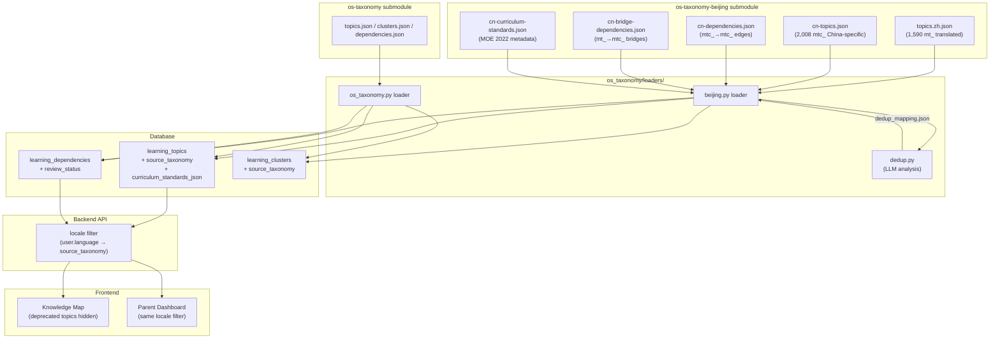

# os-taxonomy-beijing Localization - Plan

## Goal Capsule

- **Objective:** Introduce `os-taxonomy-beijing` as the zh-CN knowledge graph data source, replacing the LLM-translation pipeline for Chinese users. Implement a provider-pattern loader architecture with LLM-based deduplication to ensure a complete, non-redundant knowledge system.
- **Authority:** Product Contract in this document.
- **Execution profile:** Full-stack — `server/packages/os_taxonomy/` refactor, DB schema migration, seed script extension, `learning-content-translate` skill update, frontend locale filtering.
- **Stop conditions:** Dedup mapping produces >15% overlap rate → pause and manually review before seeding. LLM dedup cost > ¥50 one-time → switch to rule-based similarity.
- **Tail ownership:** Implementer owns test quality, verification gate, and PR.

---

## Product Contract

### Summary

Implement locale-aware dual knowledge graph architecture: zh-CN users receive `os-taxonomy-beijing` data (pre-translated, curriculum-aligned, China-specific), en-US users keep the existing `os-taxonomy` + LLM translation pipeline. The `os_taxonomy` package is refactored into a provider-pattern loader architecture. An LLM-based deduplication pipeline runs as a one-time analysis step to detect and resolve semantic overlap between the translated base topics (`mt_`) and China-specific topics (`mtc_`).

### Problem Frame

The current system translates the English `os-taxonomy` (aligned with NGSS / Common Core / UK NC) into Chinese via LLM. This produces adequate translations but lacks alignment with China's 2022 Ministry of Education curriculum standards and entirely misses China-specific subjects (语文, 道德与法治, 历史). A community project `os-taxonomy-beijing` addresses this gap with pre-translated topics, 2,008 China-specific micro-topics (`mtc_` prefix), and curriculum standard mappings. Integrating it requires resolving data format differences, schema gaps, and content overlap — without disrupting existing learning progress data.

### Key Decisions

- **KD-1. Replace, not dual-track** (session-settled: user-directed — chosen over dual-track parallel or merge-enhance: simpler architecture, one data source per locale). zh-CN uses Beijing data directly; en keeps existing pipeline. Both share the same DB tables, distinguished by `source_taxonomy`. Governs R1, R2, R3, R4, R5.

- **KD-2. Merged content composition** (session-settled: user-directed — chosen over China-specific-only or phased: complete knowledge graph from day one). zh-CN sees base translated topics (1,590 `mt_`) + China-specific topics (2,008 `mtc_`) = ~3,598 topics. Bridge dependencies connect the two layers. Governs R1, R2.

- **KD-3. Per-user locale via existing field** (session-settled: user-approved — existing `User.language` field at `server/packages/db/models/user.py:62` already carries `zh-CN`/`en-US`). No new locale config layer. Governs R4, R6, R12, R14.

- **KD-4. Provider pattern for os_taxonomy package** (session-settled: user-directed — chosen over minimal flat extension: cleaner separation, future extensibility for additional locale taxonomies). `os_taxonomy` is refactored into `loaders/` with per-source loaders returning a unified `NormalizedTopic` structure. Governs R1, R2, R3.

- **KD-5. LLM semantic deduplication** (session-settled: user-directed — chosen over seed-time detection or trusting upstream data: most precise, avoids duplicate concepts in the child's knowledge system). A one-time LLM analysis generates `dedup_mapping.json`; seed consumes it to merge or hide overlapping topics. Governs R7, R8, R9.

- **KD-6. Curriculum standards in dedicated field.** Add `curriculum_standards_json` to `learning_topics` (separate from the existing empty `standards_json`). The existing `standards_json` was designed for the English taxonomy's standards format; mixing Chinese MOE standard identifiers into it would create ambiguity. Governs R4.

- **KD-7. Concatenation merge for dedup overlap** (session-settled: user-directed — chosen over mt_-only, mtc_-only, or association-only: preserves both international and China-curriculum perspectives). When merge is triggered, `description_zh` concatenates mt_ + mtc_ content; `curriculum_standards` and `evidence` take the union; `name_zh` and `assessment_prompt` keep mt_ versions. Governs R8.

### Requirements

**Data Architecture**

- R1. The `os_taxonomy` package exposes a loader interface: `load_topics(source: str) -> list[NormalizedTopic]` and `load_dependencies(source: str) -> list[NormalizedDependency]`. Each source has its own loader module under `os_taxonomy/loaders/`. The `NormalizedTopic` structure includes all fields needed by both sources: `topic_key`, `source_taxonomy`, `name_zh`, `curriculum_standards`, `review_status`, `translation_status`.

- R2. The Beijing loader reads 7 data files from the `os-taxonomy-beijing` submodule: `topics.zh.json`, `cn-topics.json`, `clusters.zh.json`, `dependencies.zh.json`, `cn-dependencies.json`, `cn-bridge-dependencies.json`, `cn-curriculum-standards.json`. The os-taxonomy loader reads the existing 3 files: `topics.json`, `clusters.json`, `dependencies.json`. Each loader normalizes its source-specific format into the shared structure.

- R3. The Beijing data produces two topic sets in the DB: `mt_` topics with `source_taxonomy="beijing"` (Chinese translations from `topics.zh.json`) and `mtc_` topics with `source_taxonomy="beijing"` (China-specific from `cn-topics.json`). The os-taxonomy source produces `mt_` topics with `source_taxonomy="os-taxonomy"`. Topics with the same `topic_key` from different sources coexist as separate DB records (different Snowflake IDs) — they serve different locales.

**DB Schema**

- R4. `learning_topics` gains two columns: `source_taxonomy` (String(20), not null, default `"os-taxonomy"`, indexed) and `curriculum_standards_json` (Text, nullable, default `"[]"`). `source_taxonomy` distinguishes data provenance; `curriculum_standards_json` stores Beijing's `cnStandards` identifiers.

- R5. `learning_dependencies` gains one column: `review_status` (String(10), nullable). Values: `"reviewed"`, `"machine"`, `"rejected"`. Edges with `review_status="rejected"` are excluded from seeding. The column is nullable to preserve existing dependency records that have no review status.

- R6. `learning_clusters` gains one column: `source_taxonomy` (String(20), not null, default `"os-taxonomy"`).

**Deduplication**

- R7. A deduplication pipeline analyzes semantic overlap between translated `mt_` topics and `mtc_` topics within each subject. It produces a `dedup_mapping.json` file consumed by the seed script. The mapping contains entries with `mtc_topic_key`, `mt_topic_key`, `overlap_type` (`"equivalent"`, `"subset"`, `"complementary"`, `"none"`), and `action` (`"merge"`, `"hide_mtc"`, `"keep_both"`).

- R8. When `action="merge"`, the seed script combines the `mtc_` topic's content into the `mt_` topic record using concatenation merge: `curriculum_standards` takes the union of both; `name_zh` keeps the `mt_` version; `description_zh` concatenates — `mt_` general description first, then `mtc_`'s China-curriculum perspective appended; `evidence` takes the union; `assessment_prompt` keeps the `mt_` version. The `mtc_` topic is marked `deprecated=True`. When `action="hide_mtc"`, the `mtc_` topic is seeded with `deprecated=True`. When `action="keep_both"`, both topics are seeded normally. Bridge dependencies referencing a deprecated `mtc_` topic are rerouted to its merged `mt_` counterpart.

- R9. The dedup pipeline is a standalone CLI script (`python -m os_taxonomy.dedup`), not embedded in the seed flow. It uses LLM analysis with structured output. Cost target: < ¥50 one-time for the full analysis. If cost exceeds threshold, fall back to rule-based string similarity (edit distance on `name_zh`).

**Seed Script**

- R10. The seed script accepts `--source beijing` (default: `os-taxonomy`). When `--source beijing`, it reads from the Beijing loader, applies the dedup mapping, and seeds all topics with `source_taxonomy="beijing"`. Existing UPSERT-on-`(topic_key, source_taxonomy)` composite logic preserves Snowflake IDs and progress records for unchanged topics.

- R11. The `learning-content-translate` skill adds `os-taxonomy-beijing` as a second git submodule. The Beijing path skips the LLM translation pipeline entirely — data is pre-translated. The existing translation pipeline remains for en-US only.

**API and Frontend**

- R12. Backend learning APIs filter topics by `source_taxonomy` matching the requesting user's `language` field: `user.language == "zh-CN"` → `source_taxonomy="beijing"`; `user.language == "en-US"` → `source_taxonomy="os-taxonomy"`. This applies to topic listing, knowledge map, recommendation, and progress queries.

- R13. Child frontend knowledge map displays all topics from the user's locale source without distinction between `mt_` and `mtc_` origins. Topics marked `deprecated=True` are hidden. The `curriculum_standards` field is available for future display (Phase 2 — not required in this scope).

- R14. Parent dashboard learning views apply the same locale filter. Parents see the same topic set their child sees, with mastery status.

### Key Flows

- F1. Beijing data seed flow
  - **Trigger:** Developer runs `python scripts/seed_learning_topics.py --source beijing`
  - **Steps:**
    1. Loader reads Beijing submodule data files, normalizes to `NormalizedTopic`/`NormalizedDependency`
    2. Dedup mapping is loaded from `dedup_mapping.json` (if present)
    3. For each `mtc_` topic with `action="merge"`: combine China-specific content into the corresponding `mt_` topic record; mark `mtc_` as deprecated
    4. UPSERT all topics into `learning_topics` (preserving existing Snowflake IDs for matching `topic_key`)
    5. UPSERT all non-rejected dependencies into `learning_dependencies` (with `review_status`)
    6. UPSERT clusters into `learning_clusters`
  - **Outcome:** DB contains ~3,598 topics (minus dedup merges) with `source_taxonomy="beijing"`, all dependency edges, curriculum standards populated

- F2. Runtime locale routing
  - **Trigger:** Child requests learning topics via API
  - **Steps:**
    1. Backend extracts `user.language` from JWT
    2. API query adds `WHERE source_taxonomy = :source` filter (mapped from locale)
    3. Deprecated topics are excluded (`WHERE deprecated = False`)
    4. Response includes topic data with curriculum standards (for future use)
  - **Outcome:** zh-CN child sees Beijing knowledge graph; en-US child sees translated os-taxonomy graph

- F3. Deduplication analysis
  - **Trigger:** Developer runs `python -m os_taxonomy.dedup --source beijing`
  - **Steps:**
    1. Load translated `mt_` topics and `mtc_` topics from Beijing data
    2. Group by subject
    3. For each subject, use LLM to analyze semantic overlap between `mt_` (Chinese names) and `mtc_` (Chinese names)
    4. Generate overlap classification: equivalent / subset / complementary / none
    5. Output `dedup_mapping.json` with recommended actions
    6. Developer reviews the mapping before committing
  - **Outcome:** `dedup_mapping.json` ready for seed consumption

### Acceptance Examples

- AE1. zh-CN child sees merged Beijing graph
  - **Covers R1, R2, R3, R12, R13.**
  - **Given:** A zh-CN child user with `language="zh-CN"`, DB seeded with Beijing data
  - **When:** Child opens knowledge map
  - **Then:** Map shows ~3,598 topics (minus dedup merges), including both translated `mt_` topics (e.g., "光合作用") and China-specific `mtc_` topics (e.g., "拼音·声母韵母"), connected by bridge dependencies. No deprecated topics visible.

- AE2. Dedup merge eliminates conceptual duplicate
  - **Covers R7, R8.**
  - **Given:** Dedup analysis finds `mtc_X` (中国地理概况) is `equivalent` to `mt_Y` (Geography of China, translated)
  - **When:** Seed runs with `dedup_mapping.json`
  - **Then:** `mt_Y` record gets `mtc_X`'s curriculum standards merged in. `mtc_X` is seeded with `deprecated=True`. Knowledge map shows only `mt_Y` with combined content. Bridge dependencies that referenced `mtc_X` now point to `mt_Y`.

- AE3. en-US child unaffected by Beijing data
  - **Covers R3, R12.**
  - **Given:** An en-US child user with `language="en-US"`, DB contains both `source_taxonomy="beijing"` and `source_taxonomy="os-taxonomy"` topics
  - **When:** Child opens knowledge map
  - **Then:** Map shows only `source_taxonomy="os-taxonomy"` topics (the original 1,590 with LLM translations). No Beijing topics visible.

- AE4. Re-seed preserves progress
  - **Covers R10.**
  - **Given:** A child has existing `learning_progress` records for 20 topics from a previous seed
  - **When:** Developer re-seeds with `--source beijing` after Beijing upstream update
  - **Then:** All 20 existing topic records retain their Snowflake IDs (UPSERT on `topic_key`). Child's progress records remain valid. New topics are added; updated topics get new translations; deprecated topics are hidden.

### Scope Boundaries

**This scope:**
- Backend `os_taxonomy` package refactor (provider pattern)
- DB schema migration (3 new columns across 2 tables)
- Seed script extension (`--source beijing`)
- Dedup pipeline (standalone CLI + LLM analysis)
- `learning-content-translate` skill update (second submodule)
- Backend API locale filtering
- Frontend locale-aware topic display (child + parent)
- Alembic migration

**Deferred to follow-up:**
- Curriculum standards display in child UI (data is stored; UI is Phase 2)
- `review_status` badge display in knowledge map (data is stored; UI is Phase 2)
- `translation_status` display (machine vs reviewed indicator)
- Additional locale taxonomies (Taiwan, Hong Kong, etc.)
- Cross-locale concept linking (zh-CN ↔ en-US topic correspondence)
- Beijing data incremental update detection (full re-seed for v1)

**Outside this product's identity:**
- LLM translation pipeline changes (remains for en-US only)
- Learning OS experience changes (game mechanics, AI tutor behavior, recommendation algorithm)
- Frontend onboarding flow changes

### Dependencies and Assumptions

- **os-taxonomy-beijing availability:** The `luw2007/os-taxonomy-beijing` repo must be accessible and stable. Added as git submodule alongside existing `os-taxonomy`.
- **Data format stability:** Beijing data file structure (7 JSON files) is assumed stable. Format changes require loader updates.
- **LLM cost:** One-time dedup analysis cost < ¥50. Uses structured output (JSON mode) for reliable classification. Fallback to rule-based similarity if cost exceeds threshold.
- **Existing progress data safety:** UPSERT on `topic_key` preserves Snowflake IDs. Verified: seed script's existing upsert logic at `server/scripts/seed_learning_topics.py` uses `topic_key` as the natural key.
- **User.language coverage:** All existing users have `language` set (default `zh-CN`). No migration needed.

---

## Planning Contract

*Product Contract unchanged — enriched in place from requirements-only to implementation-ready.*

### Key Technical Decisions

KTD1. **Package structure: `loaders/` subpackage with per-source modules** (instantiates KD-4, governs R1, R2, R3). Each data source gets its own loader file under `server/packages/os_taxonomy/loaders/`. A shared `types.py` defines `NormalizedTopic` and `NormalizedDependency` as Python dataclasses. A `base.py` defines the `TaxonomyLoader` protocol. The package `__init__.py` delegates `get_topics()` / `get_dependencies()` / `get_clusters()` to the appropriate loader based on a `source` parameter, maintaining backward compatibility for the existing seed script call sites.

KTD2. **`NormalizedTopic` as dataclass, not dict** (instantiates KD-4, governs R1). Using `dataclasses.dataclass` instead of raw dicts gives type safety, IDE autocompletion, and explicit field contracts. The dataclass fields cover the union of both sources' fields. Loaders fill source-specific fields and leave others as defaults. This is the seam that lets the seed script treat both sources identically.

KTD3. **Alembic migration with safe defaults** (instantiates KD-1, governs R4, R5, R6). `source_taxonomy` defaults to `"os-taxonomy"` so existing rows are correctly classified without a data migration. `curriculum_standards_json` defaults to `"[]"`. `review_status` is nullable so existing dependencies need no backfill. All three columns are added in a single Alembic revision.

KTD4. **Dedup uses OpenAI SDK with project's existing LLM config** (instantiates KD-5, governs R7, R9). The dedup script reads `api_key` and `ai_base_url` from the same config source as `topic_translate.py` (the `AI_CONFIG` env or settings). It uses `openai.AsyncOpenAI` with `response_format={"type": "json_object"}` for structured output. Batches topics by subject to keep prompt sizes manageable. Falls back to `difflib.SequenceMatcher` on `name_zh` if LLM cost exceeds ¥50.

KTD5. **Beijing submodule alongside existing os-taxonomy** (resolves Outstanding Q2). Place at `server/data/os-taxonomy-beijing/` as a git submodule, mirroring the existing `server/data/os-taxonomy/` location. The seed script resolves data dirs via `--data-dir` flag (existing pattern) or `BEIJING_TAXONOMY_DIR` env var, with a hardcoded fallback relative to the script path.

KTD6. **Locale filter as a service-layer helper** (instantiates KD-3, governs R12, R14). Add `locale_to_source_taxonomy(language: str) -> str` in `server/apps/backend/app/services/learning/topic_service.py`. All learning API endpoints that query topics call this helper to map `user.language` to a `source_taxonomy` filter value. This keeps the mapping in one place rather than scattered across routers.

### Assumptions

- **Bridge dependencies are transparent in the UI.** Bridge deps (mt_ → mtc_) are stored as normal `learning_dependencies` edges. The knowledge map displays them without special styling. Cross-layer visual indicators are deferred to Phase 2.
- **API includes all non-rejected edges.** Both `review_status="reviewed"` and `review_status="machine"` edges are returned. Only `"rejected"` edges are excluded at seed time. The `review_status` metadata is available for future badge/filter UI.
- **Beijing subject mapping extends existing SUBJECT_MAP.** The seed script's `SUBJECT_MAP` dict gains entries for China-specific subjects: 语文 → `chinese`, 道德与法治 → `ethics_law`, 历史 → `history_cn`. Existing subjects (Mathematics, Science, etc.) map to the same slugs.

### Sequencing

U1–U2 (loaders) can proceed in parallel after U0 (types). U3 (DB migration) is independent and can run in parallel with loaders. U4 (dedup) depends on U0+U2 (needs the loader to read Beijing data). U5 (seed) depends on U1–U4 (consumes everything). U6 (API) depends on U3 (needs the new columns). U7 (skill update) depends on U2. U8 (frontend) depends on U6.

---

## Implementation Units

### U0. Normalized types and loader interface

- **Goal:** Define the shared data structures and loader protocol that both source loaders implement.
- **Requirements:** R1
- **Dependencies:** None
- **Files:**
  - `server/packages/os_taxonomy/types.py` (create)
  - `server/packages/os_taxonomy/loaders/__init__.py` (create)
  - `server/packages/os_taxonomy/loaders/base.py` (create)
  - `server/tests/packages/os_taxonomy/test_types.py` (create)
- **Approach:**
  1. Create `NormalizedTopic` dataclass with fields covering both sources: `topic_key`, `source_taxonomy`, `topic_type`, `subject`, `domain`, `name`, `name_zh`, `description`, `description_zh`, `age_range_start`, `age_range_end`, `centrality`, `evidence` (list[str]), `evidence_zh` (list[str] | None), `assessment_prompt`, `assessment_prompt_zh`, `standards` (list[str]), `curriculum_standards` (list[str]), `translation_status` (str | None), `deprecated` (bool), `age_group` (str)
  2. Create `NormalizedDependency` dataclass: `topic_key`, `prerequisite_key`, `strength`, `reason`, `review_status` (str | None)
  3. Create `NormalizedCluster` dataclass: `subject`, `domain`, `age_range_start`, `age_group`, `summary`, `summary_zh`, `source_taxonomy`
  4. Define `TaxonomyLoader` protocol in `base.py` with methods: `load_topics() -> list[NormalizedTopic]`, `load_dependencies() -> list[NormalizedDependency]`, `load_clusters() -> list[NormalizedCluster]`
  5. Package `__init__.py` re-exports types and provides `get_loader(source: str) -> TaxonomyLoader` factory
- **Patterns to follow:** Existing `server/packages/os_taxonomy/__init__.py` return shapes (dicts with `nameZh`, `descriptionZh` keys). The dataclass fields mirror these dict keys.
- **Test scenarios:**
  - `NormalizedTopic` can be instantiated with all required fields and defaults
  - `NormalizedDependency` with `review_status=None` (os-taxonomy source) and `review_status="reviewed"` (beijing source)
  - `get_loader("os-taxonomy")` returns the os-taxonomy loader; `get_loader("beijing")` returns the beijing loader; unknown source raises `ValueError`
- **Verification:** `uv run pytest tests/packages/os_taxonomy/ -v` passes

---

### U1. Refactor existing os-taxonomy loader

- **Goal:** Move the existing flat loader into `loaders/os_taxonomy.py` implementing the `TaxonomyLoader` protocol, returning `NormalizedTopic` instances.
- **Requirements:** R1, R2
- **Dependencies:** U0
- **Files:**
  - `server/packages/os_taxonomy/loaders/os_taxonomy.py` (create)
  - `server/packages/os_taxonomy/__init__.py` (modify — delegate to loader)
  - `server/tests/packages/os_taxonomy/test_os_taxonomy_loader.py` (create)
- **Approach:**
  1. Create `loaders/os_taxonomy.py` with `OsTaxonomyLoader` class implementing `TaxonomyLoader`
  2. `load_topics()` reads existing `topics.json`, maps each dict to `NormalizedTopic` — set `source_taxonomy="os-taxonomy"`, `curriculum_standards=[]`, `translation_status=None`, map existing `nameZh` → `name_zh`, `descriptionZh` → `description_zh`, etc.
  3. `load_dependencies()` reads `dependencies.json`, maps to `NormalizedDependency` with `review_status=None`
  4. `load_clusters()` reads `clusters.json`, maps to `NormalizedCluster` with `source_taxonomy="os-taxonomy"`
  5. Update `__init__.py` to delegate `get_topics()`, `get_dependencies()`, `get_clusters()` to `OsTaxonomyLoader` for backward compatibility (existing seed script calls `from packages.os_taxonomy import get_topics`)
- **Patterns to follow:** Existing `__init__.py` reads JSON via `json.load()` from `_DATA_DIR`. Preserve the same `_DATA_DIR = Path(__file__).parent` pattern.
- **Test scenarios:**
  - `OsTaxonomyLoader.load_topics()` returns list of `NormalizedTopic` with correct field mapping (spot-check 3 topics: verify `topic_key`, `name_zh`, `description_zh`, `source_taxonomy="os-taxonomy"`)
  - `OsTaxonomyLoader.load_dependencies()` returns list with `review_status=None` for all entries
  - Backward-compat: `from packages.os_taxonomy import get_topics; topics = get_topics()` returns same count as before (1,590)
- **Verification:** Existing seed script (`uv run python scripts/seed_learning_topics.py`) still works with no changes (backward compatibility smoke test)

---

### U2. Beijing loader

- **Goal:** Implement the Beijing data loader that reads 7 JSON files and produces normalized structures with `source_taxonomy="beijing"`.
- **Requirements:** R2, R3
- **Dependencies:** U0
- **Files:**
  - `server/packages/os_taxonomy/loaders/beijing.py` (create)
  - `server/tests/packages/os_taxonomy/test_beijing_loader.py` (create)
  - `server/data/os-taxonomy-beijing/` (git submodule — see U2 approach step 1)
- **Approach:**
  1. Initialize git submodule: `git submodule add https://github.com/luw2007/os-taxonomy-beijing.git server/data/os-taxonomy-beijing`
  2. Create `BeijingLoader(data_dir: Path)` implementing `TaxonomyLoader`
  3. `load_topics()` produces two sets:
     - Read `topics.zh.json` → `NormalizedTopic` with `source_taxonomy="beijing"`, `topic_key` = `mt_*`, map `cnStandards` → `curriculum_standards`, `translationStatus` → `translation_status`
     - Read `cn-topics.json` → `NormalizedTopic` with `source_taxonomy="beijing"`, `topic_key` = `mtc_*`, map `cnStandards` → `curriculum_standards`, extend `SUBJECT_MAP` with China-specific subjects (语文→`chinese`, 道德与法治→`ethics_law`, 历史→`history_cn`)
  4. `load_dependencies()` merges three sources:
     - `dependencies.zh.json` → mt_→mt_ edges (translated reasons)
     - `cn-dependencies.json` → mtc_→mtc_ edges
     - `cn-bridge-dependencies.json` → mt_→mtc_ bridge edges
     - Map `reviewStatus` → `review_status`; set `"rejected"` edges aside (do not return them)
  5. `load_clusters()` reads `clusters.zh.json` if present, else produces clusters from topic subject/domain groupings
  6. `cn-curriculum-standards.json` is metadata only (standard names, versions, source URLs) — the actual identifiers (`cnStandards` arrays) are embedded in the topic files and mapped in steps 3-4. The loader does not need to parse the standards file separately; it is referenced by the seed script for future display purposes.
  7. Data dir resolution: constructor takes `data_dir: Path`, defaults to `BEIJING_TAXONOMY_DIR` env var or hardcoded fallback `Path(__file__).parent.parent.parent / "data" / "os-taxonomy-beijing"`
- **Patterns to follow:** OsTaxonomyLoader's JSON-reading pattern. Seed script's `SUBJECT_MAP` dict for subject normalization (extend it).
- **Test scenarios:**
  - `BeijingLoader.load_topics()` returns both `mt_` and `mtc_` topics, all with `source_taxonomy="beijing"`
  - `mt_` topics from `topics.zh.json` have `curriculum_standards` populated from `cnStandards`
  - `mtc_` topics from `cn-topics.json` have correct subject mapping (语文 → `chinese`)
  - `load_dependencies()` excludes edges with `reviewStatus="rejected"`
  - Bridge dependencies are included with correct `topic_key`/`prerequisite_key` mapping
  - Total topic count ≈ 3,598 (1,590 mt_ + 2,008 mtc_)
- **Verification:** `uv run pytest tests/packages/os_taxonomy/test_beijing_loader.py -v` passes. Manual: loader produces expected topic counts.

---

### U3. DB schema migration

- **Goal:** Add three new columns to support dual-source data and review status tracking.
- **Requirements:** R4, R5, R6
- **Dependencies:** None (independent of loaders)
- **Files:**
  - `server/packages/db/models/learning/topic.py` (modify)
  - `server/apps/backend/alembic/versions/<new>_add_source_taxonomy_and_review_status.py` (create — autogenerated)
  - `server/tests/packages/db/test_learning_models.py` (create or modify)
- **Approach:**
  1. Add to `LearningTopic`:
     - `source_taxonomy: Mapped[str] = mapped_column(String(20), nullable=False, default="os-taxonomy", index=True)`
     - `curriculum_standards_json: Mapped[str] = mapped_column(Text, nullable=True, default="[]")`
     - Add `json_text` accessor: `curriculum_standards: list = json_text("curriculum_standards_json")`
   2. **Change `topic_key` unique constraint to composite**: drop existing `unique=True` on `topic_key`, replace with `UniqueConstraint("topic_key", "source_taxonomy", name="uq_topic_key_source")`. This is required because R3 specifies topics with the same `topic_key` from different sources coexist as separate DB records.
   3. Add to `LearningDependency`:
     - `review_status: Mapped[str | None] = mapped_column(String(10), nullable=True)`
   4. Add to `LearningCluster`:
     - `source_taxonomy: Mapped[str] = mapped_column(String(20), nullable=False, default="os-taxonomy")`
   5. Generate Alembic migration: `cd server/apps/backend && uv run alembic revision --autogenerate -m "add_source_taxonomy_and_review_status"`
   6. Verify migration applies cleanly: `uv run alembic upgrade head`
- **Patterns to follow:** Existing `json_text` pattern on `LearningTopic` (see `evidence_json` / `evidence` accessor pair). Existing column definition style with `Mapped` type annotations.
- **Test scenarios:**
  - New `LearningTopic` can be created with `source_taxonomy="beijing"` and `curriculum_standards_json='["moe-2022-chinese:S1.RW.01"]'`
  - `curriculum_standards` accessor returns parsed list from JSON text
  - Composite unique constraint: two topics with same `topic_key` but different `source_taxonomy` coexist; two with same `topic_key` AND same `source_taxonomy` raises `IntegrityError`
  - `LearningDependency` with `review_status=None` (existing rows) and `review_status="reviewed"` both persist correctly
  - `LearningCluster` with `source_taxonomy="beijing"` persists correctly
  - Default values: new topic without explicit `source_taxonomy` gets `"os-taxonomy"`
- **Verification:** `uv run alembic upgrade head` succeeds. `uv run pytest tests/packages/db/ -v` passes.

---

### U4. Deduplication pipeline

- **Goal:** Standalone CLI script that uses LLM analysis to detect semantic overlap between `mt_` and `mtc_` topics, producing `dedup_mapping.json`.
- **Requirements:** R7, R9
- **Dependencies:** U0, U2
- **Files:**
  - `server/packages/os_taxonomy/dedup.py` (create)
  - `server/tests/packages/os_taxonomy/test_dedup.py` (create)
- **Approach:**
  1. Create `dedup.py` with `__main__` entry point: `python -m os_taxonomy.dedup --source beijing [--output dedup_mapping.json] [--fallback]`
  2. Load Beijing topics via `BeijingLoader`, split into `mt_` (translated) and `mtc_` (China-specific) sets
  3. Group both sets by subject for batched analysis
  4. For each subject with both `mt_` and `mtc_` topics:
     - Build a prompt listing `mt_` topic names (Chinese) and `mtc_` topic names with descriptions
     - Send to LLM with structured output schema: `{mtc_topic_key, mt_topic_key, overlap_type, action}`
     - `overlap_type`: `"equivalent"` | `"subset"` | `"complementary"` | `"none"`
     - `action`: `"merge"` (equivalent/substantial subset) | `"hide_mtc"` (mtc is minor variant) | `"keep_both"` (complementary or none)
  5. Aggregate results across subjects, write `dedup_mapping.json`
  6. `--fallback` flag: skip LLM, use `difflib.SequenceMatcher` on `name_zh` pairs with threshold 0.8 for "equivalent" detection
  7. LLM config: read from same source as `topic_translate.py` — `ai_config.get("api_key")` and `ai_config.get("ai_base_url")`
  8. Cost guard: track token usage, warn if approaching ¥50 threshold
- **Patterns to follow:** `server/apps/agent/services/topic_translate.py` for LLM client setup (OpenAI SDK with configurable base_url/api_key).
- **Test scenarios:**
  - Unit test with mock LLM responses: verify mapping file structure is correct
  - Unit test: `overlap_type="equivalent"` → `action="merge"`; `overlap_type="none"` → `action="keep_both"`
  - Integration test with `--fallback`: verify string similarity produces expected classifications for known pairs
  - CLI test: `python -m os_taxonomy.dedup --help` shows usage
  - Edge case: subject with only `mtc_` topics (no `mt_` to compare) → all `mtc_` get `action="keep_both"`
- **Verification:** `uv run pytest tests/packages/os_taxonomy/test_dedup.py -v` passes. Manual: run `--fallback` mode, inspect `dedup_mapping.json` output.

---

### U5. Seed script extension

- **Goal:** Extend the seed script to support `--source beijing`, consume the dedup mapping, and handle concatenation merge.
- **Requirements:** R3, R8, R10
- **Dependencies:** U1, U2, U3, U4
- **Files:**
  - `server/scripts/seed_learning_topics.py` (modify)
  - `server/tests/backend/test_seed_beijing.py` (create)
- **Approach:**
  1. Add `--source` CLI argument (default `"os-taxonomy"`, choices `["os-taxonomy", "beijing"]`)
  2. When `--source beijing`:
     - Use `get_loader("beijing")` instead of direct JSON reads
     - Load `dedup_mapping.json` from `server/data/os-taxonomy-beijing/dedup_mapping.json` if present
     - Apply dedup actions before UPSERT:
       - `"merge"`: find the `mt_` topic by `topic_key`, concatenate `description_zh` (mt_ first + `\n\n` + mtc_ content), union `curriculum_standards`, union `evidence`; mark the `mtc_` topic as `deprecated=True`
       - `"hide_mtc"`: set `deprecated=True` on the `mtc_` topic
       - `"keep_both"`: no modification
     - Reroute bridge dependencies: if a dependency references a deprecated `mtc_` topic, replace its ID with the merged `mt_` topic's ID
  3. UPSERT logic: for each `NormalizedTopic`, query by `(topic_key, source_taxonomy)` composite key, update if exists / insert if new. This matches the composite unique constraint from U3 step 2.
  4. For dependencies: set `review_status` from `NormalizedDependency.review_status`
  5. For clusters: set `source_taxonomy` from `NormalizedCluster.source_taxonomy`
  6. Print summary: topic count, dependency count, cluster count, dedup merges applied, deprecated count
- **Patterns to follow:** Existing seed script's UPSERT pattern (query by `topic_key`, create or update). Existing `compute_age_group()`, `normalize_subject()`, injection validation.
- **Test scenarios:**
  - `--source os-taxonomy` (default) still works identically (backward compat)
  - `--source beijing` seeds topics with `source_taxonomy="beijing"`
  - Dedup merge: when mapping has `action="merge"` for an mt_/mtc_ pair, the mt_ topic's `description_zh` contains both descriptions, the mtc_ topic is `deprecated=True`
  - Dedup hide: when `action="hide_mtc"`, the mtc_ topic is seeded with `deprecated=True`
  - Bridge dependency reroute: dependency referencing deprecated mtc_ topic is rerouted to merged mt_ topic
  - Re-seed preserves existing Snowflake IDs (UPSERT on `topic_key`)
  - Rejected dependencies (`review_status="rejected"`) are not seeded
  - China-specific subjects (语文, 道德与法治, 历史) are seeded with correct subject slugs
- **Verification:** `uv run python scripts/seed_learning_topics.py --source beijing` completes without error. Topic count ≈ 3,598 minus merges. `uv run pytest tests/backend/test_seed_beijing.py -v` passes.

---

### U6. API locale filtering

- **Goal:** Backend learning APIs filter topics by `source_taxonomy` based on the requesting user's `language` field.
- **Requirements:** R12, R14
- **Dependencies:** U3
- **Files:**
  - `server/apps/backend/app/services/learning/topic_service.py` (modify)
  - `server/apps/backend/app/routers/learning_child.py` (modify)
  - `server/apps/backend/app/routers/learning_family.py` (modify)
  - `server/apps/backend/app/schemas/learning.py` (modify — add `source_taxonomy` field to response)
  - `server/tests/backend/test_learning_locale_filter.py` (create)
- **Approach:**
  1. Add `locale_to_source_taxonomy(language: str) -> str` helper in `topic_service.py`:
     - `"zh-CN"` → `"beijing"`
     - `"en-US"` → `"os-taxonomy"`
     - Default fallback → `"os-taxonomy"`
  2. Update `list_topics()` in `topic_service.py` to accept optional `source_taxonomy` filter parameter, add `WHERE source_taxonomy = :source` clause
  3. Update `get_topic_graph()` to apply the same filter
  4. Update `learning_child.py` router endpoints: extract `user.language` from the authenticated user, pass `source_taxonomy` to service calls
  5. Update `learning_family.py` router: same locale filter for parent dashboard queries
  6. Add `source_taxonomy` and `curriculum_standards` to topic response schemas (read-only, for future UI use)
  7. Ensure `deprecated=False` filter is always applied (existing behavior)
  8. Audit all endpoints in `learning_child.py` and `learning_family.py` that return topic data — verify each one applies the `source_taxonomy` filter. Create a checklist in the test file to ensure no endpoint is missed.
- **Patterns to follow:** Existing service-layer pattern in `topic_service.py` (query builder with `.filter()`). Existing router pattern for extracting user from JWT dependency.
- **Test scenarios:**
  - `locale_to_source_taxonomy("zh-CN")` returns `"beijing"`
  - `locale_to_source_taxonomy("en-US")` returns `"os-taxonomy"`
  - `locale_to_source_taxonomy("unknown")` returns `"os-taxonomy"` (fallback)
  - `list_topics(db, source_taxonomy="beijing")` returns only Beijing topics
  - `list_topics(db, source_taxonomy="os-taxonomy")` returns only os-taxonomy topics
  - zh-CN user API call returns Beijing topics only
  - en-US user API call returns os-taxonomy topics only
  - Deprecated topics are never returned regardless of locale
  - Parent (family) endpoint applies same locale filter
- **Verification:** `uv run pytest tests/backend/test_learning_locale_filter.py -v` passes. Manual: API call with zh-CN user returns Beijing topics.

---

### U7. Learning-content-translate skill update

- **Goal:** Add Beijing submodule management to the translation skill, with a pre-translated data path that skips LLM translation.
- **Requirements:** R11
- **Dependencies:** U2
- **Files:**
  - `.claude/skills/learning-content-translate/SKILL.md` (modify)
  - `.claude/skills/learning-content-translate/references/os-taxonomy-beijing-sync.md` (create)
  - `.claude/skills/learning-content-translate/scripts/sync-beijing-taxonomy.py` (create)
- **Approach:**
  1. Update `SKILL.md` to document the second submodule: `server/data/os-taxonomy-beijing/`
  2. Create `sync-beijing-taxonomy.py` that pulls latest from the Beijing repo (git pull in the submodule dir) — no LLM translation step needed
  3. Create `references/os-taxonomy-beijing-sync.md` documenting:
     - How to update Beijing data: `git submodule update --remote server/data/os-taxonomy-beijing`
     - Post-update steps: run dedup pipeline, then re-seed with `--source beijing`
     - Data format reference (link to grounding dossier)
  4. Existing translation pipeline (`sync-taxonomy.py` + `translate-to-package.py`) remains for en-US only
- **Patterns to follow:** Existing `references/os-taxonomy-sync.md` for sync workflow documentation.
- **Test scenarios:**
  - Test expectation: none — skill documentation and helper script, no runtime behavior to test. Verify `sync-beijing-taxonomy.py --help` shows usage.
- **Verification:** `python .claude/skills/learning-content-translate/scripts/sync-beijing-taxonomy.py --help` runs. SKILL.md documents both data sources.

---

### U8. Frontend locale-aware display

- **Goal:** Child and parent frontend learning views work correctly with the new `source_taxonomy` filtering — the backend handles filtering, so frontend changes are minimal (ensure no hardcoded assumptions about topic structure).
- **Requirements:** R13, R14
- **Dependencies:** U6
- **Files:**
  - `frontend/apps/child/` — review and adjust knowledge map components if needed
  - `frontend/apps/main/` — review and adjust parent dashboard learning views if needed
- **Approach:**
  1. The backend API already handles locale filtering (U6). Frontend receives topics filtered to the user's locale.
  2. Review child knowledge map component: verify it does not assume `topic_key` prefix (`mt_` vs `mtc_`) — it should work with any topic_key format
  3. Review parent dashboard: verify it queries the same locale-filtered endpoint
  4. If `curriculum_standards` is included in API response, ensure the frontend does not break on the new field (it can ignore it for now — display is Phase 2)
  5. No new frontend features in this scope — the backend filtering is sufficient
- **Patterns to follow:** Existing child knowledge map component patterns.
- **Test scenarios:**
  - zh-CN child knowledge map loads without errors (backend returns Beijing topics)
  - en-US child knowledge map loads without errors (backend returns os-taxonomy topics)
  - Parent dashboard learning view loads for both locales
  - `curriculum_standards` field in API response does not cause frontend errors
- **Verification:** Manual: open child knowledge map as zh-CN user, verify topics display. Open as en-US user, verify different topic set displays.

---

## Verification Contract

| Gate | Command | Scope | Pass criteria |
|------|---------|-------|---------------|
| Unit tests — os_taxonomy | `cd server && uv run pytest tests/packages/os_taxonomy/ -v` | U0, U1, U2, U4 | All pass |
| Unit tests — DB models | `cd server && uv run pytest tests/packages/db/ -v` | U3 | All pass |
| Unit tests — backend API | `cd server && uv run pytest tests/backend/test_learning_locale_filter.py -v` | U6 | All pass |
| Seed backward compat | `cd server && uv run python scripts/seed_learning_topics.py` | U1, U5 | Completes without error, same topic count as before |
| Seed beijing | `cd server && uv run python scripts/seed_learning_topics.py --source beijing` | U5 | Completes, ~3,598 topics seeded |
| Alembic migration | `cd server/apps/backend && uv run alembic upgrade head` | U3 | Applies cleanly |
| Lint + typecheck | `cd server && uv run ruff check packages/os_taxonomy/ && uv run mypy packages/os_taxonomy/` | U0–U4 | Clean |
| Dedup fallback | `cd server && uv run python -m os_taxonomy.dedup --source beijing --fallback` | U4 | Produces `dedup_mapping.json` |
| Integration test | `cd server && uv run pytest tests/backend/test_learning_locale_filter.py -v -k integration` | U6, U5 | zh-CN user API returns Beijing topics; en-US returns os-taxonomy |
| Full suite | `cd server && uv run pytest tests/ -v` | All | All pass |

---

## Definition of Done

1. All implementation units (U0–U8) verified per their verification criteria
2. Verification Contract gates all pass
3. Alembic migration applies cleanly on both SQLite (dev) and PostgreSQL (prod)
4. Seed script with `--source beijing` produces ~3,598 topics with correct `source_taxonomy` values
5. API returns locale-filtered topics for both zh-CN and en-US users
6. Existing en-US users see no change in behavior (os-taxonomy data unchanged)
7. Existing learning_progress records are preserved after re-seed
8. No absolute paths in any new code
9. `CONCEPTS.md` updated with new domain terms if any were introduced
10. Cleanup: no dead-end experimental code, no commented-out blocks, no TODO placeholders
