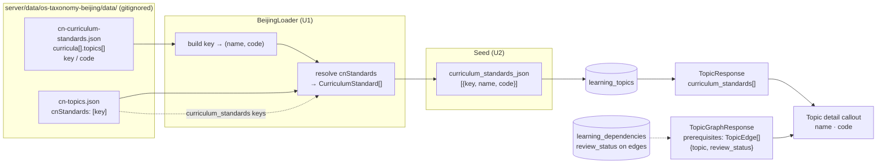

# Learning Frontend Curriculum & Edge Status - Plan

## Goal Capsule

- **Objective:** Surface two pieces of backend-curated metadata on the child topic detail page: (1) the MOE 2022 curriculum standard each topic maps to, rendered as a human-readable badge + callout showing the curriculum document title and standard code; (2) the `review_status` of each dependency edge in the prerequisites / next-steps chip lists, rendered as dashed-border + "AI" badge for machine-generated edges.
- **Authority:** Product Contract below.
- **Execution profile:** Frontend display + backend data exposure (both sides need changes; the backend gap is a necessary consequence of the user's edge-review intent, not separate scope).
- **Stop conditions:** Callout renders the resolved curriculum document title + code for at least one standard per topic; dashed-border + AI badge appears on every `review_status="machine"` edge in the topic detail chips.
- **Tail ownership:** Implementer owns tests, verification, and PR.

---

## Product Contract

### Summary

The child topic detail page will surface two new visual signals. First, next to the topic title, a circular "课" badge accompanied by a warm-yellow callout shows the curriculum standard the topic maps to, as the MOE 2022 curriculum document title plus the standard code. Second, each prerequisite and next-step chip will indicate whether its dependency edge is `reviewed` (solid border) or `machine`-generated (dashed border plus a small "AI" suffix badge). `rejected` edges are already excluded at seed time and do not reach the UI. The backend exposes the resolved curriculum title + code in the topic payload and the `review_status` in the graph edge payload; the frontend consumes both.

### Key Decisions

- **KD-1. Curriculum names resolved at backend** (session-settled: user-directed — chosen over frontend i18n lookup table: single source of truth, frontend just renders). The backend resolves each `moe-2022-math:S1.NA.02`-style identifier into `{curriculum name, code}` using `cn-curriculum-standards.json`, and exposes the resolved form via the topic API. Governs R1, R2, R3.

- **KD-6. Curriculum document title + code is the displayable form** (session-settled: user-directed — chosen over strand/note display, over best-effort fallback, over dropping the feature: `cn-curriculum-standards.json` is a codes-only source with no strand data and notes on 5% of entries, so title + code is the only 100%-covered readable form). The callout carries the curriculum document title and the standard code. Strand names and official standard text are out of scope. **Scope reduction call-out:** the original user request included "注释" (notes) alongside the readable name, but `cn-curriculum-standards.json` carries `note` on only ~5% of entries — rendering notes would produce a visually empty callout for 95% of topics. This plan drops notes from the callout; surfacing them requires a richer standards source and is explicitly deferred. Governs R1, R4.

- **KD-2. Badge + callout placement** (session-settled: user-directed — chosen over inline tag, metadata card, standalone section: visually distinctive without consuming a full section). The circular "课" badge sits next to the topic title; a warm-yellow callout underneath shows the resolved curriculum title + code (per KD-6). Governs R4.

- **KD-3. Single-entry callout** (session-settled: user-directed — chosen over a multi-standard list: most topics have one primary standard, multi-list adds visual noise). Governs R5.

- **KD-4. Dashed border + AI badge for machine edges** (session-settled: user-directed — chosen over color-shift alone, dashed border alone, icon alone, or no display: the dashed border conveys "uncertain / to-be-verified" semantics while the badge transparently labels the source; either signal alone is incomplete). Governs R7.

- **KD-5. `rejected` edges stay seed-excluded.** The existing behavior (rejected edges not written to DB) is preserved. No UI treatment needed.

### Requirements

**Curriculum data (backend)**

- R1. The backend resolves each curriculum standard identifier (e.g. `moe-2022-math:S1.NA.02`) into a curriculum document title plus the standard code, using `cn-curriculum-standards.json` from the Beijing data source. The resolved form carries the document title (e.g. `义务教育数学课程标准（2022年版）`) and the code (e.g. `S1.NA.02`). The source is codes-only: it carries no strand or stage names, and notes on only 5% of entries, so neither is part of the resolved form. Every identifier in the Beijing topic data resolves — verified at 2,345 references with zero unresolved.

- R2. The resolved curriculum form is exposed in the topic API response. Topics from the `os-taxonomy` source (en-US) have no curriculum standards and return an empty list. Topics from the `beijing` source return zero or more resolved entries.

**Curriculum display (frontend)**

- R3. The child topic detail page displays a circular "课" badge adjacent to the topic title when the topic has at least one curriculum standard entry with a non-null `code`. Topics with no resolved curriculum standard (including all os-taxonomy topics, and legacy bare-string rows where `code` is null) render without the badge.

- R4. The callout shows the first resolved standard's curriculum document title and code, formatted as `<title> · <code>` (e.g. `义务教育数学课程标准（2022年版）· S1.NA.02`). The callout is inline (always visible, not tooltip-only) so it reads without interaction on desktop and is reachable via scroll on mobile.

- R5. If a topic has multiple curriculum standard entries, only the first is shown in the callout. The full list remains stored and queryable for future multi-entry layouts; the current scope is single-entry.

**Edge review-status data (backend)**

- R6. The topic graph API (prerequisites + dependents) exposes each edge's `review_status` alongside the topic reference. Valid values: `"reviewed"`, `"machine"`, or `null` (for os-taxonomy edges, which carry no review status).

**Edge review-status display (frontend)**

- R7. Each prerequisite and next-step chip on the child topic detail page reflects the edge's `review_status`:
  - `reviewed` or `null`: the chip's existing mastery icon and tag type, unchanged.
  - `machine`: those, plus a dashed border and a visible "AI" suffix badge. The chip stays fully opaque with unchanged press feedback and a ≥44px tap target, so the dashed treatment reads as annotation rather than as a disabled control, and its accessible name states the machine-generated relationship.
  - (Edges with `review_status="rejected"` never reach the UI — they are excluded at seed time.)

**Localization & i18n**

- R8. All new user-facing strings (the "课" badge aria label, the AI badge tooltip if any, callout header) are i18n-keyed via the existing `useI18n()` mechanism. `zh-CN` and `en-US` locale files must both carry the new keys.

### Key Flows

- F1. Topic detail loads with curriculum callout
  - **Trigger:** Child navigates to `/learning/{topic_id}` for a Beijing-sourced topic.
  - **Steps:**
    1. Frontend fetches topic payload from backend.
    2. Backend resolves any curriculum standard identifiers against `cn-curriculum-standards.json` metadata and returns resolved entries.
    3. Frontend renders the title row with the "课" badge (since the topic has at least one standard).
    4. Frontend renders the warm-yellow callout below the badge showing the first standard's `<title> · <code>`.
  - **Outcome:** Child sees the curriculum alignment inline with the topic title.

- F2. Topic detail loads with machine-generated edge chips
  - **Trigger:** Child views a topic whose prerequisites or next-steps include at least one `review_status="machine"` edge.
  - **Steps:**
    1. Frontend fetches the topic graph.
    2. Backend returns each prerequisite/dependent topic with its edge's `review_status`.
    3. Frontend renders each chip: its existing mastery icon and tag type for `reviewed`/`null` edges; those plus a dashed border and "AI" suffix badge for `machine` edges.
  - **Outcome:** Child sees which edges are machine-generated and treats them with appropriate epistemic caution.

### Acceptance Examples

- AE1. zh-CN child views a topic with one curriculum standard.
  - **Covers R1, R2, R3, R4.**
  - **Given:** A zh-CN child user views topic `mtc_001` (拼音·声母韵母) whose `curriculum_standards` resolves to `[{name: "义务教育语文课程标准（2022年版）", code: "S1.RW.01"}]`.
  - **When:** The topic detail page renders.
  - **Then:** A circular "课" badge appears adjacent to the title; a warm-yellow callout beneath reads `义务教育语文课程标准（2022年版）· S1.RW.01`.

- AE2. en-US child views an os-taxonomy topic with no curriculum standard.
  - **Covers R2, R3.**
  - **Given:** An en-US child user views topic `mt_xyz` (an os-taxonomy-sourced topic).
  - **When:** The topic detail page renders.
  - **Then:** No "课" badge appears; no callout renders.

- AE3. Topic with mixed reviewed + machine edges.
  - **Covers R6, R7.**
  - **Given:** A topic has two prerequisites: `mt_A` with `review_status="reviewed"` and `mt_B` with `review_status="machine"`.
  - **When:** The topic detail page renders the "前置" chips.
  - **Then:** The `mt_A` chip keeps its current mastery icon and tag type. The `mt_B` chip shows those plus a dashed border and an "AI" suffix badge.

- AE4. zh-CN child views a topic with multiple curriculum standards.
  - **Covers R5.**
  - **Given:** A Beijing topic maps to two standards.
  - **When:** The topic detail page renders.
  - **Then:** Only the first standard's title + code appears in the callout. The second is not visible (but remains stored).

### Scope Boundaries

**This scope:**
- Backend curriculum-standard resolution (load metadata, resolve identifiers)
- Backend topic API exposing resolved curriculum names, across every topic endpoint that serves a child
- Backend graph API exposing `review_status` per edge
- Child frontend `TopicResponse` type + `TopicGraph` type extension
- Child topic detail page curriculum badge + callout
- Child topic detail page edge-status chip styling
- i18n keys for new UI strings (zh-CN + en-US)
- Re-seeding the target database so resolved titles actually land (U6)

**Deferred to follow-up:**
- Curriculum strand names and official standard text — `cn-curriculum-standards.json` is a codes-only source and does not carry them; surfacing them would need a different standards source plus a licensing review
- Multi-standard callout layout (current scope is single-entry per R5)
- Parent / main-app edge-status display (parent views don't show edge chips in current UI)
- Knowledge-map edge-status display (knowledge map doesn't visualize edges)
- `translation_status` display (deferred; stored but not surfaced)
- Tooltip hover content for machine edges (current scope: visual + accessible-name only; tooltips may come later)
- Curriculum standard display on the knowledge map page

**Considered, requires no change:**
- `useLocalizedTopic.ts` — source dispatch is the backend's job and name selection already follows i18n locale, so the existing composable is correct as-is
- `BabyLearningPage`, `LearningAssignPage`, `ChildLearningMapPage` — they consume the same locale-filtered topic API and need no explicit adaptation

**Outside this product's identity:**
- mtc_ topic structural differentiation (they're ordinary topics; no distinct UI needed)
- LLM translation pipeline changes
- Learning OS experience changes (game mechanics, AI tutor behavior)
- New backend endpoints (existing endpoints are extended, not new ones created)

### Dependencies and Assumptions

- **Beijing data availability:** The `cn-curriculum-standards.json` metadata file must be accessible to the backend at load time. The Beijing loader already reads this file's sibling data; metadata access is a sibling concern.
- **Codes-only standards source:** `cn-curriculum-standards.json` deliberately omits standard text for licensing reasons (its own note reads "codes-only：只收录编号/映射键和我们的分类标签，不收录课标原文条款"). Only `name`, `code`, and (rarely) `note` are usable. The plan's display form depends on this constraint holding.
- **Existing curriculum_standards storage:** Backend already stores curriculum standard identifiers per topic in `curriculum_standards_json`. This plan builds on that existing storage; no schema change needed.
- **Graph API extensibility:** The current `TopicGraphResponse` returns flat topic lists. Adding edge metadata requires a shape change to the graph response — the exact shape (parallel edges array vs per-topic edge metadata) is a planning decision, not a product decision.
- **Deploy sequencing:** code deploys before the re-seed (U6). Between the two, existing rows hold the legacy shape, which the API tolerates and the UI renders as no badge (see the assumption below). No schema migration is involved — `curriculum_standards_json` stays `Text`; only its content shape changes.
- **Edge review_status default:** Existing os-taxonomy edges have `review_status=null`; these render as the baseline solid-border style per R7.

---

## Planning Contract

**Product Contract preservation:** restructured, no scope change — the two `Deferred to Planning` outstanding questions became KTD3 (graph response shape) and KTD4 (which standard is first). The curriculum display form was corrected before planning: the original R1/KD-1 described strand/stage/note content that `cn-curriculum-standards.json` does not carry, and both were rewritten to the codes-only source's actual content as KD-6 and the current R1/R4.

### Key Technical Decisions

KTD1. **Resolve curriculum standards at seed time; store resolved entries** (session-settled: user-directed — chosen over a frontend i18n lookup table: one source of truth, frontend only renders; this is the how-level realization of KD-1 and KD-6). `BeijingLoader` reads `cn-curriculum-standards.json`, builds a `key → {name, code}` lookup, and resolves each topic's `cnStandards` entries. The seed script stores the resolved entries; the API returns them unchanged. Governs R1, R2.

The rejected mechanism is query-time resolution in the backend service: the backend reads no Beijing data files at runtime today, and `server/data/` is gitignored, so a runtime file dependency would fail wherever that directory is absent (notably production). Seed-time resolution keeps every API read a pure DB read.

KTD2. **`NormalizedTopic.curriculum_standards` carries resolved entries, not raw identifiers.** The field moves from `list[str]` to `list[CurriculumStandard]`, each entry `{key, name, code}`. Keeping `key` preserves traceability to the upstream identifier, so no information is lost relative to the current storage. `OsTaxonomyLoader` continues to return an empty list. Governs R1.

KTD3. **Graph response carries edge objects.** `TopicGraphResponse.prerequisites` and `.dependents` change from `list[TopicResponse]` to `list[TopicEdge]`, where `TopicEdge = {topic: TopicResponse, review_status: str | None}`. The child topic detail page is the only consumer of this response, so the breaking change is contained. Governs R6.

The rejected alternative is a parallel `edges: list[{topic_id, review_status}]` array joined by id at the call site — it needs the same frontend change plus an id join, and leaves two parallel arrays that can silently drift out of order.

KTD4. **First standard is index 0.** The callout renders `curriculum_standards[0]`. The upstream array order is the display order; no primary-standard heuristic. Governs R5.

### Assumptions

- The Beijing data directory is present when the seed script runs. The seed already requires it, so this adds no new deployment requirement.
- The re-seed ships with this change (U6). `curriculum_standards_json` changes shape from a list of identifiers to a list of objects, so between code deploy and the re-seed, existing rows still hold the legacy shape. That window is transient but must not break a page: the API tolerates a legacy entry (U2) and the UI renders no badge for it (U4), so a child sees no callout rather than an error or an unreadable raw identifier. The legacy path is a transient tolerance, not a supported display shape.
- The chip is currently a Vant `van-tag` with `plain`; the dashed machine treatment is assumed reachable via a CSS modifier class. If Vant's tag internals resist the override, the chip becomes a styled element — a unit-level call, not a product one.

---

## High-Level Technical Design

Curriculum resolution is a load-time transform, not a request-time one (KTD1). The identifier is resolved once per seed and stored resolved; every API read afterwards is a plain DB read with no dependency on the Beijing data directory.

The dotted path is the independent half of the change (R6, R7): edge `review_status` already lives in the DB on `learning_dependencies`, so it needs only exposure through the graph response — no loader-side resolution.

---

## Implementation Units

### U1. Resolve curriculum standards in the Beijing loader

- **Goal:** Turn raw `cnStandards` identifiers into resolved `{key, name, code}` entries at load time.
- **Requirements:** R1
- **Dependencies:** None
- **Files:**
  - `server/packages/os_taxonomy/types.py`
  - `server/packages/os_taxonomy/loaders/beijing.py`
  - `server/tests/packages/os_taxonomy/test_beijing_loader.py`
- **Approach:**
  1. Add a `CurriculumStandard` dataclass (`key`, `name`, `code`) and change `NormalizedTopic.curriculum_standards` from `list[str]` to `list[CurriculumStandard]` (KTD2).
  2. **Declare `CurriculumStandard` frozen (hashable).** The seed's dedup merge unions evidence and curriculum standards through `_union_list`, which deduplicates by inserting each item into a `set`. An unfrozen dataclass is unhashable, so the type change would raise `TypeError: unhashable type` the first time a dedup merge touches two topics that both carry standards. `frozen=True` restores hashability with no behavioural change, since entries sharing a `key` also share `name` and `code`.
  3. In `BeijingLoader`, read `cn-curriculum-standards.json` through the existing `_read_json` helper and flatten `curricula[].topics[]` into a `key → (curriculum name, code)` lookup.
  4. Resolve each topic's `cnStandards` list through that lookup; drop identifiers with no matching entry (none exist today — verified 2,345 references, zero unresolved).
  5. Leave `OsTaxonomyLoader` returning an empty list, unchanged.
- **Patterns to follow:** `BeijingLoader._read_upstream_topics()` — the same load-once-then-map shape already used for the `mt_` subject/age enrichment.
- **Test scenarios:**
  - A topic with one `cnStandards` entry resolves to a `CurriculumStandard` carrying the curriculum document title and the code.
  - `mtc_001` (`moe-2022-chinese:S1.RW.01`) resolves to `义务教育语文课程标准（2022年版）` + `S1.RW.01`.
  - An identifier absent from the metadata is dropped rather than raising.
  - A topic with no `cnStandards` yields an empty list.
  - `OsTaxonomyLoader.load_topics()` still returns an empty `curriculum_standards` list.
  - `CurriculumStandard` is hashable — it can be inserted into a `set` without raising.
  - `_union_list` over two resolved lists returns one entry per distinct standard rather than raising.
  - Every `mt_` and `mtc_` topic's `cnStandards` resolves to the same count of entries (no silent drops across the full dataset). Guard this scenario on the Beijing data directory being present and skip with an explicit message when it is absent — `server/data/` is gitignored, so an unguarded assertion becomes an untestable gate wherever the data is not checked out.
- **Execution note:** The frozen-dataclass coupling to `_union_list` is the kind of break that only surfaces at seed time on real data; exercise it with a unit-level merge test rather than relying on the loader suite alone.
- **Verification:** The loader's existing test suite plus the new cases pass; a full-dataset assertion confirms 2,345 references resolve with zero drops where the data directory exists.

### U2. Store resolved standards and expose them from the topic API

- **Goal:** Persist resolved entries through the seed and surface them in the topic response.
- **Requirements:** R1, R2
- **Dependencies:** U1
- **Files:**
  - `server/scripts/seed_learning_topics.py`
  - `server/apps/backend/app/schemas/learning.py`
  - `server/apps/backend/app/routers/learning.py`
  - `server/tests/backend/test_seed_beijing.py`
  - `server/tests/backend/test_learning_locale_filter.py`
- **Approach:**
  1. Update the seed for the object shape at both call sites that touch the field:
     - `_apply_normalized_to_db` JSON-serializes `t.curriculum_standards`; the object form needs `dataclasses.asdict` (or equivalent) rather than a bare `json.dumps` of dataclass instances.
     - `apply_dedup_to_topics` unions standards through `_union_list`, which dedupes by inserting each item into a `set`. U1's `CurriculumStandard` is frozen so this works, but confirm the merge path on real objects rather than assuming it — a seed-time `TypeError` here is a hard failure of the re-seed that R1/R2 depend on.
  2. Fix the existing dedup-merge assertion in `server/tests/backend/test_seed_beijing.py`, which currently compares `curriculum_standards` against identifier strings and will fail against the object shape.
  3. Add a `CurriculumStandard` response schema (`key`, `name`, `code: str | None`) and type `TopicResponse.curriculum_standards` as `list[CurriculumStandard] | None`.
  4. **Normalize in the schema, not in a router mapper.** Add a `@field_validator("curriculum_standards", mode="before")` on `TopicResponse` that maps a bare-string entry to `{key: s, name: s, code: None}`. This placement is load-bearing: `learning_child.py` and `learning_family.py` return raw ORM objects under `response_model=TopicResponse` and never call `_topic_to_response`, so a router-level mapper would leave those paths validating a legacy `["moe-2022-chinese:S1.RW.01"]` against `list[CurriculumStandard]` — which Pydantic rejects with `ResponseValidationError`, surfacing as HTTP 500 on the child home and today cards. The schema validator covers every topic endpoint at once, including the nested `current_topic` / `recommended_topic` fields on `TodayLearningResponse`.
  5. `code` stays nullable because the legacy shape has no code; the badge is not rendered for such entries (see U4), so the raw identifier is never shown to a child.
- **Patterns to follow:** The existing `json_text` accessor pattern on `LearningTopic` and the `_topic_to_response` mapper in `server/apps/backend/app/routers/learning.py` — note that the mapper is a convenience for the no-auth endpoints, not the compatibility seam.
- **Test scenarios:**
  - Seeding a Beijing topic writes resolved objects to `curriculum_standards_json`.
  - The no-auth `/learning/topics/{id}` endpoint returns resolved entries with `name` and `code` populated.
  - **The child endpoint `/child/learning/topics/{id}` returns the same resolved entries** — this is the path the badge actually reads, and the one a mapper-level fix would silently miss.
  - A row holding a legacy bare-string entry returns HTTP 200 from the child endpoint (not 500) with `code: null`.
  - The `TodayLearningResponse` nested `current_topic` / `recommended_topic` tolerate a legacy row.
  - An `os-taxonomy` topic returns an empty list.
  - `Covers AE2` — an en-US topic payload carries no curriculum standards.
- **Verification:** Seed tests and locale-filter API tests pass; the child endpoint and the today-card nested fields are exercised explicitly against a legacy-shape row.

### U3. Expose per-edge review_status in the graph API

- **Goal:** Carry each dependency edge's `review_status` alongside the topic it points at.
- **Requirements:** R6
- **Dependencies:** U1, U2 — U3 also edits `server/apps/backend/app/schemas/learning.py`, so it must serialize after U2's schema additions rather than race them.
- **Files:**
  - `server/apps/backend/app/services/learning/topic_service.py`
  - `server/apps/backend/app/schemas/learning.py`
  - `server/tests/backend/test_learning_locale_filter.py`
  - `server/tests/backend/test_learning_topic_service.py` — its existing `test_get_topic_graph` asserts `graph["prerequisites"][0].topic_key`, which the shape change breaks; update the assertion to reach through the edge object.
- **Approach:**
  1. Add a `TopicEdge` schema (`topic: TopicResponse`, `review_status: str | None`) and change `TopicGraphResponse.prerequisites` / `.dependents` to `list[TopicEdge]` (KTD3).
  2. `get_topic_graph` currently selects prerequisite/dependent ids and then queries topics separately. Select the dependency rows themselves (`topic_id`, `prerequisite_id`, `review_status`) so each edge's status is available, then pair each edge with its loaded topic.
  3. Preserve the existing `source_taxonomy` restriction on both sides of the edge.
- **Patterns to follow:** The existing `get_topic_graph` id-collection shape, extended in place rather than rewritten.
- **Test scenarios:**
  - A prerequisite edge with `review_status="reviewed"` returns that value.
  - A `machine` edge returns `"machine"`.
  - An edge with `review_status=None` (os-taxonomy) returns `None`.
  - Edge ordering matches the previous topic ordering for the same fixture.
  - The `source_taxonomy` filter still excludes cross-source edges.
  - `Covers AE3` — a topic with one `reviewed` and one `machine` prerequisite returns both with distinct statuses.
- **Verification:** Graph endpoint tests pass for all three status values plus the null case.

### U4. Frontend curriculum badge and callout

- **Goal:** Render the "课" badge and warm-yellow callout on the child topic detail page.
- **Requirements:** R3, R4, R5, R8
- **Dependencies:** U2
- **Files:**
  - `frontend/apps/child/src/api/learning.ts`
  - `frontend/apps/child/src/pages/learning/LearningTopicPage.vue`
  - `frontend/apps/child/src/pages/learning/LearningTopicPage.test.ts` (create — no spec exists for this page today)
  - `frontend/apps/child/src/i18n/locales/zh-CN.ts`
  - `frontend/apps/child/src/i18n/locales/en-US.ts`
- **Approach:**
  1. Add a `CurriculumStandard` interface (`key`, `name`, `code: string | null`) and add `curriculum_standards` to the frontend `TopicResponse`.
  2. **Badge condition.** Render the circular "课" badge when the topic has at least one entry whose `code` is non-null (R3); omit it entirely otherwise. A legacy entry (`code: null`) therefore renders no badge — showing its raw identifier is the unreadable form KD-6 rejected.
  3. **Title row layout.** Convert the existing block-level `<h1 class="topic-title">` into a flex row: the title takes the remaining width and wraps freely, the badge is a non-shrinking item at the row's end. Without a flex row the badge inherits block flow and drops onto its own line under a long title; without non-shrinking the badge squashes against the title.
  4. **Callout.** Render directly beneath the title row and above the mastery block. It has no header — it shows only `<title> · <code>` for the first entry (R4, R5, KTD4). It wraps in full (`overflow-wrap: anywhere`, no line-clamp): a CJK curriculum title plus code is roughly a full line at 375px, so truncation would hide the standard's identity, which is the whole point of the callout.
  5. Add an i18n key for the badge's aria-label to both locale files (R8).
- **Patterns to follow:** The existing clay-theme tokens and card styling in `LearningTopicPage.vue` (`.recommendation-card` in `LearningMapPage.vue` is the nearest in-repo precedent for a warm accent panel).
- **Test scenarios:**
  - A topic with one resolved standard renders the badge and a callout reading `义务教育语文课程标准（2022年版）· S1.RW.01`.
  - A topic with no standards renders neither badge nor callout.
  - A topic with two standards renders only the first.
  - A legacy entry (`code: null`) renders no badge and no callout.
  - A long curriculum title wraps inside the callout rather than clipping or pushing the badge off the row.
  - Both `zh-CN` and `en-US` locale files define every new key (no missing-key fallback).
- **Execution note:** Component-level tests with `@vue/test-utils` are the right proof here — assert rendered text and badge presence per scenario rather than snapshotting markup.
- **Verification:** Component tests pass for present/absent/multi/legacy cases; a missing i18n key in either locale fails the test.

### U5. Frontend machine-edge chip styling

- **Goal:** Distinguish machine-generated dependency edges in the prerequisite and next-step chip lists.
- **Requirements:** R7, R8
- **Dependencies:** U3, U4
- **Files:**
  - `frontend/apps/child/src/pages/learning/LearningTopicPage.vue`
  - `frontend/apps/child/src/pages/learning/LearningTopicPage.test.ts`
  - `frontend/apps/child/src/api/learning.ts`
  - `frontend/apps/child/src/i18n/locales/zh-CN.ts`
  - `frontend/apps/child/src/i18n/locales/en-US.ts`
- **Approach:**
  1. Add a `TopicEdge` interface (`topic: TopicResponse`, `review_status: string | null`) and update `TopicGraphResponse.prerequisites` / `.dependents` to `TopicEdge[]` (KTD3), matching the backend shape from U3.
  2. Update both chip loops to iterate edges and read `edge.topic` for the existing display and status helpers. The chip's current baseline is a Vant tag `type` (`success` / `default` / `primary`) plus a mastery icon (`success` / `lock` / `unlock`) with its own aria-label — **not** a coloured dot.
  3. **Keep the mastery icon and tag type on machine chips.** The mastery icon answers "has my child mastered this topic"; the machine signal answers "how was this prerequisite relationship derived". They are different questions on different visual channels, so the AI badge is additive. Replacing the mastery icon would hide the child's progress to make room for provenance.
  4. **Machine treatment:** dashed border plus a visible "AI" suffix badge (R7, KD-4). The border alone is the risk — a dashed border is the conventional mobile signal for *disabled* or placeholder, and these chips are the child's only route to the prerequisite topic. Keep full opacity, unchanged press feedback, and add the AI text label that explains the dashes, so the treatment reads as annotation rather than as a disabled control.
  5. Give both chip variants a minimum 44px tap height. `frontend/CLAUDE.md` mandates a 44×44px minimum for interactive elements and the current `.topic-chip` padding (6px/12px around 12px text) falls short; U5 already edits this shared class, so meeting the floor here rather than leaving a known-violating control in place.
  6. **Accessibility:** render the "AI" badge as literal text rather than an icon whose only content is an `aria-label` — the chip is a click-only `van-tag` span with no role, where a label alone is not reliably announced. Add an i18n'd `aria-label` on the chip itself that names the machine-generated relationship (R8), so the state survives without the dashed border being visible.
  7. Add every new string to both locale files (R8).
- **Patterns to follow:** The existing chip block in `LearningTopicPage.vue` and its `.topic-chip` scoped styles — extend rather than restructure.
- **Test scenarios:**
  - `Covers AE3` — a `reviewed` chip and a `machine` chip render with different styles, only the machine one carrying the AI badge.
  - A `null` status chip renders identically to `reviewed`.
  - A machine chip whose target is mastered still renders the mastery icon alongside the AI badge (neither signal suppresses the other).
  - The machine chip carries an accessible name that includes the machine-generated wording, not only a decorative badge.
  - Both chip variants meet the 44px minimum tap height.
  - Chip click still navigates using the edge's topic id after the shape change.
  - Both locale files define the chip's machine-state aria-label.
- **Verification:** Component tests pass for all three statuses; the existing navigation behaviour is re-asserted after the type change.

---

### U6. Re-seed the Beijing taxonomy and verify resolved rows land

- **Goal:** Populate resolved curriculum titles in the target database so the badge has data to render.
- **Requirements:** R1, R2 — resolved entries only exist in the DB after a `--source beijing` seed, so without this step the feature is deployed but inert.
- **Dependencies:** U1, U2
- **Files:** none — this is an operational delivery step, not a code change.
- **Approach:**
  1. After U1 and U2 deploy, run `uv run python scripts/seed_learning_topics.py --source beijing` against the target database.
  2. Confirm `learning_topics.curriculum_standards_json` now holds objects rather than bare identifier strings.
  3. Confirm a zh-CN topic payload returns at least one entry with a non-null `code`.
- **Test expectation:** none — operational step with no code surface. The observable proof is step 3's non-null `code` on a real topic, which the DoD records.
- **Verification:** A zh-CN child opening a topic that maps to a standard sees the "课" badge and a callout carrying the curriculum document title and code.

---

## Verification Contract

| Gate | Command | Scope | Pass criteria |
|------|---------|-------|---------------|
| Loader tests | `cd server && uv run pytest tests/packages/os_taxonomy/ -v` | U1 | All pass, including the hashability and union cases |
| Seed + API tests | `cd server && uv run pytest tests/backend/test_seed_beijing.py tests/backend/test_learning_locale_filter.py tests/backend/test_learning_topic_service.py -v` | U2, U3 | All pass, including the child endpoint and today-card paths against a legacy row |
| Backend regression | `cd server && uv run pytest tests/backend/ -k "learning" --tb=line` | U1–U3 | No regressions in the existing learning suite |
| Backend lint/types | `cd server && uv run ruff check packages/os_taxonomy/ apps/backend/app/ scripts/seed_learning_topics.py tests/backend/test_seed_beijing.py tests/backend/test_learning_locale_filter.py tests/backend/test_learning_topic_service.py tests/packages/os_taxonomy/test_beijing_loader.py` | U1–U3 | Clean |
| Re-seed | `cd server && uv run python scripts/seed_learning_topics.py --source beijing` | U6 | Completes; `curriculum_standards_json` holds objects with non-null `code` |
| Frontend component tests | `cd frontend/apps/child && pnpm test:run` | U4, U5 | New cases pass |
| Frontend typecheck | `cd frontend && pnpm -r typecheck` | U4, U5 | No new errors |
| Frontend lint | `cd frontend && pnpm -r lint` | U4, U5 | Clean |

---

## Definition of Done

1. U1–U6 verified per their unit criteria (U6 is the operational re-seed).
2. Verification Contract gates all pass.
3. After U6's re-seed, a zh-CN child sees the "课" badge and a callout reading the curriculum document title + code on a topic that maps to a standard, and no badge on a topic that does not.
4. An en-US child sees no badge on any topic.
5. Machine-generated dependency chips are visually distinct (dashed border + AI badge) from reviewed chips, retain their mastery icon and press feedback, and meet the 44px tap minimum.
6. Before U6's re-seed, legacy `curriculum_standards_json` rows return HTTP 200 from every topic endpoint — including the child endpoint and the today-card nested fields — and render no badge. Never a 500, and never a raw identifier shown to a child.
7. Every new user-facing string has keys in both `zh-CN` and `en-US` child locale files.
8. No residual strand/note display logic — the codes-only constraint is respected end to end.
9. Cleanup: no dead-end or experimental code left in the diff.

---

## Deferred / Open Questions

### From 2026-10-10 doc-review

- **Dark-mode callout colors (P1, U4):** The ochre callout background and border-left use fixed alpha values (`0.12` / `0.45`). No dark-mode override is specified. The child app's iron rule requires new tokens in both `:root` and `[data-theme="dark"]`. Verify WCAG AA contrast at the specified alphas against the dark canvas (`#0a1a1a`); if the values fail, define adjusted dark-mode alphas and add a dark-theme test scenario. *(design-lens, deferred)*

- **Dark-mode machine chip colors (P1, U5):** Dashed border and "AI" suffix badge have no dark-mode color values or test scenarios. The treatment may vanish against the dark card surface or produce unreadable badge text. Specify explicit dark-mode border-color and badge background/text tokens, and add a dark-theme rendering test scenario. *(design-lens, deferred)*

- **`source_taxonomy` filter mechanism (P2, U3):** After restructuring the dependency query from ID-only to full `LearningDependency` rows (to obtain `review_status`), the `source_taxonomy` filter must be preserved. The dependency table has no `source_taxonomy` column, so the implementer must choose between a SQL JOIN or a Python post-filter. Add one sentence to U3 Approach naming the chosen mechanism; the existing test scenario ("`source_taxonomy` filter still excludes cross-source edges") guards the outcome. *(feasibility, deferred)*

- **AI badge placement within chip (P2, U5):** The "AI" suffix badge position inside the chip is unspecified — inline within `van-tag`, adjacent element, or corner marker. With CJK topic names (8+ characters), adding inline content increases chip width; at 375px viewport this risks chips that cannot fit two per row. Specify the badge as an inline element separated from the topic name by a fixed gap, and add a test scenario for a machine chip with a long CJK topic name. *(design-lens, deferred)*
