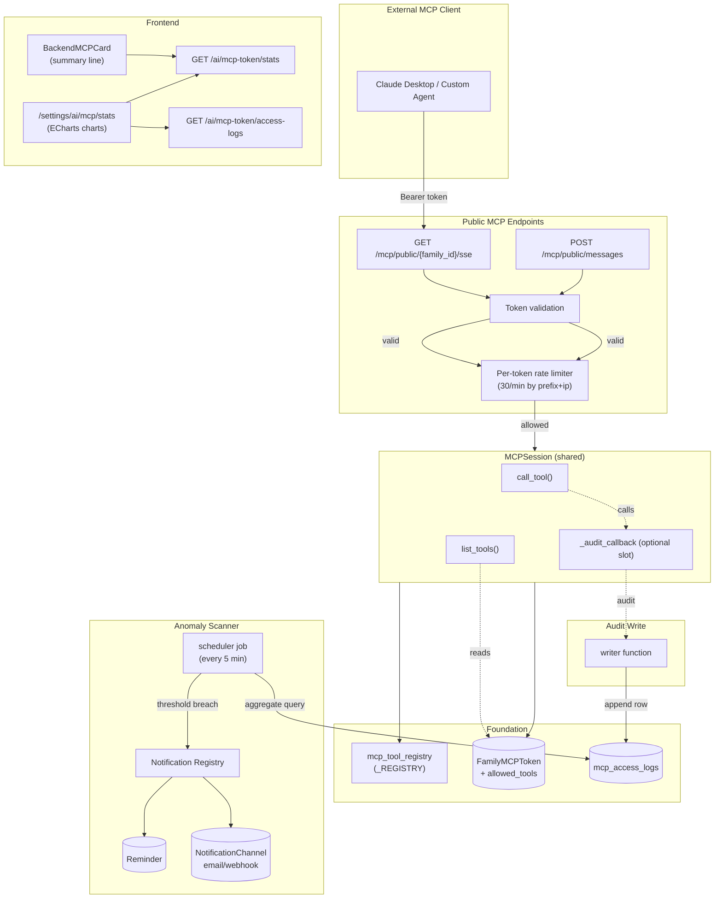

## Goal Capsule

- **Objective:** Turn the Phase 1 external MCP token from "usable" into "governable" — per-tool whitelist, per-call audit trail, anomaly detection with owner alerts, usage statistics, and the missing per-token rate limit.
- **Product authority:** Family owner controls tool exposure, reviews access, receives alerts.
- **Open blockers:** None.
- **Execution profile:** Code — backend Python + frontend Vue, plus a scheduler-worker job.

---

## Summary

Phase 1 shipped the external MCP token (hashed, rotated, two-level read/write gate). Phase 2 adds five governance surfaces on top: (1) per-tool whitelist checkboxes so owners can expose only a chosen subset, (2) a dedicated `mcp_access_logs` table capturing every connection and tool call, (3) per-token rate limiting keyed by token prefix + client IP (30/min — Phase 1 KTD4 gap), (4) a periodic anomaly scanner that alerts the owner, and (5) a stats page summarizing usage.

---

## Problem Frame

Phase 1 delivered the authentication + access-control layer but stopped at the binary level — an owner could toggle `allow_external` / `allow_write` for *all* tools at once, but could not see what an external client actually did after connecting, could not throttle it, and had no way to spot abuse. The token was functional but ungovernable. The Phase 1 plan explicitly deferred this as "Phase 2" under Scope Boundaries.

---

## Requirements

### Tool Permission (P2-R1 — P2-R3)

- **P2-R1.** The `FamilyMCPToken` model gains an `allowed_tools` JSON column (nullable, default `None`). `None` means "all tools available" (Phase 1 backward compatibility). A non-null value is a list of tool names — only those tools are exposed to external callers. Future tools added to the registry are *not* exposed to families that have already saved a non-null list.
- **P2-R2.** The `tools/list` response for an `external_token` caller is the intersection of (a) the role/write gate from Phase 1 and (b) the `allowed_tools` whitelist when non-null. A tool that is not in the whitelist must not appear in `tools/list` and must be rejected by `call_tool` with `permission_denied`.
- **P2-R3.** `PATCH /ai/mcp-token` accepts `allowed_tools: list[str] | null`. Passing `null` resets to "all available" (NULL). Passing `[]` means "no tools". Passing a list sets the exact enabled set. Invalid tool names are rejected at write time (validate against `mcp_tool_registry._REGISTRY` keys).

### Audit Log (P2-R4 — P2-R8)

- **P2-R4.** A new `mcp_access_logs` table records every external MCP event. Each row carries: `id`, `family_id`, `token_id`, `session_id`, `event_type` (enum: `connect` / `disconnect` / `tool_call`), `tool_name` (nullable), `status` (`success` / `failure` / `permission_denied` / `error`), `duration_ms` (nullable, for tool_call), `client_ip`, `user_agent` (nullable), `args_digest` (nullable, truncated JSON, max 1 KB), `error_code` (nullable), `created_at`. Indexed on `(family_id, created_at)` and `(family_id, event_type, created_at)`. **Secret redaction:** `args_digest` must redact values matching common secret patterns (tokens, passwords, API keys, bearer values) before persisting; tool handlers must not pass sensitive fields in arguments. Implementers should use a pattern-match-and-replace pass (e.g., regex for `mcp_\S+`, `Bearer \S+`, keys named `*password*`, `*secret*`, `*token*`, `*api_key*`) on the serialized JSON before truncation.
- **P2-R5.** The audit write hook is injected into `MCPSession` as an optional `audit_callback` slot (frozen at construction like `_allow_write`). Internal agent path passes `None`; external path passes a writer. This preserves `mcp_session.py`'s zero-coupling-to-audit invariant.
- **P2-R6.** `connect` events are written at SSE handshake success. `tool_call` events are written after `call_tool` returns (success/failure/permission_denied). `disconnect` events are best-effort (written on transport teardown where the SDK exposes a lifecycle hook; skipped otherwise).
- **P2-R7.** A retention purge job deletes rows older than 90 days (matches the existing `audit_log_purge_job` pattern). Configurable via settings if needed later.
- **P2-R8.** Owner-only paginated API: `GET /ai/mcp-token/access-logs` returns access logs scoped to caller's family, filtered by `event_type`, `tool_name`, `date_from`, `date_to`, ordered newest-first.

### Per-Token Rate Limiting (P2-R9 — P2-R10)

- **P2-R9.** Public MCP endpoints (`/api/v1/mcp/public/...`) apply a per-token rate limit of 30 requests per minute keyed by `(token_prefix, client_ip)`. Exceeding the limit returns 429 with `RATE_LIMITED` error code.
- **P2-R10.** The rate limit key is tracked in the unified cache layer (memory/Redis) with a TTL of 60 seconds. The limit is configurable via `MCP_PUBLIC_RATE_LIMIT_PER_MINUTE` (default 30). Applied *after* token validation so invalid tokens don't consume rate-limit slots.

### Anomaly Detection (P2-R11 — P2-R13)

- **P2-R11.** A periodic scheduler job scans recent `mcp_access_logs` rows per family and emits alerts when any threshold is exceeded: (a) frequency spike (e.g., >100 tool calls in 5 minutes), (b) new source IP (first appearance in 30-day window), (c) high failure rate (e.g., >50% of calls failing in 10 minutes with at least 5 calls).
- **P2-R12.** Alerts are dispatched via the existing notification system: register a new `mcp_security` category with event type `mcp_anomaly_detected` in the notification registry. The owner's subscribed channels (email/webhook) receive the alert if configured; otherwise only the in-app reminder is created.
- **P2-R13.** Alert deduplication: the same `(family_id, anomaly_type, detail_hash)` must not alert more than once per hour (reuse `_check_reminder_dedup`). Thresholds are configurable via settings (sane defaults in code).

### Statistics Panel (P2-R14 — P2-R17)

- **P2-R14.** The `BackendMCPCard` shows a one-line usage summary: today's call count, success rate, and a flag if an anomaly was triggered in the last 24 hours.
- **P2-R15.** Owner-only API: `GET /ai/mcp-token/stats` returns aggregate stats for a date range (default last 7 days): total calls, success/failure/error counts, calls-by-tool breakdown, calls-by-IP breakdown, hourly call-volume time series.
- **P2-R16.** A dedicated stats page at `/settings/ai/mcp/stats` shows full charts: call trend over time (line chart), tool distribution (pie or bar), top source IPs (bar), failure rate trend (line). Reuses `vue-echarts` wrapper.
- **P2-R17.** The route `/settings/ai/mcp/stats` is owner-only at the router level; adult members see the card summary (read-only) but the stats page redirects them.

### Acceptance Examples

- **P2-AE1.** Covers P2-R1, P2-R2. Given a family with `allowed_tools = ["get_assets"]`. When external client calls `tools/list`. Then only `get_assets` appears. `get_liabilities` does not.
- **P2-AE2.** Covers P2-R1. Given `allowed_tools = null`. When external client calls `tools/list`. Then all 13 read-only tools appear (Phase 1 backward compatibility).
- **P2-AE3.** Covers P2-R3. Given `allowed_tools = ["get_assets"]`. Owner PATCHes `allowed_tools = null`. Then next `tools/list` returns all tools again.
- **P2-AE4.** Covers P2-R3. Owner PATCHes `allowed_tools = ["nonexistent_tool"]`. Then 400 with invalid tool error.
- **P2-AE5.** Covers P2-R4, P2-R6. Given `allow_external=True`. When external client connects and calls `get_assets`. Then two rows appear in `mcp_access_logs` for that family: one `connect`, one `tool_call` with tool_name=`get_assets`, status=`success`.
- **P2-AE6.** Covers P2-R9. Given a token making requests at 35/min. Then requests above 30/min receive 429 `RATE_LIMITED`. Different IP using the same token counts separately.
- **P2-AE7.** Covers P2-R11, P2-R12. Given an external client making 150 tool calls in 5 minutes. Then an `mcp_anomaly_detected` reminder is created for the family owner.
- **P2-AE8.** Covers P2-R13. Given an anomaly alert already fired 30 minutes ago for family X. When the same anomaly condition recurs. Then no duplicate reminder is created.
- **P2-AE9.** Covers P2-R14, P2-R15. Given 50 calls today, 45 successful. When owner opens the stats page. Then summary shows "50 调用 / 90% 成功" and the chart data reflects the 50 calls.
- **P2-AE10.** Covers P2-R5. Given an internal agent JWT. When calling internal MCP endpoints. Then no rows are written to `mcp_access_logs` (callback is None).

---

## Key Technical Decisions

**KTD1. Whitelist semantics for allowed_tools (session-settled: user-directed — chosen over blacklist/disabled_tools: safer default for newly-added write tools; owner must explicitly enable each tool after customization).** NULL means "unconfigured = all tools available" (Phase 1 backward compat). Once the owner saves a non-null list, that list is the *exact* enabled set; unlisted tools (including ones added later) are off. The trade-off is that new MCP tools require the owner to opt in manually, but this prevents accidental exposure of newly-added write tools.

**KTD2. Audit storage in dedicated `mcp_access_logs` table (session-settled: user-directed — chosen over reusing `security_audit_logs` and over hybrid double-write).** The stats panel needs aggregation (GROUP BY tool_name, AVG duration_ms, IP breakdowns); `SecurityAuditLog` stores variable data in a `detail` text blob which would require Python-side JSON parsing per query. A purpose-built table gives indexed columns for aggregation while keeping the security audit log's signal clean. Retention job pattern reuses the existing `purge_old_audit_logs` template; 90-day default matches the existing audit policy.

**KTD3. Audit write via slot-frozen callback, not inline branching.** `MCPSession` is shared between the internal agent path and the external token path. Adding a direct `if caller_role == 'external_token': write_audit()` branch inside `call_tool()` couples `mcp_session.py` to the audit schema and breaks the "internal path stays untouched" invariant. Instead, add `_audit_callback` to `__slots__` with `None` default. External path injects a writer function; internal path passes nothing. `list_tools()` and `call_tool()` call `self._audit_callback(...)` when not None. This mirrors the `_allow_write` slot already on MCPSession.

**KTD4. Per-token rate limiting applied AFTER token validation.** Invalid/expired tokens must not consume rate-limit slots — otherwise an attacker with a bogus token prefix could exhaust the per-key slot budget and cause legitimate clients to 429. Validation happens first, rate limiting second. The key `(token_prefix, client_ip)` uses token prefix (not full token) to avoid logging the secret; combined with IP for fairness across multiple external clients of one token.

**KTD5. Anomaly detection as a periodic scheduler job, not inline.** Computing frequency/IP/failure-rate metrics on every tool call adds latency and couples tool execution to detection. A periodic scan (every 5 minutes) reads aggregated counts from `mcp_access_logs` with indexed queries. The trade-off is that alerts arrive up to one scan interval late; the user accepted this (session-settled: user-approved). The job reuses the existing `audit_log_purge_job` / `reminder_job` registration pattern in `scheduler_worker/jobs/__init__.py`.

**KTD6. New `mcp_security` notification category with `mcp_anomaly_detected` event.** Reuses `ensure_reminder()` + `_check_reminder_dedup(hours=1)` + `_dispatch_notifications()`. The owner's subscribed `NotificationChannel`s (email/webhook) deliver the alert only if they've explicitly subscribed this event type — unsubscribed owners get in-app only (user-accepted trade-off). Registry, `ReminderSummary` schema, and i18n must all add the new type.

**KTD7. Stats API returns pre-aggregated buckets, not raw rows.** The frontend stats page makes one `GET /stats?from=...&to=...` call. The backend computes hourly buckets, per-tool counts, per-IP counts, and success/failure totals in SQL (`GROUP BY` over indexed columns). The frontend renders four charts from these buckets. This avoids shipping thousands of audit rows to the browser and matches the existing dashboard API pattern (`/dashboard/trend`, `/dashboard/allocation`).

**KTD8. New plan file rather than extending Phase 1.** Phase 1's plan is committed, implemented, and shipped. Phase 2 is distinct scope with its own units and verification. A new plan file (`2026-10-09-002-...`) keeps the work independently referenceable and lets `ce-work` operate on Phase 2 units without re-scanning Phase 1's completed ones. The Phase 1 plan is referenced via `origin:`.

---

## High-Level Technical Design

---

## Scope Boundaries

### Deferred for later

- Multi-token per family (still one active token)
- Log export (CSV/JSON download of audit rows)
- Real-time push for the stats page (polling is fine)
- The missing frontend page for `/admin/audit-logs` (general security audit viewer) — remains backend-only
- WebSocket-based live updates of the stats chart

### Out of scope

- Modifying the internal agent MCP path (`mcp_internal.py`)
- Changing the `FamilyMCPServer` model or bootstrap logic
- MCP protocol version negotiation
- Alerting to non-owner adult family members

---

## Open Questions

None — all product decisions have been examined and settled in the dialogue.

---

## Risks & Mitigations

- **Audit write amplification.** Every tool call now writes an audit row. For a typical family MCP session with dozens of tool calls per conversation, write volume is modest (hundreds of rows per session). For pathological clients making thousands of calls, the rate limiter (KTD4) bounds the rate at 30/min. Mitigation: the audit writer is a fire-and-forget function that fails silently (matches `write_audit_log`'s error-swallowing pattern); a slow audit write must not block tool execution.
- **Anomaly false positives.** A family owner using Claude Desktop intensively could trigger the frequency threshold. Mitigation: thresholds are configurable and start generous (100 calls in 5 min); dedup (KTD6, 1-hour window) prevents alert storms; the owner can dismiss or tune thresholds later.
- **Notification subscription surprise.** An owner who hasn't subscribed to `mcp_anomaly_detected` gets no email/webhook alert, only in-app. Mitigation: this was the user-accepted trade-off; a future enhancement could default-on MCP security alerts to all channels.
- **Slot addition to MCPSession.** Adding `_audit_callback` to `__slots__` requires careful placement and a None default to preserve backward compatibility with any in-flight internal-path sessions. Mitigation: both construction sites (mcp_internal.py:135, mcp_public.py:169) are touched; existing tests (`test_mcp_session_caller_binding.py`) cover the internal path and must continue to pass unchanged.
- **Allowed_tools migration on populated rows.** Adding a JSON column to `family_mcp_tokens` on an existing table requires a nullable default (`None`) so the column addition doesn't need to backfill. Existing Phase 1 rows get `allowed_tools=None` (meaning all tools), preserving behavior.

---

## Implementation Units

### Phase A — Foundation

### U1. Data model and migration for Phase 2

**Goal:** Add `allowed_tools` JSON column to `FamilyMCPToken`, create the `mcp_access_logs` table, and write the Alembic migration.

**Requirements:** P2-R1, P2-R4

**Dependencies:** None

**Files:**
- Modify: `server/apps/backend/app/models/family_mcp_token.py`
- Create: `server/apps/backend/app/models/mcp_access_log.py`
- Modify: `server/apps/backend/app/models/__init__.py`
- Create: `server/apps/backend/alembic/versions/<revision>_add_mcp_phase2_models.py`

**Approach:**
1. Add `allowed_tools: Mapped[dict | list | None]` as a `JSON` column to `FamilyMCPToken` (nullable, default None). Use SQLAlchemy `JSON` type; it serializes as JSON on both SQLite and PostgreSQL.
2. Create `MCPAccessLog(Base)` with columns: `id` (BigInteger, snowflake), `family_id` (BigInteger, indexed), `token_id` (BigInteger, nullable — the `FamilyMCPToken.id`, nullable in case token is rotated mid-session), `session_id` (String(64), indexed — MCP SDK's UUID4 session id from SSE handshake), `event_type` (String(16), indexed, one of `connect` / `disconnect` / `tool_call`), `tool_name` (String(64), nullable, indexed), `status` (String(16)), `duration_ms` (Integer, nullable), `client_ip` (String(45)), `user_agent` (String(512), nullable), `args_digest` (Text, nullable — truncated JSON string, max 1024 chars), `error_code` (String(32), nullable), `created_at` (UTCDateTime, indexed). Composite index `(family_id, created_at)`.
3. Register model in `models/__init__.py`.
4. Generate Alembic migration with fresh-DB power guard (column existence check) per project convention.

**Patterns to follow:** `server/apps/backend/app/models/family_mcp_token.py` for model structure; `server/packages/db/models/security_audit_log.py` for a similar append-only log model; existing migrations in `server/apps/backend/alembic/versions/` for naming convention.

**Test scenarios:**
- `FamilyMCPToken` with `allowed_tools=None` is queryable; `allowed_tools=["get_assets"]` round-trips through JSON.
- `MCPAccessLog` can be created with all fields populated; `created_at` auto-fills.
- Alembic migration applies cleanly on fresh DB and idempotently on existing DB with data.

**Verification:** `cd server/apps/backend && uv run alembic upgrade head` succeeds.

---

### Phase B — Core Behavior

### U2. Per-tool whitelist gating

**Goal:** Filter `tools/list` and `call_tool` by `allowed_tools` for `external_token` callers.

**Requirements:** P2-R2, P2-R3

**Dependencies:** U1

**Files:**
- Modify: `server/apps/backend/app/services/mcp_session.py`
- Modify: `server/apps/backend/app/services/mcp_token.py`
- Modify: `server/apps/backend/app/routers/ai_mcp_token.py`
- Modify: `server/apps/backend/app/schemas/mcp_token.py`

**Approach:**
1. Add `allowed_tools` field to `MCPTokenUpdate` schema (type `list[str] | None = None`).
2. In `update_access()`, add `allowed_tools` parameter. Validate against `mcp_tool_registry._REGISTRY.keys()` if not None; raise `AppError(400, "invalid tool name: X")` for unknown names. Persist to the row.
3. Add `allowed_tools: list[str] | None = None` to `MCPTokenResponse` (serialized from JSON column).
4. In `MCPSession.__init__`, add `allowed_tools: list[str] | None = None` parameter; store as `self._allowed_tools` (add to `__slots__`).
5. In `MCPSession.list_tools()`: after computing the Phase 1 role-filtered `metas`, if `self._caller_role == 'external_token'` and `self._allowed_tools is not None`, further filter to tools whose `name` is in `self._allowed_tools`.
6. In `MCPSession.call_tool()`: after the existing role/write gate, add an allowed_tools gate for external_token callers. If `self._allowed_tools is not None` and `name not in self._allowed_tools`, return `permission_denied` (same error shape as the role gate).
7. In `mcp_public.py` SSE construction: pass `allowed_tools=token_row.allowed_tools` to the MCPSession constructor. For POST /messages, pass through the session lookup.

**Patterns to follow:** the existing `_allow_write` slot + bypass pattern in `mcp_session.py`.

**Test scenarios:**
- Covers P2-AE1. `allowed_tools=["get_assets"]`, external_token caller, `list_tools()` returns only `get_assets`.
- Covers P2-AE2. `allowed_tools=None`, external_token caller, `list_tools()` returns all 13 read-only tools (or all if allow_write too).
- Covers P2-AE1. External caller tries `call_tool("get_liabilities")` when `allowed_tools=["get_assets"]` → returns `permission_denied`.
- PATCH `allowed_tools=["nonexistent_tool"]` → 400 with invalid tool error (P2-AE4).
- PATCH `allowed_tools=null` → resets to None, subsequent `list_tools()` returns all.
- Internal agent path: `MCPSession` constructed without `allowed_tools` → unaffected.

**Verification:** `cd server && uv run pytest tests/backend/unit/test_mcp_public.py tests/backend/unit/test_mcp_token.py -v` — existing tests still pass; new tests for allowed_tools gating.

---

### U3. Audit write hooks

**Goal:** Write `connect` / `disconnect` / `tool_call` events to `mcp_access_logs` for external MCP sessions.

**Requirements:** P2-R5, P2-R6, P2-AE10

**Dependencies:** U1, U2

**Files:**
- Create: `server/apps/backend/app/services/mcp_audit.py`
- Modify: `server/apps/backend/app/services/mcp_session.py`
- Modify: `server/apps/backend/app/routers/mcp_public.py`
- Modify: `server/tests/backend/unit/test_mcp_session_caller_binding.py` (extend)

**Approach:**
1. Create `mcp_audit.py` with a single `write_mcp_access_log(...)` function. Accepts family_id, token_id, session_id, event_type, tool_name, status, duration_ms, client_ip, user_agent, args_digest, error_code. Creates a `MCPAccessLog` row in its own `SessionLocal()` (matching `write_audit_log`'s pattern), commits, closes. Fails silently on exception (with warning log). Truncates `args_digest` to 1024 chars before writing. **Secret redaction pass:** before truncation, scan the serialized JSON for values matching common secret patterns (`mcp_\S+`, `Bearer \S+`, keys containing `password`/`secret`/`token`/`api_key`) and replace matched values with `[REDACTED]`. Never logs token plaintext.
2. Add `_audit_callback` to `MCPSession.__slots__`. Constructor accepts optional `audit_callback: Callable | None = None`. Default None.
3. In `MCPSession.call_tool()`: after the success log (line ~1003) and the failure log (line ~1018), call `self._audit_callback(event_type="tool_call", tool_name=name, status=..., duration_ms=..., args_digest=..., error_code=...)` if `self._audit_callback is not None`. Compute `duration_ms` by measuring `time.perf_counter()` at call_tool entry.
4. In `mcp_public.py` `PublicMCPSSEResponse.__call__`: after `transport.connect_sse(...)` enters the async context, call `audit_callback(event_type="connect", ...)`. On context exit (best-effort, in finally), call `audit_callback(event_type="disconnect", ...)`.
5. In `mcp_public.py` `mcp_public_sse()` endpoint: construct the audit callback lambda bound to family_id, token_id (from the validated row), client_ip, user_agent. Pass it to `MCPSession(...)` via `audit_callback=`.
6. In `mcp_internal.py` `mcp_internal_sse()`: leave unchanged (no audit_callback passed; defaults to None).

**Patterns to follow:** `packages/domain/audit/service.py` `write_audit_log()` for the fail-silently pattern.

**Test scenarios:**
- Covers P2-AE5. External client connects + calls `get_assets` → two rows in `mcp_access_logs` for that family: one `connect`, one `tool_call` with status=`success`.
- Covers P2-AE10. Internal agent call via `mcp_internal.py` → zero rows in `mcp_access_logs`.
- Permission denied: external caller invokes a tool not in `allowed_tools` → `tool_call` row with status=`permission_denied`.
- Tool failure: tool raises an exception → `tool_call` row with status=`error`, error_code populated.
- `args_digest` truncation: args JSON > 1024 chars is truncated with ellipsis marker.
- Secret redaction: args containing a value matching `mcp_\S+` (e.g., a token string), `Bearer ...`, or a key named `password` / `api_key` are written with those values replaced by `[REDACTED]` in `args_digest`.
- Audit write failure (simulated DB error): call_tool still succeeds (no blocking), warning logged.

**Verification:** `cd server && uv run pytest tests/backend/unit/test_mcp_public.py tests/backend/unit/test_mcp_session_caller_binding.py -v`. Confirm internal MCP tests (no audit rows written) still pass.

---

### U4. Per-token rate limiting

**Goal:** Apply a 30/min per-token rate limit on public MCP endpoints.

**Requirements:** P2-R9, P2-R10

**Dependencies:** U1 (no schema dep, but logically after audit wiring)

**Files:**
- Modify: `server/apps/backend/app/routers/mcp_public.py`
- Modify: `server/packages/core/settings.py`
- Modify: `server/apps/backend/app/main.py` (if registering new middleware) OR inline in `mcp_public.py`

**Approach:**
1. Add `MCP_PUBLIC_RATE_LIMIT_PER_MINUTE: int = 30` to `packages/core/settings.py` `AppSettings`.
2. In `mcp_public.py`, create a helper `_check_mcp_rate_limit(token_prefix: str, client_ip: str) -> bool` that uses the unified cache layer (`packages/core/cache`): increment key `mcp_public:{token_prefix}:{client_ip}` with TTL 60s; reject if > limit. Use the same cache backend configured for global rate limiting (memory or Redis).
3. Apply this check in both `mcp_public_sse()` and `mcp_public_messages()` AFTER token validation (so invalid tokens don't consume slots). On rejection, raise `AppError(ErrorCode.RATE_LIMITED)`.
4. Extract client IP using the same logic as `RateLimitMiddleware._get_client_id()` (honors X-Forwarded-For with trusted proxy validation). Factor out to a shared helper if not already exposed.

**Patterns to follow:** `server/apps/backend/app/middleware/rate_limit.py` for the cache-based counter and trusted-proxy IP extraction.

**Test scenarios:**
- Covers P2-AE6. Mock cache; 30 calls succeed; 31st returns 429 RATE_LIMITED.
- Same token prefix, different IP → separate counter (31st from new IP still succeeds).
- Invalid token → 401, no rate-limit slot consumed (check cache counter unchanged).
- Rate limit is skipped in `ENVIRONMENT != "production"`? Actually, for MCP public endpoints the rate limit should apply in dev too (the global middleware skips in dev, but per-token rate limiting is a security control — apply always). Document this divergence explicitly.

**Verification:** `cd server && uv run pytest tests/backend/unit/test_mcp_public.py -v -k rate_limit`. Manual test: 31 rapid SSE connect attempts with same token → 429 after the 30th.

---

### Phase C — Data Exposure

### U5. Audit read + stats API endpoints

**Goal:** Owner-only APIs to read audit logs and aggregate statistics.

**Requirements:** P2-R8, P2-R15

**Dependencies:** U1, U3

**Files:**
- Modify: `server/apps/backend/app/routers/ai_mcp_token.py`
- Create: `server/apps/backend/app/schemas/mcp_access_log.py`
- Create: `server/apps/backend/app/services/mcp_stats.py`

**Approach:**
1. Create `schemas/mcp_access_log.py`: `MCPAccessLogResponse(SnowflakeBase)` with all columns; `MCPAccessLogListResponse` with `items`, `total`, `page`, `page_size`.
2. In `routers/ai_mcp_token.py`, add `GET "/access-logs"` endpoint (with `require_owner`, family-scoped). Filter by `event_type`, `tool_name`, `date_from`, `date_to`. Paginate. Order by `created_at` desc. Returns `MCPAccessLogListResponse`.
3. Create `schemas/mcp_stats.py`: `MCPStatsResponse` with `total_calls`, `success_count`, `failure_count`, `error_count`, `permission_denied_count`, `hourly_buckets: list[{hour, count}]`, `tool_breakdown: list[{tool_name, count}]`, `ip_breakdown: list[{client_ip, count, user_agent}]`, `success_rate: float`.
4. Create `services/mcp_stats.py` with `get_mcp_stats(family_id, date_from, date_to, db) -> MCPStatsResponse`. Compute aggregates via SQLAlchemy `func.count()`, `func.sum(Case(...))`, GROUP BY tool_name, GROUP BY client_ip. Hourly buckets via `func.date_trunc('hour', created_at)` (Postgres) or strftime (SQLite) — use the project's existing pattern for time-bucket aggregation (see `dashboard.py` for `trend`).
5. Add `GET "/stats"` endpoint in `ai_mcp_token.py` returning `MCPStatsResponse`. Default range: last 7 days.

**Patterns to follow:** `server/apps/backend/app/routers/admin_audit_logs.py` for the paginated audit-log query pattern. `server/apps/backend/app/services/dashboard.py` for time-bucket aggregation.

**Test scenarios:**
- Given 10 audit rows for family X (8 success, 2 failure). `GET /stats` returns total=10, success=8, failure=2, success_rate=0.8.
- Given 100 audit rows. Paginated `GET /access-logs?page=1&page_size=20` returns 20 items, total=100.
- Date range filter excludes rows outside the range.
- Non-owner → 403.
- Empty stats (no rows) → zeros, empty breakdown lists.

**Verification:** `cd server && uv run pytest tests/backend/unit/test_mcp_stats.py tests/backend/unit/test_mcp_token.py -v`.

---

### Phase D — Proactive Security

### U6. Notification registry + anomaly scheduler job

**Goal:** Register the MCP security event type and implement the periodic anomaly scanner.

**Requirements:** P2-R11, P2-R12, P2-R13

**Dependencies:** U1, U3

**Files:**
- Modify: `server/apps/backend/app/services/notification/registry.py`
- Modify: `server/apps/backend/app/schemas/reminder.py`
- Modify: `server/apps/backend/app/services/notification/dispatcher.py`
- Create: `server/apps/backend/app/services/mcp_anomaly.py`
- Modify: `server/apps/scheduler_worker/jobs/__init__.py`
- Modify: `server/packages/core/settings.py`
- Modify: `frontend/apps/main/src/i18n/locales/zh-CN.ts`
- Modify: `frontend/apps/main/src/i18n/locales/en-US.ts`
- Modify: `frontend/apps/main/src/pages/NotificationSettingsPage.vue` (if exists; otherwise the settings area for notification subscription)

**Approach:**
1. In `registry.py` `NOTIFICATION_CATEGORIES`, add a new category `"mcp_security"` with icon `shield-outline`, label_key `reminders.categories.mcp_security`. Under it, add event `"mcp_anomaly_detected"` with label_key `reminders.types.mcp_anomaly_detected`, default_severity `warning`, trigger `realtime`.
2. In `schemas/reminder.py` `ReminderSummary`, add `mcp_anomaly_detected: int = 0`. In `dispatcher.py` `get_reminder_summary`, populate it from the query.
3. Add i18n keys:
   - `reminders.categories.mcp_security`: "MCP 安全" / "MCP Security"
   - `reminders.types.mcp_anomaly_detected`: "MCP 异常调用" / "MCP Anomaly Detected"
4. In `packages/core/settings.py`, add `MCP_ANOMALY_FREQUENCY_THRESHOLD: int = 100` (calls in 5 min), `MCP_ANOMALY_FAILURE_RATE_THRESHOLD: float = 0.5`, `MCP_ANOMALY_MIN_CALLS: int = 5`.
5. Create `services/mcp_anomaly.py` with `scan_mcp_anomalies()` — iterates families with active tokens, queries recent `mcp_access_logs` rows, checks each threshold. On breach, calls `ensure_reminder(db, {family_id, reminder_type: "mcp_anomaly_detected", title, body, severity: "warning", template_vars})`. The title/body describes the anomaly type and a short summary. Dedup via `_check_reminder_dedup(hours=1)`.
6. In `scheduler_worker/jobs/__init__.py`, register `mcp_anomaly_scan_job` to run every 5 minutes with `max_instances=1, coalesce=True, replace_existing=True`. The job creates its own session and calls `scan_mcp_anomalies()`.

**Patterns to follow:** `notification/registry.py` for event registration; `notification/dispatcher.py` for `ensure_reminder` usage; `scheduler_worker/jobs/__init__.py` for job registration.

**Test scenarios:**
- Covers P2-AE7. Seed 150 `tool_call` rows within a 5-minute window for family X. Run `scan_mcp_anomalies()`. One `Reminder` row is created with type `mcp_anomaly_detected`.
- Covers P2-AE8. Run `scan_mcp_anomalies()` twice within an hour with the same condition. Only one Reminder row exists (dedup).
- New IP: seed calls from a new IP not seen in 30 days. Scan detects it and alerts.
- Failure rate: seed 10 tool_call rows, 6 with status=`failure`. Scan alerts (60% > 50% threshold with ≥5 calls).
- Normal traffic (50 calls in 5 min, 100% success, known IP) → no reminder created.
- ReminderSummary includes mcp_anomaly_detected count.

**Verification:** `cd server && uv run pytest tests/backend/services/test_mcp_anomaly.py -v` (new test file). Verify `uv run ruff check apps/backend/app/services/mcp_anomaly.py`.

---

### Phase E — Frontend UI

### U7. Frontend tool permission checkboxes

**Goal:** Let the owner pick which tools the external client can use.

**Requirements:** P2-R3 (UI side), P2-AE1, P2-AE3

**Dependencies:** U2

**Files:**
- Modify: `frontend/apps/main/src/api/mcp-token.ts`
- Modify: `frontend/apps/main/src/components/settings/BackendMCPCard.vue`
- Modify: `frontend/apps/main/src/i18n/locales/zh-CN.ts`
- Modify: `frontend/apps/main/src/i18n/locales/en-US.ts`

**Approach:**
1. In `api/mcp-token.ts`: extend `MCPTokenData` with `allowed_tools: string[] | null`. Extend `MCPTokenUpdate` with `allowed_tools?: string[] | null`. Add a new API call `getMCPTools(): Promise<{tools: {name: string, description: string, requires_write: boolean}[]}>` to fetch the registry catalogue for the checkbox UI.
2. In `BackendMCPCard.vue`: add a new section below the existing toggles:
   - A row labeled "工具权限" / "Tool Permissions" with a chevron, tapping opens a popup (`van-popup position="bottom"`).
   - The popup shows all 18 tools as a checkbox list (`van-checkbox-group`). Each item shows tool name + short description; write tools show a 🔒 icon and are only shown when `allow_write` is on.
   - Two quick-action buttons at top: "全部启用" (sets to null = all available) and "清空" (sets to []).
   - A save button that PATCHes `allowed_tools` (null if all selected, else the list).
   - The card displays the current count: e.g. "工具权限：5 / 13 已启用" or "全部可用（未限制）".
   - `isOwner` guards the edit action; non-owners see the count but cannot edit.
3. Add i18n keys under `mcp.token.tools.*` namespace.

**Patterns to follow:** `BackendMCPCard.vue` existing popup + picker pattern (expiration selector). `van-checkbox-group` from Vant 4.

**Test scenarios:**
- Given `allowed_tools = null`. Card shows "全部可用（未限制）". Tapping shows all 13 read-only tools checked.
- Uncheck one tool and save → PATCH sends `allowed_tools: [12 tools]`. Card shows "12 / 13 已启用".
- Tap "全部启用" → PATCH sends `allowed_tools = null`. Card shows "全部可用".
- Tap "清空" and confirm → PATCH sends `allowed_tools = []`. Card shows "0 / 13 已启用".
- `allow_write = False` → popup hides 5 write tools.
- `allow_write = True` → popup shows all 18 tools, with write tools marked 🔒.
- Non-owner: checkbox list is read-only (disabled), no save button.

**Verification:** `cd frontend && pnpm -r typecheck && pnpm -r lint`. Visual check in dev server.

---

### U8. Frontend stats card + dedicated page

**Goal:** Show usage summary on the card; full charts on a new page.

**Requirements:** P2-R14, P2-R16, P2-R17

**Dependencies:** U5

**Files:**
- Create: `frontend/apps/main/src/api/mcp-stats.ts`
- Create: `frontend/apps/main/src/pages/MCPStatsPage.vue`
- Create: `frontend/apps/main/src/components/charts/MCPUsageTrendChart.vue`
- Create: `frontend/apps/main/src/components/charts/MCPToolDistributionChart.vue`
- Modify: `frontend/apps/main/src/components/settings/BackendMCPCard.vue`
- Modify: `frontend/apps/main/src/router/index.ts`
- Modify: `frontend/apps/main/src/i18n/locales/zh-CN.ts`
- Modify: `frontend/apps/main/src/i18n/locales/en-US.ts`

**Approach:**
1. In `api/mcp-stats.ts`: `getMCPStats(params?: {from?: string, to?: string}): Promise<MCPStatsResponse>` and `getMCPAccessLogs(params?): Promise<MCPAccessLogListResponse>`.
2. In `BackendMCPCard.vue`: add a compact summary row at the bottom of the card showing today's call count + success rate + anomaly flag (fetch on mount via `getMCPStats({from: today})`). Tapping the row navigates to the stats page.
3. In `router/index.ts`: add a route `path: 'settings/ai/mcp/stats'` → `MCPStatsPage.vue`. The route meta includes `requiresOwner: true`.
4. Create `MCPStatsPage.vue`:
   - `PageHeader` with "MCP 使用统计".
   - Date range picker (last 7 days / 30 days / custom).
   - Four charts using `vue-echarts`:
     - `MCPUsageTrendChart`: line chart of hourly call volume (x: hour, y: count)
     - `MCPToolDistributionChart`: bar chart of calls per tool
     - Top source IPs: `van-cell` list (ranked by count), each row shows IP + user_agent + count
     - Failure rate trend: line chart
   - Below: recent access log table (van-list of van-cells) showing last 50 events (time, event_type, tool_name, status, IP).
5. Create the two chart components following the `TrendLineChart.vue` pattern: `vue-echarts` wrapper, props for data, computed `chartOption`.
6. Add i18n keys under `mcp.stats.*`.
7. Non-owner access: the card shows the summary read-only; the stats page redirects to the MCP management page with a toast.

**Patterns to follow:** `frontend/apps/main/src/components/charts/TrendLineChart.vue` for chart component structure. `frontend/apps/main/src/pages/MCPManagePage.vue` for page layout.

**Test scenarios:**
- Given today has 50 calls, 45 successful. Card summary shows "50 调用 / 90% 成功".
- Tapping summary navigates to stats page.
- Stats page: switch date range to "30 days" → API called with new range, charts re-render.
- Empty data: charts show "暂无数据" empty state.
- Non-owner: card shows summary (disabled tap); stats page URL → redirect to /settings/ai/mcp with toast.
- Anomaly flag: given an anomaly in last 24 hours, card shows a warning icon next to the summary.

**Verification:** `cd frontend && pnpm -r typecheck && pnpm -r lint`. Visual check in dev server.

---

## Verification Contract

| Gate | Command | Scope | When |
|------|---------|-------|------|
| Backend lint + format | `cd server && uv run ruff check apps/backend/app/models/mcp_access_log.py apps/backend/app/services/mcp_audit.py apps/backend/app/services/mcp_anomaly.py apps/backend/app/services/mcp_stats.py apps/backend/app/routers/ai_mcp_token.py apps/backend/app/routers/mcp_public.py` | U1-U6 | After each unit |
| Backend type check | `cd server && uv run mypy apps/backend/app/services/mcp_audit.py apps/backend/app/services/mcp_anomaly.py apps/backend/app/services/mcp_stats.py apps/backend/app/routers/ai_mcp_token.py` | U3, U5, U6 | After each |
| Backend unit tests | `cd server && uv run pytest tests/backend/unit/test_mcp_public.py tests/backend/unit/test_mcp_token.py tests/backend/unit/test_mcp_session_caller_binding.py tests/backend/services/test_mcp_anomaly.py tests/backend/unit/test_mcp_stats.py -v` | U1-U6 | After each unit |
| Alembic migration | `cd server/apps/backend && uv run alembic upgrade head` | U1 | After U1 |
| Frontend type check | `cd frontend && pnpm -r typecheck` | U7, U8 | After each |
| Frontend lint | `cd frontend && pnpm -r lint` | U7, U8 | After each |
| No regression: internal MCP | `cd server && uv run pytest tests/backend/unit/test_mcp_sse.py tests/backend/unit/test_mcp_sse_caller_handshake.py tests/backend/integration/test_learning_mcp_tools.py -v` | U2, U3 | After U2, U3 |
| Full backend suite | `cd server && uv run pytest tests/backend/ -v` | All | After all units |
| Registry validation | `python -c "from apps.backend.app.services.mcp_tool_registry import validate_registry; validate_registry()"` (or via pytest) | U6 | After U6 |

---

## Definition of Done

- All 8 implementation units pass their verification gates.
- Full backend test suite passes (no regressions in internal MCP path, auth, family services, notification system, or scheduler).
- Frontend typecheck and lint pass.
- Alembic migration applies cleanly on fresh and existing databases.
- All 10 Acceptance Examples (P2-AE1 through P2-AE10) are covered by test scenarios.
- No `external_token` behavior change affects the internal agent path — verified by the regression tests in the contract.
- Token plaintext is still never logged or stored (existing invariant preserved).
- Audit rows are written for every external tool call; zero rows for internal calls.
- Per-token rate limit applies in all environments (dev and production); documented divergence from global middleware (which skips in dev).
- Anomaly alerts dedupe within the 1-hour window; same condition within an hour creates at most one reminder.
- Stats API returns pre-aggregated buckets; never ships raw audit rows to the browser.
- New notification event type (`mcp_anomaly_detected`) is registered in the registry, `ReminderSummary`, and i18n; owner can subscribe via existing notification settings UI.
- Tool permission checkboxes persist through PATCH; NULL reset round-trips cleanly.
- Per-token rate limit key uses token prefix (not full token) — no secret logged.
- No abandoned experimental code remains in the diff.

---

## Sources

- GitHub issue #118 (Phase 2 scope): `feat(mcp): 将 Backend MCP 抽象为可外部调用的服务 + API Token 管理`
- Phase 1 plan (origin): `docs/plans/2026-10-09-001-feat-mcp-backend-api-token-plan.md`
- Existing MCP infrastructure: `server/apps/backend/app/routers/mcp_public.py`, `server/apps/backend/app/services/mcp_session.py`, `server/apps/backend/app/services/mcp_tool_registry.py`
- Existing audit infrastructure: `server/packages/domain/audit/service.py`, `server/packages/db/models/security_audit_log.py`
- Existing notification infrastructure: `server/apps/backend/app/services/notification/registry.py`, `server/apps/backend/app/services/notification/dispatcher.py`
- Existing rate limiting: `server/apps/backend/app/middleware/rate_limit.py`
- Existing scheduler jobs: `server/apps/scheduler_worker/jobs/__init__.py`
- Frontend MCP UI: `frontend/apps/main/src/components/settings/BackendMCPCard.vue`, `frontend/apps/main/src/api/mcp-token.ts`
- Frontend chart patterns: `frontend/apps/main/src/components/charts/TrendLineChart.vue`, `vue-echarts` wrapper
- Institutional learnings: `docs/solutions/architecture-patterns/mcp-caller-bound-principal-2026-05-31.md`, `docs/solutions/best-practices/security-protection.md`, `docs/solutions/best-practices/security-audit.md`
