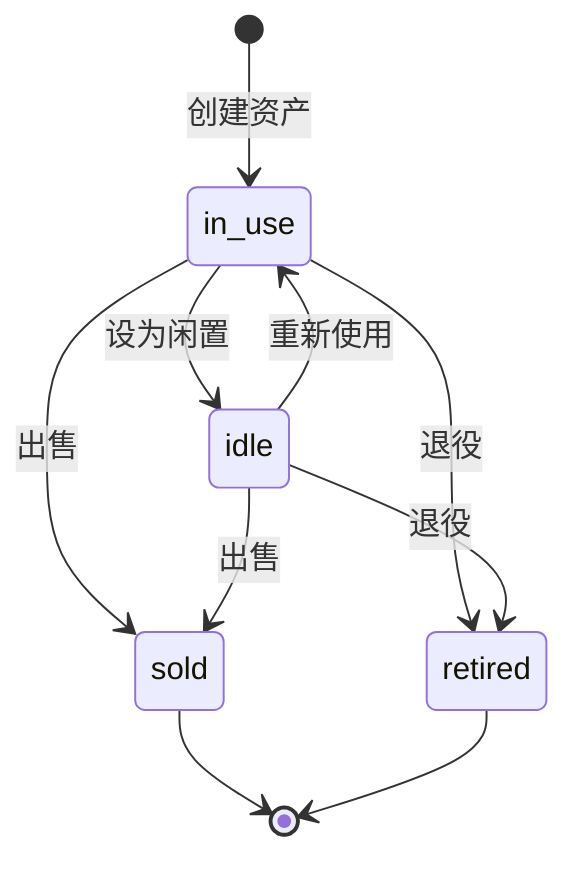

# Data Lifecycle Design

**Date:** 2026-04-20
**Status:** Approved
**Scope:** 资产从购入到处置的完整生命周期管理

---

## Purpose

资产生命周期管理记录资产从购入到处置的完整历程。核心业务价值：
- 明确资产当前状态
- 记录出售盈亏
- 支持退役资产的历史查询

---

## Business Flow



---

## Core Logic

### 状态定义

| 状态 | 含义 | 典型场景 |
|------|------|----------|
| in_use | 服役中 | 正常使用中 |
| idle | 闲置 | 暂时不用，可能复用 |
| sold | 已出售 | 已转让他人 |
| retired | 已退役 | 报废、淘汰 |

### 出售流程

1. 填写出售信息：sell_price、sell_date、sell_fee、sell_channel
2. 状态变为 sold
3. 系统计算出售盈亏：`sell_price - purchase_price - sell_fee`

### 退役流程

1. 填写退役日期：retire_date
2. 状态变为 retired

### 估值历史

资产价值变更时自动记录 AssetValuation，支持价值走势分析。

---

## Code Pointers

| 功能 | 入口文件 | 关键函数 |
|------|----------|----------|
| 资产模型 | `backend/app/models/asset.py` | `class Asset` |
| 状态枚举 | `backend/app/models/asset.py` | `status` 字段 |
| 出售字段 | `backend/app/models/asset.py` | `sell_price`, `sell_date`, `sell_fee`, `sell_channel` |
| 估值历史 | `backend/app/models/valuation.py` | `class AssetValuation` |
| 出售页面 | `frontend/src/pages/AssetSellPage.vue` | — |

---

## Design Decisions

### 状态流转设计

采用有限状态机模式，状态变更只能通过业务操作触发，不可直接修改状态字段：

- `in_use` → `idle`：设为闲置操作
- `idle` → `in_use`：重新使用操作
- `in_use`/`idle` → `sold`：出售操作（填写出售信息）
- `in_use`/`idle` → `retired`：退役操作（填写退役日期）

出售和退役为终态，不可逆转。

### 出售盈亏计算

出售时自动计算盈亏，公式：`profit = sell_price - purchase_price - sell_fee`

盈亏值存储在 Asset 模型中，支持历史查询和统计分析。

### 估值历史追踪

每次更新 `current_value` 时自动创建 `AssetValuation` 记录，保留：
- 原始价值
- 新价值
- 变更时间
- 备注（可选）

---

## Implementation Details

### Asset 模型字段扩展

出售相关字段：
```python
sell_price: Mapped[float | None]  # 出售价格
sell_date: Mapped[date | None]    # 出售日期
sell_fee: Mapped[float | None]    # 出售费用（中介费、手续费）
sell_channel: Mapped[str | None]  # 出售渠道
```

退役相关字段：
```python
retire_date: Mapped[date | None]  # 退役日期
target_daily_cost: Mapped[float | None]  # 目标日均成本（退役分析）
```

### AssetValuation 模型

```python
class AssetValuation(Base):
    id: Mapped[str]
    asset_id: Mapped[str]  # FK -> assets.id
    value: Mapped[float]   # 估值金额
    valued_at: Mapped[date]  # 估值日期
    notes: Mapped[str | None]  # 备注
```

---

## Verification

- 用户出售资产后，状态变为 `sold`，盈亏计算正确
- 用户退役资产后，状态变为 `retired`，退役日期已填写
- 更新资产价值后，`AssetValuation` 表新增记录
- 已出售/退役资产不可再次修改状态

---

## Code Pointers

| 功能 | 入口文件 | 关键函数 |
|------|----------|----------|
| 资产模型 | `backend/app/models/asset.py` | `class Asset` |
| 状态枚举 | `backend/app/models/asset.py` | `status` 字段 |
| 出售字段 | `backend/app/models/asset.py` | `sell_price`, `sell_date`, `sell_fee`, `sell_channel` |
| 估值历史 | `backend/app/models/valuation.py` | `class AssetValuation` |
| 出售页面 | `frontend/src/pages/AssetSellPage.vue` | — |

---

## Related Specs

- **数据模型**：`2026-04-20-data-models-design.md` — Asset 状态字段、AssetValuation 实体
- **前端组件**：`2026-04-20-frontend-components-design.md` — AssetSellPage