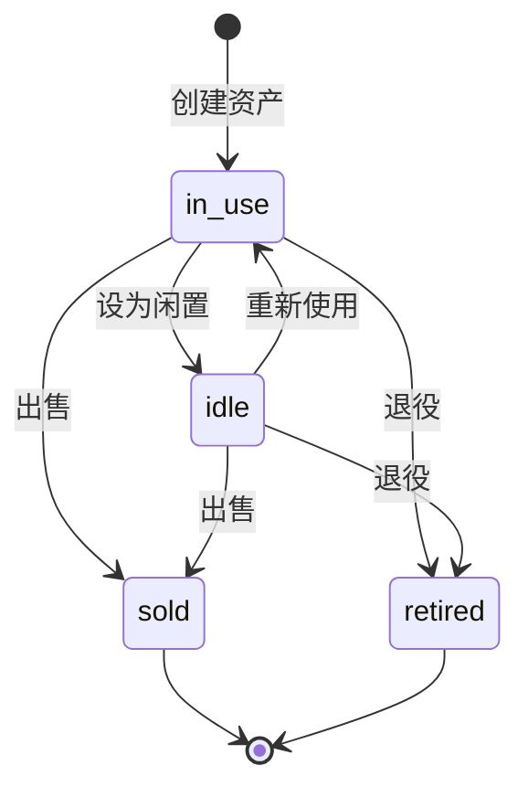

# Data Layer Design

**Date:** 2026-04-21
**Status:** Approved
**Scope:** 数据持久化、实体模型、多数据库支持、缓存层、数据生命周期、导入导出

---

## Problem

1. 数据模型缺乏统一文档，开发者难以理解实体边界和关系
2. 数据库层缺乏抽象，切换数据库需要大量代码修改
3. 缓存功能直接使用内存字典，缺乏抽象层
4. 数据缺乏导入导出功能，用户无法备份和迁移
5. 资产生命周期状态流转不清晰

---

## Goals

1. 定义核心实体及其关系
2. 提供统一数据库后端抽象（SQLite、MySQL、PostgreSQL）
3. 提供统一缓存抽象接口（内存、Redis）
4. 支持 CSV/JSON 导入导出便于备份迁移
5. 定义资产生命周期状态流转

---

## Architecture

### 实体关系图

系统核心实体：User、Family、Asset、Category、Liability、Wish、Activity、AssetValuation、PaymentRecord、Currency、ExchangeRate。

主要关系：
- Family 1:N User（一个家庭多个用户）
- Family 1:N Category（自定义分类）
- Family 1:N AssetSnapshot
- User 1:N Asset（用户拥有资产）
- User 1:N Liability（用户拥有负债）
- User 1:N Wish（用户拥有心愿）
- Asset N:1 Category（资产属于分类）
- Asset N:M Tag（资产多对多标签）
- Liability N:1 Asset（负债可关联资产）
- Wish N:1 Category（心愿属于分类）

### 资产分类体系

系统预定义 21 个资产分类（seeded on startup）：

**实物分类（13个）**：
🏠房产, 🚗车辆, 📱数码, 📺家电, 🛋️家具, 💎珠宝, 👔服饰, 💄美妆, ⚽运动, 🎮玩具, 🐾宠物, 🎸乐器, 👜箱包

**金融分类（8个）**：
🏦存款, 📊基金, 📈股票, 📜债券, 🛡️保险, 💰理财产品, ₿数字货币, 💳其他金融

### 数据库后端抽象

```
backend/app/db/
├── __init__.py          # 导出 get_engine, get_session_factory
├── backend.py           # DatabaseBackend 抽象基类
├── sqlite.py            # SQLiteBackend 实现
├── mysql.py             # MySQLBackend 实现
├── postgres.py          # PostgreSQLBackend 实现
└── factory.py           # create_backend(url) -> DatabaseBackend
```

通过 `DATABASE_URL` 环境变量自动识别数据库类型。

### 缓存后端抽象

```
backend/app/services/cache/
├── base.py        # CacheBackend 抽象接口
├── memory.py      # MemoryCacheBackend 实现
├── redis.py       # RedisCacheBackend 占位
└── factory.py     # get_cache_backend() 工厂函数
```

通过 `CACHE_BACKEND` 配置项选择后端（默认 memory）。

### 资产生命周期状态流转



---

## Implementation Details

### 核心实体定义

#### User
```python
class User(Base):
    id: Mapped[str]
    family_id: Mapped[str]  # FK -> families.id
    username: Mapped[str]   # unique
    display_name: Mapped[str]
    role: Mapped[str]       # 'admin' | 'member'
    avatar_color: Mapped[str]
    default_currency: Mapped[str] = mapped_column(default="CNY")
```

#### Asset
```python
class Asset(Base):
    id: Mapped[str]
    family_id: Mapped[str]  # FK -> families.id
    user_id: Mapped[str]    # FK -> users.id
    category_id: Mapped[str]  # FK -> categories.id
    name: Mapped[str]
    asset_type: Mapped[str]  # 'physical' | 'financial'
    status: Mapped[str]      # 'in_use' | 'idle' | 'sold' | 'retired'
    
    # 价值字段
    purchase_price: Mapped[float]
    current_value: Mapped[float]
    currency: Mapped[str] = mapped_column(default="CNY")
    
    # 出售字段
    sell_price: Mapped[float | None]
    sell_date: Mapped[date | None]
    sell_fee: Mapped[float | None]
    sell_channel: Mapped[str | None]
    
    # 退役字段
    retire_date: Mapped[date | None]
    target_daily_cost: Mapped[float | None]
    
    # 计算字段参数
    expected_lifespan_days: Mapped[int | None]
    annual_maintenance_cost: Mapped[float | None]
    usage_frequency: Mapped[str | None]
```

#### Wish
```python
class Wish(Base):
    id: Mapped[str]
    family_id: Mapped[str]
    user_id: Mapped[str]
    category_id: Mapped[str | None]
    name: Mapped[str]
    description: Mapped[str | None]
    expected_price: Mapped[float]
    currency: Mapped[str] = mapped_column(default="CNY")
    priority: Mapped[str]   # 'high' | 'medium' | 'low'
    status: Mapped[str]     # 'pending' | 'realized' | 'cancelled'
    realized_asset_id: Mapped[str | None]
```

#### Activity
```python
class Activity(Base):
    id: Mapped[str]
    family_id: Mapped[str]
    user_id: Mapped[str]
    type: Mapped[str]       # 'create' | 'update' | 'delete' | 'sell' | 'retire' | 'payment'
    entity_type: Mapped[str]  # 'asset' | 'liability'
    entity_id: Mapped[str]
    title: Mapped[str]
    amount: Mapped[float | None]
```

#### AssetValuation
```python
class AssetValuation(Base):
    id: Mapped[str]
    asset_id: Mapped[str]
    value: Mapped[float]
    valued_at: Mapped[date]
    notes: Mapped[str | None]
```

### 计算字段

计算发生在 router 响应阶段，不存储：
- **daily_cost**: `(purchase_price + annual_maintenance_cost * years) / days_used`
- **return_rate**: `(current_value - purchase_price) / purchase_price * 100`（仅金融资产）

### 数据库后端工厂

```python
BACKEND_MAP = {
    "sqlite": SQLiteBackend,
    "mysql": MySQLBackend,
    "postgresql": PostgreSQLBackend,
}

def create_backend(url: str) -> DatabaseBackend:
    parsed = make_url(url)
    dialect = parsed.drivername.split("+")[0]
    return BACKEND_MAP[dialect]()
```

连接池配置（MySQL/PostgreSQL）：
- pool_size: 10
- max_overflow: 20
- pool_recycle: 3600

### 缓存后端接口

```python
class CacheBackend(ABC):
    def get(self, key: str) -> Any | None
    def set(self, key: str, value: Any, ttl_seconds: int | None = None) -> None
    def delete(self, key: str) -> None
    def increment(self, key: str, delta: int = 1) -> int
    def get_ttl(self, key: str) -> int | None
    def clear(self) -> None
```

### CSV 导出格式

| 字段 | 说明 |
|------|------|
| id | 资产 ID |
| name | 资产名称 |
| category | 分类名称 |
| tags | 标签名称（逗号分隔） |
| asset_type | physical/financial |
| purchase_price | 购买价格 |
| current_value | 当前价值 |
| currency | 币种 |
| purchase_date | 购买日期 |
| status | 状态 |

编码：UTF-8 with BOM（Excel 兼容）

### JSON 全量导出结构

```json
{
  "export_version": "1.0",
  "exported_at": "2026-04-21T10:30:00Z",
  "family": {...},
  "assets": [...],
  "liabilities": [...],
  "wishes": [...],
  "categories": [...],
  "tags": [...]
}
```

### CSV 导入校验规则

| 字段 | 校验规则 |
|------|----------|
| name | 必填、不超过100字符 |
| category | 必填、必须是已存在分类 |
| purchase_price | 必填、必须是数字 |
| currency | 必填、必须是支持的币种 |

---

## Code Pointers

| 实体/功能 | 文件路径 |
|------|----------|
| User | `backend/app/models/user.py` |
| Asset | `backend/app/models/asset.py` |
| Wish | `backend/app/models/wish.py` |
| Activity | `backend/app/models/activity.py` |
| AssetValuation | `backend/app/models/valuation.py` |
| 数据库工厂 | `backend/app/db/factory.py` |
| 缓存接口 | `backend/app/services/cache/base.py` |
| CSV 导出 | `backend/app/routers/export.py` |
| CSV 导入 | `backend/app/routers/import_.py` |

---

## Related Specs

- **API层设计**：`2026-04-21-api-layer-design.md` — CRUD 端点
- **多币种设计**：`2026-03-24-multi-currency-design.md` — Currency、ExchangeRate 实体（独立文档）