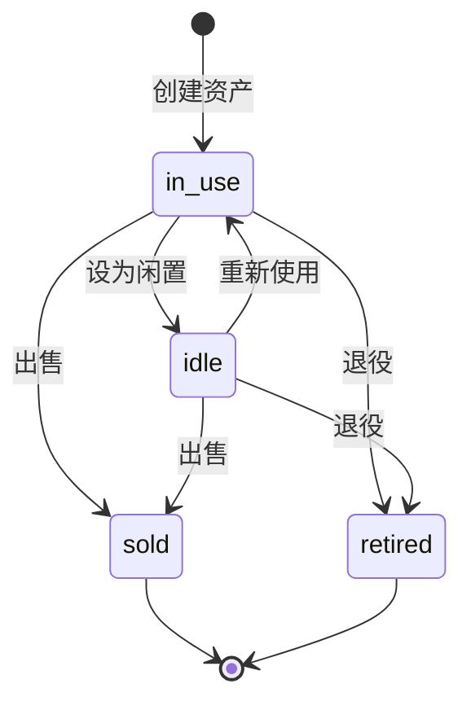
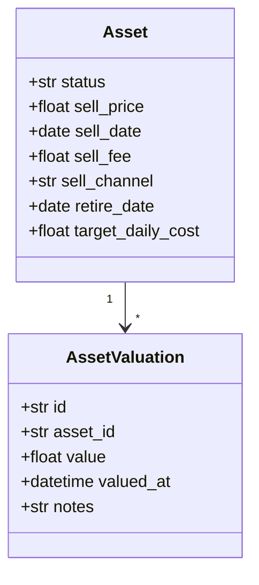

# data-lifecycle Specification

## Purpose

资产生命周期管理定义资产从购入到处置的完整状态流转，包括服役、闲置、出售、退役等阶段，以及相关的业务流程和计算规则。

## ADDED Requirements

### Requirement: 资产必须支持状态流转

资产 SHALL 支持 in_use、idle、sold、retired 四种状态。

#### Scenario: 新建资产默认状态

- **WHEN** 用户创建新资产
- **THEN** 资产状态默认为 in_use

#### Scenario: 资产变为闲置

- **WHEN** 用户将资产状态改为 idle
- **THEN** 资产显示在闲置资产列表中

#### Scenario: 资产被出售

- **WHEN** 用户填写出售信息（价格、日期、渠道、费用）
- **THEN** 资产状态变为 sold，记录出售盈亏

#### Scenario: 资产退役

- **WHEN** 用户填写退役日期
- **THEN** 资产状态变为 retired

### Requirement: 出售资产必须记录详细信息

资产出售 SHALL 记录 sell_price、sell_date、sell_fee、sell_channel 字段。

#### Scenario: 计算出售盈亏

- **WHEN** 资产出售价格填写完成
- **THEN** 系统自动计算出售盈亏 = sell_price - purchase_price - sell_fee

### Requirement: 资产必须支持估值历史

系统 SHALL 提供 AssetValuation 实体记录资产价值变化历史。

#### Scenario: 记录估值变更

- **WHEN** 用户更新资产当前价值
- **THEN** 系统自动创建 AssetValuation 记录

### Requirement: 退役资产必须记录退役日期

资产退役 SHALL 记录 retire_date 字段。

#### Scenario: 记录退役时间

- **WHEN** 用户退役资产
- **THEN** 系统记录当前日期为退役日期

## Data Model

## Status Enum

| 状态 | 中文 | 说明 |
|------|------|------|
| in_use | 服役中 | 正在使用 |
| idle | 闲置 | 暂时未使用 |
| sold | 已出售 | 已转让 |
| retired | 已退役 | 已报废/淘汰 |

## Frontend Pages

- `AssetSellPage.vue` - 资产出售页面
- 出售表单包含：出售价格、出售日期、出售渠道、出售费用