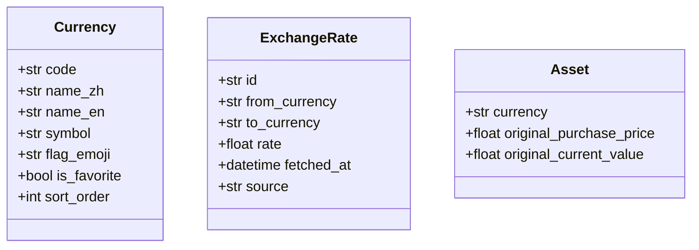

# multi-currency Specification

## Purpose

多币种系统支持用户以不同货币记录资产和负债，提供实时汇率换算功能，确保跨币种资产的可比性和统计准确性。

## ADDED Requirements

### Requirement: 系统必须支持多币种资产和负债

资产和负债 SHALL 支持 currency 字段，默认为 CNY。

#### Scenario: 用户创建外币资产

- **WHEN** 用户创建资产时选择 USD 作为货币
- **THEN** 资产以 USD 记录，同时存储汇率信息

### Requirement: 系统必须维护币种主数据

系统 SHALL 提供 Currency 实体，包含币种代码、名称、符号、国旗 emoji 等信息。

#### Scenario: 用户选择币种

- **WHEN** 用户在币种选择器中浏览
- **THEN** 显示支持的所有币种列表，包含名称和符号

### Requirement: 系统必须自动更新汇率

系统 SHALL 通过定时任务每 2 小时更新一次汇率数据（08:00-22:00）。

#### Scenario: 汇率自动更新

- **WHEN** 定时任务触发
- **THEN** 从汇率 API 获取最新汇率并存储

### Requirement: 统计数据必须支持货币换算

仪表盘统计 SHALL 将所有资产换算为用户默认货币后汇总。

#### Scenario: 查看净资产总览

- **WHEN** 用户查看仪表盘
- **THEN** 所有资产按当前汇率换算为默认货币后显示总净资产

### Requirement: 前端必须提供货币选择器

前端 SHALL 提供 CurrencyPicker、CurrencySelector、CurrencyButton 组件。

#### Scenario: 用户切换显示货币

- **WHEN** 用户点击货币切换按钮
- **THEN** 所有金额按选择货币显示

## Data Model

## API Endpoints

| 方法 | 端点 | 说明 |
|------|------|------|
| GET | /currencies | 获取币种列表 |
| GET | /exchange-rates | 获取汇率列表 |
| POST | /exchange-rates/fetch | 手动触发汇率更新 |

## Scheduled Tasks

- **汇率更新任务**：每 2 小时执行一次（08:00-22:00），随机延迟 0-15 分钟
- 代码位置：`backend/app/scheduler.py`

## Frontend Components

- `CurrencyPicker.vue` - 币种选择器
- `CurrencySelector.vue` - 币种下拉选择
- `CurrencyButton.vue` - 货币切换按钮
- `MoneyDisplay.vue` - 金额显示组件（支持货币符号）

## Composables

- `useCurrency.ts` - 货币状态管理
- `useExchangeRate.ts` - 汇率换算逻辑