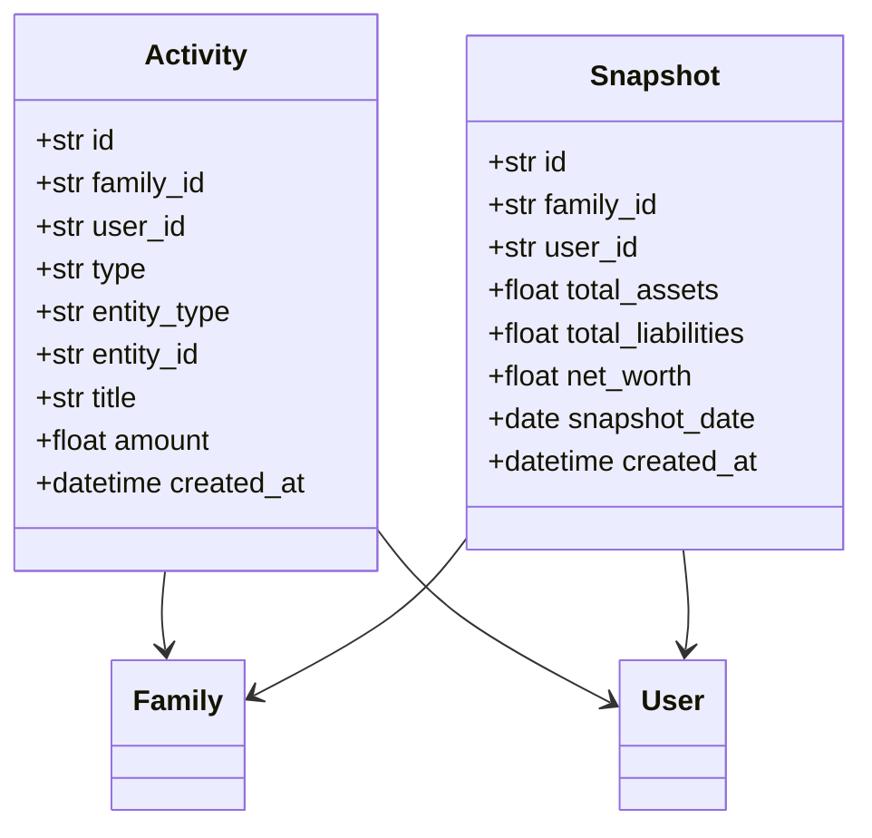

# observability Specification

## Purpose

可观测性系统记录用户的操作历史和资产状态快照，帮助用户追溯资产变更历史，支持数据审计和回溯分析。

## ADDED Requirements

### Requirement: 系统必须记录操作日志

系统 SHALL 为关键操作创建 Activity 日志记录。

#### Scenario: 记录资产创建

- **WHEN** 用户创建资产
- **THEN** 系统创建 type=create 的 Activity 记录

#### Scenario: 记录资产更新

- **WHEN** 用户更新资产价值
- **THEN** 系统创建 type=update 的 Activity 记录

#### Scenario: 记录负债还款

- **WHEN** 用户记录负债还款
- **THEN** 系统创建 type=payment 的 Activity 记录

### Requirement: 操作日志必须包含关键信息

Activity SHALL 记录 family_id、user_id、type、entity_type、entity_id、title、amount 字段。

#### Scenario: 查看操作日志

- **WHEN** 用户查看活动历史
- **THEN** 显示操作时间、类型、关联实体、金额变化

### Requirement: 系统必须支持资产快照

系统 SHALL 提供快照功能，定期或手动记录家庭资产总额状态。

#### Scenario: 手动创建快照

- **WHEN** 用户点击"生成快照"
- **THEN** 系统记录当前所有资产总额

#### Scenario: 查看历史快照

- **WHEN** 用户访问快照列表
- **THEN** 显示历史快照的时间和净资产总额

## Data Model

## Activity Types

| 类型 | 说明 |
|------|------|
| create | 创建资产/负债 |
| update | 更新资产/负债 |
| delete | 删除资产/负债 |
| sell | 出售资产 |
| retire | 退役资产 |
| payment | 负债还款 |

## API Endpoints

| 方法 | 端点 | 说明 |
|------|------|------|
| GET | /activities | 获取活动日志列表 |
| GET | /family/snapshots | 获取快照列表 |
| POST | /family/snapshots/generate | 手动生成快照 |

## Frontend

- 活动日志入口：Dashboard 或详情页
- 快照入口：家庭管理页面