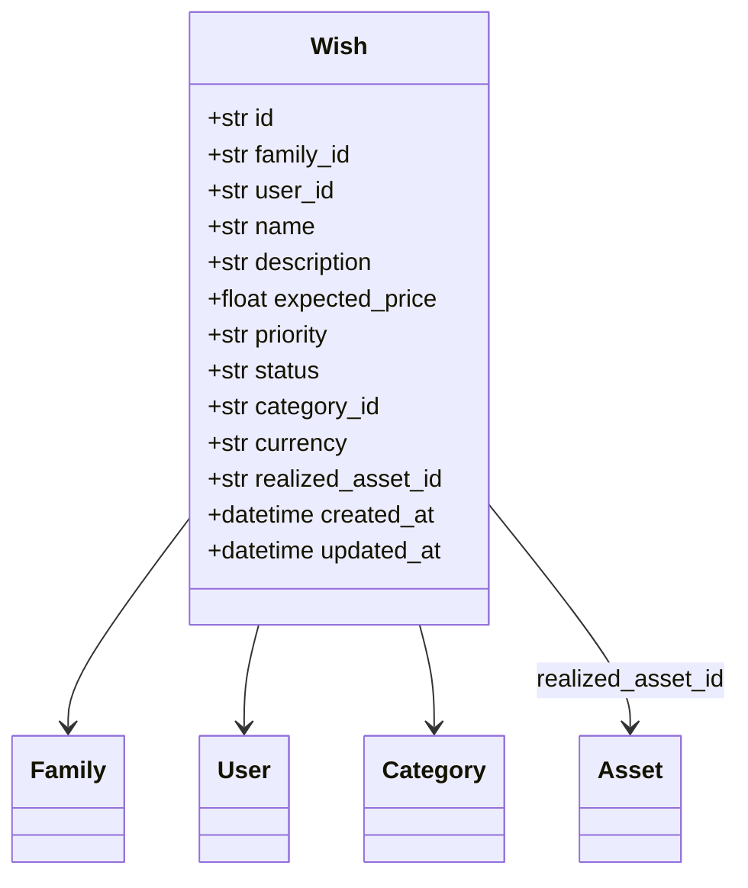

# wish-system Specification

## Purpose

心愿单系统允许用户记录和管理想要购买的物品或服务，支持优先级管理、目标价格设定、以及将心愿实现为资产的功能。心愿单帮助用户规划消费计划，追踪购买意愿。

## ADDED Requirements

### Requirement: 心愿单必须支持 CRUD 操作

系统 SHALL 提供心愿单的创建、读取、更新、删除功能。

#### Scenario: 用户创建心愿

- **WHEN** 用户填写心愿名称、预期价格、目标日期等信息并提交
- **THEN** 系统创建心愿记录并返回成功

#### Scenario: 用户查看心愿列表

- **WHEN** 用户访问心愿列表页面
- **THEN** 系统返回按优先级排序的心愿列表

### Requirement: 心愿必须支持优先级管理

心愿 SHALL 支持 low/medium/high 三级优先级，默认为 medium。

#### Scenario: 用户设置心愿优先级

- **WHEN** 用户创建或编辑心愿时选择优先级
- **THEN** 心愿按优先级排序显示

### Requirement: 心愿必须支持状态流转

心愿 SHALL 支持 pending/realized/cancelled 三种状态。

#### Scenario: 心愿状态为待处理

- **WHEN** 用户创建新心愿
- **THEN** 心愿状态默认为 pending

#### Scenario: 心愿实现为资产

- **WHEN** 用户点击"实现心愿"并填写资产信息
- **THEN** 心愿状态变为 realized，同时创建对应的资产记录

### Requirement: 心愿必须关联分类

心愿 SHALL 关联一个资产分类，用于标识心愿的类型。

#### Scenario: 用户选择心愿分类

- **WHEN** 用户创建心愿时选择分类
- **THEN** 心愿记录关联对应的分类 ID

### Requirement: 心愿可以关联已实现的资产

当心愿实现时，SHALL 记录关联的资产 ID。

#### Scenario: 查看已实现心愿的资产

- **WHEN** 用户查看已实现的心愿详情
- **THEN** 显示关联的资产链接

## Data Model

## API Endpoints

| 方法 | 端点 | 说明 |
|------|------|------|
| GET | /wishes | 获取心愿列表 |
| POST | /wishes | 创建心愿 |
| GET | /wishes/{id} | 获取心愿详情 |
| PUT | /wishes/{id} | 更新心愿 |
| DELETE | /wishes/{id} | 删除心愿 |
| POST | /wishes/{id}/realize | 实现心愿为资产 |

## Frontend Pages

- `WishListPage.vue` - 心愿列表页
- `WishFormPage.vue` - 心愿表单页（新建/编辑）
- `WishDetailPage.vue` - 心愿详情页