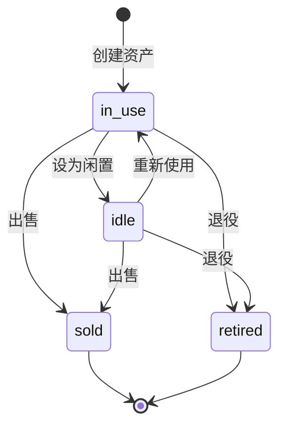

# data-lifecycle Specification

## Purpose

资产生命周期管理记录资产从购入到处置的完整历程。核心业务价值：
- 明确资产当前状态
- 记录出售盈亏
- 支持退役资产的历史查询

## Business Flow

## Core Logic

### 状态定义

| 状态 | 含义 | 典型场景 |
|------|------|----------|
| in_use | 服役中 | 正常使用中 |
| idle | 闲置 | 暂时不用，可能复用 |
| sold | 已出售 | 已转让他人 |
| retired | 已退役 | 报废、淘汰 |

### 出售流程

1. 填写出售信息：sell_price、sell_date、sell_fee、sell_channel
2. 状态变为 sold
3. 系统计算出售盈亏：`sell_price - purchase_price - sell_fee`

### 退役流程

1. 填写退役日期：retire_date
2. 状态变为 retired

### 估值历史

资产价值变更时自动记录 AssetValuation，支持价值走势分析。

## Code Pointers

| 功能 | 入口文件 | 关键函数 |
|------|----------|----------|
| 资产模型 | `backend/app/models/asset.py` | `class Asset` |
| 状态枚举 | `backend/app/models/asset.py` | `status` 字段 |
| 出售字段 | `backend/app/models/asset.py` | `sell_price`, `sell_date`, `sell_fee`, `sell_channel` |
| 估值历史 | `backend/app/models/valuation.py` | `class AssetValuation` |
| 出售页面 | `frontend/src/pages/AssetSellPage.vue` | — |

## Requirements

### Requirement: 资产必须支持四种状态

资产 SHALL 支持 in_use、idle、sold、retired 四种状态，状态变更通过业务操作触发。

#### Scenario: 用户出售资产

- **WHEN** 用户填写出售信息并提交
- **THEN** 资产状态变为 sold

### Requirement: 出售资产必须记录盈亏

资产出售时系统 SHALL 自动计算出售盈亏 = sell_price - purchase_price - sell_fee。

#### Scenario: 计算出售盈亏

- **WHEN** 用户填写出售价格和费用
- **THEN** 系统显示出售盈亏

### Requirement: 资产价值变更必须记录历史

用户更新资产当前价值时，系统 SHALL 自动创建 AssetValuation 记录。

#### Scenario: 更新资产价值

- **WHEN** 用户更新资产当前价值
- **THEN** 系统创建 AssetValuation 历史记录

## Related Specs

- **数据模型**：`data-models/spec.md` — Asset 状态字段、AssetValuation 实体
- **前端组件**：`frontend-components/spec.md` — AssetSellPage