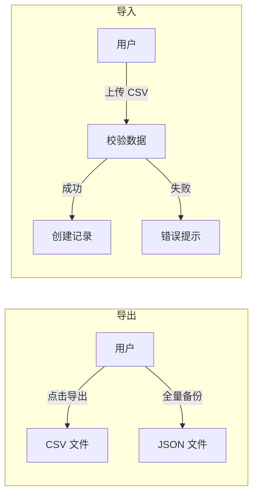

# data-portability Specification

## Purpose

数据导入导出支持数据备份和迁移。核心业务价值：
- CSV 格式：便于 Excel 查看、批量编辑
- JSON 格式：全量备份，支持版本管理
- 图片上传：资产可视化识别

## Business Flow

## Core Logic

### CSV 导出

- 资产 CSV：包含所有资产字段 + 分类名称 + 标签名称
- 负债 CSV：包含所有负债字段
- 编码：UTF-8 with BOM（Excel 兼容）

### JSON 导出

- 版本字段：export_version（支持未来格式升级）
- 全量数据：资产、负债、心愿、分类、标签
- 时间戳：exported_at

### CSV 导入

- 校验：字段格式、必填字段
- 错误处理：返回行号 + 错误信息
- 关联数据：自动匹配分类、标签

## Code Pointers

| 功能 | 入口文件 | 关键函数 |
|------|----------|----------|
| CSV 导出 | `backend/app/routers/export.py` | `export_assets_csv` |
| JSON 导出 | `backend/app/routers/export.py` | `export_all_json` |
| CSV 导入 | `backend/app/routers/import_.py` | `import_assets_csv` |
| 图片上传 | `backend/app/routers/upload.py` | `upload_image` |

## Requirements

### Requirement: 系统必须支持 CSV 导出

系统 SHALL 提供资产和负债的 CSV 格式导出，包含关联数据（分类名称、标签名称）。

### Requirement: 系统必须支持 JSON 全量备份

系统 SHALL 提供全量数据 JSON 导出，包含 export_version 字段用于版本管理。

### Requirement: 导入必须提供错误反馈

CSV 导入失败时，系统 SHALL 返回具体行号和错误信息。

## Related Specs

- **API 端点**：`api-spec/spec.md` — /export、/import、/upload 端点