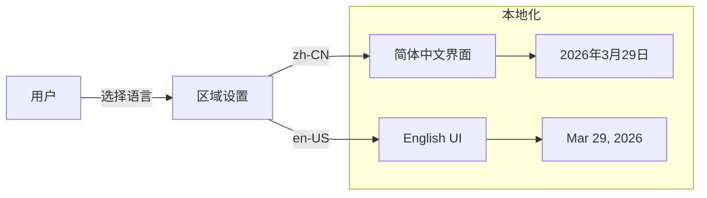

# i18n Specification

## Purpose

国际化系统支持多语言界面。核心业务价值：
- 支持多语言用户
- 本地化货币、日期格式
- 便于国际化扩展

## Business Flow

## Core Logic

### 支持语言

| 语言代码 | 语言名称 | 完成度 |
|----------|----------|--------|
| zh-CN | 简体中文 | 100% |
| en-US | English | 100% |

### 翻译 Key 命名

格式：`模块.功能.具体文本`

示例：
- `asset.title` → "资产"
- `asset.status.in_use` → "服役中"
- `common.save` → "保存"

### 本地化格式

| 类型 | zh-CN | en-US |
|------|-------|-------|
| 日期 | 2026年3月29日 | Mar 29, 2026 |
| 金额 | ¥1,234.56 | ¥1,234.56 |

## Code Pointers

| 功能 | 入口文件 |
|------|----------|
| i18n 配置 | `frontend/src/i18n/index.ts` |
| 中文翻译 | `frontend/src/i18n/locales/zh-CN.ts` |
| 英文翻译 | `frontend/src/i18n/locales/en-US.ts` |

## Requirements

### Requirement: 系统必须支持多语言

系统 SHALL 支持 zh-CN 和 en-US 两种语言，用户可切换界面语言。

### Requirement: 翻译 Key 必须遵循命名约定

翻译 Key SHALL 使用点分隔的层级命名格式：`模块.功能.具体文本`。

## Related Specs

- **前端组件**：`frontend-components/spec.md` — i18n 使用方式