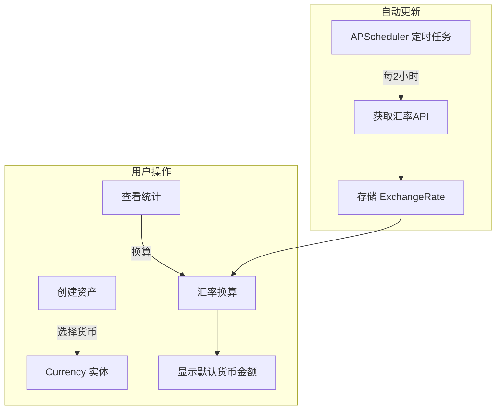

# multi-currency Specification

## Purpose

多币种系统确保跨币种资产的可比性和统计准确性。核心业务价值：
- 支持用户持有多种货币资产
- 自动汇率更新，无需手动维护
- 统计时自动换算为默认货币

## Business Flow

## Core Logic

### 汇率自动更新

- 触发时间：08:00-22:00，每 2 小时
- 随机延迟：0-15 分钟（避免 API 限流）
- 数据来源：外部汇率 API

### 货币换算

换算公式：`amount_in_default = amount * rate`

换算时机：
- 仪表盘统计汇总
- 资产列表排序
- 净资产计算

### 默认货币

- 家庭级别设置：`family.default_currency`
- 默认值：CNY

## Code Pointers

| 功能 | 入口文件 | 关键函数 |
|------|----------|----------|
| 汇率定时任务 | `backend/app/scheduler.py` | `fetch_rates_job` |
| 汇率服务 | `backend/app/services/exchange_rate.py` | `ExchangeRateService` |
| 币种模型 | `backend/app/models/currency.py` | `class Currency` |
| 汇率模型 | `backend/app/models/exchange_rate.py` | `class ExchangeRate` |
| 币种选择器 | `frontend/src/components/common/CurrencyPicker.vue` | — |
| 汇率 Composable | `frontend/src/composables/useExchangeRate.ts` | `convert` |

## Requirements

### Requirement: 系统必须自动更新汇率

APScheduler SHALL 每 2 小时自动获取并存储最新汇率数据（08:00-22:00）。

#### Scenario: 汇率定时更新

- **WHEN** 定时任务触发
- **THEN** 系统获取最新汇率并存储到 ExchangeRate 表

### Requirement: 统计数据必须换算为默认货币

仪表盘汇总 SHALL 将所有资产按当前汇率换算为家庭默认货币后显示。

#### Scenario: 查看净资产总览

- **WHEN** 用户查看仪表盘
- **THEN** 所有外币资产按当前汇率换算为默认货币后显示

### Requirement: 前端必须提供货币选择组件

前端 SHALL 提供 CurrencyPicker、CurrencySelector、CurrencyButton 组件支持货币选择和切换。

#### Scenario: 用户选择货币

- **WHEN** 用户创建资产时选择货币
- **THEN** 资产以选定货币记录

## Related Specs

- **数据模型**：`data-models/spec.md` — Currency、ExchangeRate 实体
- **API 端点**：`api-spec/spec.md` — /currencies、/exchange-rates