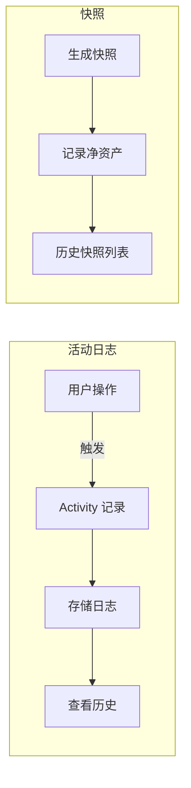

# observability Specification

## Purpose

可观测性系统记录用户操作历史和资产状态快照。核心业务价值：
- 追溯资产变更历史
- 审计用户操作
- 支持历史数据对比

## Business Flow

## Core Logic

### Activity 日志

触发时机：
- 资产创建/更新/删除/出售/退役
- 负债创建/更新/还款

记录内容：
- 操作类型：type（create/update/delete/sell/retire/payment）
- 关联实体：entity_type + entity_id
- 金额变化：amount（如有）

### Snapshot 快照

记录内容：
- 总资产、总负债、净资产
- 生成时间、操作用户

触发方式：
- 手动：用户点击"生成快照"
- 自动：可配置定时快照

## Code Pointers

| 功能 | 入口文件 | 关键函数 |
|------|----------|----------|
| Activity 模型 | `backend/app/models/activity.py` | `class Activity` |
| Activity 服务 | `backend/app/services/activity.py` | `log_activity` |
| Snapshot 模型 | `backend/app/models/snapshot.py` | `class Snapshot` |
| Activity 端点 | `backend/app/routers/activities.py` | `list_activities` |

## Requirements

### Requirement: 关键操作必须记录日志

资产和负债的创建、更新、删除、出售、退役、还款操作 SHALL 自动创建 Activity 记录。

### Requirement: 快照必须记录净资产

Snapshot SHALL 记录生成时刻的总资产、总负债、净资产。

## Related Specs

- **数据模型**：`data-models/spec.md` — Activity、Snapshot 实体
- **API 端点**：`api-spec/spec.md` — /activities、/family/snapshots