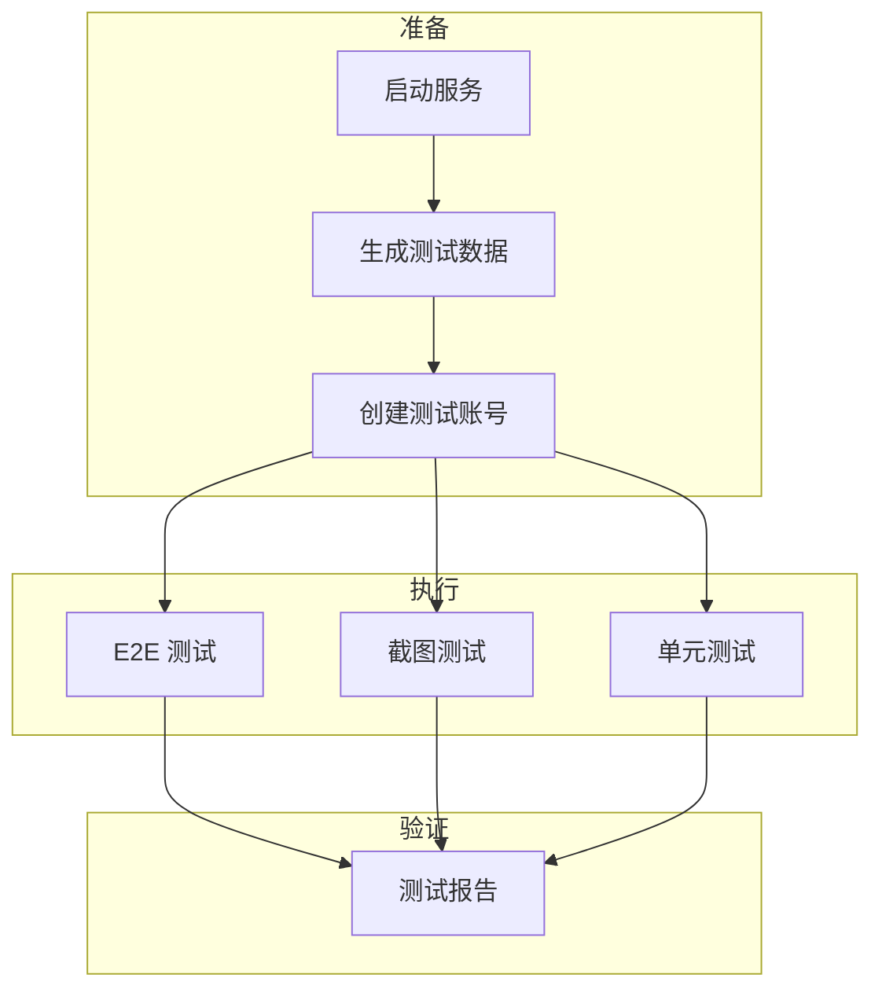

# testing Specification

## Purpose

测试规范确保所有测试使用统一的账号、数据和环境，避免重复创建测试用户和数据冲突。核心业务价值：
- 测试结果可重复、可验证
- 避免测试数据污染生产数据
- 便于 CI/CD 集成

## Business Flow

## Core Logic

### 统一测试账号

| 字段 | 值 |
|------|----|
| 用户名 | `demouser` |
| 密码 | `DemoPass123` |
| 家庭名 | `Demo Family` |

账号由 `tests/data/seed-data.sh` 首次运行时自动创建（先登录，失败则注册）。

### 测试数据范围

| 类型 | 数量 | 总额参考 |
|------|------|----------|
| 实物资产 | 19 项 | — |
| 金融资产 | 11 项 | — |
| 负债 | 3 项 | ¥5,480,000 |
| 心愿 | 5 项 | — |

### 测试分类

| 测试类型 | 位置 | 运行方式 |
|----------|------|----------|
| E2E 测试 | `tests/e2e/` | Shell 脚本 |
| 截图测试 | `tests/screenshot/` | Node.js + Puppeteer |
| 单元测试 | `backend/tests/` | pytest |

## Code Pointers

| 功能 | 入口文件 | 说明 |
|------|----------|------|
| 测试数据生成 | `tests/data/seed-data.sh` | 完整测试数据 |
| E2E 验收测试 | `tests/e2e/acceptance.sh` | API 验收 |
| E2E 扩展测试 | `tests/e2e/extended.sh` | CRUD 测试 |
| 截图测试 | `tests/screenshot/capture.js` | 17 个页面截图 |
| 后端单元测试 | `backend/tests/` | pytest |

## Requirements

### Requirement: 所有测试必须使用统一账号

测试脚本 SHALL 使用 `demouser` / `DemoPass123` 账号，避免创建重复测试用户。

#### Scenario: 测试脚本登录

- **WHEN** 测试脚本启动
- **THEN** 使用 demouser 账号登录获取 token

### Requirement: 测试数据生成必须可重复

测试数据生成脚本 SHALL 支持重复运行，不产生重复数据。

#### Scenario: 重复运行数据生成

- **WHEN** 用户重复运行 seed-data.sh
- **THEN** 已存在的数据不重复创建

### Requirement: 截图测试必须覆盖核心页面

截图测试 SHALL 覆盖登录、仪表盘、资产、负债、心愿、设置等核心页面。

#### Scenario: 截图覆盖验证

- **WHEN** 截图测试完成
- **THEN** 生成至少 15 个页面的截图文件

## Related Specs

- **测试规范文档**：`tests/docs/TEST_SPEC.md` — 详细测试说明
- **测试目录**：`tests/README.md` — 测试套件说明