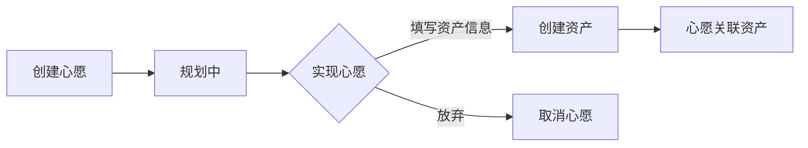

# wish-system Specification

## Purpose

心愿单帮助用户规划消费计划，记录想要购买的物品或服务。核心业务价值：
- 记录购买意愿，避免冲动消费
- 优先级排序，明确消费计划
- 心愿实现时自动创建资产，形成闭环

## Business Flow

## Core Logic

### 心愿生命周期

| 状态 | 触发条件 | 后续动作 |
|------|----------|----------|
| pending | 创建心愿 | — |
| realized | 用户点击"实现" | 创建资产，关联 asset_id |
| cancelled | 用户取消 | — |

### 优先级排序

心愿按 priority 字段排序：high > medium > low

### 心愿实现为资产

核心业务逻辑：
1. 心愿状态变为 realized
2. 基于心愿信息创建资产记录
3. 心愿记录 realized_asset_id 关联新资产

## Code Pointers

> 以下代码入口可通过 LSP 逐层分析了解详细实现

### 后端入口

| 功能 | 入口文件 | 关键函数 |
|------|----------|----------|
| 心愿 CRUD | `backend/app/routers/wishes.py` | `create_wish`, `list_wishes` |
| 实现心愿 | `backend/app/routers/wishes.py:38` | `realize_wish` |
| 数据模型 | `backend/app/models/wish.py` | `class Wish` |

### 前端入口

| 功能 | 入口文件 |
|------|----------|
| 心愿列表 | `frontend/src/pages/WishListPage.vue` |
| 心愿表单 | `frontend/src/pages/WishFormPage.vue` |
| 心愿详情 | `frontend/src/pages/WishDetailPage.vue` |

### 关联 Spec

- **数据模型**：`data-models/spec.md` — Wish 实体字段定义
- **API 端点**：`api-spec/spec.md` — /wishes 端点列表
- **前端组件**：`frontend-components/spec.md` — 心愿相关页面

## Requirements

### Requirement: 心愿必须支持状态流转

心愿 SHALL 支持 pending、realized、cancelled 三种状态，状态变更通过业务操作触发。

### Requirement: 心愿实现时必须创建资产

当心愿状态变为 realized 时，系统 SHALL 自动创建对应的资产记录，并关联 realized_asset_id。

### Requirement: 心愿必须支持优先级

心愿 SHALL 支持 high、medium、low 三级优先级，列表按优先级排序显示。